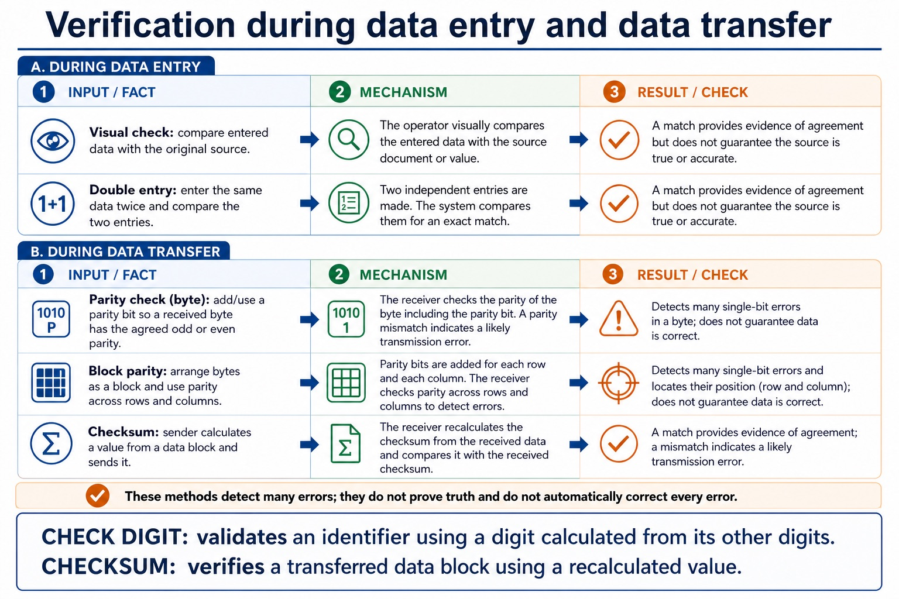

# Lesson 034: Validation, verification, parity and checksums

**Course:** Cambridge International AS Level Computer Science 9618, 2027-2029 Version 2 
**Paper:** Paper 1 
**Syllabus:** Section 6: Security, privacy and data integrity 
**Syllabus requirements:** S6.07, S6.08 
**Pacing:** Flexible. This lesson is deliberately over-complete; select a quick, full or deep route for the learners in front of you.

## Teaching-depth menu

- **Quick route:** Use the diagnostic, learning objectives, first worked example and foundation question. Stop once the learner can explain the central distinction accurately.
- **Full route:** Teach every core explanation point, the worked example and all lesson questions. Use the visual only when it adds a different representation.
- **Deep route:** Add the prerequisite refresher, ask learners to connect the concept checklist, discuss the labelled extension and complete a transfer question without a model answer.

## 1. Prerequisite knowledge and quick diagnostic

Recall S6.01 before starting this lesson.

Ask the learner to give one accurate definition or method step before continuing. If they cannot, briefly revisit the named prerequisite rather than repeating the whole previous lesson.

### Optional prerequisite refresher

- Distinguish data security, data privacy and data integrity as separate concepts; evidence must not treat confidentiality, lawful/appropriate use and correctness/consistency as interchangeable.
- Distinguish data security, privacy and integrity.

## 2. Knowledge explanation

### Learning objectives

- Describe how data validation and data verification help protect the integrity of data; describe and use methods of data validation.
- Understand verification: visual and double entry; parity byte/block and checksum.

### Concept checklist for teacher choice

- range check
- format check
- length check
- presence check
- existence check
- limit check
- check digit
- verification
- integrity / data integrity
- visual check / visual checking
- double entry
- parity check
- byte
- block parity
- checksum

### Detailed explanation

- Validation and verification reduce input, copying and transfer errors and therefore help protect data integrity. Validation methods include range, format, length, presence, existence and limit checks, plus a check digit.
- Describe and use verification during data entry (visual check and double entry) and during data transfer (parity check on a byte, block parity and checksum).
- Validation checks whether data is reasonable and follows rules: range, format, length, presence, existence, limit and check digit. It cannot prove truth. A range check applies both a lower and an upper bound, such as 0 to 75. A limit check applies one stated upper or lower limit, such as file size no greater than 10 MiB or temperature at least -20 degrees Celsius.
- A format check tests a required pattern; a length check tests the number of characters; a presence check rejects a blank required field; an existence check confirms a value is stored in a specified lookup file; and a check digit is calculated from the other digits and compared. Verification checks whether data was copied accurately, using visual checking or double entry.
- Error detection includes parity: a parity byte checks one group and block parity adds row/column checks; a checksum is calculated from a data block and compared after transmission. These detect many errors but do not correct every error.
- A parity check compares the expected odd or even parity of a byte; block parity adds row and column evidence.
- Data validation and data verification help protect data integrity by detecting or preventing many input, copying and transfer errors before inaccurate or corrupted data are accepted. They reduce these risks but do not prove that the original source is true or replace access control and backup.

### Worked example

Validate input, then verify a transferred record: A 10 MiB maximum uses an upper limit check because it has one permitted limit; a mark from 0 to 75 uses a range check because it has both lower and upper bounds. A product code uses presence, length, format, existence and check-digit rules. During entry, visual checking or double entry compares values. During transfer, byte parity detects many single-bit errors, block parity adds row/column evidence and a checksum is recalculated from the received data block.

Beyond syllabus / 延伸知识（不要求背诵）: real security uses defence in depth, combining controls so that one failed control does not expose the whole system.

### Retained visual explanation

_Verification checks accuracy against the source. The image and mobile text alternative come from one maintained fact source._

## 3. Practice by question type

### Question 1 - foundation - explain - 2 marks

How do validation and verification help protect data integrity?

**Answer:** They detect or prevent many input, copying and transfer errors, reducing the chance that inaccurate or corrupted data are accepted; they do not prove that the source is true.

**Marking guidance:** Award one mark for each distinct, technically accurate point or method step.

**Common error:** For the command word explain, perform that exact action; do not replace it with an unrelated fact.

### Question 2 - application - draw - 2 marks

Draw lines to match each rule to its validation check: AA1234 follows two letters then four digits; a code has exactly six characters; a required name is not blank; a barcode includes a digit calculated from the other digits.

**Answer:** Format check; length check; presence check; check digit, respectively.

**Marking guidance:** Award one mark for each distinct, technically accurate point or method step.

**Common error:** Do not repeat the same point in different words; each mark needs a separate idea or method step.

### Question 3 - transfer - explain - 2 marks

How does double-entry verification work?

**Answer:** Data is entered twice and the two entries are compared.

**Marking guidance:** Award one mark for each distinct, technically accurate point or method step.

**Common error:** Do not copy the worked example unchanged; transfer the method and check it against the new context.

### Related past-paper indexes

| Reference | Marks | Command word | Question type |
|---|---:|---|---|
| 9618/12/W/25 Q1 | 2 | draw | diagram |
| 9618/11/S/24 Q5(b) | 5 | complete | recall |
| 9618/11/S/24 Q5(ii) | 4 | complete | recall |
| 9618/11/S/24 Q5(i) | 3 | complete | recall |

These are indexes only. Cambridge question and mark-scheme wording is not reproduced.

## 4. Summary and exam reminders

### Summary

- Define validation, verification, parity and checksums with the exact technical vocabulary expected by the syllabus.
- Use the lesson method on a fresh context and show the intermediate decision, representation or calculation.
- Match the shape of the answer to the command word and the available marks.
- Check the final answer against the scenario instead of repeating a memorised sentence.

### Common error to correct

Students often propose encryption for every problem. Correction: encryption protects confidentiality but does not fix poor permissions, phishing or missing backups.

### Exam technique

- Follow the command word: state gives a fact; explain links a cause to a consequence; compare covers both sides.
- Match the number of independent points or method steps to the available marks.
- For validation, verification, parity and checksums, use the exact technical term before applying it to the scenario.
