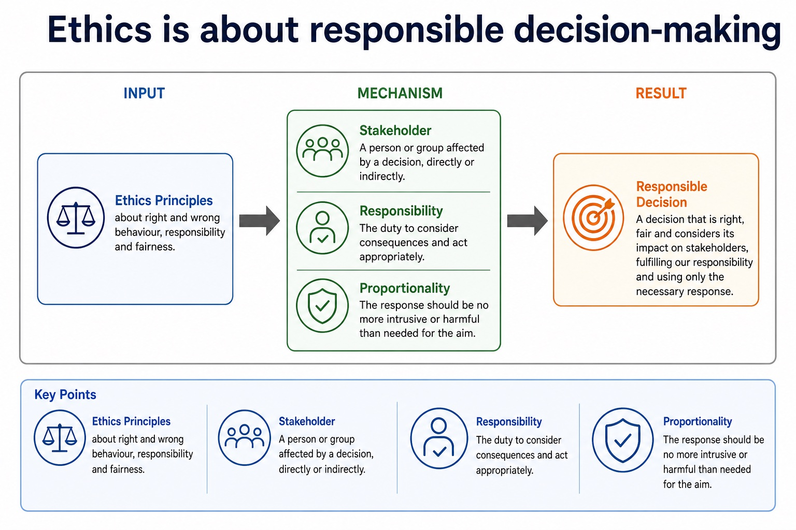
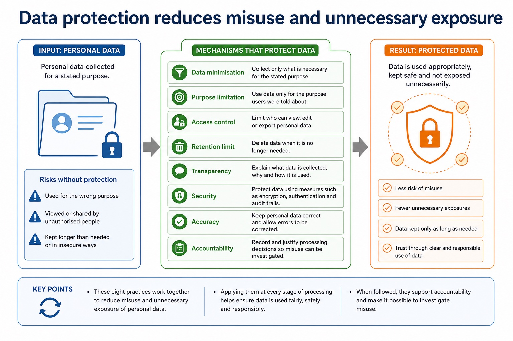
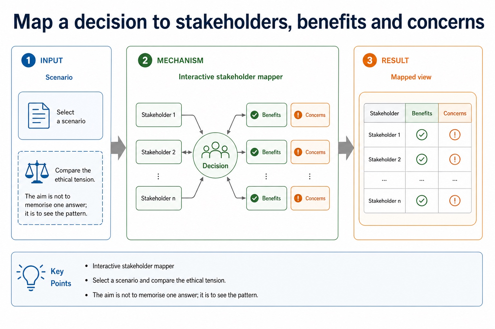
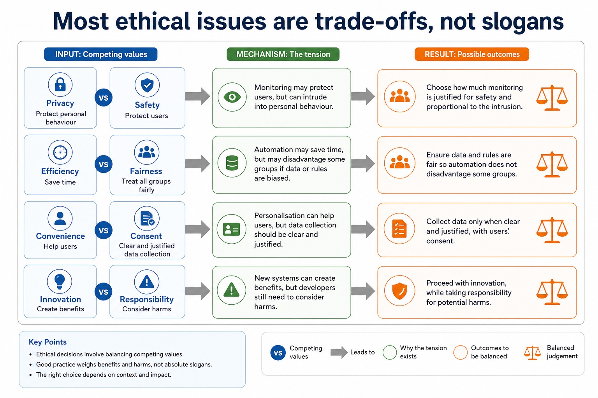
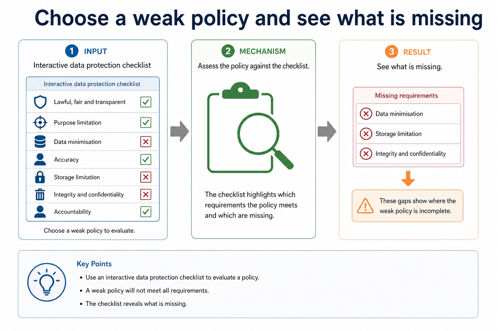
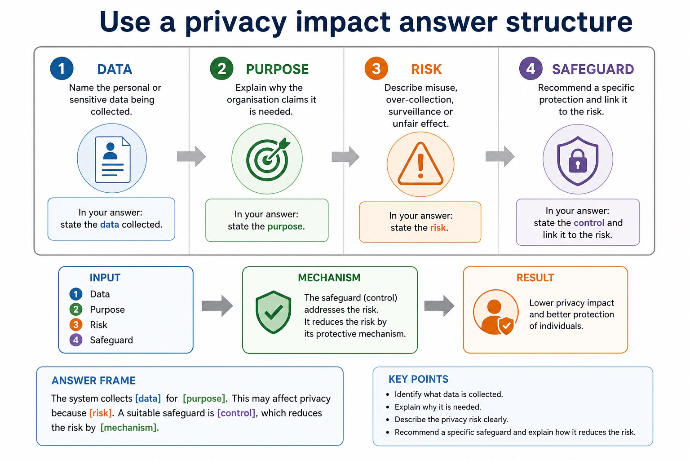
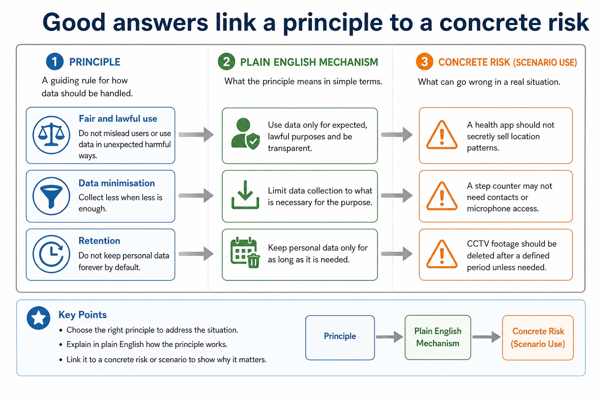
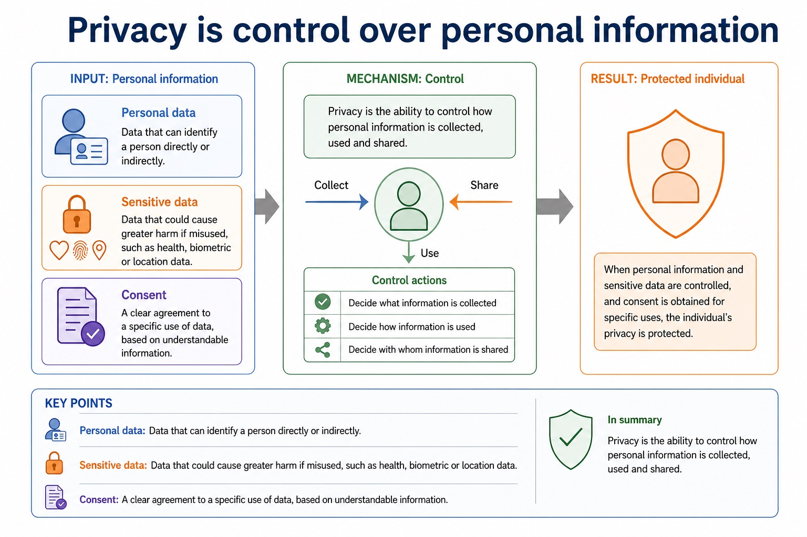
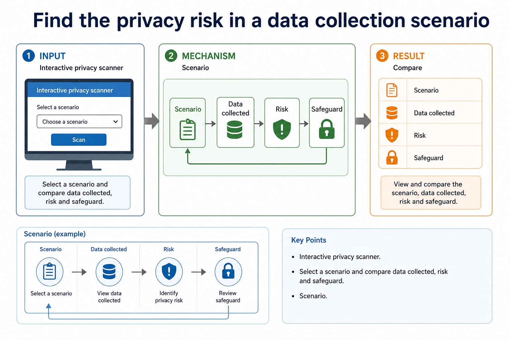
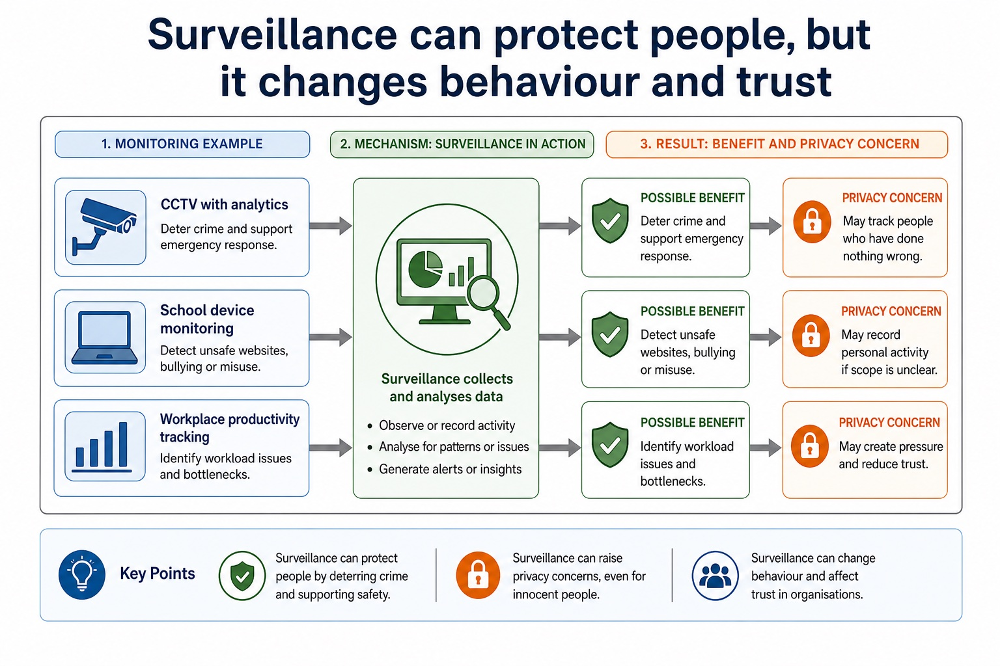

# Lesson 035: Professional ethics and professional bodies

**Course:** Cambridge International AS Level Computer Science 9618, 2027-2029 Version 2 
**Paper:** Paper 1 
**Syllabus:** Section 7: Ethics and ownership 
**Syllabus requirements:** S7.01, S7.02 
**Pacing:** Flexible. Select the material set and practice depth needed by the learner.

## Teaching-depth menu

- **Quick route:** Use the diagnostic, learning objectives, first worked example and foundation question. Stop once the learner can explain the central distinction accurately.
- **Full route:** Use every knowledge-point material set, the worked method, the terminology check and all questions.
- **Deep route:** Add the prerequisite refresher, ask learners to connect the concept checklist, discuss the labelled extension and complete a transfer question without a model answer.

## 1. Prerequisite knowledge and quick diagnostic

Recall the main conclusion from Lesson 034: Validation, verification, parity and checksums.

Ask the learner to give one accurate definition or method step before continuing. If they cannot, briefly revisit the named prerequisite rather than repeating the whole previous lesson.

## 2. Knowledge explanation

### 1. Professional ethics and its purpose (S7.01)

**Concept map:** professional → ethics → purpose

**Three-part explanation:**

1. evidence must connect responsible professional decisions to public interest, competence and accountability
2. Its purpose is to protect the public interest, support competent and honest work, and make professionals accountable for foreseeable consequences rather than treating legal compliance or…
3. Version 2 requires both the need for professional ethics and its purpose

**Concrete cue:** Version 2 requires both the need for professional ethics and its purpose; evidence must connect responsible professional decisions to public interest, competence and accountability.

#### Ethics is about responsible decision-making

Text transcript

- Ethics Principles about right and wrong behaviour, responsibility and fairness.
- Stakeholder A person or group affected by a decision, directly or indirectly.
- Responsibility The duty to consider consequences and act appropriately.
- Proportionality The response should be no more intrusive or harmful than needed for the aim.

#### Data protection reduces misuse and unnecessary exposure

Text transcript

- Data minimisation Collect only what is necessary for the stated purpose.
- Purpose limitation Use data only for the purpose users were told about.
- Access control Limit who can view, edit or export personal data.
- Retention limit Delete data when it is no longer needed.
- Transparency Explain what data is collected, why and how it is used.
- Security Protect data using measures such as encryption, authentication and audit trails.
- Accuracy Keep personal data correct and allow errors to be corrected.
- Accountability Record and justify processing decisions so misuse can be investigated.

Precise syllabus wording

Show understanding of the need for and purpose of ethics as a computing professional.

Version 2 requires both the need for professional ethics and its purpose; evidence must connect responsible professional decisions to public interest, competence and accountability.

### 2. Professional bodies: BCS and IEEE (S7.02)

**Concept map:** joining → British → Computer → Society → IEEE → codes → conduct

**Three-part explanation:**

1. Joining a professional ethical body such as the British Computer Society (BCS) or the Institute of Electrical and Electronics Engineers (IEEE) provides codes of conduct, guidance,…
2. Evidence must teach why joining matters, not merely expand the abbreviations or mention a code
3. Version 2 names BCS (British Computer Society) and IEEE (Institute of Electrical and Electronics Engineers)

**Concrete cue:** A BCS or IEEE member can use its code and professional guidance when an employer asks them to conceal a safety risk.

Precise syllabus wording

Show understanding of the importance of joining a professional ethical body, including BCS and IEEE.

Version 2 names BCS (British Computer Society) and IEEE (Institute of Electrical and Electronics Engineers). Evidence must teach why joining matters, not merely expand the abbreviations or mention a code.

### Supporting diagram library

#### Map a decision to stakeholders, benefits and concerns

Text transcript

- Interactive stakeholder mapper
- Select a scenario and compare the ethical tension. The aim is not to memorise one answer; it is to see the pattern.
- Scenario

#### Use a balanced evaluation structure

Text transcript

- 1. Context State the decision and the computing system involved.
- 2. For Explain a benefit for a named stakeholder, with scenario detail.
- 3. Against Explain a harm or right that may be affected.
- 4. Judgement Give a justified conclusion with conditions or safeguards.
- Answer frame:
- Although [benefit] helps [stakeholder], [harm] may affect [stakeholder]. Therefore, the decision is justified only if [condition/safeguard].

#### Ethical answers start with stakeholders

Text transcript

- Stakeholder
- Possible benefit
- Possible harm or concern
- Users / students / patients
- Better service, safety, convenience, personalisation.
- Loss of privacy, unfair treatment, pressure, exclusion.
- Organisation
- Efficiency, security, reduced cost, legal compliance.

#### Most ethical issues are trade-offs, not slogans

Text transcript

- Privacy vs safety Monitoring may protect users, but can intrude into personal behaviour.
- Efficiency vs fairness Automation may save time, but may disadvantage some groups if data or rules are biased.
- Convenience vs consent Personalisation can help users, but data collection should be clear and justified.
- Innovation vs responsibility New systems can create benefits, but developers still need to consider harms.

#### Choose a weak policy and see what is missing

Text transcript

- Interactive data protection checklist
- Weak policy

#### Use a privacy impact answer structure

Text transcript

- 1. Data Name the personal or sensitive data being collected.
- 2. Purpose Explain why the organisation claims it is needed.
- 3. Risk Describe misuse, over-collection, surveillance or unfair effect.
- 4. Safeguard Recommend a specific protection and link it to the risk.
- Answer frame:
- The system collects [data] for [purpose]. This may affect privacy because [risk]. A suitable safeguard is [control], which reduces the risk by [mechanism].

#### Good answers link a principle to a concrete risk

Text transcript

- Principle
- Plain English
- Scenario use
- Fair and lawful use
- Do not mislead users or use data in unexpected harmful ways.
- A health app should not secretly sell location patterns.
- Data minimisation
- Collect less when less is enough.

#### Privacy is control over personal information

Text transcript

- Privacy The ability to control how personal information is collected, used and shared.
- Personal data Data that can identify a person directly or indirectly.
- Sensitive data Data that could cause greater harm if misused, such as health, biometric or location data.
- Consent A clear agreement to a specific use of data, based on understandable information.

#### Find the privacy risk in a data collection scenario

Text transcript

- Interactive privacy scanner
- Select a scenario and compare data collected, risk and safeguard.
- Scenario

#### Surveillance can protect people, but it changes behaviour and trust

Text transcript

- Monitoring example
- Possible benefit
- Privacy concern
- CCTV with analytics
- Deter crime and support emergency response.
- May track people who have done nothing wrong.
- School device monitoring
- Detect unsafe websites, bullying or misuse.

#### Common contrasts that stop vague answers

Text transcript

- Contrast
- Difference
- Common error
- Privacy vs security
- Privacy concerns control of personal data; security protects systems/data from threats.
- Encryption alone does not answer every privacy ethics question.
- Copyright vs licence
- Copyright protects the work; a licence grants permission under conditions.

#### Section 7 topic map

Text transcript

- Trigger words
- Useful answer focus
- Ethical decisions
- stakeholders, consent, fairness, responsibility, proportionality
- benefits, harms, rights, responsibilities and justified judgement
- Privacy/data protection
- personal data, monitoring, surveillance, retention, access, consent
- data collected, purpose, risk, safeguard and transparency

#### What Cambridge-style marking usually rewards

Text transcript

- Precise term privacy, copyright, e-waste, digital divide, open source, stakeholder.
- Scenario link Explain how the issue affects the school, company, user or worker in the question.
- Consequence Say what happens: exclusion, legal risk, privacy loss, job displacement, reduced emissions.
- Balance Include both benefit and concern before final judgement in evaluate/discuss questions.

#### The five-part evaluation answer

Text transcript

- 1. Context Use the actual scenario, not a memorised opening sentence.
- 2. Benefit Explain one advantage for a named stakeholder.
- 3. Concern Explain one risk, harm or right that may be affected.
- 4. Safeguard Suggest a condition, limit, policy or technical measure.
- 5. Judgement Reach a supported conclusion using "if", "provided that" or "unless".
- Answer frame:
- Although [benefit] helps [stakeholder], [concern] may harm [stakeholder]. Therefore, [decision] is justified only if [condition/safeguard].

Open precise terminology and exam facts

- Version 2 requires both the need for professional ethics and its purpose; evidence must connect responsible professional decisions to public interest, competence and accountability.
- Version 2 names BCS (British Computer Society) and IEEE (Institute of Electrical and Electronics Engineers). Evidence must teach why joining matters, not merely expand the abbreviations or mention a code.
- Professional ethics provides principles for deciding how a computing professional should act when technical choices can affect clients, users, colleagues or wider society. Its purpose is to protect the public interest, support competent and honest work, and make professionals accountable for foreseeable consequences rather than treating legal compliance or a manager's instruction as the whole decision.
- Joining a professional ethical body is important because membership gives a practitioner an explicit code of conduct, current professional guidance, continuing professional development and a community through which standards and misconduct can be challenged. The British Computer Society (BCS) and the Institute of Electrical and Electronics Engineers (IEEE) are the two named syllabus examples. Their codes promote public interest, competence, integrity, privacy and accountability; a code guides judgement but does not replace law.
- For a given situation, decide whether an action is ethical or unethical by identifying the decision, affected stakeholders, benefits, harms, rights and responsibilities. Then explain the impact of acting ethically and the impact of acting unethically. A defensible conclusion applies evidence, proportionality and safeguards; it is not a one-sided list or an unsupported personal opinion.
- Professional ethics has a purpose: computing professionals must protect public interest, work competently and remain accountable for consequences. Joining a professional ethical body such as the British Computer Society (BCS) or the Institute of Electrical and Electronics Engineers (IEEE) provides codes of conduct, guidance, continuing professional development and a community that supports standards. In a situation, judge whether action is ethical or unethical and explain stakeholder impacts of both choices.

### Worked example

1. Unsafe release pressure
2. A developer is told to hide failed safety tests so a medical system can launch on time.
3. Concealing the evidence would be unethical because patients could be harmed and trust would be damaged.
4. The developer acts ethically by documenting the risk, refusing to falsify the record and escalating through BCS/IEEE-style professional channels.
5. This may delay release and cost money, but protects patients, supports accountability and allows the defect to be corrected.

Beyond syllabus / 延伸知识（不要求背诵）: professional decisions are often reviewed against law, organisational policy, public interest and a published code of conduct.
## 3. Practice by question type

### Question 1 - foundation - identify - 2 marks

Identify the two professional ethical bodies required in Section 7.

**Answer:** British Computer Society (BCS) and Institute of Electrical and Electronics Engineers (IEEE).

**Marking guidance:** Award one mark for each distinct, technically accurate point or method step.

**Common error:** For the command word identify, perform that exact action; do not replace it with an unrelated fact.

### Question 2 - application - evaluate - 8 marks

A company proposes AI facial recognition for employee attendance. Evaluate the proposal using professional ethics and social, economic and environmental impacts.

**Answer:** identifies the AI biometric-matching application or mechanism; explains a social benefit or harm for employees or the company; explains an economic benefit or cost; explains an environmental benefit or computing/resource cost; applies professional-ethics duties such as public interest, privacy, competence or accountability; explains a matching safeguard such as human review, appeal, access/retention limits or monitoring; considers an alternative such as cards or manual attendance; reaches a conditional judgement using named benefits, harms and safeguards

**Marking guidance:** Do not accept a topic-name list, a one-sided AI claim, or BCS/IEEE as unexplained initials.

**Common error:** Do not repeat the same point in different words; each mark needs a separate idea or method step.

### Question 3 - transfer - explain - 6 marks

A software engineer is asked to deploy a safety-critical update despite unresolved test failures. Determine whether complying silently would be ethical or unethical, explain two stakeholder impacts, and explain how membership of BCS or IEEE could support the engineer's response.

**Answer:** identifies silent deployment/concealment as unethical with a reason; explains one impact on users or the public; explains one impact on the organisation or professional; explains that a BCS/IEEE code supplies professional standards or public-interest duties; explains that professional membership supplies guidance, development, accountability or an escalation community; gives a justified ethical action such as document, refuse concealment, escalate or delay release

**Marking guidance:** Do not award a label such as 'unethical' without impact, or claim that joining a body removes the need for evidence and professional judgement.

**Common error:** Do not copy the worked example unchanged; transfer the method and check it against the new context.

### Related past-paper indexes

| Reference | Marks | Command word | Question type |
|---|---:|---|---|
| 9618/13/W/24 Q5(b) | 3 | complete | recall |

These are indexes only. Cambridge question and mark-scheme wording is not reproduced.

## 4. Summary and exam reminders

### Summary

- Define professional ethics and professional bodies with the exact technical vocabulary expected by the syllabus.
- Use the lesson method on a fresh context and show the intermediate decision, representation or calculation.
- Match the shape of the answer to the command word and the available marks.
- Check the final answer against the scenario instead of repeating a memorised sentence.

### Common error to correct

Students often write personal opinions only. Correction: ethics answers need stakeholders, evidence and balanced judgement.

### Exam technique

- Follow the command word: state gives a fact; explain links a cause to a consequence; compare covers both sides.
- Match the number of independent points or method steps to the available marks.
- For professional ethics and professional bodies, use the exact technical term before applying it to the scenario.
