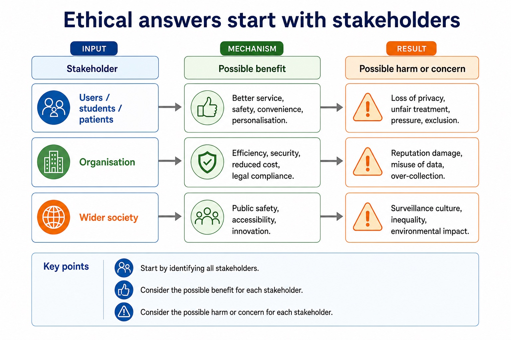

# Lesson 036: Ethical decisions and their consequences

**Course:** Cambridge International AS Level Computer Science 9618, syllabus for examination in 2027-2029 
**Paper:** Paper 1 
**Syllabus:** Section 7: Ethics and ownership 
**Syllabus requirements:** S7.03 
**Pacing:** Flexible. Select a quick, full or deep route for the learners in front of you.

## Teaching-depth menu

- **Quick route:** Use the diagnostic, learning objectives, first worked example and foundation question. Stop once the learner can explain the central distinction accurately.
- **Full route:** Teach every knowledge-point material set, the worked method and all lesson questions.
- **Deep route:** Add the prerequisite refresher, ask learners to connect the concept checklist, discuss the labelled extension and complete a transfer question without a model answer.

## 1. Prerequisite knowledge and quick diagnostic

Recall S7.01 before starting this lesson.

Ask the learner to give one accurate definition or method step before continuing. If they cannot, briefly revisit the named prerequisite rather than repeating the whole previous lesson.

### Optional prerequisite refresher

- The syllabus requires both the need for professional ethics and its purpose; evidence must connect responsible professional decisions to public interest, competence and accountability.
- Show understanding of the need for and purpose of ethics as a computing professional.

## 2. Knowledge explanation

### 1. The need to act ethically and the impact of acting ethically or unethically for a given… (S7.03)

**Concept relationships**

- **ethical:** The need to act ethically and the impact…
- **unethical:** For a given situation, decide whether an action…
- **impact:** Then explain the impact of acting ethically and…
- **situation:** In a situation, judge whether action is ethical…
- **need:** Stakeholders and explain impacts of both ethical and…

**Mechanism**

1. **Identify who is affected** — The need to act ethically and the impact of acting ethically or unethically for a given situation.
2. **Trace benefit and harm** — For a given situation, decide whether an action is ethical or unethical by identifying the decision, affected stakeholders,…
3. **Justify the responsible choice** — Then explain the impact of acting ethically and the impact of acting unethically.

**Ethical answers start with stakeholders:** Stakeholder Possible benefit

#### Ethical answers start with stakeholders

Text transcript

- Stakeholder
- Possible benefit
- Possible harm or concern
- Users / students / patients
- Better service, safety, convenience, personalisation.
- Loss of privacy, unfair treatment, pressure, exclusion.
- Organisation
- Efficiency, security, reduced cost, legal compliance.
- Reputation damage, misuse of data, over-collection.
- Wider society
- Public safety, accessibility, innovation.
- Surveillance culture, inequality, environmental impact.

Precise syllabus wording

Explain the need to act ethically and the impact of acting ethically or unethically for a given situation.

The syllabus requires scenario judgement plus consequences. Evidence must identify stakeholders and explain impacts of both ethical and unethical action; a label or generic list is insufficient.

Open precise terminology and exam facts

- The syllabus requires scenario judgement plus consequences. Evidence must identify stakeholders and explain impacts of both ethical and unethical action; a label or generic list is insufficient.
- Professional ethics provides principles for deciding how a computing professional should act when technical choices can affect clients, users, colleagues or wider society. Its purpose is to protect the public interest, support competent and honest work, and make professionals accountable for foreseeable consequences rather than treating legal compliance or a manager's instruction as the whole decision.
- Joining a professional ethical body is important because membership gives a practitioner an explicit code of conduct, current professional guidance, continuing professional development and a community through which standards and misconduct can be challenged. The British Computer Society (BCS) and the Institute of Electrical and Electronics Engineers (IEEE) are the two named syllabus examples. Their codes promote public interest, competence, integrity, privacy and accountability; a code guides judgement but does not replace law.
- For a given situation, decide whether an action is ethical or unethical by identifying the decision, affected stakeholders, benefits, harms, rights and responsibilities. Then explain the impact of acting ethically and the impact of acting unethically. A defensible conclusion applies evidence, proportionality and safeguards; it is not a one-sided list or an unsupported personal opinion.
- Professional ethics has a purpose: computing professionals must protect public interest, work competently and remain accountable for consequences. Joining a professional ethical body such as the British Computer Society (BCS) or the Institute of Electrical and Electronics Engineers (IEEE) provides codes of conduct, guidance, continuing professional development and a community that supports standards. In a situation, judge whether action is ethical or unethical and explain stakeholder impacts of both choices.
- Artificial intelligence (AI) applications include classification, recommendation, prediction and autonomous control. Every AI evaluation should identify the application or decision mechanism and trace social, economic and environmental impacts before reaching a contextual judgement with realistic mitigations.
- To evaluate an AI application, balance its social, economic and environmental impacts and reach a context-linked judgement.
- The required licence categories include FSF and OSI open-source licences, shareware and commercial software. A justified licence choice links its permissions, restrictions and cost to the stated situation.

### Worked method

1. Unsafe release pressure
2. A developer is told to hide failed safety tests so a medical system can launch on time.
3. Concealing the evidence would be unethical because patients could be harmed and trust would be damaged.
4. The developer acts ethically by documenting the risk, refusing to falsify the record and escalating through BCS/IEEE-style professional channels.
5. This may delay release and cost money, but protects patients, supports accountability and allows the defect to be corrected.

Beyond syllabus / 延伸知识（不要求背诵）: professional decisions are often reviewed against law, organisational policy, public interest and a published code of conduct.
## 3. Practice by question type

### Question 1 - foundation - apply - 2 marks

What must follow an ethical or unethical label?

**Answer:** An explanation of stakeholder consequences, evidence and a justified action or safeguard.

**Marking guidance:** Award one mark for each distinct, technically accurate point or method step.

**Common error:** For the command word apply, perform that exact action; do not replace it with an unrelated fact.

### Question 2 - application - apply - 2 marks

What is the purpose of professional ethics in computing?

**Answer:** To guide competent, responsible and accountable decisions that protect clients, users and the public interest.

**Marking guidance:** Award one mark for each distinct, technically accurate point or method step.

**Common error:** Do not repeat the same point in different words; each mark needs a separate idea or method step.

### Question 3 - transfer - explain - 3 marks

Explain how ethical decisions and their consequences would be applied in a suitable computing context.

**Answer:** Professional ethics provides principles for deciding how a computing professional should act when technical choices can affect clients, users, colleagues or wider society. Its purpose is to protect the public interest, support competent and honest work, and make professionals accountable for foreseeable consequences rather than treating legal compliance or a manager's instruction as the whole decision. Joining a professional ethical body is important because membership gives a practitioner an explicit code of conduct, current professional guidance, continuing professional development and a community through which standards and misconduct can be challenged. The British Computer Society (BCS) and the Institute of Electrical and Electronics Engineers (IEEE) are the two named syllabus examples. Their codes promote public interest, competence, integrity, privacy and accountability; a code guides judgement but does not replace law. For a given situation, decide whether an action is ethical or unethical by identifying the decision, affected stakeholders, benefits, harms, rights and responsibilities. Then explain the impact of acting ethically and the impact of acting unethically. A defensible conclusion applies evidence, proportionality and safeguards; it is not a one-sided list or an unsupported personal opinion.

**Marking guidance:** Each mark needs a relevant point linked to the stated context.

**Common error:** Do not copy the worked example unchanged; transfer the method and check it against the new context.

### Related past-paper indexes

| Reference | Marks | Command word | Question type |
|---|---:|---|---|
| 9618/13/W/25 Q7(a) | 2 | describe | explain |
| 9618/12/W/24 Q5(a) | 4 | explain | explain |
| 9618/12/W/24 Q5(i) | 3 | describe | explain |
| 9618/12/W/24 Q5(ii) | 2 | describe | explain |

These are indexes only. Cambridge question and mark-scheme wording is not reproduced.

## 4. Summary and exam reminders

### Summary

- Define ethical decisions and their consequences with the exact technical vocabulary expected by the syllabus.
- Use the lesson method on a fresh context and show the intermediate decision, representation or calculation.
- Match the shape of the answer to the command word and the available marks.
- Check the final answer against the scenario instead of repeating a memorised sentence.

### Common error to correct

Students often write personal opinions only. Correction: ethics answers need stakeholders, evidence and balanced judgement.

### Exam technique

- Follow the command word: state gives a fact; explain links a cause to a consequence; compare covers both sides.
- Match the number of independent points or method steps to the available marks.
- For ethical decisions and their consequences, use the exact technical term before applying it to the scenario.
