# Lesson 037: Copyright and software licences

**Course:** Cambridge International AS Level Computer Science 9618, 2027-2029 Version 2 
**Paper:** Paper 1 
**Syllabus:** Section 7: Ethics and ownership 
**Syllabus requirements:** S7.04, S7.05 
**Pacing:** Flexible. Select the material set and practice depth needed by the learner.

## Teaching-depth menu

- **Quick route:** Use the diagnostic, learning objectives, first worked example and foundation question. Stop once the learner can explain the central distinction accurately.
- **Full route:** Use every knowledge-point material set, the worked method, the terminology check and all questions.
- **Deep route:** Add the prerequisite refresher, ask learners to connect the concept checklist, discuss the labelled extension and complete a transfer question without a model answer.

## 1. Prerequisite knowledge and quick diagnostic

Recall S7.04 before starting this lesson.

Ask the learner to give one accurate definition or method step before continuing. If they cannot, briefly revisit the named prerequisite rather than repeating the whole previous lesson.

### Optional prerequisite refresher

- Version 2 requires the need for copyright legislation, not only a definition. Evidence must connect protected software expression and restricted acts to enforceable permission, revenue or investment.
- Show understanding of the need for copyright legislation for software.

## 2. Knowledge explanation

### 1. Copyright · Software · Legislation · Needed (S7.04)

**Concept map:** copyright → software → legislation → needed

**Three-part explanation:**

1. Evidence must connect protected software expression and restricted acts to enforceable permission, revenue or investment
2. Copyright legislation is needed to give creators enforceable control over software expression that can otherwise be copied and distributed cheaply
3. Version 2 requires the need for copyright legislation, not only a definition

**Concrete cue:** Version 2 requires the need for copyright legislation, not only a definition. Evidence must connect protected software expression and restricted acts to enforceable permission, revenue or investment.

#### Copyright protects expression, including software code

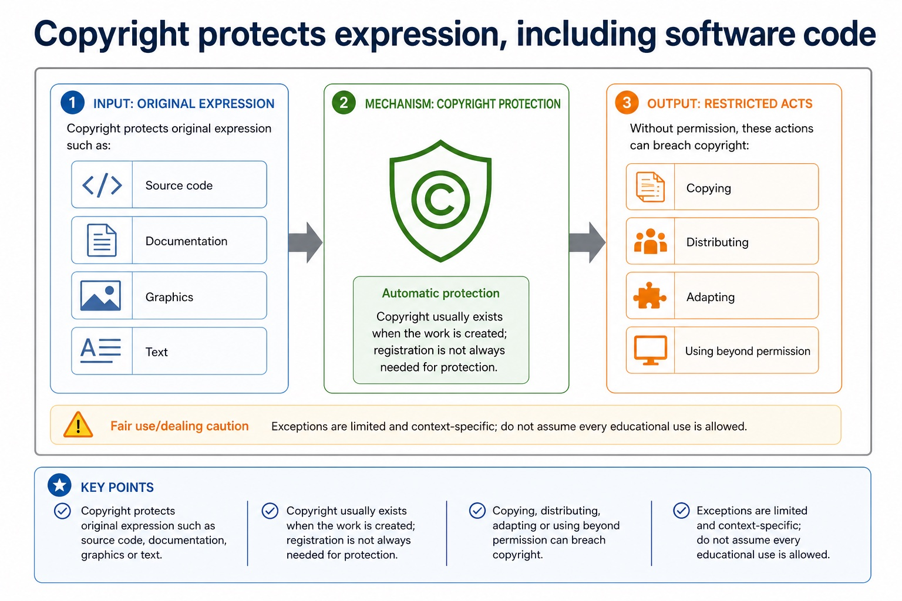

Text transcript

- Copyright Protects original expression such as source code, documentation, graphics or text.
- Automatic protection Copyright usually exists when the work is created; registration is not always needed for protection.
- Restricted acts Copying, distributing, adapting or using beyond permission can breach copyright.
- Fair use/dealing caution Exceptions are limited and context-specific; do not assume every educational use is allowed.

#### Do not confuse protection type with permission type

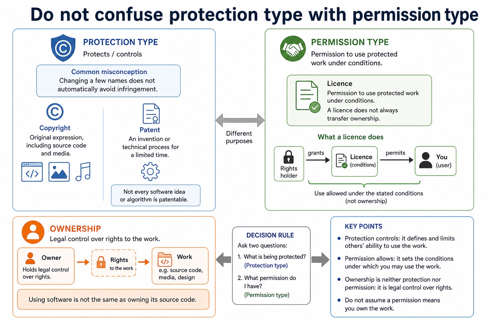

Text transcript

- Protects / controls
- Common misconception
- Copyright
- Original expression, including source code and media.
- Changing a few names does not automatically avoid infringement.
- An invention or technical process for a limited time.
- Not every software idea or algorithm is patentable.
- Permission to use protected work under conditions.

#### Ownership and licence obligations still matter

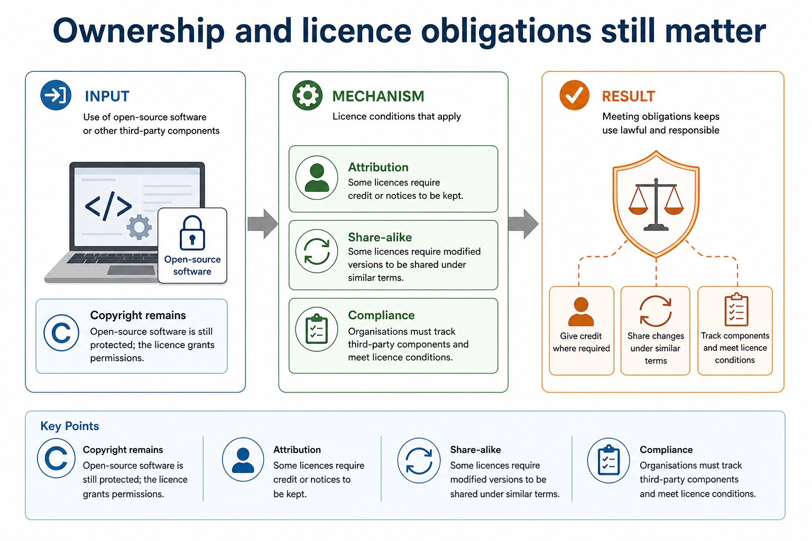

Text transcript

- Copyright remains Open-source software is still protected; the licence grants permissions.
- Attribution Some licences require credit or notices to be kept.
- Share-alike Some licences require modified versions to be shared under similar terms.
- Compliance Organisations must track third-party components and meet licence conditions.

#### Open-source software makes source code available under a licence

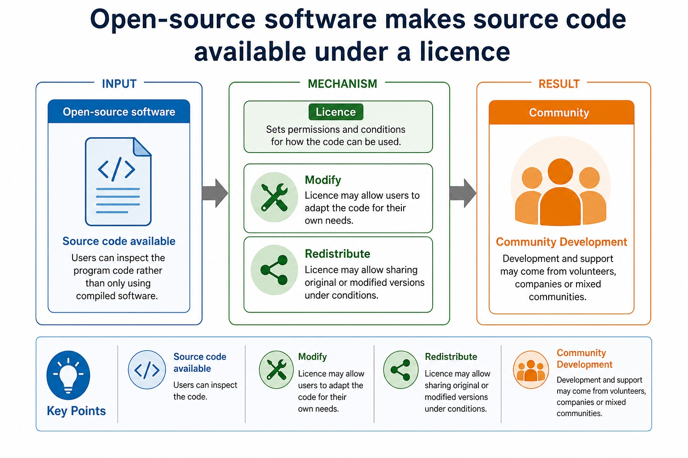

Text transcript

- Source code available Users can inspect the program code rather than only using compiled software.
- Modify Licence may allow users to adapt the code for their own needs.
- Redistribute Licence may allow sharing original or modified versions under conditions.
- Community Development and support may come from volunteers, companies or mixed communities.

Precise syllabus wording

Show understanding of the need for copyright legislation for software.

Version 2 requires the need for copyright legislation, not only a definition. Evidence must connect protected software expression and restricted acts to enforceable permission, revenue or investment.

### 2. FSF · OSI · Shareware · Commercial (S7.05)

**Concept map:** FSF → OSI → shareware → commercial → licences → licence

**Three-part explanation:**

1. Version 2 explicitly includes the Free Software Foundation, Open Source Initiative, shareware and commercial software
2. a scenario answer must justify permissions, restrictions, cost or support rather than choose by label alone
3. The required licence categories are the Free Software Foundation (FSF), Open Source Initiative (OSI), shareware and commercial software

**Concrete cue:** Version 2 explicitly includes the Free Software Foundation, Open Source Initiative, shareware and commercial software. All four must be taught; a scenario answer must justify permissions, restrictions, cost or support…

#### Open-source software makes source code available under a licence

Text transcript

- Source code available Users can inspect the program code rather than only using compiled software.
- Modify Licence may allow users to adapt the code for their own needs.
- Redistribute Licence may allow sharing original or modified versions under conditions.
- Community Development and support may come from volunteers, companies or mixed communities.

#### A licence grants permission under conditions

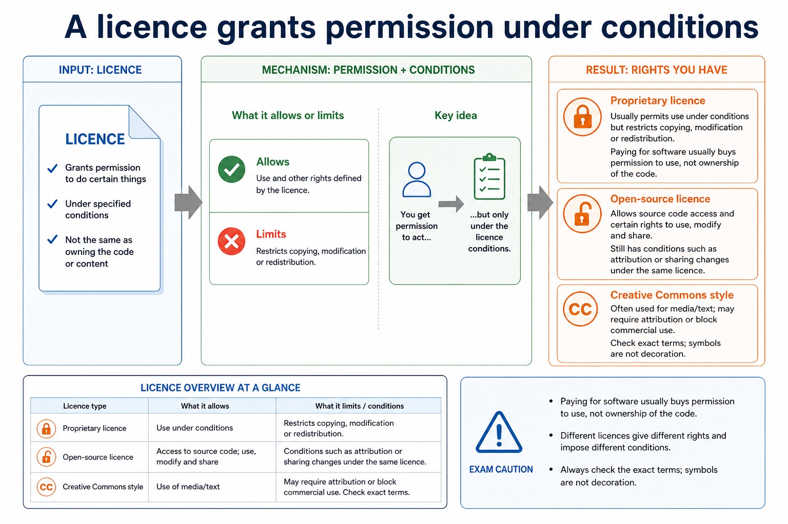

Text transcript

- Licence idea
- What it allows or limits
- Exam caution
- Proprietary licence
- Usually permits use under conditions but restricts copying, modification or redistribution.
- Paying for software usually buys permission to use, not ownership of the code.
- Open-source licence
- Allows source code access and certain rights to use, modify and share.

#### Ownership and licence obligations still matter

Text transcript

- Copyright remains Open-source software is still protected; the licence grants permissions.
- Attribution Some licences require credit or notices to be kept.
- Share-alike Some licences require modified versions to be shared under similar terms.
- Compliance Organisations must track third-party components and meet licence conditions.

#### Choose the likely permission issue

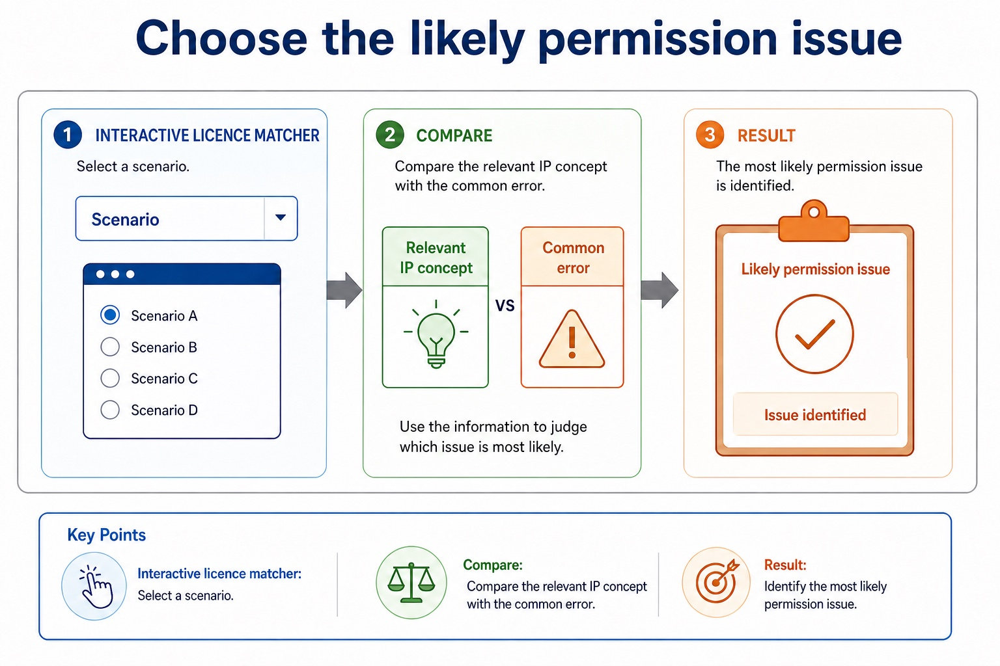

Text transcript

- Interactive licence matcher
- Select a scenario and compare the relevant IP concept with the common error.
- Scenario

Precise syllabus wording

Explain different software licensing types and justify a licence for a given situation.

Version 2 explicitly includes the Free Software Foundation, Open Source Initiative, shareware and commercial software. All four must be taught; a scenario answer must justify permissions, restrictions, cost or support rather than choose by label alone.

### Supporting diagram library

#### What intellectual property can protect

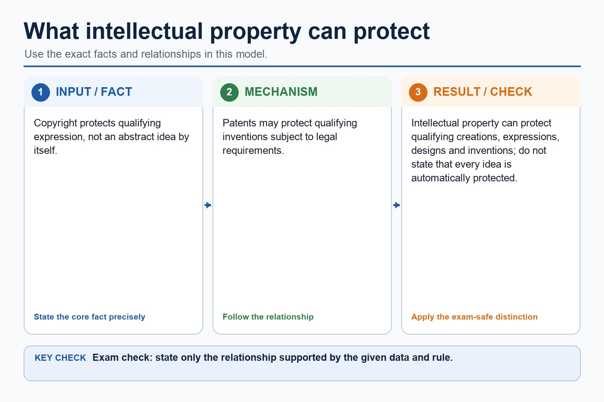

Text transcript

- Copyright protects qualifying expression, not an abstract idea by itself.
- Patents may protect qualifying inventions subject to legal requirements.
- Intellectual property can protect qualifying creations, expressions, designs and inventions; do not state that every idea is automatically protected.

#### Patents protect inventions, not every line of code

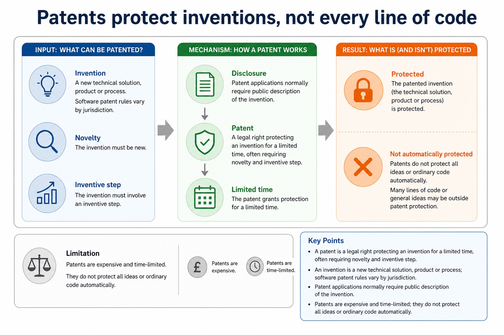

Text transcript

- Patent A legal right protecting an invention for a limited time, often requiring novelty and inventive step.
- Invention A new technical solution, product or process; software patent rules vary by jurisdiction.
- Disclosure Patent applications normally require public description of the invention.
- Limitation Patents are expensive and time-limited; they do not protect all ideas or ordinary code automatically.

#### Match the software type to the scenario

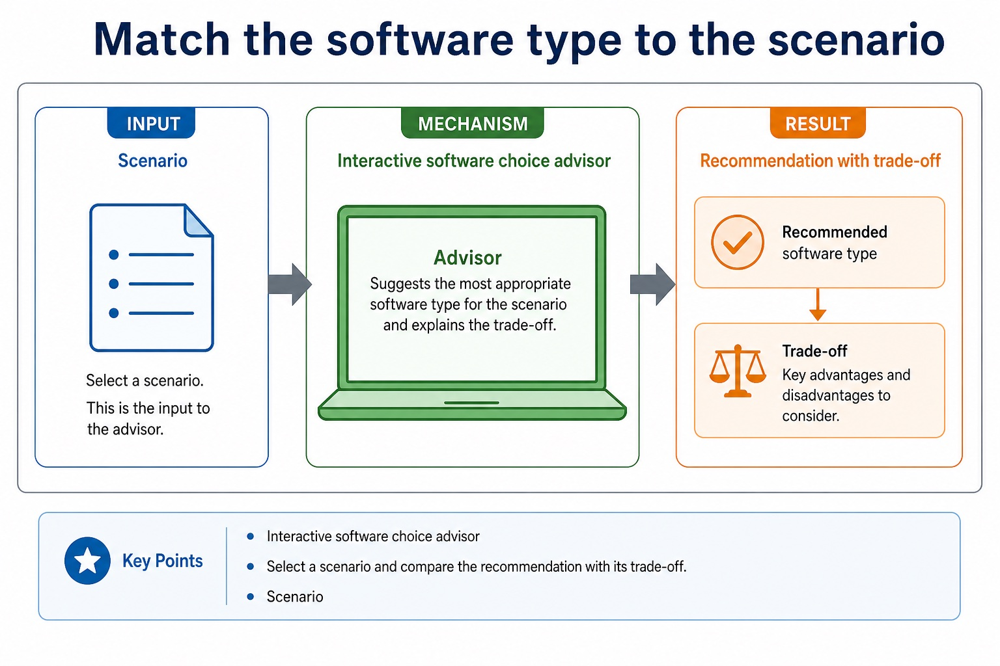

Text transcript

- Interactive software choice advisor
- Select a scenario and compare the recommendation with its trade-off.
- Scenario

#### Use a scenario-based comparison structure

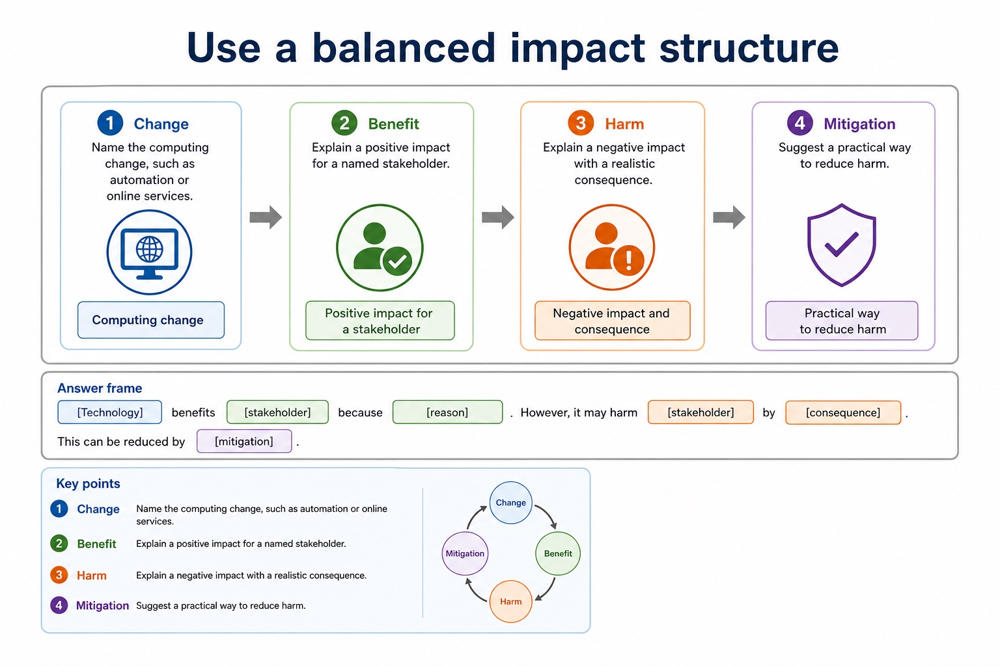

Text transcript

- 1. Need Identify the user's priority: cost, support, control, reliability, security or compatibility.
- 2. Open source point Explain one benefit or risk linked to that priority.
- 3. Proprietary point Explain a contrasting benefit or risk.
- 4. Judgement Recommend one option with conditions and trade-offs.
- Answer frame:
- For [scenario], [option] may be suitable because [factor]. However, [trade-off]. Therefore, the best choice depends on [condition/evidence].

#### Proprietary software keeps control with the owner

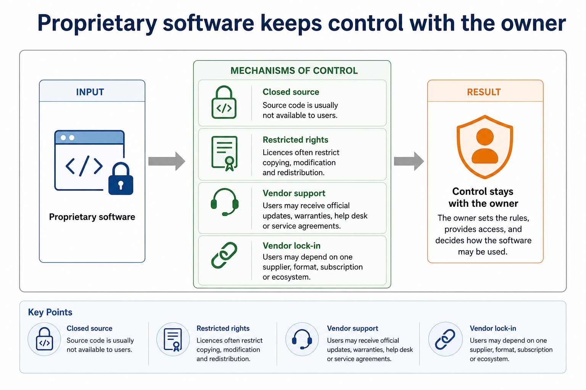

Text transcript

- Closed source Source code is usually not available to users.
- Restricted rights Licences often restrict copying, modification and redistribution.
- Vendor support Users may receive official updates, warranties, help desk or service agreements.
- Vendor lock-in Users may depend on one supplier, format, subscription or ecosystem.

#### Compare by factor, not by favourite label

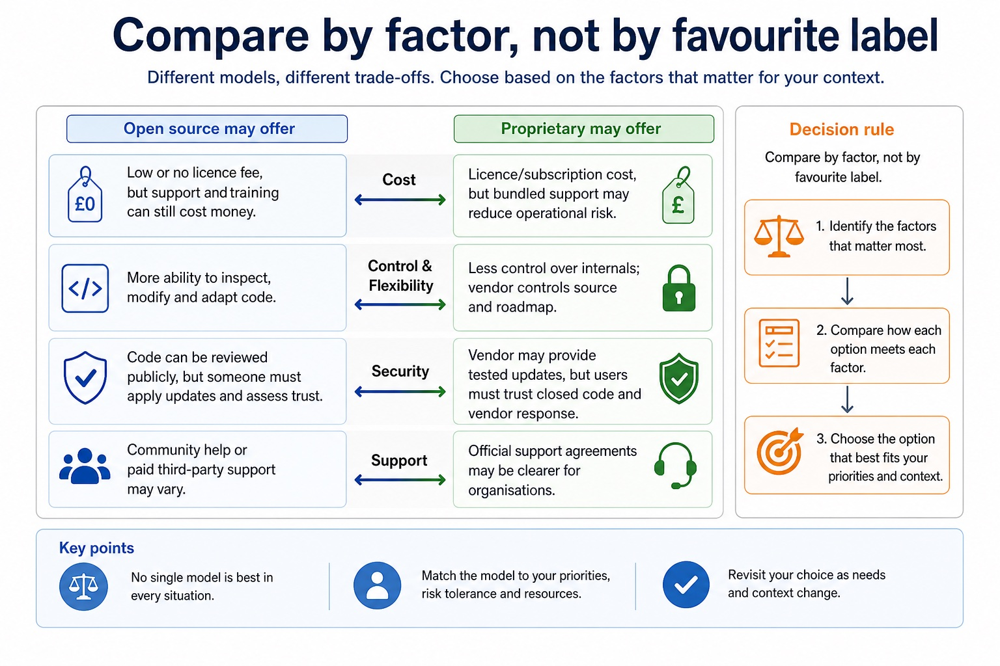

Text transcript

- Open source may offer
- Proprietary may offer
- Low or no licence fee, but support and training can still cost money.
- Licence/subscription cost, but bundled support may reduce operational risk.
- More ability to inspect, modify and adapt code.
- Less control over internals; vendor controls source and roadmap.
- Security
- Code can be reviewed publicly, but someone must apply updates and assess trust.

#### Common contrasts that stop vague answers

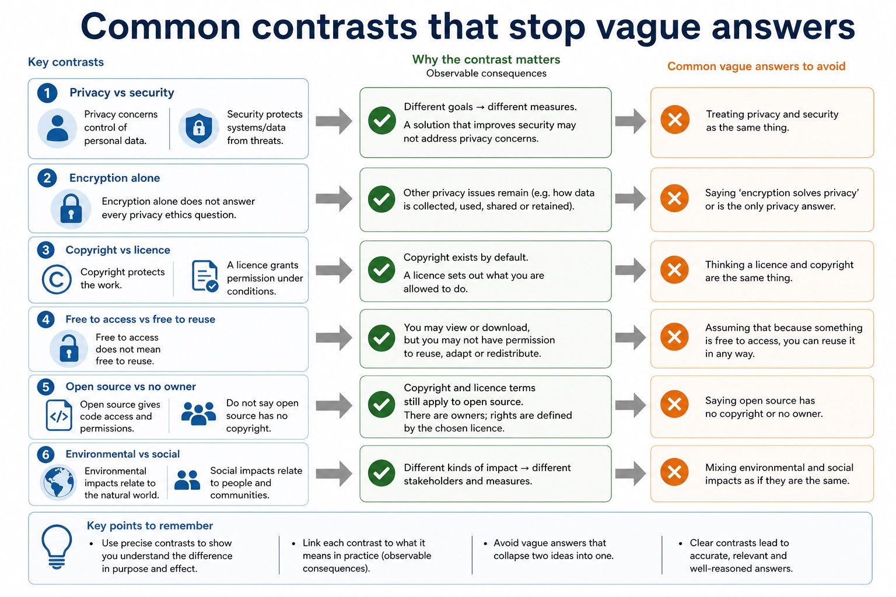

Text transcript

- Contrast
- Difference
- Common error
- Privacy vs security
- Privacy concerns control of personal data; security protects systems/data from threats.
- Encryption alone does not answer every privacy ethics question.
- Copyright vs licence
- Copyright protects the work; a licence grants permission under conditions.

#### Section 7 topic map

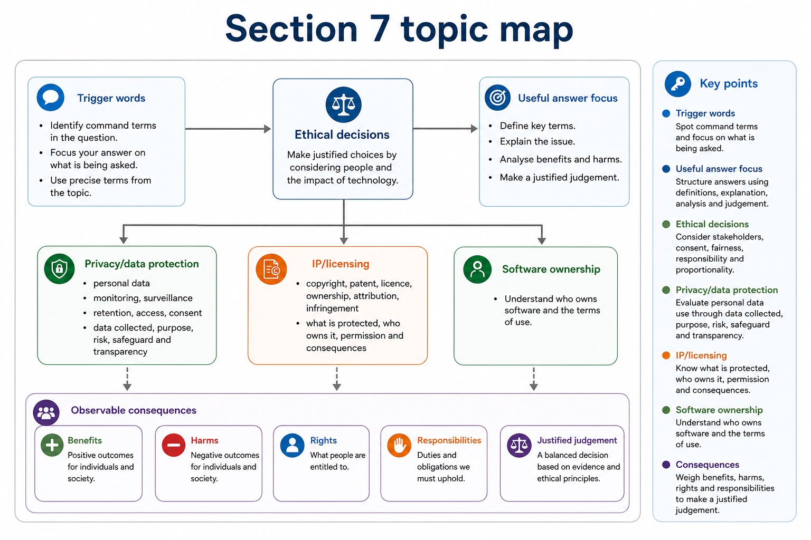

Text transcript

- Trigger words
- Useful answer focus
- Ethical decisions
- stakeholders, consent, fairness, responsibility, proportionality
- benefits, harms, rights, responsibilities and justified judgement
- Privacy/data protection
- personal data, monitoring, surveillance, retention, access, consent
- data collected, purpose, risk, safeguard and transparency

#### What Cambridge-style marking usually rewards

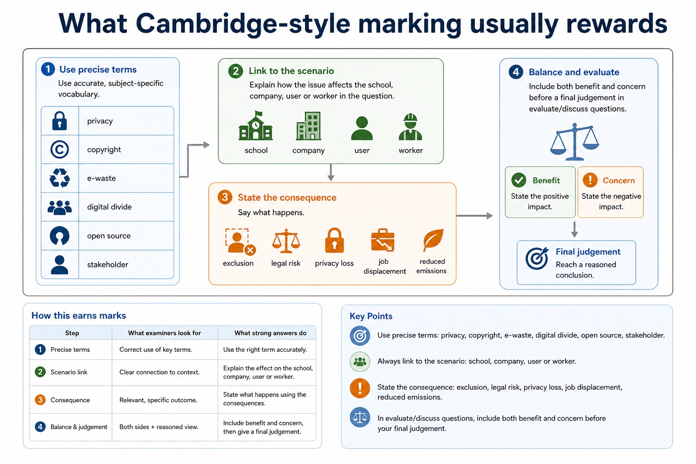

Text transcript

- Precise term privacy, copyright, e-waste, digital divide, open source, stakeholder.
- Scenario link Explain how the issue affects the school, company, user or worker in the question.
- Consequence Say what happens: exclusion, legal risk, privacy loss, job displacement, reduced emissions.
- Balance Include both benefit and concern before final judgement in evaluate/discuss questions.

#### The five-part evaluation answer

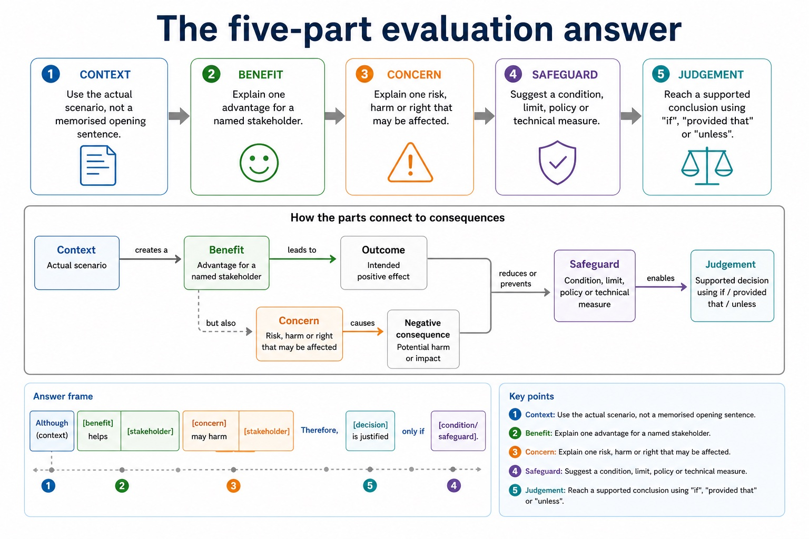

Text transcript

- 1. Context Use the actual scenario, not a memorised opening sentence.
- 2. Benefit Explain one advantage for a named stakeholder.
- 3. Concern Explain one risk, harm or right that may be affected.
- 4. Safeguard Suggest a condition, limit, policy or technical measure.
- 5. Judgement Reach a supported conclusion using "if", "provided that" or "unless".
- Answer frame:
- Although [benefit] helps [stakeholder], [concern] may harm [stakeholder]. Therefore, [decision] is justified only if [condition/safeguard].

Open precise terminology and exam facts

- Version 2 requires the need for copyright legislation, not only a definition. Evidence must connect protected software expression and restricted acts to enforceable permission, revenue or investment.
- Version 2 explicitly includes the Free Software Foundation, Open Source Initiative, shareware and commercial software. All four must be taught; a scenario answer must justify permissions, restrictions, cost or support rather than choose by label alone.
- Copyright legislation is needed because software can be copied and distributed at very low cost while its creation requires time, skill and investment. It gives the copyright holder legal control over protected expression such as source code and documentation, including copying, distribution and adaptation, so unauthorised use can be challenged and creators can license work and receive revenue. Copyright protects expression rather than every abstract idea, and a limited legal exception is not permission for unrestricted copying.
- A software licence is the copyright holder's permission to use protected work under stated conditions; paying for or downloading software does not normally transfer ownership. The licence may allow or restrict installation, copying, modification and redistribution. Copyright legislation establishes the rights, while the licence defines which of those acts the user is permitted to perform.
- The Free Software Foundation (FSF) emphasises freedoms to run, study, modify and share software; source access is necessary for study and modification. The Open Source Initiative (OSI) defines open-source criteria and approves licences that meet them. Free/open-source software can still be sold and remains protected by copyright; users must follow conditions such as preserving notices, attribution or sharing derivative source under compatible terms.
- The required licence categories include FSF and OSI open-source licences, shareware and commercial software. A justified licence choice links its permissions, restrictions and cost to the stated situation.
- Shareware is distributed for trial or limited use, with payment commonly required for continued, full or unrestricted use. A commercial/proprietary licence grants defined use while normally restricting copying, modification and redistribution.
- Licence choice must fit the scenario: budget, support, source modification, redistribution, trial period, compatibility and legal obligations are relevant. 'Free to download' does not mean public domain.
- Professional ethics has a purpose: computing professionals must protect public interest, work competently and remain accountable for consequences. Joining a professional ethical body such as the British Computer Society (BCS) or the Institute of Electrical and Electronics Engineers (IEEE) provides codes of conduct, guidance, continuing professional development and a community that supports standards. In a situation, judge whether action is ethical or unethical and explain stakeholder impacts of both choices.
- Copyright legislation is needed to give creators enforceable control over software expression that can otherwise be copied and distributed cheaply. A licence grants permission without normally transferring ownership. The required licence categories are the Free Software Foundation (FSF), Open Source Initiative (OSI), shareware and commercial software; justify a choice from the scenario's permissions, restrictions, support, cost and redistribution needs.

### Worked example

1. Modify and redistribute a library
2. A developer finds source code in a public repository.
3. Copyright still protects the code, so visibility alone is not permission.
4. An OSI-approved licence may allow modification and redistribution, while an FSF-aligned copyleft licence may require a distributed derivative to preserve notices and use compatible terms.
5. The developer must check and follow the exact licence before copying the library into a product.

Beyond syllabus / 延伸知识（不要求背诵）: professional decisions are often reviewed against law, organisational policy, public interest and a published code of conduct.
## 3. Practice by question type

### Question 1 - foundation - explain - 6 marks

Explain why copyright legislation is needed for software and how an FSF- or OSI-aligned licence changes what a user may do with protected source code.

**Answer:** software is easy to copy/distribute while creation requires skill, time or investment; copyright gives the holder control over protected expression and restricted acts; licence grants specified permissions without normally transferring ownership; FSF freedom or OSI licence-approval role is stated accurately; source inspection/modification/redistribution permission is linked to the licence; licence conditions such as notices, attribution or compatible redistribution terms remain binding

**Marking guidance:** Do not accept that copyright protects every idea, that a paid download transfers copyright, or that open source means public domain.

**Common error:** For the command word explain, perform that exact action; do not replace it with an unrelated fact.

### Question 2 - application - apply - 2 marks

Can open-source software be sold or remain copyrighted?

**Answer:** Yes. Open source concerns licence permissions and conditions, not zero price or absence of copyright.

**Marking guidance:** Award one mark for each distinct, technically accurate point or method step.

**Common error:** Do not repeat the same point in different words; each mark needs a separate idea or method step.

### Question 3 - transfer - identify - 2 marks

Identify all four required software-licensing examples.

**Answer:** Free Software Foundation (FSF), Open Source Initiative (OSI), shareware and commercial software.

**Marking guidance:** Award one mark for each distinct, technically accurate point or method step.

**Common error:** Do not copy the worked example unchanged; transfer the method and check it against the new context.

### Related past-paper indexes

| Reference | Marks | Command word | Question type |
|---|---:|---|---|
| 9618/12/W/25 Q2(a) | 4 | complete | recall |
| 9618/12/S/25 Q3(i) | 3 | describe | explain |
| 9618/12/S/25 Q3(ii) | 3 | describe | explain |
| 9618/12/W/25 Q2(b) | 2 | complete | recall |

These are indexes only. Cambridge question and mark-scheme wording is not reproduced.

## 4. Summary and exam reminders

### Summary

- Define copyright and software licences with the exact technical vocabulary expected by the syllabus.
- Use the lesson method on a fresh context and show the intermediate decision, representation or calculation.
- Match the shape of the answer to the command word and the available marks.
- Check the final answer against the scenario instead of repeating a memorised sentence.

### Common error to correct

Students often write personal opinions only. Correction: ethics answers need stakeholders, evidence and balanced judgement.

### Exam technique

- Follow the command word: state gives a fact; explain links a cause to a consequence; compare covers both sides.
- Match the number of independent points or method steps to the available marks.
- For copyright and software licences, use the exact technical term before applying it to the scenario.
