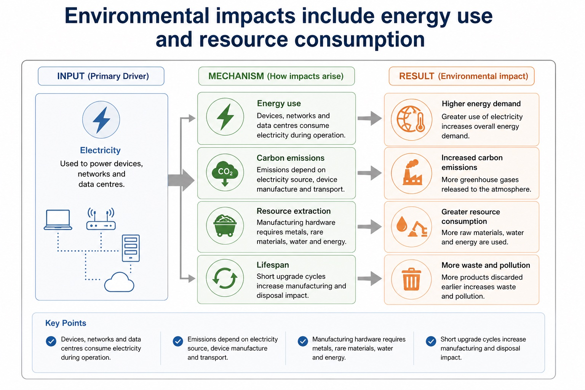

# Lesson 038: Artificial intelligence applications and impacts

**Course:** Cambridge International AS Level Computer Science 9618, syllabus for examination in 2027-2029 
**Paper:** Paper 1 
**Syllabus:** Section 7: Ethics and ownership 
**Syllabus requirements:** S7.06 
**Pacing:** Flexible. Select a quick, full or deep route for the learners in front of you.

## Teaching-depth menu

- **Quick route:** Use the diagnostic, learning objectives, first worked example and foundation question. Stop once the learner can explain the central distinction accurately.
- **Full route:** Teach every knowledge-point material set, the worked method and all lesson questions.
- **Deep route:** Add the prerequisite refresher, ask learners to connect the concept checklist, discuss the labelled extension and complete a transfer question without a model answer.

## 1. Prerequisite knowledge and quick diagnostic

Recall S7.01 before starting this lesson.

Ask the learner to give one accurate definition or method step before continuing. If they cannot, briefly revisit the named prerequisite rather than repeating the whole previous lesson.

### Optional prerequisite refresher

- The syllabus requires both the need for professional ethics and its purpose; evidence must connect responsible professional decisions to public interest, competence and accountability.
- Show understanding of the need for and purpose of ethics as a computing professional.

## 2. Knowledge explanation

### 1. Artificial intelligence, its applications and its social, economic and environmental impacts (S7.06)

**Atomic learning targets**

- **S7.06.A01:** AI
- **S7.06.A02:** applications
- **S7.06.A03:** evaluate
- **S7.06.A04:** social
- **S7.06.A05:** economic
- **S7.06.A06:** environmental
- **S7.06.A07:** impacts

**Core explanation**

- Professional ethics has a purpose: computing professionals must protect public interest, work competently and remain accountable for consequences. Joining a professional ethical body such as the British Computer Society (BCS) or the Institute of Electrical and Electronics Engineers (IEEE) provides codes of conduct, guidance, continuing professional development and a community that supports standards. In a situation, judge whether action is ethical or unethical and explain stakeholder impacts of both choices.
- Artificial intelligence (AI) applications include classification, recommendation, prediction and autonomous control. Every AI evaluation should identify the application or decision mechanism and trace social, economic and environmental impacts before reaching a contextual judgement with realistic mitigations.
- To evaluate an AI application, balance its social, economic and environmental impacts and reach a context-linked judgement.
- Social impacts include access, bias and privacy; economic impacts include productivity, job redesign and error cost; environmental impacts include data-centre energy/material use and optimisation of transport or power. Evaluation balances benefits, harms and mitigations in context.
- AI applications include medical image classification, recommendation, fraud detection, language processing, autonomous control and predictive maintenance. A valid impact answer names the AI decision mechanism and traces a consequence for a stakeholder.
- Artificial intelligence, its applications and its social, economic and environmental impacts.

**Mechanism or method**

1. **Establish the exact components or states** — Professional ethics has a purpose: computing professionals must protect public interest, work competently and remain accountable for consequences.
2. **Trace the relationship or change** — Joining a professional ethical body such as the British Computer Society (BCS) or the Institute of Electrical and Electronics Engineers (IEEE) provides codes of conduct, guidance, continuing professional development and a community that supports standards.
3. **Use the explanation in a concrete case** — In a situation, judge whether action is ethical or unethical and explain stakeholder impacts of both choices.

#### Worked example: Artificial intelligence, its applications and its social, economic and environmental impacts: complete worked route

1. **Establish the exact components or states**

Professional ethics has a purpose: computing professionals must protect public interest, work competently and remain accountable for consequences.

2. **Trace the relationship or change**

Joining a professional ethical body such as the British Computer Society (BCS) or the Institute of Electrical and Electronics Engineers (IEEE) provides codes of conduct, guidance, continuing professional development and a community that supports standards.

3. **Use the explanation in a concrete case**

In a situation, judge whether action is ethical or unethical and explain stakeholder impacts of both choices.

4. **Complete example**

AI recruitment review: An AI recruitment system may speed initial screening and reduce administrative cost, but biased data can unfairly exclude applicants, automated rejection can remove accountability, and model operation consumes computing resources. The system is justified only if measured benefits outweigh social, economic and environmental costs under those safeguards.

**Misconceptions to correct**

- Students often write personal opinions only. Correction: ethics answers need stakeholders, evidence and balanced judgement.

#### Mastery check (MC-L038-S7.06)

Show the following targets in one connected answer, using a concrete example for each: AI; applications; evaluate; social; economic; environmental; impacts.

Answer criteria

- Professional ethics has a purpose: computing professionals must protect public interest, work competently and remain accountable for consequences. Joining a professional ethical body such as the British Computer Society (BCS) or the Institute of Electrical and Electronics Engineers (IEEE) provides codes of conduct, guidance, continuing professional development and a community that supports standards. In a situation, judge whether action is ethical or unethical and explain stakeholder impacts of both choices.
- Artificial intelligence (AI) applications include classification, recommendation, prediction and autonomous control. Every AI evaluation should identify the application or decision mechanism and trace social, economic and environmental impacts before reaching a contextual judgement with realistic mitigations.
- To evaluate an AI application, balance its social, economic and environmental impacts and reach a context-linked judgement.
- Social impacts include access, bias and privacy; economic impacts include productivity, job redesign and error cost; environmental impacts include data-centre energy/material use and optimisation of transport or power. Evaluation balances benefits, harms and mitigations in context.
- AI applications include medical image classification, recommendation, fraud detection, language processing, autonomous control and predictive maintenance. A valid impact answer names the AI decision mechanism and traces a consequence for a stakeholder.
- Artificial intelligence, its applications and its social, economic and environmental impacts.

**Supplementary concept map**

- **applications:** Artificial intelligence, its applications and its social, economic…
- **evaluate:** To evaluate an AI application, balance its social,…
- **social:** Every AI evaluation should identify the application or…
- **economic:** Social, economic and environmental.
- **environmental:** Environmental impacts include data-centre energy/material use and optimisation…
- **impacts:** Social impacts include access, bias and privacy

**Supplementary three-step recap**

1. **Identify who is affected** — Artificial intelligence, its applications and its social, economic and environmental impacts.
2. **Trace benefit and harm** — To evaluate an AI application, balance its social, economic and environmental impacts and reach a context-linked judgement.
3. **Justify the responsible choice** — Every AI evaluation should identify the application or decision mechanism and trace social, economic and environmental impacts before…

**Environmental impacts include energy use and resource consumption:** Energy use Devices, networks and data centres consume electricity during operation. Carbon emissions Emissions depend on electricity source, device manufacture and transport.

#### Environmental impacts include energy use and resource consumption

Text transcript

- Energy use Devices, networks and data centres consume electricity during operation.
- Carbon emissions Emissions depend on electricity source, device manufacture and transport.
- Resource extraction Manufacturing hardware requires metals, rare materials, water and energy.
- Lifespan Short upgrade cycles increase manufacturing and disposal impact.

Precise syllabus wording

Show understanding of artificial intelligence, its applications and its social, economic and environmental impacts.

The syllabus requires applications of AI and impacts across all three named dimensions: social, economic and environmental. Evidence must connect an AI mechanism to stakeholder consequences, benefits, harms and a contextual judgement.

### Lesson technical reference

- The syllabus requires applications of AI and impacts across all three named dimensions: social, economic and environmental. Evidence must connect an AI mechanism to stakeholder consequences, benefits, harms and a contextual judgement.
- AI applications include medical image classification, recommendation, fraud detection, language processing, autonomous control and predictive maintenance. A valid impact answer names the AI decision mechanism and traces a consequence for a stakeholder.
- Social impacts include access, bias and privacy; economic impacts include productivity, job redesign and error cost; environmental impacts include data-centre energy/material use and optimisation of transport or power. Evaluation balances benefits, harms and mitigations in context.
- To evaluate an AI application, balance its social, economic and environmental impacts and reach a context-linked judgement.
- Professional ethics has a purpose: computing professionals must protect public interest, work competently and remain accountable for consequences. Joining a professional ethical body such as the British Computer Society (BCS) or the Institute of Electrical and Electronics Engineers (IEEE) provides codes of conduct, guidance, continuing professional development and a community that supports standards. In a situation, judge whether action is ethical or unethical and explain stakeholder impacts of both choices.
- Artificial intelligence (AI) applications include classification, recommendation, prediction and autonomous control. Every AI evaluation should identify the application or decision mechanism and trace social, economic and environmental impacts before reaching a contextual judgement with realistic mitigations.

Beyond syllabus / 延伸知识（不要求背诵）: professional decisions are often reviewed against law, organisational policy, public interest and a published code of conduct.
## 3. Practice by question type

### Question 1 - foundation - apply - 2 marks

Which three impact dimensions must an AI evaluation cover?

**Answer:** Social, economic and environmental impacts.

**Marking guidance:** Award one mark for each distinct, technically accurate point or method step.

**Common error:** For the command word apply, perform that exact action; do not replace it with an unrelated fact.

### Question 2 - application - evaluate - 4 marks

Evaluate the use of AI to select applicants for jobs.

**Answer:** valid benefit such as speed/consistent initial processing; valid risk such as bias, opacity, privacy or exclusion; explains a stakeholder consequence; balanced judgement or mitigation linked to the context

**Marking guidance:** Do not accept a list of generic advantages/disadvantages without linking AI decisions to consequences.

**Common error:** Do not repeat the same point in different words; each mark needs a separate idea or method step.

### Question 3 - transfer - give - 2 marks

Give one economic benefit of predictive maintenance.

**Answer:** Reduced downtime or repair cost by predicting failure.

**Marking guidance:** Award one mark for each distinct, technically accurate point or method step.

**Common error:** Do not copy the worked example unchanged; transfer the method and check it against the new context.

### Related past-paper indexes

| Reference | Marks | Command word | Question type |
|---|---:|---|---|
| 9618/11/S/25 Q4(a) | 4 | explain | explain |
| 9618/11/W/25 Q8(c) | 4 | complete | recall |
| 9618/12/S/25 Q3(a) | 4 | explain | explain |
| 9618/11/S/25 Q4(b) | 2 | explain | explain |

These are indexes only. Cambridge question and mark-scheme wording is not reproduced.

## 4. Summary and exam reminders

### Summary

- S7.06: explain AI, applications, evaluate, social, economic, environmental, impacts.
- S7.06 method: Establish the exact components or states → Trace the relationship or change → Use the explanation in a concrete case.
- Correction to remember: Students often write personal opinions only. Correction: ethics answers need stakeholders, evidence and balanced judgement.

### Common error to correct

Students often write personal opinions only. Correction: ethics answers need stakeholders, evidence and balanced judgement.

### Exam technique

- Follow the command word: state gives a fact; explain links a cause to a consequence; compare covers both sides.
- Match the number of independent points or method steps to the available marks.
- For artificial intelligence applications and impacts, use the exact technical term before applying it to the scenario.
