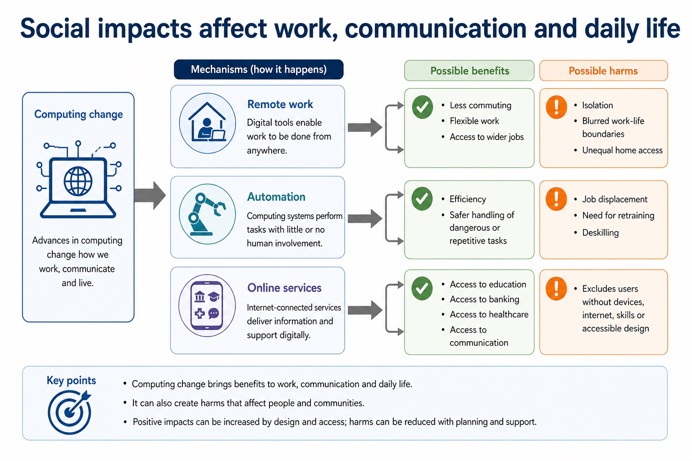
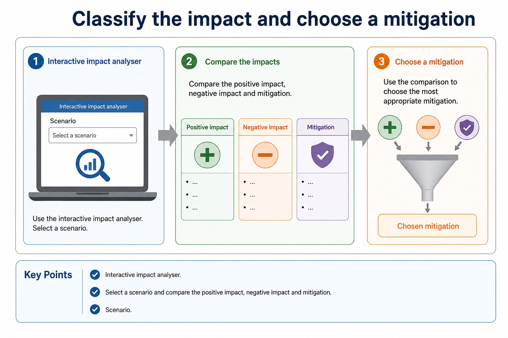
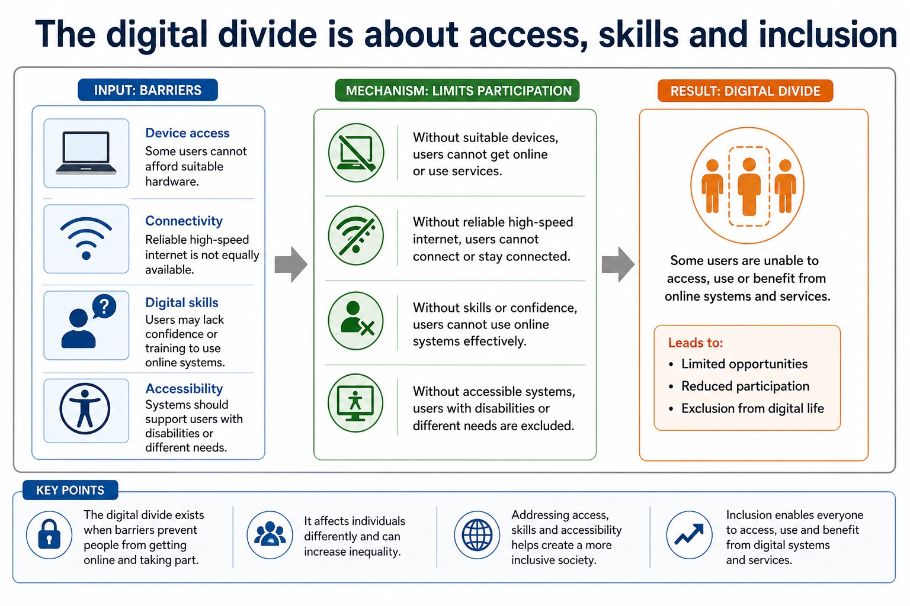
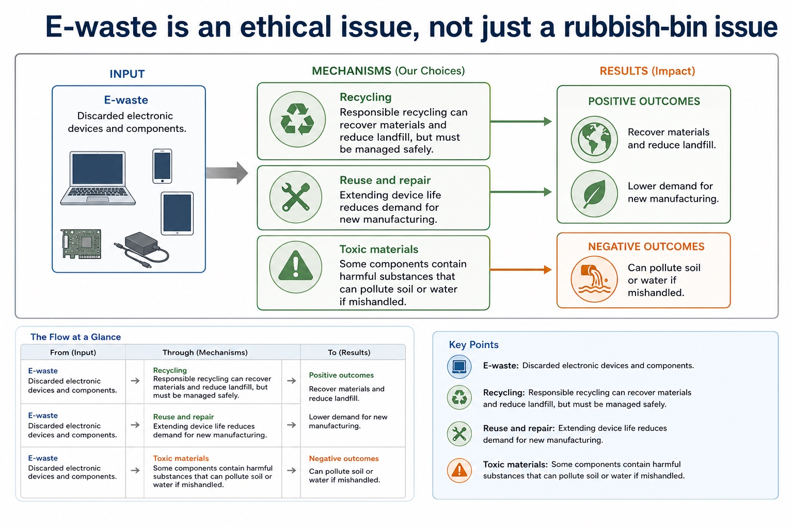

# Lesson 038: Artificial intelligence applications and impacts

**Course:** Cambridge International AS Level Computer Science 9618, 2027-2029 Version 2 
**Paper:** Paper 1 
**Syllabus:** Section 7: Ethics and ownership 
**Syllabus requirements:** S7.06 
**Pacing:** Flexible. Select the material set and practice depth needed by the learner.

## Teaching-depth menu

- **Quick route:** Use the diagnostic, learning objectives, first worked example and foundation question. Stop once the learner can explain the central distinction accurately.
- **Full route:** Use every knowledge-point material set, the worked method, the terminology check and all questions.
- **Deep route:** Add the prerequisite refresher, ask learners to connect the concept checklist, discuss the labelled extension and complete a transfer question without a model answer.

## 1. Prerequisite knowledge and quick diagnostic

Recall S7.01 before starting this lesson.

Ask the learner to give one accurate definition or method step before continuing. If they cannot, briefly revisit the named prerequisite rather than repeating the whole previous lesson.

### Optional prerequisite refresher

- Version 2 requires both the need for professional ethics and its purpose; evidence must connect responsible professional decisions to public interest, competence and accountability.
- Show understanding of the need for and purpose of ethics as a computing professional.

## 2. Knowledge explanation

### 1. AI · Applications · Evaluate · Social (S7.06)

**Concept map:** AI → applications → evaluate → social → economic → environmental → impacts

**Three-part explanation:**

1. Evidence must connect an AI mechanism to stakeholder consequences, benefits, harms and a contextual judgement
2. Every AI evaluation should identify the application or decision mechanism and trace social, economic and environmental impacts before reaching a contextual judgement with realistic mitigations
3. To evaluate an AI application, balance its social, economic and environmental impacts and reach a context-linked judgement

**Concrete cue:** Version 2 requires applications of AI and impacts across all three named dimensions: social, economic and environmental. Evidence must connect an AI mechanism to stakeholder consequences, benefits, harms and a…

#### Environmental impacts include energy use and resource consumption

Text transcript

- Energy use Devices, networks and data centres consume electricity during operation.
- Carbon emissions Emissions depend on electricity source, device manufacture and transport.
- Resource extraction Manufacturing hardware requires metals, rare materials, water and energy.
- Lifespan Short upgrade cycles increase manufacturing and disposal impact.

#### Social impacts affect work, communication and daily life

Text transcript

- Computing change
- Possible benefit
- Possible harm
- Remote work
- Less commuting, flexible work, access to wider jobs.
- Isolation, blurred work-life boundaries, unequal home access.
- Automation
- Efficiency, safer handling of dangerous or repetitive tasks.

#### What Cambridge-style marking usually rewards

Text transcript

- Precise term privacy, copyright, e-waste, digital divide, open source, stakeholder.
- Scenario link Explain how the issue affects the school, company, user or worker in the question.
- Consequence Say what happens: exclusion, legal risk, privacy loss, job displacement, reduced emissions.
- Balance Include both benefit and concern before final judgement in evaluate/discuss questions.

#### Patents protect inventions, not every line of code

Text transcript

- Patent A legal right protecting an invention for a limited time, often requiring novelty and inventive step.
- Invention A new technical solution, product or process; software patent rules vary by jurisdiction.
- Disclosure Patent applications normally require public description of the invention.
- Limitation Patents are expensive and time-limited; they do not protect all ideas or ordinary code automatically.

Precise syllabus wording

Show understanding of artificial intelligence, its applications and its social, economic and environmental impacts.

Version 2 requires applications of AI and impacts across all three named dimensions: social, economic and environmental. Evidence must connect an AI mechanism to stakeholder consequences, benefits, harms and a contextual judgement.

### Supporting diagram library

#### Classify the impact and choose a mitigation

Text transcript

- Interactive impact analyser
- Select a scenario and compare the positive impact, negative impact and mitigation.
- Scenario

#### The digital divide is about access, skills and inclusion

Text transcript

- Device access Some users cannot afford suitable hardware.
- Connectivity Reliable high-speed internet is not equally available.
- Digital skills Users may lack confidence or training to use online systems.
- Accessibility Systems should support users with disabilities or different needs.

#### E-waste is an ethical issue, not just a rubbish-bin issue

Text transcript

- E-waste Discarded electronic devices and components.
- Toxic materials Some components contain harmful substances that can pollute soil or water if mishandled.
- Recycling Responsible recycling can recover materials and reduce landfill, but must be managed safely.
- Reuse and repair Extending device life reduces demand for new manufacturing.

#### Use a balanced impact structure

Text transcript

- 1. Change Name the computing change, such as automation or online services.
- 2. Benefit Explain a positive impact for a named stakeholder.
- 3. Harm Explain a negative impact with a realistic consequence.
- 4. Mitigation Suggest a practical way to reduce harm.
- Answer frame:
- [Technology] benefits [stakeholder] because [reason]. However, it may harm [stakeholder] by [consequence]. This can be reduced by [mitigation].

#### Common contrasts that stop vague answers

Text transcript

- Contrast
- Difference
- Common error
- Privacy vs security
- Privacy concerns control of personal data; security protects systems/data from threats.
- Encryption alone does not answer every privacy ethics question.
- Copyright vs licence
- Copyright protects the work; a licence grants permission under conditions.

#### Section 7 topic map

Text transcript

- Trigger words
- Useful answer focus
- Ethical decisions
- stakeholders, consent, fairness, responsibility, proportionality
- benefits, harms, rights, responsibilities and justified judgement
- Privacy/data protection
- personal data, monitoring, surveillance, retention, access, consent
- data collected, purpose, risk, safeguard and transparency

#### The five-part evaluation answer

Text transcript

- 1. Context Use the actual scenario, not a memorised opening sentence.
- 2. Benefit Explain one advantage for a named stakeholder.
- 3. Concern Explain one risk, harm or right that may be affected.
- 4. Safeguard Suggest a condition, limit, policy or technical measure.
- 5. Judgement Reach a supported conclusion using "if", "provided that" or "unless".
- Answer frame:
- Although [benefit] helps [stakeholder], [concern] may harm [stakeholder]. Therefore, [decision] is justified only if [condition/safeguard].

Open precise terminology and exam facts

- Version 2 requires applications of AI and impacts across all three named dimensions: social, economic and environmental. Evidence must connect an AI mechanism to stakeholder consequences, benefits, harms and a contextual judgement.
- AI applications include medical image classification, recommendation, fraud detection, language processing, autonomous control and predictive maintenance. A valid impact answer names the AI decision mechanism and traces a consequence for a stakeholder.
- Social impacts include access, bias and privacy; economic impacts include productivity, job redesign and error cost; environmental impacts include data-centre energy/material use and optimisation of transport or power. Evaluation balances benefits, harms and mitigations in context.
- To evaluate an AI application, balance its social, economic and environmental impacts and reach a context-linked judgement.
- Professional ethics has a purpose: computing professionals must protect public interest, work competently and remain accountable for consequences. Joining a professional ethical body such as the British Computer Society (BCS) or the Institute of Electrical and Electronics Engineers (IEEE) provides codes of conduct, guidance, continuing professional development and a community that supports standards. In a situation, judge whether action is ethical or unethical and explain stakeholder impacts of both choices.
- Artificial intelligence (AI) applications include classification, recommendation, prediction and autonomous control. Every AI evaluation should identify the application or decision mechanism and trace social, economic and environmental impacts before reaching a contextual judgement with realistic mitigations.

### Worked example

1. AI recruitment review
2. An AI recruitment system may speed initial screening and reduce administrative cost, but biased data can unfairly exclude applicants, automated rejection can remove accountability, and model operation consumes computing resources.
3. Human review, representative data, appeal, data minimisation and efficient infrastructure address different harms.
4. The system is justified only if measured benefits outweigh social, economic and environmental costs under those safeguards.

Beyond syllabus / 延伸知识（不要求背诵）: professional decisions are often reviewed against law, organisational policy, public interest and a published code of conduct.
## 3. Practice by question type

### Question 1 - foundation - apply - 2 marks

Which three impact dimensions must an AI evaluation cover?

**Answer:** Social, economic and environmental impacts.

**Marking guidance:** Award one mark for each distinct, technically accurate point or method step.

**Common error:** For the command word apply, perform that exact action; do not replace it with an unrelated fact.

### Question 2 - application - evaluate - 4 marks

Evaluate the use of AI to select applicants for jobs.

**Answer:** valid benefit such as speed/consistent initial processing; valid risk such as bias, opacity, privacy or exclusion; explains a stakeholder consequence; balanced judgement or mitigation linked to the context

**Marking guidance:** Do not accept a list of generic advantages/disadvantages without linking AI decisions to consequences.

**Common error:** Do not repeat the same point in different words; each mark needs a separate idea or method step.

### Question 3 - transfer - give - 2 marks

Give one economic benefit of predictive maintenance.

**Answer:** Reduced downtime or repair cost by predicting failure.

**Marking guidance:** Award one mark for each distinct, technically accurate point or method step.

**Common error:** Do not copy the worked example unchanged; transfer the method and check it against the new context.

### Related past-paper indexes

| Reference | Marks | Command word | Question type |
|---|---:|---|---|
| 9618/11/S/25 Q4(a) | 4 | explain | explain |
| 9618/11/W/25 Q8(c) | 4 | complete | recall |
| 9618/12/S/25 Q3(a) | 4 | explain | explain |
| 9618/11/S/25 Q4(b) | 2 | explain | explain |

These are indexes only. Cambridge question and mark-scheme wording is not reproduced.

## 4. Summary and exam reminders

### Summary

- Define artificial intelligence applications and impacts with the exact technical vocabulary expected by the syllabus.
- Use the lesson method on a fresh context and show the intermediate decision, representation or calculation.
- Match the shape of the answer to the command word and the available marks.
- Check the final answer against the scenario instead of repeating a memorised sentence.

### Common error to correct

Students often write personal opinions only. Correction: ethics answers need stakeholders, evidence and balanced judgement.

### Exam technique

- Follow the command word: state gives a fact; explain links a cause to a consequence; compare covers both sides.
- Match the number of independent points or method steps to the available marks.
- For artificial intelligence applications and impacts, use the exact technical term before applying it to the scenario.
