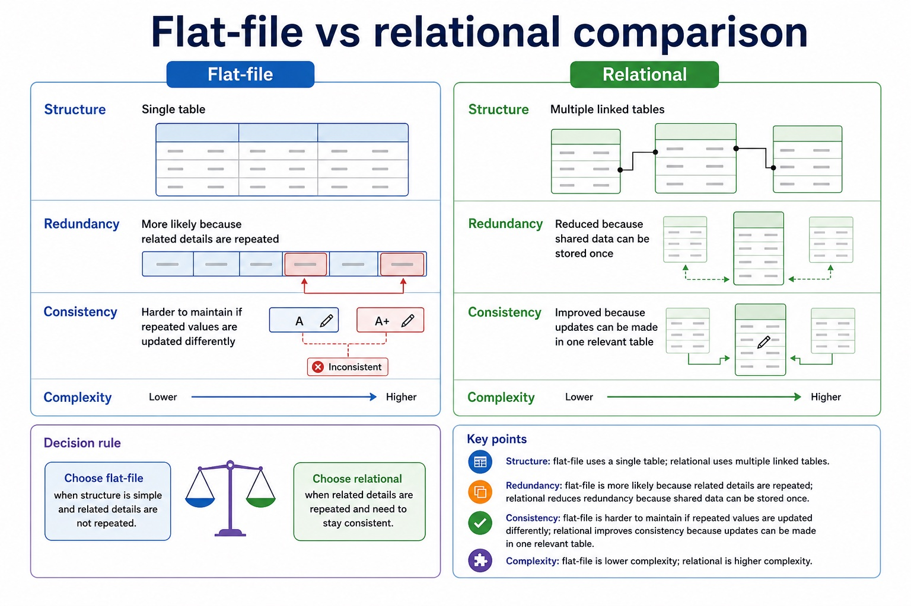
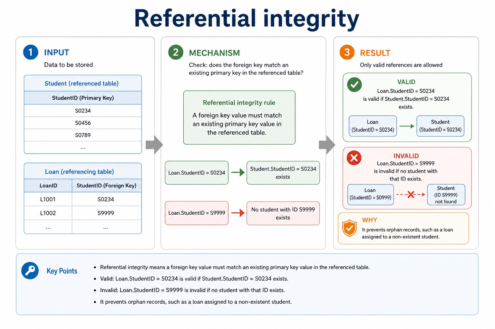

# Lesson 039: From file-based systems to relational databases

**Course:** Cambridge International AS Level Computer Science 9618, syllabus for examination in 2027-2029 
**Paper:** Paper 1 
**Syllabus:** Section 8: Databases 
**Syllabus requirements:** S8.01, S8.02 
**Pacing:** Flexible. Select a quick, full or deep route for the learners in front of you.

## Teaching-depth menu

- **Quick route:** Use the diagnostic, learning objectives, first worked example and foundation question. Stop once the learner can explain the central distinction accurately.
- **Full route:** Teach every knowledge-point material set, the worked method and all lesson questions.
- **Deep route:** Add the prerequisite refresher, ask learners to connect the concept checklist, discuss the labelled extension and complete a transfer question without a model answer.

## 1. Prerequisite knowledge and quick diagnostic

Recall S8.01 before starting this lesson.

Ask the learner to give one accurate definition or method step before continuing. If they cannot, briefly revisit the named prerequisite rather than repeating the whole previous lesson.

### Optional prerequisite refresher

- The syllabus requires both sides of the comparison: limitations of file-based storage/retrieval and relational-database features that address those limitations. Benefits must be linked to a mechanism rather than asserted generically.
- Explain limitations of file-based systems and how relational databases address them.

## 2. Knowledge explanation

### 1. Limitations of file-based systems and how relational databases address them (S8.01)

**Atomic learning targets**

- **S8.01.A01:** limitations
- **S8.01.A02:** file-based
- **S8.01.A03:** relational
- **S8.01.A04:** databases
- **S8.01.A05:** redundancy
- **S8.01.A06:** inconsistency
- **S8.01.A07:** linked tables

**Core explanation**

- A relational database addresses these limitations by separating entities into linked tables, storing shared facts once, identifying records with keys and enforcing relationships and constraints centrally. A DBMS supplies shared query processing, integrity, security, access rights and backup. These mechanisms reduce particular file-based risks; a relational design is not automatically smaller, simpler or error-free.
- A file-based approach stores data in separate application files. The same fact may be repeated in several files or records, causing redundancy and wasted storage. Updating only some copies creates inconsistency; insertion and deletion can also lose or require unrelated facts. Separate files may use incompatible formats, isolate data, duplicate validation/security code and make shared querying, concurrent access, backup and recovery harder to manage.
- Relational databases reduce selected file-based limitations by storing shared facts once in linked tables with centrally enforced rules.
- A relational database stores data in tables made of records and fields. A primary key uniquely identifies a record; a foreign key links to a primary key in another table and creates a relationship.
- Record and tuple are corresponding relational terms for one row; field and attribute are corresponding terms for one column.
- Limitations of file-based storage/retrieval and relational-database features that address those limitations.

**Mechanism or method**

1. **Identify the relevant condition or input** — A relational database addresses these limitations by separating entities into linked tables, storing shared facts once, identifying records with keys and enforcing relationships and constraints centrally.
2. **Trace how the process works** — A DBMS supplies shared query processing, integrity, security, access rights and backup.
3. **Connect the mechanism to its result** — a relational design is not automatically smaller, simpler or error-free.

#### Worked example: Limitations of file-based systems and how relational databases address them: complete worked route

1. **Identify the relevant condition or input**

A relational database addresses these limitations by separating entities into linked tables, storing shared facts once, identifying records with keys and enforcing relationships and constraints centrally.

2. **Trace how the process works**

A DBMS supplies shared query processing, integrity, security, access rights and backup.

3. **Connect the mechanism to its result**

a relational design is not automatically smaller, simpler or error-free.

4. **Complete example**

Keys for a student table / Delete a department / Use keys and an index: In Student(StudentID, Email, TutorGroup), StudentID and Email may be candidate keys if both are unique and minimal; StudentID is selected as primary. TutorGroup can be a secondary key for retrieving all students in one group even though many records share the value. An index on TutorGroup can provide a faster lookup route. If Employee.DepartmentID refers to Department.DepartmentID, deleting a department with employees would break referential integrity unless deletion is rejected or an authorised cascading policy handles dependent rows. StudentID is the primary key of Student. DepartmentID is a foreign key linking to Department. An index on Surname can speed searches by surname without changing which field is the primary key.

**Misconceptions to correct**

- Students often choose names as primary keys. Correction: a primary key must uniquely and reliably identify a record.

#### Mastery check (MC-L039-S8.01)

Explain the following targets in one connected answer, using a concrete example for each: limitations; file-based; relational; databases; redundancy; inconsistency; linked tables.

Answer criteria

- A relational database addresses these limitations by separating entities into linked tables, storing shared facts once, identifying records with keys and enforcing relationships and constraints centrally. A DBMS supplies shared query processing, integrity, security, access rights and backup. These mechanisms reduce particular file-based risks; a relational design is not automatically smaller, simpler or error-free.
- A file-based approach stores data in separate application files. The same fact may be repeated in several files or records, causing redundancy and wasted storage. Updating only some copies creates inconsistency; insertion and deletion can also lose or require unrelated facts. Separate files may use incompatible formats, isolate data, duplicate validation/security code and make shared querying, concurrent access, backup and recovery harder to manage.
- Relational databases reduce selected file-based limitations by storing shared facts once in linked tables with centrally enforced rules.
- A relational database stores data in tables made of records and fields. A primary key uniquely identifies a record; a foreign key links to a primary key in another table and creates a relationship.
- Record and tuple are corresponding relational terms for one row; field and attribute are corresponding terms for one column.
- Limitations of file-based storage/retrieval and relational-database features that address those limitations.

**Supplementary concept map**

- **file-based:** Relational databases reduce selected file-based limitations by storing…
- **linked tables:** A relational database addresses these limitations by separating…
- **limitations:** Limitations of file-based systems and how relational databases…
- **relational:** Limitations of file-based storage/retrieval and relational-database features that…
- **databases:** A relational database stores data in tables made…
- **redundancy:** The same fact may be repeated in several…

**Supplementary three-step recap**

1. **Identify structure and target data** — Relational databases reduce selected file-based limitations by storing shared facts once in linked tables with centrally enforced rules.
2. **Apply the database rule** — Limitations of file-based systems and how relational databases address them.
3. **Check keys rows and conditions** — Limitations of file-based storage/retrieval and relational-database features that address those limitations.

**Flat-file vs relational comparison:** Flat-file Relational

#### Flat-file vs relational comparison

Text transcript

- Flat-file
- Relational
- Structure
- Single table
- Multiple linked tables
- Redundancy
- More likely because related details are repeated
- Reduced because shared data can be stored once
- Consistency
- Harder to maintain if repeated values are updated differently
- Improved because updates can be made in one relevant table
- Complexity

Precise syllabus wording

Explain limitations of file-based systems and how relational databases address them.

The syllabus requires both sides of the comparison: limitations of file-based storage/retrieval and relational-database features that address those limitations. Benefits must be linked to a mechanism rather than asserted generically.

### 2. Entity/table, record/tuple, field/attribute, primary/candidate/secondary/foreign key, relationships, referential integrity and indexing (S8.02)

**Atomic learning targets**

- **S8.02.A01:** entity
- **S8.02.A02:** table
- **S8.02.A03:** record
- **S8.02.A04:** tuple
- **S8.02.A05:** field
- **S8.02.A06:** attribute
- **S8.02.A07:** primary key
- **S8.02.A08:** candidate key
- **S8.02.A09:** secondary key
- **S8.02.A10:** foreign key
- **S8.02.A11:** relationships
- **S8.02.A12:** one-to-one
- **S8.02.A13:** one-to-many
- **S8.02.A14:** many-to-many
- **S8.02.A15:** referential
- **S8.02.A16:** integrity
- **S8.02.A17:** indexing

**Core explanation**

- A one-to-one relationship links one record on each side. A one-to-many relationship links one parent record to many child records. A many-to-many relationship is normally implemented through a linking entity/table that creates two one-to-many relationships. Referential integrity prevents orphan records: insert, update and delete operations may be rejected or handled by a defined cascade/null policy, but must not silently leave an invalid reference.
- A candidate key is a minimal field or field set that uniquely identifies a record. One candidate key is selected as the primary key. A secondary key is a field used as an additional retrieval or ordering route and need not be unique; it is not another name for an unselected candidate key. A foreign key refers to a key in a related table. An index is a lookup structure built on one or more fields: it can speed retrieval but uses storage and must be maintained after changes.
- An entity is a real-world thing about which data is stored and is commonly represented by a table. A table contains records (tuples); each record describes one entity occurrence. A field (attribute) is one named property or column. These paired terms are related but should not be collapsed into one definition.
- Indexing creates an additional lookup structure for one or more fields so matching records can be located more quickly. The index consumes storage and must be updated when indexed data change.
- A file-based approach stores data in separate application files. The same fact may be repeated in several files or records, causing redundancy and wasted storage. Updating only some copies creates inconsistency; insertion and deletion can also lose or require unrelated facts. Separate files may use incompatible formats, isolate data, duplicate validation/security code and make shared querying, concurrent access, backup and recovery harder to manage.
- A relational database addresses these limitations by separating entities into linked tables, storing shared facts once, identifying records with keys and enforcing relationships and constraints centrally. A DBMS supplies shared query processing, integrity, security, access rights and backup. These mechanisms reduce particular file-based risks; a relational design is not automatically smaller, simpler or error-free.

**Mechanism or method**

1. **Identify the relevant condition or input** — A one-to-one relationship links one record on each side.
2. **Trace how the process works** — A one-to-many relationship links one parent record to many child records.
3. **Connect the mechanism to its result** — A many-to-many relationship is normally implemented through a linking entity/table that creates two one-to-many relationships.

#### Worked example: Entity/table, record/tuple, field/attribute, primary/candidate/secondary/foreign key, relationships, referential integrity and indexing: complete worked route

1. **Identify the relevant condition or input**

A one-to-one relationship links one record on each side.

2. **Trace how the process works**

A one-to-many relationship links one parent record to many child records.

3. **Connect the mechanism to its result**

A many-to-many relationship is normally implemented through a linking entity/table that creates two one-to-many relationships.

4. **Complete example**

Keys for a student table / Delete a department / Use keys and an index: In Student(StudentID, Email, TutorGroup), StudentID and Email may be candidate keys if both are unique and minimal; TutorGroup can be a secondary key for retrieving all students in one group even though many records share the value. If Employee.DepartmentID refers to Department.DepartmentID, deleting a department with employees would break referential integrity unless deletion is rejected or an authorised cascading policy handles dependent rows. StudentID is the primary key of Student. DepartmentID is a foreign key linking to Department. An index on Surname can speed searches by surname without changing which field is the primary key.

**Misconceptions to correct**

- Students often choose names as primary keys. Correction: a primary key must uniquely and reliably identify a record.

#### Mastery check (MC-L039-S8.02)

Explain the following targets in one connected answer, using a concrete example for each: entity; table; record; tuple; field; attribute; primary key; candidate key; secondary key; foreign key; relationships; one-to-one; one-to-many; many-to-many; referential; integrity; indexing.

Answer criteria

- A one-to-one relationship links one record on each side. A one-to-many relationship links one parent record to many child records. A many-to-many relationship is normally implemented through a linking entity/table that creates two one-to-many relationships. Referential integrity prevents orphan records: insert, update and delete operations may be rejected or handled by a defined cascade/null policy, but must not silently leave an invalid reference.
- A candidate key is a minimal field or field set that uniquely identifies a record. One candidate key is selected as the primary key. A secondary key is a field used as an additional retrieval or ordering route and need not be unique; it is not another name for an unselected candidate key. A foreign key refers to a key in a related table. An index is a lookup structure built on one or more fields: it can speed retrieval but uses storage and must be maintained after changes.
- An entity is a real-world thing about which data is stored and is commonly represented by a table. A table contains records (tuples); each record describes one entity occurrence. A field (attribute) is one named property or column. These paired terms are related but should not be collapsed into one definition.
- Indexing creates an additional lookup structure for one or more fields so matching records can be located more quickly. The index consumes storage and must be updated when indexed data change.
- A file-based approach stores data in separate application files. The same fact may be repeated in several files or records, causing redundancy and wasted storage. Updating only some copies creates inconsistency; insertion and deletion can also lose or require unrelated facts. Separate files may use incompatible formats, isolate data, duplicate validation/security code and make shared querying, concurrent access, backup and recovery harder to manage.
- A relational database addresses these limitations by separating entities into linked tables, storing shared facts once, identifying records with keys and enforcing relationships and constraints centrally. A DBMS supplies shared query processing, integrity, security, access rights and backup. These mechanisms reduce particular file-based risks; a relational design is not automatically smaller, simpler or error-free.

**Supplementary concept map**

- **primary key:** Entity, table, record, field, tuple, attribute, primary key,…
- **candidate key:** A foreign key is an attribute in one…
- **secondary key:** A secondary key is a field used as…
- **foreign key:** Entity/table, record/tuple, field/attribute, primary/candidate/secondary/foreign key, relationships, referential integrity…
- **entity:** A many-to-many relationship is normally implemented through a…
- **table:** Referential integrity means a foreign key value must…

**Supplementary three-step recap**

1. **Identify incoming data or signal** — Entity/table, record/tuple, field/attribute, primary/candidate/secondary/foreign key, relationships, referential integrity and indexing.
2. **Follow the physical or logical path** — Entity, table, record, field, tuple, attribute, primary key, candidate key, secondary key, foreign key, one-to-one, one-to-many, many-to-many, referential…
3. **Connect output to its use** — A foreign key is an attribute in one table that refers to a primary/candidate key in another table.

**Referential integrity:** Referential integrity means a foreign key value must match an existing primary key value in the referenced table. Valid Loan.StudentID = S0234 is valid if Student.StudentID = S0234 exists.

#### Referential integrity

Text transcript

- Referential integrity means a foreign key value must match an existing primary key value in the referenced table.
- Valid Loan.StudentID = S0234 is valid if Student.StudentID = S0234 exists.
- Invalid Loan.StudentID = S9999 is invalid if no student with that ID exists.
- Why It prevents orphan records, such as a loan assigned to a non-existent student.

Precise syllabus wording

Understand entity/table, record/tuple, field/attribute, primary/candidate/secondary/foreign key, relationships, referential integrity and indexing.

the syllabus explicitly names entity, table, record, field, tuple, attribute, primary key, candidate key, secondary key, foreign key, one-to-one, one-to-many, many-to-many, referential integrity and indexing. Secondary key is retained as a distinct retrieval term, not an alias for an alternate candidate key.

### Lesson technical reference

- The syllabus requires both sides of the comparison: limitations of file-based storage/retrieval and relational-database features that address those limitations. Benefits must be linked to a mechanism rather than asserted generically.
- the syllabus explicitly names entity, table, record, field, tuple, attribute, primary key, candidate key, secondary key, foreign key, one-to-one, one-to-many, many-to-many, referential integrity and indexing. Secondary key is retained as a distinct retrieval term, not an alias for an alternate candidate key.
- A file-based approach stores data in separate application files. The same fact may be repeated in several files or records, causing redundancy and wasted storage. Updating only some copies creates inconsistency; insertion and deletion can also lose or require unrelated facts. Separate files may use incompatible formats, isolate data, duplicate validation/security code and make shared querying, concurrent access, backup and recovery harder to manage.
- A relational database addresses these limitations by separating entities into linked tables, storing shared facts once, identifying records with keys and enforcing relationships and constraints centrally. A DBMS supplies shared query processing, integrity, security, access rights and backup. These mechanisms reduce particular file-based risks; a relational design is not automatically smaller, simpler or error-free.
- Record and tuple are corresponding relational terms for one row; field and attribute are corresponding terms for one column.
- Relational databases reduce selected file-based limitations by storing shared facts once in linked tables with centrally enforced rules.
- An entity is a real-world thing about which data is stored and is commonly represented by a table. A table contains records (tuples); each record describes one entity occurrence. A field (attribute) is one named property or column. These paired terms are related but should not be collapsed into one definition.
- A candidate key is a minimal field or field set that uniquely identifies a record. One candidate key is selected as the primary key. A secondary key is a field used as an additional retrieval or ordering route and need not be unique; it is not another name for an unselected candidate key. A foreign key refers to a key in a related table. An index is a lookup structure built on one or more fields: it can speed retrieval but uses storage and must be maintained after changes.
- A foreign key is an attribute in one table that refers to a primary/candidate key in another table. Referential integrity requires every non-null foreign-key value to match an existing referenced key.
- A one-to-one relationship links one record on each side. A one-to-many relationship links one parent record to many child records. A many-to-many relationship is normally implemented through a linking entity/table that creates two one-to-many relationships. Referential integrity prevents orphan records: insert, update and delete operations may be rejected or handled by a defined cascade/null policy, but must not silently leave an invalid reference.
- A relational database stores data in tables made of records and fields. A primary key uniquely identifies a record; a foreign key links to a primary key in another table and creates a relationship.
- Indexing creates an additional lookup structure for one or more fields so matching records can be located more quickly. The index consumes storage and must be updated when indexed data change.

Beyond syllabus / 延伸知识（不要求背诵）: production databases also manage transactions and concurrent users; these ideas extend the syllabus model of integrity and access control.
## 3. Practice by question type

### Question 1 - foundation - explain - 6 marks

A clinic repeats patient details in separate appointment, billing and treatment files. Explain three file-based limitations and a relational-database feature that addresses each one.

**Answer:** repeated patient facts cause redundancy or wasted storage; linked tables store a shared patient fact once; separate copies can become inconsistent after partial updates; central keys/constraints and one stored fact improve consistency; isolated files/formats make combined retrieval or control difficult; DBMS query, integrity, access-right or backup service addresses the named difficulty

**Marking guidance:** Do not award a generic claim such as 'relational is better' without a named limitation, mechanism and consequence.

**Common error:** For the command word explain, perform that exact action; do not replace it with an unrelated fact.

### Question 2 - application - design - 7 marks

A school currently repeats student details in a loan file. Propose a relational design and write a two-table query listing StudentName and DueDate for unreturned loans.

**Answer:** identifies redundancy/inconsistency in the repeated file; separates Student and Loan with suitable primary keys; uses StudentID as a foreign key in Loan and preserves referential integrity; SELECT contains StudentName and DueDate; uses Student INNER JOIN Loan; ON matches Student.StudentID to Loan.StudentID; WHERE Loan.Returned = FALSE

**Marking guidance:** Do not accept a three-table query, comma-style join, unexplained table split or unsupported claim that normalisation alone validates every value.

**Common error:** Do not repeat the same point in different words; each mark needs a separate idea or method step.

### Question 3 - transfer - apply - 2 marks

Which relational feature connects an order to its customer?

**Answer:** A foreign key in Order referring to the Customer primary key.

**Marking guidance:** Award one mark for each distinct, technically accurate point or method step.

**Common error:** Do not copy the worked example unchanged; transfer the method and check it against the new context.

### Related past-paper indexes

| Reference | Marks | Command word | Question type |
|---|---:|---|---|
| 9618/12/W/24 Q6(i) | 6 | explain | explain |
| 9618/11/W/24 Q3(i) | 4 | complete | recall |
| 9618/11/W/24 Q2(a) | 3 | explain | explain |
| 9618/11/W/24 Q2(i) | 3 | complete | recall |

These are indexes only. Cambridge question and mark-scheme wording is not reproduced.

## 4. Summary and exam reminders

### Summary

- S8.01: explain limitations, file-based, relational, databases, redundancy, inconsistency, linked tables.
- S8.01 method: Identify the relevant condition or input → Trace how the process works → Connect the mechanism to its result.
- S8.02: explain entity, table, record, tuple, field, attribute, primary key, candidate key, secondary key, foreign key, relationships, one-to-one, one-to-many, many-to-many, referential, integrity, indexing.
- S8.02 method: Identify the relevant condition or input → Trace how the process works → Connect the mechanism to its result.
- Correction to remember: Students often choose names as primary keys. Correction: a primary key must uniquely and reliably identify a record.

### Common error to correct

Students often choose names as primary keys. Correction: a primary key must uniquely and reliably identify a record.

### Exam technique

- Follow the command word: state gives a fact; explain links a cause to a consequence; compare covers both sides.
- Match the number of independent points or method steps to the available marks.
- For from file-based systems to relational databases, use the exact technical term before applying it to the scenario.
