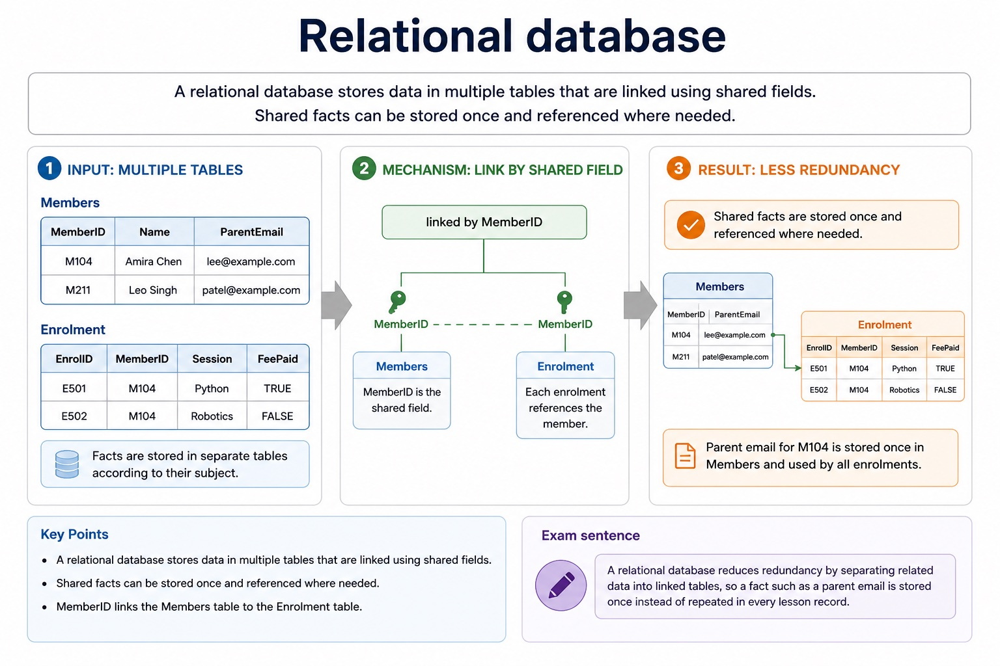
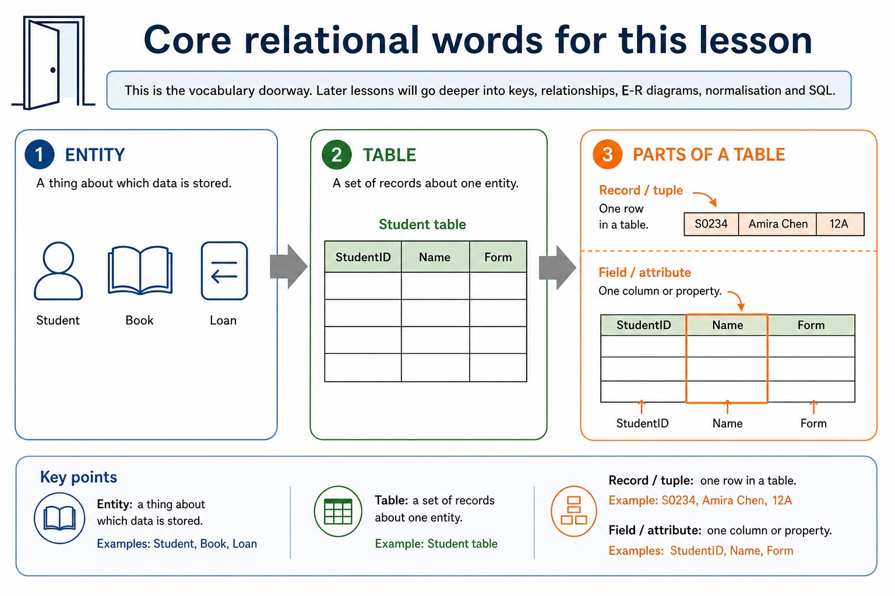
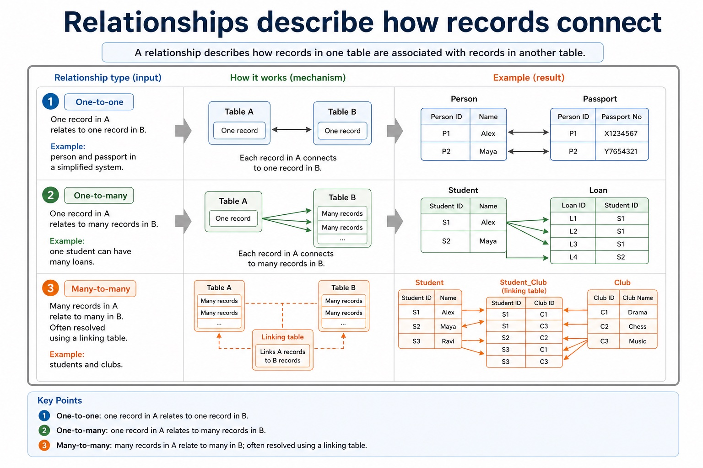
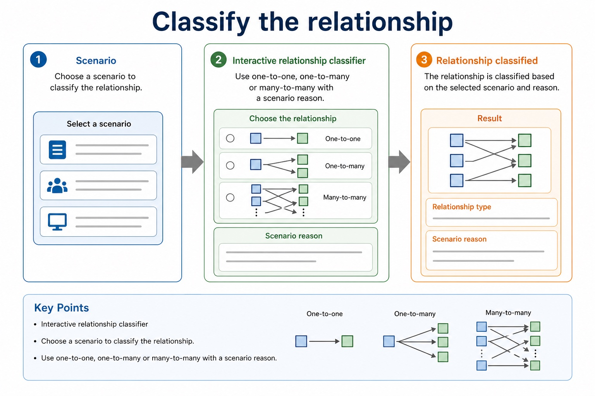
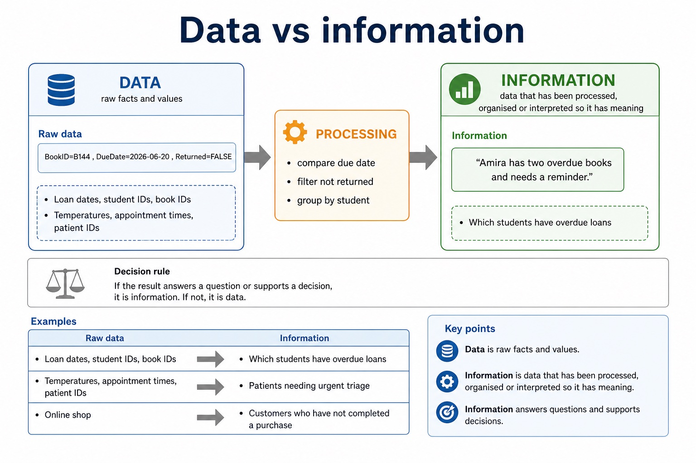
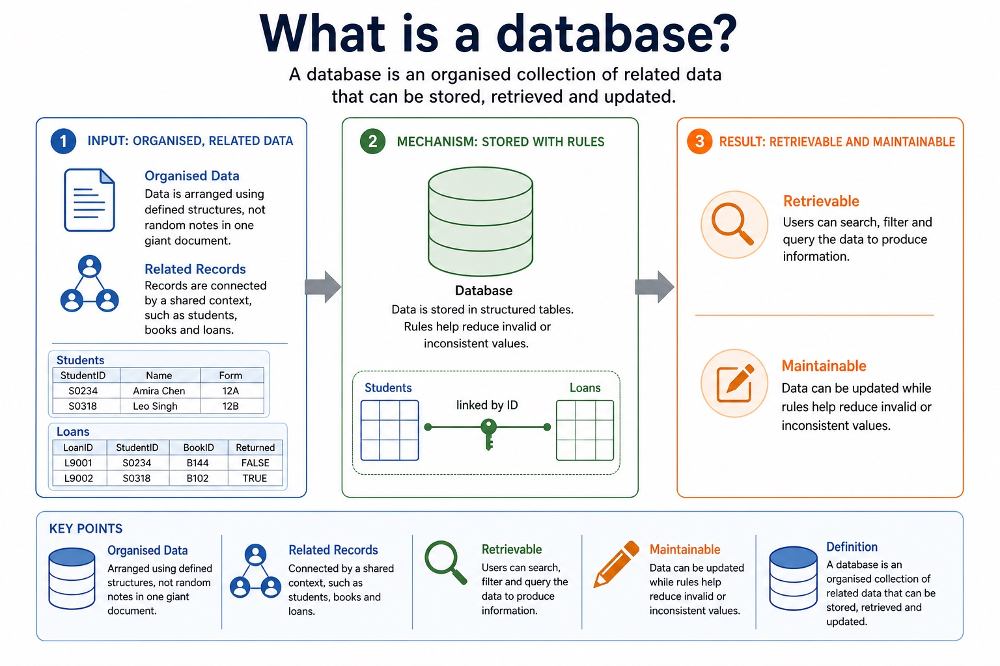
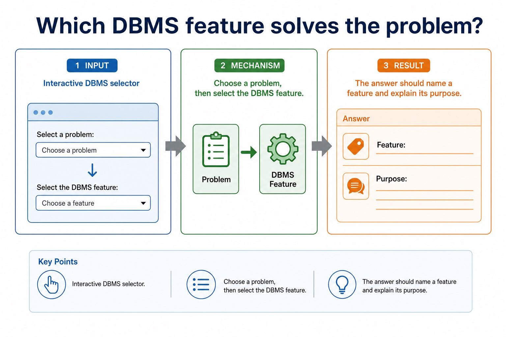
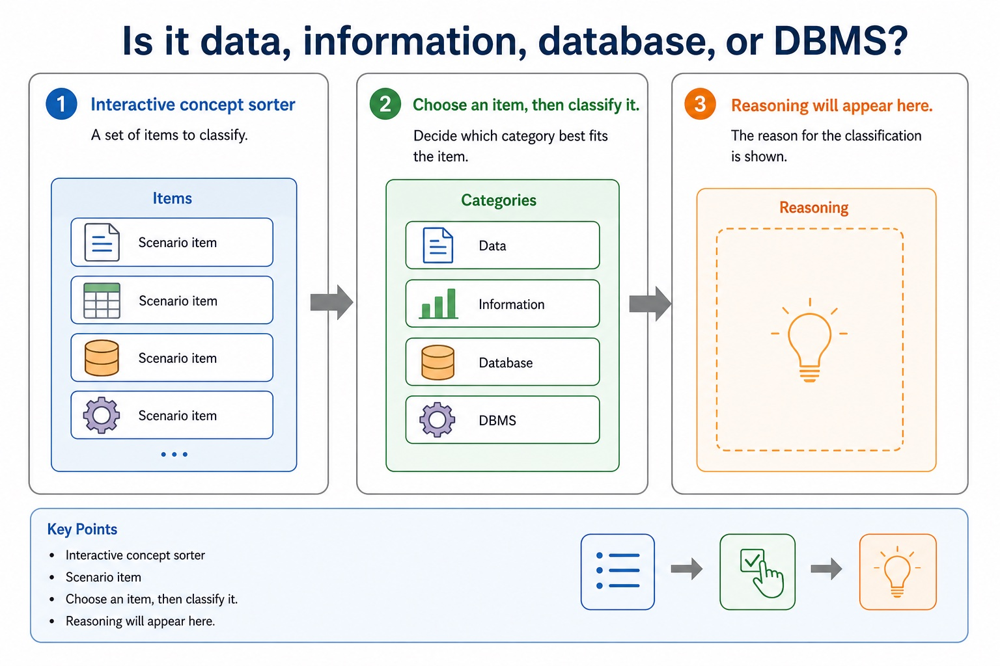
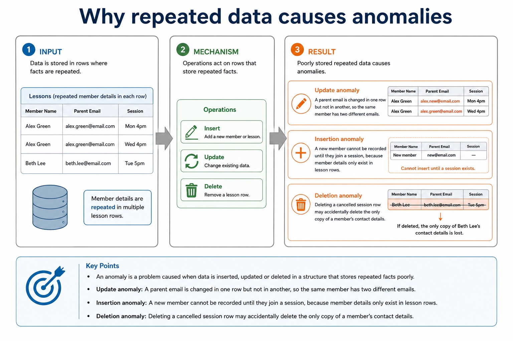
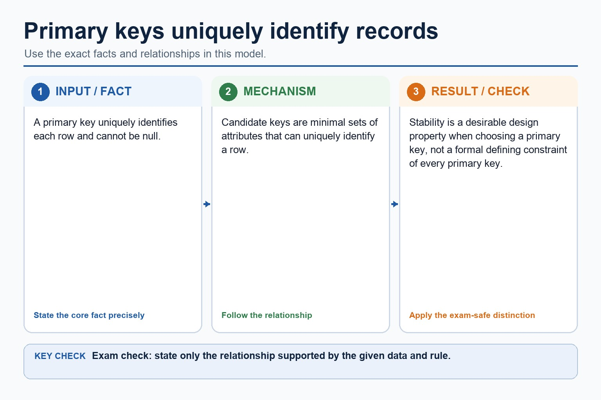

# Lesson 039: From file-based systems to relational databases

**Course:** Cambridge International AS Level Computer Science 9618, 2027-2029 Version 2 
**Paper:** Paper 1 
**Syllabus:** Section 8: Databases 
**Syllabus requirements:** S8.01, S8.02 
**Pacing:** Flexible. Select the material set and practice depth needed by the learner.

## Teaching-depth menu

- **Quick route:** Use the diagnostic, learning objectives, first worked example and foundation question. Stop once the learner can explain the central distinction accurately.
- **Full route:** Use every knowledge-point material set, the worked method, the terminology check and all questions.
- **Deep route:** Add the prerequisite refresher, ask learners to connect the concept checklist, discuss the labelled extension and complete a transfer question without a model answer.

## 1. Prerequisite knowledge and quick diagnostic

Recall S8.01 before starting this lesson.

Ask the learner to give one accurate definition or method step before continuing. If they cannot, briefly revisit the named prerequisite rather than repeating the whole previous lesson.

### Optional prerequisite refresher

- Version 2 requires both sides of the comparison: limitations of file-based storage/retrieval and relational-database features that address those limitations. Benefits must be linked to a mechanism rather than asserted generically.
- Explain limitations of file-based systems and how relational databases address them.

## 2. Knowledge explanation

### 1. Limitations · File-based · Relational · Databases (S8.01)

**Concept map:** limitations → file-based → relational → databases → redundancy → inconsistency → linked tables

**Three-part explanation:**

1. limitations of file-based storage/retrieval and relational-database features that address those limitations
2. Benefits must be linked to a mechanism rather than asserted generically
3. A relational database addresses these limitations by separating entities into linked tables, storing shared facts once, identifying records with keys and enforcing relationships and constraints centrally

**Concrete cue:** Version 2 requires both sides of the comparison: limitations of file-based storage/retrieval and relational-database features that address those limitations. Benefits must be linked to a mechanism rather than asserted generically.

#### Flat-file vs relational comparison

Text transcript

- Flat-file
- Relational
- Structure
- Single table
- Multiple linked tables
- Redundancy
- More likely because related details are repeated
- Reduced because shared data can be stored once

#### Relational database

Text transcript

- A relational database stores data in multiple tables that are linked using shared fields. Shared facts can be stored once and referenced where needed.
- MemberID \| Name \| ParentEmail
- M104 \| Amira Chen \| lee@example.com
- M211 \| Leo Singh \| patel@example.com
- linked by MemberID
- Enrolment
- EnrolID \| MemberID \| Session \| FeePaid
- E501 \| M104 \| Python \| TRUE

#### Section 8 basics so far

Text transcript

- Monthly checkpoint
- This checkpoint connects Lessons 079-080 without becoming a full exam.
- 1. Define data, information, database, DBMS, flat-file, relational database.
- 2. Compare one-table repeated data vs linked tables with reduced redundancy.
- 3. Design choose data types and constraints for five fields in a small scenario.

#### Relational design: what earns marks?

Text transcript

- Design review
- Primary key Uniquely identifies a record in one table. It must be unique and reliable.
- Foreign key Stores a value that matches a primary key in another table, creating a relationship.
- Normalisation Separates repeated data into related tables to reduce duplication and update errors.

#### Core relational words for this lesson

Text transcript

- This is the vocabulary doorway. Later lessons will go deeper into keys, relationships, E-R diagrams, normalisation and SQL.
- A thing about which data is stored
- Student, Book, Loan
- A set of records about one entity
- Student table
- Record / tuple
- One row in a table
- S0234, Amira Chen, 12A

Precise syllabus wording

Explain limitations of file-based systems and how relational databases address them.

Version 2 requires both sides of the comparison: limitations of file-based storage/retrieval and relational-database features that address those limitations. Benefits must be linked to a mechanism rather than asserted generically.

### 2. Entity · Table · Record · Tuple (S8.02)

**Concept map:** entity → table → record → tuple → field → attribute → primary key → candidate key → secondary key → foreign key → relationships → one-to-one → one-to-many → many-to-many → referential → integrity → indexing

**Three-part explanation:**

1. Version 2 explicitly names entity, table, record, field, tuple, attribute, primary key, candidate key, secondary key, foreign key, one-to-one, one-to-many, many-to-many, referential integrity and indexing
2. Secondary key is retained as a distinct retrieval term, not an alias for an alternate candidate key
3. A foreign key is an attribute in one table that refers to a primary/candidate key in another table

**Concrete cue:** Version 2 explicitly names entity, table, record, field, tuple, attribute, primary key, candidate key, secondary key, foreign key, one-to-one, one-to-many, many-to-many, referential integrity and indexing. Secondary key is retained as…

#### Relationships describe how records connect

Text transcript

- A relationship describes how records in one table are associated with records in another table.
- One-to-one One record in A relates to one record in B. Example: person and passport in a simplified system.
- One-to-many One record in A relates to many records in B. Example: one student can have many loans.
- Many-to-many Many records in A relate to many in B. Often resolved using a linking table. Example: students and clubs.

#### Referential integrity

Text transcript

- Referential integrity means a foreign key value must match an existing primary key value in the referenced table.
- Valid Loan.StudentID = S0234 is valid if Student.StudentID = S0234 exists.
- Invalid Loan.StudentID = S9999 is invalid if no student with that ID exists.
- Why It prevents orphan records, such as a loan assigned to a non-existent student.

#### Tables, records and fields

Text transcript

- A table stores records about one entity. A record is one complete row. A field is one column or attribute.
- A collection of records for one entity
- Student table
- Record / tuple
- One complete row in a table
- S0234, Amira Chen, 2009-04-18, TRUE
- Field / attribute
- One column or property stored for each record

#### Foreign keys link tables

Text transcript

- A foreign key is a field in one table that references the primary key in another table. It creates a link between related records.
- StudentID \| Name
- S0234 \| Alex Chen
- S0318 \| Maya Patel
- StudentID links tables
- LoanID \| StudentID \| BookID
- L9001 \| S0234 \| B144
- L9002 \| S0234 \| B102

#### Cardinality describes how many records may be linked

Text transcript

- Cardinality states how many records in one entity can be associated with records in another entity.
- One-to-one One record in A links to one record in B. Example: one person has one passport in a simplified model.
- One-to-many One record in A links to many records in B. Example: one customer can place many orders.
- Many-to-many Many records in A link to many records in B. Usually resolved by a linking entity.
- 1 - many

#### Classify the relationship

Text transcript

- Interactive relationship classifier
- Scenario
- Choose a scenario to classify the relationship.
- Use one-to-one, one-to-many or many-to-many with a scenario reason.

Precise syllabus wording

Understand entity/table, record/tuple, field/attribute, primary/candidate/secondary/foreign key, relationships, referential integrity and indexing.

Version 2 explicitly names entity, table, record, field, tuple, attribute, primary key, candidate key, secondary key, foreign key, one-to-one, one-to-many, many-to-many, referential integrity and indexing. Secondary key is retained as a distinct retrieval term, not an alias for an alternate candidate key.

### Supporting diagram library

#### Data vs information

Text transcript

- Data is raw facts and values. Information is data that has been processed, organised or interpreted so it has meaning.
- Raw data
- BookID=B144 , DueDate=2026-06-20 , Returned=FALSE
- Processing
- compare due date, filter not returned, group by student
- Information
- "Amira has two overdue books and needs a reminder."
- Loan dates, student IDs, book IDs

#### What is a database?

Text transcript

- A database is an organised collection of related data that can be stored, retrieved and updated.
- Organised Data is arranged using defined structures, not random notes in one giant document.
- Related Records are connected by a shared context, such as students, books and loans.
- Retrievable Users can search, filter and query the data to produce information.
- Maintainable Data can be updated while rules help reduce invalid or inconsistent values.
- StudentID \| Name \| Form
- S0234 \| Amira Chen \| 12A
- S0318 \| Leo Singh \| 12B

#### Which DBMS feature solves the problem?

Text transcript

- Interactive DBMS selector
- Choose a problem, then select the DBMS feature.
- The answer should name a feature and explain its purpose.

#### Is it data, information, database, or DBMS?

Text transcript

- Interactive concept sorter
- Scenario item
- Choose an item, then classify it.
- Reasoning will appear here.

#### Why repeated data causes anomalies

Text transcript

- An anomaly is a problem caused when data is inserted, updated or deleted in a structure that stores repeated facts poorly.
- Update anomaly A parent email is changed in one row but not in another, so the same member has two different emails.
- Insertion anomaly A new member cannot be recorded until they join a session, because member details only exist in lesson rows.
- Deletion anomaly Deleting a cancelled session row may accidentally delete the only copy of a member's contact details.

#### Flat-file database

Text transcript

- A flat-file database stores data in a single table. It is simple, but related data may be repeated in many records.
- MemberID
- ParentEmail
- Amira Chen
- lee@example.com
- Robotics
- Leo Singh
- patel@example.com

#### Choose the best primary key

Text transcript

- Interactive key picker
- Choose a table to identify the strongest primary key.
- A good primary key is unique, not null and stable.

#### Primary keys uniquely identify records

Text transcript

- A primary key uniquely identifies each row and cannot be null.
- Candidate keys are minimal sets of attributes that can uniquely identify a row.
- Stability is a desirable design property when choosing a primary key, not a formal defining constraint of every primary key.

#### Section 8 knowledge map

Text transcript

- Retrieval map
- Data and DBMS data vs information; DBMS roles; avoiding flat-file limitations
- Tables and keys records, fields, data types, constraints, primary keys and foreign keys
- Design entity-relationship modelling and normalisation to reduce duplication
- SQL retrieval SELECT , FROM , WHERE , ORDER BY , aggregates and joins
- SQL modification INSERT , UPDATE , DELETE , field/value matching and safe WHERE
- Protection validation, verification, security controls, backups and restore testing

#### Do not swap the security vocabulary

Text transcript

- Protection review
- Validation Checks data follows rules, such as range, type, format or presence.
- Verification Checks entered data matches a source, using proofreading or double entry.
- Security and backup Security restricts access; backup enables recovery after loss or corruption.

#### SQL clauses: choose the clause that matches the request

Text transcript

- For the clauses shown, written syntax order is SELECT, FROM, WHERE, GROUP BY, ORDER BY.
- A simplified logical processing order is FROM, WHERE, GROUP BY, SELECT, ORDER BY.
- GROUP BY forms groups and ORDER BY sorts the final rows.
- Written syntax order and logical processing order are different.

#### Trace one mixed SQL result

Text transcript

- Interactive SQL tracer
- Category
- Networks
- Computing
- Literature
- Databases
- Choose a query to see the result.

Open precise terminology and exam facts

- Version 2 requires both sides of the comparison: limitations of file-based storage/retrieval and relational-database features that address those limitations. Benefits must be linked to a mechanism rather than asserted generically.
- Version 2 explicitly names entity, table, record, field, tuple, attribute, primary key, candidate key, secondary key, foreign key, one-to-one, one-to-many, many-to-many, referential integrity and indexing. Secondary key is retained as a distinct retrieval term, not an alias for an alternate candidate key.
- A file-based approach stores data in separate application files. The same fact may be repeated in several files or records, causing redundancy and wasted storage. Updating only some copies creates inconsistency; insertion and deletion can also lose or require unrelated facts. Separate files may use incompatible formats, isolate data, duplicate validation/security code and make shared querying, concurrent access, backup and recovery harder to manage.
- A relational database addresses these limitations by separating entities into linked tables, storing shared facts once, identifying records with keys and enforcing relationships and constraints centrally. A DBMS supplies shared query processing, integrity, security, access rights and backup. These mechanisms reduce particular file-based risks; a relational design is not automatically smaller, simpler or error-free.
- Record and tuple are corresponding relational terms for one row; field and attribute are corresponding terms for one column.
- Relational databases reduce selected file-based limitations by storing shared facts once in linked tables with centrally enforced rules.
- An entity is a real-world thing about which data is stored and is commonly represented by a table. A table contains records (tuples); each record describes one entity occurrence. A field (attribute) is one named property or column. These paired terms are related but should not be collapsed into one definition.
- A candidate key is a minimal field or field set that uniquely identifies a record. One candidate key is selected as the primary key. A secondary key is a field used as an additional retrieval or ordering route and need not be unique; it is not another name for an unselected candidate key. A foreign key refers to a key in a related table. An index is a lookup structure built on one or more fields: it can speed retrieval but uses storage and must be maintained after changes.
- A foreign key is an attribute in one table that refers to a primary/candidate key in another table. Referential integrity requires every non-null foreign-key value to match an existing referenced key.
- A one-to-one relationship links one record on each side. A one-to-many relationship links one parent record to many child records. A many-to-many relationship is normally implemented through a linking entity/table that creates two one-to-many relationships. Referential integrity prevents orphan records: insert, update and delete operations may be rejected or handled by a defined cascade/null policy, but must not silently leave an invalid reference.
- A relational database stores data in tables made of records and fields. A primary key uniquely identifies a record; a foreign key links to a primary key in another table and creates a relationship.
- Indexing creates an additional lookup structure for one or more fields so matching records can be located more quickly. The index consumes storage and must be updated when indexed data change.

### Worked example

1. Keys for a student table
2. Delete a department
3. Use keys and an index
4. In Student(StudentID, Email, TutorGroup), StudentID and Email may be candidate keys if both are unique and minimal; StudentID is selected as primary.
5. TutorGroup can be a secondary key for retrieving all students in one group even though many records share the value.
6. An index on TutorGroup can provide a faster lookup route.

Beyond syllabus / 延伸知识（不要求背诵）: production databases also manage transactions and concurrent users; these ideas extend the syllabus model of integrity and access control.
## 3. Practice by question type

### Question 1 - foundation - explain - 6 marks

A clinic repeats patient details in separate appointment, billing and treatment files. Explain three file-based limitations and a relational-database feature that addresses each one.

**Answer:** repeated patient facts cause redundancy or wasted storage; linked tables store a shared patient fact once; separate copies can become inconsistent after partial updates; central keys/constraints and one stored fact improve consistency; isolated files/formats make combined retrieval or control difficult; DBMS query, integrity, access-right or backup service addresses the named difficulty

**Marking guidance:** Do not award a generic claim such as 'relational is better' without a named limitation, mechanism and consequence.

**Common error:** For the command word explain, perform that exact action; do not replace it with an unrelated fact.

### Question 2 - application - design - 7 marks

A school currently repeats student details in a loan file. Propose a relational design and write a two-table query listing StudentName and DueDate for unreturned loans.

**Answer:** identifies redundancy/inconsistency in the repeated file; separates Student and Loan with suitable primary keys; uses StudentID as a foreign key in Loan and preserves referential integrity; SELECT contains StudentName and DueDate; uses Student INNER JOIN Loan; ON matches Student.StudentID to Loan.StudentID; WHERE Loan.Returned = FALSE

**Marking guidance:** Do not accept a three-table query, comma-style join, unexplained table split or unsupported claim that normalisation alone validates every value.

**Common error:** Do not repeat the same point in different words; each mark needs a separate idea or method step.

### Question 3 - transfer - apply - 2 marks

Which relational feature connects an order to its customer?

**Answer:** A foreign key in Order referring to the Customer primary key.

**Marking guidance:** Award one mark for each distinct, technically accurate point or method step.

**Common error:** Do not copy the worked example unchanged; transfer the method and check it against the new context.

### Related past-paper indexes

| Reference | Marks | Command word | Question type |
|---|---:|---|---|
| 9618/12/W/24 Q6(i) | 6 | explain | explain |
| 9618/11/W/24 Q3(i) | 4 | complete | recall |
| 9618/11/W/24 Q2(a) | 3 | explain | explain |
| 9618/11/W/24 Q2(i) | 3 | complete | recall |

These are indexes only. Cambridge question and mark-scheme wording is not reproduced.

## 4. Summary and exam reminders

### Summary

- Define from file-based systems to relational databases with the exact technical vocabulary expected by the syllabus.
- Use the lesson method on a fresh context and show the intermediate decision, representation or calculation.
- Match the shape of the answer to the command word and the available marks.
- Check the final answer against the scenario instead of repeating a memorised sentence.

### Common error to correct

Students often choose names as primary keys. Correction: a primary key must uniquely and reliably identify a record.

### Exam technique

- Follow the command word: state gives a fact; explain links a cause to a consequence; compare covers both sides.
- Match the number of independent points or method steps to the available marks.
- For from file-based systems to relational databases, use the exact technical term before applying it to the scenario.
