# Lesson 040: Entity-relationship design and normalisation

**Course:** Cambridge International AS Level Computer Science 9618, 2027-2029 Version 2 
**Paper:** Paper 1 
**Syllabus:** Section 8: Databases 
**Syllabus requirements:** S8.03, S8.04 
**Pacing:** Flexible. Select the material set and practice depth needed by the learner.

## Teaching-depth menu

- **Quick route:** Use the diagnostic, learning objectives, first worked example and foundation question. Stop once the learner can explain the central distinction accurately.
- **Full route:** Use every knowledge-point material set, the worked method, the terminology check and all questions.
- **Deep route:** Add the prerequisite refresher, ask learners to connect the concept checklist, discuss the labelled extension and complete a transfer question without a model answer.

## 1. Prerequisite knowledge and quick diagnostic

Recall S8.02 before starting this lesson.

Ask the learner to give one accurate definition or method step before continuing. If they cannot, briefly revisit the named prerequisite rather than repeating the whole previous lesson.

### Optional prerequisite refresher

- Version 2 explicitly names entity, table, record, field, tuple, attribute, primary key, candidate key, secondary key, foreign key, one-to-one, one-to-many, many-to-many, referential integrity and indexing. Secondary key is retained as a distinct retrieval term, not an alias for an alternate candidate key.
- Understand entity/table, record/tuple, field/attribute, primary/candidate/secondary/foreign key, relationships, referential integrity and indexing.

## 2. Knowledge explanation

### 1. Entity-relationship · Diagram (S8.03)

**Concept map:** entity-relationship → diagram

**Three-part explanation:**

1. Evidence must include entities, relationships and cardinality, not merely define entity and attribute
2. Version 2 requires candidates to use an entity-relationship diagram to document a database design
3. An entity-relationship (E-R) diagram documents a database design by showing the entities, their relevant attributes or keys, the relationships between entities and the relationship cardinality

**Concrete cue:** Version 2 requires candidates to use an entity-relationship diagram to document a database design. Evidence must include entities, relationships and cardinality, not merely define entity and attribute.

#### Section 8 knowledge map

Text transcript

- Retrieval map
- Data and DBMS data vs information; DBMS roles; avoiding flat-file limitations
- Tables and keys records, fields, data types, constraints, primary keys and foreign keys
- Design entity-relationship modelling and normalisation to reduce duplication
- SQL retrieval SELECT , FROM , WHERE , ORDER BY , aggregates and joins
- SQL modification INSERT , UPDATE , DELETE , field/value matching and safe WHERE
- Protection validation, verification, security controls, backups and restore testing

Precise syllabus wording

Produce and interpret entity-relationship diagrams.

Version 2 requires candidates to use an entity-relationship diagram to document a database design. Evidence must include entities, relationships and cardinality, not merely define entity and attribute.

### 2. 1NF · 2NF · 3NF · Normalised (S8.04)

**Concept map:** 1NF → 2NF → 3NF → normalised → design

**Three-part explanation:**

1. Version 2 names First, Second and Third Normal Form and separately requires candidates to explain whether given tables are in 3NF and to produce a normalised…
2. and explain or produce 1NF, 2NF and 3NF designs
3. Version 2 requires candidates to use an entity-relationship diagram to document a database design

**Concrete cue:** Version 2 names First, Second and Third Normal Form and separately requires candidates to explain whether given tables are in 3NF and to produce a normalised design from a description,…

#### How normal forms remove dependency problems

Text transcript

- First Normal Form (1NF) requires atomic values and no repeating groups.
- Second Normal Form (2NF) is in 1NF and removes partial dependency: each non-key attribute depends on the whole primary key.
- Third Normal Form (3NF) is in 2NF and removes transitive dependency: a non-key attribute must not depend on another non-key attribute.
- A valid decomposition retains every original fact, preserves keys and relationships, and follows the stated functional dependencies.

#### Relational design: what earns marks?

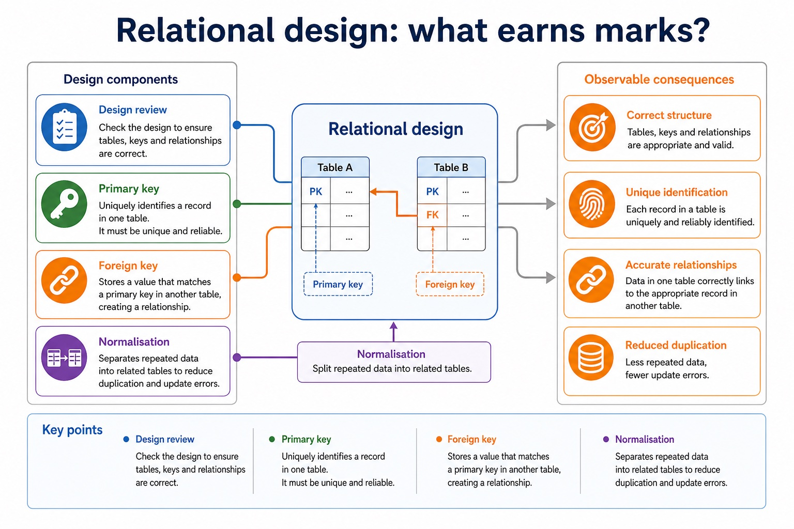

Text transcript

- Design review
- Primary key Uniquely identifies a record in one table. It must be unique and reliable.
- Foreign key Stores a value that matches a primary key in another table, creating a relationship.
- Normalisation Separates repeated data into related tables to reduce duplication and update errors.

#### Designing fields properly

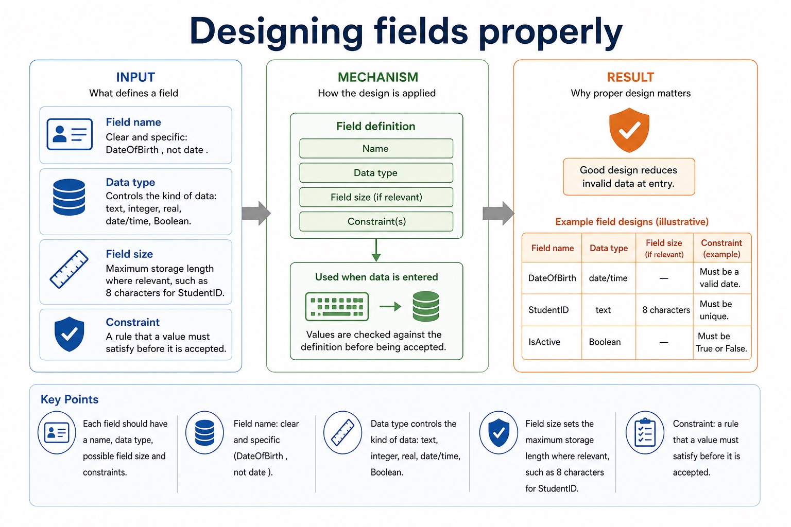

Text transcript

- Each field should have a name, data type, possible field size and constraints. Good design reduces invalid data at entry.
- Field name Clear and specific: DateOfBirth , not date .
- Data type Controls the kind of data: text, integer, real, date/time, Boolean.
- Field size Maximum storage length where relevant, such as 8 characters for StudentID.
- Constraint A rule that a value must satisfy before it is accepted.

Precise syllabus wording

Understand 1NF, 2NF and 3NF; explain 3NF and produce a normalised design.

Version 2 names First, Second and Third Normal Form and separately requires candidates to explain whether given tables are in 3NF and to produce a normalised design from a description, data or tables.

### Supporting diagram library

#### Section 8 basics so far

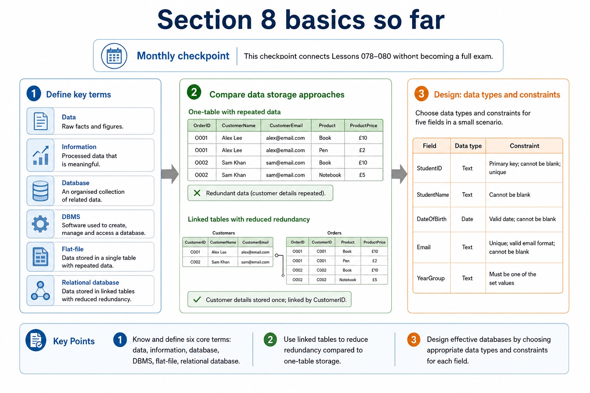

Text transcript

- Monthly checkpoint
- This checkpoint connects Lessons 079-080 without becoming a full exam.
- 1. Define data, information, database, DBMS, flat-file, relational database.
- 2. Compare one-table repeated data vs linked tables with reduced redundancy.
- 3. Design choose data types and constraints for five fields in a small scenario.

#### Which rule rejects the bad value?

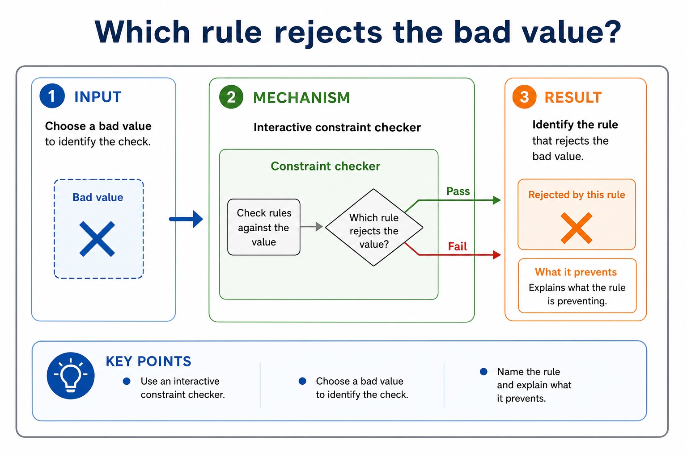

Text transcript

- Interactive constraint checker
- Bad value
- Choose a bad value to identify the check.
- Name the rule and explain what it prevents.

#### Constraints and validation rules

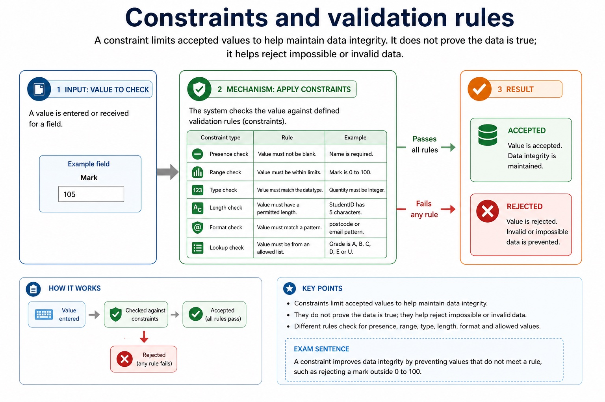

Text transcript

- A constraint limits accepted values to help maintain data integrity. It does not prove the data is true; it helps reject impossible or invalid data.
- Presence check Value must not be blank. Example: Name is required.
- Range check Value must be within limits. Example: Mark is 0 to 100.
- Type check Value must match the data type. Example: Quantity must be Integer.
- Length check Value must have a permitted length. Example: StudentID has 5 characters.
- Format check Value must match a pattern. Example: postcode or email pattern.
- Lookup check Value must be from an allowed list. Example: Grade is A, B, C, D, E or U.
- Exam sentence:

#### What does a DBMS provide?

Text transcript

- A DBMS is software used to create, manage and control access to a database. It sits between users/applications and stored data.
- Data management stores, organises, retrieves and updates data; maintains metadata in a data dictionary.
- Data modelling helps define entities, tables, fields and the logical schema of the database.
- Data integrity enforces rules so values are valid and relationships remain consistent.
- Data security uses access rights for individuals or groups; supports backup and recovery procedures.
- Developer interface provides tools for creating structures, forms, reports or database applications.
- Query processor interprets and carries out queries so users can retrieve or change data.
- Exam sentence:

#### Tables, records and fields

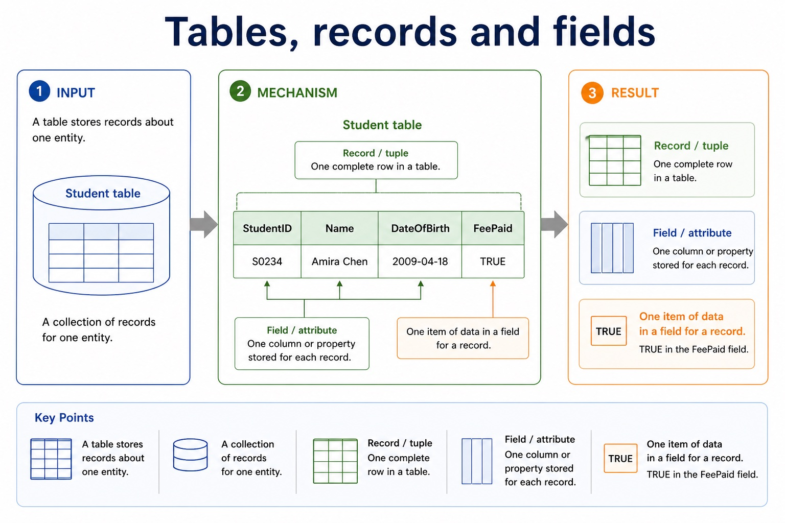

Text transcript

- A table stores records about one entity. A record is one complete row. A field is one column or attribute.
- A collection of records for one entity
- Student table
- Record / tuple
- One complete row in a table
- S0234, Amira Chen, 2009-04-18, TRUE
- Field / attribute
- One column or property stored for each record

#### Choose the best data type

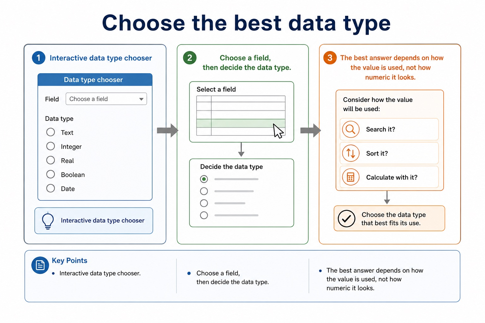

Text transcript

- Interactive data type chooser
- Choose a field, then decide the data type.
- The best answer depends on how the value is used, not how numeric it looks.

#### Common database data types

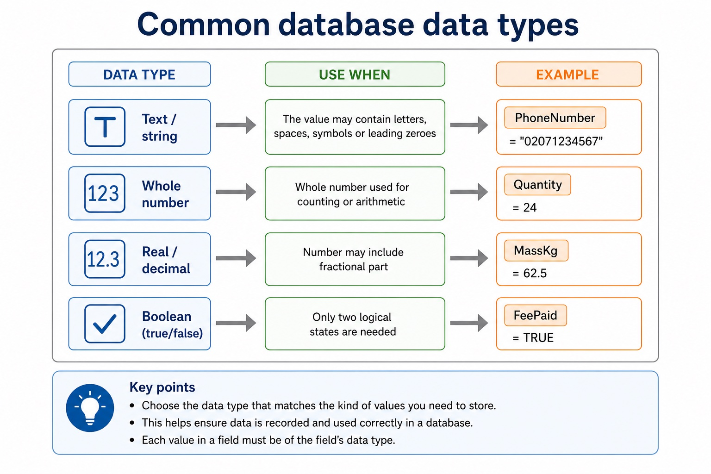

Text transcript

- Data type
- Use when
- Text / string
- The value may contain letters, spaces, symbols or leading zeroes
- PhoneNumber = "02071234567"
- Whole number used for counting or arithmetic
- Quantity = 24
- Real / decimal

#### Attributes describe an entity

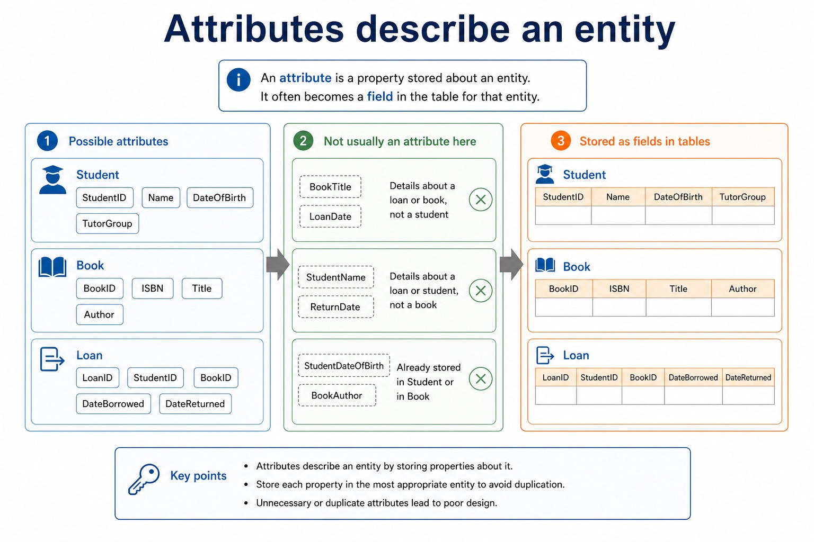

Text transcript

- An attribute is a property stored about an entity. It often becomes a field in the table for that entity.
- Possible attributes
- Not usually an attribute here
- StudentID, Name, DateOfBirth, TutorGroup
- BookTitle, LoanDate
- BookID, ISBN, Title, Author
- StudentName, ReturnDate
- LoanID, StudentID, BookID, DateBorrowed, DateReturned

#### Cardinality describes how many records may be linked

Text transcript

- Cardinality states how many records in one entity can be associated with records in another entity.
- One-to-one One record in A links to one record in B. Example: one person has one passport in a simplified model.
- One-to-many One record in A links to many records in B. Example: one customer can place many orders.
- Many-to-many Many records in A link to many records in B. Usually resolved by a linking entity.
- 1 - many

#### Entities are things the database stores data about

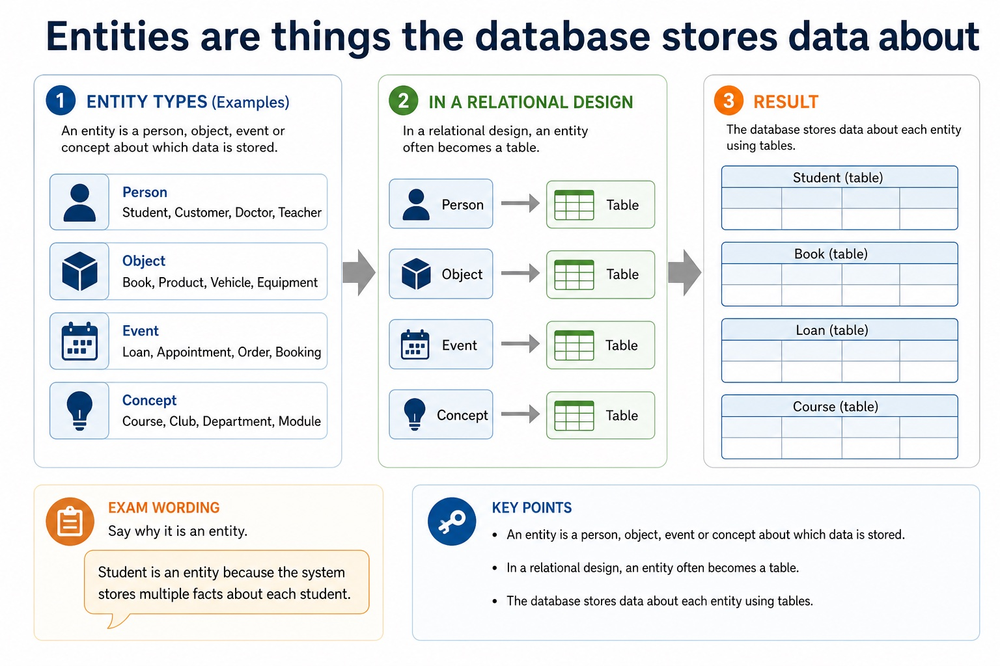

Text transcript

- An entity is a person, object, event or concept about which data is stored. In a relational design, an entity often becomes a table.
- Person Student, Customer, Doctor, Teacher.
- Object Book, Product, Vehicle, Equipment.
- Event Loan, Appointment, Order, Booking.
- Concept Course, Club, Department, Module.
- Exam wording: say why it is an entity. "Student is an entity because the system stores multiple facts about each student."

#### Identify entities and attributes

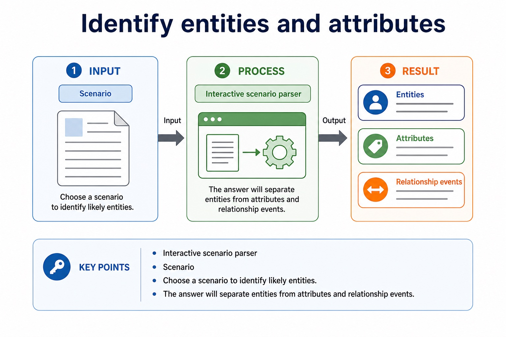

Text transcript

- Interactive scenario parser
- Scenario
- Choose a scenario to identify likely entities.
- The answer will separate entities from attributes and relationship events.

#### Optional and mandatory participation

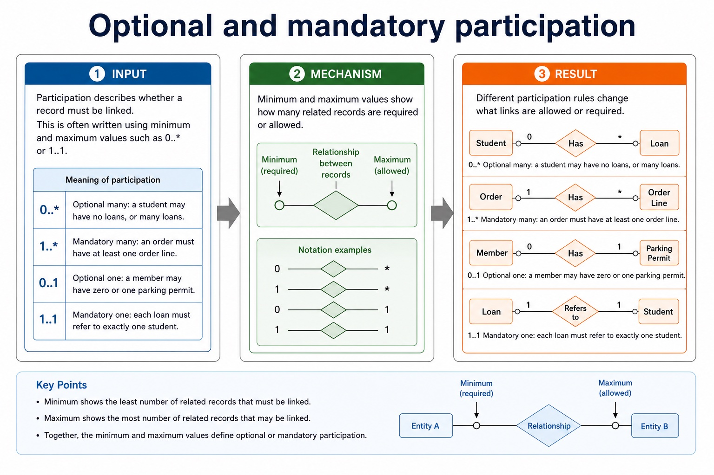

Text transcript

- Participation describes whether a record must be linked. This is often written using minimum and maximum values such as 0.. or 1..1.
- 0.. Optional many: a student may have no loans, or many loans.
- 1.. Mandatory many: an order must have at least one order line.
- 0..1 Optional one: a member may have zero or one parking permit.
- 1..1 Mandatory one: each loan must refer to exactly one student.

#### Do not swap the security vocabulary

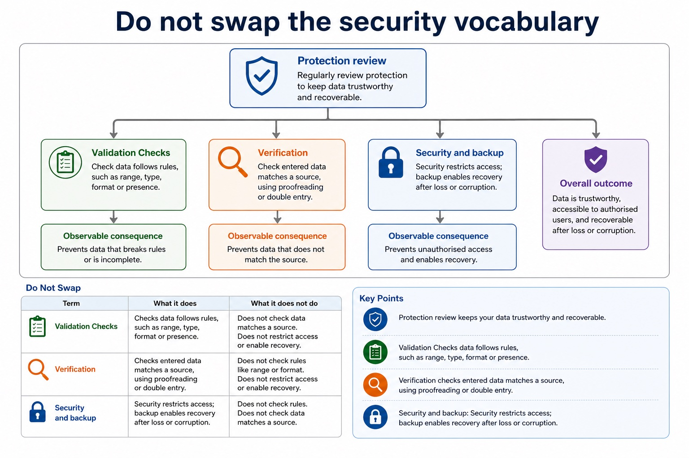

Text transcript

- Protection review
- Validation Checks data follows rules, such as range, type, format or presence.
- Verification Checks entered data matches a source, using proofreading or double entry.
- Security and backup Security restricts access; backup enables recovery after loss or corruption.

#### SQL clauses: choose the clause that matches the request

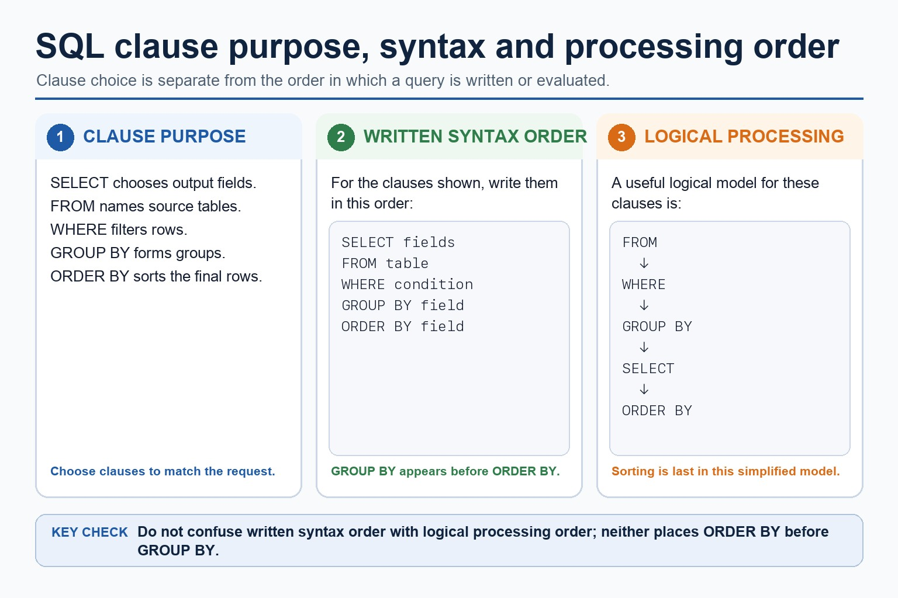

Text transcript

- For the clauses shown, written syntax order is SELECT, FROM, WHERE, GROUP BY, ORDER BY.
- A simplified logical processing order is FROM, WHERE, GROUP BY, SELECT, ORDER BY.
- GROUP BY forms groups and ORDER BY sorts the final rows.
- Written syntax order and logical processing order are different.

#### Trace one mixed SQL result

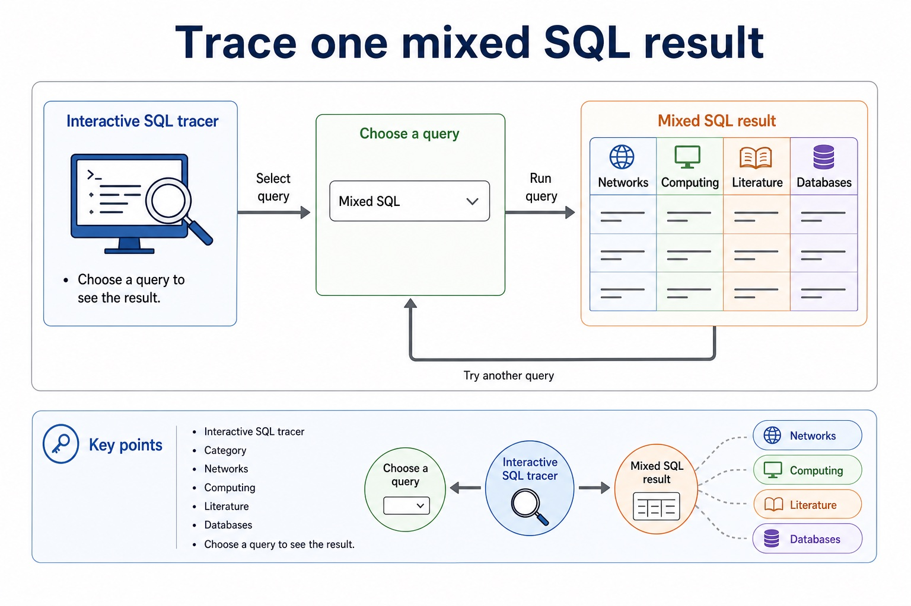

Text transcript

- Interactive SQL tracer
- Category
- Networks
- Computing
- Literature
- Databases
- Choose a query to see the result.

Open precise terminology and exam facts

- Version 2 requires candidates to use an entity-relationship diagram to document a database design. Evidence must include entities, relationships and cardinality, not merely define entity and attribute.
- Version 2 names First, Second and Third Normal Form and separately requires candidates to explain whether given tables are in 3NF and to produce a normalised design from a description, data or tables.
- An entity-relationship (E-R) diagram documents a database design by showing the entities, their relevant attributes or keys, the relationships between entities and the relationship cardinality. Entity names should describe things about which the system stores multiple facts; attributes belong to the entity they describe.
- To produce an E-R diagram, extract entity candidates from the scenario, assign identifiers, connect only supported relationships and label cardinality as one-to-one, one-to-many or many-to-many. Resolve a many-to-many relationship with a linking entity when converting the design to relational tables. A diagram must preserve the stated business rules rather than inventing links from similar field names.
- 1NF requires atomic values and no repeating groups. 2NF is 1NF with every non-key attribute dependent on the whole primary key, removing partial dependencies. 3NF is 2NF with no non-key attribute dependent on another non-key attribute, removing transitive dependencies.
- Normalisation decomposes tables while preserving keys and relationships. A normalised 3NF design stores each fact once in the table identified by its determinant, reducing insertion, update and deletion anomalies.
- A file-based approach can repeat facts in separate files, create inconsistent copies and isolate related data. A Database Management System (DBMS) addresses these file-based limitations by providing data management, including a data dictionary of metadata; data modelling; a logical schema; data integrity; and data security. Security includes backup procedures and access rights assigned to individual users or groups.
- A developer interface provides tools used to define structures and build database applications, forms or reports. A query processor interprets and checks a query, chooses how to carry it out, accesses the stored data and returns or modifies the specified records while the DBMS applies access and integrity rules.
- Relational databases address file-based duplication, inconsistency, isolation and access problems through related tables, keys, constraints and managed queries.
- Database design review: connect each file-based limitation to a relational or DBMS mechanism; use entity/table, record/tuple and field/attribute precisely; distinguish candidate, primary, secondary and foreign keys; classify one-to-one, one-to-many and many-to-many relationships; apply referential integrity and indexing; document the design with an E-R diagram; and explain or produce 1NF, 2NF and 3NF designs.
- DBMS and SQL review: identify data management/data dictionary, data modelling, logical schema, integrity, security/backup/access rights, developer interface and query processor. Distinguish DDL structure commands from DML query/maintenance commands, use every required data type and key clause, and keep SELECT queries to at most two tables with explicit INNER JOIN ... ON when two tables are needed.
- A complete answer follows the scenario through design, statement and result. It does not claim that a primary key prevents every duplicate fact, that a secondary key must be unique, that normalisation guarantees correctness, or that a three-table/comma-style query is within the AS core boundary.

### Worked example

1. Design and query a library database
2. Separate Student and Loan tables, identify StudentID as primary key in Student and foreign key in Loan, state the one-to-many relationship and referential-integrity rule, then write SELECT Student.StudentName, Loan.DueDate FROM Student INNER…

Beyond syllabus / 延伸知识（不要求背诵）: production databases also manage transactions and concurrent users; these ideas extend the syllabus model of integrity and access control.
## 3. Practice by question type

### Question 1 - foundation - write - 8 marks

A clinic stores Patients, Doctors and Appointments. Write an E-R design in words or a labelled diagram and state the two relationship cardinalities. Explain why CUSTOMER(CustomerID, Postcode, Town) may not be in 3NF when each postcode determines one town, and give a 3NF design. A school is introducing a relational DBMS. Explain four DBMS features and the distinct purposes of the developer interface and query processor.

**Answer:** identifies Patient, Doctor and Appointment as entities; gives a suitable identifier/key for each entity; Patient has a one-to-many relationship with Appointment; Doctor has a one-to-many relationship with Appointment; Appointment carries the linking foreign keys / resolves the patient-doctor many-to-many history; attributes and relationship directions are consistent with the scenario; CustomerID determines Postcode and Postcode determines Town; Town is transitively dependent on CustomerID / depends on non-key Postcode; CUSTOMER(CustomerID, Postcode); POSTCODE(Postcode, Town), with Postcode linked as foreign key; data management/data dictionary stores metadata about structure; data modelling or logical schema represents the database design; integrity rules maintain valid and consistent data; security uses access rights and backup procedures; developer interface supports defining structures or building database applications/forms/reports; query processor interprets/checks and carries out queries or maintenance statements

**Marking guidance:** Do not award a collection of unconnected entity boxes as a complete E-R design. Do not award decomposition marks unless primary/foreign-key linkage can reconstruct the relationship. Do not treat the database, data dictionary, developer interface and query processor as interchangeable names.

**Common error:** For the command word write, perform that exact action; do not replace it with an unrelated fact.

### Question 2 - application - explain - 2 marks

Why add Membership between Student and Club?

**Answer:** It resolves the many-to-many relationship into two one-to-many relationships.

**Marking guidance:** Award one mark for each distinct, technically accurate point or method step.

**Common error:** Do not repeat the same point in different words; each mark needs a separate idea or method step.

### Question 3 - transfer - draw - 2 marks

Why is matching field spelling not enough to draw a relationship?

**Answer:** The scenario/business rule must state or imply that the records are associated.

**Marking guidance:** Award one mark for each distinct, technically accurate point or method step.

**Common error:** Do not copy the worked example unchanged; transfer the method and check it against the new context.

### Related past-paper indexes

| Reference | Marks | Command word | Question type |
|---|---:|---|---|
| 9618/11/W/25 Q2(ii) | 4 | complete | recall |
| 9618/13/W/25 Q5(a) | 3 | complete | recall |
| 9618/11/W/25 Q2(a) | 2 | complete | recall |
| 9618/11/W/25 Q2(b) | 2 | complete | recall |

These are indexes only. Cambridge question and mark-scheme wording is not reproduced.

## 4. Summary and exam reminders

### Summary

- Define entity-relationship design and normalisation with the exact technical vocabulary expected by the syllabus.
- Use the lesson method on a fresh context and show the intermediate decision, representation or calculation.
- Match the shape of the answer to the command word and the available marks.
- Check the final answer against the scenario instead of repeating a memorised sentence.

### Common error to correct

Students often choose names as primary keys. Correction: a primary key must uniquely and reliably identify a record.

### Exam technique

- Follow the command word: state gives a fact; explain links a cause to a consequence; compare covers both sides.
- Match the number of independent points or method steps to the available marks.
- For entity-relationship design and normalisation, use the exact technical term before applying it to the scenario.
