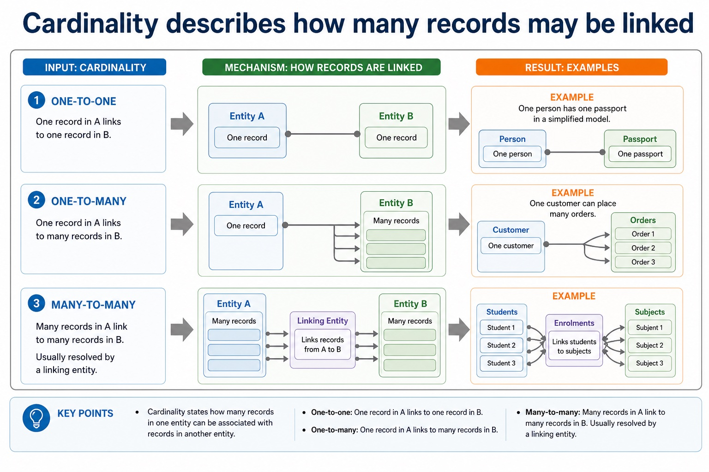
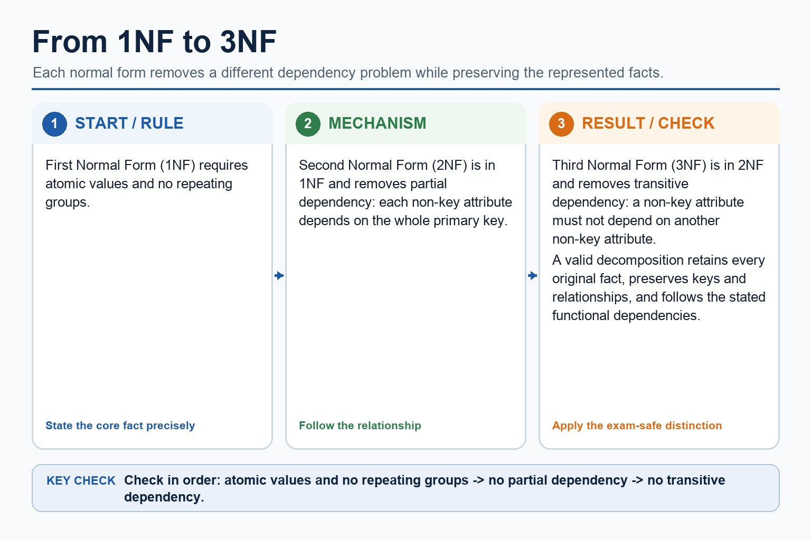

# Lesson 040: Entity-relationship design and normalisation

**Course:** Cambridge International AS Level Computer Science 9618, syllabus for examination in 2027-2029 
**Paper:** Paper 1 
**Syllabus:** Section 8: Databases 
**Syllabus requirements:** S8.03, S8.04 
**Pacing:** Flexible. Select a quick, full or deep route for the learners in front of you.

## Teaching-depth menu

- **Quick route:** Use the diagnostic, learning objectives, first worked example and foundation question. Stop once the learner can explain the central distinction accurately.
- **Full route:** Teach every knowledge-point material set, the worked method and all lesson questions.
- **Deep route:** Add the prerequisite refresher, ask learners to connect the concept checklist, discuss the labelled extension and complete a transfer question without a model answer.

## 1. Prerequisite knowledge and quick diagnostic

Recall S8.02 before starting this lesson.

Ask the learner to give one accurate definition or method step before continuing. If they cannot, briefly revisit the named prerequisite rather than repeating the whole previous lesson.

### Optional prerequisite refresher

- the syllabus explicitly names entity, table, record, field, tuple, attribute, primary key, candidate key, secondary key, foreign key, one-to-one, one-to-many, many-to-many, referential integrity and indexing. Secondary key is retained as a distinct retrieval term, not an alias for an alternate candidate key.
- Understand entity/table, record/tuple, field/attribute, primary/candidate/secondary/foreign key, relationships, referential integrity and indexing.

## 2. Knowledge explanation

### 1. Entity-relationship diagrams (S8.03)

**Atomic learning targets**

- **S8.03.A01:** entity-relationship
- **S8.03.A02:** diagram

**Core explanation**

- An entity-relationship (E-R) diagram documents a database design by showing the entities, their relevant attributes or keys, the relationships between entities and the relationship cardinality. Entity names should describe things about which the system stores multiple facts; attributes belong to the entity they describe.
- Database design review: connect each file-based limitation to a relational or DBMS mechanism; use entity/table, record/tuple and field/attribute precisely; distinguish candidate, primary, secondary and foreign keys; classify one-to-one, one-to-many and many-to-many relationships; apply referential integrity and indexing; document the design with an E-R diagram; and explain or produce 1NF, 2NF and 3NF designs.
- To produce an E-R diagram, extract entity candidates from the scenario, assign identifiers, connect only supported relationships and label cardinality as one-to-one, one-to-many or many-to-many. Resolve a many-to-many relationship with a linking entity when converting the design to relational tables. A diagram must preserve the stated business rules rather than inventing links from similar field names.

**Mechanism or method**

1. **Set up the required data and conditions** — An entity-relationship (E-R) diagram documents a database design by showing the entities, their relevant attributes or keys, the relationships between entities and the relationship cardinality.
2. **Carry out the complete method** — Entity names should describe things about which the system stores multiple facts;
3. **Trace or test the result** — attributes belong to the entity they describe.

#### Worked example: Entity-relationship diagrams: complete worked route

1. **Set up the required data and conditions**

An entity-relationship (E-R) diagram documents a database design by showing the entities, their relevant attributes or keys, the relationships between entities and the relationship cardinality.

2. **Carry out the complete method**

Entity names should describe things about which the system stores multiple facts;

3. **Trace or test the result**

attributes belong to the entity they describe.

4. **Complete example**

Design and query a library database: Separate Student and Loan tables, identify StudentID as primary key in Student and foreign key in Loan, state the one-to-many relationship and referential-integrity rule, then write SELECT Student.StudentName, Loan.DueDate FROM Student INNER JOIN Loan ON Student.StudentID = Loan.StudentID WHERE Loan.Returned = FALSE; using exactly two tables.

**Misconceptions to correct**

- Students often choose names as primary keys. Correction: a primary key must uniquely and reliably identify a record.

#### Mastery check (MC-L040-S8.03)

Complete a fresh example that demonstrates every target: entity-relationship; diagram. Show all intermediate steps and check the result.

Answer criteria

- An entity-relationship (E-R) diagram documents a database design by showing the entities, their relevant attributes or keys, the relationships between entities and the relationship cardinality. Entity names should describe things about which the system stores multiple facts; attributes belong to the entity they describe.
- Database design review: connect each file-based limitation to a relational or DBMS mechanism; use entity/table, record/tuple and field/attribute precisely; distinguish candidate, primary, secondary and foreign keys; classify one-to-one, one-to-many and many-to-many relationships; apply referential integrity and indexing; document the design with an E-R diagram; and explain or produce 1NF, 2NF and 3NF designs.
- To produce an E-R diagram, extract entity candidates from the scenario, assign identifiers, connect only supported relationships and label cardinality as one-to-one, one-to-many or many-to-many. Resolve a many-to-many relationship with a linking entity when converting the design to relational tables. A diagram must preserve the stated business rules rather than inventing links from similar field names.

**Supplementary concept map**

- **Entity:** Thing stored in the design
- **Relationship:** Association between entities
- **Cardinality:** How many instances connect
- **Diagram:** Documents the database design
- **entity-relationship:** Use an entity-relationship diagram to document a database…

**Supplementary three-step recap**

1. **Identify structure and target data** — To produce an E-R diagram, extract entity candidates from the scenario, assign identifiers, connect only supported relationships and…
2. **Apply the database rule** — Candidates to use an entity-relationship diagram to document a database design.
3. **Check keys rows and conditions** — An entity-relationship (E-R) diagram documents a database design by showing the entities, their relevant attributes or keys, the…

**Cardinality describes how many records may be linked:** Cardinality states how many records in one entity can be associated with records in another entity. One-to-one One record in A links to one record in B. Example: one person has one passport in…

#### Cardinality describes how many records may be linked

Text transcript

- Cardinality states how many records in one entity can be associated with records in another entity.
- One-to-one One record in A links to one record in B. Example: one person has one passport in a simplified model.
- One-to-many One record in A links to many records in B. Example: one customer can place many orders.
- Many-to-many Many records in A link to many records in B. Usually resolved by a linking entity.
- 1 - many

Precise syllabus wording

Produce and interpret entity-relationship diagrams.

The syllabus requires candidates to use an entity-relationship diagram to document a database design. Evidence must include entities, relationships and cardinality, not merely define entity and attribute.

### 2. 1NF, 2NF and 3NF; explain 3NF and produce a normalised design (S8.04)

**Atomic learning targets**

- **S8.04.A01:** 1NF
- **S8.04.A02:** 2NF
- **S8.04.A03:** 3NF
- **S8.04.A04:** normalised / normalized
- **S8.04.A05:** design

**Core explanation**

- Database design review: connect each file-based limitation to a relational or DBMS mechanism; use entity/table, record/tuple and field/attribute precisely; distinguish candidate, primary, secondary and foreign keys; classify one-to-one, one-to-many and many-to-many relationships; apply referential integrity and indexing; document the design with an E-R diagram; and explain or produce 1NF, 2NF and 3NF designs.
- Normalisation decomposes tables while preserving keys and relationships. A normalised 3NF design stores each fact once in the table identified by its determinant, reducing insertion, update and deletion anomalies.
- To produce an E-R diagram, extract entity candidates from the scenario, assign identifiers, connect only supported relationships and label cardinality as one-to-one, one-to-many or many-to-many. Resolve a many-to-many relationship with a linking entity when converting the design to relational tables. A diagram must preserve the stated business rules rather than inventing links from similar field names.
- An entity-relationship (E-R) diagram documents a database design by showing the entities, their relevant attributes or keys, the relationships between entities and the relationship cardinality. Entity names should describe things about which the system stores multiple facts; attributes belong to the entity they describe.
- A complete answer follows the scenario through design, statement and result. It does not claim that a primary key prevents every duplicate fact, that a secondary key must be unique, that normalisation guarantees correctness, or that a three-table/comma-style query is within the AS core boundary.

**Mechanism or method**

1. **Identify the relevant condition or input** — Database design review: connect each file-based limitation to a relational or DBMS mechanism;
2. **Trace how the process works** — distinguish candidate, primary, secondary and foreign keys;
3. **Connect the mechanism to its result** — document the design with an E-R diagram;

#### Worked example: 1NF, 2NF and 3NF; explain 3NF and produce a normalised design: complete worked route

1. **Identify the relevant condition or input**

Database design review: connect each file-based limitation to a relational or DBMS mechanism;

2. **Trace how the process works**

distinguish candidate, primary, secondary and foreign keys;

3. **Connect the mechanism to its result**

document the design with an E-R diagram;

4. **Complete example**

Design and query a library database: Separate Student and Loan tables, identify StudentID as primary key in Student and foreign key in Loan, state the one-to-many relationship and referential-integrity rule, then write SELECT Student.StudentName, Loan.DueDate FROM Student INNER JOIN Loan ON Student.StudentID = Loan.StudentID WHERE Loan.Returned = FALSE;

**Misconceptions to correct**

- Students often choose names as primary keys. Correction: a primary key must uniquely and reliably identify a record.

#### Mastery check (MC-L040-S8.04)

Explain the following targets in one connected answer, using a concrete example for each: 1NF; 2NF; 3NF; normalised / normalized; design.

Answer criteria

- Database design review: connect each file-based limitation to a relational or DBMS mechanism; use entity/table, record/tuple and field/attribute precisely; distinguish candidate, primary, secondary and foreign keys; classify one-to-one, one-to-many and many-to-many relationships; apply referential integrity and indexing; document the design with an E-R diagram; and explain or produce 1NF, 2NF and 3NF designs.
- Normalisation decomposes tables while preserving keys and relationships. A normalised 3NF design stores each fact once in the table identified by its determinant, reducing insertion, update and deletion anomalies.
- To produce an E-R diagram, extract entity candidates from the scenario, assign identifiers, connect only supported relationships and label cardinality as one-to-one, one-to-many or many-to-many. Resolve a many-to-many relationship with a linking entity when converting the design to relational tables. A diagram must preserve the stated business rules rather than inventing links from similar field names.
- An entity-relationship (E-R) diagram documents a database design by showing the entities, their relevant attributes or keys, the relationships between entities and the relationship cardinality. Entity names should describe things about which the system stores multiple facts; attributes belong to the entity they describe.
- A complete answer follows the scenario through design, statement and result. It does not claim that a primary key prevents every duplicate fact, that a secondary key must be unique, that normalisation guarantees correctness, or that a three-table/comma-style query is within the AS core boundary.

**Supplementary concept map**

- **1NF:** And explain or produce 1NF, 2NF and 3NF…
- **2NF:** 1NF, 2NF and 3NF
- **3NF:** First, Second and Third Normal Form and separately…
- **normalised:** 3NF and produce a normalised design.
- **design:** A normalised 3NF design stores each fact once…

**Supplementary three-step recap**

1. **Identify structure and target data** — First, Second and Third Normal Form and separately requires candidates to explain whether given tables are in 3NF…
2. **Apply the database rule** — And explain or produce 1NF, 2NF and 3NF designs.
3. **Check keys rows and conditions** — 3NF and produce a normalised design.

**How normal forms remove dependency problems:** First Normal Form (1NF) requires atomic values and no repeating groups. Second Normal Form (2NF) is in 1NF and removes partial dependency: each non-key attribute depends on the whole primary key.

#### How normal forms remove dependency problems

Text transcript

- First Normal Form (1NF) requires atomic values and no repeating groups.
- Second Normal Form (2NF) is in 1NF and removes partial dependency: each non-key attribute depends on the whole primary key.
- Third Normal Form (3NF) is in 2NF and removes transitive dependency: a non-key attribute must not depend on another non-key attribute.
- A valid decomposition retains every original fact, preserves keys and relationships, and follows the stated functional dependencies.

Precise syllabus wording

Understand 1NF, 2NF and 3NF; explain 3NF and produce a normalised design.

the syllabus names First, Second and Third Normal Form and separately requires candidates to explain whether given tables are in 3NF and to produce a normalised design from a description, data or tables.

### Lesson technical reference

- The syllabus requires candidates to use an entity-relationship diagram to document a database design. Evidence must include entities, relationships and cardinality, not merely define entity and attribute.
- the syllabus names First, Second and Third Normal Form and separately requires candidates to explain whether given tables are in 3NF and to produce a normalised design from a description, data or tables.
- An entity-relationship (E-R) diagram documents a database design by showing the entities, their relevant attributes or keys, the relationships between entities and the relationship cardinality. Entity names should describe things about which the system stores multiple facts; attributes belong to the entity they describe.
- To produce an E-R diagram, extract entity candidates from the scenario, assign identifiers, connect only supported relationships and label cardinality as one-to-one, one-to-many or many-to-many. Resolve a many-to-many relationship with a linking entity when converting the design to relational tables. A diagram must preserve the stated business rules rather than inventing links from similar field names.
- 1NF requires atomic values and no repeating groups. 2NF is 1NF with every non-key attribute dependent on the whole primary key, removing partial dependencies. 3NF is 2NF with no non-key attribute dependent on another non-key attribute, removing transitive dependencies.
- Normalisation decomposes tables while preserving keys and relationships. A normalised 3NF design stores each fact once in the table identified by its determinant, reducing insertion, update and deletion anomalies.
- A file-based approach can repeat facts in separate files, create inconsistent copies and isolate related data. A Database Management System (DBMS) addresses these file-based limitations by providing data management, including a data dictionary of metadata; data modelling; a logical schema; data integrity; and data security. Security includes backup procedures and access rights assigned to individual users or groups.
- A developer interface provides tools used to define structures and build database applications, forms or reports. A query processor interprets and checks a query, chooses how to carry it out, accesses the stored data and returns or modifies the specified records while the DBMS applies access and integrity rules.
- Relational databases address file-based duplication, inconsistency, isolation and access problems through related tables, keys, constraints and managed queries.
- Database design review: connect each file-based limitation to a relational or DBMS mechanism; use entity/table, record/tuple and field/attribute precisely; distinguish candidate, primary, secondary and foreign keys; classify one-to-one, one-to-many and many-to-many relationships; apply referential integrity and indexing; document the design with an E-R diagram; and explain or produce 1NF, 2NF and 3NF designs.
- DBMS and SQL review: identify data management/data dictionary, data modelling, logical schema, integrity, security/backup/access rights, developer interface and query processor. Distinguish DDL structure commands from DML query/maintenance commands, use every required data type and key clause, and keep SELECT queries to at most two tables with explicit INNER JOIN ... ON when two tables are needed.
- A complete answer follows the scenario through design, statement and result. It does not claim that a primary key prevents every duplicate fact, that a secondary key must be unique, that normalisation guarantees correctness, or that a three-table/comma-style query is within the AS core boundary.

Beyond syllabus / 延伸知识（不要求背诵）: production databases also manage transactions and concurrent users; these ideas extend the syllabus model of integrity and access control.
## 3. Practice by question type

### Question 1 - foundation - write - 8 marks

A clinic stores Patients, Doctors and Appointments. Write an E-R design in words or a labelled diagram and state the two relationship cardinalities. Explain why CUSTOMER(CustomerID, Postcode, Town) may not be in 3NF when each postcode determines one town, and give a 3NF design. A school is introducing a relational DBMS. Explain four DBMS features and the distinct purposes of the developer interface and query processor.

**Answer:** identifies Patient, Doctor and Appointment as entities; gives a suitable identifier/key for each entity; Patient has a one-to-many relationship with Appointment; Doctor has a one-to-many relationship with Appointment; Appointment carries the linking foreign keys / resolves the patient-doctor many-to-many history; attributes and relationship directions are consistent with the scenario; CustomerID determines Postcode and Postcode determines Town; Town is transitively dependent on CustomerID / depends on non-key Postcode; CUSTOMER(CustomerID, Postcode); POSTCODE(Postcode, Town), with Postcode linked as foreign key; data management/data dictionary stores metadata about structure; data modelling or logical schema represents the database design; integrity rules maintain valid and consistent data; security uses access rights and backup procedures; developer interface supports defining structures or building database applications/forms/reports; query processor interprets/checks and carries out queries or maintenance statements

**Marking guidance:** Do not award a collection of unconnected entity boxes as a complete E-R design. Do not award decomposition marks unless primary/foreign-key linkage can reconstruct the relationship. Do not treat the database, data dictionary, developer interface and query processor as interchangeable names.

**Common error:** For the command word write, perform that exact action; do not replace it with an unrelated fact.

### Question 2 - application - explain - 2 marks

Why add Membership between Student and Club?

**Answer:** It resolves the many-to-many relationship into two one-to-many relationships.

**Marking guidance:** Award one mark for each distinct, technically accurate point or method step.

**Common error:** Do not repeat the same point in different words; each mark needs a separate idea or method step.

### Question 3 - transfer - draw - 2 marks

Why is matching field spelling not enough to draw a relationship?

**Answer:** The scenario/business rule must state or imply that the records are associated.

**Marking guidance:** Award one mark for each distinct, technically accurate point or method step.

**Common error:** Do not copy the worked example unchanged; transfer the method and check it against the new context.

### Related past-paper indexes

| Reference | Marks | Command word | Question type |
|---|---:|---|---|
| 9618/11/W/25 Q2(ii) | 4 | complete | recall |
| 9618/13/W/25 Q5(a) | 3 | complete | recall |
| 9618/11/W/25 Q2(a) | 2 | complete | recall |
| 9618/11/W/25 Q2(b) | 2 | complete | recall |

These are indexes only. Cambridge question and mark-scheme wording is not reproduced.

## 4. Summary and exam reminders

### Summary

- S8.03: explain entity-relationship, diagram.
- S8.03 method: Set up the required data and conditions → Carry out the complete method → Trace or test the result.
- S8.04: explain 1NF, 2NF, 3NF, normalised / normalized, design.
- S8.04 method: Identify the relevant condition or input → Trace how the process works → Connect the mechanism to its result.
- Correction to remember: Students often choose names as primary keys. Correction: a primary key must uniquely and reliably identify a record.

### Common error to correct

Students often choose names as primary keys. Correction: a primary key must uniquely and reliably identify a record.

### Exam technique

- Follow the command word: state gives a fact; explain links a cause to a consequence; compare covers both sides.
- Match the number of independent points or method steps to the available marks.
- For entity-relationship design and normalisation, use the exact technical term before applying it to the scenario.
