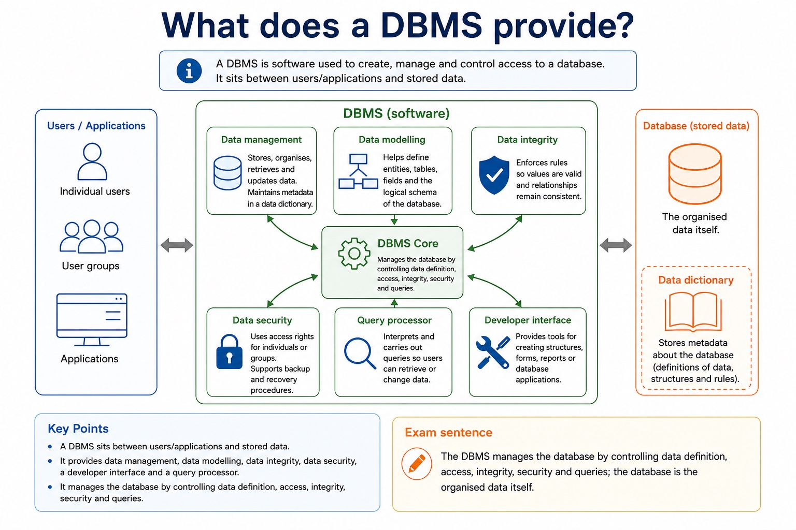

# Lesson 041: DBMS architecture, integrity, security and backup

**Course:** Cambridge International AS Level Computer Science 9618, syllabus for examination in 2027-2029 
**Paper:** Paper 1 
**Syllabus:** Section 8: Databases 
**Syllabus requirements:** S8.05, S8.06 
**Pacing:** Flexible. Select a quick, full or deep route for the learners in front of you.

## Teaching-depth menu

- **Quick route:** Use the diagnostic, learning objectives, first worked example and foundation question. Stop once the learner can explain the central distinction accurately.
- **Full route:** Teach every knowledge-point material set, the worked method and all lesson questions.
- **Deep route:** Add the prerequisite refresher, ask learners to connect the concept checklist, discuss the labelled extension and complete a transfer question without a model answer.

## 1. Prerequisite knowledge and quick diagnostic

Recall S8.01, S8.05 before starting this lesson.

Ask the learner to give one accurate definition or method step before continuing. If they cannot, briefly revisit the named prerequisite rather than repeating the whole previous lesson.

### Optional prerequisite refresher

- The syllabus requires both sides of the comparison: limitations of file-based storage/retrieval and relational-database features that address those limitations. Benefits must be linked to a mechanism rather than asserted generically.
- Explain limitations of file-based systems and how relational databases address them.
- The syllabus explicitly requires data management including a data dictionary, data modelling, logical schema, data integrity and data security including backup procedures and access rights for individuals or groups.
- Understand DBMS features: data dictionary, data modelling, logical schema, integrity, security, backup and access rights.

## 2. Knowledge explanation

### 1. DBMS features: data dictionary, data modelling, logical schema, integrity, security, backup and access rights (S8.05)

**Atomic learning targets**

- **S8.05.A01:** DBMS
- **S8.05.A02:** features
- **S8.05.A03:** dictionary
- **S8.05.A04:** modelling / modeling
- **S8.05.A05:** logical
- **S8.05.A06:** schema
- **S8.05.A07:** integrity
- **S8.05.A08:** security
- **S8.05.A09:** backup
- **S8.05.A10:** access
- **S8.05.A11:** rights

**Core explanation**

- A Database Management System (DBMS) provides managed features that address file-based duplication, inconsistency, isolation and uncontrolled access. The features work together rather than acting as unrelated utilities.
- A data dictionary stores metadata about tables, fields, data types, keys, constraints and relationships. DBMS tools consult this dictionary when checking definitions, queries and data values.
- Data modelling represents the entities, attributes and relationships needed by the organisation. The logical schema turns that model into the table structures, keys, constraints and relationships visible to programs without depending on physical disk layout.
- Data integrity rules reject invalid or inconsistent changes, for example an unmatched foreign key. Data security limits who can read or change data; access rights can be assigned to individual users or groups according to their roles.
- Backup procedures copy recoverable database state, while recovery restores a consistent state after loss or failure. A backup is not an access-control substitute, and access rights do not replace recovery planning.

**Mechanism or method**

1. **Identify the relevant condition or input** — A Database Management System (DBMS) provides managed features that address file-based duplication, inconsistency, isolation and uncontrolled access.
2. **Trace how the process works** — The features work together rather than acting as unrelated utilities.
3. **Connect the mechanism to its result** — A data dictionary stores metadata about tables, fields, data types, keys, constraints and relationships.

#### Worked example: DBMS features: data dictionary, data modelling, logical schema, integrity, security, backup and access rights: complete worked route

1. **Identify the relevant condition or input**

A Database Management System (DBMS) provides managed features that address file-based duplication, inconsistency, isolation and uncontrolled access.

2. **Trace how the process works**

The features work together rather than acting as unrelated utilities.

3. **Connect the mechanism to its result**

A data dictionary stores metadata about tables, fields, data types, keys, constraints and relationships.

4. **Complete example**

The syllabus explicitly requires data management including a data dictionary, data modelling, logical schema, data integrity and data security including backup procedures and access rights for individuals or groups.

**Misconceptions to correct**

- Students often choose names as primary keys. Correction: a primary key must uniquely and reliably identify a record.

#### Mastery check (MC-L041-S8.05)

Explain the following targets in one connected answer, using a concrete example for each: DBMS; features; dictionary; modelling / modeling; logical; schema; integrity; security; backup; access; rights.

Answer criteria

- A Database Management System (DBMS) provides managed features that address file-based duplication, inconsistency, isolation and uncontrolled access. The features work together rather than acting as unrelated utilities.
- A data dictionary stores metadata about tables, fields, data types, keys, constraints and relationships. DBMS tools consult this dictionary when checking definitions, queries and data values.
- Data modelling represents the entities, attributes and relationships needed by the organisation. The logical schema turns that model into the table structures, keys, constraints and relationships visible to programs without depending on physical disk layout.
- Data integrity rules reject invalid or inconsistent changes, for example an unmatched foreign key. Data security limits who can read or change data; access rights can be assigned to individual users or groups according to their roles.
- Backup procedures copy recoverable database state, while recovery restores a consistent state after loss or failure. A backup is not an access-control substitute, and access rights do not replace recovery planning.

**Supplementary concept map**

- **DBMS:** The DBMS manages the database by controlling data…
- **features:** DBMS features
- **dictionary:** Identify data management/data dictionary, data modelling, logical schema,…
- **modeling:** Data dictionary, data modelling, logical schema, integrity, security,…
- **logical:** Data management including a data dictionary, data modelling,…
- **schema:** Data modelling helps define entities, tables, fields and…

**Supplementary three-step recap**

1. **Identify what needs protection** — Data dictionary, data modelling, logical schema, integrity, security, backup and access rights.
2. **Trace the attack or error route** — Data management including a data dictionary, data modelling, logical schema, data integrity and data security including backup procedures…
3. **Match a safeguard and limitation** — Security includes backup procedures and access rights assigned to individual users or groups.

**What does a DBMS provide?:** A DBMS is software used to create, manage and control access to a database. It sits between users/applications and stored data. Data management stores, organises, retrieves and updates data; maintains metadata in a data…

#### What does a DBMS provide?

Text transcript

- A DBMS is software used to create, manage and control access to a database. It sits between users/applications and stored data.
- Data management stores, organises, retrieves and updates data; maintains metadata in a data dictionary.
- Data modelling helps define entities, tables, fields and the logical schema of the database.
- Data integrity enforces rules so values are valid and relationships remain consistent.
- Data security uses access rights for individuals or groups; supports backup and recovery procedures.
- Developer interface provides tools for creating structures, forms, reports or database applications.
- Query processor interprets and carries out queries so users can retrieve or change data.
- Exam sentence:
- The DBMS manages the database by controlling data definition, access, integrity, security and queries; the database is the organised data itself.

Precise syllabus wording

Understand DBMS features: data dictionary, data modelling, logical schema, integrity, security, backup and access rights.

The syllabus explicitly requires data management including a data dictionary, data modelling, logical schema, data integrity and data security including backup procedures and access rights for individuals or groups.

### 2. The developer interface and query processor (S8.06)

**Atomic learning targets**

- **S8.06.A01:** developer
- **S8.06.A02:** interface
- **S8.06.A03:** query
- **S8.06.A04:** processor

**Core explanation**

- A developer interface provides tools used to define structures and build database applications, forms or reports. A query processor interprets and checks a query, chooses how to carry it out, accesses the stored data and returns or modifies the specified records while the DBMS applies access and integrity rules.
- A complete answer follows the scenario through design, statement and result. It does not claim that a primary key prevents every duplicate fact, that a secondary key must be unique, that normalisation guarantees correctness, or that a three-table/comma-style query is within the AS core boundary.
- The developer interface and query processor as DBMS software tools whose use and purpose must be understood in practice.
- The developer interface and query processor.

**Mechanism or method**

1. **Identify the relevant condition or input** — A developer interface provides tools used to define structures and build database applications, forms or reports.
2. **Trace how the process works** — A query processor interprets and checks a query, chooses how to carry it out, accesses the stored data and returns or modifies the specified records while the DBMS applies access and integrity rules.
3. **Connect the mechanism to its result** — A complete answer follows the scenario through design, statement and result.

#### Worked example: The developer interface and query processor: complete worked route

1. **Identify the relevant condition or input**

A developer interface provides tools used to define structures and build database applications, forms or reports.

2. **Trace how the process works**

A query processor interprets and checks a query, chooses how to carry it out, accesses the stored data and returns or modifies the specified records while the DBMS applies access and integrity rules.

3. **Connect the mechanism to its result**

A complete answer follows the scenario through design, statement and result.

4. **Complete example**

Model students joining clubs / Order line data / Run a restricted query: Draw Student(StudentID, Name) and Club(ClubID, ClubName). A developer enters a SELECT statement through the developer interface.

**Misconceptions to correct**

- Students often choose names as primary keys. Correction: a primary key must uniquely and reliably identify a record.

#### Mastery check (MC-L041-S8.06)

Explain the following targets in one connected answer, using a concrete example for each: developer; interface; query; processor.

Answer criteria

- A developer interface provides tools used to define structures and build database applications, forms or reports. A query processor interprets and checks a query, chooses how to carry it out, accesses the stored data and returns or modifies the specified records while the DBMS applies access and integrity rules.
- A complete answer follows the scenario through design, statement and result. It does not claim that a primary key prevents every duplicate fact, that a secondary key must be unique, that normalisation guarantees correctness, or that a three-table/comma-style query is within the AS core boundary.
- The developer interface and query processor as DBMS software tools whose use and purpose must be understood in practice.
- The developer interface and query processor.

**Supplementary concept map**

- **developer:** Identify data management/data dictionary, data modelling, logical schema,…
- **interface:** The developer interface and query processor as DBMS…
- **query:** The developer interface and query processor.
- **processor:** A query processor interprets and checks a query,…
- **DBMS:** A Database Management System (DBMS) addresses these file-based…

**Supplementary three-step recap**

1. **Translate the stated design** — The developer interface and query processor as DBMS software tools whose use and purpose must be understood in…
2. **Apply one complete operation** — The developer interface and query processor.
3. **Trace state and boundaries** — A query processor interprets and checks a query, chooses how to carry it out, accesses the stored data…

**Concrete case: developer:** The developer interface and query processor as DBMS software tools whose use and purpose must be understood in practice.

Precise syllabus wording

Understand the developer interface and query processor.

the syllabus names the developer interface and query processor as DBMS software tools whose use and purpose must be understood in practice. They must be distinguished rather than listed without function.

### Lesson technical reference

- The syllabus explicitly requires data management including a data dictionary, data modelling, logical schema, data integrity and data security including backup procedures and access rights for individuals or groups.
- the syllabus names the developer interface and query processor as DBMS software tools whose use and purpose must be understood in practice. They must be distinguished rather than listed without function.
- An entity-relationship (E-R) diagram documents a database design by showing the entities, their relevant attributes or keys, the relationships between entities and the relationship cardinality. Entity names should describe things about which the system stores multiple facts; attributes belong to the entity they describe.
- To produce an E-R diagram, extract entity candidates from the scenario, assign identifiers, connect only supported relationships and label cardinality as one-to-one, one-to-many or many-to-many. Resolve a many-to-many relationship with a linking entity when converting the design to relational tables. A diagram must preserve the stated business rules rather than inventing links from similar field names.
- 1NF requires atomic values and no repeating groups. 2NF is 1NF with every non-key attribute dependent on the whole primary key, removing partial dependencies. 3NF is 2NF with no non-key attribute dependent on another non-key attribute, removing transitive dependencies.
- Normalisation decomposes tables while preserving keys and relationships. A normalised 3NF design stores each fact once in the table identified by its determinant, reducing insertion, update and deletion anomalies.
- A file-based approach can repeat facts in separate files, create inconsistent copies and isolate related data. A Database Management System (DBMS) addresses these file-based limitations by providing data management, including a data dictionary of metadata; data modelling; a logical schema; data integrity; and data security. Security includes backup procedures and access rights assigned to individual users or groups.
- A developer interface provides tools used to define structures and build database applications, forms or reports. A query processor interprets and checks a query, chooses how to carry it out, accesses the stored data and returns or modifies the specified records while the DBMS applies access and integrity rules.
- Relational databases address file-based duplication, inconsistency, isolation and access problems through related tables, keys, constraints and managed queries.
- Database design review: connect each file-based limitation to a relational or DBMS mechanism; use entity/table, record/tuple and field/attribute precisely; distinguish candidate, primary, secondary and foreign keys; classify one-to-one, one-to-many and many-to-many relationships; apply referential integrity and indexing; document the design with an E-R diagram; and explain or produce 1NF, 2NF and 3NF designs.
- DBMS and SQL review: identify data management/data dictionary, data modelling, logical schema, integrity, security/backup/access rights, developer interface and query processor. Distinguish DDL structure commands from DML query/maintenance commands, use every required data type and key clause, and keep SELECT queries to at most two tables with explicit INNER JOIN ... ON when two tables are needed.
- A complete answer follows the scenario through design, statement and result. It does not claim that a primary key prevents every duplicate fact, that a secondary key must be unique, that normalisation guarantees correctness, or that a three-table/comma-style query is within the AS core boundary.

Beyond syllabus / 延伸知识（不要求背诵）: production databases also manage transactions and concurrent users; these ideas extend the syllabus model of integrity and access control.
## 3. Practice by question type

### Question 1 - foundation - apply - 2 marks

What five broad DBMS feature areas are required?

**Answer:** Data management including a data dictionary, data modelling, logical schema, data integrity, and data security including backup and access rights.

**Marking guidance:** Award one mark for each distinct, technically accurate point or method step.

**Common error:** For the command word apply, perform that exact action; do not replace it with an unrelated fact.

### Question 2 - application - apply - 2 marks

Which DBMS feature limits users or groups to permitted operations?

**Answer:** Access rights within data security.

**Marking guidance:** Award one mark for each distinct, technically accurate point or method step.

**Common error:** Do not repeat the same point in different words; each mark needs a separate idea or method step.

### Question 3 - transfer - explain - 3 marks

Explain how dbms architecture, integrity, security and backup would be applied in a suitable computing context.

**Answer:** the syllabus names the developer interface and query processor as DBMS software tools whose use and purpose must be understood in practice. They must be distinguished rather than listed without function. An entity-relationship (E-R) diagram documents a database design by showing the entities, their relevant attributes or keys, the relationships between entities and the relationship cardinality. Entity names should describe things about which the system stores multiple facts; attributes belong to the entity they describe. To produce an E-R diagram, extract entity candidates from the scenario, assign identifiers, connect only supported relationships and label cardinality as one-to-one, one-to-many or many-to-many. Resolve a many-to-many relationship with a linking entity when converting the design to relational tables. A diagram must preserve the stated business rules rather than inventing links from similar field names.

**Marking guidance:** Each mark needs a relevant point linked to the stated context.

**Common error:** Do not copy the worked example unchanged; transfer the method and check it against the new context.

### Related past-paper indexes

| Reference | Marks | Command word | Question type |
|---|---:|---|---|
| 9618/13/W/25 Q5(d) | 4 | complete | recall |
| 9618/11/S/24 Q6(b) | 4 | complete | recall |
| 9618/12/S/23 Q2(a) | 4 | complete | recall |
| 9618/12/S/23 Q2(ii) | 4 | complete | recall |

These are indexes only. Cambridge question and mark-scheme wording is not reproduced.

## 4. Summary and exam reminders

### Summary

- S8.05: explain DBMS, features, dictionary, modelling / modeling, logical, schema, integrity, security, backup, access, rights.
- S8.05 method: Identify the relevant condition or input → Trace how the process works → Connect the mechanism to its result.
- S8.06: explain developer, interface, query, processor.
- S8.06 method: Identify the relevant condition or input → Trace how the process works → Connect the mechanism to its result.
- Correction to remember: Students often choose names as primary keys. Correction: a primary key must uniquely and reliably identify a record.

### Common error to correct

Students often choose names as primary keys. Correction: a primary key must uniquely and reliably identify a record.

### Exam technique

- Follow the command word: state gives a fact; explain links a cause to a consequence; compare covers both sides.
- Match the number of independent points or method steps to the available marks.
- For dbms architecture, integrity, security and backup, use the exact technical term before applying it to the scenario.
