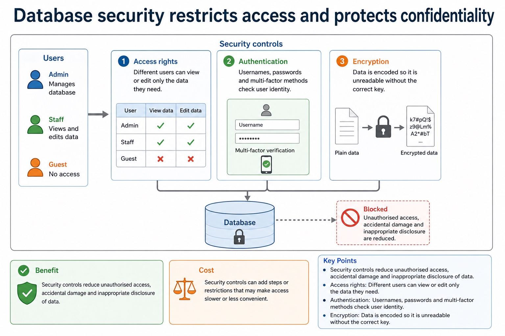
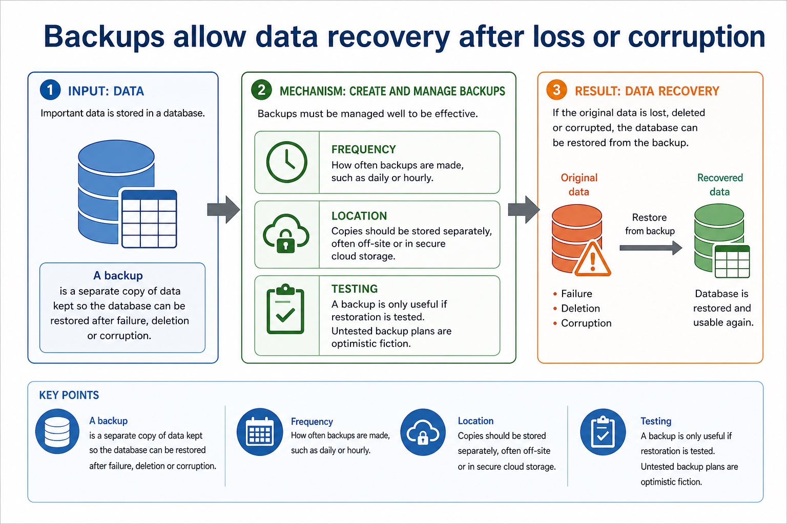
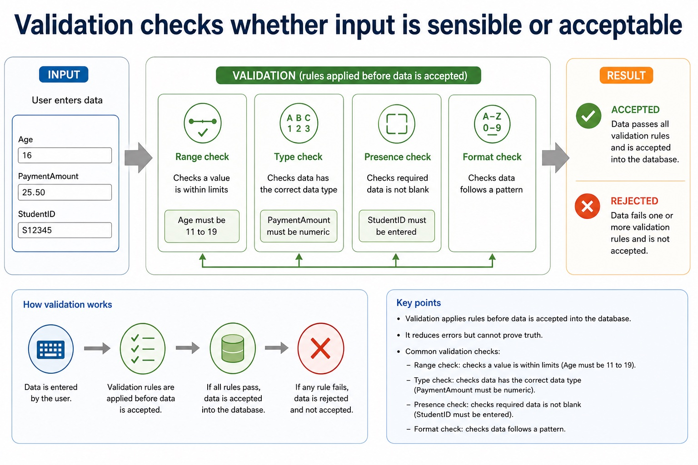
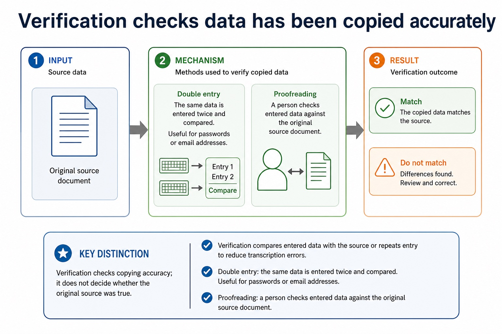

# Lesson 041: DBMS architecture, integrity, security and backup

**Course:** Cambridge International AS Level Computer Science 9618, 2027-2029 Version 2 
**Paper:** Paper 1 
**Syllabus:** Section 8: Databases 
**Syllabus requirements:** S8.05, S8.06 
**Pacing:** Flexible. Select the material set and practice depth needed by the learner.

## Teaching-depth menu

- **Quick route:** Use the diagnostic, learning objectives, first worked example and foundation question. Stop once the learner can explain the central distinction accurately.
- **Full route:** Use every knowledge-point material set, the worked method, the terminology check and all questions.
- **Deep route:** Add the prerequisite refresher, ask learners to connect the concept checklist, discuss the labelled extension and complete a transfer question without a model answer.

## 1. Prerequisite knowledge and quick diagnostic

Recall S8.01, S8.05 before starting this lesson.

Ask the learner to give one accurate definition or method step before continuing. If they cannot, briefly revisit the named prerequisite rather than repeating the whole previous lesson.

### Optional prerequisite refresher

- Version 2 requires both sides of the comparison: limitations of file-based storage/retrieval and relational-database features that address those limitations. Benefits must be linked to a mechanism rather than asserted generically.
- Explain limitations of file-based systems and how relational databases address them.
- Version 2 explicitly requires data management including a data dictionary, data modelling, logical schema, data integrity and data security including backup procedures and access rights for individuals or groups.
- Understand DBMS features: data dictionary, data modelling, logical schema, integrity, security, backup and access rights.

## 2. Knowledge explanation

### 1. DBMS · Features · Dictionary · Modelling (S8.05)

**Concept map:** DBMS → features → dictionary → modelling → logical → schema → integrity → security → backup → access → rights

**Three-part explanation:**

1. Version 2 explicitly requires data management including a data dictionary, data modelling, logical schema, data integrity and data security including backup procedures and access rights for…
2. identify data management/data dictionary, data modelling, logical schema, integrity, security/backup/access rights, developer interface and query processor
3. Security includes backup procedures and access rights assigned to individual users or groups

**Concrete cue:** Version 2 explicitly requires data management including a data dictionary, data modelling, logical schema, data integrity and data security including backup procedures and access rights for individuals or groups.

#### What does a DBMS provide?

Text transcript

- A DBMS is software used to create, manage and control access to a database. It sits between users/applications and stored data.
- Data management stores, organises, retrieves and updates data; maintains metadata in a data dictionary.
- Data modelling helps define entities, tables, fields and the logical schema of the database.
- Data integrity enforces rules so values are valid and relationships remain consistent.
- Data security uses access rights for individuals or groups; supports backup and recovery procedures.
- Developer interface provides tools for creating structures, forms, reports or database applications.
- Query processor interprets and carries out queries so users can retrieve or change data.
- Exam sentence:

#### Database security restricts access and protects confidentiality

Text transcript

- Security controls reduce unauthorised access, accidental damage and inappropriate disclosure of data.
- Access rights Different users can view or edit only the data they need.
- Authentication Usernames, passwords and multi-factor methods check user identity.
- Encryption Data is encoded so it is unreadable without the correct key.

#### Do not swap the security vocabulary

Text transcript

- Protection review
- Validation Checks data follows rules, such as range, type, format or presence.
- Verification Checks entered data matches a source, using proofreading or double entry.
- Security and backup Security restricts access; backup enables recovery after loss or corruption.

#### Referential integrity

Text transcript

- Referential integrity means a foreign key value must match an existing primary key value in the referenced table.
- Valid Loan.StudentID = S0234 is valid if Student.StudentID = S0234 exists.
- Invalid Loan.StudentID = S9999 is invalid if no student with that ID exists.
- Why It prevents orphan records, such as a loan assigned to a non-existent student.

#### Backups allow data recovery after loss or corruption

Text transcript

- A backup is a separate copy of data kept so the database can be restored after failure, deletion or corruption.
- Frequency How often backups are made, such as daily or hourly.
- Location Copies should be stored separately, often off-site or in secure cloud storage.
- Testing A backup is only useful if restoration is tested. Untested backup plans are optimistic fiction.

#### Section 8 knowledge map

Text transcript

- Retrieval map
- Data and DBMS data vs information; DBMS roles; avoiding flat-file limitations
- Tables and keys records, fields, data types, constraints, primary keys and foreign keys
- Design entity-relationship modelling and normalisation to reduce duplication
- SQL retrieval SELECT , FROM , WHERE , ORDER BY , aggregates and joins
- SQL modification INSERT , UPDATE , DELETE , field/value matching and safe WHERE
- Protection validation, verification, security controls, backups and restore testing

Precise syllabus wording

Understand DBMS features: data dictionary, data modelling, logical schema, integrity, security, backup and access rights.

Version 2 explicitly requires data management including a data dictionary, data modelling, logical schema, data integrity and data security including backup procedures and access rights for individuals or groups.

### 2. DBMS developer and user interfaces (S8.06)

**Concept map:** developer → interface → query → processor

**Three-part explanation:**

1. Version 2 names the developer interface and query processor as DBMS software tools whose use and purpose must be understood in practice
2. They must be distinguished rather than listed without function
3. identify data management/data dictionary, data modelling, logical schema, integrity, security/backup/access rights, developer interface and query processor

**Concrete cue:** Version 2 names the developer interface and query processor as DBMS software tools whose use and purpose must be understood in practice. They must be distinguished rather than listed without…

#### What does a DBMS provide?

Text transcript

- A DBMS is software used to create, manage and control access to a database. It sits between users/applications and stored data.
- Data management stores, organises, retrieves and updates data; maintains metadata in a data dictionary.
- Data modelling helps define entities, tables, fields and the logical schema of the database.
- Data integrity enforces rules so values are valid and relationships remain consistent.
- Data security uses access rights for individuals or groups; supports backup and recovery procedures.
- Developer interface provides tools for creating structures, forms, reports or database applications.
- Query processor interprets and carries out queries so users can retrieve or change data.
- Exam sentence:

#### Table-qualified names and aliases prevent ambiguity

Text transcript

- If two tables have a field with the same name, write the table name or alias before the field.
- Full name Student.StudentID clearly means the field from Student.
- Alias Student AS S lets you write S.StudentID .
- Exam caution Only use aliases if they make the query clear. Do not hide the join logic.

Precise syllabus wording

Understand the developer interface and query processor.

Version 2 names the developer interface and query processor as DBMS software tools whose use and purpose must be understood in practice. They must be distinguished rather than listed without function.

### Supporting diagram library

#### Section 8 basics so far

Text transcript

- Monthly checkpoint
- This checkpoint connects Lessons 079-080 without becoming a full exam.
- 1. Define data, information, database, DBMS, flat-file, relational database.
- 2. Compare one-table repeated data vs linked tables with reduced redundancy.
- 3. Design choose data types and constraints for five fields in a small scenario.

#### Which rule rejects the bad value?

Text transcript

- Interactive constraint checker
- Bad value
- Choose a bad value to identify the check.
- Name the rule and explain what it prevents.

#### Constraints and validation rules

Text transcript

- A constraint limits accepted values to help maintain data integrity. It does not prove the data is true; it helps reject impossible or invalid data.
- Presence check Value must not be blank. Example: Name is required.
- Range check Value must be within limits. Example: Mark is 0 to 100.
- Type check Value must match the data type. Example: Quantity must be Integer.
- Length check Value must have a permitted length. Example: StudentID has 5 characters.
- Format check Value must match a pattern. Example: postcode or email pattern.
- Lookup check Value must be from an allowed list. Example: Grade is A, B, C, D, E or U.
- Exam sentence:

#### Designing fields properly

Text transcript

- Each field should have a name, data type, possible field size and constraints. Good design reduces invalid data at entry.
- Field name Clear and specific: DateOfBirth , not date .
- Data type Controls the kind of data: text, integer, real, date/time, Boolean.
- Field size Maximum storage length where relevant, such as 8 characters for StudentID.
- Constraint A rule that a value must satisfy before it is accepted.

#### How normal forms remove dependency problems

Text transcript

- First Normal Form (1NF) requires atomic values and no repeating groups.
- Second Normal Form (2NF) is in 1NF and removes partial dependency: each non-key attribute depends on the whole primary key.
- Third Normal Form (3NF) is in 2NF and removes transitive dependency: a non-key attribute must not depend on another non-key attribute.
- A valid decomposition retains every original fact, preserves keys and relationships, and follows the stated functional dependencies.

#### Tables, records and fields

Text transcript

- A table stores records about one entity. A record is one complete row. A field is one column or attribute.
- A collection of records for one entity
- Student table
- Record / tuple
- One complete row in a table
- S0234, Amira Chen, 2009-04-18, TRUE
- Field / attribute
- One column or property stored for each record

#### Choose the best data type

Text transcript

- Interactive data type chooser
- Choose a field, then decide the data type.
- The best answer depends on how the value is used, not how numeric it looks.

#### Common database data types

Text transcript

- Data type
- Use when
- Text / string
- The value may contain letters, spaces, symbols or leading zeroes
- PhoneNumber = "02071234567"
- Whole number used for counting or arithmetic
- Quantity = 24
- Real / decimal

#### Validation checks whether input is sensible or acceptable

Text transcript

- Validation applies rules before data is accepted into the database. It reduces errors but cannot prove truth.
- Range check
- Checks a value is within limits
- Age must be 11 to 19
- Type check
- Checks data has the correct data type
- PaymentAmount must be numeric
- Presence check

#### Verification checks data has been copied accurately

Text transcript

- Verification compares entered data with the source or repeats entry to reduce transcription errors.
- Double entry The same data is entered twice and compared. Useful for passwords or email addresses.
- Proofreading A person checks entered data against the original source document.
- Key distinction Verification checks copying accuracy; it does not decide whether the original source was true.

#### Relational design: what earns marks?

Text transcript

- Design review
- Primary key Uniquely identifies a record in one table. It must be unique and reliable.
- Foreign key Stores a value that matches a primary key in another table, creating a relationship.
- Normalisation Separates repeated data into related tables to reduce duplication and update errors.

#### SQL clauses: choose the clause that matches the request

Text transcript

- For the clauses shown, written syntax order is SELECT, FROM, WHERE, GROUP BY, ORDER BY.
- A simplified logical processing order is FROM, WHERE, GROUP BY, SELECT, ORDER BY.
- GROUP BY forms groups and ORDER BY sorts the final rows.
- Written syntax order and logical processing order are different.

#### Trace one mixed SQL result

Text transcript

- Interactive SQL tracer
- Category
- Networks
- Computing
- Literature
- Databases
- Choose a query to see the result.

Open precise terminology and exam facts

- Version 2 explicitly requires data management including a data dictionary, data modelling, logical schema, data integrity and data security including backup procedures and access rights for individuals or groups.
- Version 2 names the developer interface and query processor as DBMS software tools whose use and purpose must be understood in practice. They must be distinguished rather than listed without function.
- An entity-relationship (E-R) diagram documents a database design by showing the entities, their relevant attributes or keys, the relationships between entities and the relationship cardinality. Entity names should describe things about which the system stores multiple facts; attributes belong to the entity they describe.
- To produce an E-R diagram, extract entity candidates from the scenario, assign identifiers, connect only supported relationships and label cardinality as one-to-one, one-to-many or many-to-many. Resolve a many-to-many relationship with a linking entity when converting the design to relational tables. A diagram must preserve the stated business rules rather than inventing links from similar field names.
- 1NF requires atomic values and no repeating groups. 2NF is 1NF with every non-key attribute dependent on the whole primary key, removing partial dependencies. 3NF is 2NF with no non-key attribute dependent on another non-key attribute, removing transitive dependencies.
- Normalisation decomposes tables while preserving keys and relationships. A normalised 3NF design stores each fact once in the table identified by its determinant, reducing insertion, update and deletion anomalies.
- A file-based approach can repeat facts in separate files, create inconsistent copies and isolate related data. A Database Management System (DBMS) addresses these file-based limitations by providing data management, including a data dictionary of metadata; data modelling; a logical schema; data integrity; and data security. Security includes backup procedures and access rights assigned to individual users or groups.
- A developer interface provides tools used to define structures and build database applications, forms or reports. A query processor interprets and checks a query, chooses how to carry it out, accesses the stored data and returns or modifies the specified records while the DBMS applies access and integrity rules.
- Relational databases address file-based duplication, inconsistency, isolation and access problems through related tables, keys, constraints and managed queries.
- Database design review: connect each file-based limitation to a relational or DBMS mechanism; use entity/table, record/tuple and field/attribute precisely; distinguish candidate, primary, secondary and foreign keys; classify one-to-one, one-to-many and many-to-many relationships; apply referential integrity and indexing; document the design with an E-R diagram; and explain or produce 1NF, 2NF and 3NF designs.
- DBMS and SQL review: identify data management/data dictionary, data modelling, logical schema, integrity, security/backup/access rights, developer interface and query processor. Distinguish DDL structure commands from DML query/maintenance commands, use every required data type and key clause, and keep SELECT queries to at most two tables with explicit INNER JOIN ... ON when two tables are needed.
- A complete answer follows the scenario through design, statement and result. It does not claim that a primary key prevents every duplicate fact, that a secondary key must be unique, that normalisation guarantees correctness, or that a three-table/comma-style query is within the AS core boundary.

### Worked example

1. Model students joining clubs
2. Order line data
3. Run a restricted query
4. Draw Student(StudentID, Name) and Club(ClubID, ClubName).
5. Because each student may join many clubs and each club may contain many students, add Membership(StudentID, ClubID, JoinDate) as a linking entity.
6. The completed design has Student 1:M Membership and Club 1:M Membership.

Beyond syllabus / 延伸知识（不要求背诵）: production databases also manage transactions and concurrent users; these ideas extend the syllabus model of integrity and access control.
## 3. Practice by question type

### Question 1 - foundation - apply - 2 marks

What five broad DBMS feature areas are required?

**Answer:** Data management including a data dictionary, data modelling, logical schema, data integrity, and data security including backup and access rights.

**Marking guidance:** Award one mark for each distinct, technically accurate point or method step.

**Common error:** For the command word apply, perform that exact action; do not replace it with an unrelated fact.

### Question 2 - application - apply - 2 marks

Which DBMS feature limits users or groups to permitted operations?

**Answer:** Access rights within data security.

**Marking guidance:** Award one mark for each distinct, technically accurate point or method step.

**Common error:** Do not repeat the same point in different words; each mark needs a separate idea or method step.

### Question 3 - transfer - explain - 3 marks

Explain how dbms architecture, integrity, security and backup would be applied in a suitable computing context.

**Answer:** Version 2 names the developer interface and query processor as DBMS software tools whose use and purpose must be understood in practice. They must be distinguished rather than listed without function. An entity-relationship (E-R) diagram documents a database design by showing the entities, their relevant attributes or keys, the relationships between entities and the relationship cardinality. Entity names should describe things about which the system stores multiple facts; attributes belong to the entity they describe. To produce an E-R diagram, extract entity candidates from the scenario, assign identifiers, connect only supported relationships and label cardinality as one-to-one, one-to-many or many-to-many. Resolve a many-to-many relationship with a linking entity when converting the design to relational tables. A diagram must preserve the stated business rules rather than inventing links from similar field names.

**Marking guidance:** Each mark needs a relevant point linked to the stated context.

**Common error:** Do not copy the worked example unchanged; transfer the method and check it against the new context.

### Related past-paper indexes

| Reference | Marks | Command word | Question type |
|---|---:|---|---|
| 9618/13/W/25 Q5(d) | 4 | complete | recall |
| 9618/11/S/24 Q6(b) | 4 | complete | recall |
| 9618/12/S/23 Q2(a) | 4 | complete | recall |
| 9618/12/S/23 Q2(ii) | 4 | complete | recall |

These are indexes only. Cambridge question and mark-scheme wording is not reproduced.

## 4. Summary and exam reminders

### Summary

- Define dbms architecture, integrity, security and backup with the exact technical vocabulary expected by the syllabus.
- Use the lesson method on a fresh context and show the intermediate decision, representation or calculation.
- Match the shape of the answer to the command word and the available marks.
- Check the final answer against the scenario instead of repeating a memorised sentence.

### Common error to correct

Students often choose names as primary keys. Correction: a primary key must uniquely and reliably identify a record.

### Exam technique

- Follow the command word: state gives a fact; explain links a cause to a consequence; compare covers both sides.
- Match the number of independent points or method steps to the available marks.
- For dbms architecture, integrity, security and backup, use the exact technical term before applying it to the scenario.
