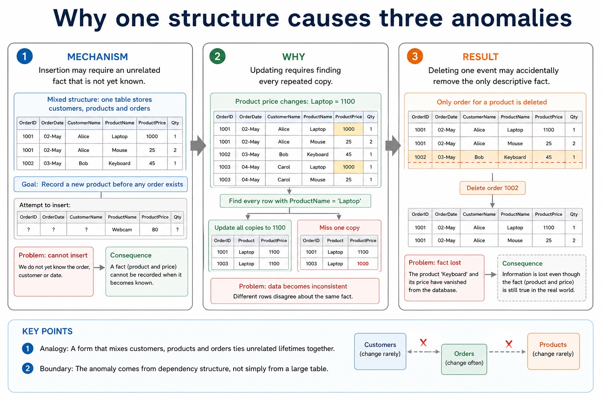
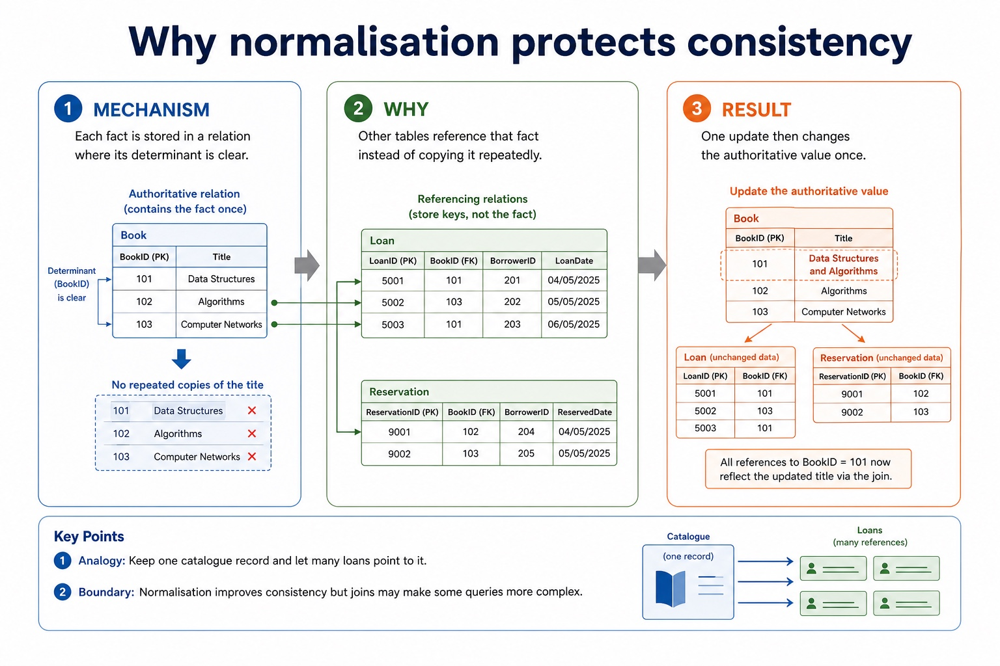
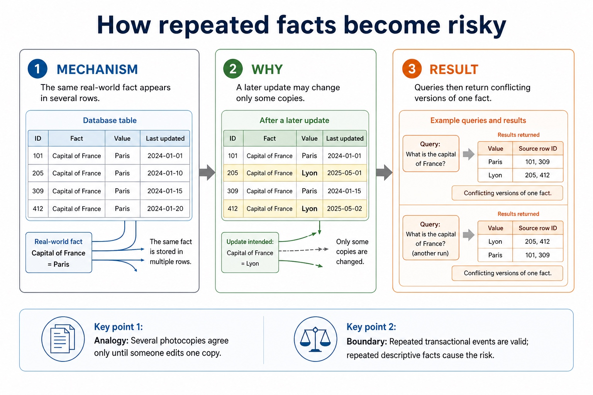

# Lesson 042: DDL, DML and the role of SQL

**Course:** Cambridge International AS Level Computer Science 9618, 2027-2029 Version 2 
**Paper:** Paper 1 
**Syllabus:** Section 8: Databases 
**Syllabus requirements:** S8.07 
**Pacing:** Flexible. Select the material set and practice depth needed by the learner.

## Teaching-depth menu

- **Quick route:** Use the diagnostic, learning objectives, first worked example and foundation question. Stop once the learner can explain the central distinction accurately.
- **Full route:** Use every knowledge-point material set, the worked method, the terminology check and all questions.
- **Deep route:** Add the prerequisite refresher, ask learners to connect the concept checklist, discuss the labelled extension and complete a transfer question without a model answer.

## 1. Prerequisite knowledge and quick diagnostic

Recall the main conclusion from Lesson 041: DBMS architecture, integrity, security and backup.

Ask the learner to give one accurate definition or method step before continuing. If they cannot, briefly revisit the named prerequisite rather than repeating the whole previous lesson.

## 2. Knowledge explanation

### 1. DDL · Creation · Modification · Database structure (S8.07)

**Concept map:** DDL → creation → modification → database structure → DML → queries → maintenance → SQL → industry-standard → language

**Three-part explanation:**

1. Version 2 distinguishes DBMS creation/modification of database structure through DDL from queries and data maintenance through DML, and identifies SQL as the industry standard for both
2. DDL is used for the creation and modification of database structure
3. Distinguish DDL structure commands from DML query/maintenance commands, use every required data type and key clause, and keep SELECT queries to at most two tables with…

**Concrete cue:** Version 2 distinguishes DBMS creation/modification of database structure through DDL from queries and data maintenance through DML, and identifies SQL as the industry standard for both.

#### What does a DBMS provide?

Text transcript

- A DBMS is software used to create, manage and control access to a database. It sits between users/applications and stored data.
- Data management stores, organises, retrieves and updates data; maintains metadata in a data dictionary.
- Data modelling helps define entities, tables, fields and the logical schema of the database.
- Data integrity enforces rules so values are valid and relationships remain consistent.
- Data security uses access rights for individuals or groups; supports backup and recovery procedures.
- Developer interface provides tools for creating structures, forms, reports or database applications.
- Query processor interprets and carries out queries so users can retrieve or change data.
- Exam sentence:

#### Section 8 knowledge map

Text transcript

- Retrieval map
- Data and DBMS data vs information; DBMS roles; avoiding flat-file limitations
- Tables and keys records, fields, data types, constraints, primary keys and foreign keys
- Design entity-relationship modelling and normalisation to reduce duplication
- SQL retrieval SELECT , FROM , WHERE , ORDER BY , aggregates and joins
- SQL modification INSERT , UPDATE , DELETE , field/value matching and safe WHERE
- Protection validation, verification, security controls, backups and restore testing

#### Trace one mixed SQL result

Text transcript

- Interactive SQL tracer
- Category
- Networks
- Computing
- Literature
- Databases
- Choose a query to see the result.

Precise syllabus wording

Understand DDL creates/modifies structure, DML queries/maintains data, and SQL is an industry-standard language.

Version 2 distinguishes DBMS creation/modification of database structure through DDL from queries and data maintenance through DML, and identifies SQL as the industry standard for both.

### Supporting diagram library

#### Why one structure causes three anomalies

Text transcript

- Insertion may require an unrelated fact that is not yet known.
- Updating requires finding every repeated copy.
- Deleting one event may accidentally remove the only descriptive fact.

#### INSERT, UPDATE and DELETE are data manipulation commands

Text transcript

- They change stored data. In exam answers, be precise about command keywords and affected records.
- INSERT Adds a new record to a table.
- UPDATE Changes values in existing records.
- DELETE Removes existing records from a table.

#### Why normalisation protects consistency

Text transcript

- Each fact is stored in a relation where its determinant is clear.
- Other tables reference that fact instead of copying it repeatedly.
- One update then changes the authoritative value once.

#### How repeated facts become risky

Text transcript

- The same real-world fact appears in several rows.
- A later update may change only some copies.
- Queries then return conflicting versions of one fact.

#### Relational design: what earns marks?

Text transcript

- Design review
- Primary key Uniquely identifies a record in one table. It must be unique and reliable.
- Foreign key Stores a value that matches a primary key in another table, creating a relationship.
- Normalisation Separates repeated data into related tables to reduce duplication and update errors.

#### Do not swap the security vocabulary

Text transcript

- Protection review
- Validation Checks data follows rules, such as range, type, format or presence.
- Verification Checks entered data matches a source, using proofreading or double entry.
- Security and backup Security restricts access; backup enables recovery after loss or corruption.

#### SQL clauses: choose the clause that matches the request

Text transcript

- For the clauses shown, written syntax order is SELECT, FROM, WHERE, GROUP BY, ORDER BY.
- A simplified logical processing order is FROM, WHERE, GROUP BY, SELECT, ORDER BY.
- GROUP BY forms groups and ORDER BY sorts the final rows.
- Written syntax order and logical processing order are different.

Open precise terminology and exam facts

- Version 2 distinguishes DBMS creation/modification of database structure through DDL from queries and data maintenance through DML, and identifies SQL as the industry standard for both.
- DDL is used for the creation and modification of database structure. DML is used for queries and maintenance of stored data. SQL is an industry-standard language that includes both kinds of operation.
- Keep the schema and the records distinct: defining a table or constraint changes structure, while selecting, inserting, deleting or updating records works with stored data.
- Database design review: connect each file-based limitation to a relational or DBMS mechanism; use entity/table, record/tuple and field/attribute precisely; distinguish candidate, primary, secondary and foreign keys; classify one-to-one, one-to-many and many-to-many relationships; apply referential integrity and indexing; document the design with an E-R diagram; and explain or produce 1NF, 2NF and 3NF designs.
- DBMS and SQL review: identify data management/data dictionary, data modelling, logical schema, integrity, security/backup/access rights, developer interface and query processor. Distinguish DDL structure commands from DML query/maintenance commands, use every required data type and key clause, and keep SELECT queries to at most two tables with explicit INNER JOIN ... ON when two tables are needed.
- A complete answer follows the scenario through design, statement and result. It does not claim that a primary key prevents every duplicate fact, that a secondary key must be unique, that normalisation guarantees correctness, or that a three-table/comma-style query is within the AS core boundary.
- A record is also called a tuple; both terms describe one row containing fields or attributes for one entity occurrence.
- A query uses SELECT fields FROM a table, may filter rows with WHERE, sort with ORDER BY and form aggregate groups with GROUP BY. SUM totals values, COUNT counts rows or values, and AVG calculates a mean. An INNER JOIN uses ON to match at most two tables in the required AS queries.

### Worked example

1. Classify database operations
2. CREATE TABLE is DDL because it creates database structure.
3. SELECT and UPDATE are DML because they query or maintain stored data.

Beyond syllabus / 延伸知识（不要求背诵）: production databases also manage transactions and concurrent users; these ideas extend the syllabus model of integrity and access control.
## 3. Practice by question type

### Question 1 - foundation - identify - 3 marks

Identify CREATE TABLE, SELECT and UPDATE as DDL or DML and explain the distinction.

**Answer:** DDL creation/modification of structure; DML queries/maintenance; SQL identified as industry-standard language

**Marking guidance:** Do not describe every SQL statement as changing stored records.

**Common error:** For the command word identify, perform that exact action; do not replace it with an unrelated fact.

### Question 2 - application - apply - 2 marks

Which SQL language category changes table structure?

**Answer:** DDL.

**Marking guidance:** Award one mark for each distinct, technically accurate point or method step.

**Common error:** Do not repeat the same point in different words; each mark needs a separate idea or method step.

### Question 3 - transfer - explain - 3 marks

Explain how ddl, dml and the role of sql would be applied in a suitable computing context.

**Answer:** DDL is used for the creation and modification of database structure. DML is used for queries and maintenance of stored data. SQL is an industry-standard language that includes both kinds of operation. Keep the schema and the records distinct: defining a table or constraint changes structure, while selecting, inserting, deleting or updating records works with stored data. Database design review: connect each file-based limitation to a relational or DBMS mechanism; use entity/table, record/tuple and field/attribute precisely; distinguish candidate, primary, secondary and foreign keys; classify one-to-one, one-to-many and many-to-many relationships; apply referential integrity and indexing; document the design with an E-R diagram; and explain or produce 1NF, 2NF and 3NF designs.

**Marking guidance:** Each mark needs a relevant point linked to the stated context.

**Common error:** Do not copy the worked example unchanged; transfer the method and check it against the new context.

### Related past-paper indexes

| Reference | Marks | Command word | Question type |
|---|---:|---|---|
| 9618/13/W/25 Q5(b) | 4 | complete | recall |
| 9618/11/W/24 Q2(ii) | 5 | define | recall |
| 9618/12/S/24 Q4(d) | 5 | define | recall |
| 9618/13/S/24 Q6 | 4 | define | recall |

These are indexes only. Cambridge question and mark-scheme wording is not reproduced.

## 4. Summary and exam reminders

### Summary

- Define ddl, dml and the role of sql with the exact technical vocabulary expected by the syllabus.
- Use the lesson method on a fresh context and show the intermediate decision, representation or calculation.
- Match the shape of the answer to the command word and the available marks.
- Check the final answer against the scenario instead of repeating a memorised sentence.

### Common error to correct

Students often choose names as primary keys. Correction: a primary key must uniquely and reliably identify a record.

### Exam technique

- Follow the command word: state gives a fact; explain links a cause to a consequence; compare covers both sides.
- Match the number of independent points or method steps to the available marks.
- For ddl, dml and the role of sql, use the exact technical term before applying it to the scenario.
