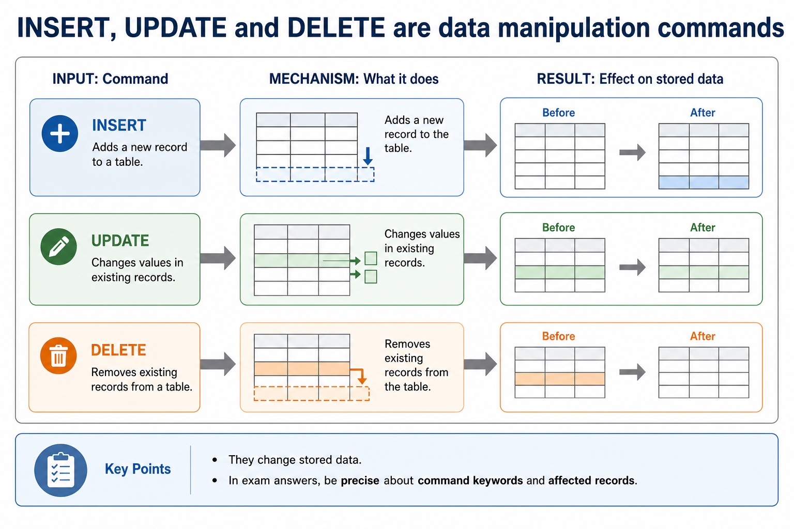

# Lesson 042: DDL, DML and the role of SQL

**Course:** Cambridge International AS Level Computer Science 9618, syllabus for examination in 2027-2029 
**Paper:** Paper 1 
**Syllabus:** Section 8: Databases 
**Syllabus requirements:** S8.07 
**Pacing:** Flexible. Select a quick, full or deep route for the learners in front of you.

## Teaching-depth menu

- **Quick route:** Use the diagnostic, learning objectives, first worked example and foundation question. Stop once the learner can explain the central distinction accurately.
- **Full route:** Teach every knowledge-point material set, the worked method and all lesson questions.
- **Deep route:** Add the prerequisite refresher, ask learners to connect the concept checklist, discuss the labelled extension and complete a transfer question without a model answer.

## 1. Prerequisite knowledge and quick diagnostic

Recall the main conclusion from Lesson 041: DBMS architecture, integrity, security and backup.

Ask the learner to give one accurate definition or method step before continuing. If they cannot, briefly revisit the named prerequisite rather than repeating the whole previous lesson.

## 2. Knowledge explanation

### 1. DDL creates/modifies structure, DML queries/maintains data, and SQL is an industry-standard language (S8.07)

**Atomic learning targets**

- **S8.07.A01:** DDL
- **S8.07.A02:** creation
- **S8.07.A03:** modification
- **S8.07.A04:** database structure
- **S8.07.A05:** DML
- **S8.07.A06:** queries
- **S8.07.A07:** maintenance
- **S8.07.A08:** SQL
- **S8.07.A09:** industry-standard
- **S8.07.A10:** language

**Core explanation**

- DDL is used for the creation and modification of database structure. DML is used for queries and maintenance of stored data. SQL is an industry-standard language that includes both kinds of operation.
- A query uses SELECT fields FROM a table, may filter rows with WHERE, sort with ORDER BY and form aggregate groups with GROUP BY. SUM totals values, COUNT counts rows or values, and AVG calculates a mean. An INNER JOIN uses ON to match at most two tables in the required AS queries.
- DDL creates/modifies structure, DML queries/maintains data, and SQL is an industry-standard language.
- DDL is used for the creation and modification of database structure.

**Mechanism or method**

1. **Identify the relevant condition or input** — DDL is used for the creation and modification of database structure.
2. **Trace how the process works** — DML is used for queries and maintenance of stored data.
3. **Connect the mechanism to its result** — SQL is an industry-standard language that includes both kinds of operation.

#### Worked example: DDL creates/modifies structure, DML queries/maintains data, and SQL is an industry-standard language: complete worked route

1. **Identify the relevant condition or input**

DDL is used for the creation and modification of database structure.

2. **Trace how the process works**

DML is used for queries and maintenance of stored data.

3. **Connect the mechanism to its result**

SQL is an industry-standard language that includes both kinds of operation.

4. **Complete example**

Classify database operations: CREATE TABLE is DDL because it creates database structure. SELECT and UPDATE are DML because they query or maintain stored data.

**Misconceptions to correct**

- Students often choose names as primary keys. Correction: a primary key must uniquely and reliably identify a record.

#### Mastery check (MC-L042-S8.07)

Explain the following targets in one connected answer, using a concrete example for each: DDL; creation; modification; database structure; DML; queries; maintenance; SQL; industry-standard; language.

Answer criteria

- DDL is used for the creation and modification of database structure. DML is used for queries and maintenance of stored data. SQL is an industry-standard language that includes both kinds of operation.
- A query uses SELECT fields FROM a table, may filter rows with WHERE, sort with ORDER BY and form aggregate groups with GROUP BY. SUM totals values, COUNT counts rows or values, and AVG calculates a mean. An INNER JOIN uses ON to match at most two tables in the required AS queries.
- DDL creates/modifies structure, DML queries/maintains data, and SQL is an industry-standard language.
- DDL is used for the creation and modification of database structure.

**Supplementary concept map**

- **database structure:** DBMS creation/modification of database structure through DDL from…
- **industry-standard:** DDL creates/modifies structure, DML queries/maintains data, and SQL…
- **DDL:** DDL is used for the creation and modification…
- **creation:** DDL structure commands from DML query/maintenance commands, use…
- **modification:** SQL is an industry-standard language that includes both…
- **DML:** DML is used for queries and maintenance of…

**Supplementary three-step recap**

1. **Identify structure and target data** — DBMS creation/modification of database structure through DDL from queries and data maintenance through DML, and identifies SQL as…
2. **Apply the database rule** — DDL creates/modifies structure, DML queries/maintains data, and SQL is an industry-standard language.
3. **Check keys rows and conditions** — DDL is used for the creation and modification of database structure.

**INSERT, UPDATE and DELETE are data manipulation commands:** They change stored data. In exam answers, be precise about command keywords and affected records. INSERT Adds a new record to a table.

#### INSERT, UPDATE and DELETE are data manipulation commands

Text transcript

- They change stored data. In exam answers, be precise about command keywords and affected records.
- INSERT Adds a new record to a table.
- UPDATE Changes values in existing records.
- DELETE Removes existing records from a table.

Precise syllabus wording

Understand DDL creates/modifies structure, DML queries/maintains data, and SQL is an industry-standard language.

the syllabus distinguishes DBMS creation/modification of database structure through DDL from queries and data maintenance through DML, and identifies SQL as the industry standard for both.

### Lesson technical reference

- the syllabus distinguishes DBMS creation/modification of database structure through DDL from queries and data maintenance through DML, and identifies SQL as the industry standard for both.
- DDL is used for the creation and modification of database structure. DML is used for queries and maintenance of stored data. SQL is an industry-standard language that includes both kinds of operation.
- Keep the schema and the records distinct: defining a table or constraint changes structure, while selecting, inserting, deleting or updating records works with stored data.
- Database design review: connect each file-based limitation to a relational or DBMS mechanism; use entity/table, record/tuple and field/attribute precisely; distinguish candidate, primary, secondary and foreign keys; classify one-to-one, one-to-many and many-to-many relationships; apply referential integrity and indexing; document the design with an E-R diagram; and explain or produce 1NF, 2NF and 3NF designs.
- DBMS and SQL review: identify data management/data dictionary, data modelling, logical schema, integrity, security/backup/access rights, developer interface and query processor. Distinguish DDL structure commands from DML query/maintenance commands, use every required data type and key clause, and keep SELECT queries to at most two tables with explicit INNER JOIN ... ON when two tables are needed.
- A complete answer follows the scenario through design, statement and result. It does not claim that a primary key prevents every duplicate fact, that a secondary key must be unique, that normalisation guarantees correctness, or that a three-table/comma-style query is within the AS core boundary.
- A record is also called a tuple; both terms describe one row containing fields or attributes for one entity occurrence.
- A query uses SELECT fields FROM a table, may filter rows with WHERE, sort with ORDER BY and form aggregate groups with GROUP BY. SUM totals values, COUNT counts rows or values, and AVG calculates a mean. An INNER JOIN uses ON to match at most two tables in the required AS queries.

Beyond syllabus / 延伸知识（不要求背诵）: production databases also manage transactions and concurrent users; these ideas extend the syllabus model of integrity and access control.
## 3. Practice by question type

### Question 1 - foundation - identify - 3 marks

Identify CREATE TABLE, SELECT and UPDATE as DDL or DML and explain the distinction.

**Answer:** DDL creation/modification of structure; DML queries/maintenance; SQL identified as industry-standard language

**Marking guidance:** Do not describe every SQL statement as changing stored records.

**Common error:** For the command word identify, perform that exact action; do not replace it with an unrelated fact.

### Question 2 - application - apply - 2 marks

Which SQL language category changes table structure?

**Answer:** DDL.

**Marking guidance:** Award one mark for each distinct, technically accurate point or method step.

**Common error:** Do not repeat the same point in different words; each mark needs a separate idea or method step.

### Question 3 - transfer - explain - 3 marks

Explain how ddl, dml and the role of sql would be applied in a suitable computing context.

**Answer:** DDL is used for the creation and modification of database structure. DML is used for queries and maintenance of stored data. SQL is an industry-standard language that includes both kinds of operation. Keep the schema and the records distinct: defining a table or constraint changes structure, while selecting, inserting, deleting or updating records works with stored data. Database design review: connect each file-based limitation to a relational or DBMS mechanism; use entity/table, record/tuple and field/attribute precisely; distinguish candidate, primary, secondary and foreign keys; classify one-to-one, one-to-many and many-to-many relationships; apply referential integrity and indexing; document the design with an E-R diagram; and explain or produce 1NF, 2NF and 3NF designs.

**Marking guidance:** Each mark needs a relevant point linked to the stated context.

**Common error:** Do not copy the worked example unchanged; transfer the method and check it against the new context.

### Related past-paper indexes

| Reference | Marks | Command word | Question type |
|---|---:|---|---|
| 9618/13/W/25 Q5(b) | 4 | complete | recall |
| 9618/11/W/24 Q2(ii) | 5 | define | recall |
| 9618/12/S/24 Q4(d) | 5 | define | recall |
| 9618/13/S/24 Q6 | 4 | define | recall |

These are indexes only. Cambridge question and mark-scheme wording is not reproduced.

## 4. Summary and exam reminders

### Summary

- S8.07: explain DDL, creation, modification, database structure, DML, queries, maintenance, SQL, industry-standard, language.
- S8.07 method: Identify the relevant condition or input → Trace how the process works → Connect the mechanism to its result.
- Correction to remember: Students often choose names as primary keys. Correction: a primary key must uniquely and reliably identify a record.

### Common error to correct

Students often choose names as primary keys. Correction: a primary key must uniquely and reliably identify a record.

### Exam technique

- Follow the command word: state gives a fact; explain links a cause to a consequence; compare covers both sides.
- Match the number of independent points or method steps to the available marks.
- For ddl, dml and the role of sql, use the exact technical term before applying it to the scenario.
