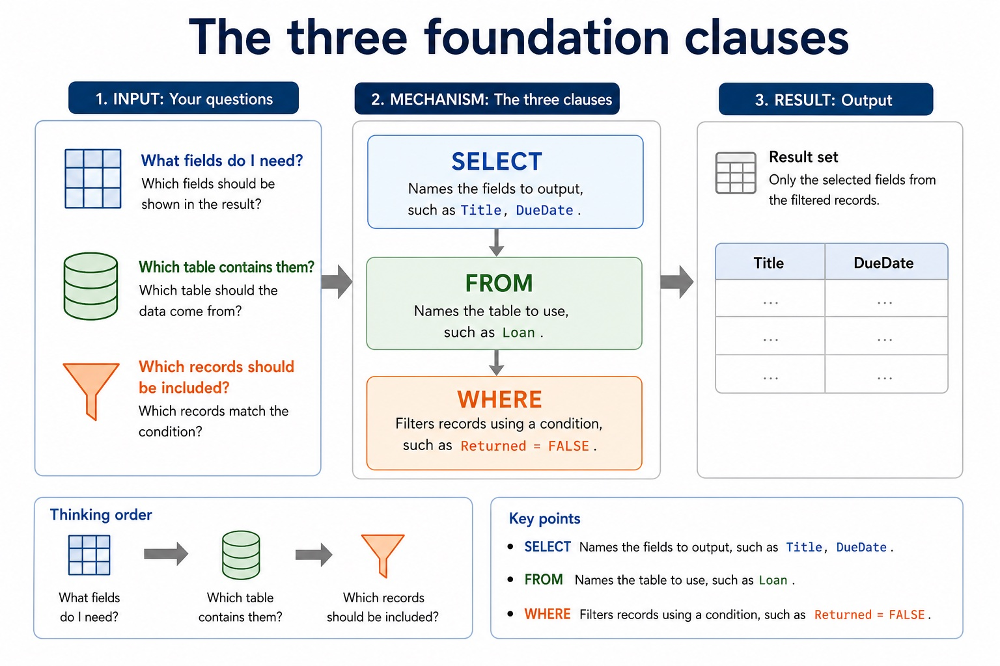

# Lesson 043: Reading and writing SQL queries

**Course:** Cambridge International AS Level Computer Science 9618, syllabus for examination in 2027-2029 
**Paper:** Paper 1 
**Syllabus:** Section 8: Databases 
**Syllabus requirements:** S8.08, S8.10 
**Pacing:** Flexible. Select a quick, full or deep route for the learners in front of you.

## Teaching-depth menu

- **Quick route:** Use the diagnostic, learning objectives, first worked example and foundation question. Stop once the learner can explain the central distinction accurately.
- **Full route:** Teach every knowledge-point material set, the worked method and all lesson questions.
- **Deep route:** Add the prerequisite refresher, ask learners to connect the concept checklist, discuss the labelled extension and complete a transfer question without a model answer.

## 1. Prerequisite knowledge and quick diagnostic

Recall S8.02, S8.08 before starting this lesson.

Ask the learner to give one accurate definition or method step before continuing. If they cannot, briefly revisit the named prerequisite rather than repeating the whole previous lesson.

### Optional prerequisite refresher

- the syllabus explicitly names entity, table, record, field, tuple, attribute, primary key, candidate key, secondary key, foreign key, one-to-one, one-to-many, many-to-many, referential integrity and indexing. Secondary key is retained as a distinct retrieval term, not an alias for an alternate candidate key.
- Understand entity/table, record/tuple, field/attribute, primary/candidate/secondary/foreign key, relationships, referential integrity and indexing.
- The syllabus explicitly requires understanding a given SQL statement. Evidence must show what a statement does to its result or stored data, not only recognise isolated keywords.
- Understand a given SQL statement and explain the semantics of its clauses, identifiers, operators and values.

## 2. Knowledge explanation

### 1. A given SQL statement and explain the semantics of its clauses, identifiers, operators and values (S8.08)

**Concept relationships**

- **SQL:** A given SQL statement and explain the semantics…
- **SELECT:** SELECT chooses output fields, FROM identifies the source…
- **fields:** A query uses SELECT fields FROM a table,…
- **table:** Keywords, field names, table names, operators, literal values…
- **condition:** An explicit INNER JOIN between those tables and…
- **FROM:** DDL structure commands from DML query/maintenance commands, use…

**Mechanism**

1. **Identify structure and target data** — A given SQL statement and explain the semantics of its clauses, identifiers, operators and values.
2. **Apply the database rule** — A query uses SELECT fields FROM a table, may filter rows with WHERE, sort with ORDER BY and…
3. **Check keys rows and conditions** — Keywords, field names, table names, operators, literal values and punctuation have different roles.

**The three foundation clauses:** SELECT Names the fields to output, such as Title, DueDate . FROM Names the table to use, such as Loan .

#### The three foundation clauses

Text transcript

- SELECT Names the fields to output, such as Title, DueDate .
- FROM Names the table to use, such as Loan .
- WHERE Filters records using a condition, such as Returned = FALSE .
- Thinking order:
- What fields do I need? Which table contains them? Which records should be included?

Precise syllabus wording

Understand a given SQL statement and explain the semantics of its clauses, identifiers, operators and values.

The syllabus explicitly requires understanding a given SQL statement. Evidence must show what a statement does to its result or stored data, not only recognise isolated keywords.

### 2. DML on at most two tables: SELECT, FROM, WHERE, ORDER BY, GROUP BY, INNER JOIN, SUM,… (S8.10)

**Concept relationships**

- **INNER JOIN:** DML scripts to data stored in at most…
- **two table:** DDL structure commands from DML query/maintenance commands, use…
- **SELECT:** SELECT, FROM, WHERE, ORDER BY, GROUP BY, INNER…
- **ORDER BY:** A query uses SELECT fields FROM a table,…
- **GROUP BY:** An INNER JOIN uses ON to match at…
- **SUM:** SUM totals values, COUNT counts rows or values,…

**Mechanism**

1. **Identify structure and target data** — DML scripts to data stored in at most two tables and names SELECT, FROM, WHERE, ORDER BY, GROUP…
2. **Apply the database rule** — DDL structure commands from DML query/maintenance commands, use every required data type and key clause, and keep SELECT…
3. **Check keys rows and conditions** — A query uses SELECT fields FROM a table, may filter rows with WHERE, sort with ORDER BY and…

**Two-table INNER JOIN with ON:** AS DML questions use at most two tables. SELECT Student.StudentName FROM Student INNER JOIN Loan ON Student.StudentID = Loan.StudentID uses an explicit two-table join.

#### Two-table INNER JOIN with ON

Text transcript

- AS DML questions use at most two tables.
- SELECT Student.StudentName FROM Student INNER JOIN Loan ON Student.StudentID = Loan.StudentID uses an explicit two-table join.
- ON states the matching key relationship between the tables.
- WHERE adds a separate row filter after the join; it does not replace the required INNER JOIN syntax.

Precise syllabus wording

Use DML on at most two tables: SELECT, FROM, WHERE, ORDER BY, GROUP BY, INNER JOIN, SUM, COUNT and AVG.

the syllabus limits DML scripts to data stored in at most two tables and names SELECT, FROM, WHERE, ORDER BY, GROUP BY, INNER JOIN, SUM, COUNT and AVG. The course uses explicit INNER JOIN ... ON for two-table core queries.

Open precise terminology and exam facts

- The syllabus explicitly requires understanding a given SQL statement. Evidence must show what a statement does to its result or stored data, not only recognise isolated keywords.
- the syllabus limits DML scripts to data stored in at most two tables and names SELECT, FROM, WHERE, ORDER BY, GROUP BY, INNER JOIN, SUM, COUNT and AVG. The course uses explicit INNER JOIN ... ON for two-table core queries.
- Structured Query Language (SQL) is the industry-standard language used by a DBMS for DDL and DML. To understand a statement, read each clause by its effect: SELECT chooses output fields, FROM identifies the source table, and WHERE filters records using a condition. Keywords, field names, table names, operators, literal values and punctuation have different roles.
- A valid answer must preserve the requested semantics, not merely contain familiar keywords. Text and date values are normally quoted in this course's standard SQL style; numeric and Boolean values are not quoted. Clause order, comparison operators and requested output fields determine which records and columns appear.
- Required DDL includes CREATE DATABASE, CREATE TABLE and ALTER TABLE. Field types include CHARACTER, VARCHAR, BOOLEAN, INTEGER, REAL, DATE and TIME.
- A PRIMARY KEY uniquely identifies a row. A FOREIGN KEY with REFERENCES links a field to a key in another table and supports referential integrity.
- AS DML questions use at most two tables. Write an explicit INNER JOIN between those tables and place the matching key condition after ON; use table-qualified field names where the same field name could be ambiguous.
- For Student(StudentID, StudentName) and Loan(StudentID, DueDate), SELECT Student.StudentName FROM Student INNER JOIN Loan ON Student.StudentID = Loan.StudentID returns names only where matching rows exist. Add WHERE for a further row condition, not for the join relationship itself.
- A query uses SELECT fields FROM a table, may filter rows with WHERE, sort with ORDER BY and form aggregate groups with GROUP BY. SUM totals values, COUNT counts rows or values, and AVG calculates a mean. An INNER JOIN uses ON to match at most two tables in the required AS queries.
- Database design review: connect each file-based limitation to a relational or DBMS mechanism; use entity/table, record/tuple and field/attribute precisely; distinguish candidate, primary, secondary and foreign keys; classify one-to-one, one-to-many and many-to-many relationships; apply referential integrity and indexing; document the design with an E-R diagram; and explain or produce 1NF, 2NF and 3NF designs.
- DBMS and SQL review: identify data management/data dictionary, data modelling, logical schema, integrity, security/backup/access rights, developer interface and query processor. Distinguish DDL structure commands from DML query/maintenance commands, use every required data type and key clause, and keep SELECT queries to at most two tables with explicit INNER JOIN ... ON when two tables are needed.
- A complete answer follows the scenario through design, statement and result. It does not claim that a primary key prevents every duplicate fact, that a secondary key must be unique, that normalisation guarantees correctness, or that a three-table/comma-style query is within the AS core boundary.

### Worked method

1. Define two related tables
2. List overdue borrowers
3. CREATE DATABASE College; then CREATE TABLE Department and CREATE TABLE Student.
4. Student uses INTEGER for StudentID, VARCHAR for Name, DATE for DateOfBirth, BOOLEAN for Active and a DepartmentID foreign key REFERENCES Department(DepartmentID).
5. ALTER TABLE can modify the structure later.

Beyond syllabus / 延伸知识（不要求背诵）: production databases also manage transactions and concurrent users; these ideas extend the syllabus model of integrity and access control.
## 3. Practice by question type

### Question 1 - foundation - identify - 2 marks

Identify four required SQL field types.

**Answer:** Any four of CHARACTER, VARCHAR, BOOLEAN, INTEGER, REAL, DATE and TIME.

**Marking guidance:** Award one mark for each distinct, technically accurate point or method step.

**Common error:** For the command word identify, perform that exact action; do not replace it with an unrelated fact.

### Question 2 - application - explain - 5 marks

Explain the effect of SELECT StudentID, Name FROM Student WHERE TutorGroup = '12A'; and identify one change that would alter its result.

**Answer:** reads records from Student; filters to TutorGroup 12A; outputs StudentID and Name only; identifies a valid semantic change such as field list, condition, operator or literal; explains how the named change alters rows or columns returned

**Marking guidance:** Do not award a clause-name list unless its effect on this statement is explained.

**Common error:** Do not repeat the same point in different words; each mark needs a separate idea or method step.

### Question 3 - transfer - apply - 2 marks

What is the AS table-count boundary for a DML query?

**Answer:** At most two tables.

**Marking guidance:** Award one mark for each distinct, technically accurate point or method step.

**Common error:** Do not copy the worked example unchanged; transfer the method and check it against the new context.

### Related past-paper indexes

| Reference | Marks | Command word | Question type |
|---|---:|---|---|
| 9618/13/W/25 Q5(c) | 5 | complete | recall |
| 9618/13/S/24 Q6(b) | 4 | define | recall |
| 9618/11/S/24 Q6(ii) | 3 | complete | recall |
| 9618/11/W/24 Q3 | 3 | design | recall |

These are indexes only. Cambridge question and mark-scheme wording is not reproduced.

## 4. Summary and exam reminders

### Summary

- Define reading and writing sql queries with the exact technical vocabulary expected by the syllabus.
- Use the lesson method on a fresh context and show the intermediate decision, representation or calculation.
- Match the shape of the answer to the command word and the available marks.
- Check the final answer against the scenario instead of repeating a memorised sentence.

### Common error to correct

Students often select every field with *. Correction: exam questions usually specify exactly which fields are required.

### Exam technique

- Follow the command word: state gives a fact; explain links a cause to a consequence; compare covers both sides.
- Match the number of independent points or method steps to the available marks.
- For reading and writing sql queries, use the exact technical term before applying it to the scenario.
