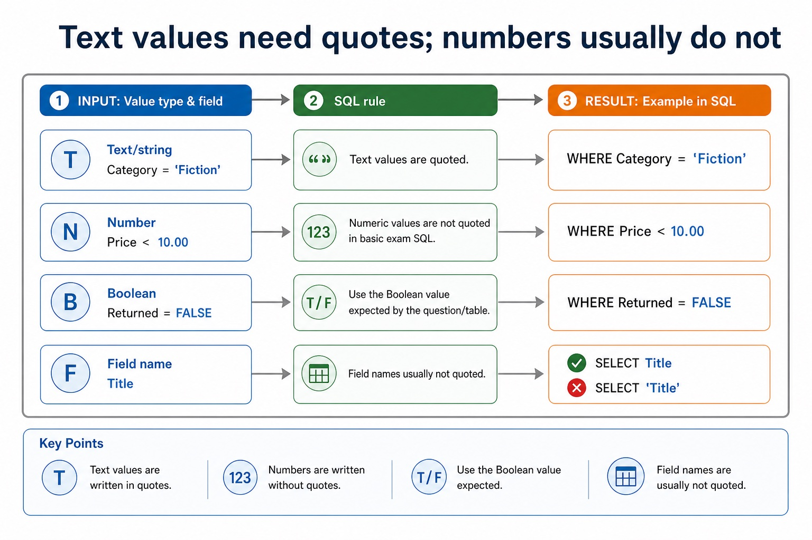
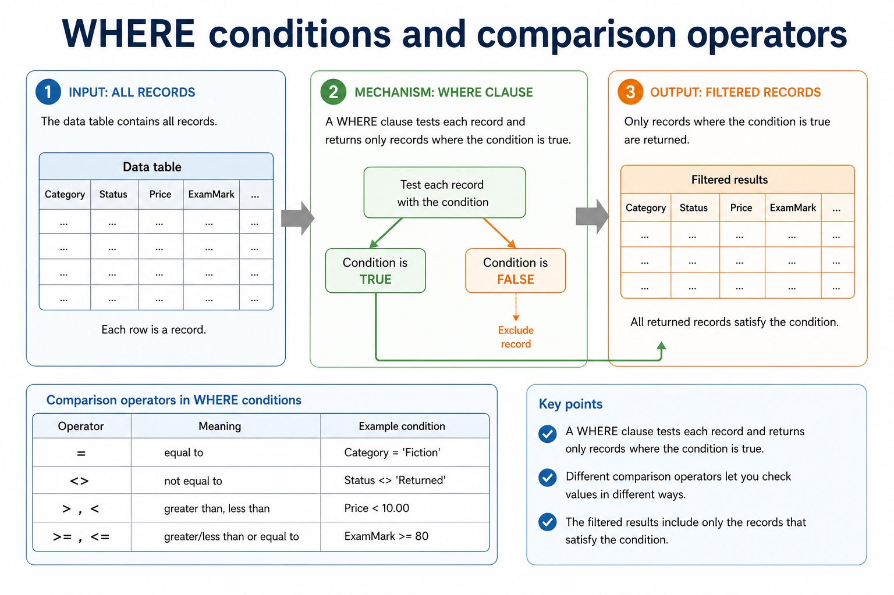
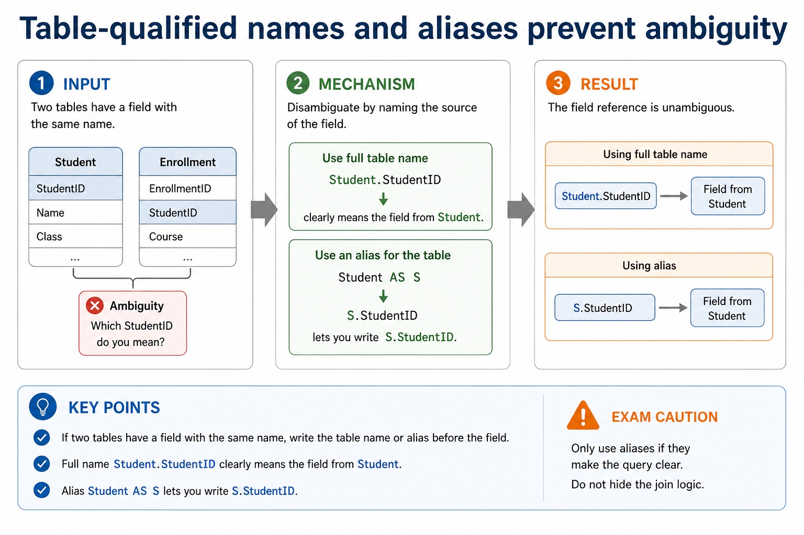

# Lesson 043: Reading and writing SQL queries

**Course:** Cambridge International AS Level Computer Science 9618, 2027-2029 Version 2 
**Paper:** Paper 1 
**Syllabus:** Section 8: Databases 
**Syllabus requirements:** S8.08, S8.10 
**Pacing:** Flexible. Select the material set and practice depth needed by the learner.

## Teaching-depth menu

- **Quick route:** Use the diagnostic, learning objectives, first worked example and foundation question. Stop once the learner can explain the central distinction accurately.
- **Full route:** Use every knowledge-point material set, the worked method, the terminology check and all questions.
- **Deep route:** Add the prerequisite refresher, ask learners to connect the concept checklist, discuss the labelled extension and complete a transfer question without a model answer.

## 1. Prerequisite knowledge and quick diagnostic

Recall S8.02, S8.08 before starting this lesson.

Ask the learner to give one accurate definition or method step before continuing. If they cannot, briefly revisit the named prerequisite rather than repeating the whole previous lesson.

### Optional prerequisite refresher

- Version 2 explicitly names entity, table, record, field, tuple, attribute, primary key, candidate key, secondary key, foreign key, one-to-one, one-to-many, many-to-many, referential integrity and indexing. Secondary key is retained as a distinct retrieval term, not an alias for an alternate candidate key.
- Understand entity/table, record/tuple, field/attribute, primary/candidate/secondary/foreign key, relationships, referential integrity and indexing.
- Version 2 explicitly requires understanding a given SQL statement. Evidence must show what a statement does to its result or stored data, not only recognise isolated keywords.
- Understand a given SQL statement and explain the semantics of its clauses, identifiers, operators and values.

## 2. Knowledge explanation

### 1. SQL · SELECT · FROM · WHERE (S8.08)

**Concept map:** SQL → SELECT → FROM → WHERE → fields → table → condition

**Three-part explanation:**

1. Evidence must show what a statement does to its result or stored data, not only recognise isolated keywords
2. Version 2 explicitly requires understanding a given SQL statement
3. Keywords, field names, table names, operators, literal values and punctuation have different roles

**Concrete cue:** Version 2 explicitly requires understanding a given SQL statement. Evidence must show what a statement does to its result or stored data, not only recognise isolated keywords.

#### The three foundation clauses

Text transcript

- SELECT Names the fields to output, such as Title, DueDate .
- FROM Names the table to use, such as Loan .
- WHERE Filters records using a condition, such as Returned = FALSE .
- Thinking order:
- What fields do I need? Which table contains them? Which records should be included?

#### Text values need quotes; numbers usually do not

Text transcript

- Text/string Category = 'Fiction' . The text value is quoted.
- Number Price < 10.00 . Numeric values are not quoted in basic exam SQL.
- Boolean Returned = FALSE . Use the Boolean value expected by the question/table.
- Field names Usually not quoted: SELECT Title , not SELECT 'Title' .

#### WHERE conditions and comparison operators

Text transcript

- A WHERE clause tests each record and returns only records where the condition is true.
- Operator
- equal to
- Category = 'Fiction'
- not equal to
- Status < 'Returned'
- greater than, less than
- Price < 10.00

#### SQL clauses: choose the clause that matches the request

Text transcript

- For the clauses shown, written syntax order is SELECT, FROM, WHERE, GROUP BY, ORDER BY.
- A simplified logical processing order is FROM, WHERE, GROUP BY, SELECT, ORDER BY.
- GROUP BY forms groups and ORDER BY sorts the final rows.
- Written syntax order and logical processing order are different.

#### Two-table INNER JOIN with ON

Text transcript

- AS DML questions use at most two tables.
- SELECT Student.StudentName FROM Student INNER JOIN Loan ON Student.StudentID = Loan.StudentID uses an explicit two-table join.
- ON states the matching key relationship between the tables.
- WHERE adds a separate row filter after the join; it does not replace the required INNER JOIN syntax.

Precise syllabus wording

Understand a given SQL statement and explain the semantics of its clauses, identifiers, operators and values.

Version 2 explicitly requires understanding a given SQL statement. Evidence must show what a statement does to its result or stored data, not only recognise isolated keywords.

### 2. SELECT · FROM · WHERE · ORDER BY (S8.10)

**Concept map:** SELECT → FROM → WHERE → ORDER BY → GROUP BY → INNER JOIN → ON → SUM → COUNT → AVG → at most two

**Three-part explanation:**

1. Version 2 limits DML scripts to data stored in at most two tables and names SELECT, FROM, WHERE, ORDER BY, GROUP BY, INNER JOIN, SUM, COUNT…
2. Distinguish DDL structure commands from DML query/maintenance commands, use every required data type and key clause, and keep SELECT queries to at most two tables with…
3. The course uses explicit INNER JOIN

**Concrete cue:** Version 2 limits DML scripts to data stored in at most two tables and names SELECT, FROM, WHERE, ORDER BY, GROUP BY, INNER JOIN, SUM, COUNT and AVG. The course…

#### Two-table INNER JOIN with ON

Text transcript

- AS DML questions use at most two tables.
- SELECT Student.StudentName FROM Student INNER JOIN Loan ON Student.StudentID = Loan.StudentID uses an explicit two-table join.
- ON states the matching key relationship between the tables.
- WHERE adds a separate row filter after the join; it does not replace the required INNER JOIN syntax.

#### Aggregate functions calculate one summary value

Text transcript

- COUNT() counts all rows in the result, including rows containing null values.
- COUNT(column) counts only non-null values in the named column.
- SUM, AVG and COUNT operate on the rows remaining after filtering and grouping rules are applied.

#### SQL clauses: choose the clause that matches the request

Text transcript

- For the clauses shown, written syntax order is SELECT, FROM, WHERE, GROUP BY, ORDER BY.
- A simplified logical processing order is FROM, WHERE, GROUP BY, SELECT, ORDER BY.
- GROUP BY forms groups and ORDER BY sorts the final rows.
- Written syntax order and logical processing order are different.

#### Table-qualified names and aliases prevent ambiguity

Text transcript

- If two tables have a field with the same name, write the table name or alias before the field.
- Full name Student.StudentID clearly means the field from Student.
- Alias Student AS S lets you write S.StudentID .
- Exam caution Only use aliases if they make the query clear. Do not hide the join logic.

#### GROUP BY calculates summaries per group

Text transcript

- Use GROUP BY when the question asks for a summary for each category, each borrower, each course or each group.
- Pattern:
- SELECT Category, COUNT() FROM Book GROUP BY Category;

#### ORDER BY sorts output rows

Text transcript

- ORDER BY controls the order of the result rows. ASC means ascending; DESC means descending.
- Ascending ORDER BY Price ASC : low to high, A to Z, oldest to newest.
- Descending ORDER BY Price DESC : high to low, Z to A, newest to oldest.
- Default Many SQL systems default to ascending, but exams may expect explicit ASC if asked.

Precise syllabus wording

Use DML on at most two tables: SELECT, FROM, WHERE, ORDER BY, GROUP BY, INNER JOIN, SUM, COUNT and AVG.

Version 2 limits DML scripts to data stored in at most two tables and names SELECT, FROM, WHERE, ORDER BY, GROUP BY, INNER JOIN, SUM, COUNT and AVG. The course uses explicit INNER JOIN ... ON for two-table core queries.

### Supporting diagram library

#### Related tables use primary keys and foreign keys

Text transcript

- A join combines rows when matching key fields refer to the same real-world item.
- StudentID primary key
- StudentName , TutorGroup
- 1 to many
- StudentID
- LoanID primary key
- StudentID , BookID foreign keys
- many to 1

#### Relational design: what earns marks?

Text transcript

- Design review
- Primary key Uniquely identifies a record in one table. It must be unique and reliable.
- Foreign key Stores a value that matches a primary key in another table, creating a relationship.
- Normalisation Separates repeated data into related tables to reduce duplication and update errors.

#### Section 8 knowledge map

Text transcript

- Retrieval map
- Data and DBMS data vs information; DBMS roles; avoiding flat-file limitations
- Tables and keys records, fields, data types, constraints, primary keys and foreign keys
- Design entity-relationship modelling and normalisation to reduce duplication
- SQL retrieval SELECT , FROM , WHERE , ORDER BY , aggregates and joins
- SQL modification INSERT , UPDATE , DELETE , field/value matching and safe WHERE
- Protection validation, verification, security controls, backups and restore testing

#### Do not swap the security vocabulary

Text transcript

- Protection review
- Validation Checks data follows rules, such as range, type, format or presence.
- Verification Checks entered data matches a source, using proofreading or double entry.
- Security and backup Security restricts access; backup enables recovery after loss or corruption.

#### Trace one mixed SQL result

Text transcript

- Interactive SQL tracer
- Category
- Networks
- Computing
- Literature
- Databases
- Choose a query to see the result.

Open precise terminology and exam facts

- Version 2 explicitly requires understanding a given SQL statement. Evidence must show what a statement does to its result or stored data, not only recognise isolated keywords.
- Version 2 limits DML scripts to data stored in at most two tables and names SELECT, FROM, WHERE, ORDER BY, GROUP BY, INNER JOIN, SUM, COUNT and AVG. The course uses explicit INNER JOIN ... ON for two-table core queries.
- Structured Query Language (SQL) is the industry-standard language used by a DBMS for DDL and DML. To understand a statement, read each clause by its effect: SELECT chooses output fields, FROM identifies the source table, and WHERE filters records using a condition. Keywords, field names, table names, operators, literal values and punctuation have different roles.
- A valid answer must preserve the requested semantics, not merely contain familiar keywords. Text and date values are normally quoted in this course's standard SQL style; numeric and Boolean values are not quoted. Clause order, comparison operators and requested output fields determine which records and columns appear.
- Required DDL includes CREATE DATABASE, CREATE TABLE and ALTER TABLE. Field types include CHARACTER, VARCHAR, BOOLEAN, INTEGER, REAL, DATE and TIME.
- A PRIMARY KEY uniquely identifies a row. A FOREIGN KEY with REFERENCES links a field to a key in another table and supports referential integrity.
- AS DML questions use at most two tables. Write an explicit INNER JOIN between those tables and place the matching key condition after ON; use table-qualified field names where the same field name could be ambiguous.
- For Student(StudentID, StudentName) and Loan(StudentID, DueDate), SELECT Student.StudentName FROM Student INNER JOIN Loan ON Student.StudentID = Loan.StudentID returns names only where matching rows exist. Add WHERE for a further row condition, not for the join relationship itself.
- A query uses SELECT fields FROM a table, may filter rows with WHERE, sort with ORDER BY and form aggregate groups with GROUP BY. SUM totals values, COUNT counts rows or values, and AVG calculates a mean. An INNER JOIN uses ON to match at most two tables in the required AS queries.
- Database design review: connect each file-based limitation to a relational or DBMS mechanism; use entity/table, record/tuple and field/attribute precisely; distinguish candidate, primary, secondary and foreign keys; classify one-to-one, one-to-many and many-to-many relationships; apply referential integrity and indexing; document the design with an E-R diagram; and explain or produce 1NF, 2NF and 3NF designs.
- DBMS and SQL review: identify data management/data dictionary, data modelling, logical schema, integrity, security/backup/access rights, developer interface and query processor. Distinguish DDL structure commands from DML query/maintenance commands, use every required data type and key clause, and keep SELECT queries to at most two tables with explicit INNER JOIN ... ON when two tables are needed.
- A complete answer follows the scenario through design, statement and result. It does not claim that a primary key prevents every duplicate fact, that a secondary key must be unique, that normalisation guarantees correctness, or that a three-table/comma-style query is within the AS core boundary.

### Worked example

1. Define two related tables
2. List overdue borrowers
3. CREATE DATABASE College; then CREATE TABLE Department and CREATE TABLE Student.
4. Student uses INTEGER for StudentID, VARCHAR for Name, DATE for DateOfBirth, BOOLEAN for Active and a DepartmentID foreign key REFERENCES Department(DepartmentID).
5. ALTER TABLE can modify the structure later.
6. SELECT Student.StudentName FROM Student INNER JOIN Loan ON Student.StudentID = Loan.StudentID WHERE Loan.DueDate < '2027-05-01'; uses two tables, one explicit join condition and one separate filter.

Beyond syllabus / 延伸知识（不要求背诵）: production databases also manage transactions and concurrent users; these ideas extend the syllabus model of integrity and access control.
## 3. Practice by question type

### Question 1 - foundation - identify - 2 marks

Identify four required SQL field types.

**Answer:** Any four of CHARACTER, VARCHAR, BOOLEAN, INTEGER, REAL, DATE and TIME.

**Marking guidance:** Award one mark for each distinct, technically accurate point or method step.

**Common error:** For the command word identify, perform that exact action; do not replace it with an unrelated fact.

### Question 2 - application - explain - 5 marks

Explain the effect of SELECT StudentID, Name FROM Student WHERE TutorGroup = '12A'; and identify one change that would alter its result.

**Answer:** reads records from Student; filters to TutorGroup 12A; outputs StudentID and Name only; identifies a valid semantic change such as field list, condition, operator or literal; explains how the named change alters rows or columns returned

**Marking guidance:** Do not award a clause-name list unless its effect on this statement is explained.

**Common error:** Do not repeat the same point in different words; each mark needs a separate idea or method step.

### Question 3 - transfer - apply - 2 marks

What is the AS table-count boundary for a DML query?

**Answer:** At most two tables.

**Marking guidance:** Award one mark for each distinct, technically accurate point or method step.

**Common error:** Do not copy the worked example unchanged; transfer the method and check it against the new context.

### Related past-paper indexes

| Reference | Marks | Command word | Question type |
|---|---:|---|---|
| 9618/13/W/25 Q5(c) | 5 | complete | recall |
| 9618/13/S/24 Q6(b) | 4 | define | recall |
| 9618/11/S/24 Q6(ii) | 3 | complete | recall |
| 9618/11/W/24 Q3 | 3 | design | recall |

These are indexes only. Cambridge question and mark-scheme wording is not reproduced.

## 4. Summary and exam reminders

### Summary

- Define reading and writing sql queries with the exact technical vocabulary expected by the syllabus.
- Use the lesson method on a fresh context and show the intermediate decision, representation or calculation.
- Match the shape of the answer to the command word and the available marks.
- Check the final answer against the scenario instead of repeating a memorised sentence.

### Common error to correct

Students often select every field with . Correction: exam questions usually specify exactly which fields are required.

### Exam technique

- Follow the command word: state gives a fact; explain links a cause to a consequence; compare covers both sides.
- Match the number of independent points or method steps to the available marks.
- For reading and writing sql queries, use the exact technical term before applying it to the scenario.
