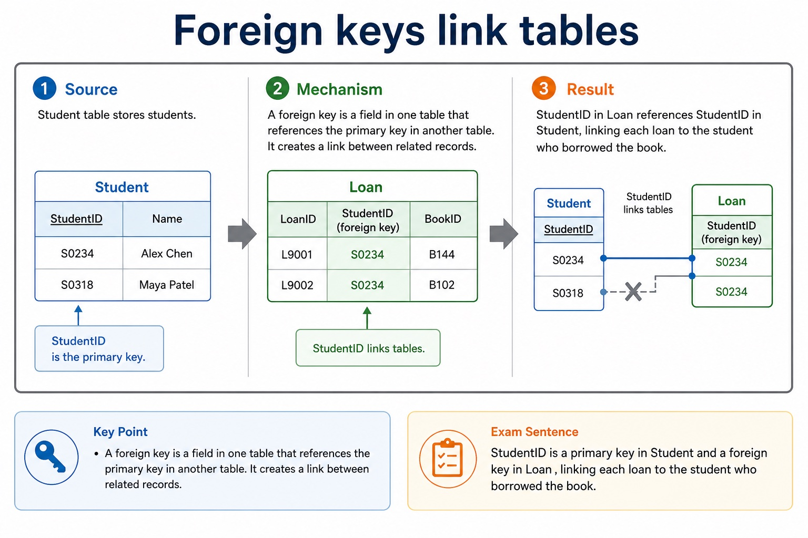
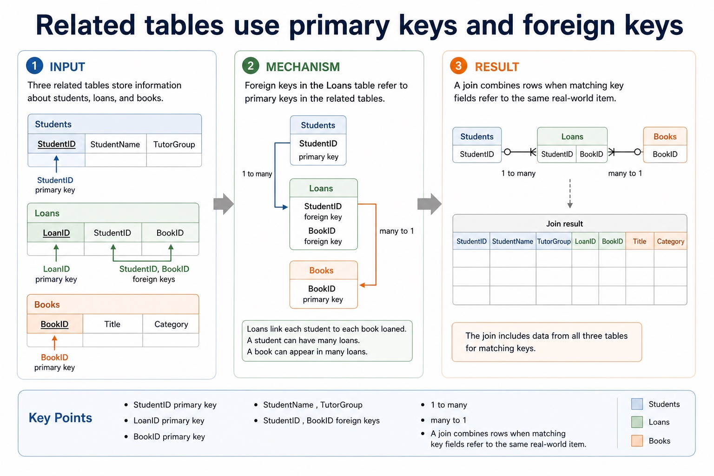
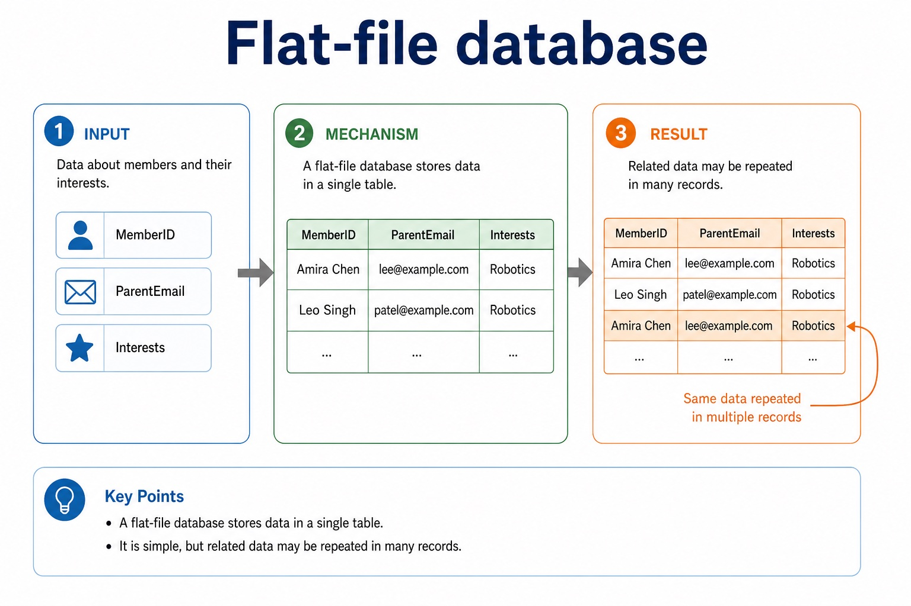
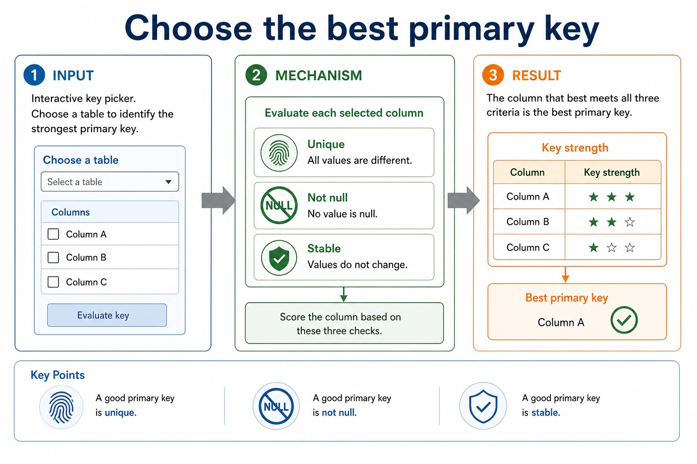
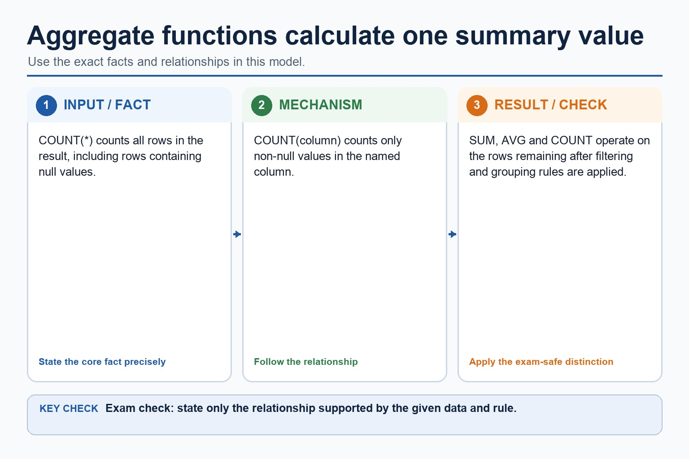
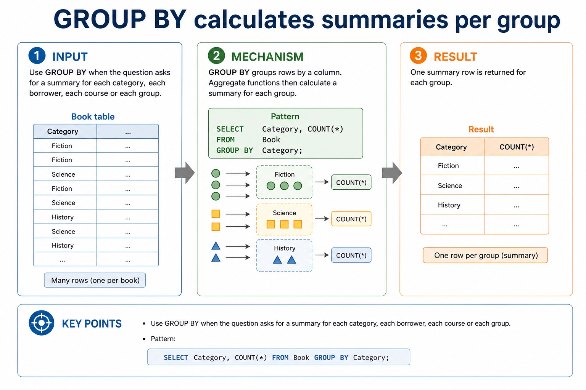
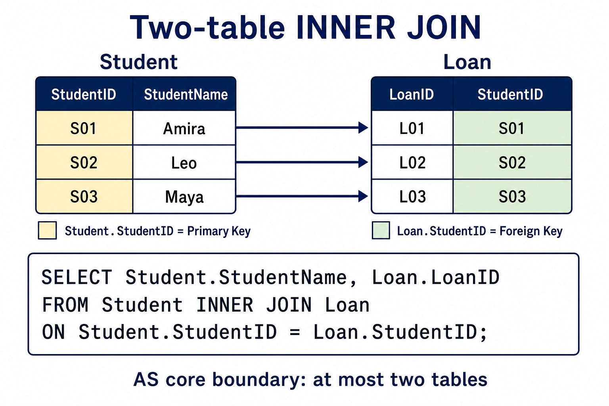
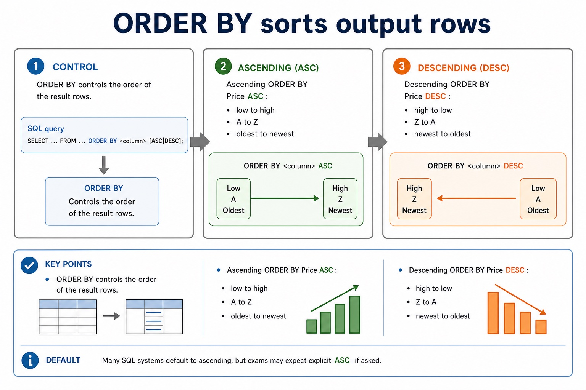

# Lesson 044: Creating and maintaining database data

**Course:** Cambridge International AS Level Computer Science 9618, 2027-2029 Version 2 
**Paper:** Paper 1 
**Syllabus:** Section 8: Databases 
**Syllabus requirements:** S8.09, S8.11 
**Pacing:** Flexible. Select the material set and practice depth needed by the learner.

## Teaching-depth menu

- **Quick route:** Use the diagnostic, learning objectives, first worked example and foundation question. Stop once the learner can explain the central distinction accurately.
- **Full route:** Use every knowledge-point material set, the worked method, the terminology check and all questions.
- **Deep route:** Add the prerequisite refresher, ask learners to connect the concept checklist, discuss the labelled extension and complete a transfer question without a model answer.

## 1. Prerequisite knowledge and quick diagnostic

Recall S8.08 before starting this lesson.

Ask the learner to give one accurate definition or method step before continuing. If they cannot, briefly revisit the named prerequisite rather than repeating the whole previous lesson.

### Optional prerequisite refresher

- Version 2 explicitly requires understanding a given SQL statement. Evidence must show what a statement does to its result or stored data, not only recognise isolated keywords.
- Understand a given SQL statement and explain the semantics of its clauses, identifiers, operators and values.

## 2. Knowledge explanation

### 1. DDL · DATABASE · TABLE · CHARACTER (S8.09)

**Concept map:** DDL → DATABASE → TABLE → CHARACTER → VARCHAR → BOOLEAN → INTEGER → REAL → DATE → TIME → ALTER → primary → foreign → REFERENCES

**Three-part explanation:**

1. Version 2 requires CREATE DATABASE, CREATE TABLE, ALTER TABLE, CHARACTER, VARCHAR(n), BOOLEAN, INTEGER, REAL, DATE, TIME, PRIMARY KEY(field) and FOREIGN KEY(field) REFERENCES Table(Field)
2. Field types include CHARACTER, VARCHAR, BOOLEAN, INTEGER, REAL, DATE and TIME
3. Student uses INTEGER for StudentID, VARCHAR for Name, DATE for DateOfBirth, BOOLEAN for Active and a DepartmentID foreign key REFERENCES Department(DepartmentID)

**Concrete cue:** Version 2 requires CREATE DATABASE, CREATE TABLE, ALTER TABLE, CHARACTER, VARCHAR(n), BOOLEAN, INTEGER, REAL, DATE, TIME, PRIMARY KEY(field) and FOREIGN KEY(field) REFERENCES Table(Field). Each named item remains core.

#### Designing fields properly

Text transcript

- Each field should have a name, data type, possible field size and constraints. Good design reduces invalid data at entry.
- Field name Clear and specific: DateOfBirth , not date .
- Data type Controls the kind of data: text, integer, real, date/time, Boolean.
- Field size Maximum storage length where relevant, such as 8 characters for StudentID.
- Constraint A rule that a value must satisfy before it is accepted.

#### Foreign keys link tables

Text transcript

- A foreign key is a field in one table that references the primary key in another table. It creates a link between related records.
- StudentID \| Name
- S0234 \| Alex Chen
- S0318 \| Maya Patel
- StudentID links tables
- LoanID \| StudentID \| BookID
- L9001 \| S0234 \| B144
- L9002 \| S0234 \| B102

#### Related tables use primary keys and foreign keys

Text transcript

- A join combines rows when matching key fields refer to the same real-world item.
- StudentID primary key
- StudentName , TutorGroup
- 1 to many
- StudentID
- LoanID primary key
- StudentID , BookID foreign keys
- many to 1

#### Flat-file database

Text transcript

- A flat-file database stores data in a single table. It is simple, but related data may be repeated in many records.
- MemberID
- ParentEmail
- Amira Chen
- lee@example.com
- Robotics
- Leo Singh
- patel@example.com

#### Relational design: what earns marks?

Text transcript

- Design review
- Primary key Uniquely identifies a record in one table. It must be unique and reliable.
- Foreign key Stores a value that matches a primary key in another table, creating a relationship.
- Normalisation Separates repeated data into related tables to reduce duplication and update errors.

#### Choose the best primary key

Text transcript

- Interactive key picker
- Choose a table to identify the strongest primary key.
- A good primary key is unique, not null and stable.

Precise syllabus wording

Use DDL: CREATE DATABASE, CREATE TABLE with CHARACTER/VARCHAR/BOOLEAN/INTEGER/REAL/DATE/TIME, ALTER TABLE, primary and foreign keys.

Version 2 requires CREATE DATABASE, CREATE TABLE, ALTER TABLE, CHARACTER, VARCHAR(n), BOOLEAN, INTEGER, REAL, DATE, TIME, PRIMARY KEY(field) and FOREIGN KEY(field) REFERENCES Table(Field). Each named item remains core.

### 2. INSERT · DELETE · UPDATE (S8.11)

**Concept map:** INSERT → DELETE → UPDATE

**Three-part explanation:**

1. Evidence must distinguish adding, removing and changing records and use WHERE when only selected records should be affected
2. Version 2 names INSERT INTO, DELETE FROM and UPDATE as required data-maintenance statements
3. INSERT adds a new row, DELETE removes matching rows, and UPDATE changes values in matching rows

**Concrete cue:** Version 2 names INSERT INTO, DELETE FROM and UPDATE as required data-maintenance statements. Evidence must distinguish adding, removing and changing records and use WHERE when only selected records should be…

#### INSERT, UPDATE and DELETE are data manipulation commands

Text transcript

- They change stored data. In exam answers, be precise about command keywords and affected records.
- INSERT Adds a new record to a table.
- UPDATE Changes values in existing records.
- DELETE Removes existing records from a table.

#### INSERT INTO adds a record

Text transcript

- List the fields, then list matching values in the same order. Text values use quotes.
- Pattern:
- INSERT INTO Student (StudentID, StudentName, TutorGroup) VALUES ('S04', 'Nina', '12C');

#### DELETE FROM removes records

Text transcript

- Use DELETE only when the whole record should be removed. A missing condition can remove all records.
- Pattern:
- DELETE FROM Student WHERE StudentID = 'S03';
- Exam caution: DELETE FROM Student; has no WHERE , so it targets every record in the table.

Precise syllabus wording

Use INSERT, DELETE and UPDATE to maintain data.

Version 2 names INSERT INTO, DELETE FROM and UPDATE as required data-maintenance statements. Evidence must distinguish adding, removing and changing records and use WHERE when only selected records should be affected.

### Supporting diagram library

#### Aggregate functions calculate one summary value

Text transcript

- COUNT() counts all rows in the result, including rows containing null values.
- COUNT(column) counts only non-null values in the named column.
- SUM, AVG and COUNT operate on the rows remaining after filtering and grouping rules are applied.

#### GROUP BY calculates summaries per group

Text transcript

- Use GROUP BY when the question asks for a summary for each category, each borrower, each course or each group.
- Pattern:
- SELECT Category, COUNT() FROM Book GROUP BY Category;

#### Two-table INNER JOIN with ON

Text transcript

- AS DML questions use at most two tables.
- SELECT Student.StudentName FROM Student INNER JOIN Loan ON Student.StudentID = Loan.StudentID uses an explicit two-table join.
- ON states the matching key relationship between the tables.
- WHERE adds a separate row filter after the join; it does not replace the required INNER JOIN syntax.

#### ORDER BY sorts output rows

Text transcript

- ORDER BY controls the order of the result rows. ASC means ascending; DESC means descending.
- Ascending ORDER BY Price ASC : low to high, A to Z, oldest to newest.
- Descending ORDER BY Price DESC : high to low, Z to A, newest to oldest.
- Default Many SQL systems default to ascending, but exams may expect explicit ASC if asked.

#### UPDATE changes existing records

Text transcript

- SET names the field and new value. WHERE restricts which rows are changed.
- Pattern:
- UPDATE Student SET TutorGroup = '12C' WHERE StudentID = 'S01';
- Table UPDATE Student chooses the table.
- New value SET TutorGroup = '12C' changes the field.
- Target rows WHERE StudentID = 'S01' prevents changing every student.

#### Section 8 knowledge map

Text transcript

- Retrieval map
- Data and DBMS data vs information; DBMS roles; avoiding flat-file limitations
- Tables and keys records, fields, data types, constraints, primary keys and foreign keys
- Design entity-relationship modelling and normalisation to reduce duplication
- SQL retrieval SELECT , FROM , WHERE , ORDER BY , aggregates and joins
- SQL modification INSERT , UPDATE , DELETE , field/value matching and safe WHERE
- Protection validation, verification, security controls, backups and restore testing

#### Do not swap the security vocabulary

Text transcript

- Protection review
- Validation Checks data follows rules, such as range, type, format or presence.
- Verification Checks entered data matches a source, using proofreading or double entry.
- Security and backup Security restricts access; backup enables recovery after loss or corruption.

#### SQL clauses: choose the clause that matches the request

Text transcript

- For the clauses shown, written syntax order is SELECT, FROM, WHERE, GROUP BY, ORDER BY.
- A simplified logical processing order is FROM, WHERE, GROUP BY, SELECT, ORDER BY.
- GROUP BY forms groups and ORDER BY sorts the final rows.
- Written syntax order and logical processing order are different.

#### Trace one mixed SQL result

Text transcript

- Interactive SQL tracer
- Category
- Networks
- Computing
- Literature
- Databases
- Choose a query to see the result.

Open precise terminology and exam facts

- Version 2 requires CREATE DATABASE, CREATE TABLE, ALTER TABLE, CHARACTER, VARCHAR(n), BOOLEAN, INTEGER, REAL, DATE, TIME, PRIMARY KEY(field) and FOREIGN KEY(field) REFERENCES Table(Field). Each named item remains core.
- Version 2 names INSERT INTO, DELETE FROM and UPDATE as required data-maintenance statements. Evidence must distinguish adding, removing and changing records and use WHERE when only selected records should be affected.
- Required DDL includes CREATE DATABASE, CREATE TABLE and ALTER TABLE. Field types include CHARACTER, VARCHAR, BOOLEAN, INTEGER, REAL, DATE and TIME.
- A PRIMARY KEY uniquely identifies a row. A FOREIGN KEY with REFERENCES links a field to a key in another table and supports referential integrity.
- AS DML questions use at most two tables. Write an explicit INNER JOIN between those tables and place the matching key condition after ON; use table-qualified field names where the same field name could be ambiguous.
- For Student(StudentID, StudentName) and Loan(StudentID, DueDate), SELECT Student.StudentName FROM Student INNER JOIN Loan ON Student.StudentID = Loan.StudentID returns names only where matching rows exist. Add WHERE for a further row condition, not for the join relationship itself.
- A query uses SELECT fields FROM a table, may filter rows with WHERE, sort with ORDER BY and form aggregate groups with GROUP BY. SUM totals values, COUNT counts rows or values, and AVG calculates a mean. An INNER JOIN uses ON to match at most two tables in the required AS queries.
- INSERT adds a new row, DELETE removes matching rows, and UPDATE changes values in matching rows. These DML statements maintain stored data.
- Use a WHERE condition for DELETE and UPDATE when only specified rows should change. Check field order, value types and conditions against the supplied schema.
- Database design review: connect each file-based limitation to a relational or DBMS mechanism; use entity/table, record/tuple and field/attribute precisely; distinguish candidate, primary, secondary and foreign keys; classify one-to-one, one-to-many and many-to-many relationships; apply referential integrity and indexing; document the design with an E-R diagram; and explain or produce 1NF, 2NF and 3NF designs.
- DBMS and SQL review: identify data management/data dictionary, data modelling, logical schema, integrity, security/backup/access rights, developer interface and query processor. Distinguish DDL structure commands from DML query/maintenance commands, use every required data type and key clause, and keep SELECT queries to at most two tables with explicit INNER JOIN ... ON when two tables are needed.
- A complete answer follows the scenario through design, statement and result. It does not claim that a primary key prevents every duplicate fact, that a secondary key must be unique, that normalisation guarantees correctness, or that a three-table/comma-style query is within the AS core boundary.

### Worked example

1. Define two related tables
2. List overdue borrowers
3. CREATE DATABASE College; then CREATE TABLE Department and CREATE TABLE Student.
4. Student uses INTEGER for StudentID, VARCHAR for Name, DATE for DateOfBirth, BOOLEAN for Active and a DepartmentID foreign key REFERENCES Department(DepartmentID).
5. ALTER TABLE can modify the structure later.
6. SELECT Student.StudentName FROM Student INNER JOIN Loan ON Student.StudentID = Loan.StudentID WHERE Loan.DueDate < '2027-05-01'; uses two tables, one explicit join condition and one separate filter.

Beyond syllabus / 延伸知识（不要求背诵）: production databases also manage transactions and concurrent users; these ideas extend the syllabus model of integrity and access control.
## 3. Practice by question type

### Question 1 - foundation - write - 8 marks

Write DDL to create a Student table with suitable data types, a primary key and one foreign key. Write an INNER JOIN query listing DepartmentName and EmployeeName from Department and Employee, matching their DepartmentID fields.

**Answer:** CREATE TABLE and named fields; suitable required data types; PRIMARY KEY; FOREIGN KEY with REFERENCES; SELECT includes DepartmentName and EmployeeName; FROM Department; INNER JOIN Employee; ON Department.DepartmentID = Employee.DepartmentID

**Marking guidance:** Do not award DML statements for a schema-definition task. Do not use a three-table query or replace the required INNER JOIN with comma-style FROM and a WHERE join.

**Common error:** For the command word write, perform that exact action; do not replace it with an unrelated fact.

### Question 2 - application - explain - 2 marks

How many tables are required at most in the AS syllabus query?

**Answer:** Two.

**Marking guidance:** Award one mark for each distinct, technically accurate point or method step.

**Common error:** Do not repeat the same point in different words; each mark needs a separate idea or method step.

### Question 3 - transfer - explain - 2 marks

Why qualify Student.StudentID and Loan.StudentID?

**Answer:** To identify which table supplies each otherwise identical field name.

**Marking guidance:** Award one mark for each distinct, technically accurate point or method step.

**Common error:** Do not copy the worked example unchanged; transfer the method and check it against the new context.

### Related past-paper indexes

| Reference | Marks | Command word | Question type |
|---|---:|---|---|
| 9618/11/S/25 Q5(e) | 4 | complete | recall |
| 9618/12/S/25 Q5(i) | 4 | design | recall |
| 9618/12/W/25 Q4(c) | 4 | describe | explain |
| 9618/13/S/25 Q6(a) | 4 | complete | recall |

These are indexes only. Cambridge question and mark-scheme wording is not reproduced.

## 4. Summary and exam reminders

### Summary

- Define creating and maintaining database data with the exact technical vocabulary expected by the syllabus.
- Use the lesson method on a fresh context and show the intermediate decision, representation or calculation.
- Match the shape of the answer to the command word and the available marks.
- Check the final answer against the scenario instead of repeating a memorised sentence.

### Common error to correct

Students often select every field with . Correction: exam questions usually specify exactly which fields are required.

### Exam technique

- Follow the command word: state gives a fact; explain links a cause to a consequence; compare covers both sides.
- Match the number of independent points or method steps to the available marks.
- For creating and maintaining database data, use the exact technical term before applying it to the scenario.
