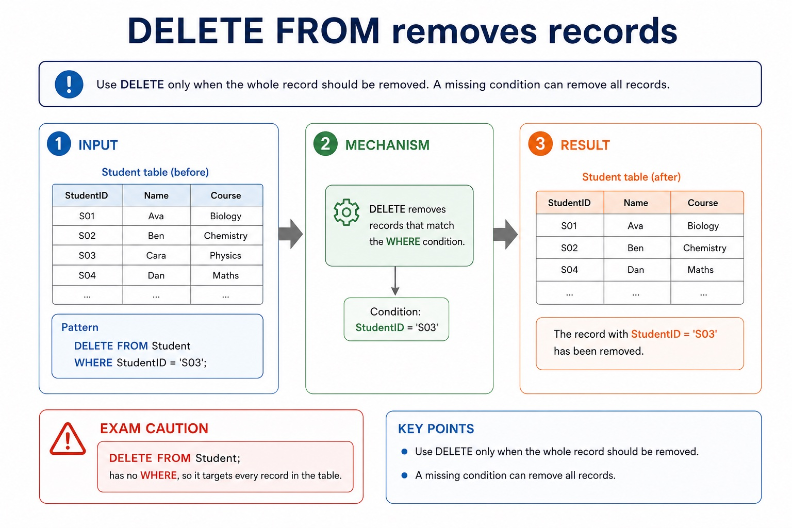
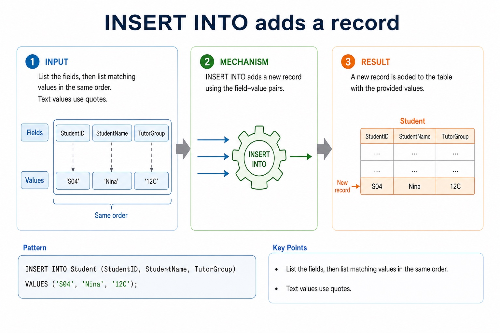
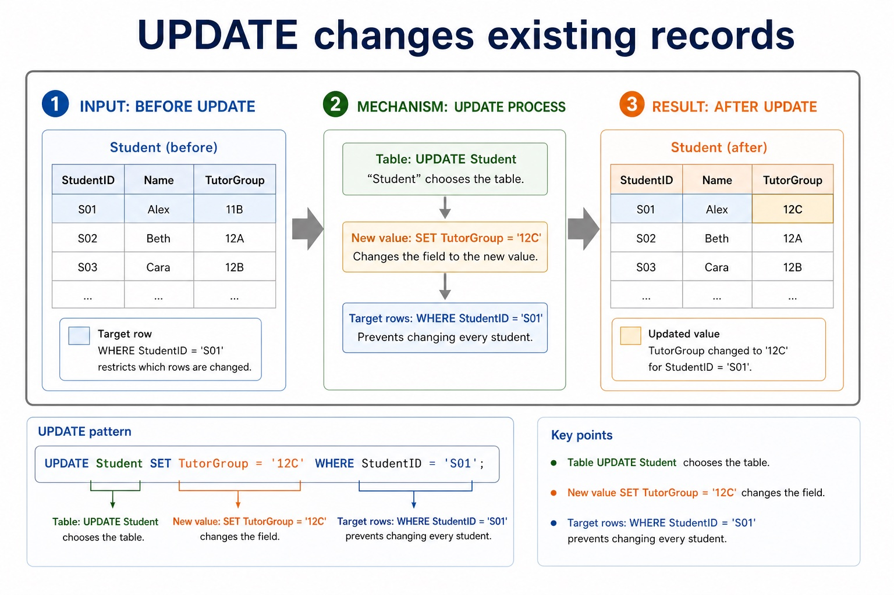

# Lesson 044: Creating and maintaining database data

**Course:** Cambridge International AS Level Computer Science 9618, syllabus for examination in 2027-2029 
**Paper:** Paper 1 
**Syllabus:** Section 8: Databases 
**Syllabus requirements:** S8.09, S8.11 
**Pacing:** Flexible. Select a quick, full or deep route for the learners in front of you.

## Teaching-depth menu

- **Quick route:** Use the diagnostic, learning objectives, first worked example and foundation question. Stop once the learner can explain the central distinction accurately.
- **Full route:** Teach every knowledge-point material set, the worked method and all lesson questions.
- **Deep route:** Add the prerequisite refresher, ask learners to connect the concept checklist, discuss the labelled extension and complete a transfer question without a model answer.

## 1. Prerequisite knowledge and quick diagnostic

Recall S8.08 before starting this lesson.

Ask the learner to give one accurate definition or method step before continuing. If they cannot, briefly revisit the named prerequisite rather than repeating the whole previous lesson.

### Optional prerequisite refresher

- The syllabus explicitly requires understanding a given SQL statement. Evidence must show what a statement does to its result or stored data, not only recognise isolated keywords.
- Understand a given SQL statement and explain the semantics of its clauses, identifiers, operators and values.

## 2. Knowledge explanation

### 1. DDL: CREATE DATABASE, CREATE TABLE with CHARACTER/VARCHAR/BOOLEAN/INTEGER/REAL/DATE/TIME, ALTER TABLE, primary and foreign keys (S8.09)

**Atomic learning targets**

- **S8.09.A01:** DDL
- **S8.09.A02:** DATABASE
- **S8.09.A03:** TABLE
- **S8.09.A04:** CHARACTER
- **S8.09.A05:** VARCHAR
- **S8.09.A06:** BOOLEAN
- **S8.09.A07:** INTEGER
- **S8.09.A08:** REAL
- **S8.09.A09:** DATE
- **S8.09.A10:** TIME
- **S8.09.A11:** ALTER
- **S8.09.A12:** primary
- **S8.09.A13:** foreign
- **S8.09.A14:** REFERENCES

**Core explanation**

- Required DDL includes CREATE DATABASE, CREATE TABLE and ALTER TABLE. Field types include CHARACTER, VARCHAR, BOOLEAN, INTEGER, REAL, DATE and TIME.
- Database design review: connect each file-based limitation to a relational or DBMS mechanism; use entity/table, record/tuple and field/attribute precisely; distinguish candidate, primary, secondary and foreign keys; classify one-to-one, one-to-many and many-to-many relationships; apply referential integrity and indexing; document the design with an E-R diagram; and explain or produce 1NF, 2NF and 3NF designs.
- A PRIMARY KEY uniquely identifies a row. A FOREIGN KEY with REFERENCES links a field to a key in another table and supports referential integrity.
- A query uses SELECT fields FROM a table, may filter rows with WHERE, sort with ORDER BY and form aggregate groups with GROUP BY. SUM totals values, COUNT counts rows or values, and AVG calculates a mean. An INNER JOIN uses ON to match at most two tables in the required AS queries.
- AS DML questions use at most two tables. Write an explicit INNER JOIN between those tables and place the matching key condition after ON; use table-qualified field names where the same field name could be ambiguous.
- A complete answer follows the scenario through design, statement and result. It does not claim that a primary key prevents every duplicate fact, that a secondary key must be unique, that normalisation guarantees correctness, or that a three-table/comma-style query is within the AS core boundary.

**Mechanism or method**

1. **Set up the required data and conditions** — Required DDL includes CREATE DATABASE, CREATE TABLE and ALTER TABLE.
2. **Carry out the complete method** — Field types include CHARACTER, VARCHAR, BOOLEAN, INTEGER, REAL, DATE and TIME.
3. **Trace or test the result** — Database design review: connect each file-based limitation to a relational or DBMS mechanism;

#### Worked example: DDL: CREATE DATABASE, CREATE TABLE with CHARACTER/VARCHAR/BOOLEAN/INTEGER/REAL/DATE/TIME, ALTER TABLE, primary and foreign keys: complete worked route

1. **Set up the required data and conditions**

Required DDL includes CREATE DATABASE, CREATE TABLE and ALTER TABLE.

2. **Carry out the complete method**

Field types include CHARACTER, VARCHAR, BOOLEAN, INTEGER, REAL, DATE and TIME.

3. **Trace or test the result**

Database design review: connect each file-based limitation to a relational or DBMS mechanism;

4. **Complete example**

Define two related tables / List overdue borrowers: CREATE DATABASE College; then CREATE TABLE Department and CREATE TABLE Student. Student uses INTEGER for StudentID, VARCHAR for Name, DATE for DateOfBirth, BOOLEAN for Active and a DepartmentID foreign key REFERENCES Department(DepartmentID). ALTER TABLE can modify the structure later. SELECT Student.StudentName FROM Student INNER JOIN Loan ON Student.StudentID = Loan.StudentID WHERE Loan.DueDate < '2027-05-01'; uses two tables, one explicit join condition and one separate filter.

**Misconceptions to correct**

- Students often select every field with *. Correction: exam questions usually specify exactly which fields are required.

#### Mastery check (MC-L044-S8.09)

Complete a fresh example that demonstrates every target: DDL; DATABASE; TABLE; CHARACTER; VARCHAR; BOOLEAN; INTEGER; REAL; DATE; TIME; ALTER; primary; foreign; REFERENCES. Show all intermediate steps and check the result.

Answer criteria

- Required DDL includes CREATE DATABASE, CREATE TABLE and ALTER TABLE. Field types include CHARACTER, VARCHAR, BOOLEAN, INTEGER, REAL, DATE and TIME.
- Database design review: connect each file-based limitation to a relational or DBMS mechanism; use entity/table, record/tuple and field/attribute precisely; distinguish candidate, primary, secondary and foreign keys; classify one-to-one, one-to-many and many-to-many relationships; apply referential integrity and indexing; document the design with an E-R diagram; and explain or produce 1NF, 2NF and 3NF designs.
- A PRIMARY KEY uniquely identifies a row. A FOREIGN KEY with REFERENCES links a field to a key in another table and supports referential integrity.
- A query uses SELECT fields FROM a table, may filter rows with WHERE, sort with ORDER BY and form aggregate groups with GROUP BY. SUM totals values, COUNT counts rows or values, and AVG calculates a mean. An INNER JOIN uses ON to match at most two tables in the required AS queries.
- AS DML questions use at most two tables. Write an explicit INNER JOIN between those tables and place the matching key condition after ON; use table-qualified field names where the same field name could be ambiguous.
- A complete answer follows the scenario through design, statement and result. It does not claim that a primary key prevents every duplicate fact, that a secondary key must be unique, that normalisation guarantees correctness, or that a three-table/comma-style query is within the AS core boundary.

**Supplementary concept map**

- **DDL:** Required DDL includes CREATE DATABASE, CREATE TABLE and…
- **DATABASE:** CREATE DATABASE, CREATE TABLE, ALTER TABLE, CHARACTER, VARCHAR(n),…
- **TABLE:** CREATE DATABASE, CREATE TABLE with CHARACTER/VARCHAR/BOOLEAN/INTEGER/REAL/DATE/TIME, ALTER TABLE,…
- **CHARACTER:** Field types include CHARACTER, VARCHAR, BOOLEAN, INTEGER, REAL,…
- **VARCHAR:** A FOREIGN KEY with REFERENCES links a field…
- **BOOLEAN:** Candidate, primary, secondary and foreign keys

**Supplementary three-step recap**

1. **Identify structure and target data** — CREATE DATABASE, CREATE TABLE, ALTER TABLE, CHARACTER, VARCHAR(n), BOOLEAN, INTEGER, REAL, DATE, TIME, PRIMARY KEY(field) and FOREIGN KEY(field)…
2. **Apply the database rule** — CREATE DATABASE, CREATE TABLE with CHARACTER/VARCHAR/BOOLEAN/INTEGER/REAL/DATE/TIME, ALTER TABLE, primary and foreign keys.
3. **Check keys rows and conditions** — Field types include CHARACTER, VARCHAR, BOOLEAN, INTEGER, REAL, DATE and TIME.

**Concrete case: DDL:** CREATE DATABASE, CREATE TABLE, ALTER TABLE, CHARACTER, VARCHAR(n), BOOLEAN, INTEGER, REAL, DATE, TIME, PRIMARY KEY(field) and FOREIGN KEY(field) REFERENCES Table(Field).

Precise syllabus wording

Use DDL: CREATE DATABASE, CREATE TABLE with CHARACTER/VARCHAR/BOOLEAN/INTEGER/REAL/DATE/TIME, ALTER TABLE, primary and foreign keys.

The syllabus requires CREATE DATABASE, CREATE TABLE, ALTER TABLE, CHARACTER, VARCHAR(n), BOOLEAN, INTEGER, REAL, DATE, TIME, PRIMARY KEY(field) and FOREIGN KEY(field) REFERENCES Table(Field). Each named item remains core.

### 2. INSERT, DELETE and UPDATE to maintain data (S8.11)

**Atomic learning targets**

- **S8.11.A01:** INSERT
- **S8.11.A02:** DELETE
- **S8.11.A03:** UPDATE

**Core explanation**

- INSERT INTO adds a new row. Name the target fields when possible and supply values in the same order with types that match the table definition.
- UPDATE changes values in existing rows. SET gives the new value and WHERE selects the rows; omitting WHERE can update every row.
- DELETE FROM removes complete rows. WHERE selects which rows are deleted; use UPDATE instead when the record should remain but one field must change.
- Before executing UPDATE or DELETE, test the WHERE condition with a SELECT query or otherwise verify which rows match. The condition is part of the data-safety reasoning, not optional punctuation.

**Mechanism or method**

1. **Choose add, change or remove** — Use INSERT for a new row, UPDATE for changed field values and DELETE when selected rows must be removed.
2. **Match fields, values and conditions** — Check the table schema, field types and WHERE condition before constructing the statement.
3. **Predict the affected rows** — State which rows are added, changed or removed and check that no unintended row matches.

#### Worked example: Maintain one Student record safely

1. **Insert**

INSERT INTO Student (StudentID, StudentName, Active) VALUES (17, 'Mina', TRUE); adds one row.

2. **Update**

UPDATE Student SET Active = FALSE WHERE StudentID = 17; changes only Mina's Active field.

3. **Delete**

DELETE FROM Student WHERE StudentID = 17; removes the selected row when the record is no longer required.

4. **Risk**

Without WHERE, the UPDATE or DELETE statement could affect every row in Student.

**Misconceptions to correct**

- DELETE removes rows, not selected field values. UPDATE changes fields in rows that remain.

#### Mastery check (MC-L044-S8.11)

Complete a fresh example that demonstrates every target: INSERT; DELETE; UPDATE. Show all intermediate steps and check the result.

Answer criteria

- INSERT INTO adds a new row. Name the target fields when possible and supply values in the same order with types that match the table definition.
- UPDATE changes values in existing rows. SET gives the new value and WHERE selects the rows; omitting WHERE can update every row.
- DELETE FROM removes complete rows. WHERE selects which rows are deleted; use UPDATE instead when the record should remain but one field must change.
- Before executing UPDATE or DELETE, test the WHERE condition with a SELECT query or otherwise verify which rows match. The condition is part of the data-safety reasoning, not optional punctuation.

**Supplementary concept map**

- **INSERT:** Add a new record
- **UPDATE:** Change existing records
- **DELETE:** Remove selected records
- **WHERE:** Limit affected records
- **Safety:** Check the condition before execution

**Supplementary three-step recap**

1. **Choose add, change or remove** — Use INSERT for a new row, UPDATE for changed field values and DELETE when selected rows must be removed.
2. **Match fields, values and conditions** — Check the table schema, field types and WHERE condition before constructing the statement.
3. **Predict the affected rows** — State which rows are added, changed or removed and check that no unintended row matches.

**DELETE FROM removes records:** Use DELETE only when the whole record should be removed. A missing condition can remove all records. Pattern:

#### DELETE FROM removes records

Text transcript

- Use DELETE only when the whole record should be removed. A missing condition can remove all records.
- Pattern:
- DELETE FROM Student WHERE StudentID = 'S03';
- Exam caution: DELETE FROM Student; has no WHERE , so it targets every record in the table.

#### INSERT INTO adds a record

Text transcript

- List the fields, then list matching values in the same order. Text values use quotes.
- Pattern:
- INSERT INTO Student (StudentID, StudentName, TutorGroup) VALUES ('S04', 'Nina', '12C');

#### UPDATE changes existing records

Text transcript

- SET names the field and new value. WHERE restricts which rows are changed.
- Pattern:
- UPDATE Student SET TutorGroup = '12C' WHERE StudentID = 'S01';
- Table UPDATE Student chooses the table.
- New value SET TutorGroup = '12C' changes the field.
- Target rows WHERE StudentID = 'S01' prevents changing every student.

Precise syllabus wording

Use INSERT, DELETE and UPDATE to maintain data.

the syllabus names INSERT INTO, DELETE FROM and UPDATE as required data-maintenance statements. Evidence must distinguish adding, removing and changing records and use WHERE when only selected records should be affected.

### Lesson technical reference

- The syllabus requires CREATE DATABASE, CREATE TABLE, ALTER TABLE, CHARACTER, VARCHAR(n), BOOLEAN, INTEGER, REAL, DATE, TIME, PRIMARY KEY(field) and FOREIGN KEY(field) REFERENCES Table(Field). Each named item remains core.
- the syllabus names INSERT INTO, DELETE FROM and UPDATE as required data-maintenance statements. Evidence must distinguish adding, removing and changing records and use WHERE when only selected records should be affected.
- Required DDL includes CREATE DATABASE, CREATE TABLE and ALTER TABLE. Field types include CHARACTER, VARCHAR, BOOLEAN, INTEGER, REAL, DATE and TIME.
- A PRIMARY KEY uniquely identifies a row. A FOREIGN KEY with REFERENCES links a field to a key in another table and supports referential integrity.
- AS DML questions use at most two tables. Write an explicit INNER JOIN between those tables and place the matching key condition after ON; use table-qualified field names where the same field name could be ambiguous.
- For Student(StudentID, StudentName) and Loan(StudentID, DueDate), SELECT Student.StudentName FROM Student INNER JOIN Loan ON Student.StudentID = Loan.StudentID returns names only where matching rows exist. Add WHERE for a further row condition, not for the join relationship itself.
- A query uses SELECT fields FROM a table, may filter rows with WHERE, sort with ORDER BY and form aggregate groups with GROUP BY. SUM totals values, COUNT counts rows or values, and AVG calculates a mean. An INNER JOIN uses ON to match at most two tables in the required AS queries.
- INSERT adds a new row, DELETE removes matching rows, and UPDATE changes values in matching rows. These DML statements maintain stored data.
- Use a WHERE condition for DELETE and UPDATE when only specified rows should change. Check field order, value types and conditions against the supplied schema.
- Database design review: connect each file-based limitation to a relational or DBMS mechanism; use entity/table, record/tuple and field/attribute precisely; distinguish candidate, primary, secondary and foreign keys; classify one-to-one, one-to-many and many-to-many relationships; apply referential integrity and indexing; document the design with an E-R diagram; and explain or produce 1NF, 2NF and 3NF designs.
- DBMS and SQL review: identify data management/data dictionary, data modelling, logical schema, integrity, security/backup/access rights, developer interface and query processor. Distinguish DDL structure commands from DML query/maintenance commands, use every required data type and key clause, and keep SELECT queries to at most two tables with explicit INNER JOIN ... ON when two tables are needed.
- A complete answer follows the scenario through design, statement and result. It does not claim that a primary key prevents every duplicate fact, that a secondary key must be unique, that normalisation guarantees correctness, or that a three-table/comma-style query is within the AS core boundary.

Beyond syllabus / 延伸知识（不要求背诵）: production databases also manage transactions and concurrent users; these ideas extend the syllabus model of integrity and access control.
## 3. Practice by question type

### Question 1 - foundation - write - 8 marks

Write DDL to create a Student table with suitable data types, a primary key and one foreign key. Write an INNER JOIN query listing DepartmentName and EmployeeName from Department and Employee, matching their DepartmentID fields.

**Answer:** CREATE TABLE and named fields; suitable required data types; PRIMARY KEY; FOREIGN KEY with REFERENCES; SELECT includes DepartmentName and EmployeeName; FROM Department; INNER JOIN Employee; ON Department.DepartmentID = Employee.DepartmentID

**Marking guidance:** Do not award DML statements for a schema-definition task. Do not use a three-table query or replace the required INNER JOIN with comma-style FROM and a WHERE join.

**Common error:** For the command word write, perform that exact action; do not replace it with an unrelated fact.

### Question 2 - application - write - 6 marks

For Student(StudentID, StudentName, Active), write: (a) an INSERT statement adding StudentID 17 named Mina; (b) an UPDATE making that student's Active value FALSE; and (c) a DELETE removing only that student.

**Answer:** INSERT INTO Student (StudentID, StudentName, Active) VALUES (17, 'Mina', TRUE); UPDATE Student SET Active = FALSE WHERE StudentID = 17; DELETE FROM Student WHERE StudentID = 17;

**Marking guidance:** Award statement keyword/structure, matching fields and values, and a safe WHERE condition for UPDATE and DELETE.

**Common error:** Without WHERE, UPDATE or DELETE can affect every row.

### Question 3 - transfer - explain - 4 marks

Explain why UPDATE and DELETE normally need a checked WHERE condition, and distinguish changing a field from removing a row.

**Answer:** WHERE limits the affected rows; an unchecked or missing condition can change/delete every row; UPDATE changes selected field values while retaining the row; DELETE removes the selected row

**Marking guidance:** Require both the safety consequence and the UPDATE/DELETE distinction.

**Common error:** DELETE does not clear one field; it removes the row.

### Related past-paper indexes

| Reference | Marks | Command word | Question type |
|---|---:|---|---|
| 9618/11/S/25 Q5(e) | 4 | complete | recall |
| 9618/12/S/25 Q5(i) | 4 | design | recall |
| 9618/12/W/25 Q4(c) | 4 | describe | explain |
| 9618/13/S/25 Q6(a) | 4 | complete | recall |

These are indexes only. Cambridge question and mark-scheme wording is not reproduced.

## 4. Summary and exam reminders

### Summary

- S8.09: explain DDL, DATABASE, TABLE, CHARACTER, VARCHAR, BOOLEAN, INTEGER, REAL, DATE, TIME, ALTER, primary, foreign, REFERENCES.
- S8.09 method: Set up the required data and conditions → Carry out the complete method → Trace or test the result.
- S8.11: explain INSERT, DELETE, UPDATE.
- S8.11 method: Choose add, change or remove → Match fields, values and conditions → Predict the affected rows.
- Correction to remember: Students often select every field with *. Correction: exam questions usually specify exactly which fields are required.

### Common error to correct

Students often select every field with *. Correction: exam questions usually specify exactly which fields are required.

### Exam technique

- Follow the command word: state gives a fact; explain links a cause to a consequence; compare covers both sides.
- Match the number of independent points or method steps to the available marks.
- For creating and maintaining database data, use the exact technical term before applying it to the scenario.
