# Lesson 045: Paper 1 integrated review and error clinic

**Course:** Cambridge International AS Level Computer Science 9618, 2027-2029 Version 2 
**Paper:** Paper 1 
**Syllabus:** Paper 1 integrated review 
**Syllabus requirements:** S1.01, S1.02, S1.03, S1.04, S1.05, S1.06, S1.07, S1.08, S1.09, S1.10, S1.11, S2.01, S2.02, S2.03, S2.04, S2.05, S2.06, S2.07, S2.08, S2.09, S2.10, S2.11, S2.12, S2.13, S2.14, S2.15, S2.16, S3.01, S3.02, S3.03, S3.04, S3.05, S3.06, S3.07, S3.08, S3.09, S3.10, S4.01, S4.02, S4.03, S4.04, S4.05, S4.06, S4.07, S4.08, S4.09, S4.10, S4.11, S4.12, S4.13, S4.14, S4.15, S5.01, S5.02, S5.03, S5.04, S5.05, S5.06, S5.07, S6.01, S6.02, S6.03, S6.04, S6.05, S6.06, S6.07, S6.08, S7.01, S7.02, S7.03, S7.04, S7.05, S7.06, S8.01, S8.02, S8.03, S8.04, S8.05, S8.06, S8.07, S8.08, S8.09, S8.10, S8.11 
**Pacing:** Flexible. Select the material set and practice depth needed by the learner.

## Teaching-depth menu

- **Quick route:** Use the diagnostic, learning objectives, first worked example and foundation question. Stop once the learner can explain the central distinction accurately.
- **Full route:** Use every knowledge-point material set, the worked method, the terminology check and all questions.
- **Deep route:** Add the prerequisite refresher, ask learners to connect the concept checklist, discuss the labelled extension and complete a transfer question without a model answer.

## 1. Prerequisite knowledge and quick diagnostic

Recall S1.02, S1.04, S1.01, S1.08, S1.09, S1.10, S2.02, S2.04, S2.01, S2.15, S3.01, S3.05, S3.08, S4.01, S4.07, S4.09, S4.12, S4.13, S5.01, S5.04, S6.02, S6.05, S6.01, S7.01, S7.04, S8.01, S8.02, S8.05, S8.08 before starting this lesson.

Ask the learner to give one accurate definition or method step before continuing. If they cannot, briefly revisit the named prerequisite rather than repeating the whole previous lesson.

### Optional prerequisite refresher

- The Version 2 row requires binary, denary, hexadecimal, Binary Coded Decimal (BCD), one's complement and two's complement; BCD and complements are representations rather than additional number bases.
- Show understanding of binary, denary and hexadecimal number systems, BCD, and one's- and two's-complement representations.
- Version 2 explicitly requires both addition and subtraction using positive and negative binary integers; fixed-width representation must be retained throughout a calculation.
- Perform binary addition and subtraction using positive and negative binary integers.
- Use and distinguish kibi/kilo, mebi/mega, gibi/giga and tebi/tera; binary prefixes use powers of 1024 and decimal prefixes use powers of 1000.
- Show understanding of binary magnitudes and the difference between binary prefixes and decimal prefixes.

## 2. Knowledge explanation

### 1. Paper 1 review: representation and communication (R045.091)

**Concept map:** Paper 1 review: representation and communication

**Three-part explanation:**

1. Use the diagrams to retrieve the method, compare similar ideas and correct one typical error
2. Use one fresh scenario to apply paper 1 integrated review and error clinic, showing each decision or calculation step and checking the result against the question…
3. Construct circuits, truth tables and expressions from each of the other stated representations

**Concrete cue:** Representation review

#### Calculation formulas worth retrieving cold

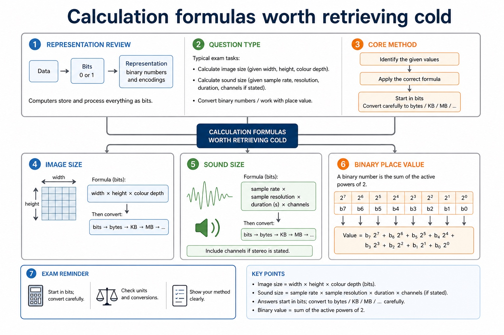

Text transcript

- Representation review
- Question type
- Core method
- Exam reminder
- Image size
- width x height x colour depth
- Answer starts in bits; convert carefully.
- Sound size

#### Explanation answers need mechanism and consequence

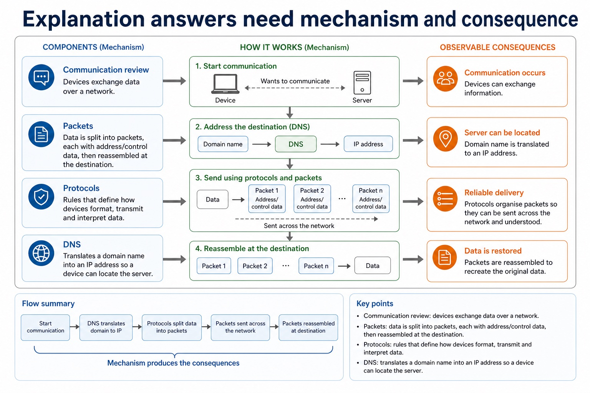

Text transcript

- Communication review
- Packets Data is split into packets, each with address/control data, then reassembled at the destination.
- Protocols Rules that define how devices format, transmit and interpret data.
- DNS Translates a domain name into an IP address so a device can locate the server.

#### Sections 1-2 knowledge map

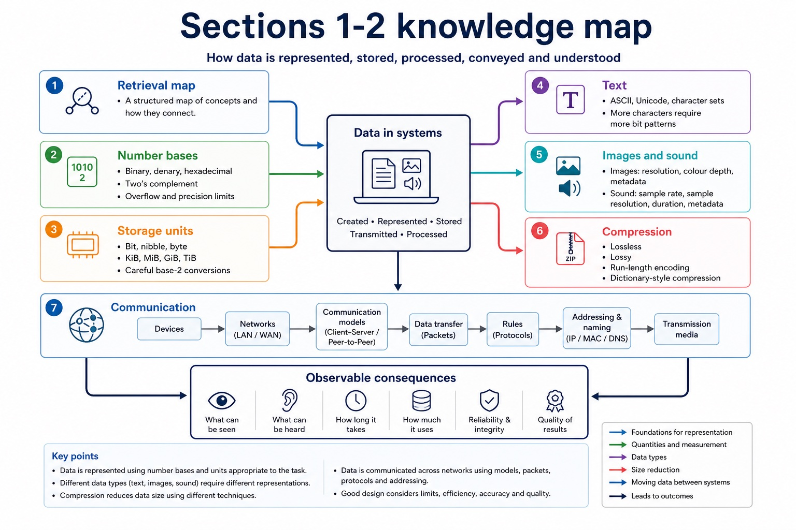

Text transcript

- Retrieval map
- Number bases binary, denary, hexadecimal, two's complement, overflow and precision limits
- Storage units bit, nibble, byte, KiB, MiB, GiB, TiB and careful base-2 conversions
- Text ASCII, Unicode, character sets and why more characters require more bit patterns
- Images and sound resolution, colour depth, sample rate, sampling resolution, duration and metadata
- Compression lossless, lossy, run-length encoding and dictionary-style compression
- Communication LAN/WAN, client-server, peer-to-peer, packets, protocols, IP/MAC/DNS and media

Precise syllabus wording

Paper 1 review: representation and communication

Use the diagrams to retrieve the method, compare similar ideas and correct one typical error.

### 2. Paper 1 review: hardware and processor fundamentals (R045.092)

**Concept map:** Paper 1 review: hardware and processor…

**Three-part explanation:**

1. Use the diagrams to retrieve the method, compare similar ideas and correct one typical error
2. Use one fresh scenario to apply paper 1 integrated review and error clinic, showing each decision or calculation step and checking the result against the question…
3. The operating system is required to provide a platform and manage memory, files, security, hardware input/output and peripherals, and processes

**Concrete cue:** Hardware review

#### Choose hardware by matching characteristics to use

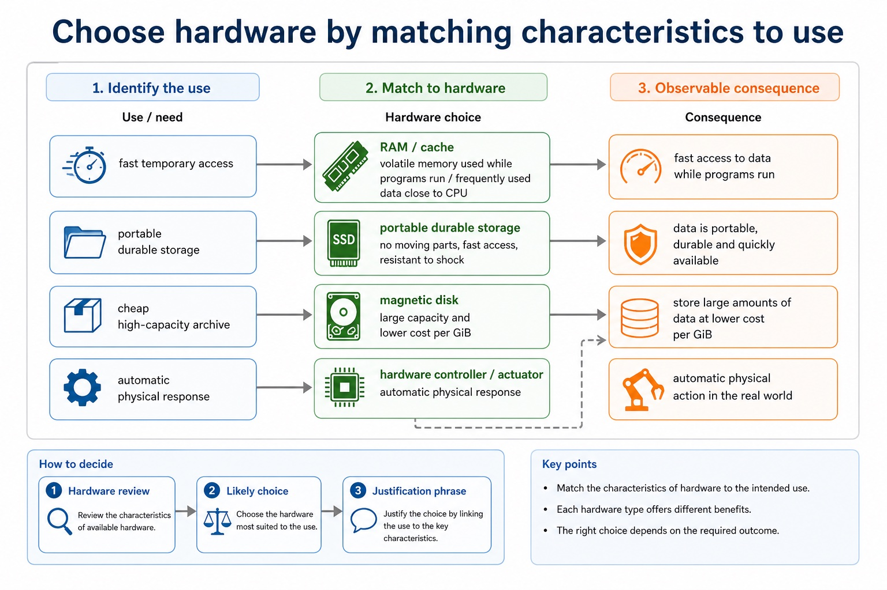

Text transcript

- Hardware review
- Likely choice
- Justification phrase
- fast temporary access
- RAM / cache
- volatile memory used while programs run / frequently used data close to CPU
- portable durable storage
- no moving parts, fast access, resistant to shock

#### How hardware facts become mechanisms

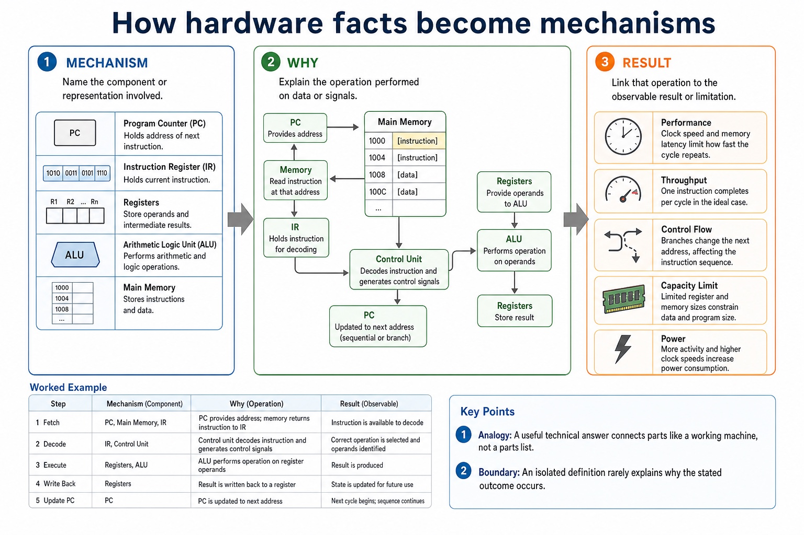

Text transcript

- Name the component or representation involved.
- Explain the operation performed on data or signals.
- Link that operation to the observable result or limitation.

#### Sections 3-4 knowledge map

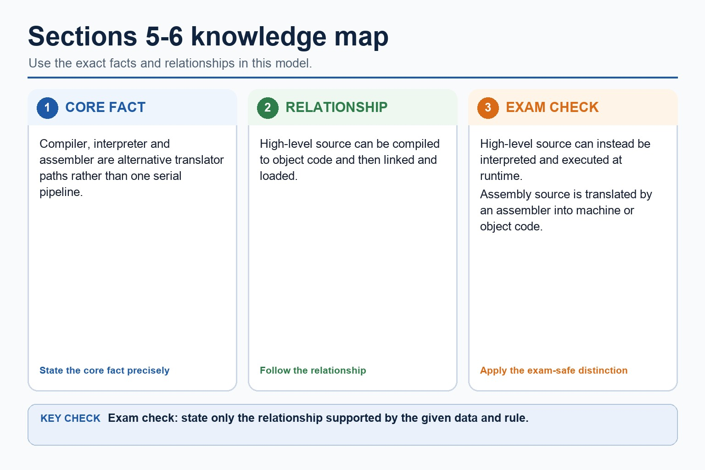

Text transcript

- Retrieval map
- Computer system input, output, storage, memory, processor and data capture
- Storage and memory RAM, ROM, cache, virtual memory, magnetic/optical/solid-state storage
- Embedded systems sensors, actuators, microcontrollers and control systems
- Logic NOT, AND, OR, NAND, NOR, XOR, truth tables and Boolean expressions
- Processor ALU, CU, registers, buses, fetch-decode-execute and addressing modes
- Performance clock speed, cores, cache, word length, pipelining and interrupts

Precise syllabus wording

Paper 1 review: hardware and processor fundamentals

Use the diagrams to retrieve the method, compare similar ideas and correct one typical error.

### 3. Paper 1 review: system software and security (R045.093)

**Concept map:** Paper 1 review: system software and…

**Three-part explanation:**

1. Use the diagrams to retrieve the method, compare similar ideas and correct one typical error
2. Use one fresh scenario to apply paper 1 integrated review and error clinic, showing each decision or calculation step and checking the result against the question…
3. Describe security measures for computer systems from a stand-alone PC to a network

**Concrete cue:** Security review

#### Match the control to the threat

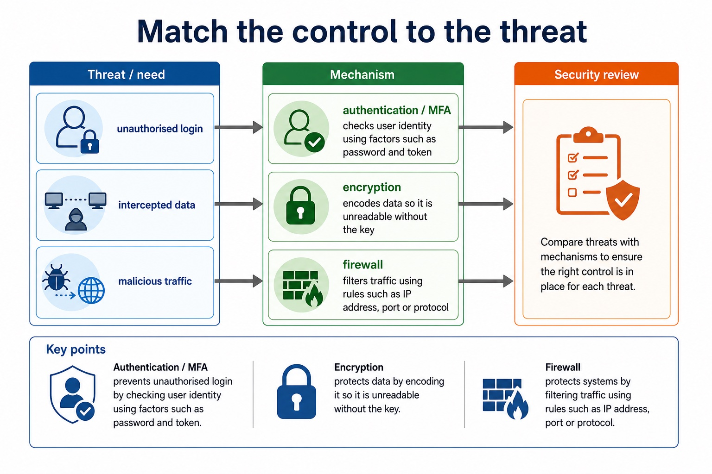

Text transcript

- Security review
- Threat / need
- Mechanism
- unauthorised login
- authentication / MFA
- checks user identity using factors such as password and token
- intercepted data
- encryption

#### OS and utility roles

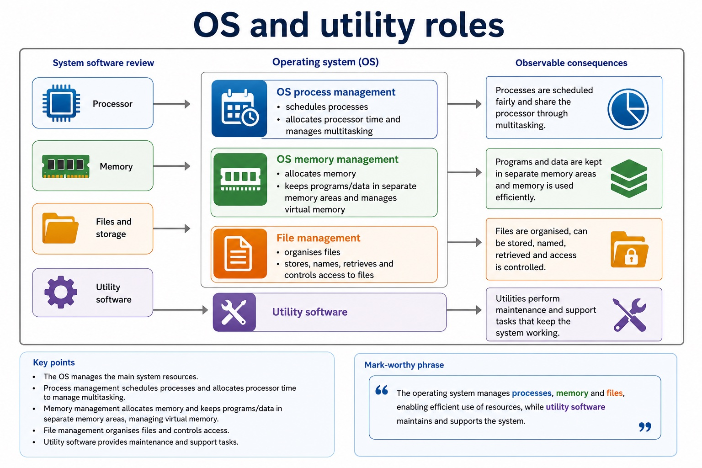

Text transcript

- System software review
- Mark-worthy phrase
- OS process management
- schedules processes
- allocates processor time and manages multitasking
- OS memory management
- allocates memory
- keeps programs/data in separate memory areas and manages virtual memory

#### Compiler, interpreter and assembler

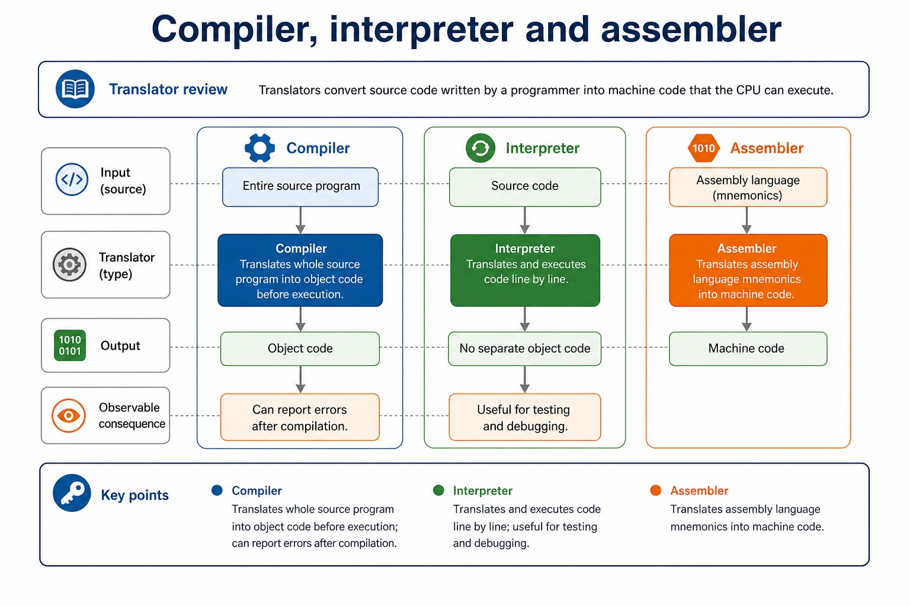

Text transcript

- Translator review
- Compiler Translates whole source program into object code before execution; can report errors after compilation.
- Interpreter Translates and executes code line by line; useful for testing and debugging.
- Assembler Translates assembly language mnemonics into machine code.

Precise syllabus wording

Paper 1 review: system software and security

Use the diagrams to retrieve the method, compare similar ideas and correct one typical error.

### 4. Paper 1 review: ethics and databases (R045.094)

**Concept map:** Paper 1 review: ethics and databases

**Three-part explanation:**

1. Use the diagrams to retrieve the method, compare similar ideas and correct one typical error
2. Use one fresh scenario to apply paper 1 integrated review and error clinic, showing each decision or calculation step and checking the result against the question…
3. Identify Paper 1 review: ethics and databases.

**Concrete cue:** Use one fresh scenario to apply paper 1 integrated review and error clinic, showing each decision or calculation step and checking the result against the question context.

#### Evaluation answers need both sides and a condition

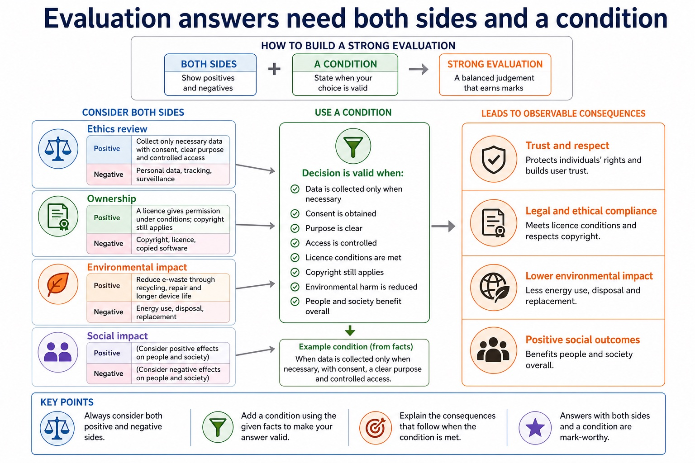

Text transcript

- Ethics review
- Question clue
- Mark-worthy phrase
- personal data, tracking, surveillance
- collect only necessary data with consent, clear purpose and controlled access
- Ownership
- copyright, licence, copied software
- a licence gives permission under conditions; copyright still applies

#### Sections 7-8 knowledge map

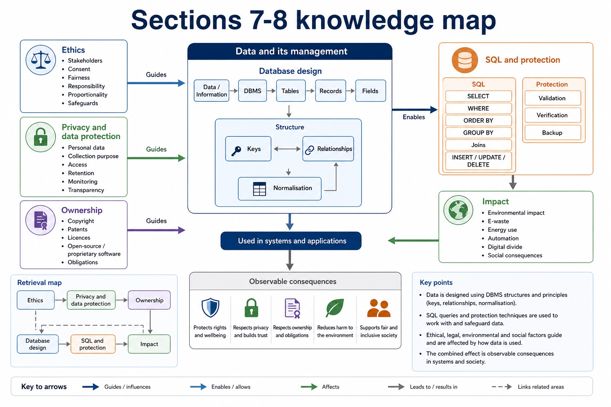

Text transcript

- Retrieval map
- Ethics stakeholders, consent, fairness, responsibility, proportionality and safeguards
- Privacy and data protection personal data, collection purpose, access, retention, monitoring and transparency
- Ownership copyright, patents, licences, open-source/proprietary software and obligations
- Impact environmental impact, e-waste, energy use, automation, digital divide and social consequences
- Database design data/information, DBMS, tables, records, fields, keys, relationships and normalisation
- SQL and protection SELECT, WHERE, ORDER BY, GROUP BY, joins, INSERT/UPDATE/DELETE, validation, verification and backup

#### Trace one customer table query

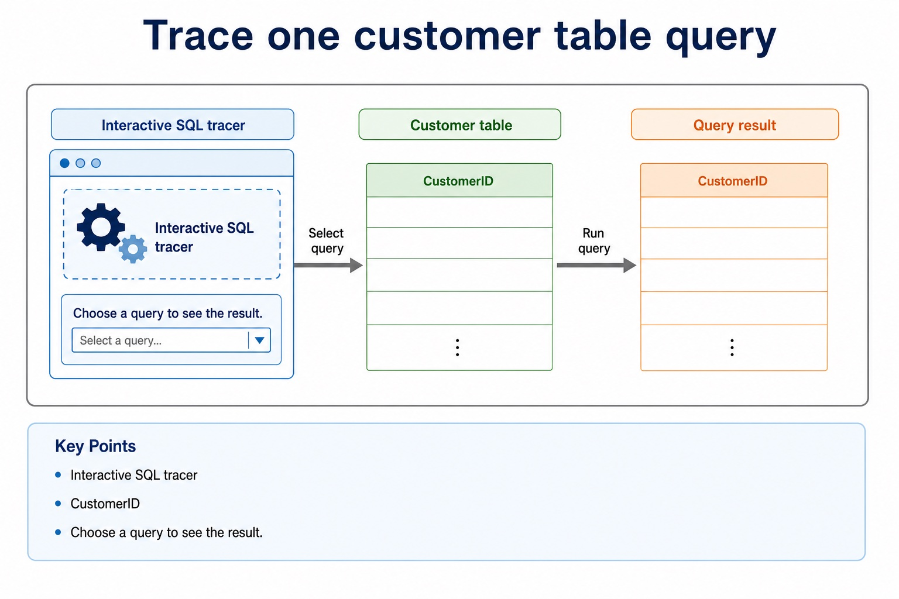

Text transcript

- Interactive SQL tracer
- CustomerID
- Choose a query to see the result.

Precise syllabus wording

Paper 1 review: ethics and databases

Use the diagrams to retrieve the method, compare similar ideas and correct one typical error.

### 5. Paper 1 mixed question strategy (R045.095)

**Concept map:** Paper 1 mixed question strategy

**Three-part explanation:**

1. Use the diagrams to retrieve the method, compare similar ideas and correct one typical error
2. Use one fresh scenario to apply paper 1 integrated review and error clinic, showing each decision or calculation step and checking the result against the question…
3. Identify Paper 1 mixed question strategy.

**Concrete cue:** Mixed question strategy

#### Paper 1 sections and question clues

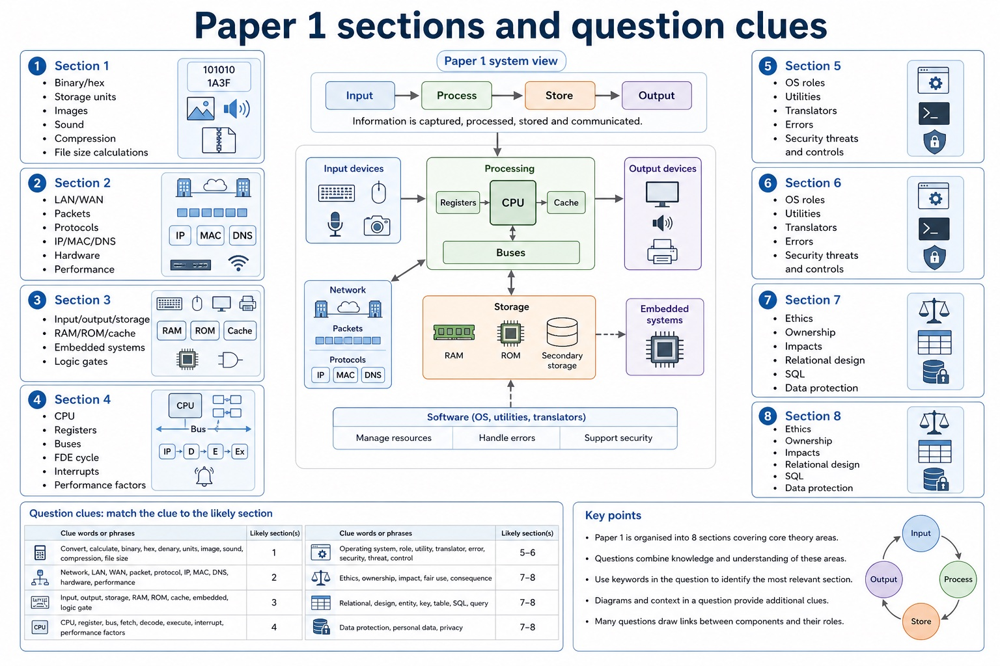

Text transcript

- Paper map
- Section 1 binary/hex, storage units, images, sound, compression, file size calculations
- Section 2 LAN/WAN, packets, protocols, IP/MAC/DNS, hardware, performance
- Section 3 input/output/storage, RAM/ROM/cache, embedded systems, logic gates
- Section 4 CPU, registers, buses, FDE cycle, interrupts, performance factors
- Sections 5-6 OS roles, utilities, translators, errors, security threats and controls
- Sections 7-8 ethics, ownership, impacts, relational design, SQL and data protection

#### The 30-second annotation routine

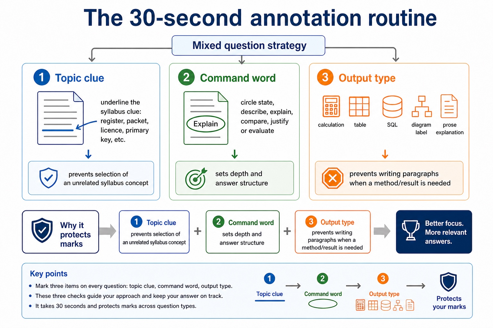

Text transcript

- Mixed question strategy
- What to mark
- Why it protects marks
- 1. Topic clue
- underline the syllabus clue: register, packet, licence, primary key, etc.
- prevents selection of an unrelated syllabus concept
- 2. Command word
- circle state, describe, explain, compare, justify or evaluate

#### What each command word usually demands

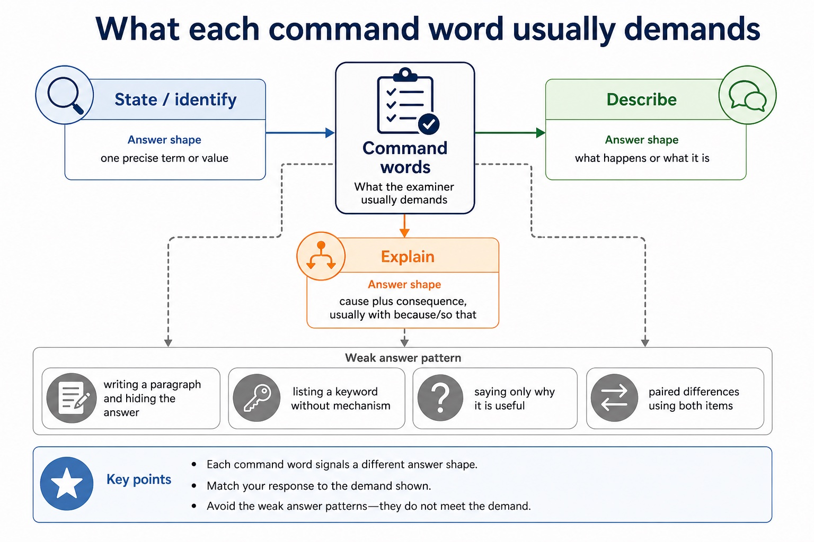

Text transcript

- Command words
- Answer shape
- Weak answer pattern
- State / identify
- one precise term or value
- writing a paragraph and hiding the answer
- Describe
- what happens or what it is

Precise syllabus wording

Paper 1 mixed question strategy

Use the diagrams to retrieve the method, compare similar ideas and correct one typical error.

### 6. Paper 1 timed short-answer practice (R045.096)

**Concept map:** Paper 1 timed short-answer practice

**Three-part explanation:**

1. Use the diagrams to retrieve the method, compare similar ideas and correct one typical error
2. Use one fresh scenario to apply paper 1 integrated review and error clinic, showing each decision or calculation step and checking the result against the question…
3. a scenario answer must justify permissions, restrictions, cost or support rather than choose by label alone

**Concrete cue:** Short-answer craft

#### Run a timed short-answer sprint

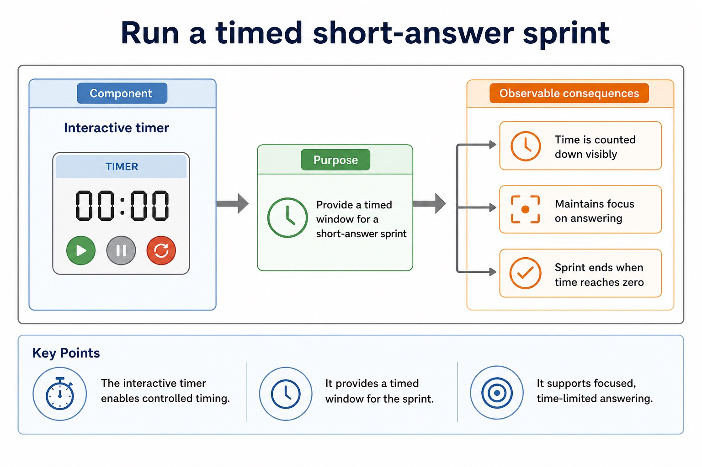

Text transcript

- Interactive timer

#### Compress the answer, not the marks

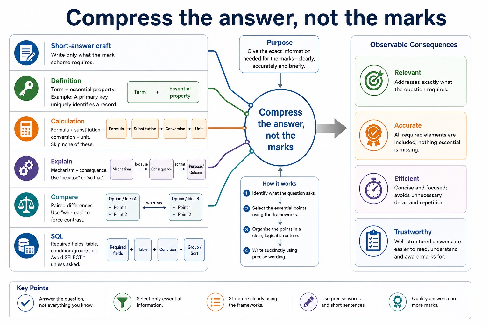

Text transcript

- Short-answer craft
- Definition Term + essential property. Example: A primary key uniquely identifies a record.
- Calculation Formula + substitution + conversion + unit. Skip none of these.
- Explain Mechanism + consequence. Use "because" or "so that".
- Compare Paired differences. Use "whereas" to force contrast.
- SQL Required fields, table, condition/group/sort. Avoid SELECT unless asked.
- Evaluate Benefit, concern, safeguard, judgement. Keep each point short.

#### A practical mark-per-minute model

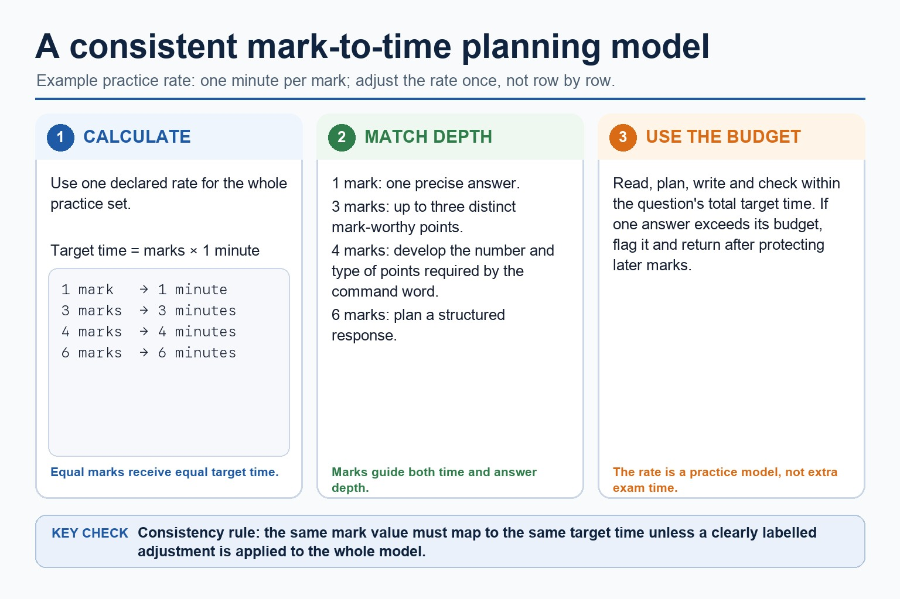

Text transcript

- Use one declared mark-to-time rate consistently across the practice set.
- The example planning rate is one minute per mark, so equal marks receive equal time.
- Reading, planning, writing and checking all fit inside the question's total target time.
- Marks guide both the time budget and the required answer depth.

Precise syllabus wording

Paper 1 timed short-answer practice

Use the diagrams to retrieve the method, compare similar ideas and correct one typical error.

### 7. Paper 1 extended-response practice (R045.097)

**Concept map:** Paper 1 extended-response practice

**Three-part explanation:**

1. Use the diagrams to retrieve the method, compare similar ideas and correct one typical error
2. Use one fresh scenario to apply paper 1 integrated review and error clinic, showing each decision or calculation step and checking the result against the question…
3. Identify Paper 1 extended-response practice.

**Concrete cue:** Use one fresh scenario to apply paper 1 integrated review and error clinic, showing each decision or calculation step and checking the result against the question context.

#### Extended-response topics across Paper 1

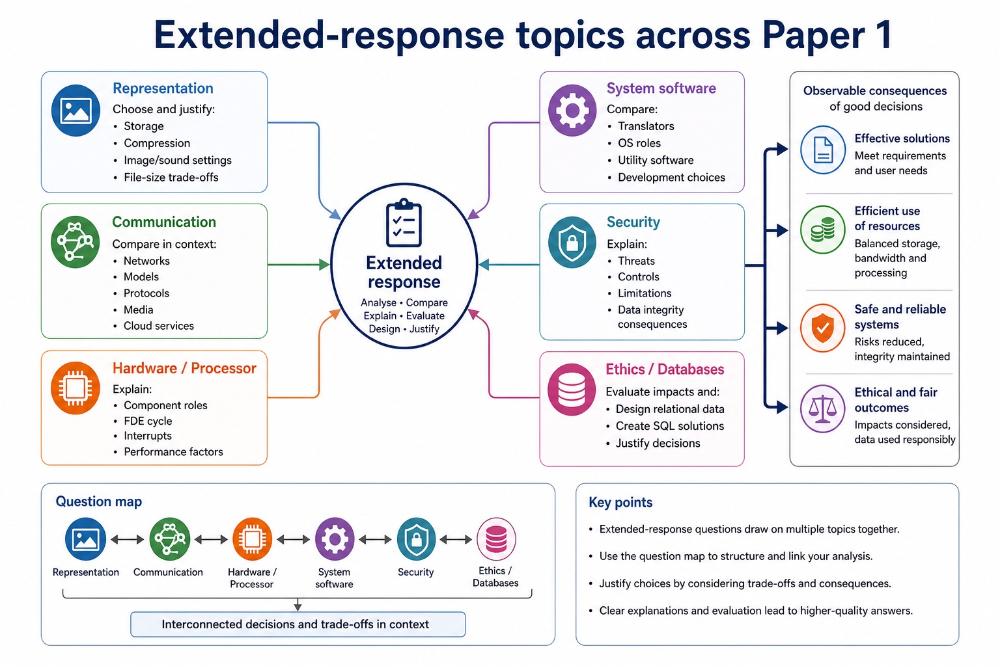

Text transcript

- Question map
- Representation choice justify storage, compression, image/sound settings and file-size trade-offs
- Communication compare networks, models, protocols, media and cloud services in context
- Hardware/processor explain component roles, FDE cycle, interrupts and performance factors
- System software compare translators, OS roles, utility software and development choices
- Security explain threats, controls, limitations and data integrity consequences
- Ethics/databases evaluate impacts and design relational data/SQL solutions with justification

#### Three reliable extended-response shapes

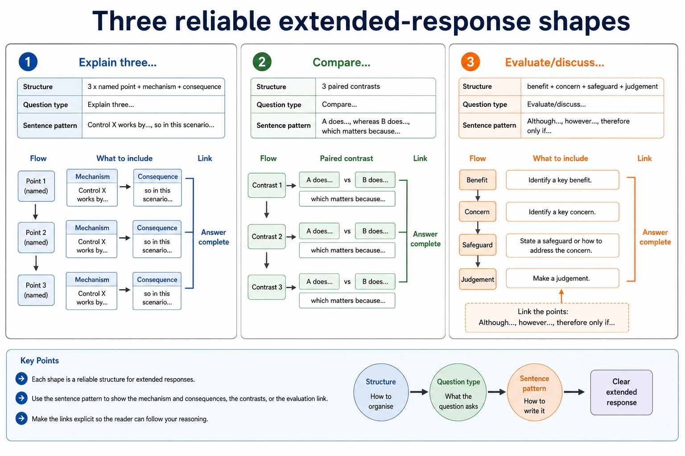

Text transcript

- Structure
- Question type
- Sentence pattern
- Explain three...
- 3 x named point + mechanism + consequence
- Control X works by..., so in this scenario...
- Compare...
- 3 paired contrasts

#### How extended marks usually appear

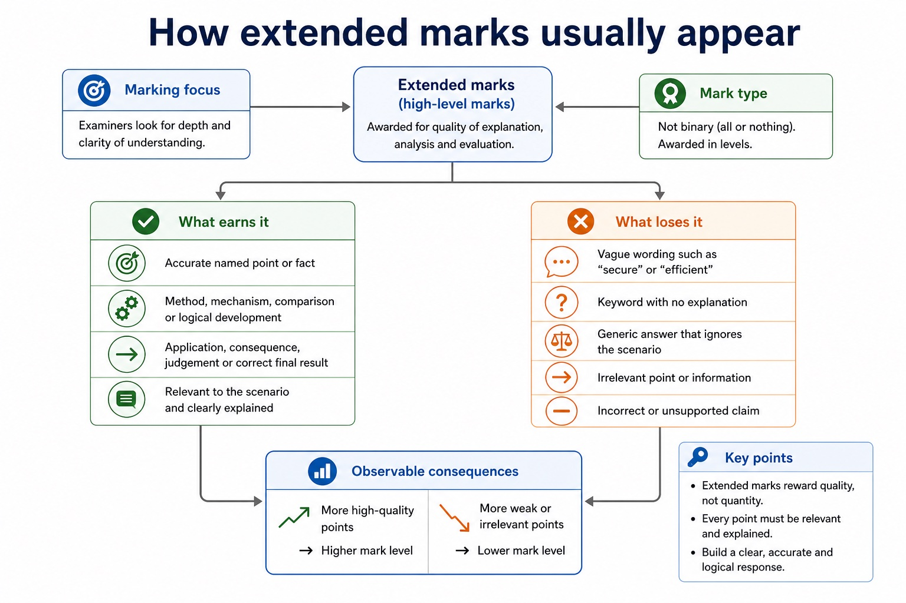

Text transcript

- Marking focus
- Mark type
- What earns it
- What loses it
- accurate named point or fact
- vague wording such as "secure" or "efficient"
- method, mechanism, comparison or logical development
- keyword with no explanation

Precise syllabus wording

Paper 1 extended-response practice

Use the diagrams to retrieve the method, compare similar ideas and correct one typical error.

### 8. Paper 1 mock review and correction clinic (R045.098)

**Concept map:** Paper 1 mock review and correction…

**Three-part explanation:**

1. Use the diagrams to retrieve the method, compare similar ideas and correct one typical error
2. Use one fresh scenario to apply paper 1 integrated review and error clinic, showing each decision or calculation step and checking the result against the question…
3. Identify Paper 1 mock review and correction clinic.

**Concrete cue:** Use one fresh scenario to apply paper 1 integrated review and error clinic, showing each decision or calculation step and checking the result against the question context.

#### Paper 1 correction checklist

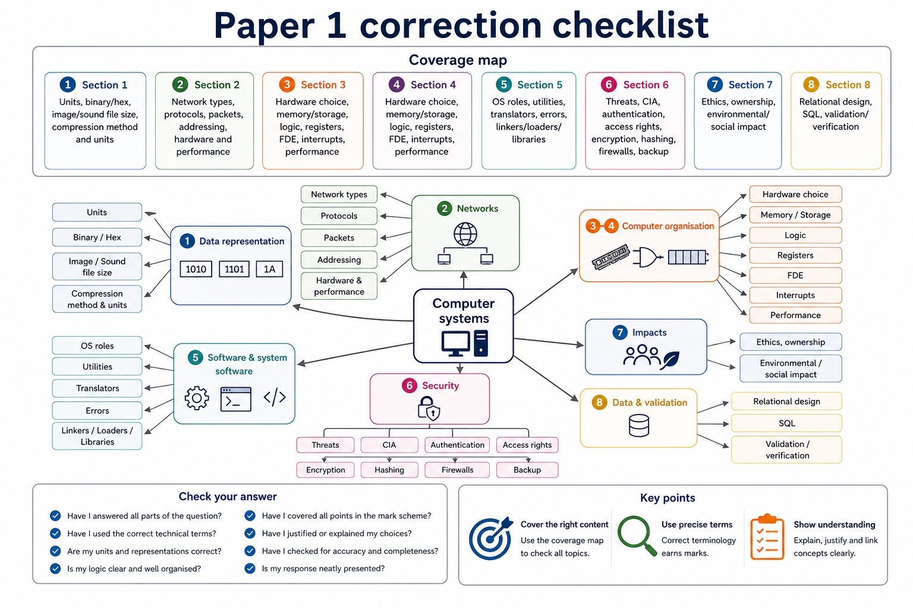

Text transcript

- Coverage map
- Section 1 units, binary/hex, image/sound file size, compression method and units
- Section 2 network types, protocols, packets, addressing, hardware and performance
- Sections 3-4 hardware choice, memory/storage, logic, registers, FDE, interrupts, performance
- Section 5 OS roles, utilities, translators, errors, linkers/loaders/libraries
- Section 6 threats, CIA, authentication, access rights, encryption, hashing, firewalls, backup
- Sections 7-8 ethics, ownership, environmental/social impact, relational design, SQL, validation/verification

#### How to use the mock after today

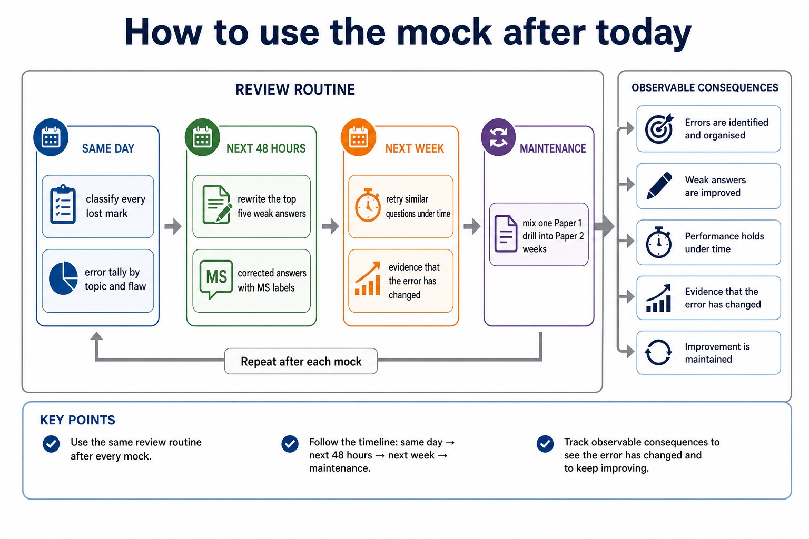

Text transcript

- Review routine
- Same day
- classify every lost mark
- error tally by topic and flaw
- Next 48 hours
- rewrite the top five weak answers
- corrected answers with MS labels
- Next week

#### The rewrite protocol

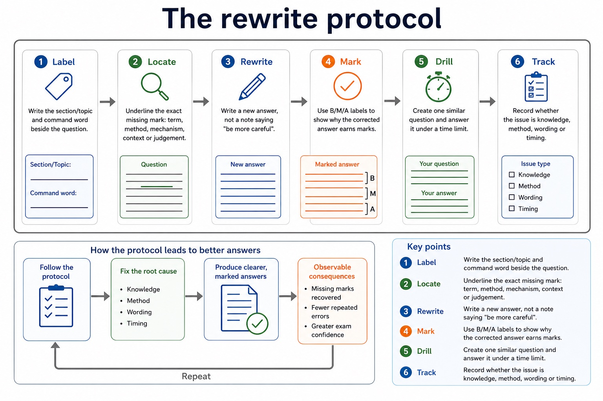

Text transcript

- Correction clinic
- 1. Label Write the section/topic and command word beside the question.
- 2. Locate Underline the exact missing mark: term, method, mechanism, context or judgement.
- 3. Rewrite Write a new answer, not a note saying "be more careful".
- 4. Mark Use B/M/A labels to show why the corrected answer earns marks.
- 5. Drill Create one similar question and answer it under a time limit.
- 6. Track Record whether the issue is knowledge, method, wording or timing.

Precise syllabus wording

Paper 1 mock review and correction clinic

Use the diagrams to retrieve the method, compare similar ideas and correct one typical error.

### Supporting diagram library

#### Calculate image or sound storage

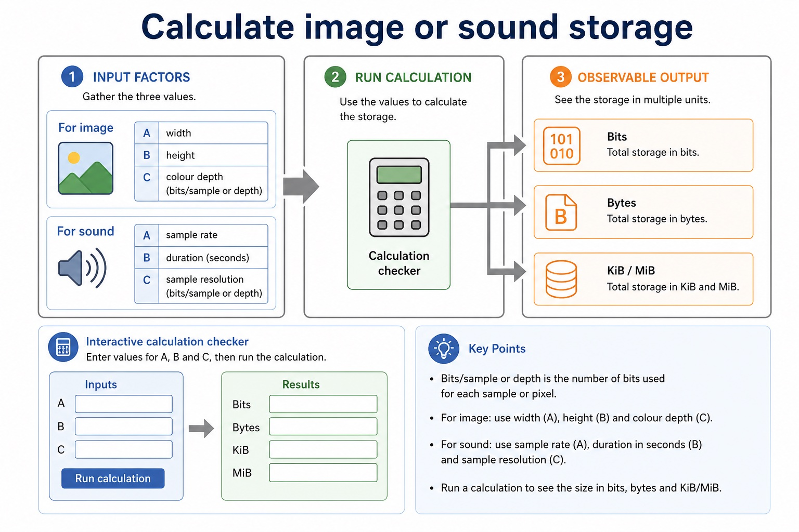

Text transcript

- Interactive calculation checker
- Bits/sample or depth
- For image: A = width, B = height, C = colour depth. For sound: A = sample rate, B = duration seconds, C = sampling resolution.
- Run a calculation to see bits, bytes and KiB/MiB.

#### Sections 5-6 knowledge map

Text transcript

- Compiler, interpreter and assembler are alternative translator paths rather than one serial pipeline.
- High-level source can be compiled to object code and then linked and loaded.
- High-level source can instead be interpreted and executed at runtime.
- Assembly source is translated by an assembler into machine or object code.

#### Choose the best control

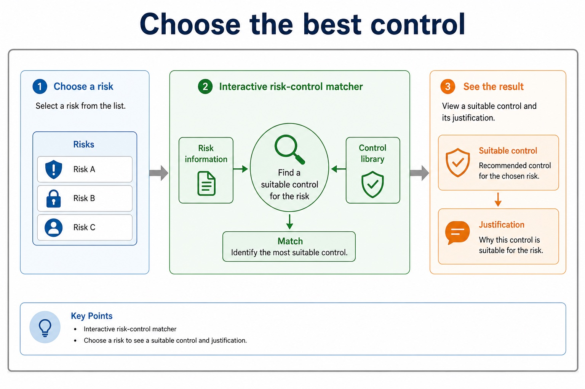

Text transcript

- Interactive risk-control matcher
- Choose a risk to see a suitable control and justification.

#### Relational design: structure before SQL

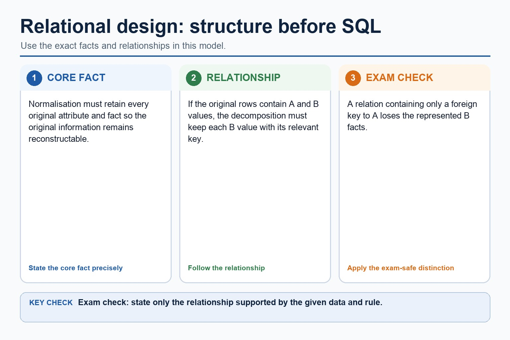

Text transcript

- Normalisation must retain every original attribute and fact so the original information remains reconstructable.
- If the original rows contain A and B values, the decomposition must keep each B value with its relevant key.
- A relation containing only a foreign key to A loses the represented B facts.

#### Clause choice is not decoration

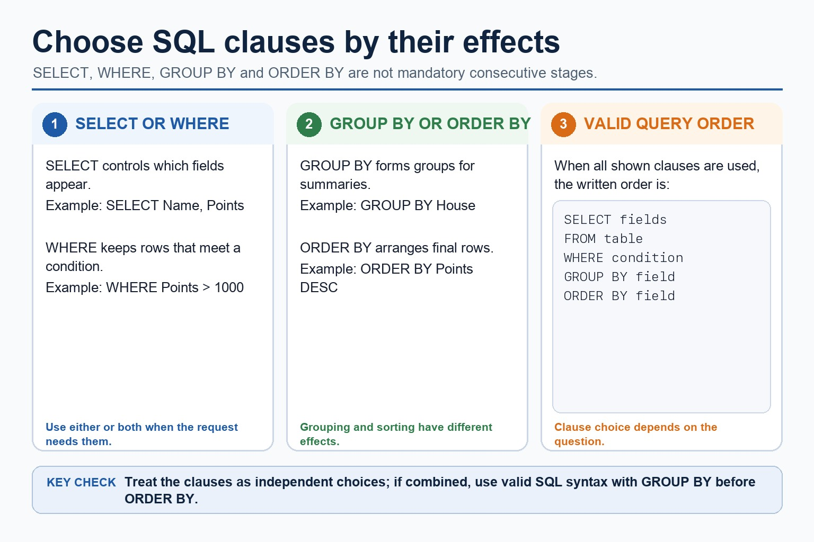

Text transcript

- SELECT, WHERE, GROUP BY and ORDER BY are clause choices with different effects, not mandatory consecutive stages.
- SELECT controls fields, WHERE filters rows, GROUP BY forms groups and ORDER BY sorts final rows.
- When combined in written SQL, GROUP BY appears before ORDER BY.

#### Use the smallest frame that fits the command

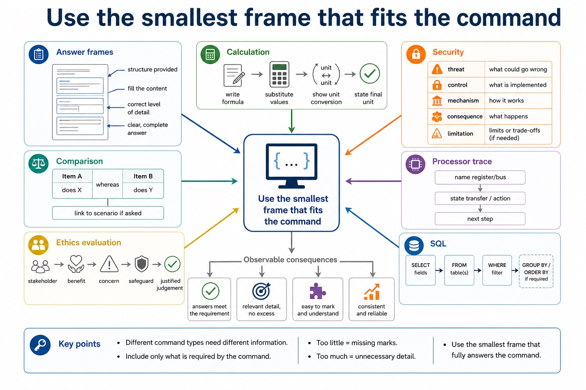

Text transcript

- Answer frames
- Calculation write formula, substitute values, show unit conversion, state final unit.
- Comparison Item A does X whereas item B does Y; link to scenario if asked.
- Security control threat, control, mechanism, consequence, limitation if needed.
- Processor trace name register/bus, state transfer/action, then next step.
- Ethics evaluation stakeholder, benefit, concern, safeguard and justified judgement.
- SQL SELECT fields, FROM table(s), WHERE filter, GROUP BY/ORDER BY if required.

#### Decode the command word before writing

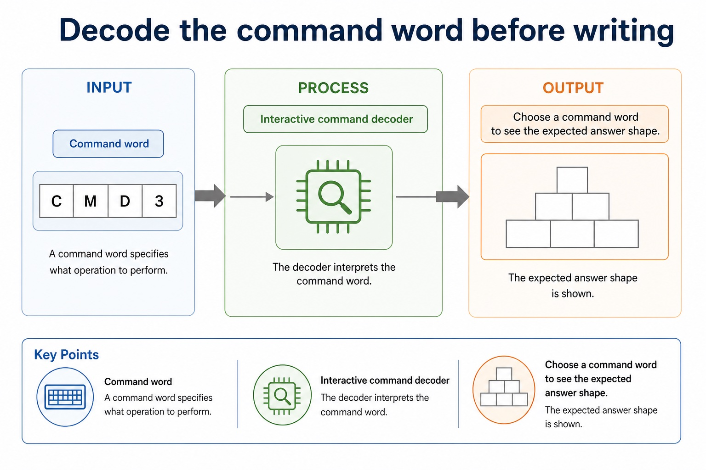

Text transcript

- Interactive command decoder
- Command word
- Choose a command word to see the expected answer shape.

#### Three checks before moving on

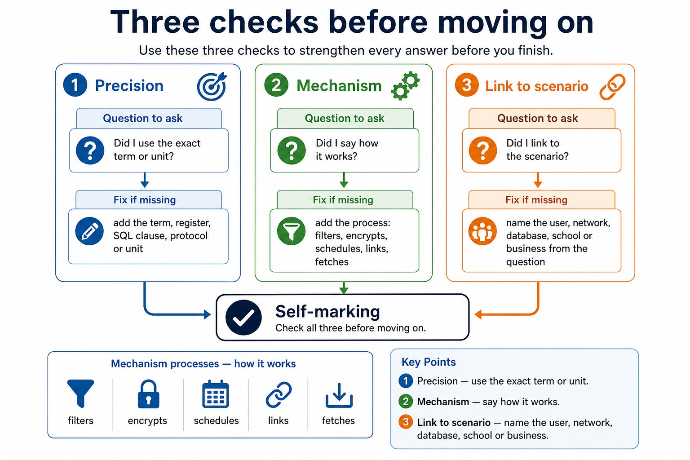

Text transcript

- Self-marking
- Question to ask
- Fix if missing
- Precision
- Did I use the exact term or unit?
- add the term, register, SQL clause, protocol or unit
- Mechanism
- Did I say how it works?

#### Estimate a sensible time budget

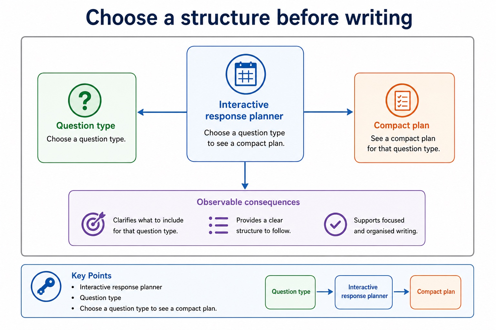

Text transcript

- Interactive mark planner
- Marks available
- Choose a mark value to see the target writing behaviour.

#### Quick retrieval across Paper 1

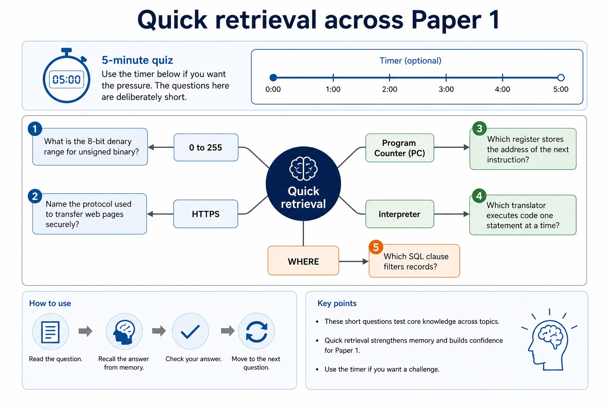

Text transcript

- 5-minute quiz
- Use the timer below if you want the pressure. The questions here are deliberately short.
- 1. What is the 8-bit denary range for unsigned binary?
- 2. Name the protocol used to transfer web pages securely.
- 3. Which register stores the address of the next instruction?
- 4. Which translator executes code one statement at a time?
- 5. Which SQL clause filters records?

#### Decide: answer now, flag, or return later?

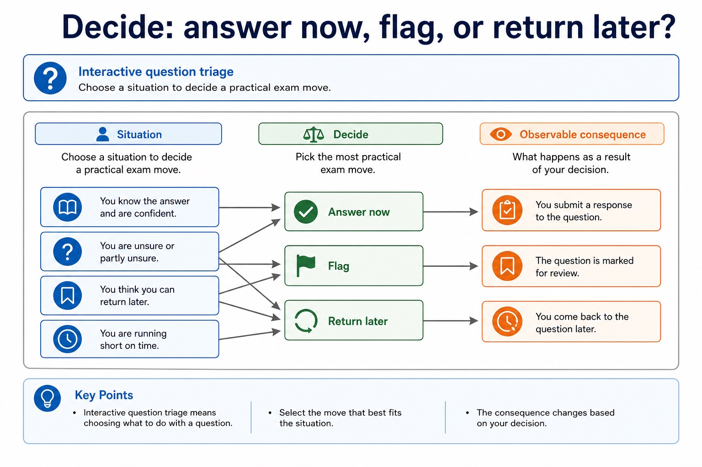

Text transcript

- Interactive question triage
- Situation
- Choose a situation to decide a practical exam move.

#### Evaluation is not just "good and bad"

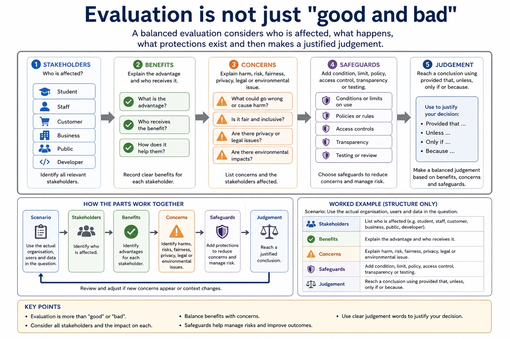

Text transcript

- Stakeholder Name who is affected: student, staff, customer, business, public, developer.
- Benefit Explain the advantage and who receives it.
- Concern Explain harm, risk, fairness, privacy, legal or environmental issue.
- Safeguard Add condition, limit, policy, access control, transparency or testing.
- Judgement Reach a conclusion using provided that, unless, only if or because.
- Scenario Use the actual organisation, users and data in the question.

#### Choose a structure before writing

Text transcript

- Interactive response planner
- Question type
- Choose a question type to see a compact plan.

#### Four common sources of lost marks

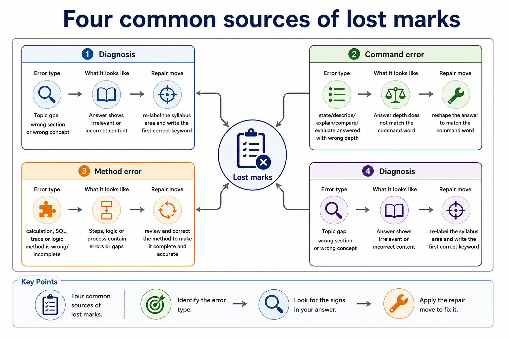

Text transcript

- Diagnosis
- Error type
- What it looks like
- Repair move
- Topic gap
- wrong section or wrong concept
- re-label the syllabus area and write the first correct keyword
- Command error

#### Classify the flaw before rewriting

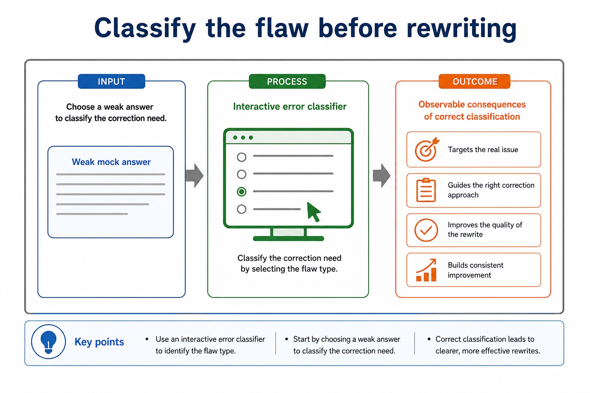

Text transcript

- Interactive error classifier
- Weak mock answer
- Choose a weak answer to classify the correction need.

#### Build a corrected answer sentence

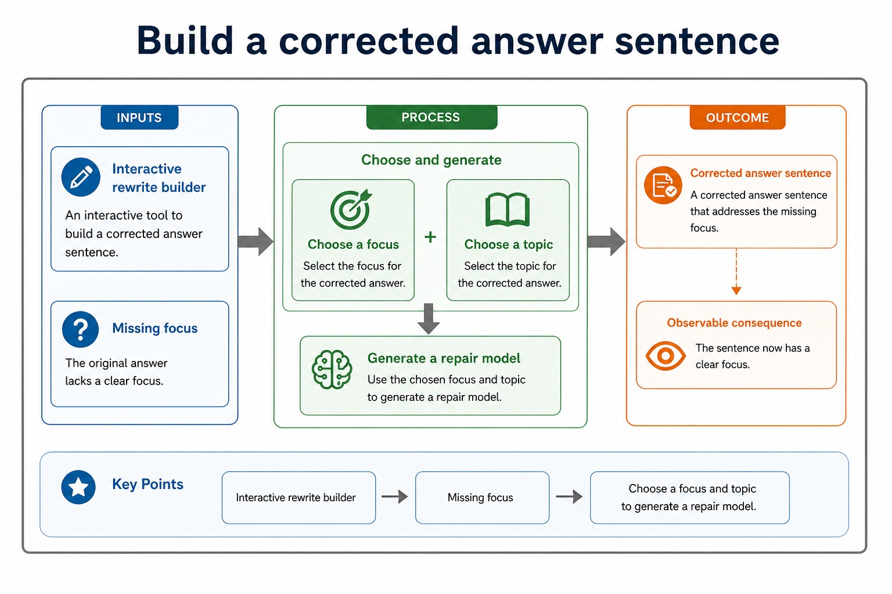

Text transcript

- Interactive rewrite builder
- Missing focus
- Choose a focus and topic to generate a repair model.

#### Turn a score into a repair priority

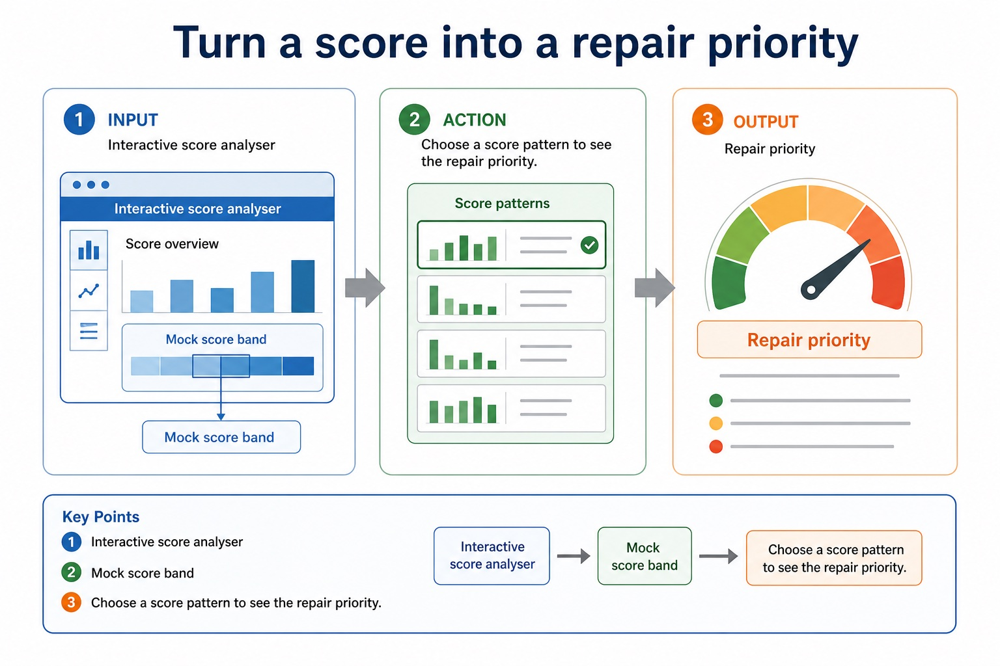

Text transcript

- Interactive score analyser
- Mock score band
- Choose a score pattern to see the repair priority.

Open precise terminology and exam facts

- Conversions apply to integer values and the binary, denary, hexadecimal, BCD, one's-complement and two's-complement representations named in the preceding Version 2 row.
- A LAN covers a limited area and is normally managed by one organisation; a WAN connects sites across a large area and commonly uses provider infrastructure. Benefits must identify a shared or centrally managed resource and its consequence.
- Use the standard symbols and define the functions of NOT, AND, OR, NAND, NOR and XOR (EOR); all gates except NOT have two inputs. Construct circuits, truth tables and expressions from each of the other stated representations: problem statement, logic expression, logic circuit and truth table.
- Use the complete Version 2 instruction set with its specified operands and effects. In particular LDR n loads IX, CMI <address is indirect comparison, JPE follows a True comparison and JPN follows a False comparison.
- The operating system is required to provide a platform and manage memory, files, security, hardware input/output and peripherals, and processes.
- Describe security measures for computer systems from a stand-alone PC to a network: user accounts, passwords, digital signatures, biometrics, firewall, anti-virus, anti-spyware and encryption are all required named evidence.
- Version 2 explicitly includes the Free Software Foundation, Open Source Initiative, shareware and commercial software. All four must be taught; a scenario answer must justify permissions, restrictions, cost or support rather than choose by label alone.
- Version 2 requires CREATE DATABASE, CREATE TABLE, ALTER TABLE, CHARACTER, VARCHAR(n), BOOLEAN, INTEGER, REAL, DATE, TIME, PRIMARY KEY(field) and FOREIGN KEY(field) REFERENCES Table(Field). Each named item remains core.

### Worked example

1. Use one fresh scenario to apply paper 1 integrated review and error clinic, showing each decision or calculation step and checking the result against the question context.

Beyond syllabus / 延伸知识（不要求背诵）: production databases also manage transactions and concurrent users; these ideas extend the syllabus model of integrity and access control.
## 3. Practice by question type

### Question 1 - foundation - describe - 5 marks

Describe one verification method used during data entry and two methods used during data transfer.

**Answer:** visual check against source or double entry with comparison; byte parity uses an agreed odd/even parity bit and checks it at the receiver; block parity checks rows and columns / can locate many single-bit errors; checksum is recalculated from received block and compared; methods detect many errors but do not prove truth or automatically correct every error

**Marking guidance:** Do not substitute validation checks for verification, merge byte and block parity into one unexplained word, or claim that detection automatically corrects an error.

**Common error:** For the command word describe, perform that exact action; do not replace it with an unrelated fact.

### Question 2 - application - explain - 3 marks

Explain one common error from Section 8: Databases, and give the corrected reasoning.

**Answer:** Version 2 requires CREATE DATABASE, CREATE TABLE, ALTER TABLE, CHARACTER, VARCHAR(n), BOOLEAN, INTEGER, REAL, DATE, TIME, PRIMARY KEY(field) and FOREIGN KEY(field) REFERENCES Table(Field). Each named item remains core.

**Marking guidance:** Credit distinct syllabus-accurate points that follow the command word.

**Common error:** Do not repeat the same point in different words; each mark needs a separate idea or method step.

### Question 3 - application - compare - 4 marks

Compare two closely related ideas from Section 3: Hardware.

**Answer:** Use the standard symbols and define the functions of NOT, AND, OR, NAND, NOR and XOR (EOR); all gates except NOT have two inputs. Construct circuits, truth tables and expressions from each of the other stated representations: problem statement, logic expression, logic circuit and truth table.

**Marking guidance:** Credit distinct syllabus-accurate points that follow the command word.

**Common error:** Do not copy the worked example unchanged; transfer the method and check it against the new context.

### Question 4 - transfer - apply - 4 marks

Apply one method from Section 1: Information representation to a fresh exam context.

**Answer:** Conversions apply to integer values and the binary, denary, hexadecimal, BCD, one's-complement and two's-complement representations named in the preceding Version 2 row.

**Marking guidance:** Credit distinct syllabus-accurate points that follow the command word.

**Common error:** Do not copy the worked example unchanged; transfer the method and check it against the new context.

### Related past-paper indexes

| Reference | Marks | Command word | Question type |
|---|---:|---|---|
| 9618/12/S/25 Q6(c) | 6 | complete | recall |
| 9618/11/S/25 Q6(b) | 5 | complete | recall |
| 9618/11/S/25 Q7(b) | 5 | describe | explain |
| 9618/13/W/25 Q5(c) | 5 | complete | recall |

These are indexes only. Cambridge question and mark-scheme wording is not reproduced.

## 4. Summary and exam reminders

### Summary

- Define paper 1 integrated review and error clinic with the exact technical vocabulary expected by the syllabus.
- Use the lesson method on a fresh context and show the intermediate decision, representation or calculation.
- Match the shape of the answer to the command word and the available marks.
- Check the final answer against the scenario instead of repeating a memorised sentence.

### Common error to correct

Students often revise by rereading notes only. Correction: review lessons require retrieval, timed practice and correction.

### Exam technique

- Follow the command word: state gives a fact; explain links a cause to a consequence; compare covers both sides.
- Match the number of independent points or method steps to the available marks.
- For paper 1 integrated review and error clinic, use the exact technical term before applying it to the scenario.

**Optional extra practice:** Correct one answer from a timed attempt and record the exact reason each lost mark was lost.
