# Lesson 046: Abstraction and abstract models

**Course:** Cambridge International AS Level Computer Science 9618, 2027-2029 Version 2 
**Paper:** Paper 2 
**Syllabus:** Section 9: Algorithm design and problem-solving 
**Syllabus requirements:** S9.01 
**Pacing:** Flexible. Select the material set and practice depth needed by the learner.

## Teaching-depth menu

- **Quick route:** Use the diagnostic, learning objectives, first worked example and foundation question. Stop once the learner can explain the central distinction accurately.
- **Full route:** Use every knowledge-point material set, the worked method, the terminology check and all questions.
- **Deep route:** Add the prerequisite refresher, ask learners to connect the concept checklist, discuss the labelled extension and complete a transfer question without a model answer.

## 1. Prerequisite knowledge and quick diagnostic

Recall the main conclusion from Lesson 045: Paper 1 integrated review and error clinic.

Ask the learner to give one accurate definition or method step before continuing. If they cannot, briefly revisit the named prerequisite rather than repeating the whole previous lesson.

## 2. Knowledge explanation

### 1. Abstraction · Essential details · Irrelevant detail · Abstract model (S9.01)

**Concept map:** abstraction → essential details → irrelevant detail → abstract model

**Three-part explanation:**

1. explain its need and benefits, then produce an abstract model containing only details essential to the problem
2. use abstraction to retain essential details in an abstract model
3. Abstraction is required both as a concept and as a practical modelling skill

**Concrete cue:** Abstraction is required both as a concept and as a practical modelling skill: explain its need and benefits, then produce an abstract model containing only details essential to the problem.

#### Produce an abstract model

Text transcript

- Underline the required output and keep only details that affect it.
- Create verb-based sub-problems with distinct responsibilities.
- State each sub-problem's input and output.
- Check that the parts collectively meet every requirement without gaps or overlap.
- The result is a natural-language responsibility plan ready for a later representation lesson.

#### Abstraction: keep the details that affect the algorithm

Text transcript

- Keep details that affect an input, rule, calculation, constraint or output.
- Ignore decoration that does not change the required result.
- Ask whether removing a detail would change the result.
- Explain why a detail is relevant or irrelevant rather than only labelling it.

#### Keep or ignore details

Text transcript

- Interactive abstraction filter

Precise syllabus wording

Understand abstraction, its purpose/benefits and creation of an abstract model.

Abstraction is required both as a concept and as a practical modelling skill: explain its need and benefits, then produce an abstract model containing only details essential to the problem.

### Supporting diagram library

#### Constraints stop algorithms from wandering off

Text transcript

- A range of 0 to 100 requires both limits to be checked.
- Exactly 10 supplied readings means the plan must process all 10 readings.
- A capacity of 30 bookings means a request beyond the remaining capacity must be rejected.
- Each stated constraint must have a specific consequence in the plan.

#### Use IPOC before choosing a representation

Text transcript

- List each input and record its type or range when the problem supplies them.
- Write the required processing in ordered natural-language steps.
- State the exact required output.
- Record constraints and supported assumptions.
- Confirm completeness before choosing a representation.

#### Binary search repeatedly halves a sorted list

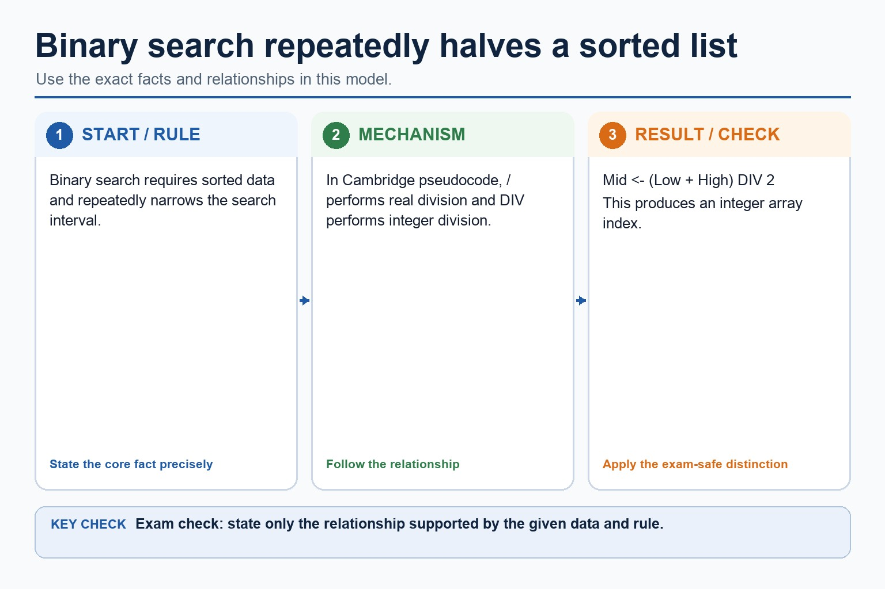

Text transcript

- Binary search requires sorted data and repeatedly narrows the search interval.
- In Cambridge pseudocode, / performs real division and DIV performs integer division.
- Mid <- (Low + High) DIV 2

#### Trace binary search on sorted data

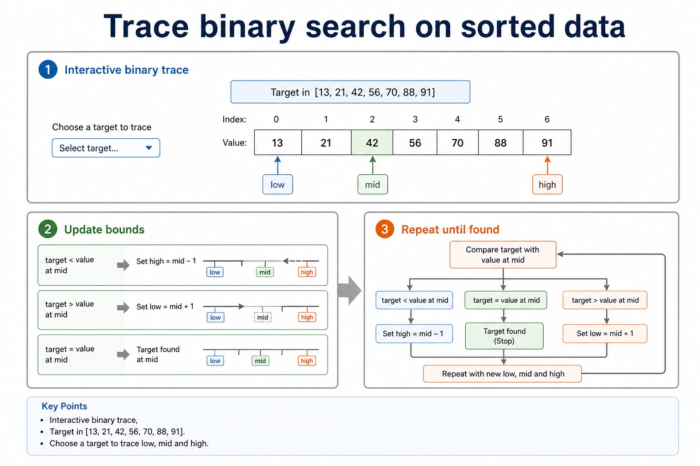

Text transcript

- Interactive binary trace
- Target in [13, 21, 42, 56, 70, 88, 91]
- Choose a target to trace low, mid and high.

#### Choosing the right search

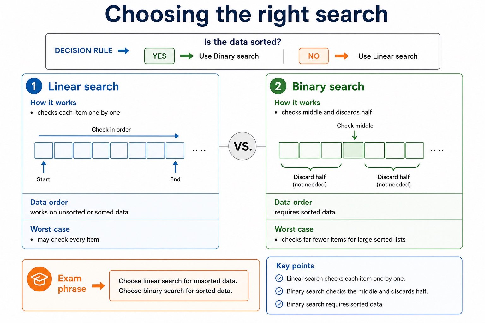

Text transcript

- Comparison
- Linear search
- Binary search
- Data order
- works on unsorted or sorted data
- requires sorted data
- checks each item one by one
- checks middle and discards half

#### Trace linear search

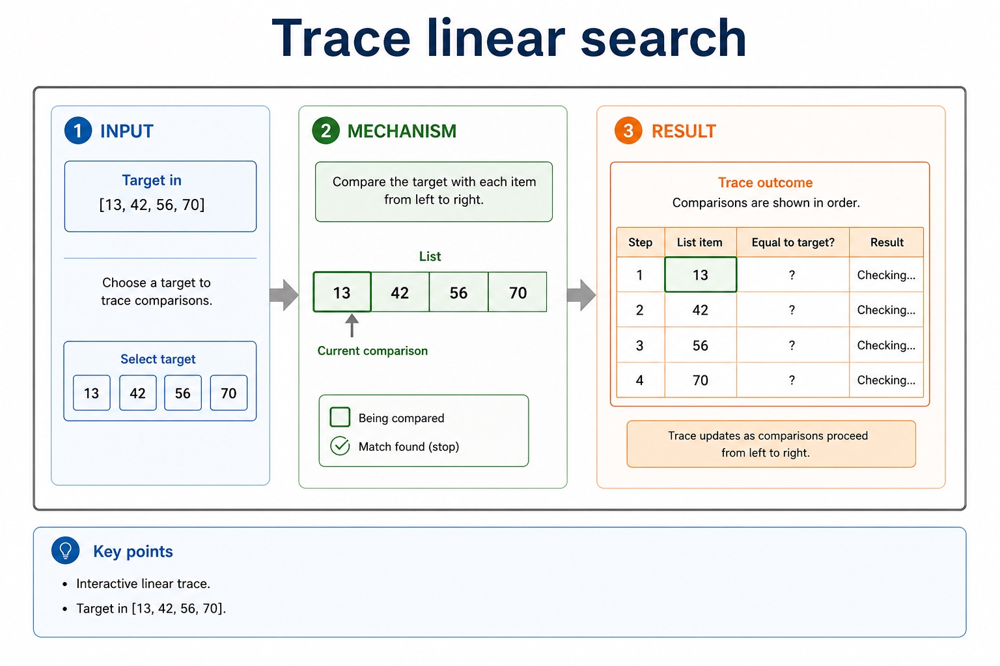

Text transcript

- Interactive linear trace
- Target in [13, 42, 56, 70]
- Choose a target to trace comparisons.

#### Cambridge pseudocode is the exam format

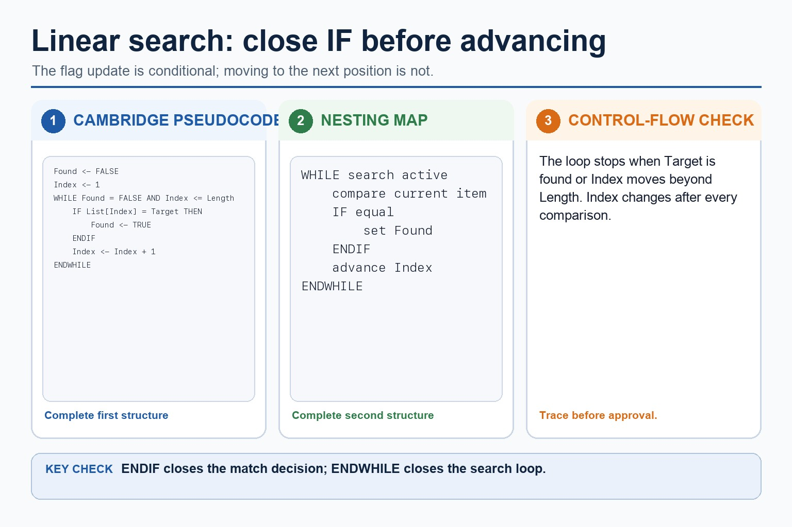

Text transcript

- Initialise Found to FALSE and Index to the first valid position.
- While the target is not found and Index remains valid, compare the current item.
- Close the match selection with ENDIF, then increment Index.
- ENDWHILE closes the surrounding search loop.

#### Why the sorts move data differently

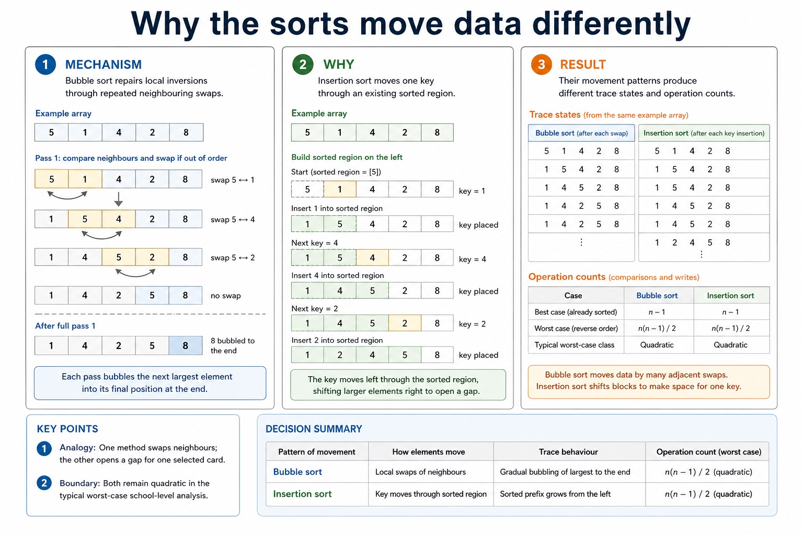

Text transcript

- Bubble sort repairs local inversions through repeated neighbouring swaps.
- Insertion sort moves one key through an existing sorted region.
- Their movement patterns produce different trace states and operation counts.

#### How insertion sort grows a sorted region

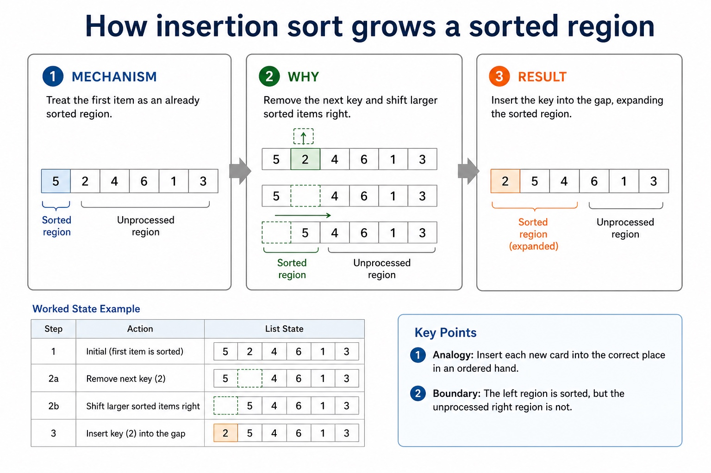

Text transcript

- Treat the first item as an already sorted region.
- Remove the next key and shift larger sorted items right.
- Insert the key into the gap, expanding the sorted region.

#### Why a trace follows state

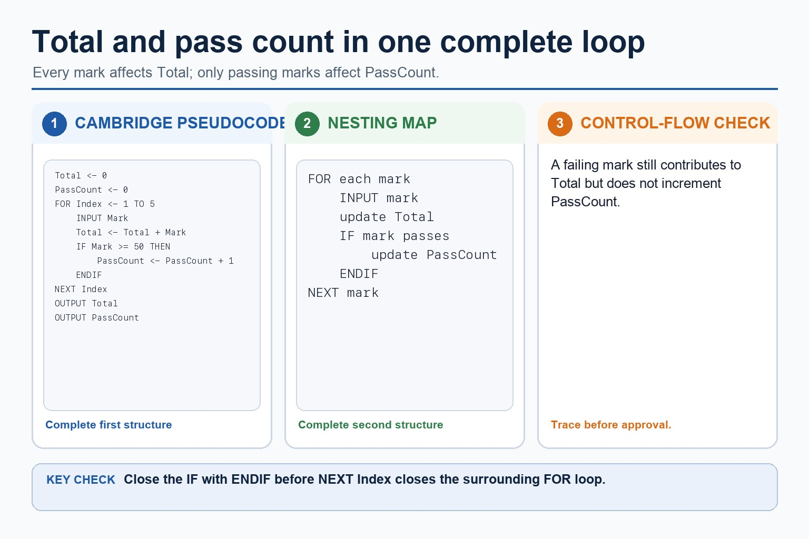

Text transcript

- Record the variables and list at the agreed trace point.
- Apply exactly one comparison, swap, shift or insertion step.
- Write the new state before advancing the loop.

#### When the number of values is known, use a count-controlled loop

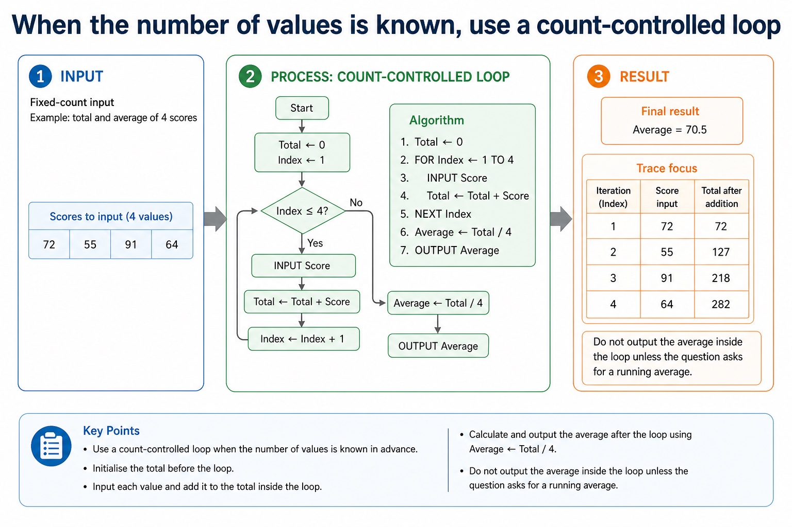

Text transcript

- Fixed-count input
- Example: total and average of 4 scores
- Total <- 0
- FOR Index <- 1 TO 4
- INPUT Score
- Total <- Total + Score
- NEXT Index
- Average <- Total / 4

#### The starting value decides whether the algorithm is honest

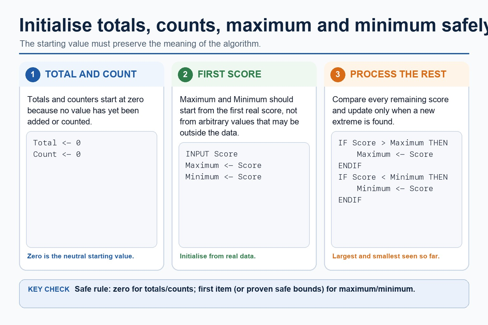

Text transcript

- Initialise totals and counters to zero before processing values.
- Initialise Maximum and Minimum from the first real input value or from proven safe bounds.
- Compare each remaining value with Maximum and Minimum.
- Replace Maximum only when a larger value is found and Minimum only when a smaller value is found.

#### Four running-value patterns

Text transcript

- Knowledge explanation
- Start with a concrete list, then name the algorithm pattern.
- Variable
- Update rule
- Total <- Total + Value
- running sum of values
- Count <- Count + 1 when a value is processed or meets a condition
- number of items

#### Use Cambridge assignment and loop keywords in exam answers

Text transcript

- Initialise Total and PassCount to zero before processing five marks.
- Every input mark is added to Total.
- Increment PassCount only when Mark is at least 50 and close that selection with ENDIF.
- Output Total and PassCount after NEXT Index.

#### When input stops on a special value, do not process the sentinel

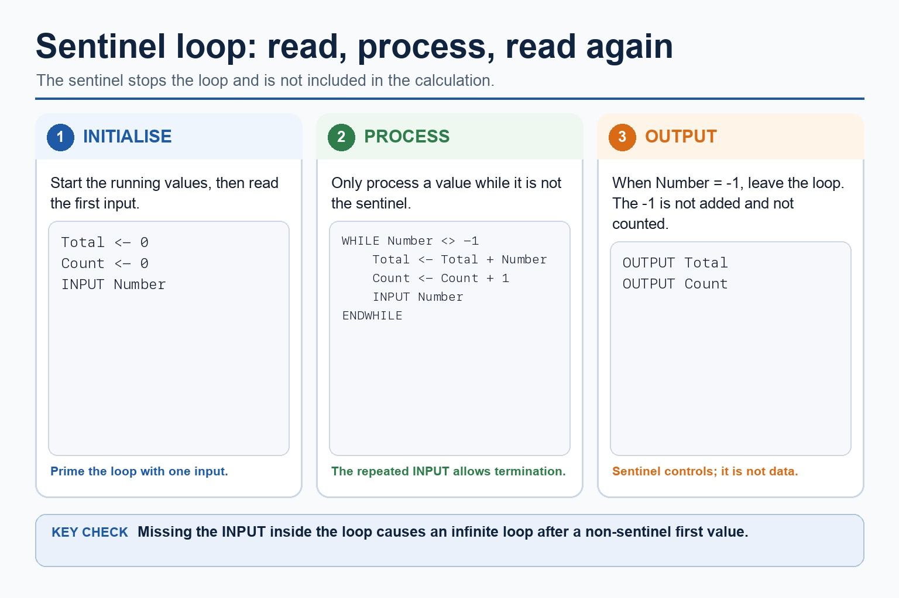

Text transcript

- Initialise Total and Count, then input the first Number.
- While Number is not -1, add it to Total and increment Count.
- Input the next Number at the end of the WHILE body before ENDWHILE.
- The sentinel -1 stops the loop and is not added or counted.

#### Watch running variables change

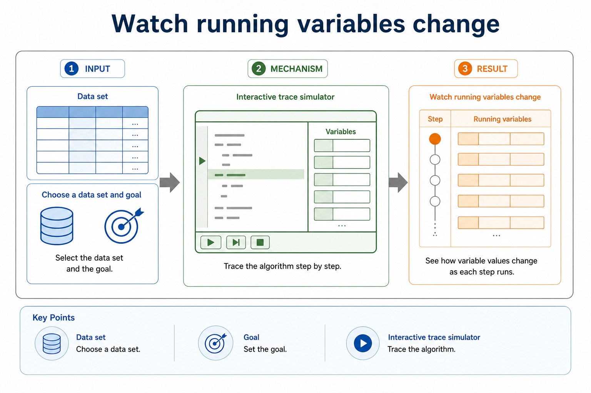

Text transcript

- Interactive trace simulator
- Data set
- Choose a data set and goal, then trace the algorithm.

#### Turn vague answers into mark-worthy answers

Text transcript

- Interactive answer fixer
- Weak answer
- Choose a weak answer to see a stricter version.

#### Match the scenario to the correct algorithm pattern

Text transcript

- Pattern choice
- Scenario clue
- Core pseudocode feature
- One precise explanation
- exactly 10 readings
- Count-controlled loop
- FOR Index <- 1 TO 10
- The number of repetitions is known before the loop starts.

#### Paper 2 wants readable Cambridge-style pseudocode

Text transcript

- Initialise Total and Count, then input the first Value.
- While Value is not -1, add it to Total and increment Count.
- Input the next Value inside the WHILE body before ENDWHILE.
- If Count is greater than zero, calculate Average using real division and output it.
- Java may support understanding but is not the Cambridge pseudocode answer format.

#### Section 9 in one page

Text transcript

- Retrieval map
- Signal words
- Expected mechanism
- Typical marking error
- IPOC / decomposition
- scenario, requirements, constraints
- break problem into inputs, processing, outputs and rules
- copying the story without design decisions

#### Turn question wording into an algorithm plan

Text transcript

- Scenario triage
- Step 1: Output first
- Ask: what must be displayed, returned or stored at the end? The final output tells you which variables need to exist.
- Output needed: average rainfall
- Therefore:
- Total is needed
- Count is needed
- Average <- Total / Count

Open precise terminology and exam facts

- Abstraction is required both as a concept and as a practical modelling skill: explain its need and benefits, then produce an abstract model containing only details essential to the problem.
- Abstraction removes each irrelevant detail that does not affect the required inputs, rules, constraints or outputs. Producing an abstract model means recording the essential details that remain: the data, relationships and processes needed to solve the problem, not merely listing what was ignored.
- Decomposition breaks a problem into smaller sub-problems with distinct responsibilities. Express the resulting design as program modules with clear inputs, processing and outputs; a module may later be implemented as a procedure that performs an action or a function that returns a value.
- Abstraction decides what belongs in the model; decomposition decides how the retained problem is divided. The modules must connect into one complete solution and must not omit a requirement.
- Algorithm design review: define an algorithm as a solution expressed as a sequence of defined steps; use abstraction to retain essential details in an abstract model; use decomposition to express the problem as connected modules; and choose meaningful identifiers recorded in an identifier table.

### Worked example

1. Design a result-processing solution
2. Keep only student ID and required marks, decompose the task into InputResults, ValidateResult, CalculateMean and OutputReport, record meaningful identifiers and IPO, refine CalculateMean into defined steps, use a range logic statement, and…

Beyond syllabus / 延伸知识（不要求背诵）: the same algorithm can be expressed in many programming languages; its logic should remain independent of syntax.
## 3. Practice by question type

### Question 1 - foundation - write - 6 marks

Write an abstract model for a school meal bill, then decompose it into named program modules and identify one likely procedure and one likely function.

**Answer:** retains meal choice, quantity and price as essential details; states the calculation and total output in the abstract model; excludes a justified irrelevant detail such as tray colour; expresses the problem as connected modules with distinct responsibilities; identifies a suitable procedure module that performs an action; identifies a suitable function module that returns a value

**Marking guidance:** Do not award only a list of omitted details, vague Part1/Part2 labels or modules that do not collectively solve the problem.

**Common error:** For the command word write, perform that exact action; do not replace it with an unrelated fact.

### Question 2 - application - show - 8 marks

Develop an abstract, modular algorithm for processing ten valid marks, then show one refinement level and the central validation logic statement.

**Answer:** abstract model keeps only essential data, rules and output; decomposition expresses connected program modules; identifier table uses meaningful names, types and purposes; IPO design forms a complete solution; sequence, selection and iteration are used appropriately; one representation is accurate and convertible without changing meaning; stepwise refinement replaces a complex step with implementable substeps; logic statement correctly enforces the required mark range

**Marking guidance:** Do not award isolated terminology when the design omits the required model, modules, refinement or logic.

**Common error:** Do not repeat the same point in different words; each mark needs a separate idea or method step.

### Question 3 - transfer - explain - 3 marks

Explain how abstraction and abstract models would be applied in a suitable computing context.

**Answer:** Abstraction removes each irrelevant detail that does not affect the required inputs, rules, constraints or outputs. Producing an abstract model means recording the essential details that remain: the data, relationships and processes needed to solve the problem, not merely listing what was ignored. Decomposition breaks a problem into smaller sub-problems with distinct responsibilities. Express the resulting design as program modules with clear inputs, processing and outputs; a module may later be implemented as a procedure that performs an action or a function that returns a value. Abstraction decides what belongs in the model; decomposition decides how the retained problem is divided. The modules must connect into one complete solution and must not omit a requirement.

**Marking guidance:** Each mark needs a relevant point linked to the stated context.

**Common error:** Do not copy the worked example unchanged; transfer the method and check it against the new context.

## 4. Summary and exam reminders

### Summary

- Define abstraction and abstract models with the exact technical vocabulary expected by the syllabus.
- Use the lesson method on a fresh context and show the intermediate decision, representation or calculation.
- Match the shape of the answer to the command word and the available marks.
- Check the final answer against the scenario instead of repeating a memorised sentence.

### Common error to correct

Students often start coding before defining the output. Correction: an algorithm is easier to design when the required result is known first.

### Exam technique

- Follow the command word: state gives a fact; explain links a cause to a consequence; compare covers both sides.
- Match the number of independent points or method steps to the available marks.
- For abstraction and abstract models, use the exact technical term before applying it to the scenario.
