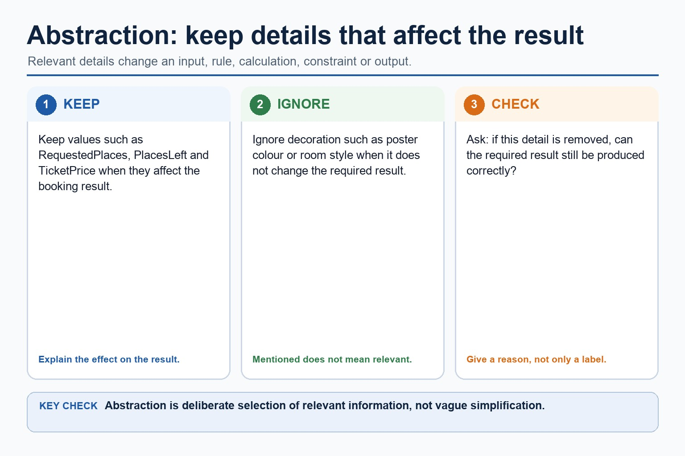

# Lesson 046: Abstraction and abstract models

**Course:** Cambridge International AS Level Computer Science 9618, syllabus for examination in 2027-2029 
**Paper:** Paper 2 
**Syllabus:** Section 9: Algorithm design and problem-solving 
**Syllabus requirements:** S9.01 
**Pacing:** Flexible. Select a quick, full or deep route for the learners in front of you.

## Teaching-depth menu

- **Quick route:** Use the diagnostic, learning objectives, first worked example and foundation question. Stop once the learner can explain the central distinction accurately.
- **Full route:** Teach every knowledge-point material set, the worked method and all lesson questions.
- **Deep route:** Add the prerequisite refresher, ask learners to connect the concept checklist, discuss the labelled extension and complete a transfer question without a model answer.

## 1. Prerequisite knowledge and quick diagnostic

Recall the main conclusion from Lesson 045: Paper 1 integrated review and error clinic.

Ask the learner to give one accurate definition or method step before continuing. If they cannot, briefly revisit the named prerequisite rather than repeating the whole previous lesson.

## 2. Knowledge explanation

### 1. Abstraction, its purpose/benefits and creation of an abstract model (S9.01)

**Concept relationships**

- **essential details:** Abstraction to retain essential details in an abstract…
- **irrelevant detail:** Abstraction removes each irrelevant detail that does not…
- **abstract model:** Abstraction, its purpose/benefits and creation of an abstract…
- **abstraction:** Abstraction decides what belongs in the model
- **purpose:** Its need and benefits, then produce an abstract…

**Mechanism**

1. **Translate the stated design** — Abstraction, its purpose/benefits and creation of an abstract model.
2. **Apply one complete operation** — Its need and benefits, then produce an abstract model containing only details essential to the problem.
3. **Trace state and boundaries** — Abstraction to retain essential details in an abstract model

**Abstraction: keep the details that affect the algorithm:** Keep details that affect an input, rule, calculation, constraint or output. Ignore decoration that does not change the required result.

#### Abstraction: keep the details that affect the algorithm

Text transcript

- Keep details that affect an input, rule, calculation, constraint or output.
- Ignore decoration that does not change the required result.
- Ask whether removing a detail would change the result.
- Explain why a detail is relevant or irrelevant rather than only labelling it.

Precise syllabus wording

Understand abstraction, its purpose/benefits and creation of an abstract model.

Abstraction is required both as a concept and as a practical modelling skill: explain its need and benefits, then produce an abstract model containing only details essential to the problem.

Open precise terminology and exam facts

- Abstraction is required both as a concept and as a practical modelling skill: explain its need and benefits, then produce an abstract model containing only details essential to the problem.
- Abstraction removes each irrelevant detail that does not affect the required inputs, rules, constraints or outputs. Producing an abstract model means recording the essential details that remain: the data, relationships and processes needed to solve the problem, not merely listing what was ignored.
- Decomposition breaks a problem into smaller sub-problems with distinct responsibilities. Express the resulting design as program modules with clear inputs, processing and outputs; a module may later be implemented as a procedure that performs an action or a function that returns a value.
- Abstraction decides what belongs in the model; decomposition decides how the retained problem is divided. The modules must connect into one complete solution and must not omit a requirement.
- Algorithm design review: define an algorithm as a solution expressed as a sequence of defined steps; use abstraction to retain essential details in an abstract model; use decomposition to express the problem as connected modules; and choose meaningful identifiers recorded in an identifier table.

### Worked method

1. Design a result-processing solution
2. Keep only student ID and required marks, decompose the task into InputResults, ValidateResult, CalculateMean and OutputReport, record meaningful identifiers and IPO, refine CalculateMean into defined steps, use a range logic…

Beyond syllabus / 延伸知识（不要求背诵）: the same algorithm can be expressed in many programming languages; its logic should remain independent of syntax.
## 3. Practice by question type

### Question 1 - foundation - write - 6 marks

Write an abstract model for a school meal bill, then decompose it into named program modules and identify one likely procedure and one likely function.

**Answer:** retains meal choice, quantity and price as essential details; states the calculation and total output in the abstract model; excludes a justified irrelevant detail such as tray colour; expresses the problem as connected modules with distinct responsibilities; identifies a suitable procedure module that performs an action; identifies a suitable function module that returns a value

**Marking guidance:** Do not award only a list of omitted details, vague Part1/Part2 labels or modules that do not collectively solve the problem.

**Common error:** For the command word write, perform that exact action; do not replace it with an unrelated fact.

### Question 2 - application - show - 8 marks

Develop an abstract, modular algorithm for processing ten valid marks, then show one refinement level and the central validation logic statement.

**Answer:** abstract model keeps only essential data, rules and output; decomposition expresses connected program modules; identifier table uses meaningful names, types and purposes; IPO design forms a complete solution; sequence, selection and iteration are used appropriately; one representation is accurate and convertible without changing meaning; stepwise refinement replaces a complex step with implementable substeps; logic statement correctly enforces the required mark range

**Marking guidance:** Do not award isolated terminology when the design omits the required model, modules, refinement or logic.

**Common error:** Do not repeat the same point in different words; each mark needs a separate idea or method step.

### Question 3 - transfer - explain - 3 marks

Explain how abstraction and abstract models would be applied in a suitable computing context.

**Answer:** Abstraction removes each irrelevant detail that does not affect the required inputs, rules, constraints or outputs. Producing an abstract model means recording the essential details that remain: the data, relationships and processes needed to solve the problem, not merely listing what was ignored. Decomposition breaks a problem into smaller sub-problems with distinct responsibilities. Express the resulting design as program modules with clear inputs, processing and outputs; a module may later be implemented as a procedure that performs an action or a function that returns a value. Abstraction decides what belongs in the model; decomposition decides how the retained problem is divided. The modules must connect into one complete solution and must not omit a requirement.

**Marking guidance:** Each mark needs a relevant point linked to the stated context.

**Common error:** Do not copy the worked example unchanged; transfer the method and check it against the new context.

## 4. Summary and exam reminders

### Summary

- Define abstraction and abstract models with the exact technical vocabulary expected by the syllabus.
- Use the lesson method on a fresh context and show the intermediate decision, representation or calculation.
- Match the shape of the answer to the command word and the available marks.
- Check the final answer against the scenario instead of repeating a memorised sentence.

### Common error to correct

Students often start coding before defining the output. Correction: an algorithm is easier to design when the required result is known first.

### Exam technique

- Follow the command word: state gives a fact; explain links a cause to a consequence; compare covers both sides.
- Match the number of independent points or method steps to the available marks.
- For abstraction and abstract models, use the exact technical term before applying it to the scenario.
