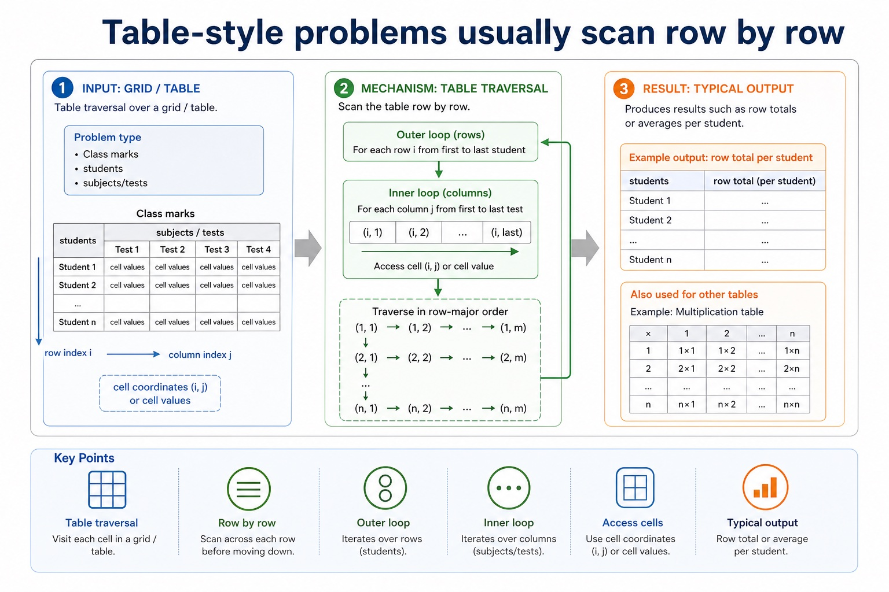
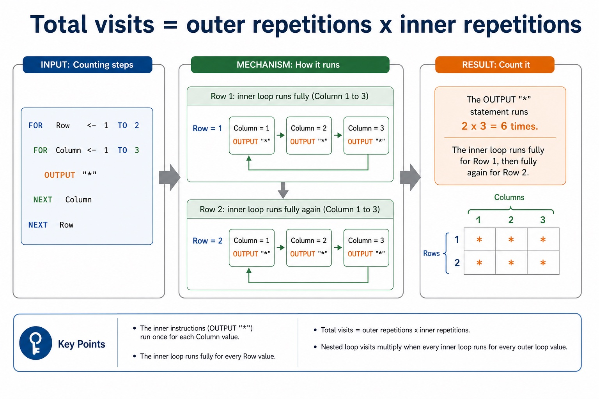
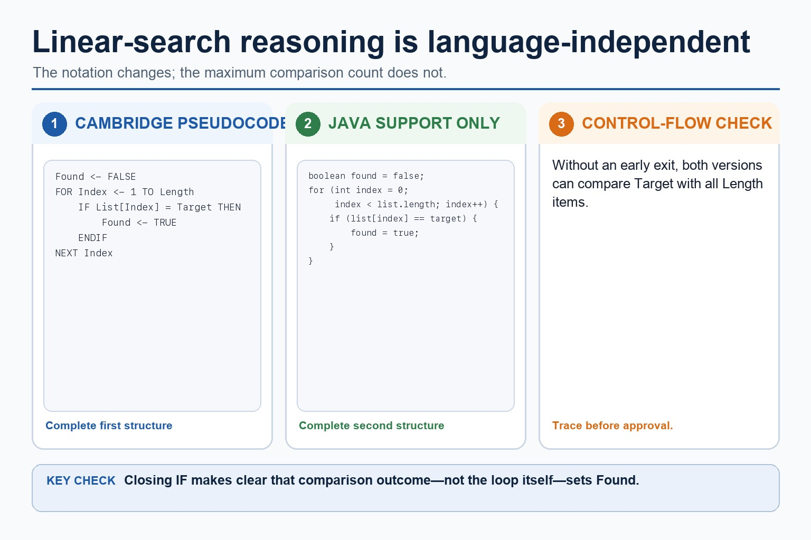
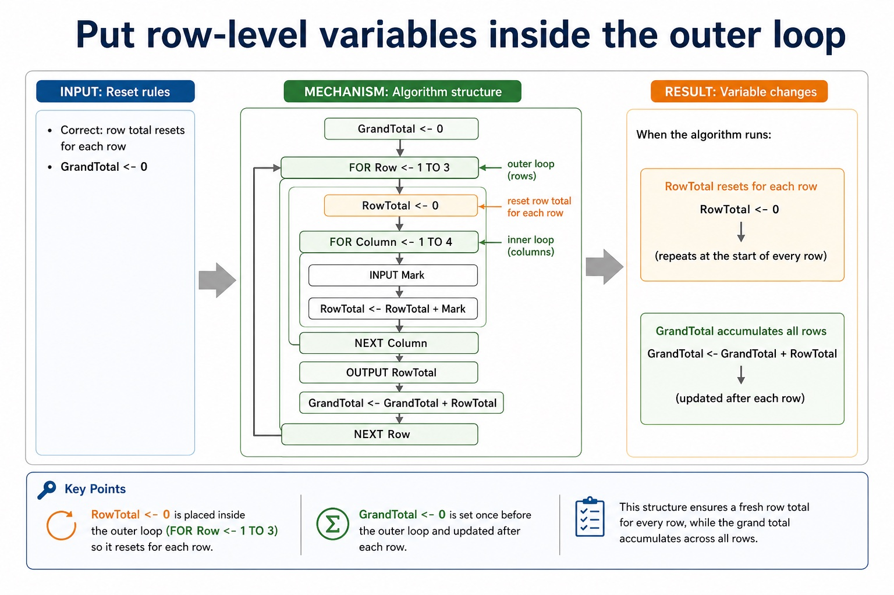

# Lesson 047: Decomposition and modular problem solving

**Course:** Cambridge International AS Level Computer Science 9618, 2027-2029 Version 2 
**Paper:** Paper 2 
**Syllabus:** Section 9: Algorithm design and problem-solving 
**Syllabus requirements:** S9.02 
**Pacing:** Flexible. Select the material set and practice depth needed by the learner.

## Teaching-depth menu

- **Quick route:** Use the diagnostic, learning objectives, first worked example and foundation question. Stop once the learner can explain the central distinction accurately.
- **Full route:** Use every knowledge-point material set, the worked method, the terminology check and all questions.
- **Deep route:** Add the prerequisite refresher, ask learners to connect the concept checklist, discuss the labelled extension and complete a transfer question without a model answer.

## 1. Prerequisite knowledge and quick diagnostic

Recall S9.01 before starting this lesson.

Ask the learner to give one accurate definition or method step before continuing. If they cannot, briefly revisit the named prerequisite rather than repeating the whole previous lesson.

### Optional prerequisite refresher

- Abstraction is required both as a concept and as a practical modelling skill: explain its need and benefits, then produce an abstract model containing only details essential to the problem.
- Understand abstraction, its purpose/benefits and creation of an abstract model.

## 2. Knowledge explanation

### 1. Decomposition · Problem · Modules · Procedure (S9.02)

**Concept map:** decomposition → problem → modules → procedure → function

**Three-part explanation:**

1. Decomposition must break a problem into sub-problems and lead to a program module, identified at design level as a procedure or function with a distinct responsibility
2. Decomposition breaks a problem into smaller sub-problems with distinct responsibilities
3. use decomposition to express the problem as connected modules

**Concrete cue:** Decomposition must break a problem into sub-problems and lead to a program module, identified at design level as a procedure or function with a distinct responsibility.

#### Decomposition: split the problem into sub-problems

Text transcript

- Split the whole task into meaningful sub-problems with distinct responsibilities.
- Express the resulting design as program modules with clear inputs, processing and outputs.
- A module may become a procedure that performs an action or a function that returns a value.
- Confirm that all modules connect into one complete solution.

#### Stepwise refinement turns a high-level algorithm into implementable modules

Text transcript

- Stepwise refinement starts with a high-level algorithm and repeatedly replaces each complex step with a smaller sequence of defined substeps.
- Refinement stops when every step is precise enough to implement and its input and output are clear.
- At each level, preserve the parent step's purpose and input-process-output relationship.
- Related substeps can be expressed as program modules, including procedures that perform actions and functions that return calculated values.
- Every level must reduce ambiguity and collectively remain a complete solution.

#### Section 9 in one page

Text transcript

- Retrieval map
- Signal words
- Expected mechanism
- Typical marking error
- IPOC / decomposition
- scenario, requirements, constraints
- break problem into inputs, processing, outputs and rules
- copying the story without design decisions

#### Table-style problems usually scan row by row

Text transcript

- Table traversal
- Problem type
- Outer loop
- Inner loop
- Typical output
- Grid / table
- cell coordinates or cell values
- Class marks

Precise syllabus wording

Use decomposition and express a problem as modules.

Decomposition must break a problem into sub-problems and lead to a program module, identified at design level as a procedure or function with a distinct responsibility.

### Supporting diagram library

#### Constraints stop algorithms from wandering off

Text transcript

- A range of 0 to 100 requires both limits to be checked.
- Exactly 10 supplied readings means the plan must process all 10 readings.
- A capacity of 30 bookings means a request beyond the remaining capacity must be rejected.
- Each stated constraint must have a specific consequence in the plan.

#### Use IPOC before choosing a representation

Text transcript

- List each input and record its type or range when the problem supplies them.
- Write the required processing in ordered natural-language steps.
- State the exact required output.
- Record constraints and supported assumptions.
- Confirm completeness before choosing a representation.

#### Dry run: execute the algorithm by hand

Text transcript

- 1 Copy the variable names into table columns.
- 2 Write initial values before the loop starts.
- 3 Use each input value in order.
- 4 Update variables exactly when pseudocode updates them.
- 5 Record output only when an OUTPUT statement is executed.

#### Loops make trace tables useful and slightly unforgiving

Text transcript

- Loop tracing
- Initialisation Variables such as Total and Count usually need a starting value before the loop.
- Update Record new values after assignment, not before.
- Condition For WHILE loops, check the condition before each iteration.
- Sentinel A sentinel value stops input and should usually not be processed as data.
- Output timing If OUTPUT is after the loop, output appears once at the end.
- Boundary Check whether loops run 5 times, 6 times, or one time too many.

#### Predict the final output

Text transcript

- Interactive output predictor
- Input set
- The pseudocode totals three input numbers and outputs Total.

#### Trace Cambridge pseudocode in the exam; Java is only a support view

Text transcript

- Initialise Total to zero before a three-iteration loop.
- Input one Number and add it to Total during each iteration.
- Output Total once after the loop has processed all three numbers.
- A Java support version must preserve the same input, accumulation and final output.

#### A trace table records variables after each change

Text transcript

- Knowledge explanation
- What it records
- Exam note
- Line / step
- which statement is being executed
- optional, but useful for debugging
- Input value
- the test data read by INPUT

#### Total visits = outer repetitions x inner repetitions

Text transcript

- Counting steps
- FOR Row <- 1 TO 2
- FOR Column <- 1 TO 3
- OUTPUT ""
- NEXT Column
- NEXT Row
- Count it
- The OUTPUT "" statement runs 2 x 3 = 6 times. The inner loop runs fully for Row 1, then fully again for Row 2.

#### Outer loop first, inner loop second

Text transcript

- Choose nested-loop order from the required traversal and grouping, not from which range is wider.
- The outer-loop value changes less frequently.
- The inner loop completes its full traversal for every outer-loop value.
- In row-major traversal, hold one row while visiting every column, then advance the row.

#### Indentation is evidence in nested loops

Text transcript

- Use an outer loop for three rows and an inner loop for four columns.
- Calculate Product from the current Row and Column inside the inner loop.
- Output Product during every inner-loop iteration.
- A corresponding Java support version must also output each product.

#### Put row-level variables inside the outer loop

Text transcript

- Reset rules
- Correct: row total resets for each row
- GrandTotal <- 0
- FOR Row <- 1 TO 3
- RowTotal <- 0
- FOR Column <- 1 TO 4
- INPUT Mark
- RowTotal <- RowTotal + Mark

#### Turn vague answers into mark-worthy answers

Text transcript

- Interactive answer fixer
- Weak answer
- Choose a weak answer to see a stricter version.

#### Match the scenario to the correct algorithm pattern

Text transcript

- Pattern choice
- Scenario clue
- Core pseudocode feature
- One precise explanation
- exactly 10 readings
- Count-controlled loop
- FOR Index <- 1 TO 10
- The number of repetitions is known before the loop starts.

#### Paper 2 wants readable Cambridge-style pseudocode

Text transcript

- Initialise Total and Count, then input the first Value.
- While Value is not -1, add it to Total and increment Count.
- Input the next Value inside the WHILE body before ENDWHILE.
- If Count is greater than zero, calculate Average using real division and output it.
- Java may support understanding but is not the Cambridge pseudocode answer format.

#### Turn question wording into an algorithm plan

Text transcript

- Scenario triage
- Step 1: Output first
- Ask: what must be displayed, returned or stored at the end? The final output tells you which variables need to exist.
- Output needed: average rainfall
- Therefore:
- Total is needed
- Count is needed
- Average <- Total / Count

Open precise terminology and exam facts

- Decomposition must break a problem into sub-problems and lead to a program module, identified at design level as a procedure or function with a distinct responsibility.
- Abstraction removes each irrelevant detail that does not affect the required inputs, rules, constraints or outputs. Producing an abstract model means recording the essential details that remain: the data, relationships and processes needed to solve the problem, not merely listing what was ignored.
- Decomposition breaks a problem into smaller sub-problems with distinct responsibilities. Express the resulting design as program modules with clear inputs, processing and outputs; a module may later be implemented as a procedure that performs an action or a function that returns a value.
- Abstraction decides what belongs in the model; decomposition decides how the retained problem is divided. The modules must connect into one complete solution and must not omit a requirement.
- Stepwise refinement starts with a high-level algorithm and repeatedly replaces each complex step with a smaller sequence of defined substeps. Refinement stops when every step is precise enough to implement and its input and output are clear.
- At each level, preserve the parent step's purpose and input-process-output relationship. Related substeps can be expressed as program modules, including procedures that perform actions and functions that return calculated values.
- Refinement supports review, implementation and testing because each module has a limited responsibility. It is not merely adding prose: every level must reduce ambiguity and collectively remain a complete solution.
- Algorithm design review: define an algorithm as a solution expressed as a sequence of defined steps; use abstraction to retain essential details in an abstract model; use decomposition to express the problem as connected modules; and choose meaningful identifiers recorded in an identifier table.
- Solution review: design with input-process-output, use sequence, selection and iteration, document the same algorithm in structured English, a flowchart or pseudocode, and convert between the specified representations without changing its control flow.
- Development review: use stepwise refinement until steps are programmable, and construct and interpret logic statements that define decisions, loop conditions or Boolean values. Core answers must not replace these requirements with tracing, Java syntax or vague planning advice.

### Worked example

1. Model and decompose a car-park charge
2. Keep entry time, exit time and tariff; omit car colour because it cannot change the charge.
3. Express the solution as modules InputTimes, CalculateDuration, CalculateCharge and OutputCharge.
4. CalculateCharge can become a function returning the charge, while OutputCharge can become a procedure that displays it.

Beyond syllabus / 延伸知识（不要求背诵）: the same algorithm can be expressed in many programming languages; its logic should remain independent of syntax.
## 3. Practice by question type

### Question 1 - foundation - apply - 2 marks

What is the difference between abstraction and decomposition?

**Answer:** Abstraction selects essential details for the model; decomposition splits the retained problem into sub-problems/modules.

**Marking guidance:** Award one mark for each distinct, technically accurate point or method step.

**Common error:** For the command word apply, perform that exact action; do not replace it with an unrelated fact.

### Question 2 - application - compare - 2 marks

Compare a procedure module from a function module at this design stage.

**Answer:** A procedure performs an action; a function returns a value to its caller.

**Marking guidance:** Award one mark for each distinct, technically accurate point or method step.

**Common error:** Do not repeat the same point in different words; each mark needs a separate idea or method step.

### Question 3 - transfer - explain - 2 marks

How does IPO help one refinement level?

**Answer:** It checks that each module receives the data it needs, performs defined processing and supplies the required output.

**Marking guidance:** Award one mark for each distinct, technically accurate point or method step.

**Common error:** Do not copy the worked example unchanged; transfer the method and check it against the new context.

### Related past-paper indexes

| Reference | Marks | Command word | Question type |
|---|---:|---|---|
| 9618/22/S/25 Q2(i) | 2 | calculate | calculate |
| 9618/22/S/24 Q7(i) | 5 | complete | recall |
| 9618/23/W/24 Q7(b) | 4 | calculate | calculate |
| 9618/22/S/24 Q7(a) | 3 | describe | explain |

These are indexes only. Cambridge question and mark-scheme wording is not reproduced.

## 4. Summary and exam reminders

### Summary

- Define decomposition and modular problem solving with the exact technical vocabulary expected by the syllabus.
- Use the lesson method on a fresh context and show the intermediate decision, representation or calculation.
- Match the shape of the answer to the command word and the available marks.
- Check the final answer against the scenario instead of repeating a memorised sentence.

### Common error to correct

Students often start coding before defining the output. Correction: an algorithm is easier to design when the required result is known first.

### Exam technique

- Follow the command word: state gives a fact; explain links a cause to a consequence; compare covers both sides.
- Match the number of independent points or method steps to the available marks.
- For decomposition and modular problem solving, use the exact technical term before applying it to the scenario.
