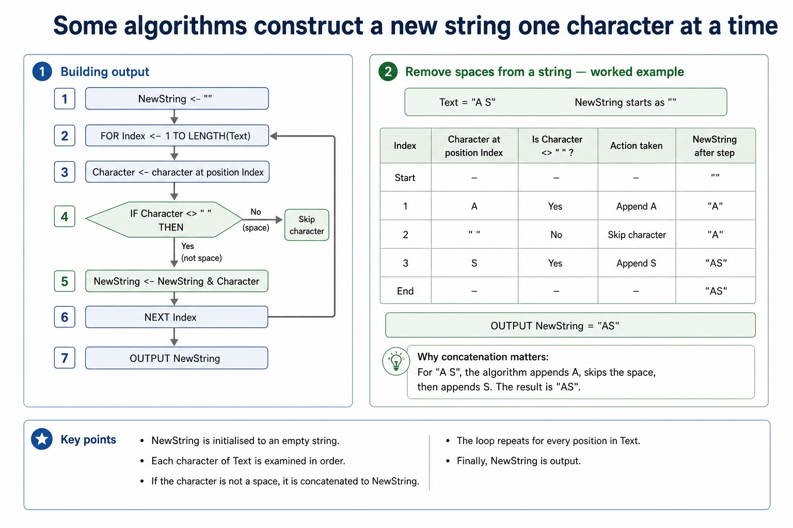
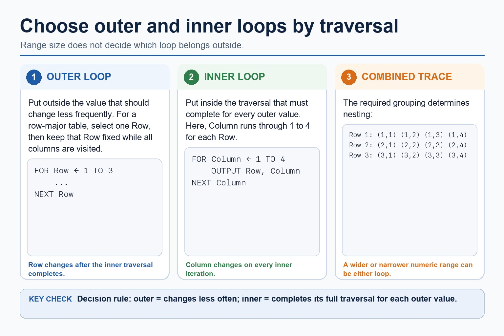
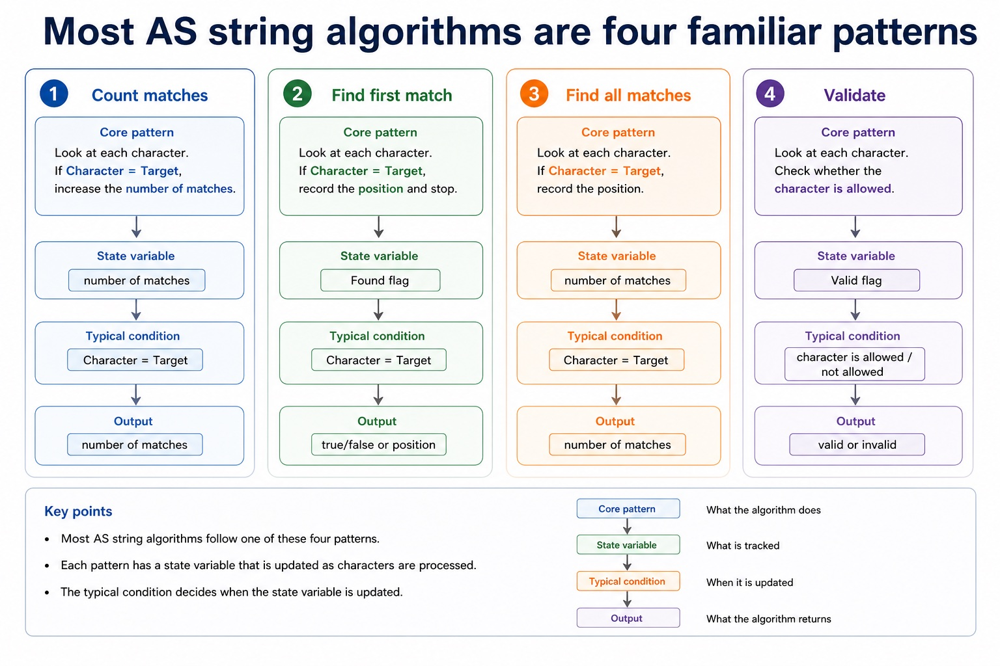
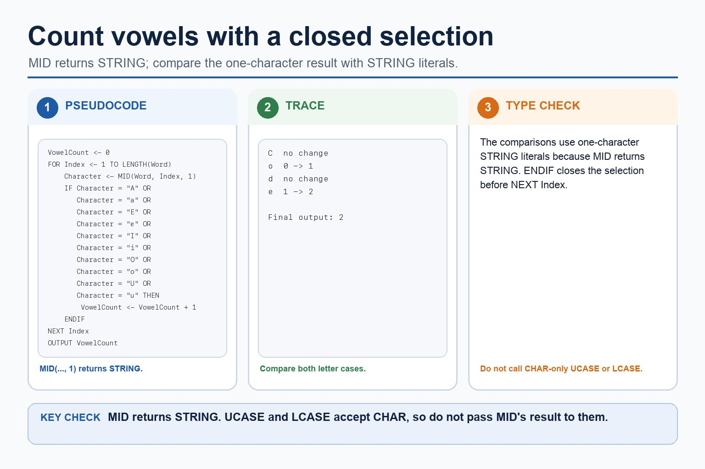
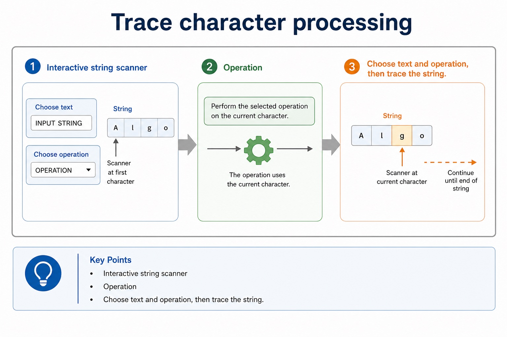

# Lesson 048: Algorithms and meaningful identifiers

**Course:** Cambridge International AS Level Computer Science 9618, 2027-2029 Version 2 
**Paper:** Paper 2 
**Syllabus:** Section 9: Algorithm design and problem-solving 
**Syllabus requirements:** S9.03, S9.04 
**Pacing:** Flexible. Select the material set and practice depth needed by the learner.

## Teaching-depth menu

- **Quick route:** Use the diagnostic, learning objectives, first worked example and foundation question. Stop once the learner can explain the central distinction accurately.
- **Full route:** Use every knowledge-point material set, the worked method, the terminology check and all questions.
- **Deep route:** Add the prerequisite refresher, ask learners to connect the concept checklist, discuss the labelled extension and complete a transfer question without a model answer.

## 1. Prerequisite knowledge and quick diagnostic

Recall the main conclusion from Lesson 047: Decomposition and modular problem solving.

Ask the learner to give one accurate definition or method step before continuing. If they cannot, briefly revisit the named prerequisite rather than repeating the whole previous lesson.

## 2. Knowledge explanation

### 1. Algorithm · Solution · Sequence · Defined steps (S9.03)

**Concept map:** algorithm → solution → sequence → defined steps

**Three-part explanation:**

1. An algorithm is a solution to a problem expressed as a sequence of defined steps
2. the definition requires both the problem-solving purpose and the defined sequence
3. The algorithm is the defined sequence INPUT TicketCount

**Concrete cue:** An algorithm is a solution to a problem expressed as a sequence of defined steps; the definition requires both the problem-solving purpose and the defined sequence.

#### An algorithm is a solution expressed as defined steps

Text transcript

- An algorithm is a solution to a problem expressed as a sequence of defined steps.
- Each step must be unambiguous, ordered where order matters and capable of being carried out.
- Identify what data is supplied, state the required transformation and state the exact result.
- Record limits, quantity requirements and supported assumptions.
- Check that every requirement maps to an input, process, output, constraint or assumption.

#### Stepwise refinement turns a high-level algorithm into implementable modules

Text transcript

- Stepwise refinement starts with a high-level algorithm and repeatedly replaces each complex step with a smaller sequence of defined substeps.
- Refinement stops when every step is precise enough to implement and its input and output are clear.
- At each level, preserve the parent step's purpose and input-process-output relationship.
- Related substeps can be expressed as program modules, including procedures that perform actions and functions that return calculated values.
- Every level must reduce ambiguity and collectively remain a complete solution.

#### Turn question wording into an algorithm plan

Text transcript

- Scenario triage
- Step 1: Output first
- Ask: what must be displayed, returned or stored at the end? The final output tells you which variables need to exist.
- Output needed: average rainfall
- Therefore:
- Total is needed
- Count is needed
- Average <- Total / Count

#### Sequence: steps run in a fixed order

Text transcript

- Knowledge explanation
- Sequence is used when every step must happen once, in order, with no branch and no repetition.
- INPUT Length
- INPUT Width
- Area <- Length Width
- OUTPUT Area

Precise syllabus wording

Understand what an algorithm is.

An algorithm is a solution to a problem expressed as a sequence of defined steps; the definition requires both the problem-solving purpose and the defined sequence.

### 2. Meaningful identifiers (S9.04)

**Concept map:** meaningful → identifier → names → table

**Three-part explanation:**

1. Students must choose suitable meaningful identifier names and construct an identifier table that records each identifier's name, data type and purpose for the designed algorithm
2. and choose meaningful identifiers recorded in an identifier table
3. An identifier table records at least the identifier name, data type and purpose

**Concrete cue:** Students must choose suitable meaningful identifier names and construct an identifier table that records each identifier's name, data type and purpose for the designed algorithm.

#### Dry run: execute the algorithm by hand

Text transcript

- 1 Copy the variable names into table columns.
- 2 Write initial values before the loop starts.
- 3 Use each input value in order.
- 4 Update variables exactly when pseudocode updates them.
- 5 Record output only when an OUTPUT statement is executed.

#### Turn paragraphs into a design table

Text transcript

- IPOC reading
- Question to ask
- Example evidence
- Algorithm consequence
- What data is provided?
- mark, price, password, reading
- use INPUT or given array/list item
- What must be calculated or checked?

#### Readable notation earns marks more easily

Text transcript

- Notation rules
- One entry Flowcharts should have a clear start and a clear direction of travel.
- Decision labels Decision outputs should be labelled, usually Yes/No or True/False.
- Indentation Indented pseudocode shows which statements belong inside a branch or loop.
- Matching endings Use ENDIF, NEXT, ENDWHILE or equivalent to close a structure clearly.
- Meaningful names Use Mark, Total, Count, Found instead of X1 unless the question gives X1.
- No mixed syntax Do not mix Java braces with Cambridge pseudocode keywords in the same answer.

#### A trace table records variables after each change

Text transcript

- Knowledge explanation
- What it records
- Exam note
- Line / step
- which statement is being executed
- optional, but useful for debugging
- Input value
- the test data read by INPUT

Precise syllabus wording

Choose meaningful identifier names and construct an identifier table.

Students must choose suitable meaningful identifier names and construct an identifier table that records each identifier's name, data type and purpose for the designed algorithm.

### Supporting diagram library

#### Abstraction: keep the details that affect the algorithm

Text transcript

- Keep details that affect an input, rule, calculation, constraint or output.
- Ignore decoration that does not change the required result.
- Ask whether removing a detail would change the result.
- Explain why a detail is relevant or irrelevant rather than only labelling it.

#### Decomposition: split the problem into sub-problems

Text transcript

- Split the whole task into meaningful sub-problems with distinct responsibilities.
- Express the resulting design as program modules with clear inputs, processing and outputs.
- A module may become a procedure that performs an action or a function that returns a value.
- Confirm that all modules connect into one complete solution.

#### Keep or ignore details

Text transcript

- Interactive abstraction filter

#### Produce an abstract model

Text transcript

- Underline the required output and keep only details that affect it.
- Create verb-based sub-problems with distinct responsibilities.
- State each sub-problem's input and output.
- Check that the parts collectively meet every requirement without gaps or overlap.
- The result is a natural-language responsibility plan ready for a later representation lesson.

#### Classify the design move

Text transcript

- Interactive task sorter
- Design statement
- Choose a statement to see whether it demonstrates decomposition, abstraction or an error.

#### Some algorithms construct a new string one character at a time

Text transcript

- Building output
- Remove spaces from a string
- NewString <- ""
- FOR Index <- 1 TO LENGTH(Text)
- Character <- character at position Index
- IF Character < " " THEN
- NewString <- NewString & Character
- NEXT Index

#### A string algorithm needs position, character and stopping point

Text transcript

- Knowledge explanation
- Concrete model
- In Cambridge-style reasoning, text is processed by taking one character at a time from a known position.
- Word <- "DATA"
- FOR Index <- 1 TO LENGTH(Word)
- Character <- character at position Index
- OUTPUT Character
- NEXT Index

#### Most AS string algorithms are four familiar patterns

Text transcript

- Core patterns
- State variable
- Typical condition
- Character = Target
- number of matches
- Found flag
- Character = Target
- true/false or position

#### Count vowels with a closed selection

Text transcript

- MID(Word, Index, 1) returns a one-character STRING, so compare it with both upper-case and lower-case vowel strings.
- Increment VowelCount only when the current one-character STRING is A, E, I, O, U, a, e, i, o or u.
- Close the vowel selection with ENDIF before NEXT Index.
- Do not pass the STRING returned by MID directly to CHAR-only UCASE or LCASE.

#### Trace character processing

Text transcript

- Interactive string scanner
- Operation
- Choose text and operation, then trace the string.

#### Turn vague answers into mark-worthy answers

Text transcript

- Interactive answer fixer
- Weak answer
- Choose a weak answer to see a stricter version.

#### Match the scenario to the correct algorithm pattern

Text transcript

- Pattern choice
- Scenario clue
- Core pseudocode feature
- One precise explanation
- exactly 10 readings
- Count-controlled loop
- FOR Index <- 1 TO 10
- The number of repetitions is known before the loop starts.

#### Paper 2 wants readable Cambridge-style pseudocode

Text transcript

- Initialise Total and Count, then input the first Value.
- While Value is not -1, add it to Total and increment Count.
- Input the next Value inside the WHILE body before ENDWHILE.
- If Count is greater than zero, calculate Average using real division and output it.
- Java may support understanding but is not the Cambridge pseudocode answer format.

#### Section 9 in one page

Text transcript

- Retrieval map
- Signal words
- Expected mechanism
- Typical marking error
- IPOC / decomposition
- scenario, requirements, constraints
- break problem into inputs, processing, outputs and rules
- copying the story without design decisions

Open precise terminology and exam facts

- An algorithm is a solution to a problem expressed as a sequence of defined steps; the definition requires both the problem-solving purpose and the defined sequence.
- Students must choose suitable meaningful identifier names and construct an identifier table that records each identifier's name, data type and purpose for the designed algorithm.
- An algorithm is a solution to a problem expressed as a sequence of defined steps. Each step must be unambiguous, ordered where order matters and capable of being carried out; a vague instruction such as 'process the data' is not a defined step.
- Before writing pseudocode, identify the input data, the processing that transforms it and the required output. This input-process-output design must describe a complete solution rather than three unrelated lists.
- Choose meaningful identifier names that describe each value's role. An identifier table records at least the identifier name, data type and purpose; its entries must match the pseudocode solution.
- Algorithm design review: define an algorithm as a solution expressed as a sequence of defined steps; use abstraction to retain essential details in an abstract model; use decomposition to express the problem as connected modules; and choose meaningful identifiers recorded in an identifier table.
- Solution review: design with input-process-output, use sequence, selection and iteration, document the same algorithm in structured English, a flowchart or pseudocode, and convert between the specified representations without changing its control flow.
- Development review: use stepwise refinement until steps are programmable, and construct and interpret logic statements that define decisions, loop conditions or Boolean values. Core answers must not replace these requirements with tracing, Java syntax or vague planning advice.

### Worked example

1. Define and plan a ticket algorithm
2. input TicketCount and TicketPrice, then output TotalCost.
3. The algorithm is the defined sequence INPUT TicketCount; INPUT TicketPrice; TotalCost <- TicketCount TicketPrice; OUTPUT TotalCost.
4. The identifier table records TicketCount
5. INTEGER, number requested; TicketPrice
6. REAL, price of one ticket; TotalCost

Beyond syllabus / 延伸知识（不要求背诵）: the same algorithm can be expressed in many programming languages; its logic should remain independent of syntax.
## 3. Practice by question type

### Question 1 - foundation - complete - 6 marks

Complete an identifier table and an input-process-output pseudocode solution that inputs a student's name and three marks, then outputs the calculated mean.

**Answer:** meaningful STRING identifier and purpose for the student's name; three clearly identified numeric mark inputs or a clearly bounded mark collection; meaningful REAL identifier and purpose for the mean; pseudocode inputs the required values; processing calculates the total and mean in a defined sequence; outputs the calculated mean and matches the identifier table

**Marking guidance:** Do not award an identifier list without types and purposes, or IPO headings without a complete sequence of defined steps.

**Common error:** For the command word complete, perform that exact action; do not replace it with an unrelated fact.

### Question 2 - application - state - 2 marks

State the official-style definition of an algorithm.

**Answer:** A solution to a problem expressed as a sequence of defined steps.

**Marking guidance:** Award one mark for each distinct, technically accurate point or method step.

**Common error:** Do not repeat the same point in different words; each mark needs a separate idea or method step.

### Question 3 - transfer - apply - 2 marks

What is an algorithm?

**Answer:** A solution to a problem expressed as a sequence of defined steps.

**Marking guidance:** Award one mark for each distinct, technically accurate point or method step.

**Common error:** Do not copy the worked example unchanged; transfer the method and check it against the new context.

### Related past-paper indexes

| Reference | Marks | Command word | Question type |
|---|---:|---|---|
| 9618/21/S/24 Q2(b) | 2 | complete | recall |
| 9618/22/W/23 Q2(a) | 5 | draw | diagram |
| 9618/22/W/23 Q1(a) | 4 | complete | recall |
| 9618/22/W/23 Q1(b) | 4 | complete | recall |

These are indexes only. Cambridge question and mark-scheme wording is not reproduced.

## 4. Summary and exam reminders

### Summary

- Define algorithms and meaningful identifiers with the exact technical vocabulary expected by the syllabus.
- Use the lesson method on a fresh context and show the intermediate decision, representation or calculation.
- Match the shape of the answer to the command word and the available marks.
- Check the final answer against the scenario instead of repeating a memorised sentence.

### Common error to correct

Students often create one sub-problem per tiny action. Correction: each sub-problem needs a meaningful responsibility.

### Exam technique

- Follow the command word: state gives a fact; explain links a cause to a consequence; compare covers both sides.
- Match the number of independent points or method steps to the available marks.
- For algorithms and meaningful identifiers, use the exact technical term before applying it to the scenario.
