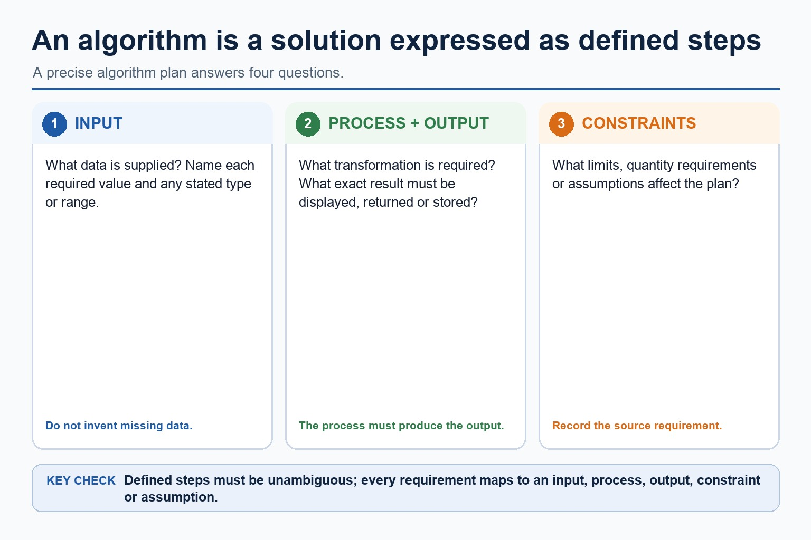

# Lesson 048: Algorithms and meaningful identifiers

**Course:** Cambridge International AS Level Computer Science 9618, 2027-2029 Version 2 
**Paper:** Paper 2 
**Syllabus:** Section 9: Algorithm design and problem-solving 
**Syllabus requirements:** S9.03, S9.04 
**Pacing:** Flexible. This lesson is deliberately over-complete; select a quick, full or deep route for the learners in front of you.

## Teaching-depth menu

- **Quick route:** Use the diagnostic, learning objectives, first worked example and foundation question. Stop once the learner can explain the central distinction accurately.
- **Full route:** Teach every core explanation point, the worked example and all lesson questions. Use the visual only when it adds a different representation.
- **Deep route:** Add the prerequisite refresher, ask learners to connect the concept checklist, discuss the labelled extension and complete a transfer question without a model answer.

## 1. Prerequisite knowledge and quick diagnostic

Recall the main conclusion from Lesson 047: Decomposition and modular problem solving.

Ask the learner to give one accurate definition or method step before continuing. If they cannot, briefly revisit the named prerequisite rather than repeating the whole previous lesson.

## 2. Knowledge explanation

### Learning objectives

- Understand what an algorithm is.
- Choose meaningful identifier names and construct an identifier table.

### Concept checklist for teacher choice

- algorithm
- solution
- sequence
- defined steps
- meaningful
- identifier
- names
- table

### Detailed explanation

- An algorithm is a solution to a problem expressed as a sequence of defined steps; the definition requires both the problem-solving purpose and the defined sequence.
- Students must choose suitable meaningful identifier names and construct an identifier table that records each identifier's name, data type and purpose for the designed algorithm.
- An algorithm is a solution to a problem expressed as a sequence of defined steps. Each step must be unambiguous, ordered where order matters and capable of being carried out; a vague instruction such as 'process the data' is not a defined step.
- Before writing pseudocode, identify the input data, the processing that transforms it and the required output. This input-process-output design must describe a complete solution rather than three unrelated lists.
- Choose meaningful identifier names that describe each value's role. An identifier table records at least the identifier name, data type and purpose; its entries must match the pseudocode solution.
- Algorithm design review: define an algorithm as a solution expressed as a sequence of defined steps; use abstraction to retain essential details in an abstract model; use decomposition to express the problem as connected modules; and choose meaningful identifiers recorded in an identifier table.
- Solution review: design with input-process-output, use sequence, selection and iteration, document the same algorithm in structured English, a flowchart or pseudocode, and convert between the specified representations without changing its control flow.
- Development review: use stepwise refinement until steps are programmable, and construct and interpret logic statements that define decisions, loop conditions or Boolean values. Core answers must not replace these requirements with tracing, Java syntax or vague planning advice.

### Worked example

Define and plan a ticket algorithm: Problem: input TicketCount and TicketPrice, then output TotalCost. The algorithm is the defined sequence INPUT TicketCount; INPUT TicketPrice; TotalCost <- TicketCount TicketPrice; OUTPUT TotalCost. The identifier table records TicketCount: INTEGER, number requested; TicketPrice: REAL, price of one ticket; TotalCost: REAL, calculated cost.

Beyond syllabus / 延伸知识（不要求背诵）: the same algorithm can be expressed in many programming languages; its logic should remain independent of syntax.

### Retained visual explanation

_An algorithm is a solution expressed as defined steps. The image and mobile text alternative come from one maintained fact source._

## 3. Practice by question type

### Question 1 - foundation - complete - 6 marks

Complete an identifier table and an input-process-output pseudocode solution that inputs a student's name and three marks, then outputs the calculated mean.

**Answer:** meaningful STRING identifier and purpose for the student's name; three clearly identified numeric mark inputs or a clearly bounded mark collection; meaningful REAL identifier and purpose for the mean; pseudocode inputs the required values; processing calculates the total and mean in a defined sequence; outputs the calculated mean and matches the identifier table

**Marking guidance:** Do not award an identifier list without types and purposes, or IPO headings without a complete sequence of defined steps.

**Common error:** For the command word complete, perform that exact action; do not replace it with an unrelated fact.

### Question 2 - application - state - 2 marks

State the official-style definition of an algorithm.

**Answer:** A solution to a problem expressed as a sequence of defined steps.

**Marking guidance:** Award one mark for each distinct, technically accurate point or method step.

**Common error:** Do not repeat the same point in different words; each mark needs a separate idea or method step.

### Question 3 - transfer - apply - 2 marks

What is an algorithm?

**Answer:** A solution to a problem expressed as a sequence of defined steps.

**Marking guidance:** Award one mark for each distinct, technically accurate point or method step.

**Common error:** Do not copy the worked example unchanged; transfer the method and check it against the new context.

### Related past-paper indexes

| Reference | Marks | Command word | Question type |
|---|---:|---|---|
| 9618/21/S/24 Q2(b) | 2 | complete | recall |
| 9618/22/W/23 Q2(a) | 5 | draw | diagram |
| 9618/22/W/23 Q1(a) | 4 | complete | recall |
| 9618/22/W/23 Q1(b) | 4 | complete | recall |

These are indexes only. Cambridge question and mark-scheme wording is not reproduced.

## 4. Summary and exam reminders

### Summary

- Define algorithms and meaningful identifiers with the exact technical vocabulary expected by the syllabus.
- Use the lesson method on a fresh context and show the intermediate decision, representation or calculation.
- Match the shape of the answer to the command word and the available marks.
- Check the final answer against the scenario instead of repeating a memorised sentence.

### Common error to correct

Students often create one sub-problem per tiny action. Correction: each sub-problem needs a meaningful responsibility.

### Exam technique

- Follow the command word: state gives a fact; explain links a cause to a consequence; compare covers both sides.
- Match the number of independent points or method steps to the available marks.
- For algorithms and meaningful identifiers, use the exact technical term before applying it to the scenario.
