# Lesson 049: Input-process-output solution design

**Course:** Cambridge International AS Level Computer Science 9618, 2027-2029 Version 2 
**Paper:** Paper 2 
**Syllabus:** Section 9: Algorithm design and problem-solving 
**Syllabus requirements:** S9.05 
**Pacing:** Flexible. Select the material set and practice depth needed by the learner.

## Teaching-depth menu

- **Quick route:** Use the diagnostic, learning objectives, first worked example and foundation question. Stop once the learner can explain the central distinction accurately.
- **Full route:** Use every knowledge-point material set, the worked method, the terminology check and all questions.
- **Deep route:** Add the prerequisite refresher, ask learners to connect the concept checklist, discuss the labelled extension and complete a transfer question without a model answer.

## 1. Prerequisite knowledge and quick diagnostic

Recall S9.03, S9.04 before starting this lesson.

Ask the learner to give one accurate definition or method step before continuing. If they cannot, briefly revisit the named prerequisite rather than repeating the whole previous lesson.

### Optional prerequisite refresher

- An algorithm is a solution to a problem expressed as a sequence of defined steps; the definition requires both the problem-solving purpose and the defined sequence.
- Understand what an algorithm is.
- Students must choose suitable meaningful identifier names and construct an identifier table that records each identifier's name, data type and purpose for the designed algorithm.
- Choose meaningful identifier names and construct an identifier table.

## 2. Knowledge explanation

### 1. Input-process-output · Design · Pseudocode · Solution (S9.05)

**Concept map:** input-process-output → design → pseudocode → solution

**Three-part explanation:**

1. Use input, process and output as the design structure for a complete pseudocode solution
2. the three parts must connect, use meaningful identifiers and satisfy the stated problem
3. This input-process-output design must describe a complete solution rather than three unrelated lists

**Concrete cue:** Use input, process and output as the design structure for a complete pseudocode solution; the three parts must connect, use meaningful identifiers and satisfy the stated problem.

#### Decomposition: split the problem into sub-problems

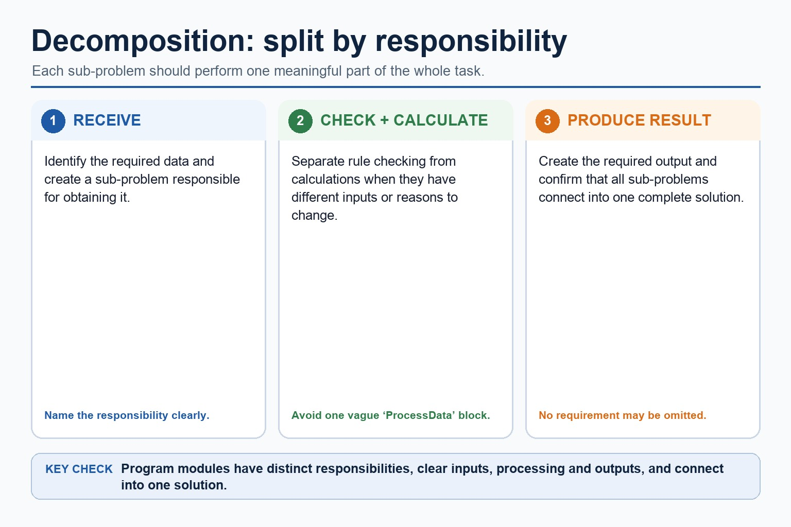

Text transcript

- Split the whole task into meaningful sub-problems with distinct responsibilities.
- Express the resulting design as program modules with clear inputs, processing and outputs.
- A module may become a procedure that performs an action or a function that returns a value.
- Confirm that all modules connect into one complete solution.

#### Trace Cambridge pseudocode in the exam; Java is only a support view

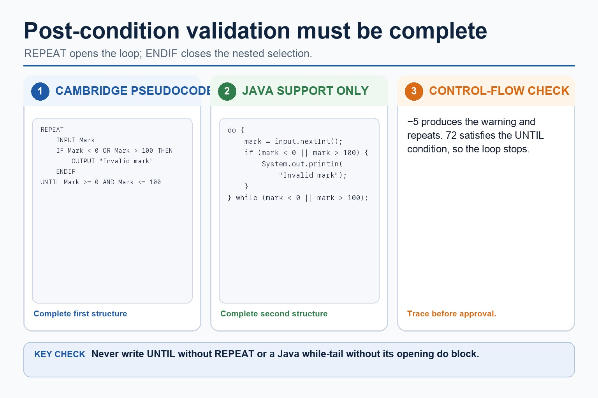

Text transcript

- Initialise Total to zero before a three-iteration loop.
- Input one Number and add it to Total during each iteration.
- Output Total once after the loop has processed all three numbers.
- A Java support version must preserve the same input, accumulation and final output.

#### An algorithm is a solution expressed as defined steps

Text transcript

- An algorithm is a solution to a problem expressed as a sequence of defined steps.
- Each step must be unambiguous, ordered where order matters and capable of being carried out.
- Identify what data is supplied, state the required transformation and state the exact result.
- Record limits, quantity requirements and supported assumptions.
- Check that every requirement maps to an input, process, output, constraint or assumption.

#### Match scenario to pseudocode structure

Text transcript

- Interactive structure tool
- Scenario clue
- Choose a clue to see the likely structure.

Precise syllabus wording

Use input-process-output to design pseudocode solutions.

Use input, process and output as the design structure for a complete pseudocode solution; the three parts must connect, use meaningful identifiers and satisfy the stated problem.

### Supporting diagram library

#### Abstraction: keep the details that affect the algorithm

Text transcript

- Keep details that affect an input, rule, calculation, constraint or output.
- Ignore decoration that does not change the required result.
- Ask whether removing a detail would change the result.
- Explain why a detail is relevant or irrelevant rather than only labelling it.

#### Keep or ignore details

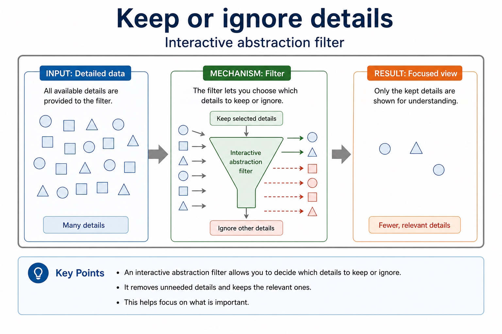

Text transcript

- Interactive abstraction filter

#### Turn paragraphs into a design table

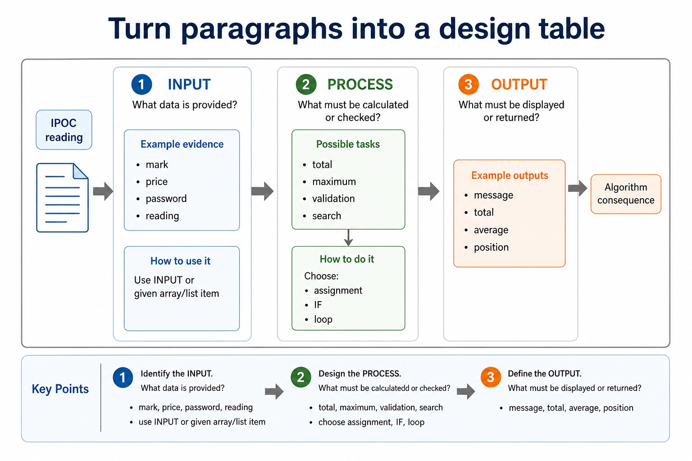

Text transcript

- IPOC reading
- Question to ask
- Example evidence
- Algorithm consequence
- What data is provided?
- mark, price, password, reading
- use INPUT or given array/list item
- What must be calculated or checked?

#### Produce an abstract model

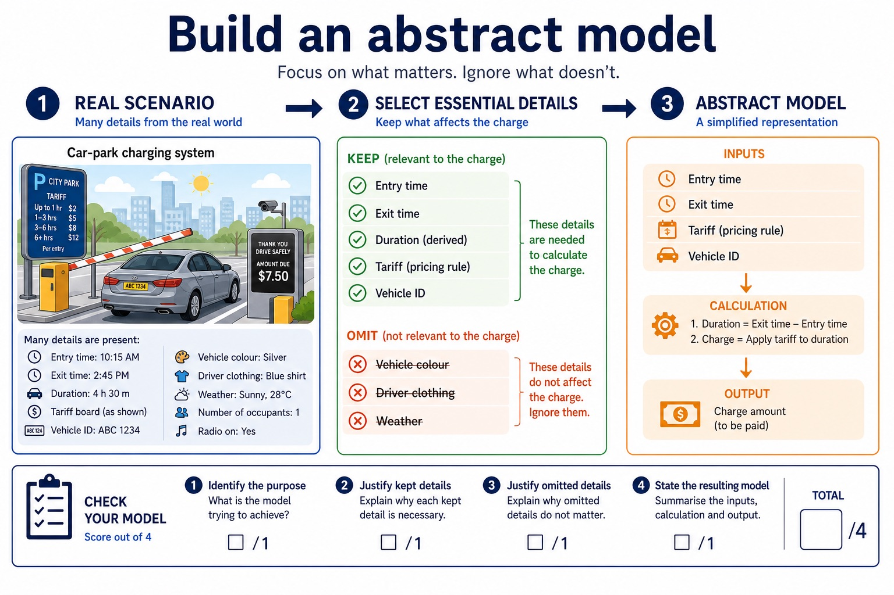

Text transcript

- Underline the required output and keep only details that affect it.
- Create verb-based sub-problems with distinct responsibilities.
- State each sub-problem's input and output.
- Check that the parts collectively meet every requirement without gaps or overlap.
- The result is a natural-language responsibility plan ready for a later representation lesson.

#### Classify the design move

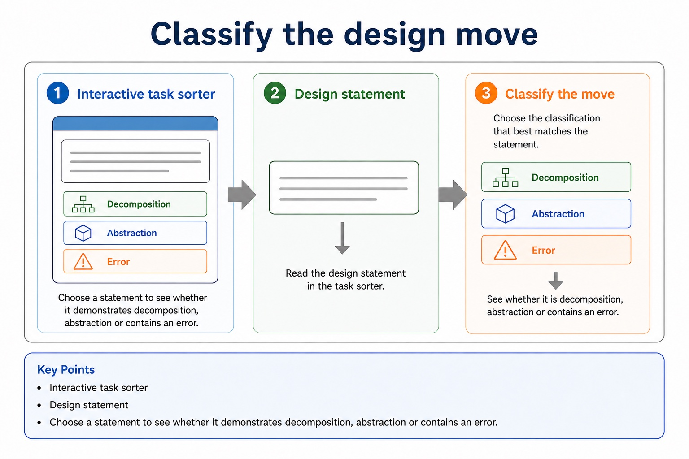

Text transcript

- Interactive task sorter
- Design statement
- Choose a statement to see whether it demonstrates decomposition, abstraction or an error.

#### Stepwise refinement turns a high-level algorithm into implementable modules

Text transcript

- Stepwise refinement starts with a high-level algorithm and repeatedly replaces each complex step with a smaller sequence of defined substeps.
- Refinement stops when every step is precise enough to implement and its input and output are clear.
- At each level, preserve the parent step's purpose and input-process-output relationship.
- Related substeps can be expressed as program modules, including procedures that perform actions and functions that return calculated values.
- Every level must reduce ambiguity and collectively remain a complete solution.

#### Dry run: execute the algorithm by hand

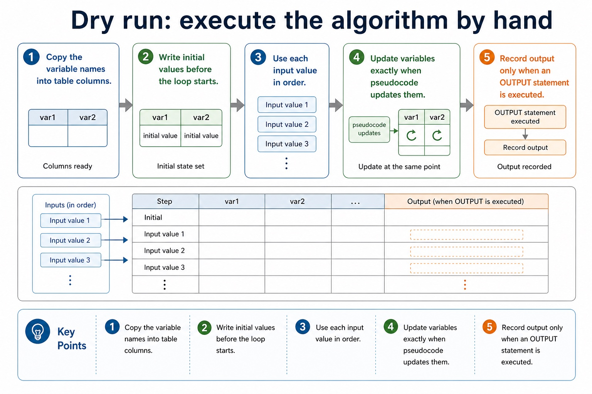

Text transcript

- 1 Copy the variable names into table columns.
- 2 Write initial values before the loop starts.
- 3 Use each input value in order.
- 4 Update variables exactly when pseudocode updates them.
- 5 Record output only when an OUTPUT statement is executed.

#### Loops make trace tables useful and slightly unforgiving

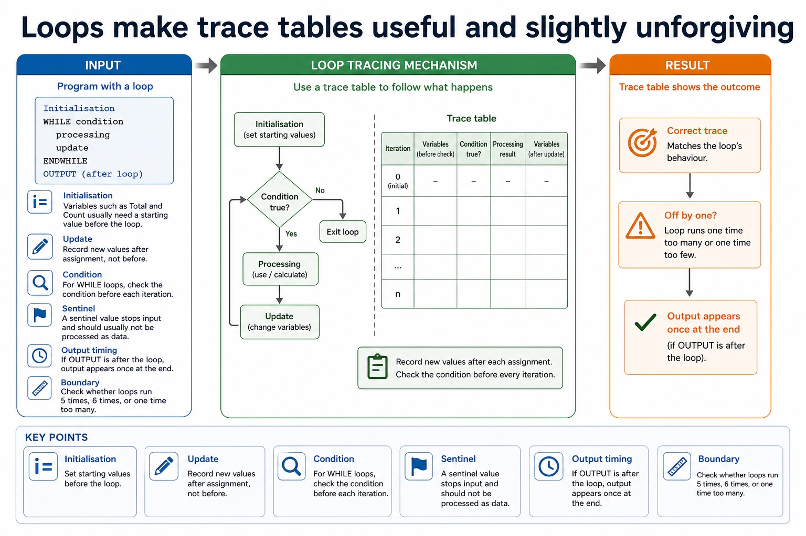

Text transcript

- Loop tracing
- Initialisation Variables such as Total and Count usually need a starting value before the loop.
- Update Record new values after assignment, not before.
- Condition For WHILE loops, check the condition before each iteration.
- Sentinel A sentinel value stops input and should usually not be processed as data.
- Output timing If OUTPUT is after the loop, output appears once at the end.
- Boundary Check whether loops run 5 times, 6 times, or one time too many.

#### Predict the final output

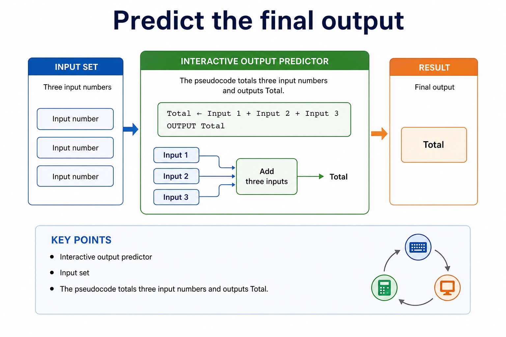

Text transcript

- Interactive output predictor
- Input set
- The pseudocode totals three input numbers and outputs Total.

#### A trace table records variables after each change

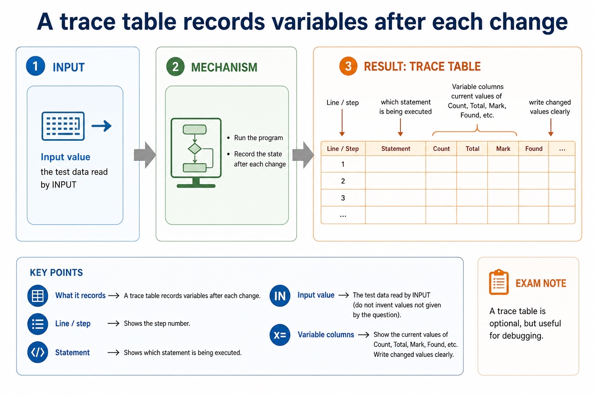

Text transcript

- Knowledge explanation
- What it records
- Exam note
- Line / step
- which statement is being executed
- optional, but useful for debugging
- Input value
- the test data read by INPUT

#### Convert Java-like syntax into Cambridge-style pseudocode

Text transcript

- Interactive Java cleaner
- Java-like fragment
- Choose a fragment to convert.

#### Convert meaning first, syntax second

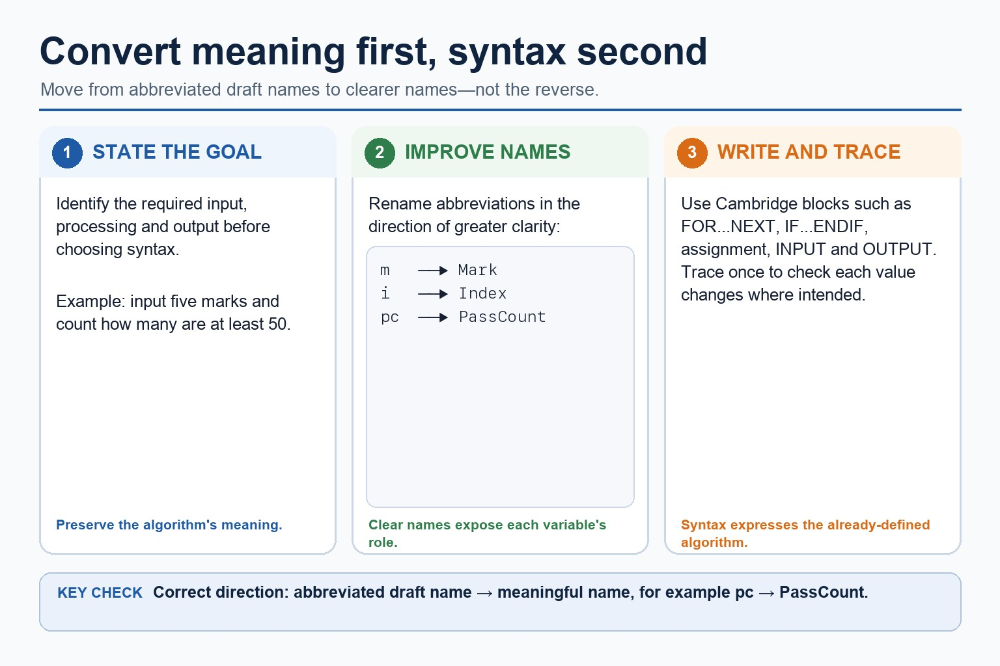

Text transcript

- Preserve the algorithm's meaning before converting notation or syntax.
- Rename abbreviated draft variables toward clearer names: m to Mark, i to Index and pc to PassCount.
- Use Cambridge blocks after the inputs, processing and outputs are defined.
- Trace the completed algorithm once to verify where each value changes.

#### Keep Java syntax out of Paper 2 unless Java is explicitly requested

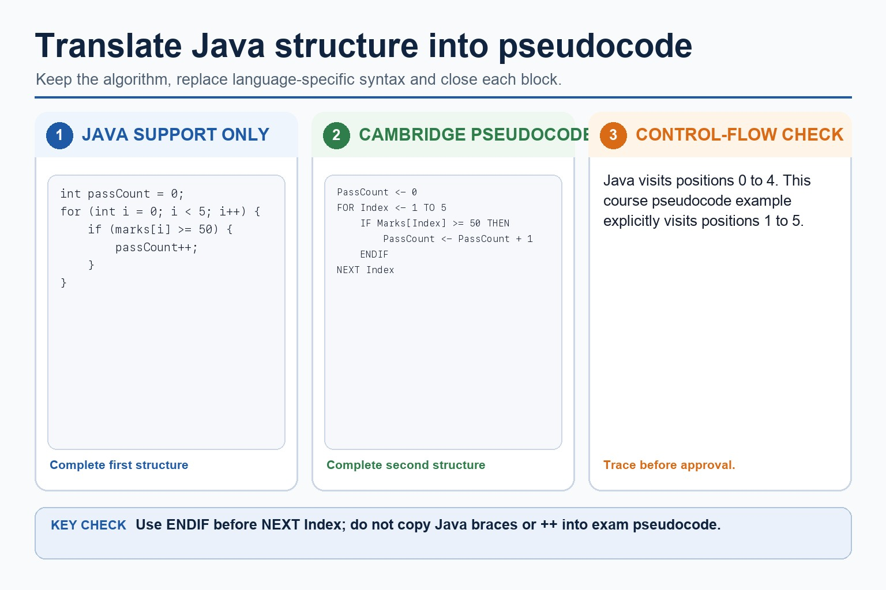

Text transcript

- Java braces, semicolons and increment operators are support syntax, not Cambridge pseudocode.
- In Cambridge pseudocode, initialise PassCount and iterate over explicitly defined array positions.
- Increment PassCount only when the current mark is at least 50.
- Close the conditional with ENDIF before NEXT Index.

#### Use the symbols that make algorithm intent visible

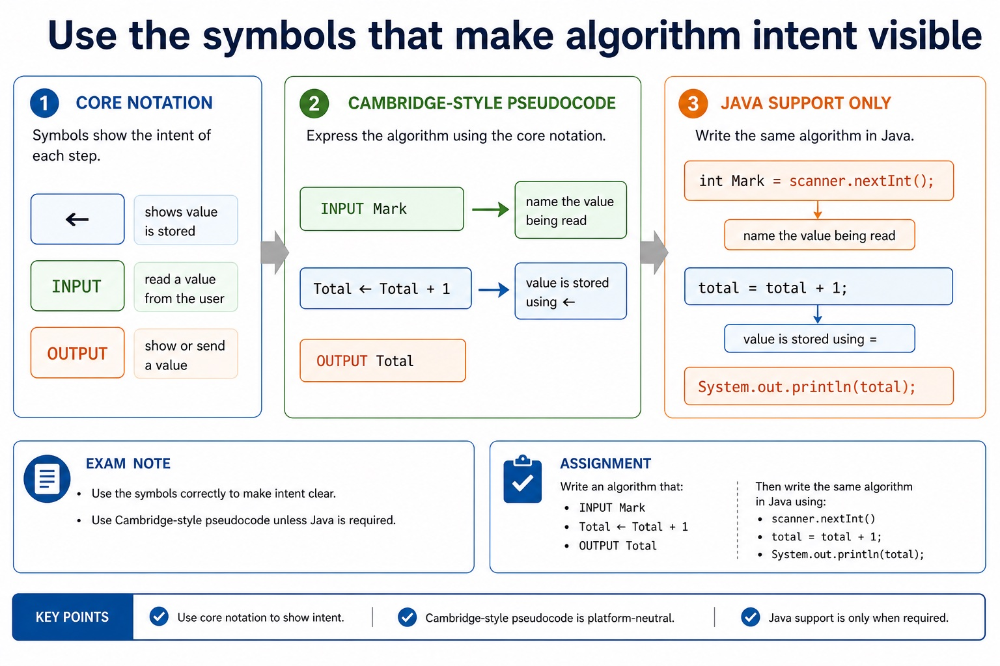

Text transcript

- Core notation
- Cambridge-style pseudocode
- Java support only
- Exam note
- Assignment
- Total <- Total + 1
- total = total + 1;
- <- shows value is stored

#### A marker should not need detective training

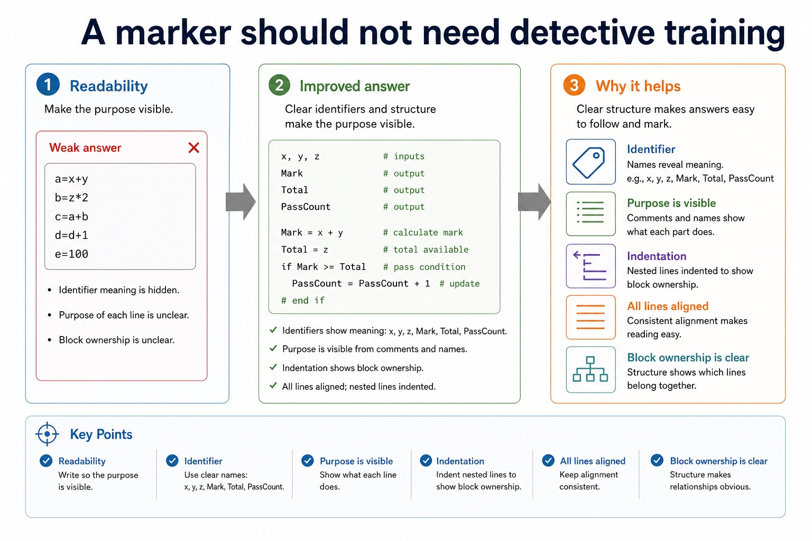

Text transcript

- Readability
- Weak answer
- Improved answer
- Why it helps
- Identifier
- x, y, z
- Mark, Total, PassCount
- purpose is visible

#### Every opening should have a visible ending

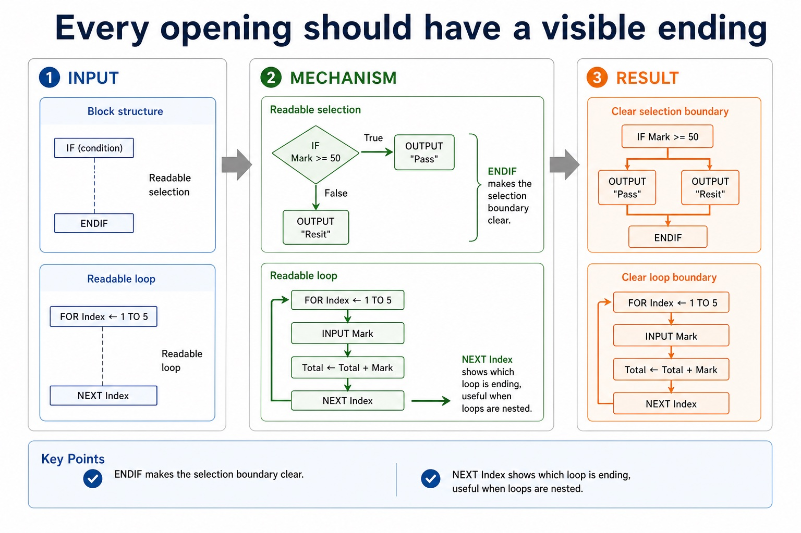

Text transcript

- Block structure
- Readable selection
- IF Mark = 50 THEN
- OUTPUT "Pass"
- OUTPUT "Resit"
- ENDIF makes the selection boundary clear.
- Readable loop
- FOR Index <- 1 TO 5

#### Turn vague answers into mark-worthy answers

Text transcript

- Interactive answer fixer
- Weak answer
- Choose a weak answer to see a stricter version.

#### Match the scenario to the correct algorithm pattern

Text transcript

- Pattern choice
- Scenario clue
- Core pseudocode feature
- One precise explanation
- exactly 10 readings
- Count-controlled loop
- FOR Index <- 1 TO 10
- The number of repetitions is known before the loop starts.

#### Paper 2 wants readable Cambridge-style pseudocode

Text transcript

- Initialise Total and Count, then input the first Value.
- While Value is not -1, add it to Total and increment Count.
- Input the next Value inside the WHILE body before ENDWHILE.
- If Count is greater than zero, calculate Average using real division and output it.
- Java may support understanding but is not the Cambridge pseudocode answer format.

#### Section 9 in one page

Text transcript

- Retrieval map
- Signal words
- Expected mechanism
- Typical marking error
- IPOC / decomposition
- scenario, requirements, constraints
- break problem into inputs, processing, outputs and rules
- copying the story without design decisions

#### Turn question wording into an algorithm plan

Text transcript

- Scenario triage
- Step 1: Output first
- Ask: what must be displayed, returned or stored at the end? The final output tells you which variables need to exist.
- Output needed: average rainfall
- Therefore:
- Total is needed
- Count is needed
- Average <- Total / Count

Open precise terminology and exam facts

- Use input, process and output as the design structure for a complete pseudocode solution; the three parts must connect, use meaningful identifiers and satisfy the stated problem.
- An algorithm is a solution to a problem expressed as a sequence of defined steps. Each step must be unambiguous, ordered where order matters and capable of being carried out; a vague instruction such as 'process the data' is not a defined step.
- Before writing pseudocode, identify the input data, the processing that transforms it and the required output. This input-process-output design must describe a complete solution rather than three unrelated lists.
- Choose meaningful identifier names that describe each value's role. An identifier table records at least the identifier name, data type and purpose; its entries must match the pseudocode solution.
- Stepwise refinement starts with a high-level algorithm and repeatedly replaces each complex step with a smaller sequence of defined substeps. Refinement stops when every step is precise enough to implement and its input and output are clear.
- At each level, preserve the parent step's purpose and input-process-output relationship. Related substeps can be expressed as program modules, including procedures that perform actions and functions that return calculated values.
- Refinement supports review, implementation and testing because each module has a limited responsibility. It is not merely adding prose: every level must reduce ambiguity and collectively remain a complete solution.
- Algorithm design review: define an algorithm as a solution expressed as a sequence of defined steps; use abstraction to retain essential details in an abstract model; use decomposition to express the problem as connected modules; and choose meaningful identifiers recorded in an identifier table.
- Solution review: design with input-process-output, use sequence, selection and iteration, document the same algorithm in structured English, a flowchart or pseudocode, and convert between the specified representations without changing its control flow.
- Development review: use stepwise refinement until steps are programmable, and construct and interpret logic statements that define decisions, loop conditions or Boolean values. Core answers must not replace these requirements with tracing, Java syntax or vague planning advice.

### Worked example

1. Design a result-processing solution
2. Keep only student ID and required marks, decompose the task into InputResults, ValidateResult, CalculateMean and OutputReport, record meaningful identifiers and IPO, refine CalculateMean into defined steps, use a range logic statement, and…

Beyond syllabus / 延伸知识（不要求背诵）: the same algorithm can be expressed in many programming languages; its logic should remain independent of syntax.
## 3. Practice by question type

### Question 1 - foundation - state - 2 marks

State the input, process and output for rectangle area.

**Answer:** Inputs Length and Width; process multiply Length by Width; output Area.

**Marking guidance:** Award one mark for each distinct, technically accurate point or method step.

**Common error:** For the command word state, perform that exact action; do not replace it with an unrelated fact.

### Question 2 - application - state - 2 marks

State two precise facts about input-process-output solution design.

**Answer:** Use input, process and output as the design structure for a complete pseudocode solution; the three parts must connect, use meaningful identifiers and satisfy the stated problem. An algorithm is a solution to a problem expressed as a sequence of defined steps. Each step must be unambiguous, ordered where order matters and capable of being carried out; a vague instruction such as 'process the data' is not a defined step.

**Marking guidance:** Award one mark for each distinct fact; do not credit a repeated point.

**Common error:** Do not repeat the same point in different words; each mark needs a separate idea or method step.

### Question 3 - transfer - explain - 3 marks

Explain how input-process-output solution design would be applied in a suitable computing context.

**Answer:** An algorithm is a solution to a problem expressed as a sequence of defined steps. Each step must be unambiguous, ordered where order matters and capable of being carried out; a vague instruction such as 'process the data' is not a defined step. Before writing pseudocode, identify the input data, the processing that transforms it and the required output. This input-process-output design must describe a complete solution rather than three unrelated lists. Choose meaningful identifier names that describe each value's role. An identifier table records at least the identifier name, data type and purpose; its entries must match the pseudocode solution.

**Marking guidance:** Each mark needs a relevant point linked to the stated context.

**Common error:** Do not copy the worked example unchanged; transfer the method and check it against the new context.

### Related past-paper indexes

| Reference | Marks | Command word | Question type |
|---|---:|---|---|
| 9618/21/S/24 Q2(a) | 5 | complete | recall |
| 9618/22/S/24 Q2(a) | 5 | complete | recall |
| 9618/22/S/24 Q2(b) | 5 | complete | write |
| 9618/23/S/23 Q1(d) | 4 | complete | recall |

These are indexes only. Cambridge question and mark-scheme wording is not reproduced.

## 4. Summary and exam reminders

### Summary

- Define input-process-output solution design with the exact technical vocabulary expected by the syllabus.
- Use the lesson method on a fresh context and show the intermediate decision, representation or calculation.
- Match the shape of the answer to the command word and the available marks.
- Check the final answer against the scenario instead of repeating a memorised sentence.

### Common error to correct

Students often create one sub-problem per tiny action. Correction: each sub-problem needs a meaningful responsibility.

### Exam technique

- Follow the command word: state gives a fact; explain links a cause to a consequence; compare covers both sides.
- Match the number of independent points or method steps to the available marks.
- For input-process-output solution design, use the exact technical term before applying it to the scenario.
