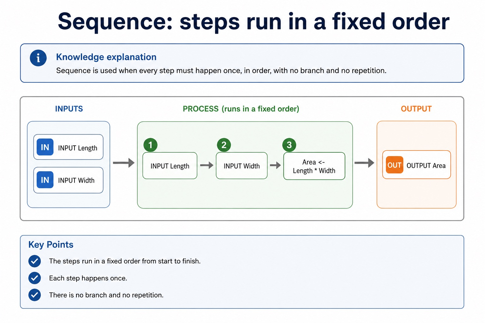
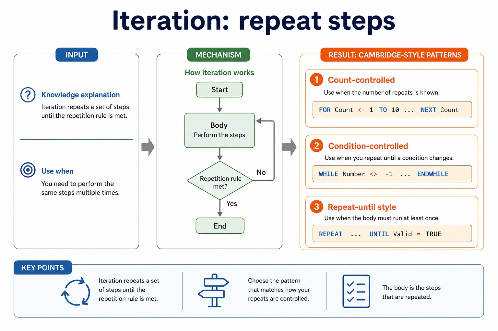
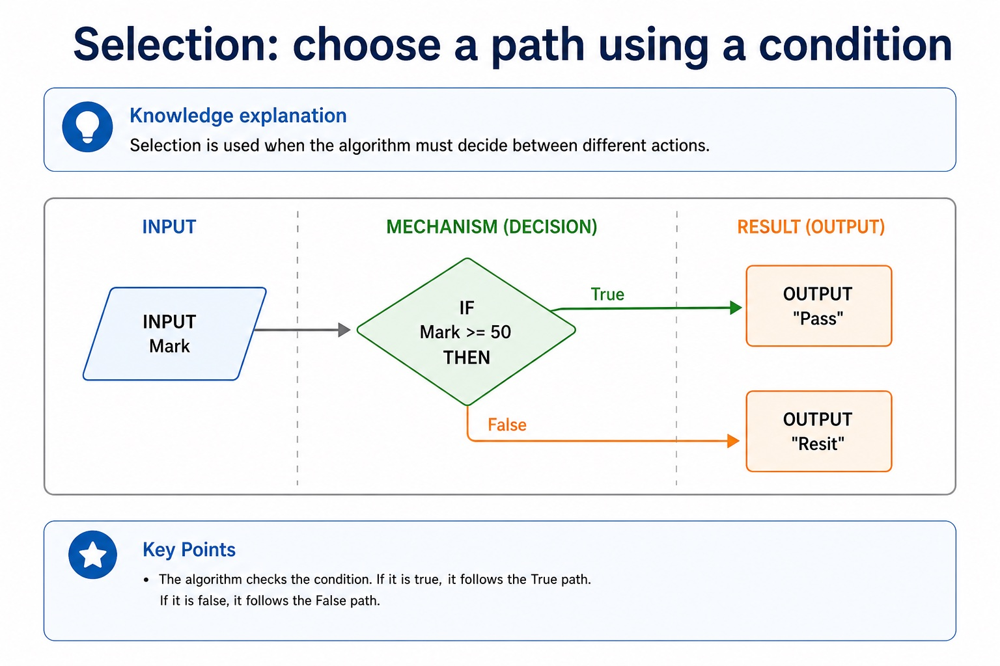

# Lesson 050: Sequence, selection and iteration

**Course:** Cambridge International AS Level Computer Science 9618, 2027-2029 Version 2 
**Paper:** Paper 2 
**Syllabus:** Section 9: Algorithm design and problem-solving 
**Syllabus requirements:** S9.06 
**Pacing:** Flexible. Select the material set and practice depth needed by the learner.

## Teaching-depth menu

- **Quick route:** Use the diagnostic, learning objectives, first worked example and foundation question. Stop once the learner can explain the central distinction accurately.
- **Full route:** Use every knowledge-point material set, the worked method, the terminology check and all questions.
- **Deep route:** Add the prerequisite refresher, ask learners to connect the concept checklist, discuss the labelled extension and complete a transfer question without a model answer.

## 1. Prerequisite knowledge and quick diagnostic

Recall S9.03 before starting this lesson.

Ask the learner to give one accurate definition or method step before continuing. If they cannot, briefly revisit the named prerequisite rather than repeating the whole previous lesson.

### Optional prerequisite refresher

- An algorithm is a solution to a problem expressed as a sequence of defined steps; the definition requires both the problem-solving purpose and the defined sequence.
- Understand what an algorithm is.

## 2. Knowledge explanation

### 1. Sequence · Selection · Iteration (S9.06)

**Concept map:** sequence → selection → iteration

**Three-part explanation:**

1. The three basic algorithm constructs are sequence, selection and iteration (repetition)
2. students must recognise and use each construct, including combinations of constructs
3. design with input-process-output, use sequence, selection and iteration, document the same algorithm in structured English, a flowchart or pseudocode, and convert between the specified representations without…

**Concrete cue:** The three basic algorithm constructs are sequence, selection and iteration (repetition); students must recognise and use each construct, including combinations of constructs.

#### Real algorithms usually combine the three structures

Text transcript

- Combining structures
- 1 Use sequence to initialise variables and read inputs.
- 2 Use iteration when the same action happens repeatedly.
- 3 Use selection inside the loop when each item needs a decision.
- 4 Use sequence after the loop to calculate or output final results.
- 5 Indent nested structures so the examiner can see the logic.

#### Sequence: steps run in a fixed order

Text transcript

- Knowledge explanation
- Sequence is used when every step must happen once, in order, with no branch and no repetition.
- INPUT Length
- INPUT Width
- Area <- Length Width
- OUTPUT Area

#### Stepwise refinement turns a high-level algorithm into implementable modules

Text transcript

- Stepwise refinement starts with a high-level algorithm and repeatedly replaces each complex step with a smaller sequence of defined substeps.
- Refinement stops when every step is precise enough to implement and its input and output are clear.
- At each level, preserve the parent step's purpose and input-process-output relationship.
- Related substeps can be expressed as program modules, including procedures that perform actions and functions that return calculated values.
- Every level must reduce ambiguity and collectively remain a complete solution.

Precise syllabus wording

Understand and use sequence, selection and iteration.

The three basic algorithm constructs are sequence, selection and iteration (repetition); students must recognise and use each construct, including combinations of constructs.

### Supporting diagram library

#### Iteration: repeat steps

Text transcript

- Knowledge explanation
- Use when
- Cambridge-style pattern
- Count-controlled
- the number of repeats is known
- FOR Count <- 1 TO 10 ... NEXT Count
- Condition-controlled
- repeat until a condition changes

#### Cambridge pseudocode is the exam form; Java is support only

Text transcript

- Initialise PassCount to zero before processing five marks.
- Input Mark inside the FOR loop and increment PassCount only when Mark is at least 50.
- Close the conditional with ENDIF before NEXT Count.
- Output PassCount after the loop.

#### Selection: choose a path using a condition

Text transcript

- Knowledge explanation
- Selection is used when the algorithm must decide between different actions.
- INPUT Mark
- IF Mark = 50 THEN
- OUTPUT "Pass"
- OUTPUT "Resit"

#### Turn vague answers into mark-worthy answers

Text transcript

- Interactive answer fixer
- Weak answer
- Choose a weak answer to see a stricter version.

#### Match the scenario to the correct algorithm pattern

Text transcript

- Pattern choice
- Scenario clue
- Core pseudocode feature
- One precise explanation
- exactly 10 readings
- Count-controlled loop
- FOR Index <- 1 TO 10
- The number of repetitions is known before the loop starts.

#### Paper 2 wants readable Cambridge-style pseudocode

Text transcript

- Initialise Total and Count, then input the first Value.
- While Value is not -1, add it to Total and increment Count.
- Input the next Value inside the WHILE body before ENDWHILE.
- If Count is greater than zero, calculate Average using real division and output it.
- Java may support understanding but is not the Cambridge pseudocode answer format.

#### Section 9 in one page

Text transcript

- Retrieval map
- Signal words
- Expected mechanism
- Typical marking error
- IPOC / decomposition
- scenario, requirements, constraints
- break problem into inputs, processing, outputs and rules
- copying the story without design decisions

#### Turn question wording into an algorithm plan

Text transcript

- Scenario triage
- Step 1: Output first
- Ask: what must be displayed, returned or stored at the end? The final output tells you which variables need to exist.
- Output needed: average rainfall
- Therefore:
- Total is needed
- Count is needed
- Average <- Total / Count

Open precise terminology and exam facts

- The three basic algorithm constructs are sequence, selection and iteration (repetition); students must recognise and use each construct, including combinations of constructs.
- Sequence executes defined steps once in order. Selection chooses one of two or more paths using a condition. Iteration repeats one or more steps using a count or a condition.
- A complete algorithm often combines the three constructs: use sequence to initialise and input, iteration to process repeated items, and selection inside the loop when each item needs a decision.
- Choose the construct from the required behaviour. A known number of repetitions suggests count-controlled iteration; a stopping rule based on data suggests condition-controlled iteration.
- Algorithm design review: define an algorithm as a solution expressed as a sequence of defined steps; use abstraction to retain essential details in an abstract model; use decomposition to express the problem as connected modules; and choose meaningful identifiers recorded in an identifier table.
- Solution review: design with input-process-output, use sequence, selection and iteration, document the same algorithm in structured English, a flowchart or pseudocode, and convert between the specified representations without changing its control flow.
- Development review: use stepwise refinement until steps are programmable, and construct and interpret logic statements that define decisions, loop conditions or Boolean values. Core answers must not replace these requirements with tracing, Java syntax or vague planning advice.

### Worked example

1. Count five passing marks
2. Sequence sets PassCount to 0.
3. A FOR loop iterates through five marks.
4. Inside the loop, selection tests Mark = 50 and increments PassCount only on the true path.
5. Sequence after the loop outputs PassCount.

Beyond syllabus / 延伸知识（不要求背诵）: the same algorithm can be expressed in many programming languages; its logic should remain independent of syntax.
## 3. Practice by question type

### Question 1 - foundation - explain - 4 marks

Develop a short algorithm that inputs ten marks and outputs how many are passes, labelling where sequence, selection and iteration are used.

**Answer:** sequence initialises the pass count; iteration processes exactly ten marks; selection tests each mark against the pass condition; sequence outputs the final count after the loop

**Marking guidance:** Do not award a construct name unless the stated algorithm uses it for the correct behaviour.

**Common error:** For the command word explain, perform that exact action; do not replace it with an unrelated fact.

### Question 2 - application - construct - 2 marks

Which construct executes steps once in a fixed order?

**Answer:** Sequence.

**Marking guidance:** Award one mark for each distinct, technically accurate point or method step.

**Common error:** Do not repeat the same point in different words; each mark needs a separate idea or method step.

### Question 3 - transfer - construct - 2 marks

Which construct chooses between Pass and Resit?

**Answer:** Selection.

**Marking guidance:** Award one mark for each distinct, technically accurate point or method step.

**Common error:** Do not copy the worked example unchanged; transfer the method and check it against the new context.

## 4. Summary and exam reminders

### Summary

- Define sequence, selection and iteration with the exact technical vocabulary expected by the syllabus.
- Use the lesson method on a fresh context and show the intermediate decision, representation or calculation.
- Match the shape of the answer to the command word and the available marks.
- Check the final answer against the scenario instead of repeating a memorised sentence.

### Common error to correct

Students often start coding before defining the output. Correction: an algorithm is easier to design when the required result is known first.

### Exam technique

- Follow the command word: state gives a fact; explain links a cause to a consequence; compare covers both sides.
- Match the number of independent points or method steps to the available marks.
- For sequence, selection and iteration, use the exact technical term before applying it to the scenario.
