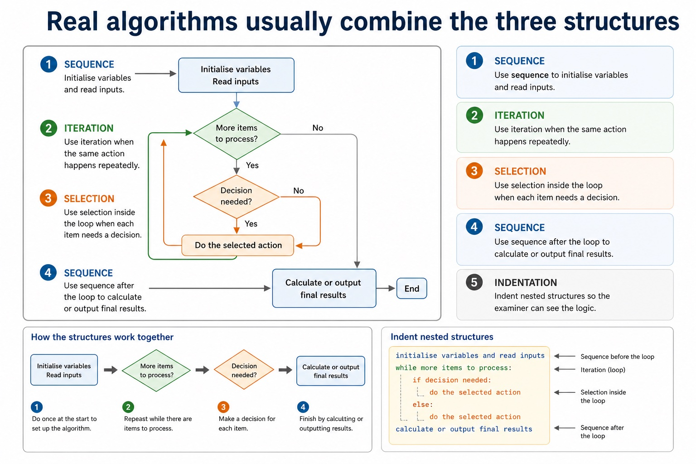

# Lesson 050: Sequence, selection and iteration

**Course:** Cambridge International AS Level Computer Science 9618, syllabus for examination in 2027-2029 
**Paper:** Paper 2 
**Syllabus:** Section 9: Algorithm design and problem-solving 
**Syllabus requirements:** S9.06 
**Pacing:** Flexible. Select a quick, full or deep route for the learners in front of you.

## Teaching-depth menu

- **Quick route:** Use the diagnostic, learning objectives, first worked example and foundation question. Stop once the learner can explain the central distinction accurately.
- **Full route:** Teach every knowledge-point material set, the worked method and all lesson questions.
- **Deep route:** Add the prerequisite refresher, ask learners to connect the concept checklist, discuss the labelled extension and complete a transfer question without a model answer.

## 1. Prerequisite knowledge and quick diagnostic

Recall S9.03 before starting this lesson.

Ask the learner to give one accurate definition or method step before continuing. If they cannot, briefly revisit the named prerequisite rather than repeating the whole previous lesson.

### Optional prerequisite refresher

- An algorithm is a solution to a problem expressed as a sequence of defined steps; the definition requires both the problem-solving purpose and the defined sequence.
- Understand what an algorithm is.

## 2. Knowledge explanation

### 1. And use sequence, selection and iteration (S9.06)

**Atomic learning targets**

- **S9.06.A01:** sequence
- **S9.06.A02:** selection
- **S9.06.A03:** iteration

**Core explanation**

- Algorithm design review: define an algorithm as a solution expressed as a sequence of defined steps; use abstraction to retain essential details in an abstract model; use decomposition to express the problem as connected modules; and choose meaningful identifiers recorded in an identifier table.
- Solution review: design with input-process-output, use sequence, selection and iteration, document the same algorithm in structured English, a flowchart or pseudocode, and convert between the specified representations without changing its control flow.
- A complete algorithm often combines the three constructs: use sequence to initialise and input, iteration to process repeated items, and selection inside the loop when each item needs a decision.

**Mechanism or method**

1. **Identify the relevant condition or input** — Algorithm design review: define an algorithm as a solution expressed as a sequence of defined steps;
2. **Trace how the process works** — use abstraction to retain essential details in an abstract model;
3. **Connect the mechanism to its result** — use decomposition to express the problem as connected modules;

#### Worked example: And use sequence, selection and iteration: complete worked route

1. **Identify the relevant condition or input**

Algorithm design review: define an algorithm as a solution expressed as a sequence of defined steps;

2. **Trace how the process works**

use abstraction to retain essential details in an abstract model;

3. **Connect the mechanism to its result**

use decomposition to express the problem as connected modules;

4. **Complete example**

Count five passing marks: Sequence sets PassCount to 0. Inside the loop, selection tests Mark = 50 and increments PassCount only on the true path.

**Misconceptions to correct**

- Students often start coding before defining the output. Correction: an algorithm is easier to design when the required result is known first.

#### Mastery check (MC-L050-S9.06)

Explain the following targets in one connected answer, using a concrete example for each: sequence; selection; iteration.

Answer criteria

- Algorithm design review: define an algorithm as a solution expressed as a sequence of defined steps; use abstraction to retain essential details in an abstract model; use decomposition to express the problem as connected modules; and choose meaningful identifiers recorded in an identifier table.
- Solution review: design with input-process-output, use sequence, selection and iteration, document the same algorithm in structured English, a flowchart or pseudocode, and convert between the specified representations without changing its control flow.
- A complete algorithm often combines the three constructs: use sequence to initialise and input, iteration to process repeated items, and selection inside the loop when each item needs a decision.

**Supplementary concept map**

- **Sequence:** Steps in order
- **Selection:** Choose a branch
- **Iteration:** Repeat controlled steps
- **Combination:** Constructs can be nested
- **Control flow:** Determines the next executed step

**Supplementary three-step recap**

1. **Translate the stated design** — And use sequence, selection and iteration.
2. **Apply one complete operation** — The three basic algorithm constructs are sequence, selection and iteration (repetition)
3. **Trace state and boundaries** — Sequence to initialise and input, iteration to process repeated items, and selection inside the loop when each item…

**Real algorithms usually combine the three structures:** Combining structures 1 Use sequence to initialise variables and read inputs.

#### Real algorithms usually combine the three structures

Text transcript

- Combining structures
- 1 Use sequence to initialise variables and read inputs.
- 2 Use iteration when the same action happens repeatedly.
- 3 Use selection inside the loop when each item needs a decision.
- 4 Use sequence after the loop to calculate or output final results.
- 5 Indent nested structures so the examiner can see the logic.

Precise syllabus wording

Understand and use sequence, selection and iteration.

The three basic algorithm constructs are sequence, selection and iteration (repetition); students must recognise and use each construct, including combinations of constructs.

### Lesson technical reference

- The three basic algorithm constructs are sequence, selection and iteration (repetition); students must recognise and use each construct, including combinations of constructs.
- Sequence executes defined steps once in order. Selection chooses one of two or more paths using a condition. Iteration repeats one or more steps using a count or a condition.
- A complete algorithm often combines the three constructs: use sequence to initialise and input, iteration to process repeated items, and selection inside the loop when each item needs a decision.
- Choose the construct from the required behaviour. A known number of repetitions suggests count-controlled iteration; a stopping rule based on data suggests condition-controlled iteration.
- Algorithm design review: define an algorithm as a solution expressed as a sequence of defined steps; use abstraction to retain essential details in an abstract model; use decomposition to express the problem as connected modules; and choose meaningful identifiers recorded in an identifier table.
- Solution review: design with input-process-output, use sequence, selection and iteration, document the same algorithm in structured English, a flowchart or pseudocode, and convert between the specified representations without changing its control flow.
- Development review: use stepwise refinement until steps are programmable, and construct and interpret logic statements that define decisions, loop conditions or Boolean values. Core answers must not replace these requirements with tracing, Java syntax or vague planning advice.

Beyond syllabus / 延伸知识（不要求背诵）: the same algorithm can be expressed in many programming languages; its logic should remain independent of syntax.
## 3. Practice by question type

### Question 1 - foundation - explain - 4 marks

Develop a short algorithm that inputs ten marks and outputs how many are passes, labelling where sequence, selection and iteration are used.

**Answer:** sequence initialises the pass count; iteration processes exactly ten marks; selection tests each mark against the pass condition; sequence outputs the final count after the loop

**Marking guidance:** Do not award a construct name unless the stated algorithm uses it for the correct behaviour.

**Common error:** For the command word explain, perform that exact action; do not replace it with an unrelated fact.

### Question 2 - application - construct - 2 marks

Which construct executes steps once in a fixed order?

**Answer:** Sequence.

**Marking guidance:** Award one mark for each distinct, technically accurate point or method step.

**Common error:** Do not repeat the same point in different words; each mark needs a separate idea or method step.

### Question 3 - transfer - construct - 2 marks

Which construct chooses between Pass and Resit?

**Answer:** Selection.

**Marking guidance:** Award one mark for each distinct, technically accurate point or method step.

**Common error:** Do not copy the worked example unchanged; transfer the method and check it against the new context.

## 4. Summary and exam reminders

### Summary

- S9.06: explain sequence, selection, iteration.
- S9.06 method: Identify the relevant condition or input → Trace how the process works → Connect the mechanism to its result.
- Correction to remember: Students often start coding before defining the output. Correction: an algorithm is easier to design when the required result is known first.

### Common error to correct

Students often start coding before defining the output. Correction: an algorithm is easier to design when the required result is known first.

### Exam technique

- Follow the command word: state gives a fact; explain links a cause to a consequence; compare covers both sides.
- Match the number of independent points or method steps to the available marks.
- For sequence, selection and iteration, use the exact technical term before applying it to the scenario.
