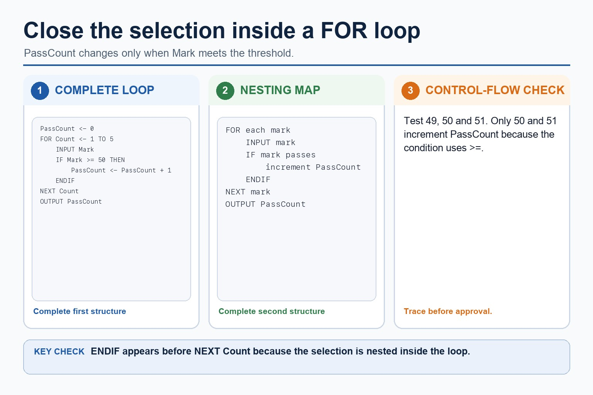
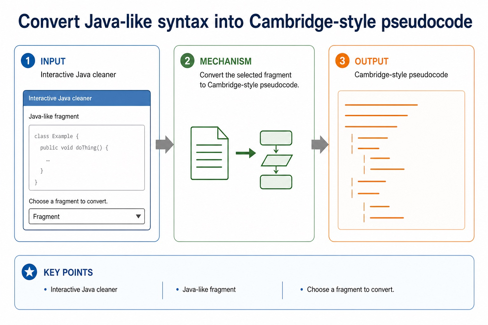
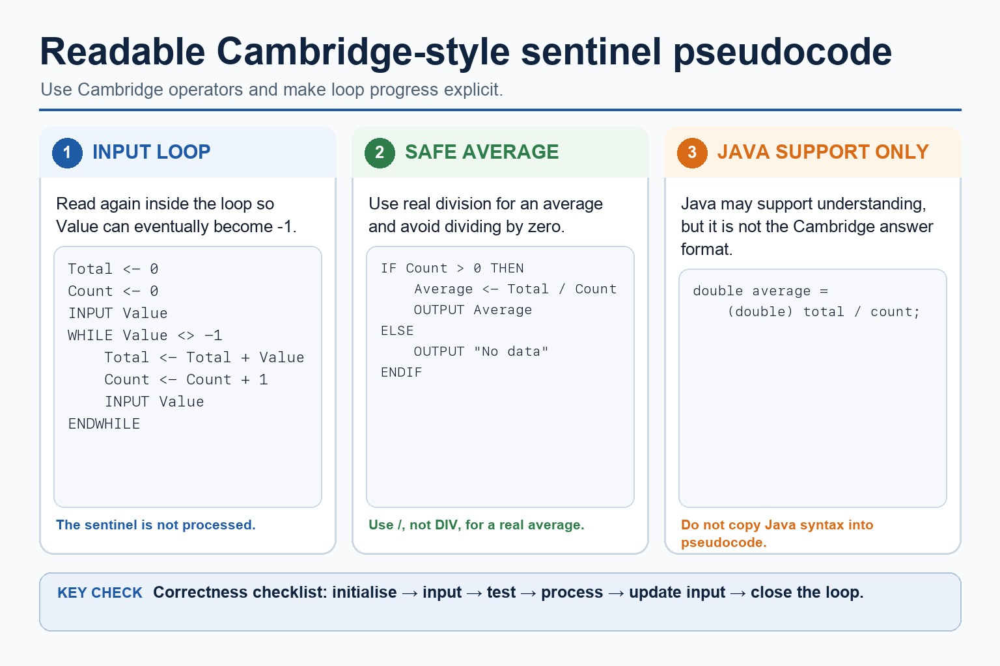
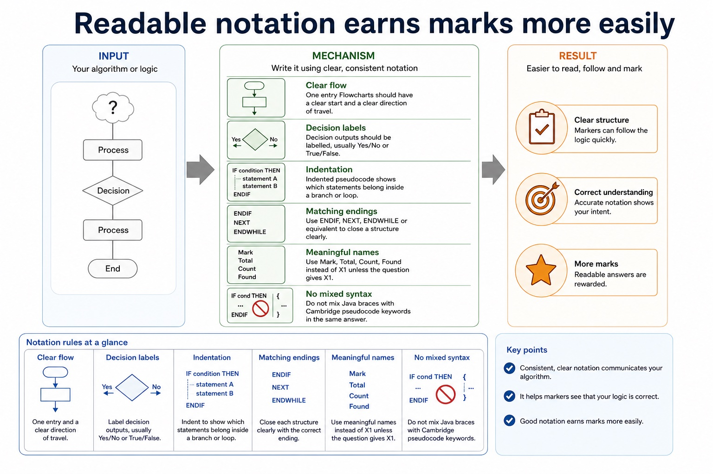
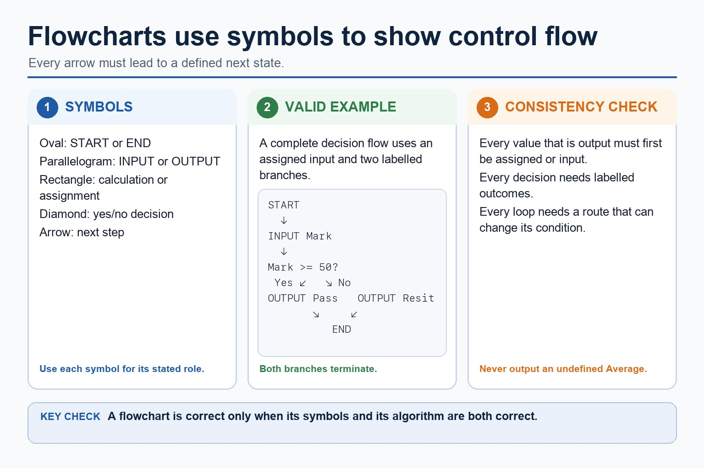
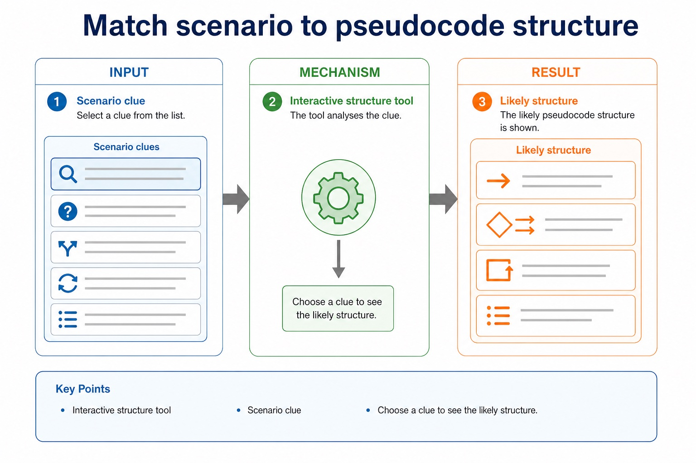
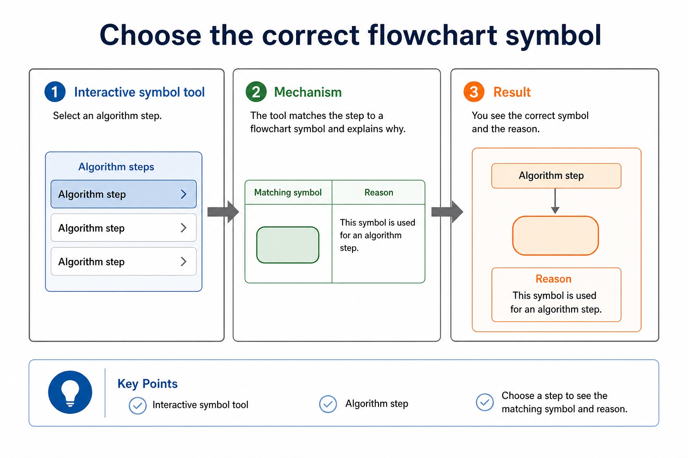
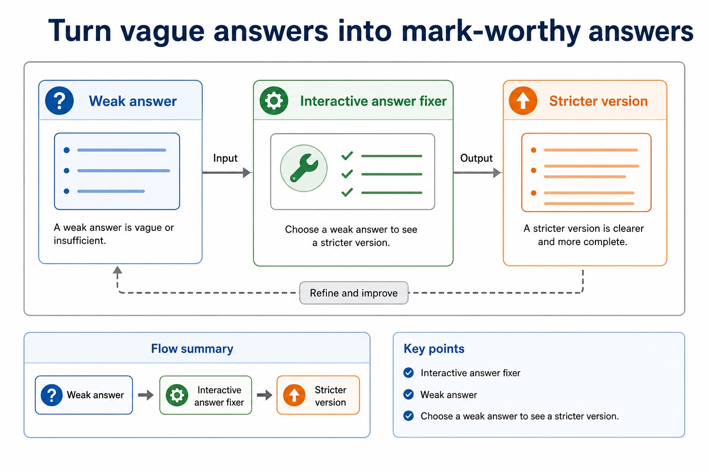
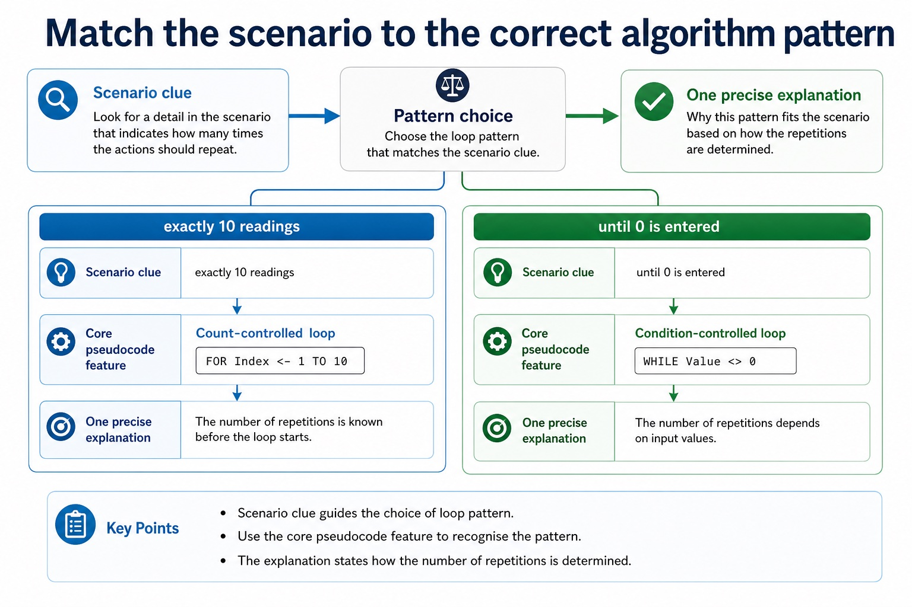
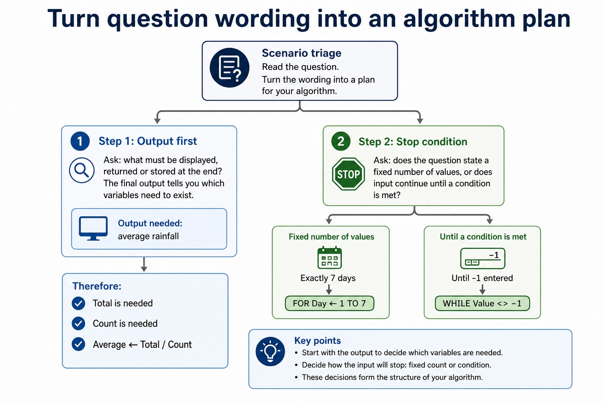

# Lesson 051: Structured English, flowcharts and pseudocode

**Course:** Cambridge International AS Level Computer Science 9618, 2027-2029 Version 2 
**Paper:** Paper 2 
**Syllabus:** Section 9: Algorithm design and problem-solving 
**Syllabus requirements:** S9.07 
**Pacing:** Flexible. Select the material set and practice depth needed by the learner.

## Teaching-depth menu

- **Quick route:** Use the diagnostic, learning objectives, first worked example and foundation question. Stop once the learner can explain the central distinction accurately.
- **Full route:** Use every knowledge-point material set, the worked method, the terminology check and all questions.
- **Deep route:** Add the prerequisite refresher, ask learners to connect the concept checklist, discuss the labelled extension and complete a transfer question without a model answer.

## 1. Prerequisite knowledge and quick diagnostic

Recall S9.03, S9.06 before starting this lesson.

Ask the learner to give one accurate definition or method step before continuing. If they cannot, briefly revisit the named prerequisite rather than repeating the whole previous lesson.

### Optional prerequisite refresher

- An algorithm is a solution to a problem expressed as a sequence of defined steps; the definition requires both the problem-solving purpose and the defined sequence.
- Understand what an algorithm is.
- The three basic algorithm constructs are sequence, selection and iteration (repetition); students must recognise and use each construct, including combinations of constructs.
- Understand and use sequence, selection and iteration.

## 2. Knowledge explanation

### 1. Structured English, flowcharts and pseudocode (S9.07)

**Concept map:** structured → English → flowcharts → pseudocode → convert

**Three-part explanation:**

1. design with input-process-output, use sequence, selection and iteration, document the same algorithm in structured English, a flowchart or pseudocode, and convert between the specified representations without…
2. write pseudocode from structured English or a flowchart, and draw a flowchart from structured English or pseudocode while preserving the same algorithm
3. Document an algorithm using structured English, a flowchart or pseudocode

**Concrete cue:** Solution review: design with input-process-output, use sequence, selection and iteration, document the same algorithm in structured English, a flowchart or pseudocode, and convert between the specified representations without changing its…

#### Cambridge-style pseudocode uses structured keywords

Text transcript

- Knowledge explanation
- Selection
- INPUT Mark
- IF Mark = 50 THEN
- OUTPUT "Pass"
- OUTPUT "Resit"
- Count-controlled iteration
- Total <- 0

#### Convert Java-like syntax into Cambridge-style pseudocode

Text transcript

- Interactive Java cleaner
- Java-like fragment
- Choose a fragment to convert.

#### Paper 2 wants readable Cambridge-style pseudocode

Text transcript

- Initialise Total and Count, then input the first Value.
- While Value is not -1, add it to Total and increment Count.
- Input the next Value inside the WHILE body before ENDWHILE.
- If Count is greater than zero, calculate Average using real division and output it.
- Java may support understanding but is not the Cambridge pseudocode answer format.

#### Readable notation earns marks more easily

Text transcript

- Notation rules
- One entry Flowcharts should have a clear start and a clear direction of travel.
- Decision labels Decision outputs should be labelled, usually Yes/No or True/False.
- Indentation Indented pseudocode shows which statements belong inside a branch or loop.
- Matching endings Use ENDIF, NEXT, ENDWHILE or equivalent to close a structure clearly.
- Meaningful names Use Mark, Total, Count, Found instead of X1 unless the question gives X1.
- No mixed syntax Do not mix Java braces with Cambridge pseudocode keywords in the same answer.

Precise syllabus wording

Use structured English, flowcharts and pseudocode; convert between representations.

Document an algorithm using structured English, a flowchart or pseudocode; write pseudocode from structured English or a flowchart, and draw a flowchart from structured English or pseudocode while preserving the same algorithm.

### Supporting diagram library

#### Flowcharts use symbols to show control flow

Text transcript

- A terminator marks START or END; a parallelogram marks INPUT or OUTPUT.
- A rectangle marks a calculation or assignment; a diamond marks a yes/no decision.
- Flow lines show the next step and decision branches must be labelled.
- Every output value must first be assigned or input.
- A loop must contain a route that can change its condition.

#### Match scenario to pseudocode structure

Text transcript

- Interactive structure tool
- Scenario clue
- Choose a clue to see the likely structure.

#### Choose the correct flowchart symbol

Text transcript

- Interactive symbol tool
- Algorithm step
- Choose a step to see the matching symbol and reason.

#### Turn vague answers into mark-worthy answers

Text transcript

- Interactive answer fixer
- Weak answer
- Choose a weak answer to see a stricter version.

#### Match the scenario to the correct algorithm pattern

Text transcript

- Pattern choice
- Scenario clue
- Core pseudocode feature
- One precise explanation
- exactly 10 readings
- Count-controlled loop
- FOR Index <- 1 TO 10
- The number of repetitions is known before the loop starts.

#### Section 9 in one page

Text transcript

- Retrieval map
- Signal words
- Expected mechanism
- Typical marking error
- IPOC / decomposition
- scenario, requirements, constraints
- break problem into inputs, processing, outputs and rules
- copying the story without design decisions

#### Turn question wording into an algorithm plan

Text transcript

- Scenario triage
- Step 1: Output first
- Ask: what must be displayed, returned or stored at the end? The final output tells you which variables need to exist.
- Output needed: average rainfall
- Therefore:
- Total is needed
- Count is needed
- Average <- Total / Count

Open precise terminology and exam facts

- Document an algorithm using structured English, a flowchart or pseudocode; write pseudocode from structured English or a flowchart, and draw a flowchart from structured English or pseudocode while preserving the same algorithm.
- Structured English expresses sequence, selection and repetition using controlled natural-language statements and indentation. A flowchart uses standard symbols and arrows; pseudocode uses Cambridge constructs. All three must preserve the same decisions and loop boundaries.
- Convert by identifying inputs, outputs, conditions and repeated actions before translating notation. Do not translate shapes or sentences word for word while losing control flow.
- Algorithm design review: define an algorithm as a solution expressed as a sequence of defined steps; use abstraction to retain essential details in an abstract model; use decomposition to express the problem as connected modules; and choose meaningful identifiers recorded in an identifier table.
- Solution review: design with input-process-output, use sequence, selection and iteration, document the same algorithm in structured English, a flowchart or pseudocode, and convert between the specified representations without changing its control flow.

### Worked example

1. Validate a mark
2. INPUT Mark; WHILE Mark < 0 OR Mark 100, OUTPUT error and INPUT Mark; ENDWHILE.
3. The flowchart returns from the invalid decision branch to input; pseudocode uses a pre-condition WHILE loop.

Beyond syllabus / 延伸知识（不要求背诵）: the same algorithm can be expressed in many programming languages; its logic should remain independent of syntax.
## 3. Practice by question type

### Question 1 - foundation - convert - 4 marks

Convert this structured English to pseudocode: input Age; if Age is at least 18 output Adult, otherwise output Minor.

**Answer:** INPUT Age; IF Age = 18 THEN; OUTPUT Adult and ELSE OUTPUT Minor; closes with ENDIF / coherent Cambridge syntax

**Marking guidance:** Do not accept two independent IF statements if they can produce contradictory paths; the description requires mutually exclusive alternatives.

**Common error:** For the command word convert, perform that exact action; do not replace it with an unrelated fact.

### Question 2 - application - explain - 2 marks

Why is indentation useful in structured English?

**Answer:** It shows which steps belong inside a selection or loop.

**Marking guidance:** Award one mark for each distinct, technically accurate point or method step.

**Common error:** Do not repeat the same point in different words; each mark needs a separate idea or method step.

### Question 3 - transfer - apply - 2 marks

Which flowchart symbol represents a decision?

**Answer:** Diamond.

**Marking guidance:** Award one mark for each distinct, technically accurate point or method step.

**Common error:** Do not copy the worked example unchanged; transfer the method and check it against the new context.

### Related past-paper indexes

| Reference | Marks | Command word | Question type |
|---|---:|---|---|
| 9618/21/S/25 Q3 | 8 | write | recall |
| 9618/21/S/23 Q4(a) | 4 | draw | diagram |
| 9618/21/S/23 Q4(ii) | 2 | describe | write |

These are indexes only. Cambridge question and mark-scheme wording is not reproduced.

## 4. Summary and exam reminders

### Summary

- Define structured english, flowcharts and pseudocode with the exact technical vocabulary expected by the syllabus.
- Use the lesson method on a fresh context and show the intermediate decision, representation or calculation.
- Match the shape of the answer to the command word and the available marks.
- Check the final answer against the scenario instead of repeating a memorised sentence.

### Common error to correct

Students often start coding before defining the output. Correction: an algorithm is easier to design when the required result is known first.

### Exam technique

- Follow the command word: state gives a fact; explain links a cause to a consequence; compare covers both sides.
- Match the number of independent points or method steps to the available marks.
- For structured english, flowcharts and pseudocode, use the exact technical term before applying it to the scenario.
