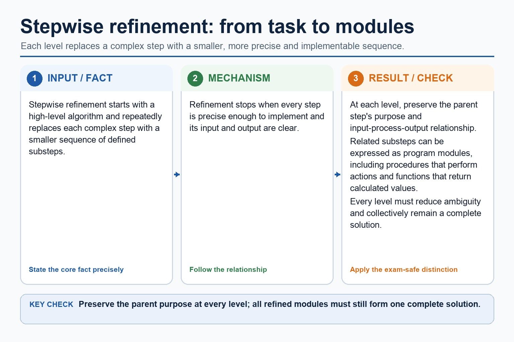

# Lesson 052: Stepwise refinement

**Course:** Cambridge International AS Level Computer Science 9618, 2027-2029 Version 2 
**Paper:** Paper 2 
**Syllabus:** Section 9: Algorithm design and problem-solving 
**Syllabus requirements:** S9.08 
**Pacing:** Flexible. This lesson is deliberately over-complete; select a quick, full or deep route for the learners in front of you.

## Teaching-depth menu

- **Quick route:** Use the diagnostic, learning objectives, first worked example and foundation question. Stop once the learner can explain the central distinction accurately.
- **Full route:** Teach every core explanation point, the worked example and all lesson questions. Use the visual only when it adds a different representation.
- **Deep route:** Add the prerequisite refresher, ask learners to connect the concept checklist, discuss the labelled extension and complete a transfer question without a model answer.

## 1. Prerequisite knowledge and quick diagnostic

Recall S9.02, S9.03 before starting this lesson.

Ask the learner to give one accurate definition or method step before continuing. If they cannot, briefly revisit the named prerequisite rather than repeating the whole previous lesson.

### Optional prerequisite refresher

- Decomposition must break a problem into sub-problems and lead to a program module, identified at design level as a procedure or function with a distinct responsibility.
- Use decomposition and express a problem as modules.
- An algorithm is a solution to a problem expressed as a sequence of defined steps; the definition requires both the problem-solving purpose and the defined sequence.
- Understand what an algorithm is.

## 2. Knowledge explanation

### Learning objectives

- Use stepwise refinement to develop an algorithm.

### Concept checklist for teacher choice

- stepwise
- refinement
- algorithm
- implement

### Detailed explanation

- Use stepwise refinement to develop an algorithm from a high-level solution to a level of detail from which a program can be written; each level must preserve the parent purpose.
- Stepwise refinement starts with a high-level algorithm and repeatedly replaces each complex step with a smaller sequence of defined substeps. Refinement stops when every step is precise enough to implement and its input and output are clear.
- At each level, preserve the parent step's purpose and input-process-output relationship. Related substeps can be expressed as program modules, including procedures that perform actions and functions that return calculated values.
- Refinement supports review, implementation and testing because each module has a limited responsibility. It is not merely adding prose: every level must reduce ambiguity and collectively remain a complete solution.
- Algorithm design review: define an algorithm as a solution expressed as a sequence of defined steps; use abstraction to retain essential details in an abstract model; use decomposition to express the problem as connected modules; and choose meaningful identifiers recorded in an identifier table.
- Solution review: design with input-process-output, use sequence, selection and iteration, document the same algorithm in structured English, a flowchart or pseudocode, and convert between the specified representations without changing its control flow.
- Development review: use stepwise refinement until steps are programmable, and construct and interpret logic statements that define decisions, loop conditions or Boolean values. Core answers must not replace these requirements with tracing, Java syntax or vague planning advice.

### Worked example

Refine an order-processing algorithm: Level 1: InputOrder; ValidateOrder; CalculateTotal; ProduceReceipt. Refine CalculateTotal into Set Total to 0; for each item validate Quantity; add Price Quantity; apply Discount; return Total. CalculateTotal can be a function returning Total, while ProduceReceipt can be a procedure receiving the completed total.

Beyond syllabus / 延伸知识（不要求背诵）: the same algorithm can be expressed in many programming languages; its logic should remain independent of syntax.

### Retained visual explanation

_Stepwise refinement turns a high-level algorithm into implementable modules. The image and mobile text alternative come from one maintained fact source._

## 3. Practice by question type

### Question 1 - foundation - apply - 2 marks

What is the starting point of stepwise refinement?

**Answer:** A high-level algorithm or task.

**Marking guidance:** Award one mark for each distinct, technically accurate point or method step.

**Common error:** For the command word apply, perform that exact action; do not replace it with an unrelated fact.

### Question 2 - application - apply - 5 marks

Apply two levels of stepwise refinement to 'register a new library member', showing module inputs/outputs and identifying one procedure or function.

**Answer:** Level 1 separates capture, validation, storage and confirmation responsibilities; Level 2 replaces at least one complex step with smaller ordered substeps; module inputs and outputs are clear; procedure or function choice matches action versus returned value; refined steps collectively implement the original task

**Marking guidance:** Do not award unrelated features, repeated high-level labels or a level that does not reduce ambiguity.

**Common error:** Do not repeat the same point in different words; each mark needs a separate idea or method step.

### Question 3 - transfer - explain - 3 marks

Explain how stepwise refinement would be applied in a suitable computing context.

**Answer:** Stepwise refinement starts with a high-level algorithm and repeatedly replaces each complex step with a smaller sequence of defined substeps. Refinement stops when every step is precise enough to implement and its input and output are clear. At each level, preserve the parent step's purpose and input-process-output relationship. Related substeps can be expressed as program modules, including procedures that perform actions and functions that return calculated values. Refinement supports review, implementation and testing because each module has a limited responsibility. It is not merely adding prose: every level must reduce ambiguity and collectively remain a complete solution.

**Marking guidance:** Each mark needs a relevant point linked to the stated context.

**Common error:** Do not copy the worked example unchanged; transfer the method and check it against the new context.

### Related past-paper indexes

| Reference | Marks | Command word | Question type |
|---|---:|---|---|
| 9618/23/W/25 Q2(a) | 6 | describe | explain |
| 9618/22/S/25 Q2(a) | 2 | calculate | calculate |
| 9618/22/S/25 Q2(ii) | 2 | calculate | calculate |
| 9618/22/S/25 Q2(iii) | 2 | calculate | calculate |

These are indexes only. Cambridge question and mark-scheme wording is not reproduced.

## 4. Summary and exam reminders

### Summary

- Define stepwise refinement with the exact technical vocabulary expected by the syllabus.
- Use the lesson method on a fresh context and show the intermediate decision, representation or calculation.
- Match the shape of the answer to the command word and the available marks.
- Check the final answer against the scenario instead of repeating a memorised sentence.

### Common error to correct

Students often start coding before defining the output. Correction: an algorithm is easier to design when the required result is known first.

### Exam technique

- Follow the command word: state gives a fact; explain links a cause to a consequence; compare covers both sides.
- Match the number of independent points or method steps to the available marks.
- For stepwise refinement, use the exact technical term before applying it to the scenario.
