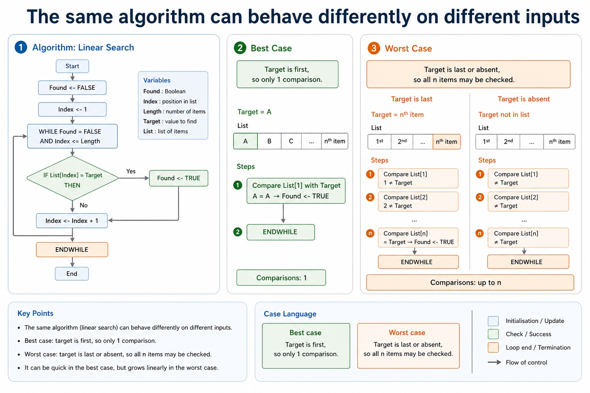
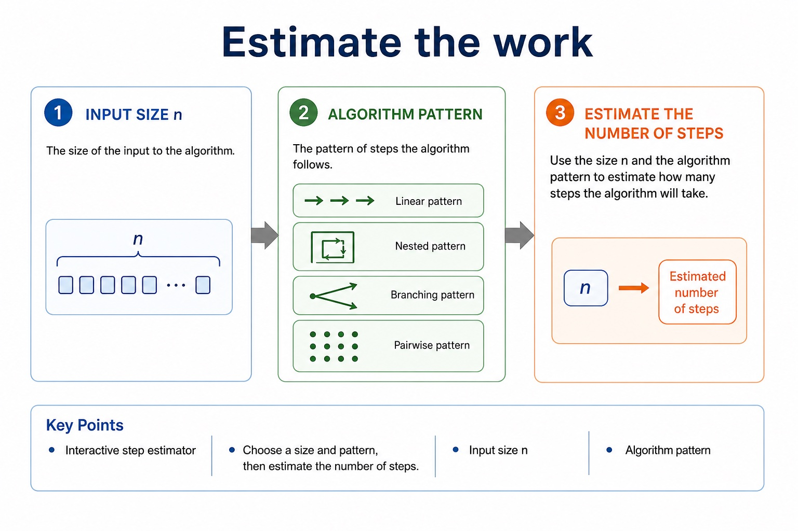
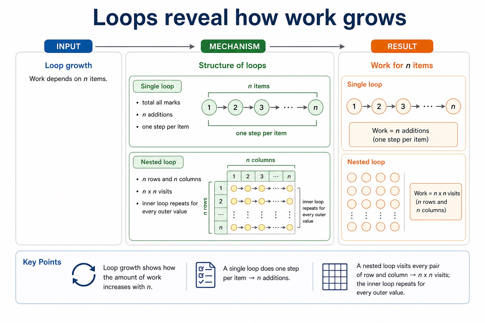
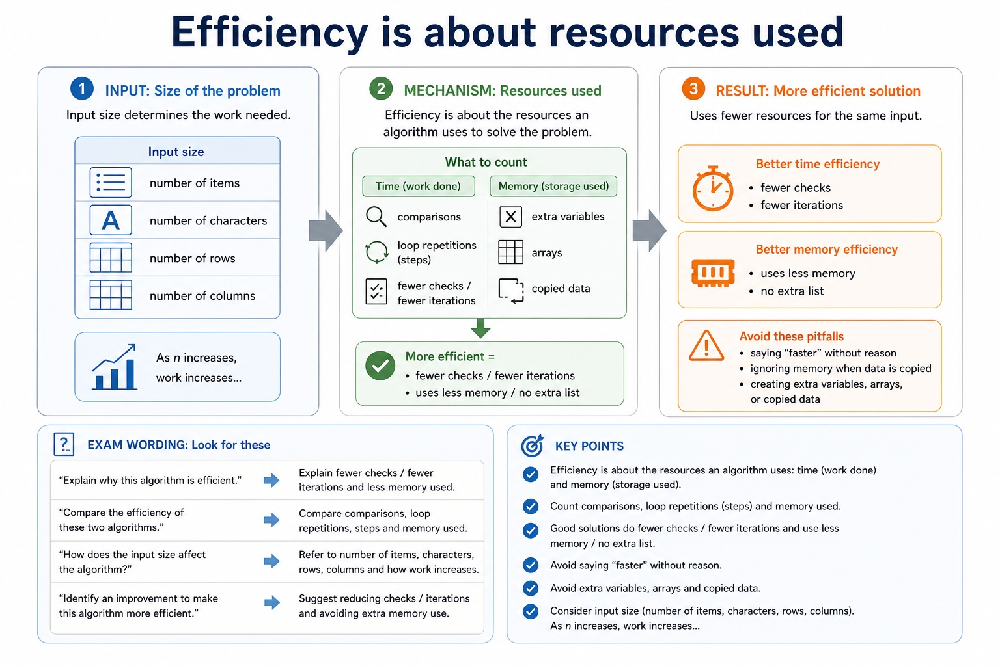
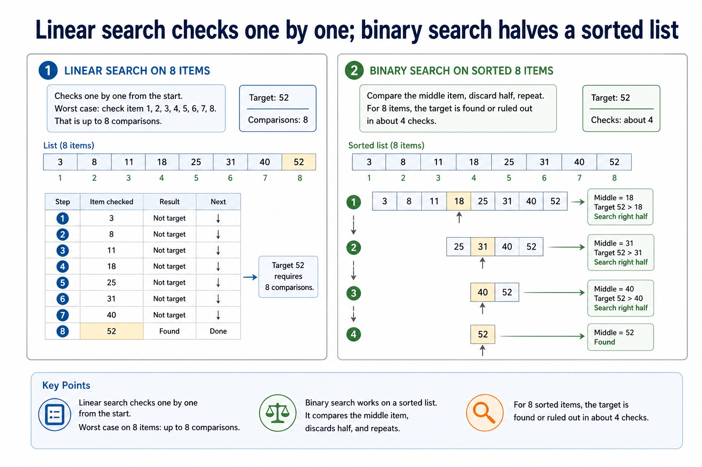

# Lesson 052: Stepwise refinement

**Course:** Cambridge International AS Level Computer Science 9618, 2027-2029 Version 2 
**Paper:** Paper 2 
**Syllabus:** Section 9: Algorithm design and problem-solving 
**Syllabus requirements:** S9.08 
**Pacing:** Flexible. Select the material set and practice depth needed by the learner.

## Teaching-depth menu

- **Quick route:** Use the diagnostic, learning objectives, first worked example and foundation question. Stop once the learner can explain the central distinction accurately.
- **Full route:** Use every knowledge-point material set, the worked method, the terminology check and all questions.
- **Deep route:** Add the prerequisite refresher, ask learners to connect the concept checklist, discuss the labelled extension and complete a transfer question without a model answer.

## 1. Prerequisite knowledge and quick diagnostic

Recall S9.02, S9.03 before starting this lesson.

Ask the learner to give one accurate definition or method step before continuing. If they cannot, briefly revisit the named prerequisite rather than repeating the whole previous lesson.

### Optional prerequisite refresher

- Decomposition must break a problem into sub-problems and lead to a program module, identified at design level as a procedure or function with a distinct responsibility.
- Use decomposition and express a problem as modules.
- An algorithm is a solution to a problem expressed as a sequence of defined steps; the definition requires both the problem-solving purpose and the defined sequence.
- Understand what an algorithm is.

## 2. Knowledge explanation

### 1. Stepwise refinement (S9.08)

**Concept map:** stepwise → refinement → algorithm → implement

**Three-part explanation:**

1. Use stepwise refinement to develop an algorithm from a high-level solution to a level of detail from which a program can be written
2. Stepwise refinement starts with a high-level algorithm and repeatedly replaces each complex step with a smaller sequence of defined substeps
3. each level must preserve the parent purpose

**Concrete cue:** Use stepwise refinement to develop an algorithm from a high-level solution to a level of detail from which a program can be written; each level must preserve the parent purpose.

#### Stepwise refinement turns a high-level algorithm into implementable modules

Text transcript

- Stepwise refinement starts with a high-level algorithm and repeatedly replaces each complex step with a smaller sequence of defined substeps.
- Refinement stops when every step is precise enough to implement and its input and output are clear.
- At each level, preserve the parent step's purpose and input-process-output relationship.
- Related substeps can be expressed as program modules, including procedures that perform actions and functions that return calculated values.
- Every level must reduce ambiguity and collectively remain a complete solution.

#### An algorithm is a solution expressed as defined steps

Text transcript

- An algorithm is a solution to a problem expressed as a sequence of defined steps.
- Each step must be unambiguous, ordered where order matters and capable of being carried out.
- Identify what data is supplied, state the required transformation and state the exact result.
- Record limits, quantity requirements and supported assumptions.
- Check that every requirement maps to an input, process, output, constraint or assumption.

#### Turn question wording into an algorithm plan

Text transcript

- Scenario triage
- Step 1: Output first
- Ask: what must be displayed, returned or stored at the end? The final output tells you which variables need to exist.
- Output needed: average rainfall
- Therefore:
- Total is needed
- Count is needed
- Average <- Total / Count

#### The same algorithm can behave differently on different inputs

Text transcript

- Best and worst cases
- Linear search
- Found <- FALSE
- Index <- 1
- WHILE Found = FALSE AND Index <= Length
- IF List[Index] = Target THEN
- Found <- TRUE
- Index <- Index + 1

Precise syllabus wording

Use stepwise refinement to develop an algorithm.

Use stepwise refinement to develop an algorithm from a high-level solution to a level of detail from which a program can be written; each level must preserve the parent purpose.

### Supporting diagram library

#### Decomposition: split the problem into sub-problems

Text transcript

- Split the whole task into meaningful sub-problems with distinct responsibilities.
- Express the resulting design as program modules with clear inputs, processing and outputs.
- A module may become a procedure that performs an action or a function that returns a value.
- Confirm that all modules connect into one complete solution.

#### Dry run: execute the algorithm by hand

Text transcript

- 1 Copy the variable names into table columns.
- 2 Write initial values before the loop starts.
- 3 Use each input value in order.
- 4 Update variables exactly when pseudocode updates them.
- 5 Record output only when an OUTPUT statement is executed.

#### Loops make trace tables useful and slightly unforgiving

Text transcript

- Loop tracing
- Initialisation Variables such as Total and Count usually need a starting value before the loop.
- Update Record new values after assignment, not before.
- Condition For WHILE loops, check the condition before each iteration.
- Sentinel A sentinel value stops input and should usually not be processed as data.
- Output timing If OUTPUT is after the loop, output appears once at the end.
- Boundary Check whether loops run 5 times, 6 times, or one time too many.

#### Predict the final output

Text transcript

- Interactive output predictor
- Input set
- The pseudocode totals three input numbers and outputs Total.

#### Trace Cambridge pseudocode in the exam; Java is only a support view

Text transcript

- Initialise Total to zero before a three-iteration loop.
- Input one Number and add it to Total during each iteration.
- Output Total once after the loop has processed all three numbers.
- A Java support version must preserve the same input, accumulation and final output.

#### A trace table records variables after each change

Text transcript

- Knowledge explanation
- What it records
- Exam note
- Line / step
- which statement is being executed
- optional, but useful for debugging
- Input value
- the test data read by INPUT

#### Estimate the work

Text transcript

- Interactive step estimator
- Input size n
- Algorithm pattern
- Choose a size and pattern, then estimate the number of steps.

#### Loops reveal how work grows

Text transcript

- Loop growth
- Structure
- Work for n items
- AS-level explanation
- Single loop
- total all marks
- n additions
- one step per item

#### Efficiency is about resources used

Text transcript

- Knowledge explanation
- What to count
- Exam wording
- Common error
- comparisons, loop repetitions, steps
- fewer checks / fewer iterations
- "faster" without reason
- extra variables, arrays, copied data

#### Efficiency explanations are language-independent

Text transcript

- A linear search compares Target with each visited list item.
- Set Found to TRUE only inside the matching IF branch.
- Close the selection with ENDIF before NEXT Index.
- Without early exit, the algorithm can perform up to Length comparisons in either language.

#### Linear search checks one by one; binary search halves a sorted list

Text transcript

- Search comparison
- Linear search on 8 items
- Worst case: check item 1, 2, 3, 4, 5, 6, 7, 8. That is up to 8 comparisons.
- [3, 8, 11, 18, 25, 31, 40, 52]
- target 52 - 8 comparisons
- Binary search on sorted 8 items
- Compare the middle item, discard half, repeat. For 8 items, the target is found or ruled out in about 4 checks.
- middle 18 - search right

#### Turn vague answers into mark-worthy answers

Text transcript

- Interactive answer fixer
- Weak answer
- Choose a weak answer to see a stricter version.

#### Match the scenario to the correct algorithm pattern

Text transcript

- Pattern choice
- Scenario clue
- Core pseudocode feature
- One precise explanation
- exactly 10 readings
- Count-controlled loop
- FOR Index <- 1 TO 10
- The number of repetitions is known before the loop starts.

#### Paper 2 wants readable Cambridge-style pseudocode

Text transcript

- Initialise Total and Count, then input the first Value.
- While Value is not -1, add it to Total and increment Count.
- Input the next Value inside the WHILE body before ENDWHILE.
- If Count is greater than zero, calculate Average using real division and output it.
- Java may support understanding but is not the Cambridge pseudocode answer format.

#### Section 9 in one page

Text transcript

- Retrieval map
- Signal words
- Expected mechanism
- Typical marking error
- IPOC / decomposition
- scenario, requirements, constraints
- break problem into inputs, processing, outputs and rules
- copying the story without design decisions

Open precise terminology and exam facts

- Use stepwise refinement to develop an algorithm from a high-level solution to a level of detail from which a program can be written; each level must preserve the parent purpose.
- Stepwise refinement starts with a high-level algorithm and repeatedly replaces each complex step with a smaller sequence of defined substeps. Refinement stops when every step is precise enough to implement and its input and output are clear.
- At each level, preserve the parent step's purpose and input-process-output relationship. Related substeps can be expressed as program modules, including procedures that perform actions and functions that return calculated values.
- Refinement supports review, implementation and testing because each module has a limited responsibility. It is not merely adding prose: every level must reduce ambiguity and collectively remain a complete solution.
- Algorithm design review: define an algorithm as a solution expressed as a sequence of defined steps; use abstraction to retain essential details in an abstract model; use decomposition to express the problem as connected modules; and choose meaningful identifiers recorded in an identifier table.
- Solution review: design with input-process-output, use sequence, selection and iteration, document the same algorithm in structured English, a flowchart or pseudocode, and convert between the specified representations without changing its control flow.
- Development review: use stepwise refinement until steps are programmable, and construct and interpret logic statements that define decisions, loop conditions or Boolean values. Core answers must not replace these requirements with tracing, Java syntax or vague planning advice.

### Worked example

1. Refine an order-processing algorithm
2. InputOrder; ValidateOrder; CalculateTotal; ProduceReceipt.
3. Refine CalculateTotal into Set Total to 0; for each item validate Quantity; add Price Quantity; apply Discount; return Total.
4. CalculateTotal can be a function returning Total, while ProduceReceipt can be a procedure receiving the completed total.

Beyond syllabus / 延伸知识（不要求背诵）: the same algorithm can be expressed in many programming languages; its logic should remain independent of syntax.
## 3. Practice by question type

### Question 1 - foundation - apply - 2 marks

What is the starting point of stepwise refinement?

**Answer:** A high-level algorithm or task.

**Marking guidance:** Award one mark for each distinct, technically accurate point or method step.

**Common error:** For the command word apply, perform that exact action; do not replace it with an unrelated fact.

### Question 2 - application - apply - 5 marks

Apply two levels of stepwise refinement to 'register a new library member', showing module inputs/outputs and identifying one procedure or function.

**Answer:** Level 1 separates capture, validation, storage and confirmation responsibilities; Level 2 replaces at least one complex step with smaller ordered substeps; module inputs and outputs are clear; procedure or function choice matches action versus returned value; refined steps collectively implement the original task

**Marking guidance:** Do not award unrelated features, repeated high-level labels or a level that does not reduce ambiguity.

**Common error:** Do not repeat the same point in different words; each mark needs a separate idea or method step.

### Question 3 - transfer - explain - 3 marks

Explain how stepwise refinement would be applied in a suitable computing context.

**Answer:** Stepwise refinement starts with a high-level algorithm and repeatedly replaces each complex step with a smaller sequence of defined substeps. Refinement stops when every step is precise enough to implement and its input and output are clear. At each level, preserve the parent step's purpose and input-process-output relationship. Related substeps can be expressed as program modules, including procedures that perform actions and functions that return calculated values. Refinement supports review, implementation and testing because each module has a limited responsibility. It is not merely adding prose: every level must reduce ambiguity and collectively remain a complete solution.

**Marking guidance:** Each mark needs a relevant point linked to the stated context.

**Common error:** Do not copy the worked example unchanged; transfer the method and check it against the new context.

### Related past-paper indexes

| Reference | Marks | Command word | Question type |
|---|---:|---|---|
| 9618/23/W/25 Q2(a) | 6 | describe | explain |
| 9618/22/S/25 Q2(a) | 2 | calculate | calculate |
| 9618/22/S/25 Q2(ii) | 2 | calculate | calculate |
| 9618/22/S/25 Q2(iii) | 2 | calculate | calculate |

These are indexes only. Cambridge question and mark-scheme wording is not reproduced.

## 4. Summary and exam reminders

### Summary

- Define stepwise refinement with the exact technical vocabulary expected by the syllabus.
- Use the lesson method on a fresh context and show the intermediate decision, representation or calculation.
- Match the shape of the answer to the command word and the available marks.
- Check the final answer against the scenario instead of repeating a memorised sentence.

### Common error to correct

Students often start coding before defining the output. Correction: an algorithm is easier to design when the required result is known first.

### Exam technique

- Follow the command word: state gives a fact; explain links a cause to a consequence; compare covers both sides.
- Match the number of independent points or method steps to the available marks.
- For stepwise refinement, use the exact technical term before applying it to the scenario.
