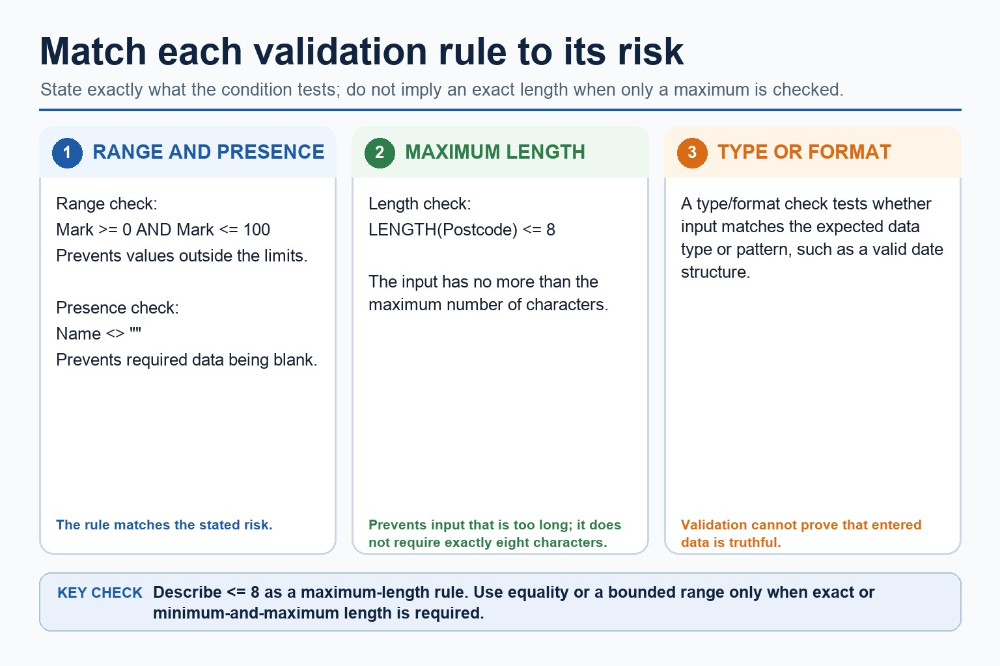
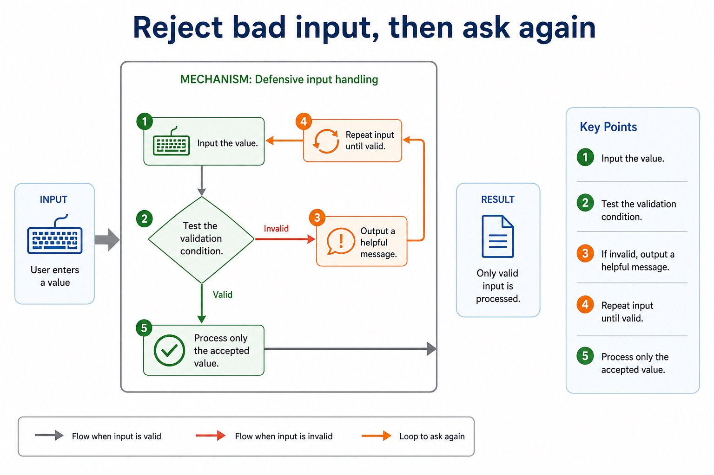
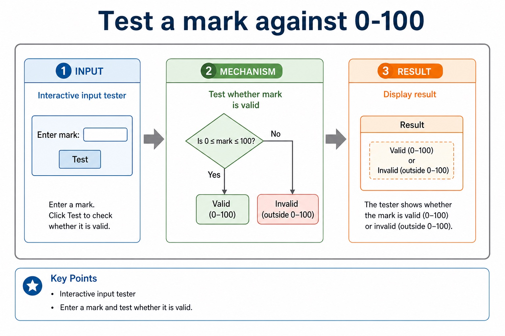
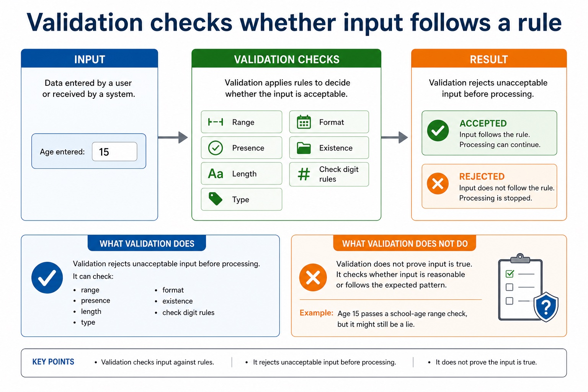

# Lesson 053: Constructing and interpreting logic statements

**Course:** Cambridge International AS Level Computer Science 9618, 2027-2029 Version 2 
**Paper:** Paper 2 
**Syllabus:** Section 9: Algorithm design and problem-solving 
**Syllabus requirements:** S9.09 
**Pacing:** Flexible. Select the material set and practice depth needed by the learner.

## Teaching-depth menu

- **Quick route:** Use the diagnostic, learning objectives, first worked example and foundation question. Stop once the learner can explain the central distinction accurately.
- **Full route:** Use every knowledge-point material set, the worked method, the terminology check and all questions.
- **Deep route:** Add the prerequisite refresher, ask learners to connect the concept checklist, discuss the labelled extension and complete a transfer question without a model answer.

## 1. Prerequisite knowledge and quick diagnostic

Recall S9.06 before starting this lesson.

Ask the learner to give one accurate definition or method step before continuing. If they cannot, briefly revisit the named prerequisite rather than repeating the whole previous lesson.

### Optional prerequisite refresher

- The three basic algorithm constructs are sequence, selection and iteration (repetition); students must recognise and use each construct, including combinations of constructs.
- Understand and use sequence, selection and iteration.

## 2. Knowledge explanation

### 1. Logic · Statements · Condition · Algorithm (S9.09)

**Concept map:** logic → statements → condition → algorithm

**Three-part explanation:**

1. Logic statements define parts of an algorithm solution, including decision conditions, loop conditions and Boolean assignments
2. A logic statement defines a decision, repetition condition or Boolean assignment in an algorithm solution
3. use stepwise refinement until steps are programmable, and construct and interpret logic statements that define decisions, loop conditions or Boolean values

**Concrete cue:** Logic statements define parts of an algorithm solution, including decision conditions, loop conditions and Boolean assignments; students must both construct and interpret them.

#### Selection: choose a path using a condition

Text transcript

- Knowledge explanation
- Selection is used when the algorithm must decide between different actions.
- INPUT Mark
- IF Mark = 50 THEN
- OUTPUT "Pass"
- OUTPUT "Resit"

#### An algorithm is a solution expressed as defined steps

Text transcript

- An algorithm is a solution to a problem expressed as a sequence of defined steps.
- Each step must be unambiguous, ordered where order matters and capable of being carried out.
- Identify what data is supplied, state the required transformation and state the exact result.
- Record limits, quantity requirements and supported assumptions.
- Check that every requirement maps to an input, process, output, constraint or assumption.

#### Use Cambridge-style validation loops in the exam

Text transcript

- A post-condition validation loop starts with REPEAT and ends with UNTIL.
- Input Mark inside the loop so every retry obtains a replacement value.
- Close the invalid-mark selection with ENDIF before UNTIL.
- A Java do-while support version must begin with do and close its blocks correctly.

#### Real algorithms usually combine the three structures

Text transcript

- Combining structures
- 1 Use sequence to initialise variables and read inputs.
- 2 Use iteration when the same action happens repeatedly.
- 3 Use selection inside the loop when each item needs a decision.
- 4 Use sequence after the loop to calculate or output final results.
- 5 Indent nested structures so the examiner can see the logic.

Precise syllabus wording

Construct and interpret logic statements.

Logic statements define parts of an algorithm solution, including decision conditions, loop conditions and Boolean assignments; students must both construct and interpret them.

### Supporting diagram library

#### Match the rule to the risk

Text transcript

- LENGTH(Postcode) <= 8 is a maximum-length check.
- The rule accepts no more than eight characters and prevents input that is too long.
- It does not require exactly eight characters.
- Use equality or bounded limits only when an exact or minimum-and-maximum length is intended.

#### Reject bad input, then ask again

Text transcript

- Defensive input handling
- 1 Input the value.
- 2 Test the validation condition.
- 3 If invalid, output a helpful message.
- 4 Repeat input until valid.
- 5 Process only the accepted value.

#### A diamond becomes IF...THEN...ELSE

Text transcript

- A flowchart decision diamond becomes an IF condition in pseudocode.
- The labelled Yes and No branches become THEN and ELSE branches.
- Close the selection with ENDIF after the two branches rejoin.
- Input Age before testing whether it is between 11 and 18 inclusive.

#### Test a mark against 0-100

Text transcript

- Interactive input tester
- Enter a mark and test whether it is valid.

#### Validation checks whether input follows a rule

Text transcript

- Knowledge explanation
- What validation does
- Validation rejects unacceptable input before processing. It can check range, presence, length, type, format, existence or check digit rules.
- What validation does not do
- Validation does not prove input is true. It checks whether input is reasonable or follows the expected pattern.
- Example: age 15 passes a school-age range check, but it might still be a lie.

#### Turn vague answers into mark-worthy answers

Text transcript

- Interactive answer fixer
- Weak answer
- Choose a weak answer to see a stricter version.

#### Match the scenario to the correct algorithm pattern

Text transcript

- Pattern choice
- Scenario clue
- Core pseudocode feature
- One precise explanation
- exactly 10 readings
- Count-controlled loop
- FOR Index <- 1 TO 10
- The number of repetitions is known before the loop starts.

#### Paper 2 wants readable Cambridge-style pseudocode

Text transcript

- Initialise Total and Count, then input the first Value.
- While Value is not -1, add it to Total and increment Count.
- Input the next Value inside the WHILE body before ENDWHILE.
- If Count is greater than zero, calculate Average using real division and output it.
- Java may support understanding but is not the Cambridge pseudocode answer format.

#### Section 9 in one page

Text transcript

- Retrieval map
- Signal words
- Expected mechanism
- Typical marking error
- IPOC / decomposition
- scenario, requirements, constraints
- break problem into inputs, processing, outputs and rules
- copying the story without design decisions

#### Turn question wording into an algorithm plan

Text transcript

- Scenario triage
- Step 1: Output first
- Ask: what must be displayed, returned or stored at the end? The final output tells you which variables need to exist.
- Output needed: average rainfall
- Therefore:
- Total is needed
- Count is needed
- Average <- Total / Count

Open precise terminology and exam facts

- Logic statements define parts of an algorithm solution, including decision conditions, loop conditions and Boolean assignments; students must both construct and interpret them.
- A logic statement defines a decision, repetition condition or Boolean assignment in an algorithm solution. It combines comparisons such as =, <, <=, , = or < with AND, OR or NOT when more than one condition is needed.
- Construct a statement from the rule before choosing its branch: a valid mark from 0 to 100 inclusive is Mark = 0 AND Mark <= 100. Interpret it by checking both comparisons; using OR would accept values outside the range.
- Logic statements must preserve boundaries and intended truth conditions. Trace representative true, false and boundary values to expose reversed operators or incorrect connectors.
- Algorithm design review: define an algorithm as a solution expressed as a sequence of defined steps; use abstraction to retain essential details in an abstract model; use decomposition to express the problem as connected modules; and choose meaningful identifiers recorded in an identifier table.
- Solution review: design with input-process-output, use sequence, selection and iteration, document the same algorithm in structured English, a flowchart or pseudocode, and convert between the specified representations without changing its control flow.
- Development review: use stepwise refinement until steps are programmable, and construct and interpret logic statements that define decisions, loop conditions or Boolean values. Core answers must not replace these requirements with tracing, Java syntax or vague planning advice.

### Worked example

1. Design a result-processing solution
2. Keep only student ID and required marks, decompose the task into InputResults, ValidateResult, CalculateMean and OutputReport, record meaningful identifiers and IPO, refine CalculateMean into defined steps, use a range logic statement, and…

Beyond syllabus / 延伸知识（不要求背诵）: the same algorithm can be expressed in many programming languages; its logic should remain independent of syntax.
## 3. Practice by question type

### Question 1 - foundation - write - 5 marks

Write and explain a logic statement that accepts an integer Temperature from -20 to 50 inclusive, then state its value for -21, -20, 50 and 51.

**Answer:** uses Temperature = -20; uses AND Temperature <= 50; states FALSE for -21; states TRUE for -20 and 50; states FALSE for 51

**Marking guidance:** Do not accept OR for a two-bound inclusive range or award outputs without a correctly constructed statement.

**Common error:** For the command word write, perform that exact action; do not replace it with an unrelated fact.

### Question 2 - application - apply - 2 marks

What must remain unchanged when converting representations?

**Answer:** The algorithm's inputs, outputs, conditions, order, branches and loop behaviour.

**Marking guidance:** Award one mark for each distinct, technically accurate point or method step.

**Common error:** Do not repeat the same point in different words; each mark needs a separate idea or method step.

### Question 3 - transfer - state - 2 marks

State two precise facts about constructing and interpreting logic statements.

**Answer:** Logic statements define parts of an algorithm solution, including decision conditions, loop conditions and Boolean assignments; students must both construct and interpret them. A logic statement defines a decision, repetition condition or Boolean assignment in an algorithm solution. It combines comparisons such as =, <, <=, , = or < with AND, OR or NOT when more than one condition is needed.

**Marking guidance:** Award one mark for each distinct fact; do not credit a repeated point.

**Common error:** Do not copy the worked example unchanged; transfer the method and check it against the new context.

## 4. Summary and exam reminders

### Summary

- Define constructing and interpreting logic statements with the exact technical vocabulary expected by the syllabus.
- Use the lesson method on a fresh context and show the intermediate decision, representation or calculation.
- Match the shape of the answer to the command word and the available marks.
- Check the final answer against the scenario instead of repeating a memorised sentence.

### Common error to correct

Students often start coding before defining the output. Correction: an algorithm is easier to design when the required result is known first.

### Exam technique

- Follow the command word: state gives a fact; explain links a cause to a consequence; compare covers both sides.
- Match the number of independent points or method steps to the available marks.
- For constructing and interpreting logic statements, use the exact technical term before applying it to the scenario.
