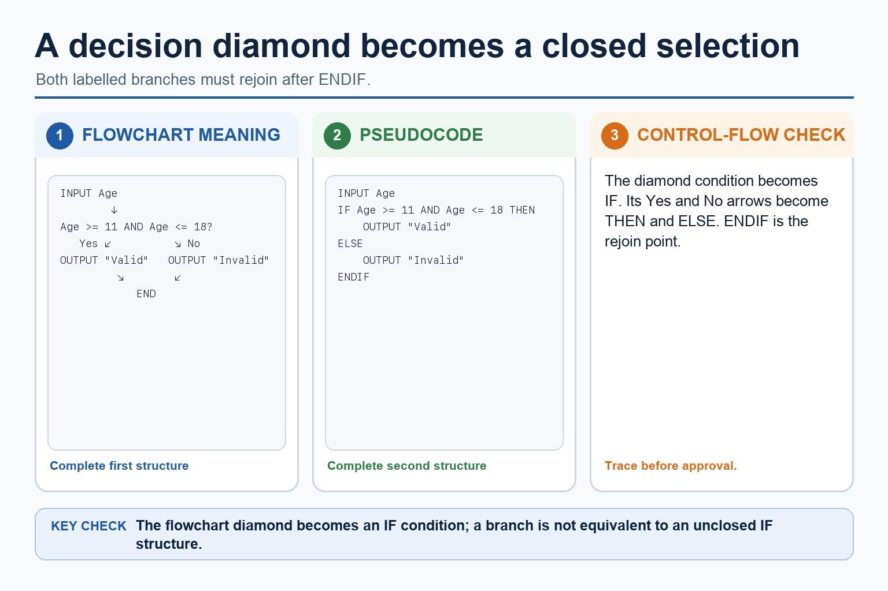

# Lesson 053: Constructing and interpreting logic statements

**Course:** Cambridge International AS Level Computer Science 9618, syllabus for examination in 2027-2029 
**Paper:** Paper 2 
**Syllabus:** Section 9: Algorithm design and problem-solving 
**Syllabus requirements:** S9.09 
**Pacing:** Flexible. Select a quick, full or deep route for the learners in front of you.

## Teaching-depth menu

- **Quick route:** Use the diagnostic, learning objectives, first worked example and foundation question. Stop once the learner can explain the central distinction accurately.
- **Full route:** Teach every knowledge-point material set, the worked method and all lesson questions.
- **Deep route:** Add the prerequisite refresher, ask learners to connect the concept checklist, discuss the labelled extension and complete a transfer question without a model answer.

## 1. Prerequisite knowledge and quick diagnostic

Recall S9.06 before starting this lesson.

Ask the learner to give one accurate definition or method step before continuing. If they cannot, briefly revisit the named prerequisite rather than repeating the whole previous lesson.

### Optional prerequisite refresher

- The three basic algorithm constructs are sequence, selection and iteration (repetition); students must recognise and use each construct, including combinations of constructs.
- Understand and use sequence, selection and iteration.

## 2. Knowledge explanation

### 1. Logic statements (S9.09)

**Atomic learning targets**

- **S9.09.A01:** logic
- **S9.09.A02:** statements
- **S9.09.A03:** condition
- **S9.09.A04:** algorithm

**Core explanation**

- Development review: use stepwise refinement until steps are programmable, and construct and interpret logic statements that define decisions, loop conditions or Boolean values. Core answers must not replace these requirements with tracing, Java syntax or vague planning advice.
- Algorithm design review: define an algorithm as a solution expressed as a sequence of defined steps; use abstraction to retain essential details in an abstract model; use decomposition to express the problem as connected modules; and choose meaningful identifiers recorded in an identifier table.
- Solution review: design with input-process-output, use sequence, selection and iteration, document the same algorithm in structured English, a flowchart or pseudocode, and convert between the specified representations without changing its control flow.
- A logic statement defines a decision, repetition condition or Boolean assignment in an algorithm solution. It combines comparisons such as =, <, <=, , = or < with AND, OR or NOT when more than one condition is needed.

**Mechanism or method**

1. **Set up the required data and conditions** — Development review: use stepwise refinement until steps are programmable, and construct and interpret logic statements that define decisions, loop conditions or Boolean values.
2. **Carry out the complete method** — Core answers must not replace these requirements with tracing, Java syntax or vague planning advice.
3. **Trace or test the result** — Algorithm design review: define an algorithm as a solution expressed as a sequence of defined steps;

#### Worked example: Logic statements: complete worked route

1. **Set up the required data and conditions**

Development review: use stepwise refinement until steps are programmable, and construct and interpret logic statements that define decisions, loop conditions or Boolean values.

2. **Carry out the complete method**

Core answers must not replace these requirements with tracing, Java syntax or vague planning advice.

3. **Trace or test the result**

Algorithm design review: define an algorithm as a solution expressed as a sequence of defined steps;

4. **Complete example**

Design a result-processing solution: Keep only student ID and required marks, decompose the task into InputResults, ValidateResult, CalculateMean and OutputReport, record meaningful identifiers and IPO, refine CalculateMean into defined steps, use a range logic statement, and represent the final control flow in Cambridge pseudocode or a matching flowchart.

**Misconceptions to correct**

- Students often start coding before defining the output. Correction: an algorithm is easier to design when the required result is known first.

#### Mastery check (MC-L053-S9.09)

Complete a fresh example that demonstrates every target: logic; statements; condition; algorithm. Show all intermediate steps and check the result.

Answer criteria

- Development review: use stepwise refinement until steps are programmable, and construct and interpret logic statements that define decisions, loop conditions or Boolean values. Core answers must not replace these requirements with tracing, Java syntax or vague planning advice.
- Algorithm design review: define an algorithm as a solution expressed as a sequence of defined steps; use abstraction to retain essential details in an abstract model; use decomposition to express the problem as connected modules; and choose meaningful identifiers recorded in an identifier table.
- Solution review: design with input-process-output, use sequence, selection and iteration, document the same algorithm in structured English, a flowchart or pseudocode, and convert between the specified representations without changing its control flow.
- A logic statement defines a decision, repetition condition or Boolean assignment in an algorithm solution. It combines comparisons such as =, <, <=, , = or < with AND, OR or NOT when more than one condition is needed.

**Supplementary concept map**

- **logic:** Stepwise refinement until steps are programmable, and construct…
- **statements:** Logic statements define parts of an algorithm solution,…
- **condition:** A logic statement defines a decision, repetition condition…
- **algorithm:** Algorithm design review
- **construct:** Both construct and interpret them.

**Supplementary three-step recap**

1. **Translate the stated design** — Stepwise refinement until steps are programmable, and construct and interpret logic statements that define decisions, loop conditions or…
2. **Apply one complete operation** — A logic statement defines a decision, repetition condition or Boolean assignment in an algorithm solution.
3. **Trace state and boundaries** — Logic statements define parts of an algorithm solution, including decision conditions, loop conditions and Boolean assignments

**A diamond becomes IF...THEN...ELSE:** A flowchart decision diamond becomes an IF condition in pseudocode. The labelled Yes and No branches become THEN and ELSE branches.

#### A diamond becomes IF...THEN...ELSE

Text transcript

- A flowchart decision diamond becomes an IF condition in pseudocode.
- The labelled Yes and No branches become THEN and ELSE branches.
- Close the selection with ENDIF after the two branches rejoin.
- Input Age before testing whether it is between 11 and 18 inclusive.

Precise syllabus wording

Construct and interpret logic statements.

Logic statements define parts of an algorithm solution, including decision conditions, loop conditions and Boolean assignments; students must both construct and interpret them.

### Lesson technical reference

- Logic statements define parts of an algorithm solution, including decision conditions, loop conditions and Boolean assignments; students must both construct and interpret them.
- A logic statement defines a decision, repetition condition or Boolean assignment in an algorithm solution. It combines comparisons such as =, <, <=, , = or < with AND, OR or NOT when more than one condition is needed.
- Construct a statement from the rule before choosing its branch: a valid mark from 0 to 100 inclusive is Mark = 0 AND Mark <= 100. Interpret it by checking both comparisons; using OR would accept values outside the range.
- Logic statements must preserve boundaries and intended truth conditions. Trace representative true, false and boundary values to expose reversed operators or incorrect connectors.
- Algorithm design review: define an algorithm as a solution expressed as a sequence of defined steps; use abstraction to retain essential details in an abstract model; use decomposition to express the problem as connected modules; and choose meaningful identifiers recorded in an identifier table.
- Solution review: design with input-process-output, use sequence, selection and iteration, document the same algorithm in structured English, a flowchart or pseudocode, and convert between the specified representations without changing its control flow.
- Development review: use stepwise refinement until steps are programmable, and construct and interpret logic statements that define decisions, loop conditions or Boolean values. Core answers must not replace these requirements with tracing, Java syntax or vague planning advice.

Beyond syllabus / 延伸知识（不要求背诵）: the same algorithm can be expressed in many programming languages; its logic should remain independent of syntax.
## 3. Practice by question type

### Question 1 - foundation - write - 5 marks

Write and explain a logic statement that accepts an integer Temperature from -20 to 50 inclusive, then state its value for -21, -20, 50 and 51.

**Answer:** uses Temperature = -20; uses AND Temperature <= 50; states FALSE for -21; states TRUE for -20 and 50; states FALSE for 51

**Marking guidance:** Do not accept OR for a two-bound inclusive range or award outputs without a correctly constructed statement.

**Common error:** For the command word write, perform that exact action; do not replace it with an unrelated fact.

### Question 2 - application - apply - 2 marks

What must remain unchanged when converting representations?

**Answer:** The algorithm's inputs, outputs, conditions, order, branches and loop behaviour.

**Marking guidance:** Award one mark for each distinct, technically accurate point or method step.

**Common error:** Do not repeat the same point in different words; each mark needs a separate idea or method step.

### Question 3 - transfer - state - 2 marks

State two precise facts about constructing and interpreting logic statements.

**Answer:** Logic statements define parts of an algorithm solution, including decision conditions, loop conditions and Boolean assignments; students must both construct and interpret them. A logic statement defines a decision, repetition condition or Boolean assignment in an algorithm solution. It combines comparisons such as =, <, <=, , = or < with AND, OR or NOT when more than one condition is needed.

**Marking guidance:** Award one mark for each distinct fact; do not credit a repeated point.

**Common error:** Do not copy the worked example unchanged; transfer the method and check it against the new context.

## 4. Summary and exam reminders

### Summary

- S9.09: explain logic, statements, condition, algorithm.
- S9.09 method: Set up the required data and conditions → Carry out the complete method → Trace or test the result.
- Correction to remember: Students often start coding before defining the output. Correction: an algorithm is easier to design when the required result is known first.

### Common error to correct

Students often start coding before defining the output. Correction: an algorithm is easier to design when the required result is known first.

### Exam technique

- Follow the command word: state gives a fact; explain links a cause to a consequence; compare covers both sides.
- Match the number of independent points or method steps to the available marks.
- For constructing and interpreting logic statements, use the exact technical term before applying it to the scenario.
