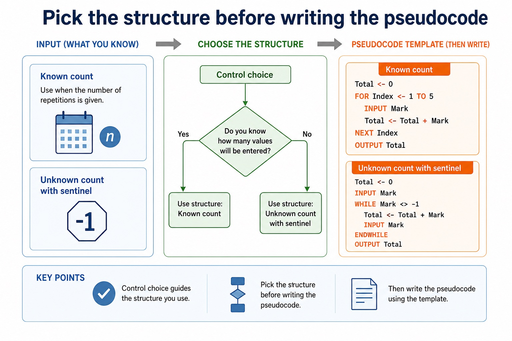
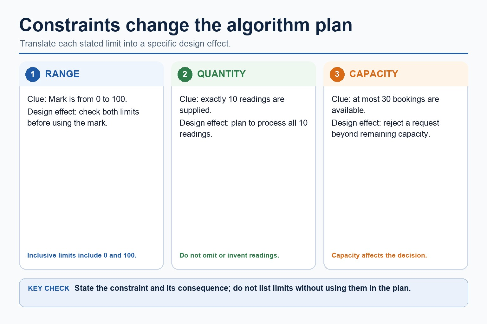
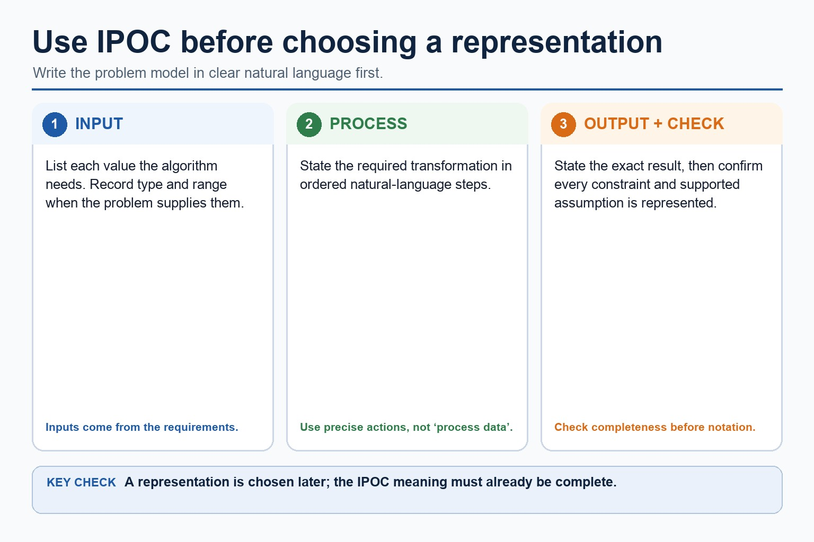
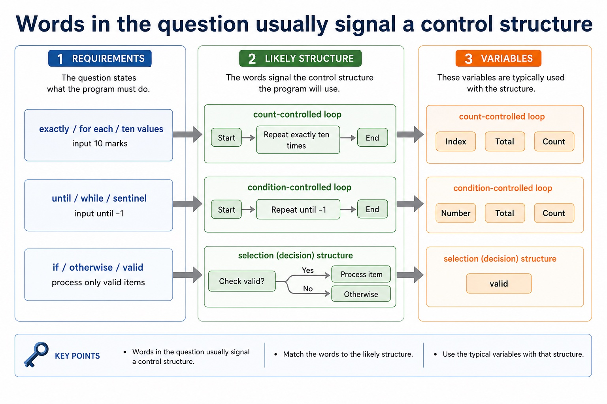

# Lesson 054: Integrated algorithm design from a word problem

**Course:** Cambridge International AS Level Computer Science 9618, 2027-2029 Version 2 
**Paper:** Paper 2 
**Syllabus:** Section 9: Algorithm design and problem-solving 
**Syllabus requirements:** S9.02, S9.05, S9.08 
**Pacing:** Flexible. Select the material set and practice depth needed by the learner.

## Teaching-depth menu

- **Quick route:** Use the diagnostic, learning objectives, first worked example and foundation question. Stop once the learner can explain the central distinction accurately.
- **Full route:** Use every knowledge-point material set, the worked method, the terminology check and all questions.
- **Deep route:** Add the prerequisite refresher, ask learners to connect the concept checklist, discuss the labelled extension and complete a transfer question without a model answer.

## 1. Prerequisite knowledge and quick diagnostic

Recall S9.01, S9.03, S9.04, S9.02 before starting this lesson.

Ask the learner to give one accurate definition or method step before continuing. If they cannot, briefly revisit the named prerequisite rather than repeating the whole previous lesson.

### Optional prerequisite refresher

- Abstraction is required both as a concept and as a practical modelling skill: explain its need and benefits, then produce an abstract model containing only details essential to the problem.
- Understand abstraction, its purpose/benefits and creation of an abstract model.
- An algorithm is a solution to a problem expressed as a sequence of defined steps; the definition requires both the problem-solving purpose and the defined sequence.
- Understand what an algorithm is.
- Students must choose suitable meaningful identifier names and construct an identifier table that records each identifier's name, data type and purpose for the designed algorithm.
- Choose meaningful identifier names and construct an identifier table.

## 2. Knowledge explanation

### 1. Decomposition · Problem · Modules · Procedure (S9.02)

**Concept map:** decomposition → problem → modules → procedure → function

**Three-part explanation:**

1. Decomposition must break a problem into sub-problems and lead to a program module, identified at design level as a procedure or function with a distinct responsibility
2. Decomposition breaks a problem into smaller sub-problems with distinct responsibilities
3. a module may later be implemented as a procedure that performs an action or a function that returns a value

**Concrete cue:** Decomposition must break a problem into sub-problems and lead to a program module, identified at design level as a procedure or function with a distinct responsibility.

#### Decomposition: split the problem into sub-problems

Text transcript

- Split the whole task into meaningful sub-problems with distinct responsibilities.
- Express the resulting design as program modules with clear inputs, processing and outputs.
- A module may become a procedure that performs an action or a function that returns a value.
- Confirm that all modules connect into one complete solution.

#### Stepwise refinement turns a high-level algorithm into implementable modules

Text transcript

- Stepwise refinement starts with a high-level algorithm and repeatedly replaces each complex step with a smaller sequence of defined substeps.
- Refinement stops when every step is precise enough to implement and its input and output are clear.
- At each level, preserve the parent step's purpose and input-process-output relationship.
- Related substeps can be expressed as program modules, including procedures that perform actions and functions that return calculated values.
- Every level must reduce ambiguity and collectively remain a complete solution.

#### Section 9 in one page

Text transcript

- Retrieval map
- Signal words
- Expected mechanism
- Typical marking error
- IPOC / decomposition
- scenario, requirements, constraints
- break problem into inputs, processing, outputs and rules
- copying the story without design decisions

#### Classify the design move

Text transcript

- Interactive task sorter
- Design statement
- Choose a statement to see whether it demonstrates decomposition, abstraction or an error.

Precise syllabus wording

Use decomposition and express a problem as modules.

Decomposition must break a problem into sub-problems and lead to a program module, identified at design level as a procedure or function with a distinct responsibility.

### 2. Input-process-output · Design · Pseudocode · Solution (S9.05)

**Concept map:** input-process-output → design → pseudocode → solution

**Three-part explanation:**

1. Use input, process and output as the design structure for a complete pseudocode solution
2. the three parts must connect, use meaningful identifiers and satisfy the stated problem
3. This input-process-output design must describe a complete solution rather than three unrelated lists

**Concrete cue:** Use input, process and output as the design structure for a complete pseudocode solution; the three parts must connect, use meaningful identifiers and satisfy the stated problem.

#### An algorithm is a solution expressed as defined steps

Text transcript

- An algorithm is a solution to a problem expressed as a sequence of defined steps.
- Each step must be unambiguous, ordered where order matters and capable of being carried out.
- Identify what data is supplied, state the required transformation and state the exact result.
- Record limits, quantity requirements and supported assumptions.
- Check that every requirement maps to an input, process, output, constraint or assumption.

#### Design in Cambridge pseudocode first; use Java only to support testing

Text transcript

- Initialise PassCount before processing five marks.
- Input one Mark per iteration and increment PassCount only when Mark is at least 50.
- Close the conditional with ENDIF before NEXT Index.
- Output the final PassCount after the loop in both equivalent forms.

#### Pick the structure before writing the pseudocode

Text transcript

- Control choice
- Known count
- Total <- 0
- FOR Index <- 1 TO 5
- INPUT Mark
- Total <- Total + Mark
- NEXT Index
- OUTPUT Total

#### Trace Cambridge pseudocode in the exam; Java is only a support view

Text transcript

- Initialise Total to zero before a three-iteration loop.
- Input one Number and add it to Total during each iteration.
- Output Total once after the loop has processed all three numbers.
- A Java support version must preserve the same input, accumulation and final output.

Precise syllabus wording

Use input-process-output to design pseudocode solutions.

Use input, process and output as the design structure for a complete pseudocode solution; the three parts must connect, use meaningful identifiers and satisfy the stated problem.

### 3. Stepwise refinement (S9.08)

**Concept map:** stepwise → refinement → algorithm → implement

**Three-part explanation:**

1. Use stepwise refinement to develop an algorithm from a high-level solution to a level of detail from which a program can be written
2. Stepwise refinement starts with a high-level algorithm and repeatedly replaces each complex step with a smaller sequence of defined substeps
3. each level must preserve the parent purpose

**Concrete cue:** Use stepwise refinement to develop an algorithm from a high-level solution to a level of detail from which a program can be written; each level must preserve the parent purpose.

#### Stepwise refinement turns a high-level algorithm into implementable modules

Text transcript

- Stepwise refinement starts with a high-level algorithm and repeatedly replaces each complex step with a smaller sequence of defined substeps.
- Refinement stops when every step is precise enough to implement and its input and output are clear.
- At each level, preserve the parent step's purpose and input-process-output relationship.
- Related substeps can be expressed as program modules, including procedures that perform actions and functions that return calculated values.
- Every level must reduce ambiguity and collectively remain a complete solution.

#### An algorithm is a solution expressed as defined steps

Text transcript

- An algorithm is a solution to a problem expressed as a sequence of defined steps.
- Each step must be unambiguous, ordered where order matters and capable of being carried out.
- Identify what data is supplied, state the required transformation and state the exact result.
- Record limits, quantity requirements and supported assumptions.
- Check that every requirement maps to an input, process, output, constraint or assumption.

#### Turn question wording into an algorithm plan

Text transcript

- Scenario triage
- Step 1: Output first
- Ask: what must be displayed, returned or stored at the end? The final output tells you which variables need to exist.
- Output needed: average rainfall
- Therefore:
- Total is needed
- Count is needed
- Average <- Total / Count

#### Dry run: execute the algorithm by hand

Text transcript

- 1 Copy the variable names into table columns.
- 2 Write initial values before the loop starts.
- 3 Use each input value in order.
- 4 Update variables exactly when pseudocode updates them.
- 5 Record output only when an OUTPUT statement is executed.

Precise syllabus wording

Use stepwise refinement to develop an algorithm.

Use stepwise refinement to develop an algorithm from a high-level solution to a level of detail from which a program can be written; each level must preserve the parent purpose.

### Supporting diagram library

#### Constraints stop algorithms from wandering off

Text transcript

- A range of 0 to 100 requires both limits to be checked.
- Exactly 10 supplied readings means the plan must process all 10 readings.
- A capacity of 30 bookings means a request beyond the remaining capacity must be rejected.
- Each stated constraint must have a specific consequence in the plan.

#### Use IPOC before choosing a representation

Text transcript

- List each input and record its type or range when the problem supplies them.
- Write the required processing in ordered natural-language steps.
- State the exact required output.
- Record constraints and supported assumptions.
- Confirm completeness before choosing a representation.

#### Abstraction: keep the details that affect the algorithm

Text transcript

- Keep details that affect an input, rule, calculation, constraint or output.
- Ignore decoration that does not change the required result.
- Ask whether removing a detail would change the result.
- Explain why a detail is relevant or irrelevant rather than only labelling it.

#### Keep or ignore details

Text transcript

- Interactive abstraction filter

#### Turn paragraphs into a design table

Text transcript

- IPOC reading
- Question to ask
- Example evidence
- Algorithm consequence
- What data is provided?
- mark, price, password, reading
- use INPUT or given array/list item
- What must be calculated or checked?

#### Produce an abstract model

Text transcript

- Underline the required output and keep only details that affect it.
- Create verb-based sub-problems with distinct responsibilities.
- State each sub-problem's input and output.
- Check that the parts collectively meet every requirement without gaps or overlap.
- The result is a natural-language responsibility plan ready for a later representation lesson.

#### Loops make trace tables useful and slightly unforgiving

Text transcript

- Loop tracing
- Initialisation Variables such as Total and Count usually need a starting value before the loop.
- Update Record new values after assignment, not before.
- Condition For WHILE loops, check the condition before each iteration.
- Sentinel A sentinel value stops input and should usually not be processed as data.
- Output timing If OUTPUT is after the loop, output appears once at the end.
- Boundary Check whether loops run 5 times, 6 times, or one time too many.

#### Predict the final output

Text transcript

- Interactive output predictor
- Input set
- The pseudocode totals three input numbers and outputs Total.

#### A trace table records variables after each change

Text transcript

- Knowledge explanation
- What it records
- Exam note
- Line / step
- which statement is being executed
- optional, but useful for debugging
- Input value
- the test data read by INPUT

#### Words in the question usually signal a control structure

Text transcript

- Requirements
- Likely structure
- Variables
- exactly / for each / ten values
- count-controlled loop
- Index, Total, Count
- input 10 marks
- until / while / sentinel

#### Turn vague answers into mark-worthy answers

Text transcript

- Interactive answer fixer
- Weak answer
- Choose a weak answer to see a stricter version.

#### Match the scenario to the correct algorithm pattern

Text transcript

- Pattern choice
- Scenario clue
- Core pseudocode feature
- One precise explanation
- exactly 10 readings
- Count-controlled loop
- FOR Index <- 1 TO 10
- The number of repetitions is known before the loop starts.

#### Paper 2 wants readable Cambridge-style pseudocode

Text transcript

- Initialise Total and Count, then input the first Value.
- While Value is not -1, add it to Total and increment Count.
- Input the next Value inside the WHILE body before ENDWHILE.
- If Count is greater than zero, calculate Average using real division and output it.
- Java may support understanding but is not the Cambridge pseudocode answer format.

Open precise terminology and exam facts

- Decomposition must break a problem into sub-problems and lead to a program module, identified at design level as a procedure or function with a distinct responsibility.
- Use input, process and output as the design structure for a complete pseudocode solution; the three parts must connect, use meaningful identifiers and satisfy the stated problem.
- Use stepwise refinement to develop an algorithm from a high-level solution to a level of detail from which a program can be written; each level must preserve the parent purpose.
- Abstraction removes each irrelevant detail that does not affect the required inputs, rules, constraints or outputs. Producing an abstract model means recording the essential details that remain: the data, relationships and processes needed to solve the problem, not merely listing what was ignored.
- Decomposition breaks a problem into smaller sub-problems with distinct responsibilities. Express the resulting design as program modules with clear inputs, processing and outputs; a module may later be implemented as a procedure that performs an action or a function that returns a value.
- Abstraction decides what belongs in the model; decomposition decides how the retained problem is divided. The modules must connect into one complete solution and must not omit a requirement.
- An algorithm is a solution to a problem expressed as a sequence of defined steps. Each step must be unambiguous, ordered where order matters and capable of being carried out; a vague instruction such as 'process the data' is not a defined step.
- Before writing pseudocode, identify the input data, the processing that transforms it and the required output. This input-process-output design must describe a complete solution rather than three unrelated lists.
- Choose meaningful identifier names that describe each value's role. An identifier table records at least the identifier name, data type and purpose; its entries must match the pseudocode solution.
- Stepwise refinement starts with a high-level algorithm and repeatedly replaces each complex step with a smaller sequence of defined substeps. Refinement stops when every step is precise enough to implement and its input and output are clear.
- At each level, preserve the parent step's purpose and input-process-output relationship. Related substeps can be expressed as program modules, including procedures that perform actions and functions that return calculated values.
- Refinement supports review, implementation and testing because each module has a limited responsibility. It is not merely adding prose: every level must reduce ambiguity and collectively remain a complete solution.

### Worked example

1. Design a result-processing solution
2. Keep only student ID and required marks, decompose the task into InputResults, ValidateResult, CalculateMean and OutputReport, record meaningful identifiers and IPO, refine CalculateMean into defined steps, use a range logic statement, and…

Beyond syllabus / 延伸知识（不要求背诵）: the same algorithm can be expressed in many programming languages; its logic should remain independent of syntax.
## 3. Practice by question type

### Question 1 - foundation - apply - 2 marks

What does decomposition produce here?

**Answer:** Smaller sub-problems expressed as connected program modules with clear responsibilities.

**Marking guidance:** Award one mark for each distinct, technically accurate point or method step.

**Common error:** For the command word apply, perform that exact action; do not replace it with an unrelated fact.

### Question 2 - application - state - 2 marks

State two precise facts about integrated algorithm design from a word problem.

**Answer:** Decomposition must break a problem into sub-problems and lead to a program module, identified at design level as a procedure or function with a distinct responsibility. Use input, process and output as the design structure for a complete pseudocode solution; the three parts must connect, use meaningful identifiers and satisfy the stated problem.

**Marking guidance:** Award one mark for each distinct fact; do not credit a repeated point.

**Common error:** Do not repeat the same point in different words; each mark needs a separate idea or method step.

### Question 3 - transfer - explain - 3 marks

Explain how integrated algorithm design from a word problem would be applied in a suitable computing context.

**Answer:** Use input, process and output as the design structure for a complete pseudocode solution; the three parts must connect, use meaningful identifiers and satisfy the stated problem. Use stepwise refinement to develop an algorithm from a high-level solution to a level of detail from which a program can be written; each level must preserve the parent purpose. Abstraction removes each irrelevant detail that does not affect the required inputs, rules, constraints or outputs. Producing an abstract model means recording the essential details that remain: the data, relationships and processes needed to solve the problem, not merely listing what was ignored.

**Marking guidance:** Each mark needs a relevant point linked to the stated context.

**Common error:** Do not copy the worked example unchanged; transfer the method and check it against the new context.

### Related past-paper indexes

| Reference | Marks | Command word | Question type |
|---|---:|---|---|
| 9618/23/W/25 Q2(a) | 6 | describe | explain |
| 9618/22/S/25 Q2(a) | 2 | calculate | calculate |
| 9618/22/S/25 Q2(i) | 2 | calculate | calculate |
| 9618/22/S/25 Q2(ii) | 2 | calculate | calculate |

These are indexes only. Cambridge question and mark-scheme wording is not reproduced.

## 4. Summary and exam reminders

### Summary

- Define integrated algorithm design from a word problem with the exact technical vocabulary expected by the syllabus.
- Use the lesson method on a fresh context and show the intermediate decision, representation or calculation.
- Match the shape of the answer to the command word and the available marks.
- Check the final answer against the scenario instead of repeating a memorised sentence.

### Common error to correct

Students often create one sub-problem per tiny action. Correction: each sub-problem needs a meaningful responsibility.

### Exam technique

- Follow the command word: state gives a fact; explain links a cause to a consequence; compare covers both sides.
- Match the number of independent points or method steps to the available marks.
- For integrated algorithm design from a word problem, use the exact technical term before applying it to the scenario.
