# Lesson 055: Cambridge data types and declarations

**Course:** Cambridge International AS Level Computer Science 9618, 2027-2029 Version 2 
**Paper:** Paper 2 
**Syllabus:** Section 10: Data types and structures 
**Syllabus requirements:** S10.01 
**Pacing:** Flexible. Select the material set and practice depth needed by the learner.

## Teaching-depth menu

- **Quick route:** Use the diagnostic, learning objectives, first worked example and foundation question. Stop once the learner can explain the central distinction accurately.
- **Full route:** Use every knowledge-point material set, the worked method, the terminology check and all questions.
- **Deep route:** Add the prerequisite refresher, ask learners to connect the concept checklist, discuss the labelled extension and complete a transfer question without a model answer.

## 1. Prerequisite knowledge and quick diagnostic

Recall the main conclusion from Lesson 054: Integrated algorithm design from a word problem.

Ask the learner to give one accurate definition or method step before continuing. If they cannot, briefly revisit the named prerequisite rather than repeating the whole previous lesson.

## 2. Knowledge explanation

### 1. Integer · Real · Char · String (S10.01)

**Concept map:** integer → real → char → string → Boolean → date → ARRAY → FILE

**Three-part explanation:**

1. The Version 2 Notes name integer, real, char, string, Boolean and date, and require the Cambridge pseudocode type names INTEGER, REAL, CHAR, STRING, BOOLEAN, DATE, ARRAY…
2. Cambridge pseudocode uses the type names INTEGER, REAL, CHAR, STRING, BOOLEAN, DATE, ARRAY and FILE
3. Select and use appropriate types for a problem solution

**Concrete cue:** Select and use appropriate types for a problem solution. The Version 2 Notes name integer, real, char, string, Boolean and date, and require the Cambridge pseudocode type names INTEGER, REAL,…

#### The eight Cambridge pseudocode type names

Text transcript

- Cambridge pseudocode uses INTEGER, REAL, CHAR, STRING, BOOLEAN and DATE for scalar values.
- The Version 2 Notes also name ARRAY and FILE among the pseudocode data types.
- Select a type from the value's meaning and required operations; numeric-looking identifiers may still require STRING.

#### Core AS-level data types

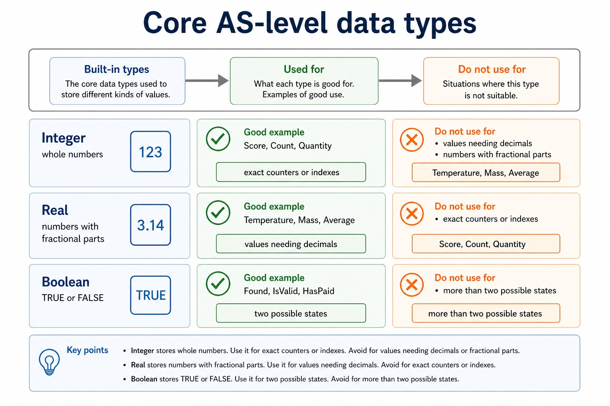

Text transcript

- INTEGER stores whole numbers, while REAL stores values that may contain a fractional part.
- CHAR stores one character and STRING stores a sequence of characters.
- BOOLEAN stores TRUE or FALSE, and DATE stores a calendar date.

#### Cambridge array bounds are stated explicitly

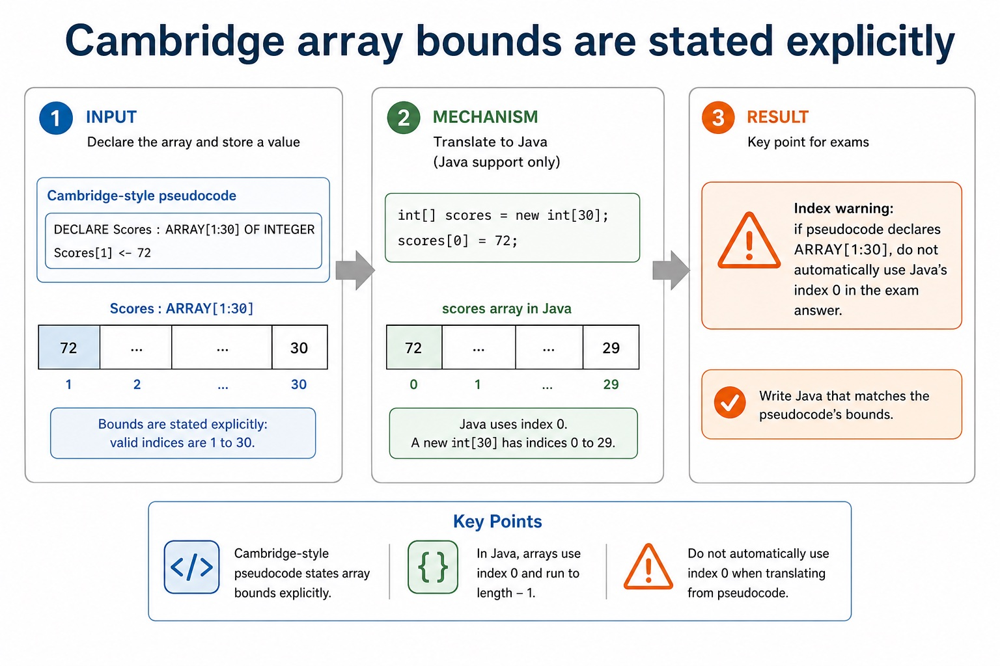

Text transcript

- Cambridge-style pseudocode
- DECLARE Scores : ARRAY[1:30] OF INTEGER
- Scores[1] <- 72
- Java support only
- int[] scores = new int[30];
- scores[0] = 72;
- Index warning: if pseudocode declares ARRAY[1:30] , do not automatically use Java's index 0 in the exam answer.

#### Use the scenario, not the surface appearance

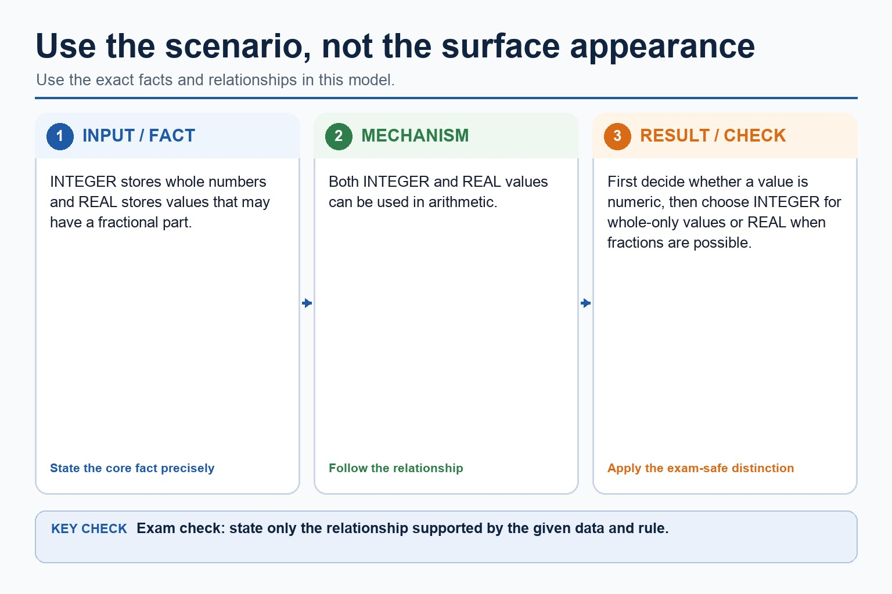

Text transcript

- INTEGER stores whole numbers and REAL stores values that may have a fractional part.
- Both INTEGER and REAL values can be used in arithmetic.
- First decide whether a value is numeric, then choose INTEGER for whole-only values or REAL when fractions are possible.

#### Question-supplied functions versus Java methods

Text transcript

- SPLIT and STRINGTOINTEGER are not standard functions in the Cambridge pseudocode guide; this example uses signatures supplied by the question.
- FUNCTION SPLIT(Line : STRING, Delimiter : CHAR) RETURNS ARRAY OF STRING; its first returned element is at index 1.
- FUNCTION STRINGTOINTEGER(Value : STRING) RETURNS INTEGER.
- Java split and parseInt are support examples only and use different syntax and zero-based array indexes.

Precise syllabus wording

Understand integer, real, char, string, Boolean and date types and Cambridge pseudocode type names.

Select and use appropriate types for a problem solution. The Version 2 Notes name integer, real, char, string, Boolean and date, and require the Cambridge pseudocode type names INTEGER, REAL, CHAR, STRING, BOOLEAN, DATE, ARRAY and FILE.

### Supporting diagram library

#### When built-in types are not descriptive enough

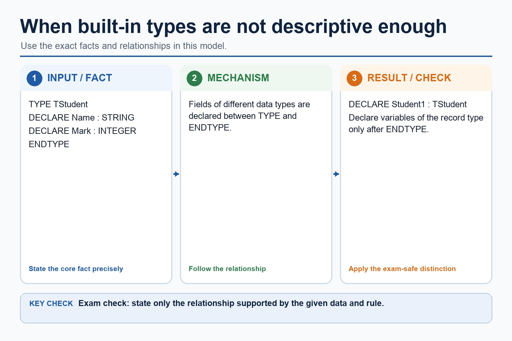

Text transcript

- TYPE TStudent
- Fields of different data types are declared between TYPE and ENDTYPE.
- DECLARE Student1 : TStudent

#### A type controls meaning and valid operations

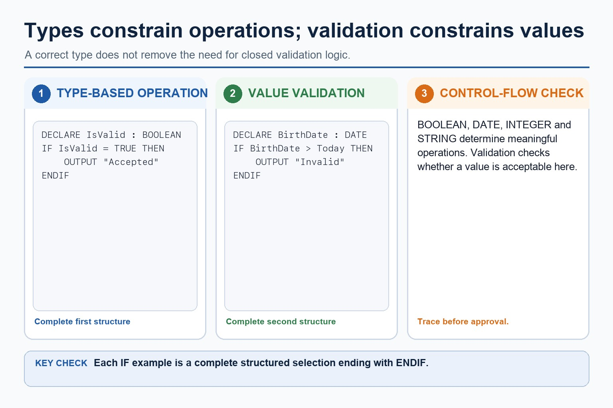

Text transcript

- A data type determines which operations are meaningful for a stored value.
- A BOOLEAN can control a decision and a DATE can be compared with another date.
- Close every structured IF example with ENDIF.
- Choosing the correct type does not replace validation against the problem's allowed range.

#### <- changes a value; = usually tests equality in conditions

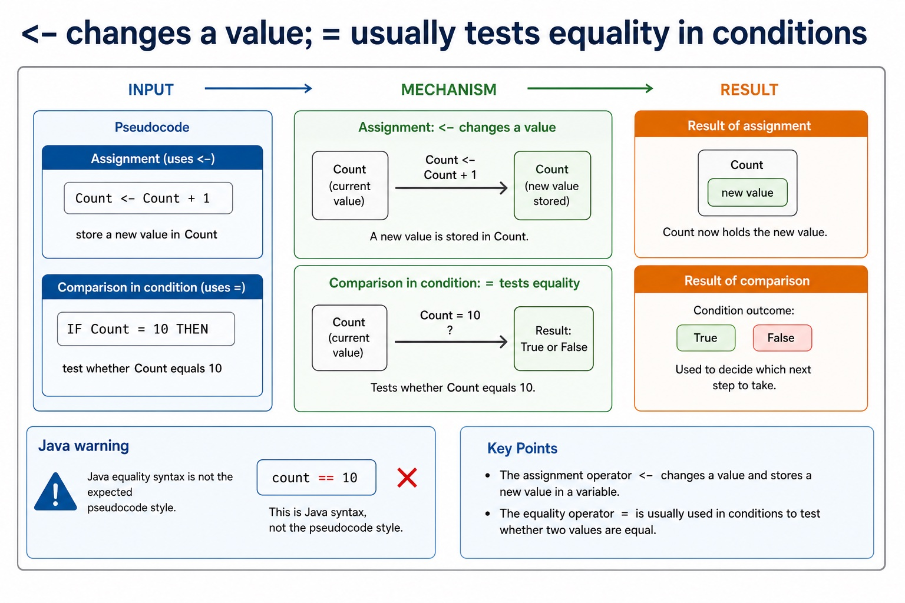

Text transcript

- Assignment versus comparison
- Pseudocode
- Count <- Count + 1
- store a new value in Count
- IF Count = 10 THEN
- test whether Count equals 10
- Java warning
- count == 10

#### Constants are named values that should not change

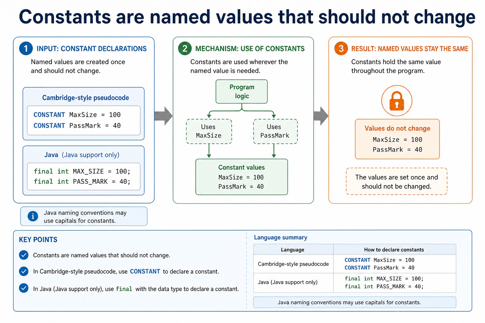

Text transcript

- Constants
- Cambridge-style pseudocode
- CONSTANT MaxSize = 100
- CONSTANT PassMark = 40
- Java support only
- final int MAXSIZE = 100;
- final int PASSMARK = 40;
- Java naming conventions may use capitals for constants. Cambridge pseudocode credit comes from clear constant declaration and use.

#### Do not mix the two languages inside one answer

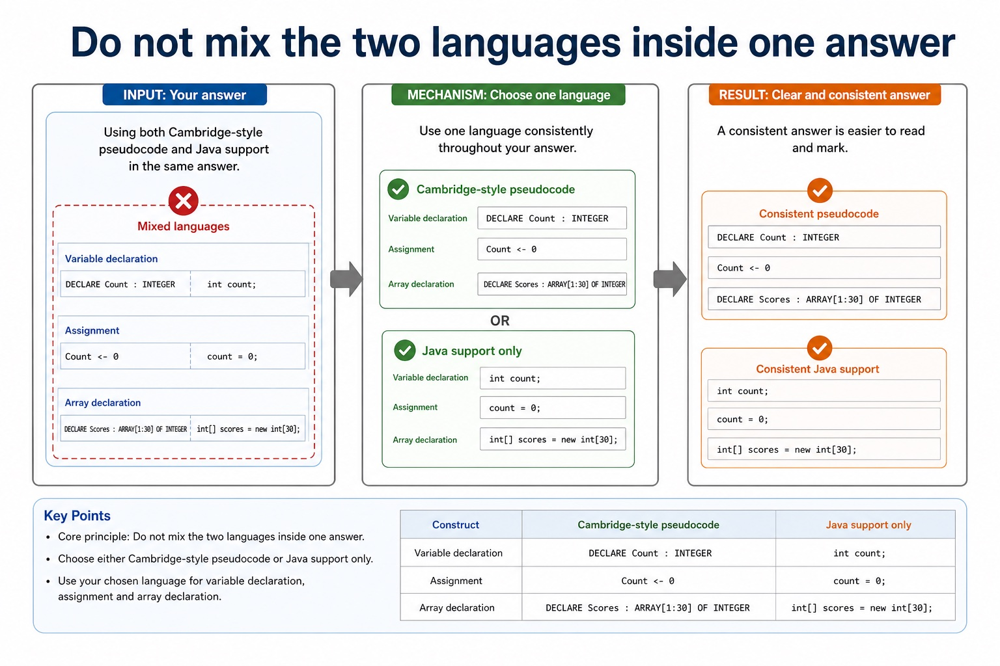

Text transcript

- Core principle
- Cambridge-style pseudocode
- Java support only
- Variable declaration
- DECLARE Count : INTEGER
- int count;
- Assignment
- Count <- 0

#### Record declarations use TYPE and ENDTYPE

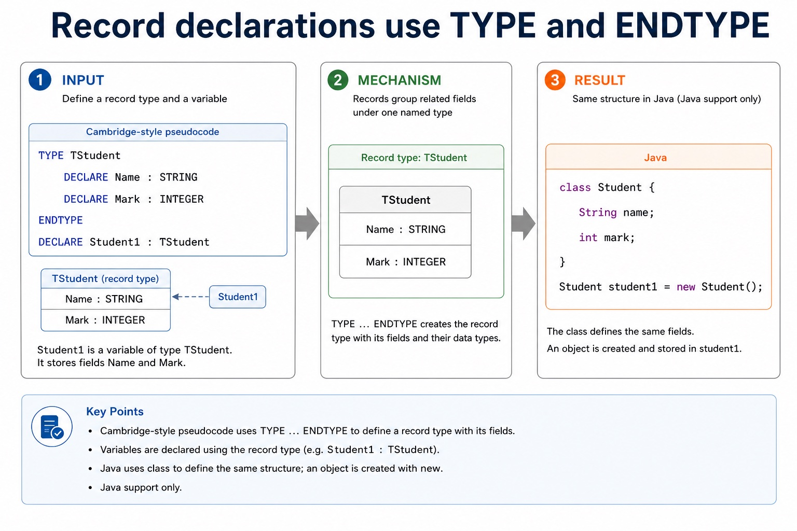

Text transcript

- Cambridge-style pseudocode
- TYPE TStudent
- DECLARE Name : STRING
- DECLARE Mark : INTEGER
- DECLARE Student1 : TStudent
- Java support only
- class Student {
- String name;

#### Which syntax belongs to which answer style?

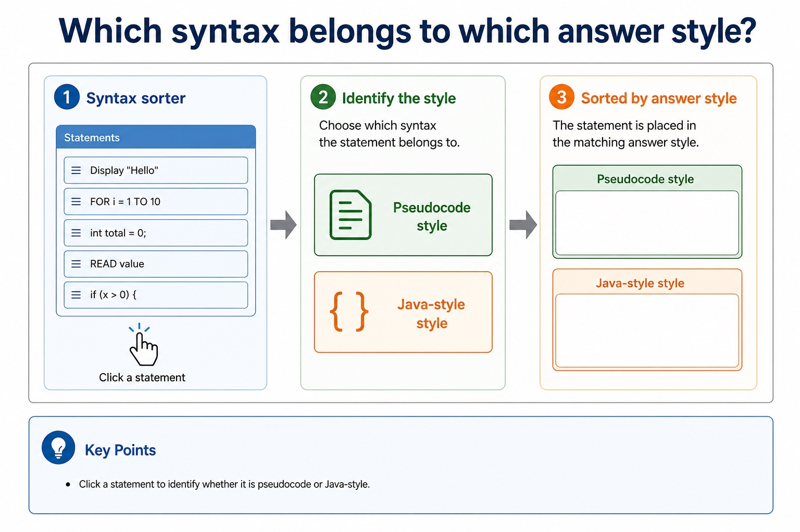

Text transcript

- Syntax sorter
- Click a statement to identify whether it is pseudocode or Java-style.

#### Map concepts, not spelling

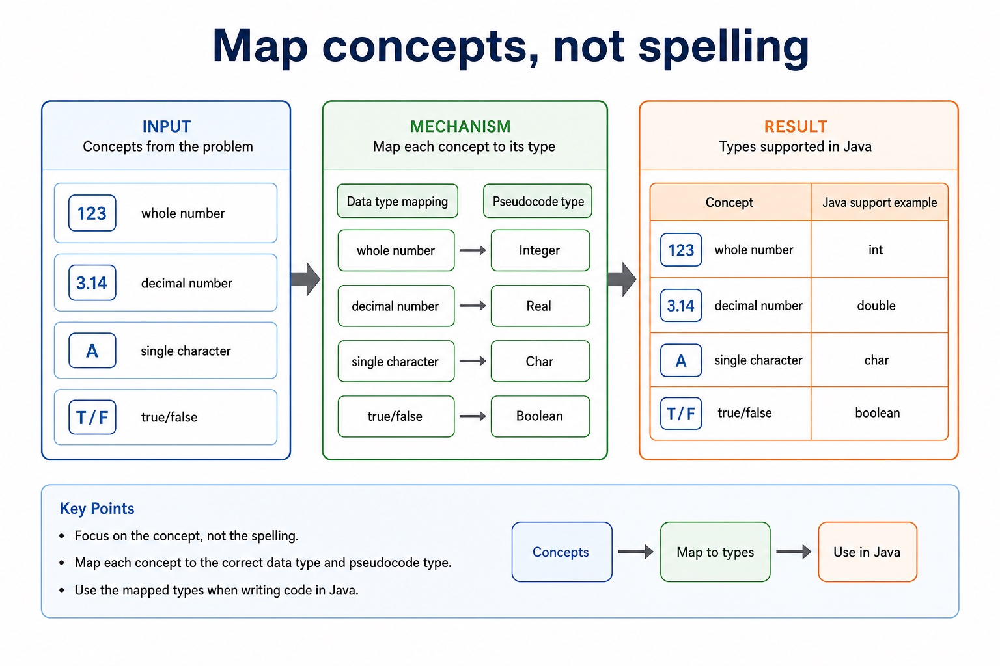

Text transcript

- Data type mapping
- Pseudocode type
- Java support example
- whole number
- decimal number
- single character
- true/false

#### Declare first; initialise separately when needed

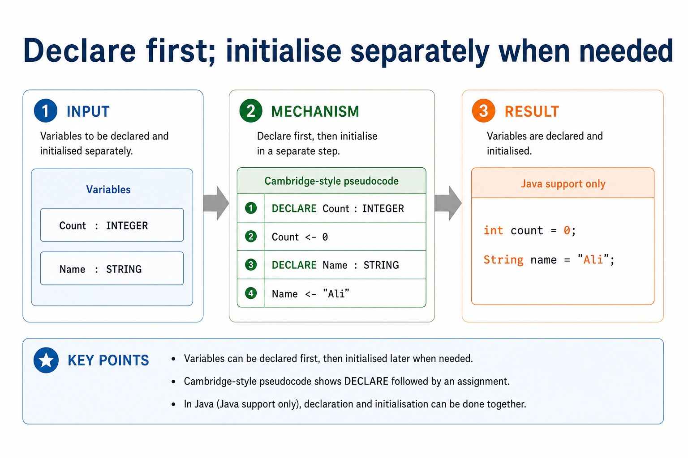

Text transcript

- Variables
- Cambridge-style pseudocode
- DECLARE Count : INTEGER
- Count <- 0
- DECLARE Name : STRING
- Name <- "Ali"
- Java support only
- int count = 0;

Open precise terminology and exam facts

- Select and use appropriate types for a problem solution. The Version 2 Notes name integer, real, char, string, Boolean and date, and require the Cambridge pseudocode type names INTEGER, REAL, CHAR, STRING, BOOLEAN, DATE, ARRAY and FILE.
- Select a type from the meaning and operations required by the problem. INTEGER stores whole numbers, REAL stores values that may contain a fractional part, CHAR stores one character, STRING stores a sequence of characters, BOOLEAN stores TRUE or FALSE, and DATE stores a calendar date.
- Cambridge pseudocode uses the type names INTEGER, REAL, CHAR, STRING, BOOLEAN, DATE, ARRAY and FILE. ARRAY and FILE describe structured or persistent data; their declarations also state an element type, bounds or file usage as required by the problem.
- An identifier that contains digits is not automatically INTEGER. Codes, telephone numbers and identifiers with leading zeroes normally use STRING because arithmetic is not required. Type selection does not replace validation of permitted values.

### Worked example

1. Choose types for a booking
2. Use STRING for BookingCode because it may contain letters or leading zeroes; DATE for VisitDate; INTEGER for TicketCount; REAL for TotalCost; CHAR for a one-letter Zone; BOOLEAN for HasPaid; ARRAY for a…

Beyond syllabus / 延伸知识（不要求背诵）: programming libraries often provide tested ADT implementations, but the exam expects you to understand their behaviour and selection.
## 3. Practice by question type

### Question 1 - foundation - justify - 8 marks

Select and justify suitable Cambridge types for CustomerName, MiddleInitial, DateJoined, ItemCount, MeanScore, IsActive, twenty marks and data that must remain after the program ends.

**Answer:** STRING for CustomerName; CHAR for MiddleInitial; DATE for DateJoined; INTEGER for ItemCount; REAL for MeanScore; BOOLEAN for IsActive; ARRAY with a numeric element type for twenty indexed marks; FILE for persistent data, with justifications linked to meaning or use

**Marking guidance:** Do not select a numeric type merely because an identifier contains digits, and do not use STRING as a generic replacement for DATE, CHAR or numeric values that require their defined operations.

**Common error:** For the command word justify, perform that exact action; do not replace it with an unrelated fact.

### Question 2 - application - identify - 2 marks

Identify the eight type names listed in the syllabus Notes.

**Answer:** INTEGER, REAL, CHAR, STRING, BOOLEAN, DATE, ARRAY and FILE.

**Marking guidance:** Award one mark for each distinct, technically accurate point or method step.

**Common error:** Do not repeat the same point in different words; each mark needs a separate idea or method step.

### Question 3 - transfer - suggest - 2 marks

Suggest a type for 18.75 used in arithmetic.

**Answer:** REAL, because the value has a fractional part.

**Marking guidance:** Award one mark for each distinct, technically accurate point or method step.

**Common error:** Do not copy the worked example unchanged; transfer the method and check it against the new context.

### Related past-paper indexes

| Reference | Marks | Command word | Question type |
|---|---:|---|---|
| 9618/21/S/25 Q7(i) | 8 | write | calculate |
| 9618/21/W/25 Q8(b) | 8 | define | recall |
| 9618/23/S/25 Q7(i) | 8 | write | write |
| 9618/23/W/25 Q8(a) | 8 | define | recall |

These are indexes only. Cambridge question and mark-scheme wording is not reproduced.

## 4. Summary and exam reminders

### Summary

- Define cambridge data types and declarations with the exact technical vocabulary expected by the syllabus.
- Use the lesson method on a fresh context and show the intermediate decision, representation or calculation.
- Match the shape of the answer to the command word and the available marks.
- Check the final answer against the scenario instead of repeating a memorised sentence.

### Common error to correct

Students often confuse the identifier of the whole structure with one element. Correction: access requires an index or field name.

### Exam technique

- Follow the command word: state gives a fact; explain links a cause to a consequence; compare covers both sides.
- Match the number of independent points or method steps to the available marks.
- For cambridge data types and declarations, use the exact technical term before applying it to the scenario.
