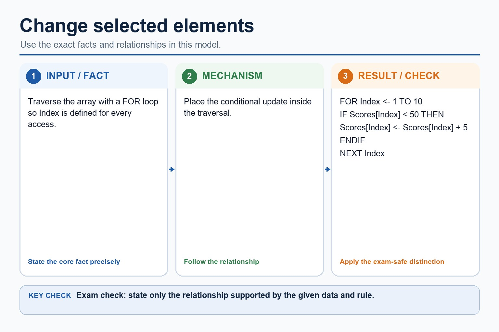
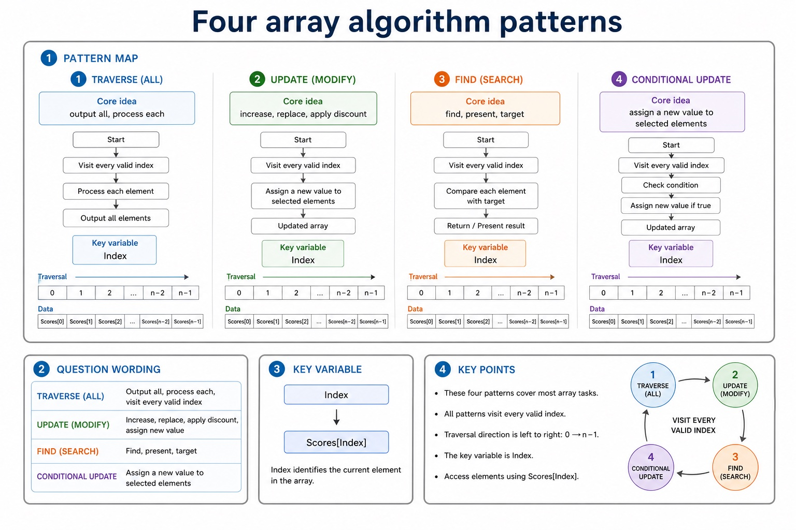
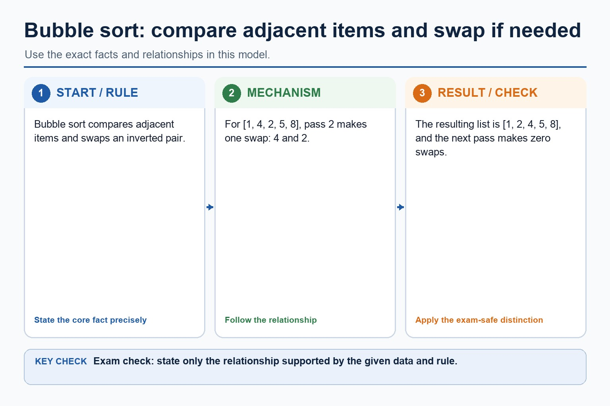
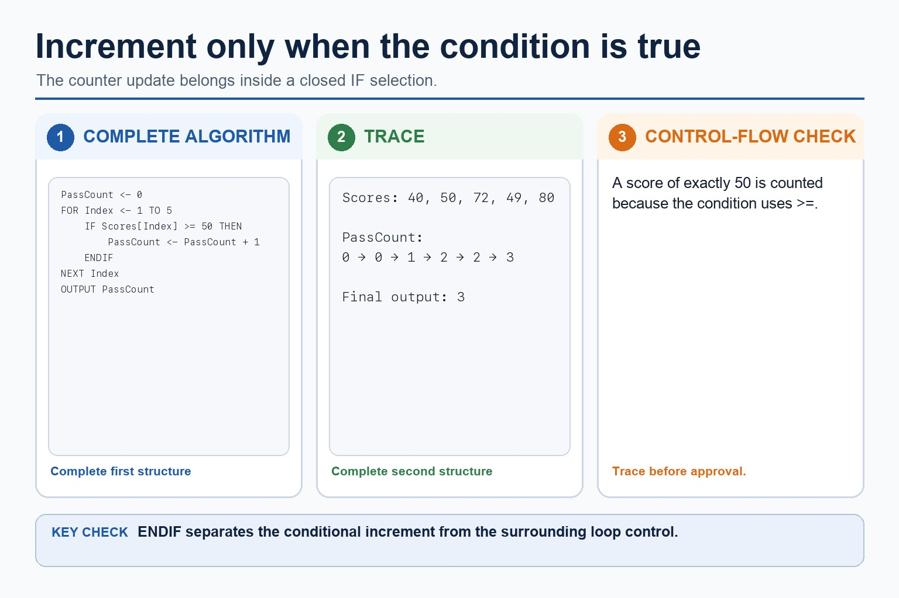
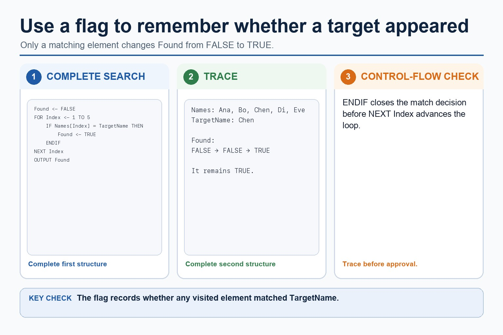
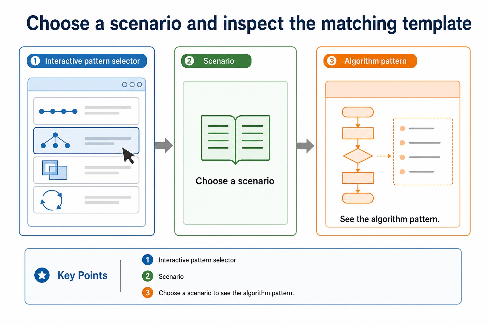
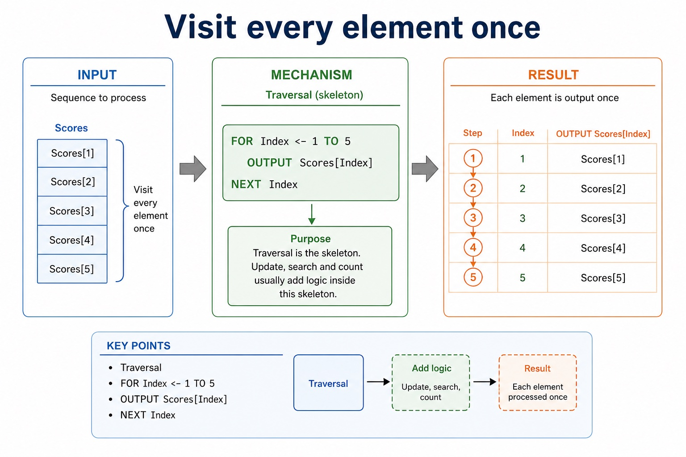

# Lesson 057: Array terminology, indices and bounds

**Course:** Cambridge International AS Level Computer Science 9618, 2027-2029 Version 2 
**Paper:** Paper 2 
**Syllabus:** Section 10: Data types and structures 
**Syllabus requirements:** S10.03 
**Pacing:** Flexible. Select the material set and practice depth needed by the learner.

## Teaching-depth menu

- **Quick route:** Use the diagnostic, learning objectives, first worked example and foundation question. Stop once the learner can explain the central distinction accurately.
- **Full route:** Use every knowledge-point material set, the worked method, the terminology check and all questions.
- **Deep route:** Add the prerequisite refresher, ask learners to connect the concept checklist, discuss the labelled extension and complete a transfer question without a model answer.

## 1. Prerequisite knowledge and quick diagnostic

Recall the main conclusion from Lesson 056: Records: defining, reading and saving structured data.

Ask the learner to give one accurate definition or method step before continuing. If they cannot, briefly revisit the named prerequisite rather than repeating the whole previous lesson.

## 2. Knowledge explanation

### 1. Array · Index · Lower bound · Upper bound (S10.03)

**Concept map:** array → index → lower bound → upper bound

**Three-part explanation:**

1. Use the technical terms associated with arrays, including index, lower bound and upper bound
2. Bounds define the inclusive valid index range and an index selects one element
3. ARRAY[1:4] OF STRING, 1 is the lower bound, 4 is the upper bound and the valid indexes are 1, 2, 3 and 4

**Concrete cue:** Use the technical terms associated with arrays, including index, lower bound and upper bound. Bounds define the inclusive valid index range and an index selects one element.

#### The index points to exactly one element

Text transcript

- Cambridge array declarations state an explicit lower and upper bound.
- Valid indexes follow the declared bounds and are not universally zero-based.
- Label 0 to n-1 as a chosen zero-based example, or use the lesson's declared bounds consistently.

#### Change selected elements

Text transcript

- Traverse the array with a FOR loop so Index is defined for every access.
- Place the conditional update inside the traversal.
- FOR Index <- 1 TO 10

#### Bounds say which indexes are valid

Text transcript

- Declare arrays
- Cambridge-style pseudocode
- Valid indexes
- Five integer scores
- DECLARE Scores : ARRAY[1:5] OF INTEGER
- 1, 2, 3, 4, 5
- Ten names
- DECLARE Names : ARRAY[1:10] OF STRING

#### Four array algorithm patterns

Text transcript

- Pattern map
- Question wording
- Core idea
- Key variable
- Traversal
- output all, process each
- visit every valid index
- increase, replace, apply discount

Precise syllabus wording

Understand array, index, lower bound and upper bound terminology.

Use the technical terms associated with arrays, including index, lower bound and upper bound. Bounds define the inclusive valid index range and an index selects one element.

### Supporting diagram library

#### Access one element

Text transcript

- Interactive index lookup
- Array: Scores[1:5] = 42, 67, 55, 81, 49.

#### A one-dimensional array is a linear collection

Text transcript

- Array model
- Same identifier
- All elements belong to one array name.
- Same type
- At AS level, an array stores elements of the same data type.
- ARRAY[1:5] OF INTEGER
- Indexed access
- An index selects one element.

#### Rows and columns create coordinates

Text transcript

- 2D model
- Same identifier
- The whole grid has one array name.
- Two indexes
- The first index usually selects the row; the second index selects the column.
- Marks[Row, Column]
- Same type
- Each cell stores the same data type.

#### Cambridge bounds and Java indexes are not the same habit

Text transcript

- Pseudocode vs Java
- Cambridge-style pseudocode
- DECLARE Scores : ARRAY[1:5] OF INTEGER
- FOR Index <- 1 TO 5
- INPUT Scores[Index]
- NEXT Index
- Java support only
- int[] scores = new int[5];

#### Do not import Java indexing into Cambridge answers

Text transcript

- Traverse a 3 by 4 array with nested loops.
- Output the current cell inside the inner loop.
- A corresponding Java support version must also output every current cell.
- The two versions use explicitly stated indexing conventions.

#### Use a loop to visit every element

Text transcript

- Traversal
- Input all scores
- FOR Index <- 1 TO 5
- INPUT Scores[Index]
- NEXT Index
- Total all scores
- Total <- 0
- Total <- Total + Scores[Index]

#### Why bubble sort repeats adjacent comparisons

Text transcript

- Bubble sort compares adjacent items and swaps an inverted pair.
- For [1, 4, 2, 5, 8], pass 2 makes one swap: 4 and 2.
- The resulting list is [1, 2, 4, 5, 8], and the next pass makes zero swaps.

#### Increment only when a condition is true

Text transcript

- Initialise PassCount to zero before traversing five scores.
- Increment PassCount only when the current score is at least 50.
- Close the selection with ENDIF before NEXT Index.
- Output PassCount after the loop.

#### Linear search checks each item in order

Text transcript

- Knowledge explanation
- How it works
- Start at the first item. Compare it with the target. If it matches, stop. If not, move to the next item until found or the list ends.
- When it is suitable
- Use it when data is unsorted, the list is small, or simplicity matters more than speed.
- Worst case: the target is last or absent, so every item may be checked.

#### Same algorithm, different array syntax

Text transcript

- Both pseudocode and Java versions visit five score positions.
- Increment the pass counter only when the current score is at least 50.
- Close the conditional before advancing the loop.
- Both complete versions output the final pass count after the loop.

#### Use a flag to remember whether the target appeared

Text transcript

- Initialise Found to FALSE before traversing the names.
- Set Found to TRUE only when the current name equals TargetName.
- Close the match selection with ENDIF before NEXT Index.
- Output Found after the traversal.

#### Choose a scenario and inspect the matching template

Text transcript

- Interactive pattern selector
- Scenario
- Choose a scenario to see the algorithm pattern.

#### Visit every element once

Text transcript

- Traversal
- FOR Index <- 1 TO 5
- OUTPUT Scores[Index]
- NEXT Index
- Traversal is the skeleton. Update, search and count usually add logic inside this skeleton.

Open precise terminology and exam facts

- Use the technical terms associated with arrays, including index, lower bound and upper bound. Bounds define the inclusive valid index range and an index selects one element.
- An array is a collection of elements stored under one identifier. An index selects one element. The lower bound is the first valid index and the upper bound is the last valid index; both bounds are inclusive in a Cambridge declaration such as ARRAY[1:20] OF INTEGER.
- Choose a one-dimensional array when each element needs one position, such as twenty marks or a list of names. Choose a two-dimensional array when each value naturally needs a row and a column, such as marks for several students across several tests. Do not choose 2D merely because there are many values.
- One-dimensional array pseudocode must declare explicit bounds and an element type, access elements with one index and use loop bounds that match the declared lower and upper bounds. The number of elements is upper bound - lower bound + 1.
- Before tracing a search, define the data structure it traverses. An array is a fixed-size indexed collection whose elements have one declared data type. The index selects one element; it is not the value stored in that element.
- Cambridge pseudocode declares explicit inclusive bounds. In DECLARE Names : ARRAY[1:4] OF STRING, 1 is the lower bound, 4 is the upper bound and the valid indexes are 1, 2, 3 and 4. A search must start and stop within those declared bounds.
- Linear search checks successive indexed elements until the target is found or every populated element has been checked. Binary search also uses indexes, but requires the array to be sorted so each comparison can discard one half of the remaining index range.

### Worked example

1. Declare the search data before tracing it
2. ARRAY[1:4] OF STRING defines four string elements.
3. For Names = ['Asha', 'Ben', 'Chen', 'Dina'], a one-based linear search compares Names[1], then Names[2], and stops when it finds 'Ben'.
4. Index 0 is invalid because it is below the declared lower bound.

Beyond syllabus / 延伸知识（不要求背诵）: programming libraries often provide tested ADT implementations, but the exam expects you to understand their behaviour and selection.
## 3. Practice by question type

### Question 1 - foundation - write - 6 marks

Write declarations for a one-dimensional array for 25 REAL measurements, input every element and explain why a two-dimensional array is not required.

**Answer:** DECLARE Measurements : ARRAY[1:25]; OF REAL; FOR loop uses the declared lower and upper bounds; INPUT Measurements[Index] and closes with NEXT Index; one index identifies each measurement; there is no row-column relationship requiring a second dimension

**Marking guidance:** Do not use index 0 when the declared lower bound is 1, and do not describe bounds as stored element values.

**Common error:** For the command word write, perform that exact action; do not replace it with an unrelated fact.

### Question 2 - application - explain - 2 marks

Why must binary search know the current Low and High indexes?

**Answer:** They delimit the remaining sorted portion of the array that may contain the target.

**Marking guidance:** Award one mark for each distinct, technically accurate point or method step.

**Common error:** Do not repeat the same point in different words; each mark needs a separate idea or method step.

### Question 3 - transfer - define - 2 marks

Define index, lower bound and upper bound.

**Answer:** An index selects an element; the lower bound is the first valid index; the upper bound is the last valid index.

**Marking guidance:** Award one mark for each distinct, technically accurate point or method step.

**Common error:** Do not copy the worked example unchanged; transfer the method and check it against the new context.

### Related past-paper indexes

| Reference | Marks | Command word | Question type |
|---|---:|---|---|
| 9618/22/S/24 Q5(a)(i) | 3 | identify | recall |
| 9618/22/S/24 Q5(ii) | 2 | explain | explain |
| 9618/23/W/24 Q5(i) | 2 | complete | recall |
| 9618/22/S/24 Q5(b) | 1 | identify | write |

These are indexes only. Cambridge question and mark-scheme wording is not reproduced.

## 4. Summary and exam reminders

### Summary

- Define array terminology, indices and bounds with the exact technical vocabulary expected by the syllabus.
- Use the lesson method on a fresh context and show the intermediate decision, representation or calculation.
- Match the shape of the answer to the command word and the available marks.
- Check the final answer against the scenario instead of repeating a memorised sentence.

### Common error to correct

Students often confuse the identifier of the whole structure with one element. Correction: access requires an index or field name.

### Exam technique

- Follow the command word: state gives a fact; explain links a cause to a consequence; compare covers both sides.
- Match the number of independent points or method steps to the available marks.
- For array terminology, indices and bounds, use the exact technical term before applying it to the scenario.
