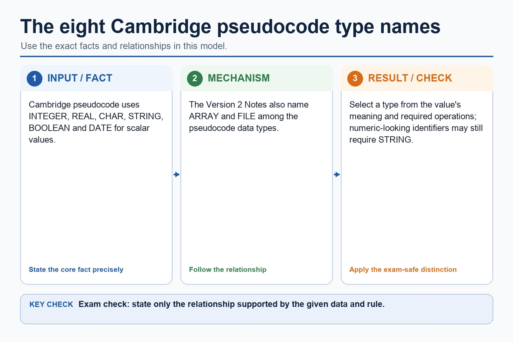

# Lesson 059: Selecting and using two-dimensional arrays

**Course:** Cambridge International AS Level Computer Science 9618, 2027-2029 Version 2 
**Paper:** Paper 2 
**Syllabus:** Section 10: Data types and structures 
**Syllabus requirements:** S10.04, S10.05 
**Pacing:** Flexible. Select the material set and practice depth needed by the learner.

## Teaching-depth menu

- **Quick route:** Use the diagnostic, learning objectives, first worked example and foundation question. Stop once the learner can explain the central distinction accurately.
- **Full route:** Use every knowledge-point material set, the worked method, the terminology check and all questions.
- **Deep route:** Add the prerequisite refresher, ask learners to connect the concept checklist, discuss the labelled extension and complete a transfer question without a model answer.

## 1. Prerequisite knowledge and quick diagnostic

Recall S10.03 before starting this lesson.

Ask the learner to give one accurate definition or method step before continuing. If they cannot, briefly revisit the named prerequisite rather than repeating the whole previous lesson.

### Optional prerequisite refresher

- Use the technical terms associated with arrays, including index, lower bound and upper bound. Bounds define the inclusive valid index range and an index selects one element.
- Understand array, index, lower bound and upper bound terminology.

## 2. Knowledge explanation

### 1. One-dimensional · Two-dimensional · Select (S10.04)

**Concept map:** one-dimensional → two-dimensional → select

**Three-part explanation:**

1. two indexes suit data with a genuine row-column or equivalent two-coordinate relationship
2. Select a suitable one-dimensional (1D) or two-dimensional (2D) array for a given task
3. A two-dimensional array uses two indexes, normally interpreted as row and column

**Concrete cue:** Select a suitable one-dimensional (1D) or two-dimensional (2D) array for a given task. One index suits a linear collection; two indexes suit data with a genuine row-column or equivalent two-coordinate…

#### A one-dimensional array is a linear collection

Text transcript

- Array model
- Same identifier
- All elements belong to one array name.
- Same type
- At AS level, an array stores elements of the same data type.
- ARRAY[1:5] OF INTEGER
- Indexed access
- An index selects one element.

#### Rows and columns create coordinates

Text transcript

- 2D model
- Same identifier
- The whole grid has one array name.
- Two indexes
- The first index usually selects the row; the second index selects the column.
- Marks[Row, Column]
- Same type
- Each cell stores the same data type.

#### Linear search checks each item in order

Text transcript

- Knowledge explanation
- How it works
- Start at the first item. Compare it with the target. If it matches, stop. If not, move to the next item until found or the list ends.
- When it is suitable
- Use it when data is unsorted, the list is small, or simplicity matters more than speed.
- Worst case: the target is last or absent, so every item may be checked.

Precise syllabus wording

Select one- or two-dimensional arrays for a scenario.

Select a suitable one-dimensional (1D) or two-dimensional (2D) array for a given task. One index suits a linear collection; two indexes suit data with a genuine row-column or equivalent two-coordinate relationship.

### 2. Pseudocode · One-dimensional · Two-dimensional · ARRAY (S10.05)

**Concept map:** pseudocode → one-dimensional → two-dimensional → ARRAY

**Three-part explanation:**

1. declare explicit inclusive bounds and an element type, use the required number of indexes, and traverse only valid positions
2. One-dimensional array pseudocode must declare explicit bounds and an element type, access elements with one index and use loop bounds that match the declared lower and…
3. both bounds are inclusive in a Cambridge declaration such as ARRAY[1:20] OF INTEGER

**Concrete cue:** Write Cambridge pseudocode for 1D and 2D arrays: declare explicit inclusive bounds and an element type, use the required number of indexes, and traverse only valid positions.

#### Cambridge bounds and Java indexes are not the same habit

Text transcript

- Pseudocode vs Java
- Cambridge-style pseudocode
- DECLARE Scores : ARRAY[1:5] OF INTEGER
- FOR Index <- 1 TO 5
- INPUT Scores[Index]
- NEXT Index
- Java support only
- int[] scores = new int[5];

#### Bounds say which indexes are valid

Text transcript

- Declare arrays
- Cambridge-style pseudocode
- Valid indexes
- Five integer scores
- DECLARE Scores : ARRAY[1:5] OF INTEGER
- 1, 2, 3, 4, 5
- Ten names
- DECLARE Names : ARRAY[1:10] OF STRING

#### The eight Cambridge pseudocode type names

Text transcript

- Cambridge pseudocode uses INTEGER, REAL, CHAR, STRING, BOOLEAN and DATE for scalar values.
- The Version 2 Notes also name ARRAY and FILE among the pseudocode data types.
- Select a type from the value's meaning and required operations; numeric-looking identifiers may still require STRING.

#### Two dimensions need two ranges

Text transcript

- Declare 2D arrays
- Cambridge-style pseudocode
- Valid cells
- 3 by 4 mark table
- DECLARE Marks : ARRAY[1:3, 1:4] OF INTEGER
- 3 rows, 4 columns, 12 cells
- 5 by 7 temperatures
- DECLARE Temp : ARRAY[1:5, 1:7] OF REAL

Precise syllabus wording

Write pseudocode using one- and two-dimensional arrays.

Write Cambridge pseudocode for 1D and 2D arrays: declare explicit inclusive bounds and an element type, use the required number of indexes, and traverse only valid positions.

### Supporting diagram library

#### The index points to exactly one element

Text transcript

- Cambridge array declarations state an explicit lower and upper bound.
- Valid indexes follow the declared bounds and are not universally zero-based.
- Label 0 to n-1 as a chosen zero-based example, or use the lesson's declared bounds consistently.

#### Access one element

Text transcript

- Interactive index lookup
- Array: Scores[1:5] = 42, 67, 55, 81, 49.

#### Do not import Java indexing into Cambridge answers

Text transcript

- Traverse a 3 by 4 array with nested loops.
- Output the current cell inside the inner loop.
- A corresponding Java support version must also output every current cell.
- The two versions use explicitly stated indexing conventions.

#### Use a loop to visit every element

Text transcript

- Traversal
- Input all scores
- FOR Index <- 1 TO 5
- INPUT Scores[Index]
- NEXT Index
- Total all scores
- Total <- 0
- Total <- Total + Scores[Index]

#### A cell needs row and column

Text transcript

- Access and update
- Read one cell
- OUTPUT Marks[2, 3]
- Outputs the value in row 2, column 3.
- Update one cell
- Marks[2, 3] <- Marks[2, 3] + 1
- Only that cell changes; other rows and columns are untouched.

#### Read Marks[Row, Column]

![Read Marks[Row, Column]](../web/assets/diagrams/stage10-infographics/stage10-lesson-117-lookup.jpg)

Text transcript

- Interactive cell lookup
- Array: Marks[1:3, 1:4]. Choose a row and column.

#### Outer row loop, inner column loop

Text transcript

- Nested loops
- Input every cell
- FOR Row <- 1 TO 3
- FOR Column <- 1 TO 4
- INPUT Marks[Row, Column]
- NEXT Column
- NEXT Row
- Total every cell

Open precise terminology and exam facts

- Select a suitable one-dimensional (1D) or two-dimensional (2D) array for a given task. One index suits a linear collection; two indexes suit data with a genuine row-column or equivalent two-coordinate relationship.
- Write Cambridge pseudocode for 1D and 2D arrays: declare explicit inclusive bounds and an element type, use the required number of indexes, and traverse only valid positions.
- An array is a collection of elements stored under one identifier. An index selects one element. The lower bound is the first valid index and the upper bound is the last valid index; both bounds are inclusive in a Cambridge declaration such as ARRAY[1:20] OF INTEGER.
- Choose a one-dimensional array when each element needs one position, such as twenty marks or a list of names. Choose a two-dimensional array when each value naturally needs a row and a column, such as marks for several students across several tests. Do not choose 2D merely because there are many values.
- One-dimensional array pseudocode must declare explicit bounds and an element type, access elements with one index and use loop bounds that match the declared lower and upper bounds. The number of elements is upper bound - lower bound + 1.
- A two-dimensional array uses two indexes, normally interpreted as row and column. In DECLARE Marks : ARRAY[1:30, 1:4] OF INTEGER, the first range gives 30 valid row indexes and the second gives 4 valid column indexes, for 120 cells.
- Select 2D when the scenario has two independent position dimensions, such as Student and Test, Row and Column, or Day and Period. A simple list, sequence or one category of positions remains 1D even when it contains many elements.
- Two-dimensional pseudocode declares both ranges, accesses one cell as Marks[Student, Test] and normally uses nested loops: one loop traverses rows and the inner loop traverses every column for the current row.

### Worked example

1. Choose and declare the dimension
2. Twenty daily temperatures need one position per day, so DECLARE Temperature
3. ARRAY[1:20] OF REAL is suitable and valid indexes are 1 to 20.
4. Marks for 30 students in 4 tests need row and column positions, so a 2D array is suitable instead.

Beyond syllabus / 延伸知识（不要求背诵）: programming libraries often provide tested ADT implementations, but the exam expects you to understand their behaviour and selection.
## 3. Practice by question type

### Question 1 - foundation - write - 2 marks

Write a declaration for 50 Boolean flags and state the number of elements.

**Answer:** DECLARE Flag : ARRAY[1:50] OF BOOLEAN; there are 50 elements.

**Marking guidance:** Award one mark for each distinct, technically accurate point or method step.

**Common error:** For the command word write, perform that exact action; do not replace it with an unrelated fact.

### Question 2 - application - suggest - 2 marks

Suggest 1D or 2D for twelve monthly rainfall totals.

**Answer:** 1D, because one month index selects each total.

**Marking guidance:** Award one mark for each distinct, technically accurate point or method step.

**Common error:** Do not repeat the same point in different words; each mark needs a separate idea or method step.

### Question 3 - transfer - state - 2 marks

State two precise facts about selecting and using two-dimensional arrays.

**Answer:** Select a suitable one-dimensional (1D) or two-dimensional (2D) array for a given task. One index suits a linear collection; two indexes suit data with a genuine row-column or equivalent two-coordinate relationship. Write Cambridge pseudocode for 1D and 2D arrays: declare explicit inclusive bounds and an element type, use the required number of indexes, and traverse only valid positions.

**Marking guidance:** Award one mark for each distinct fact; do not credit a repeated point.

**Common error:** Do not copy the worked example unchanged; transfer the method and check it against the new context.

### Related past-paper indexes

| Reference | Marks | Command word | Question type |
|---|---:|---|---|
| 9618/21/S/25 Q6(b) | 8 | complete | recall |
| 9618/21/W/25 Q4(a) | 6 | complete | recall |
| 9618/22/W/25 Q8(b) | 5 | complete | write |
| 9618/21/W/25 Q3(a)(i) | 4 | define | write |

These are indexes only. Cambridge question and mark-scheme wording is not reproduced.

## 4. Summary and exam reminders

### Summary

- Define selecting and using two-dimensional arrays with the exact technical vocabulary expected by the syllabus.
- Use the lesson method on a fresh context and show the intermediate decision, representation or calculation.
- Match the shape of the answer to the command word and the available marks.
- Check the final answer against the scenario instead of repeating a memorised sentence.

### Common error to correct

Students often confuse the identifier of the whole structure with one element. Correction: access requires an index or field name.

### Exam technique

- Follow the command word: state gives a fact; explain links a cause to a consequence; compare covers both sides.
- Match the number of independent points or method steps to the available marks.
- For selecting and using two-dimensional arrays, use the exact technical term before applying it to the scenario.
