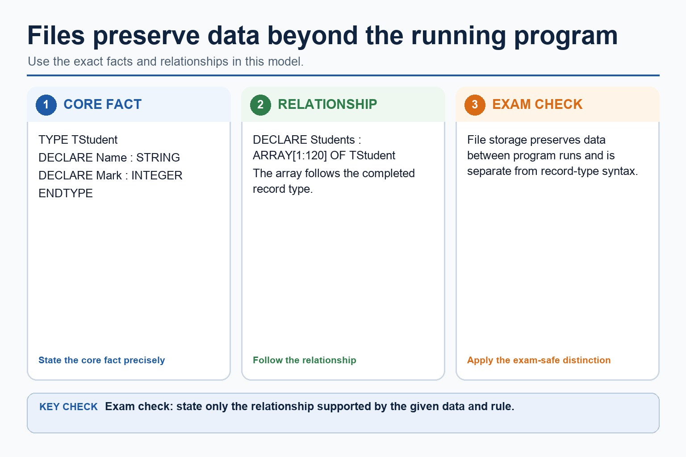
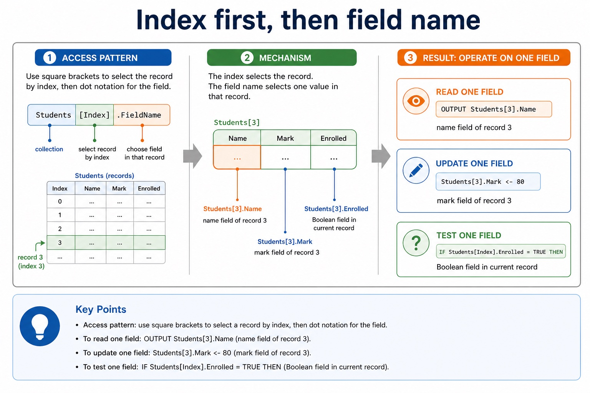
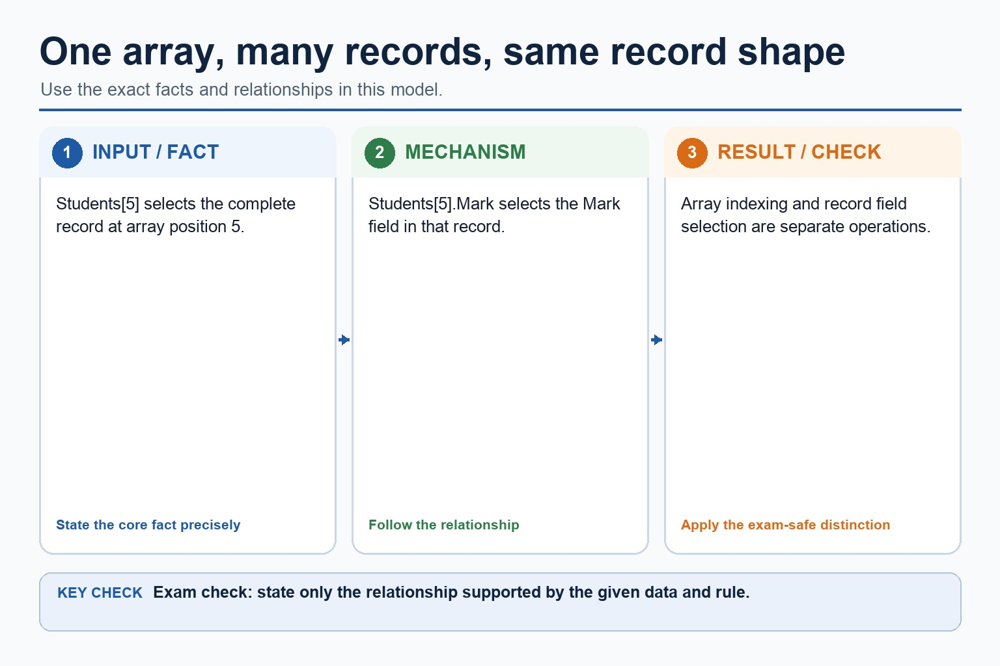
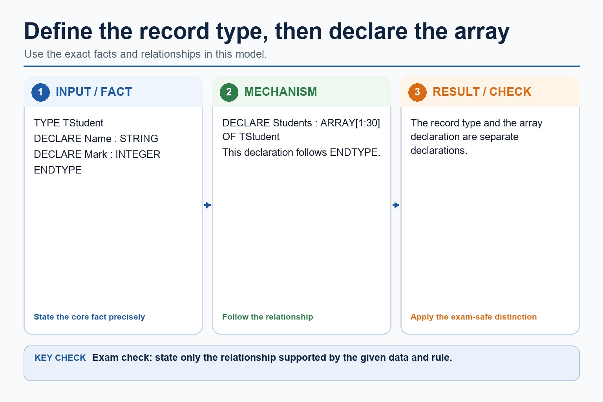
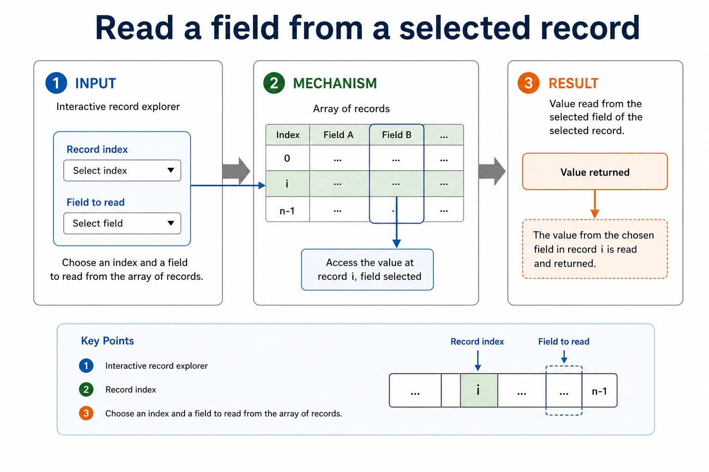
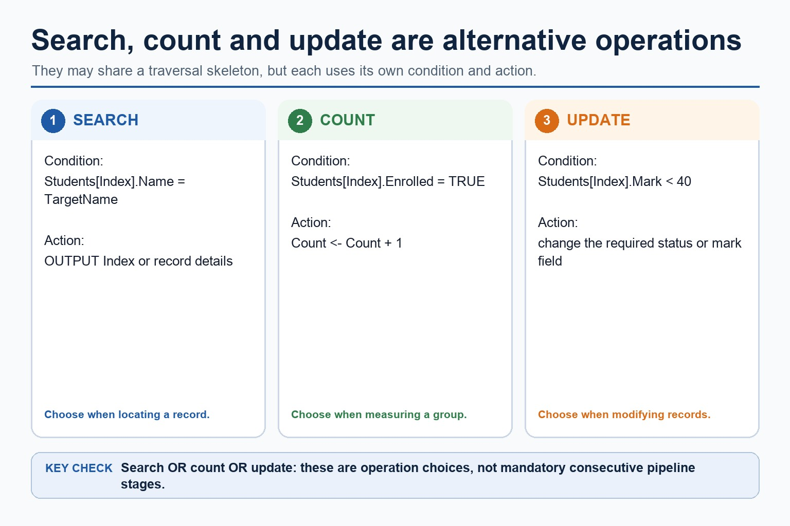
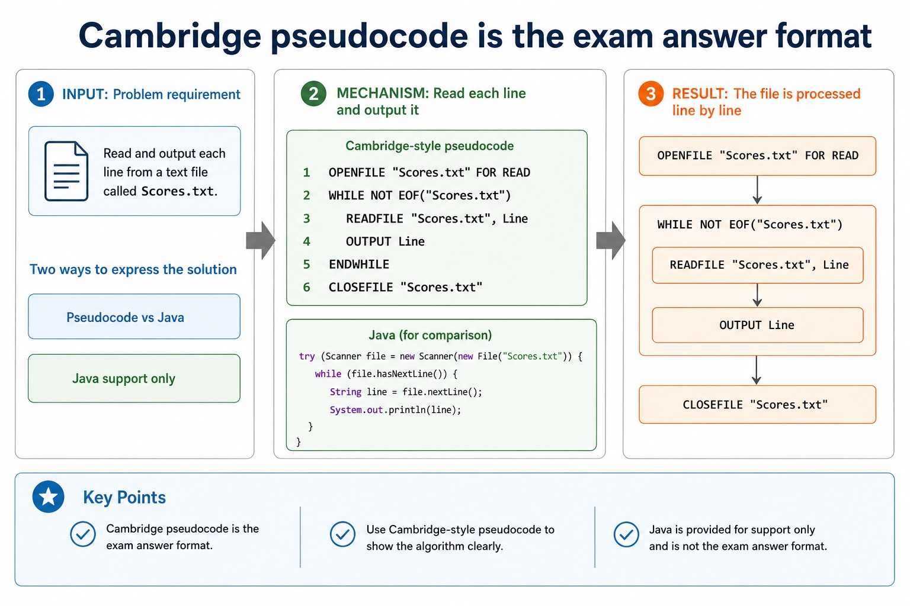
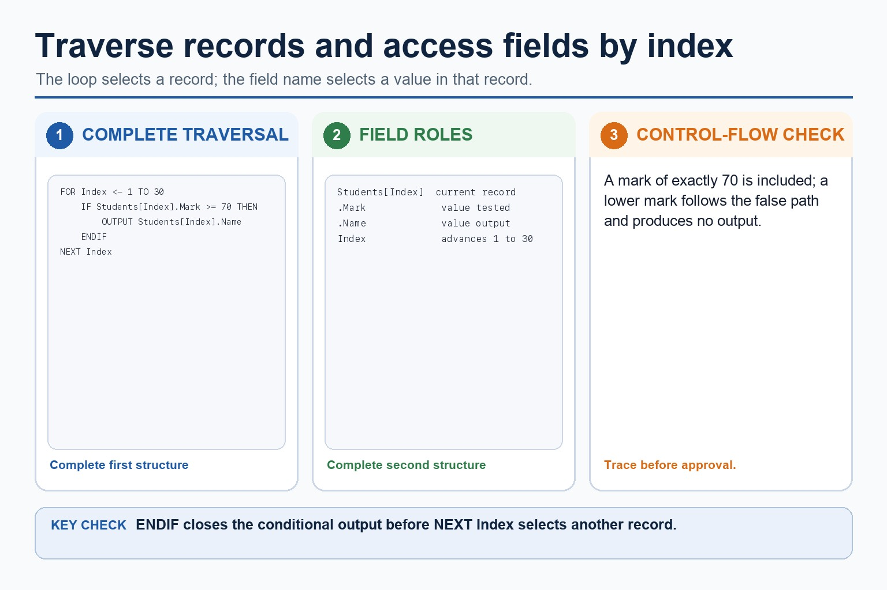

# Lesson 062: Why files are needed and text-file pseudocode

**Course:** Cambridge International AS Level Computer Science 9618, 2027-2029 Version 2 
**Paper:** Paper 2 
**Syllabus:** Section 10: Data types and structures 
**Syllabus requirements:** S10.07 
**Pacing:** Flexible. Select the material set and practice depth needed by the learner.

## Teaching-depth menu

- **Quick route:** Use the diagnostic, learning objectives, first worked example and foundation question. Stop once the learner can explain the central distinction accurately.
- **Full route:** Use every knowledge-point material set, the worked method, the terminology check and all questions.
- **Deep route:** Add the prerequisite refresher, ask learners to connect the concept checklist, discuss the labelled extension and complete a transfer question without a model answer.

## 1. Prerequisite knowledge and quick diagnostic

Recall S10.01 before starting this lesson.

Ask the learner to give one accurate definition or method step before continuing. If they cannot, briefly revisit the named prerequisite rather than repeating the whole previous lesson.

### Optional prerequisite refresher

- Select and use appropriate types for a problem solution. The Version 2 Notes name integer, real, char, string, Boolean and date, and require the Cambridge pseudocode type names INTEGER, REAL, CHAR, STRING, BOOLEAN, DATE, ARRAY and FILE.
- Understand integer, real, char, string, Boolean and date types and Cambridge pseudocode type names.

## 2. Knowledge explanation

### 1. Files · Persistent · Text file · Pseudocode (S10.07)

**Concept map:** files → persistent → text file → pseudocode

**Three-part explanation:**

1. Show why files are needed for persistent data beyond one program run, and write Cambridge pseudocode to handle text files consisting of one or more lines,…
2. For a text file containing one or more lines, select the mode before processing
3. Every opened file must be closed after processing

**Concrete cue:** Show why files are needed for persistent data beyond one program run, and write Cambridge pseudocode to handle text files consisting of one or more lines, including opening, processing and…

#### Cambridge pseudocode is the exam answer format

Text transcript

- Pseudocode vs Java
- Cambridge-style pseudocode
- OPENFILE "Scores.txt" FOR READ
- WHILE NOT EOF("Scores.txt")
- READFILE "Scores.txt", Line
- OUTPUT Line
- ENDWHILE
- CLOSEFILE "Scores.txt"

#### A text file stores characters, usually processed one line at a time

Text transcript

- Exam clue
- Text file
- file containing character data
- "Scores.txt"
- get data from an existing file
- FOR READ
- store data to a file, often replacing previous contents
- FOR WRITE

#### Files preserve data beyond the running program

Text transcript

- TYPE TStudent
- DECLARE Students : ARRAY[1:120] OF TStudent
- File storage preserves data between program runs and is separate from record-type syntax.

#### The eight Cambridge pseudocode type names

Text transcript

- Cambridge pseudocode uses INTEGER, REAL, CHAR, STRING, BOOLEAN and DATE for scalar values.
- The Version 2 Notes also name ARRAY and FILE among the pseudocode data types.
- Select a type from the value's meaning and required operations; numeric-looking identifiers may still require STRING.

Precise syllabus wording

Explain the need for files and use text-file pseudocode.

Show why files are needed for persistent data beyond one program run, and write Cambridge pseudocode to handle text files consisting of one or more lines, including opening, processing and closing in the correct mode.

### Supporting diagram library

#### Index first, then field name

Text transcript

- Access pattern
- Pseudocode
- Read one field
- OUTPUT Students[3].Name
- name field of record 3
- Update one field
- Students[3].Mark <- 80
- mark field of record 3

#### One array, many records, same record shape

Text transcript

- Students[5] selects the complete record at array position 5.
- Students[5].Mark selects the Mark field in that record.
- Array indexing and record field selection are separate operations.

#### Define the record type, then declare the array

Text transcript

- TYPE TStudent
- DECLARE Students : ARRAY[1:30] OF TStudent
- The record type and the array declaration are separate declarations.

#### Read a field from a selected record

Text transcript

- Interactive record explorer
- Record index
- Choose an index and a field to read from the array of records.

#### Search, count and update fields

Text transcript

- Search, count and update are alternative record operations, not mandatory consecutive stages.
- A search condition locates a matching record and outputs its position or details.
- A count condition increments a counter for qualifying records.
- An update condition changes the required field of qualifying records.

#### Same structure, different syntax

Text transcript

- Pseudocode vs Java
- Cambridge-style pseudocode
- DECLARE Students : ARRAY[1:30] OF TStudent
- FOR Index <- 1 TO 30
- OUTPUT Students[Index].Name
- NEXT Index
- Java support only
- Student[] students = new Student[30];

#### A loop visits each record; field access uses the loop index

Text transcript

- Use Index to select each Students record in turn.
- Test the Mark field of the current record.
- Output the Name field only when Mark is at least 70.
- Close the selection with ENDIF before NEXT Index.

Open precise terminology and exam facts

- Show why files are needed for persistent data beyond one program run, and write Cambridge pseudocode to handle text files consisting of one or more lines, including opening, processing and closing in the correct mode.
- Variables, arrays and records in main memory normally lose their contents when a program ends or power is removed. Files provide persistent storage so data can be reloaded by a later run, transferred or shared as required. A file is not merely a larger array.
- For a text file containing one or more lines, select the mode before processing: READ obtains existing data, WRITE creates or replaces output content, and APPEND adds after existing content. Every opened file must be closed after processing.
- A complete read algorithm uses OPENFILE for READ, checks NOT EOF before READFILE, processes each line and then CLOSEFILE. WRITEFILE stores a line in a file opened for WRITE or APPEND. Reading after EOF or using WRITE when old content must remain are boundary errors.

### Worked example

1. Copy selected lines between text files
2. Open Results.txt FOR READ and Pass.txt FOR WRITE.
3. While NOT EOF(Results.txt), READFILE the next Line; if it contains PASS, WRITEFILE it to Pass.txt.
4. Close both files after the loop.
5. Results remain available from storage, while Pass.txt is deliberately created as a new output file.

Beyond syllabus / 延伸知识（不要求背诵）: programming libraries often provide tested ADT implementations, but the exam expects you to understand their behaviour and selection.
## 3. Practice by question type

### Question 1 - foundation - write - 6 marks

Write Cambridge pseudocode to read every line from Input.txt, copy non-blank lines to Output.txt and close both files. Explain why the input data is stored in a file.

**Answer:** persistent/later-use need for the input file; opens Input.txt FOR READ; opens Output.txt FOR WRITE; loops WHILE NOT EOF before READFILE; writes only non-blank lines inside a coherent IF; closes both files after the loop

**Marking guidance:** Do not test EOF after an invalid read or claim that WRITE preserves existing output-file contents.

**Common error:** For the command word write, perform that exact action; do not replace it with an unrelated fact.

### Question 2 - application - explain - 2 marks

Why use a file instead of only an array?

**Answer:** A file persists after the program ends and can be reloaded in a later run.

**Marking guidance:** Award one mark for each distinct, technically accurate point or method step.

**Common error:** Do not repeat the same point in different words; each mark needs a separate idea or method step.

### Question 3 - transfer - explain - 2 marks

Why test NOT EOF before READFILE?

**Answer:** It prevents an attempt to read beyond the final available line.

**Marking guidance:** Award one mark for each distinct, technically accurate point or method step.

**Common error:** Do not copy the worked example unchanged; transfer the method and check it against the new context.

### Related past-paper indexes

| Reference | Marks | Command word | Question type |
|---|---:|---|---|
| 9618/22/S/25 Q5(b) | 8 | complete | recall |
| 9618/22/S/24 Q8(c) | 8 | give | write |
| 9618/23/S/24 Q2(a) | 5 | outline | explain |
| 9618/21/W/24 Q3(a) | 4 | complete | recall |

These are indexes only. Cambridge question and mark-scheme wording is not reproduced.

## 4. Summary and exam reminders

### Summary

- Define why files are needed and text-file pseudocode with the exact technical vocabulary expected by the syllabus.
- Use the lesson method on a fresh context and show the intermediate decision, representation or calculation.
- Match the shape of the answer to the command word and the available marks.
- Check the final answer against the scenario instead of repeating a memorised sentence.

### Common error to correct

Students often confuse the identifier of the whole structure with one element. Correction: access requires an index or field name.

### Exam technique

- Follow the command word: state gives a fact; explain links a cause to a consequence; compare covers both sides.
- Match the number of independent points or method steps to the available marks.
- For why files are needed and text-file pseudocode, use the exact technical term before applying it to the scenario.
