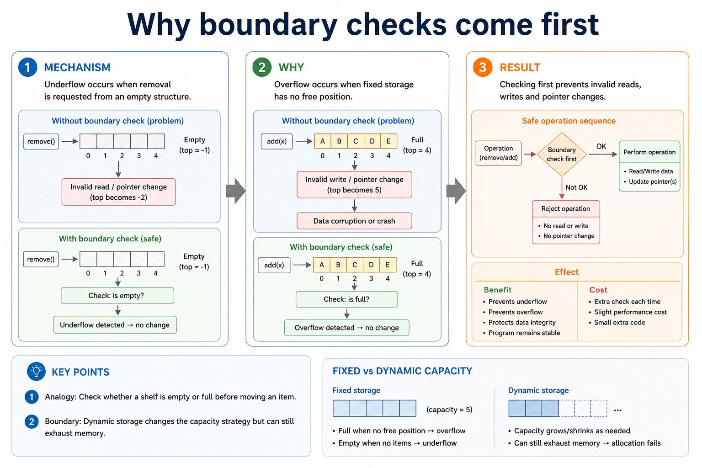
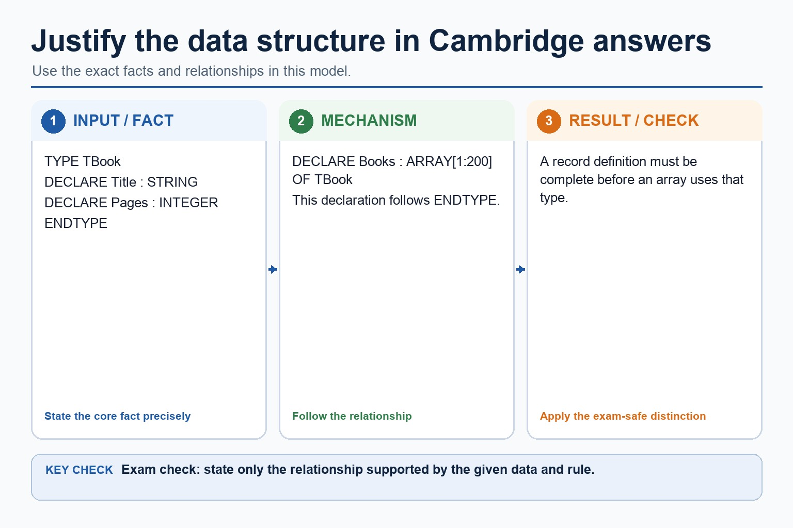

# Lesson 063: Abstract data types

**Course:** Cambridge International AS Level Computer Science 9618, 2027-2029 Version 2 
**Paper:** Paper 2 
**Syllabus:** Section 10: Data types and structures 
**Syllabus requirements:** S10.08 
**Pacing:** Flexible. Select the material set and practice depth needed by the learner.

## Teaching-depth menu

- **Quick route:** Use the diagnostic, learning objectives, first worked example and foundation question. Stop once the learner can explain the central distinction accurately.
- **Full route:** Use every knowledge-point material set, the worked method, the terminology check and all questions.
- **Deep route:** Add the prerequisite refresher, ask learners to connect the concept checklist, discuss the labelled extension and complete a transfer question without a model answer.

## 1. Prerequisite knowledge and quick diagnostic

Recall the main conclusion from Lesson 062: Why files are needed and text-file pseudocode.

Ask the learner to give one accurate definition or method step before continuing. If they cannot, briefly revisit the named prerequisite rather than repeating the whole previous lesson.

## 2. Knowledge explanation

### 1. Abstract data types (S10.08)

**Concept map:** abstract → type → collection of data → set of operations

**Three-part explanation:**

1. Its behaviour is defined independently of a particular storage implementation
2. An abstract data type (ADT) is a collection of data and a set of operations on those data
3. Candidates are not required to write pseudocode for these ADT operations, but must be able to add, edit and delete data and describe array implementations

**Concrete cue:** An abstract data type (ADT) is a collection of data and a set of operations on those data. Its behaviour is defined independently of a particular storage implementation.

#### An ADT is data together with permitted operations

Text transcript

- An abstract data type is a collection of data and a set of operations on those data.
- Stack, queue and linked list are examples whose permitted operations define their behaviour.
- The implementation may use arrays and indexes without changing the ADT's observable rules.

#### A type controls meaning and valid operations

Text transcript

- A data type determines which operations are meaningful for a stored value.
- A BOOLEAN can control a decision and a DATE can be compared with another date.
- Close every structured IF example with ENDIF.
- Choosing the correct type does not replace validation against the problem's allowed range.

#### Start with the data and operations, not the keyword

Text transcript

- Selection criteria
- Question to ask
- Why it matters
- Likely structure
- Are there many values of the same type?
- indexed traversal/search
- Does one item have several named fields?
- mixed types and meaningful field names

#### A one-dimensional array is a linear collection

Text transcript

- Array model
- Same identifier
- All elements belong to one array name.
- Same type
- At AS level, an array stores elements of the same data type.
- ARRAY[1:5] OF INTEGER
- Indexed access
- An index selects one element.

Precise syllabus wording

Understand the definition and purpose of an abstract data type.

An abstract data type (ADT) is a collection of data and a set of operations on those data. Its behaviour is defined independently of a particular storage implementation.

### Supporting diagram library

#### A text file stores characters, usually processed one line at a time

Text transcript

- Exam clue
- Text file
- file containing character data
- "Scores.txt"
- get data from an existing file
- FOR READ
- store data to a file, often replacing previous contents
- FOR WRITE

#### Implement stack, queue and linked list using arrays

Text transcript

- An array stack uses Top; a queue uses Front and Rear; a linked list uses Data, Next, Start and a free list.
- Add/delete preserve stack LIFO, queue FIFO and linked-list links; edit changes stored data without corrupting structure.
- Candidates are not required to write pseudocode for these ADT operations; understand add, edit, delete and array implementation.

#### Open, process, close

Text transcript

- File lifecycle
- 1. Open choose READ, WRITE or APPEND
- 2. Process READFILE or WRITEFILE using variables
- 3. Close release the file and finalise changes
- A file algorithm without CLOSEFILE is like leaving the exam hall without submitting the answer booklet.

#### Choose the correct file mode

Text transcript

- Interactive mode lab
- Scenario
- Choose a scenario and a mode.

#### Choose the mode before touching the file

Text transcript

- File modes
- Use when
- Risk if wrong
- existing file contents are needed
- cannot write new lines
- creating/replacing output contents
- old contents may be overwritten
- adding new data to the end

#### Why two ends create FIFO

Text transcript

- Enqueue adds a new item at the rear.
- Dequeue removes the waiting item at the front.
- Earlier arrivals remain ahead of later arrivals.

#### Use EOF so the loop stops at the end of the file

Text transcript

- Read loop
- OPENFILE "Scores.txt" FOR READ
- WHILE NOT EOF("Scores.txt")
- READFILE "Scores.txt", Line
- OUTPUT Line
- ENDWHILE
- CLOSEFILE "Scores.txt"
- The file line is read into Line . Only after that can the program output, split or validate it.

#### Step through a WHILE NOT EOF loop

Text transcript

- Open the file for reading before entering the loop.
- Check NOT EOF before attempting READFILE.
- When more data exists, read and process the next line.
- When EOF is true, skip READFILE, leave the loop and close the file.

#### A text line often represents one record

Text transcript

- Text records
- In simple exam-style examples, one line may contain fields separated by a comma. The delimiter must be consistent.
- Name = Ali
- Mark = 72
- Name = Bea
- Mark = 64

#### Why one open end creates LIFO

Text transcript

- Push adds the new item at the top position.
- Only the current top item is available to pop.
- The most recently pushed item therefore leaves first.

#### Write creates a new result; append adds to the existing story

Text transcript

- Write and append
- Write a new report
- OPENFILE "Report.txt" FOR WRITE
- WRITEFILE "Report.txt", "Pass count: " & Count
- CLOSEFILE "Report.txt"
- Append a new score
- OPENFILE "Scores.txt" FOR APPEND
- WRITEFILE "Scores.txt", "Dina,91"

#### Why boundary checks come first

Text transcript

- Underflow occurs when removal is requested from an empty structure.
- Overflow occurs when fixed storage has no free position.
- Checking first prevents invalid reads, writes and pointer changes.

#### Why operation names preserve meaning

Text transcript

- Push and pop describe changes at a stack's top.
- Enqueue and dequeue describe changes at opposite queue ends.
- Using the correct operation prevents accidental access-rule changes.

#### Why pseudocode must expose state change

Text transcript

- Test the empty or full condition before accessing storage.
- Read or write the element at the correct pointer.
- Update the pointer so the invariant remains true.

Open precise terminology and exam facts

- An abstract data type (ADT) is a collection of data and a set of operations on those data. Its behaviour is defined independently of a particular storage implementation.
- An abstract data type (ADT) is a collection of data and a set of operations on those data. The permitted operations and their effects define the ADT; its internal storage can change without changing that behaviour. Stack, queue and linked list are examples of ADTs.
- All three can be implemented using arrays and state variables or indexes. Stack uses an array with a top/stack pointer; queue uses an array with front and rear; linked list uses Data and Next arrays (or an array of node records), start and a free list. Candidates must be able to add, edit and delete data conceptually, but the syllabus does not require pseudocode for these ADT operations.
- Justify a stack, queue or linked list from its operations and the scenario. Candidates are not required to write pseudocode for these ADT operations, but must be able to add, edit and delete data and describe array implementations.
- Choose and justify a stack, queue or linked list from its LIFO, FIFO or linkage features. Add, edit and delete data in these ADTs and implement them using arrays; pseudocode for the ADT operations is not required by the syllabus.

### Worked example

1. Add, edit and delete without changing the ADT rule
2. Push D adds D at the stack top and pop deletes the current top.
3. Enqueue D adds at the queue rear and dequeue deletes from the front.
4. In an array-based linked list, edit Data[5] to change only the node value; insert or delete by changing Next indexes, Start and the free list rather than shifting every later array item.

Beyond syllabus / 延伸知识（不要求背诵）: programming libraries often provide tested ADT implementations, but the exam expects you to understand their behaviour and selection.
## 3. Practice by question type

### Question 1 - foundation - give - 2 marks

Give the official definition of an ADT.

**Answer:** A collection of data and a set of operations on those data.

**Marking guidance:** Award one mark for each distinct, technically accurate point or method step.

**Common error:** For the command word give, perform that exact action; do not replace it with an unrelated fact.

### Question 2 - application - describe - 6 marks

For array implementations of a stack, queue and linked list, describe how data is added, edited and deleted while preserving each ADT's rule.

**Answer:** stack push/pop uses the top position and stack pointer; queue enqueue/dequeue uses rear and front in FIFO order; linked-list add obtains a free index and changes links; edit changes a stored data field without corrupting order or links; linked-list delete bypasses the node and returns its index to the free list; distinguishes conceptual operations from the non-required task of writing their pseudocode

**Marking guidance:** Do not define an ADT as only an array, require ADT-operation pseudocode, or delete a linked-list node without repairing its links and free-list state.

**Common error:** Do not repeat the same point in different words; each mark needs a separate idea or method step.

### Question 3 - transfer - write - 2 marks

Must candidates write pseudocode for stack, queue and linked-list operations?

**Answer:** No. They must be able to add, edit and delete data and describe array implementations, but operation pseudocode is not required by the syllabus.

**Marking guidance:** Award one mark for each distinct, technically accurate point or method step.

**Common error:** Do not copy the worked example unchanged; transfer the method and check it against the new context.

### Related past-paper indexes

| Reference | Marks | Command word | Question type |
|---|---:|---|---|
| 9618/22/S/25 Q10(b) | 2 | complete | trace |
| 9618/21/S/24 Q3(a) | 3 | describe | explain |
| 9618/22/S/23 Q3(i) | 4 | describe | explain |

These are indexes only. Cambridge question and mark-scheme wording is not reproduced.

## 4. Summary and exam reminders

### Summary

- Define abstract data types with the exact technical vocabulary expected by the syllabus.
- Use the lesson method on a fresh context and show the intermediate decision, representation or calculation.
- Match the shape of the answer to the command word and the available marks.
- Check the final answer against the scenario instead of repeating a memorised sentence.

### Common error to correct

Students often describe stacks and queues as just arrays. Correction: the defining feature is the access rule, not the storage implementation.

### Exam technique

- Follow the command word: state gives a fact; explain links a cause to a consequence; compare covers both sides.
- Match the number of independent points or method steps to the available marks.
- For abstract data types, use the exact technical term before applying it to the scenario.
