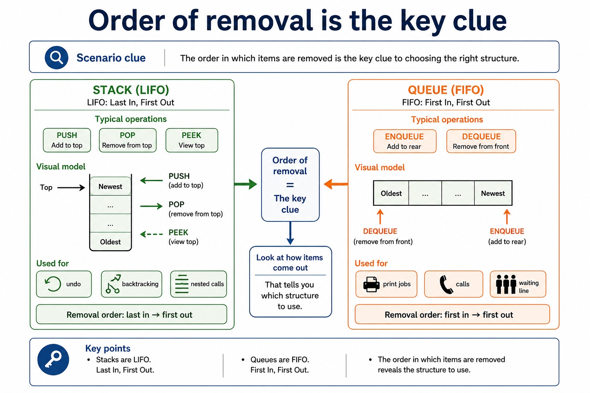
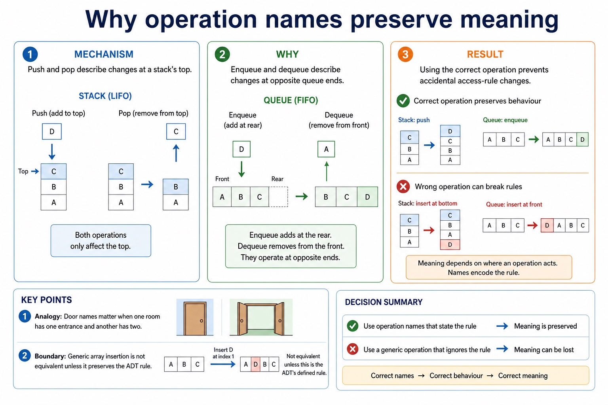

# Lesson 066: Linked-list features and operations

**Course:** Cambridge International AS Level Computer Science 9618, 2027-2029 Version 2 
**Paper:** Paper 2 
**Syllabus:** Section 10: Data types and structures 
**Syllabus requirements:** S10.09, S10.10 
**Pacing:** Flexible. Select the material set and practice depth needed by the learner.

## Teaching-depth menu

- **Quick route:** Use the diagnostic, learning objectives, first worked example and foundation question. Stop once the learner can explain the central distinction accurately.
- **Full route:** Use every knowledge-point material set, the worked method, the terminology check and all questions.
- **Deep route:** Add the prerequisite refresher, ask learners to connect the concept checklist, discuss the labelled extension and complete a transfer question without a model answer.

## 1. Prerequisite knowledge and quick diagnostic

Recall S10.08, S10.03, S10.09 before starting this lesson.

Ask the learner to give one accurate definition or method step before continuing. If they cannot, briefly revisit the named prerequisite rather than repeating the whole previous lesson.

### Optional prerequisite refresher

- An abstract data type (ADT) is a collection of data and a set of operations on those data. Its behaviour is defined independently of a particular storage implementation.
- Understand the definition and purpose of an abstract data type.
- Use the technical terms associated with arrays, including index, lower bound and upper bound. Bounds define the inclusive valid index range and an index selects one element.
- Understand array, index, lower bound and upper bound terminology.
- Stack, queue and linked list are examples of ADTs. Describe their key features and justify which structure suits a given situation using LIFO, FIFO or link-based traversal/insertion/deletion evidence.
- Understand stack, queue and linked-list features; justify a structure.

## 2. Knowledge explanation

### 1. Stack · Queue · Linked list · LIFO (S10.09)

**Concept map:** stack → queue → linked list → LIFO → FIFO → justify

**Three-part explanation:**

1. Describe their key features and justify which structure suits a given situation using LIFO, FIFO or link-based traversal/insertion/deletion evidence
2. a linked list supports traversal and insertion/deletion through links
3. Choose and justify a stack, queue or linked list from its LIFO, FIFO or linkage features

**Concrete cue:** Stack, queue and linked list are examples of ADTs. Describe their key features and justify which structure suits a given situation using LIFO, FIFO or link-based traversal/insertion/deletion evidence.

#### Implement stack, queue and linked list using arrays

Text transcript

- An array stack uses Top; a queue uses Front and Rear; a linked list uses Data, Next, Start and a free list.
- Add/delete preserve stack LIFO, queue FIFO and linked-list links; edit changes stored data without corrupting structure.
- Candidates are not required to write pseudocode for these ADT operations; understand add, edit, delete and array implementation.

#### Match scenario evidence to structure features

Text transcript

- Store one book as a record with ISBN, title and pages fields.
- Store ISBN as STRING because it is an identifier, may contain leading zeroes or hyphens, and ISBN-10 may end in X.
- Store many books with the same fields as an array of records.
- Use a file when data must remain available for a later program run.
- Choose a queue when requests must be served in arrival order.

#### An ADT is data together with permitted operations

Text transcript

- An abstract data type is a collection of data and a set of operations on those data.
- Stack, queue and linked list are examples whose permitted operations define their behaviour.
- The implementation may use arrays and indexes without changing the ADT's observable rules.

#### Order of removal is the key clue

Text transcript

- Stack and queue review
- Typical operations
- Scenario clue
- LIFO: Last In, First Out
- PUSH, POP, PEEK
- undo, backtracking, nested calls
- FIFO: First In, First Out
- ENQUEUE, DEQUEUE

Precise syllabus wording

Understand stack, queue and linked-list features; justify a structure.

Stack, queue and linked list are examples of ADTs. Describe their key features and justify which structure suits a given situation using LIFO, FIFO or link-based traversal/insertion/deletion evidence.

### 2. Adding, editing and deleting ADT items (S10.10)

**Concept map:** Add → edit → delete → stack → queue → linked list → array → not required → pseudocode

**Three-part explanation:**

1. Candidates are not required to write pseudocode for these ADT operations, but must be able to add, edit and delete data and describe array implementations
2. Candidates must be able to add, edit and delete data conceptually, but the syllabus does not require pseudocode for these ADT operations
3. Add, edit and delete data in these ADTs and implement them using arrays

**Concrete cue:** Use stack, queue and linked list to store data; add, edit and delete data while preserving each ADT rule. Describe array implementations for all three. Candidates are not required to…

#### Implement stack, queue and linked list using arrays

Text transcript

- An array stack uses Top; a queue uses Front and Rear; a linked list uses Data, Next, Start and a free list.
- Add/delete preserve stack LIFO, queue FIFO and linked-list links; edit changes stored data without corrupting structure.
- Candidates are not required to write pseudocode for these ADT operations; understand add, edit, delete and array implementation.

#### An ADT is data together with permitted operations

Text transcript

- An abstract data type is a collection of data and a set of operations on those data.
- Stack, queue and linked list are examples whose permitted operations define their behaviour.
- The implementation may use arrays and indexes without changing the ADT's observable rules.

#### Question-supplied functions versus Java methods

Text transcript

- SPLIT and STRINGTOINTEGER are not standard functions in the Cambridge pseudocode guide; this example uses signatures supplied by the question.
- FUNCTION SPLIT(Line : STRING, Delimiter : CHAR) RETURNS ARRAY OF STRING; its first returned element is at index 1.
- FUNCTION STRINGTOINTEGER(Value : STRING) RETURNS INTEGER.
- Java split and parseInt are support examples only and use different syntax and zero-based array indexes.

#### The eight Cambridge pseudocode type names

Text transcript

- Cambridge pseudocode uses INTEGER, REAL, CHAR, STRING, BOOLEAN and DATE for scalar values.
- The Version 2 Notes also name ARRAY and FILE among the pseudocode data types.
- Select a type from the value's meaning and required operations; numeric-looking identifiers may still require STRING.

#### Why operation names preserve meaning

Text transcript

- Push and pop describe changes at a stack's top.
- Enqueue and dequeue describe changes at opposite queue ends.
- Using the correct operation prevents accidental access-rule changes.

Precise syllabus wording

Add, edit and delete data in the ADTs and implement them using arrays; pseudocode for operations is not required by the syllabus.

Use stack, queue and linked list to store data; add, edit and delete data while preserving each ADT rule. Describe array implementations for all three. Candidates are not required to write pseudocode for these ADT operations.

### Supporting diagram library

#### A text file stores characters, usually processed one line at a time

Text transcript

- Exam clue
- Text file
- file containing character data
- "Scores.txt"
- get data from an existing file
- FOR READ
- store data to a file, often replacing previous contents
- FOR WRITE

#### Open, process, close

Text transcript

- File lifecycle
- 1. Open choose READ, WRITE or APPEND
- 2. Process READFILE or WRITEFILE using variables
- 3. Close release the file and finalise changes
- A file algorithm without CLOSEFILE is like leaving the exam hall without submitting the answer booklet.

#### Choose the correct file mode

Text transcript

- Interactive mode lab
- Scenario
- Choose a scenario and a mode.

#### Choose the mode before touching the file

Text transcript

- File modes
- Use when
- Risk if wrong
- existing file contents are needed
- cannot write new lines
- creating/replacing output contents
- old contents may be overwritten
- adding new data to the end

#### Why two ends create FIFO

Text transcript

- Enqueue adds a new item at the rear.
- Dequeue removes the waiting item at the front.
- Earlier arrivals remain ahead of later arrivals.

#### Use EOF so the loop stops at the end of the file

Text transcript

- Read loop
- OPENFILE "Scores.txt" FOR READ
- WHILE NOT EOF("Scores.txt")
- READFILE "Scores.txt", Line
- OUTPUT Line
- ENDWHILE
- CLOSEFILE "Scores.txt"
- The file line is read into Line . Only after that can the program output, split or validate it.

#### Step through a WHILE NOT EOF loop

Text transcript

- Open the file for reading before entering the loop.
- Check NOT EOF before attempting READFILE.
- When more data exists, read and process the next line.
- When EOF is true, skip READFILE, leave the loop and close the file.

#### A text line often represents one record

Text transcript

- Text records
- In simple exam-style examples, one line may contain fields separated by a comma. The delimiter must be consistent.
- Name = Ali
- Mark = 72
- Name = Bea
- Mark = 64

#### Why one open end creates LIFO

Text transcript

- Push adds the new item at the top position.
- Only the current top item is available to pop.
- The most recently pushed item therefore leaves first.

#### Write creates a new result; append adds to the existing story

Text transcript

- Write and append
- Write a new report
- OPENFILE "Report.txt" FOR WRITE
- WRITEFILE "Report.txt", "Pass count: " & Count
- CLOSEFILE "Report.txt"
- Append a new score
- OPENFILE "Scores.txt" FOR APPEND
- WRITEFILE "Scores.txt", "Dina,91"

#### CSV-style means separated fields in a fixed order

Text transcript

- one complete line of data
- S001,Ali,72
- one item inside the record
- Delimiter
- character that separates fields
- Fixed order
- each position has agreed meaning
- ID, Name, Mark

#### Design the format before writing code

Text transcript

- CSV format
- Position
- Field name
- Data type after conversion
- StudentID
- The file stores all fields as text. The program gives each position meaning.

#### Use question-supplied CSV functions exactly

Text transcript

- The question supplies FUNCTION SPLIT(Line : STRING, Delimiter : CHAR) RETURNS ARRAY OF STRING.
- The supplied SPLIT result uses indexes starting at 1; for three fields, use Fields[1], Fields[2] and Fields[3].
- The question also supplies FUNCTION STRINGTOINTEGER(Value : STRING) RETURNS INTEGER.
- Read the line first, then call the supplied functions using their stated parameter order and return types.

#### Split a line into fields

Text transcript

- Interactive CSV parser
- CSV line
- Delimiter
- Enter a line and split it into fields.

#### Convert CSV text before numeric comparison

Text transcript

- CSV fields arrive as text; the question supplies FUNCTION STRINGTOINTEGER(Value : STRING) RETURNS INTEGER.
- Use the returned INTEGER for a numeric comparison and close every IF example with ENDIF.
- Do not present STRINGTOINTEGER as a standard Cambridge pseudocode-guide function.
- Structural closure and type conversion solve different problems.

#### A structured file can still contain bad lines

Text transcript

- Validation
- Correction prompt
- S003,Chen
- missing Mark field
- check field count before using Fields[3]
- S004,Dina,Ninety
- mark is not numeric
- validate before converting to INTEGER

#### Check field count and mark type

Text transcript

- Interactive validator
- Choose a sample line to validate.

Open precise terminology and exam facts

- Stack, queue and linked list are examples of ADTs. Describe their key features and justify which structure suits a given situation using LIFO, FIFO or link-based traversal/insertion/deletion evidence.
- Use stack, queue and linked list to store data; add, edit and delete data while preserving each ADT rule. Describe array implementations for all three. Candidates are not required to write pseudocode for these ADT operations.
- An abstract data type (ADT) is a collection of data and a set of operations on those data. The permitted operations and their effects define the ADT; its internal storage can change without changing that behaviour. Stack, queue and linked list are examples of ADTs.
- A stack is LIFO: add with push and delete with pop at the top. A queue is FIFO: add with enqueue at the rear and delete with dequeue at the front. A linked list stores data plus a next pointer/index in each node; start identifies the first node and null ends the chain.
- All three can be implemented using arrays and state variables or indexes. Stack uses an array with a top/stack pointer; queue uses an array with front and rear; linked list uses Data and Next arrays (or an array of node records), start and a free list. Candidates must be able to add, edit and delete data conceptually, but the syllabus does not require pseudocode for these ADT operations.
- Editing changes the stored data without breaking the access rule or links. Deleting from a linked list reconnects the predecessor to the removed node's successor and returns the freed array slot to the free list; physical array positions need not follow logical list order.
- Justify a stack, queue or linked list from its operations and the scenario. Candidates are not required to write pseudocode for these ADT operations, but must be able to add, edit and delete data and describe array implementations.
- Choose and justify a stack, queue or linked list from its LIFO, FIFO or linkage features. Add, edit and delete data in these ADTs and implement them using arrays; pseudocode for the ADT operations is not required by the syllabus.
- A stack is LIFO with push/pop at the top; a queue is FIFO with enqueue at the rear and dequeue at the front; a linked list supports traversal and insertion/deletion through links.
- Justification must name the required access order or update behaviour. Array implementations have fixed capacity unless resized and require overflow/underflow checks; linked structures require pointer management.

### Worked example

1. Add, edit and delete without changing the ADT rule
2. Push D adds D at the stack top and pop deletes the current top.
3. Enqueue D adds at the queue rear and dequeue deletes from the front.
4. In an array-based linked list, edit Data[5] to change only the node value; insert or delete by changing Next indexes, Start and the free list rather than shifting every later array item.

Beyond syllabus / 延伸知识（不要求背诵）: programming libraries often provide tested ADT implementations, but the exam expects you to understand their behaviour and selection.
## 3. Practice by question type

### Question 1 - foundation - state - 2 marks

Which state is needed for an array-based linked list?

**Answer:** Data and Next storage, a Start index and normally a free-list index.

**Marking guidance:** Award one mark for each distinct, technically accurate point or method step.

**Common error:** For the command word state, perform that exact action; do not replace it with an unrelated fact.

### Question 2 - application - state - 2 marks

State two precise facts about linked-list features and operations.

**Answer:** Stack, queue and linked list are examples of ADTs. Describe their key features and justify which structure suits a given situation using LIFO, FIFO or link-based traversal/insertion/deletion evidence. Use stack, queue and linked list to store data; add, edit and delete data while preserving each ADT rule. Describe array implementations for all three. Candidates are not required to write pseudocode for these ADT operations.

**Marking guidance:** Award one mark for each distinct fact; do not credit a repeated point.

**Common error:** Do not repeat the same point in different words; each mark needs a separate idea or method step.

### Question 3 - transfer - explain - 3 marks

Explain how linked-list features and operations would be applied in a suitable computing context.

**Answer:** Use stack, queue and linked list to store data; add, edit and delete data while preserving each ADT rule. Describe array implementations for all three. Candidates are not required to write pseudocode for these ADT operations. An abstract data type (ADT) is a collection of data and a set of operations on those data. The permitted operations and their effects define the ADT; its internal storage can change without changing that behaviour. Stack, queue and linked list are examples of ADTs. A stack is LIFO: add with push and delete with pop at the top. A queue is FIFO: add with enqueue at the rear and delete with dequeue at the front. A linked list stores data plus a next pointer/index in each node; start identifies the first node and null ends the chain.

**Marking guidance:** Each mark needs a relevant point linked to the stated context.

**Common error:** Do not copy the worked example unchanged; transfer the method and check it against the new context.

### Related past-paper indexes

| Reference | Marks | Command word | Question type |
|---|---:|---|---|
| 9618/23/S/25 Q5(b) | 8 | describe | write |
| 9618/21/S/25 Q5 | 7 | describe | explain |
| 9618/23/S/25 Q5(c) | 7 | calculate | calculate |
| 9618/23/S/25 Q5(a) | 5 | describe | explain |

These are indexes only. Cambridge question and mark-scheme wording is not reproduced.

## 4. Summary and exam reminders

### Summary

- Define linked-list features and operations with the exact technical vocabulary expected by the syllabus.
- Use the lesson method on a fresh context and show the intermediate decision, representation or calculation.
- Match the shape of the answer to the command word and the available marks.
- Check the final answer against the scenario instead of repeating a memorised sentence.

### Common error to correct

Students often treat files like arrays already in memory. Correction: file data must be read into variables before processing.

### Exam technique

- Follow the command word: state gives a fact; explain links a cause to a consequence; compare covers both sides.
- Match the number of independent points or method steps to the available marks.
- For linked-list features and operations, use the exact technical term before applying it to the scenario.
