# Lesson 068: Choosing and combining data structures

**Course:** Cambridge International AS Level Computer Science 9618, 2027-2029 Version 2 
**Paper:** Paper 2 
**Syllabus:** Section 10: Data types and structures 
**Syllabus requirements:** S10.04, S10.09 
**Pacing:** Flexible. Select the material set and practice depth needed by the learner.

## Teaching-depth menu

- **Quick route:** Use the diagnostic, learning objectives, first worked example and foundation question. Stop once the learner can explain the central distinction accurately.
- **Full route:** Use every knowledge-point material set, the worked method, the terminology check and all questions.
- **Deep route:** Add the prerequisite refresher, ask learners to connect the concept checklist, discuss the labelled extension and complete a transfer question without a model answer.

## 1. Prerequisite knowledge and quick diagnostic

Recall S10.03, S10.08 before starting this lesson.

Ask the learner to give one accurate definition or method step before continuing. If they cannot, briefly revisit the named prerequisite rather than repeating the whole previous lesson.

### Optional prerequisite refresher

- Use the technical terms associated with arrays, including index, lower bound and upper bound. Bounds define the inclusive valid index range and an index selects one element.
- Understand array, index, lower bound and upper bound terminology.
- An abstract data type (ADT) is a collection of data and a set of operations on those data. Its behaviour is defined independently of a particular storage implementation.
- Understand the definition and purpose of an abstract data type.

## 2. Knowledge explanation

### 1. One-dimensional · Two-dimensional · Select (S10.04)

**Concept map:** one-dimensional → two-dimensional → select

**Three-part explanation:**

1. two indexes suit data with a genuine row-column or equivalent two-coordinate relationship
2. Select a suitable one-dimensional (1D) or two-dimensional (2D) array for a given task
3. A two-dimensional array uses two indexes, normally interpreted as row and column

**Concrete cue:** Select a suitable one-dimensional (1D) or two-dimensional (2D) array for a given task. One index suits a linear collection; two indexes suit data with a genuine row-column or equivalent two-coordinate…

#### A one-dimensional array is a linear collection

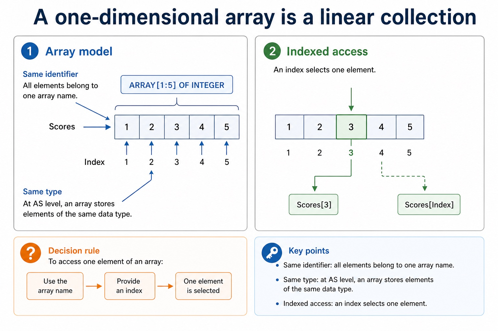

Text transcript

- Array model
- Same identifier
- All elements belong to one array name.
- Same type
- At AS level, an array stores elements of the same data type.
- ARRAY[1:5] OF INTEGER
- Indexed access
- An index selects one element.

#### Rows and columns create coordinates

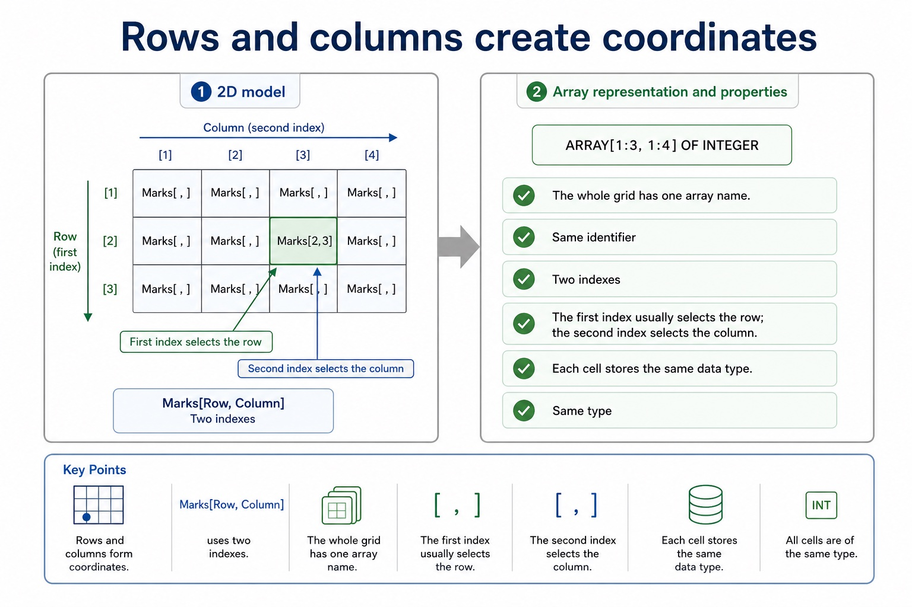

Text transcript

- 2D model
- Same identifier
- The whole grid has one array name.
- Two indexes
- The first index usually selects the row; the second index selects the column.
- Marks[Row, Column]
- Same type
- Each cell stores the same data type.

#### Linear search checks each item in order

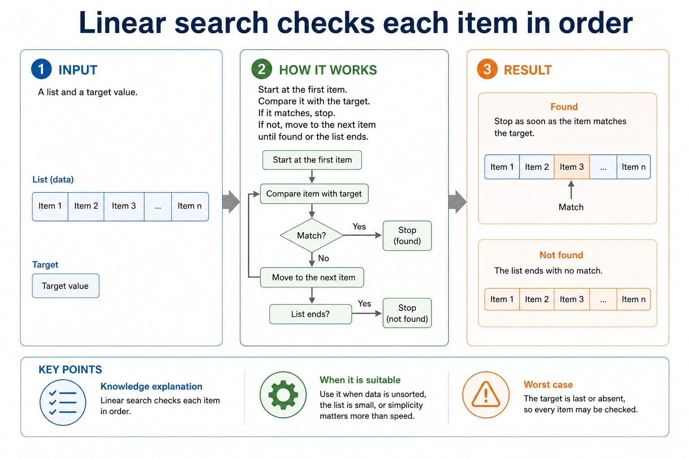

Text transcript

- Knowledge explanation
- How it works
- Start at the first item. Compare it with the target. If it matches, stop. If not, move to the next item until found or the list ends.
- When it is suitable
- Use it when data is unsorted, the list is small, or simplicity matters more than speed.
- Worst case: the target is last or absent, so every item may be checked.

Precise syllabus wording

Select one- or two-dimensional arrays for a scenario.

Select a suitable one-dimensional (1D) or two-dimensional (2D) array for a given task. One index suits a linear collection; two indexes suit data with a genuine row-column or equivalent two-coordinate relationship.

### 2. Stack · Queue · Linked list · LIFO (S10.09)

**Concept map:** stack → queue → linked list → LIFO → FIFO → justify

**Three-part explanation:**

1. Describe their key features and justify which structure suits a given situation using LIFO, FIFO or link-based traversal/insertion/deletion evidence
2. Stack, queue and linked list are examples of ADTs
3. A changing ordered playlist can use a linked list for link-based insertion/deletion

**Concrete cue:** Stack, queue and linked list are examples of ADTs. Describe their key features and justify which structure suits a given situation using LIFO, FIFO or link-based traversal/insertion/deletion evidence.

#### Implement stack, queue and linked list using arrays

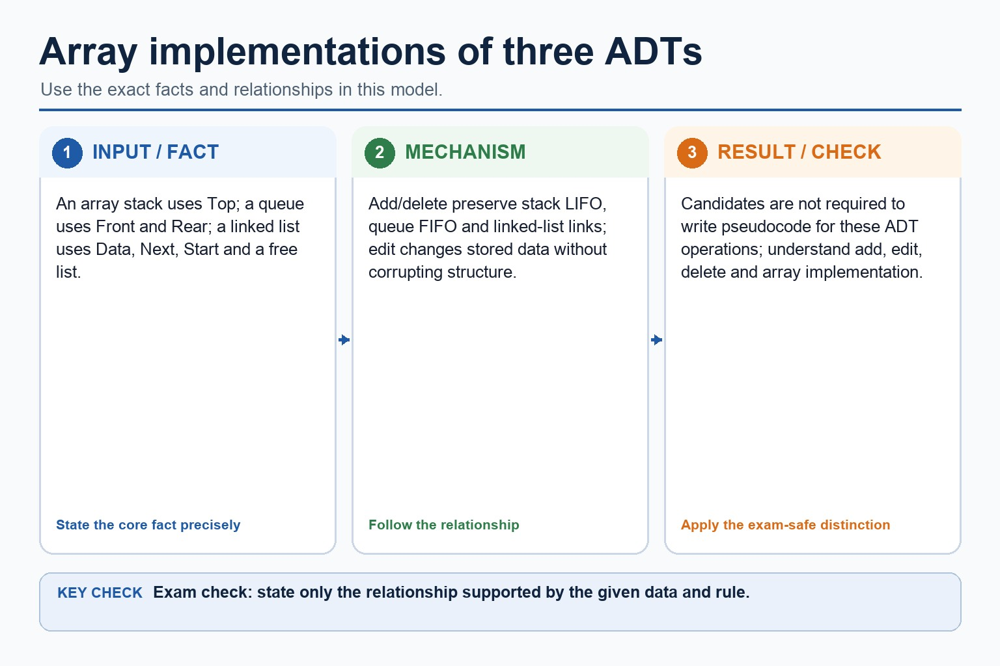

Text transcript

- An array stack uses Top; a queue uses Front and Rear; a linked list uses Data, Next, Start and a free list.
- Add/delete preserve stack LIFO, queue FIFO and linked-list links; edit changes stored data without corrupting structure.
- Candidates are not required to write pseudocode for these ADT operations; understand add, edit, delete and array implementation.

#### Match scenario evidence to structure features

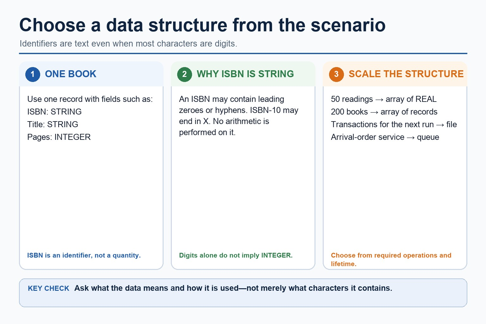

Text transcript

- Store one book as a record with ISBN, title and pages fields.
- Store ISBN as STRING because it is an identifier, may contain leading zeroes or hyphens, and ISBN-10 may end in X.
- Store many books with the same fields as an array of records.
- Use a file when data must remain available for a later program run.
- Choose a queue when requests must be served in arrival order.

#### An ADT is data together with permitted operations

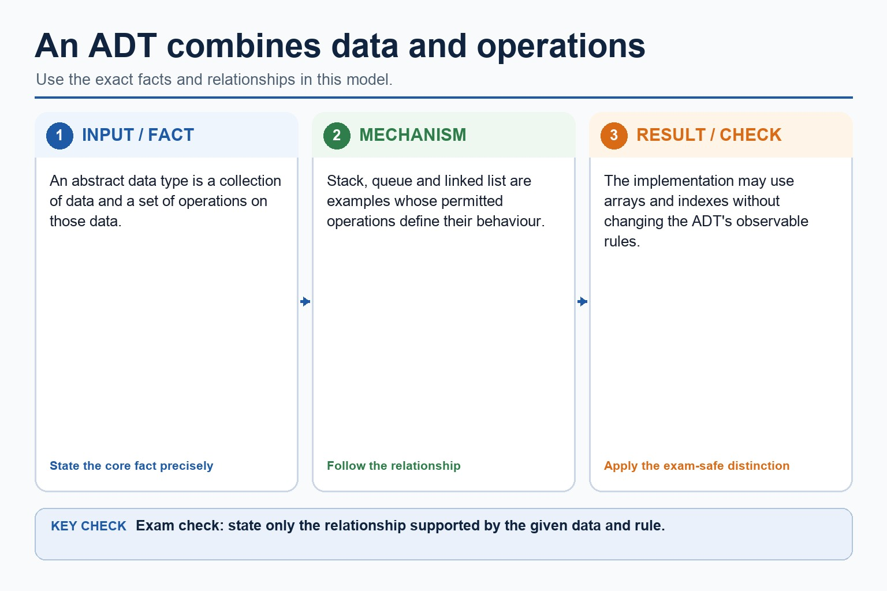

Text transcript

- An abstract data type is a collection of data and a set of operations on those data.
- Stack, queue and linked list are examples whose permitted operations define their behaviour.
- The implementation may use arrays and indexes without changing the ADT's observable rules.

#### Justify the data structure in Cambridge answers

Text transcript

- TYPE TBook
- DECLARE Books : ARRAY[1:200] OF TBook
- A record definition must be complete before an array uses that type.

Precise syllabus wording

Understand stack, queue and linked-list features; justify a structure.

Stack, queue and linked list are examples of ADTs. Describe their key features and justify which structure suits a given situation using LIFO, FIFO or link-based traversal/insertion/deletion evidence.

### Supporting diagram library

#### The index points to exactly one element

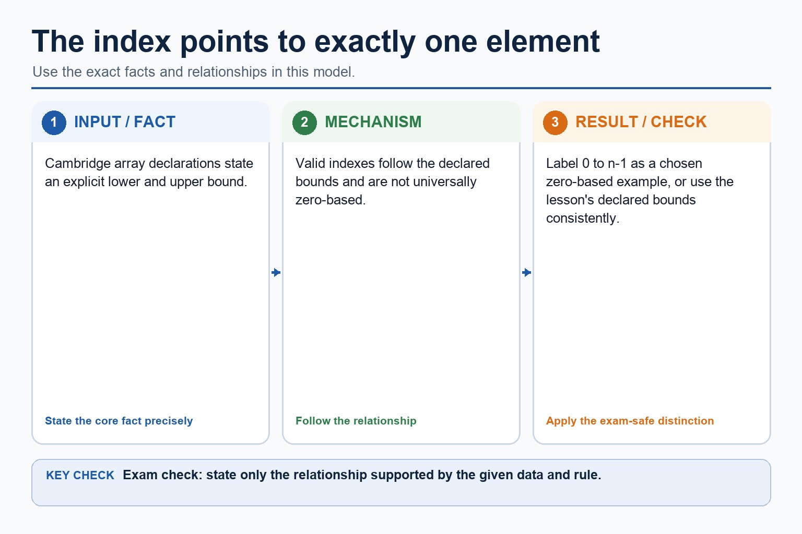

Text transcript

- Cambridge array declarations state an explicit lower and upper bound.
- Valid indexes follow the declared bounds and are not universally zero-based.
- Label 0 to n-1 as a chosen zero-based example, or use the lesson's declared bounds consistently.

#### Bounds say which indexes are valid

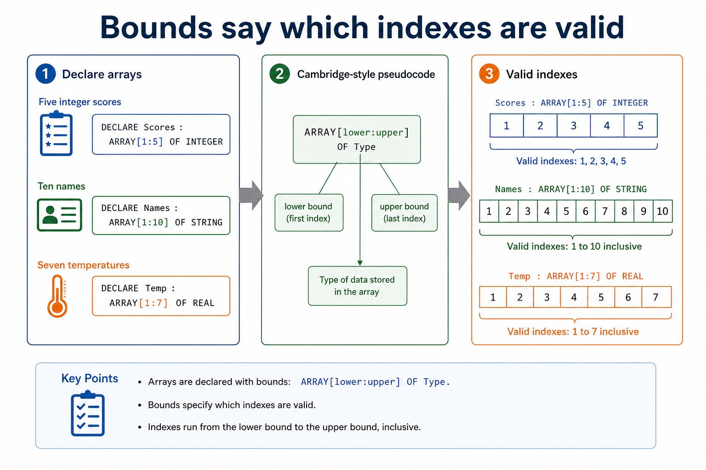

Text transcript

- Declare arrays
- Cambridge-style pseudocode
- Valid indexes
- Five integer scores
- DECLARE Scores : ARRAY[1:5] OF INTEGER
- 1, 2, 3, 4, 5
- Ten names
- DECLARE Names : ARRAY[1:10] OF STRING

#### Access one element

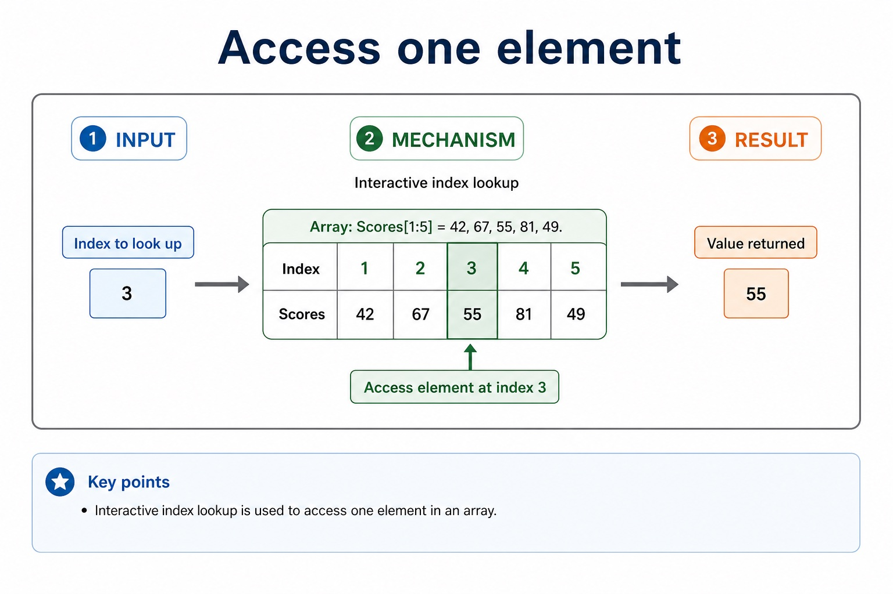

Text transcript

- Interactive index lookup
- Array: Scores[1:5] = 42, 67, 55, 81, 49.

#### Cambridge bounds and Java indexes are not the same habit

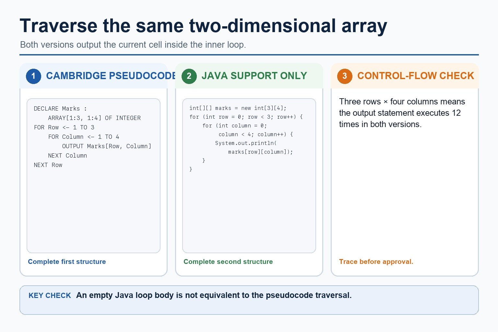

Text transcript

- Pseudocode vs Java
- Cambridge-style pseudocode
- DECLARE Scores : ARRAY[1:5] OF INTEGER
- FOR Index <- 1 TO 5
- INPUT Scores[Index]
- NEXT Index
- Java support only
- int[] scores = new int[5];

#### Do not import Java indexing into Cambridge answers

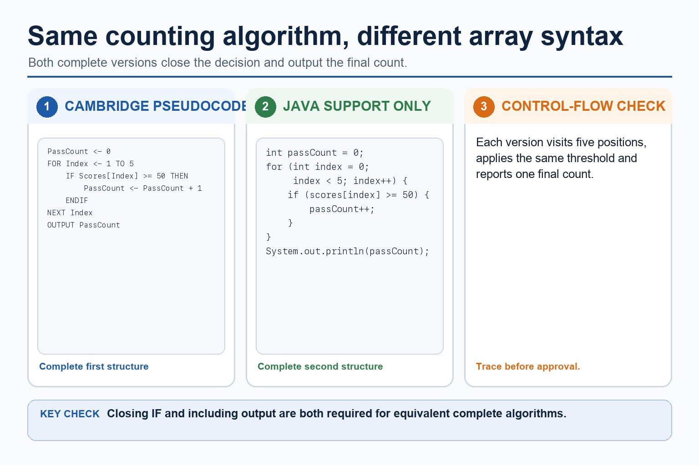

Text transcript

- Traverse a 3 by 4 array with nested loops.
- Output the current cell inside the inner loop.
- A corresponding Java support version must also output every current cell.
- The two versions use explicitly stated indexing conventions.

#### Use a loop to visit every element

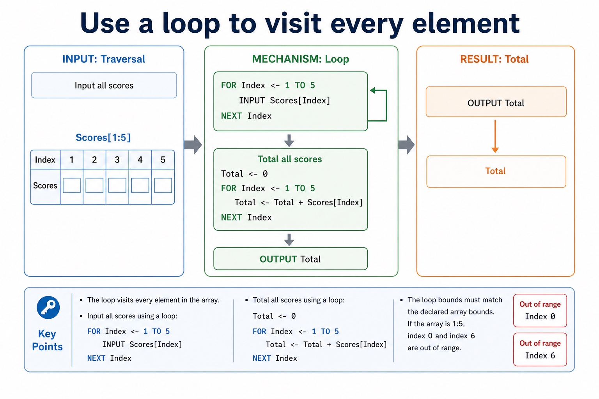

Text transcript

- Traversal
- Input all scores
- FOR Index <- 1 TO 5
- INPUT Scores[Index]
- NEXT Index
- Total all scores
- Total <- 0
- Total <- Total + Scores[Index]

#### A cell needs row and column

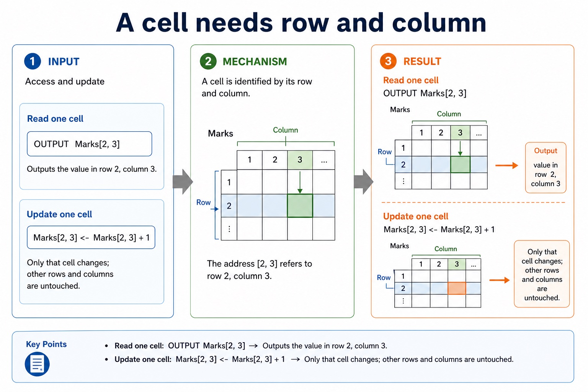

Text transcript

- Access and update
- Read one cell
- OUTPUT Marks[2, 3]
- Outputs the value in row 2, column 3.
- Update one cell
- Marks[2, 3] <- Marks[2, 3] + 1
- Only that cell changes; other rows and columns are untouched.

#### Two dimensions need two ranges

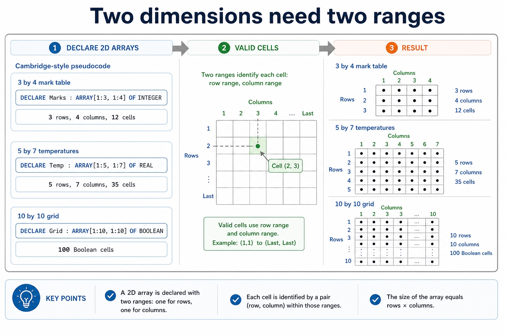

Text transcript

- Declare 2D arrays
- Cambridge-style pseudocode
- Valid cells
- 3 by 4 mark table
- DECLARE Marks : ARRAY[1:3, 1:4] OF INTEGER
- 3 rows, 4 columns, 12 cells
- 5 by 7 temperatures
- DECLARE Temp : ARRAY[1:5, 1:7] OF REAL

#### Read Marks[Row, Column]

![Read Marks[Row, Column]](../web/assets/diagrams/stage10-infographics/stage10-lesson-117-lookup.jpg)

Text transcript

- Interactive cell lookup
- Array: Marks[1:3, 1:4]. Choose a row and column.

#### Outer row loop, inner column loop

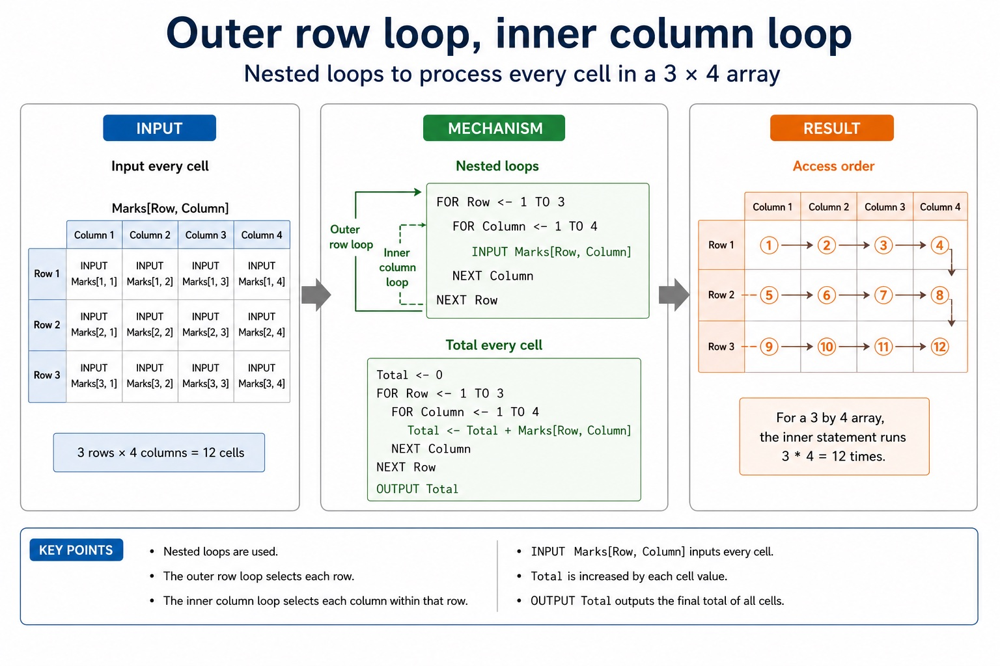

Text transcript

- Nested loops
- Input every cell
- FOR Row <- 1 TO 3
- FOR Column <- 1 TO 4
- INPUT Marks[Row, Column]
- NEXT Column
- NEXT Row
- Total every cell

#### A text file stores characters, usually processed one line at a time

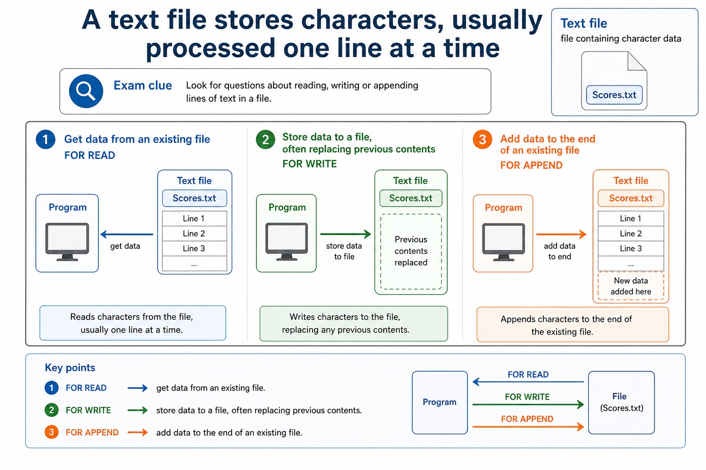

Text transcript

- Exam clue
- Text file
- file containing character data
- "Scores.txt"
- get data from an existing file
- FOR READ
- store data to a file, often replacing previous contents
- FOR WRITE

#### Open, process, close

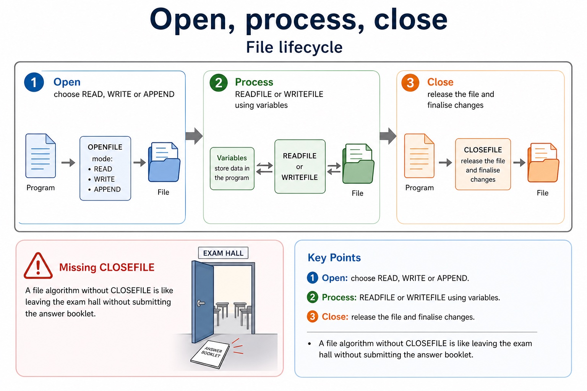

Text transcript

- File lifecycle
- 1. Open choose READ, WRITE or APPEND
- 2. Process READFILE or WRITEFILE using variables
- 3. Close release the file and finalise changes
- A file algorithm without CLOSEFILE is like leaving the exam hall without submitting the answer booklet.

#### Choose the correct file mode

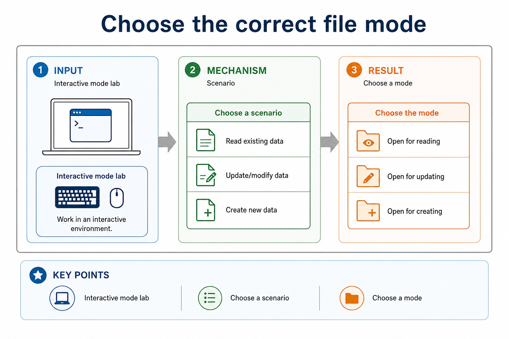

Text transcript

- Interactive mode lab
- Scenario
- Choose a scenario and a mode.

#### Choose the mode before touching the file

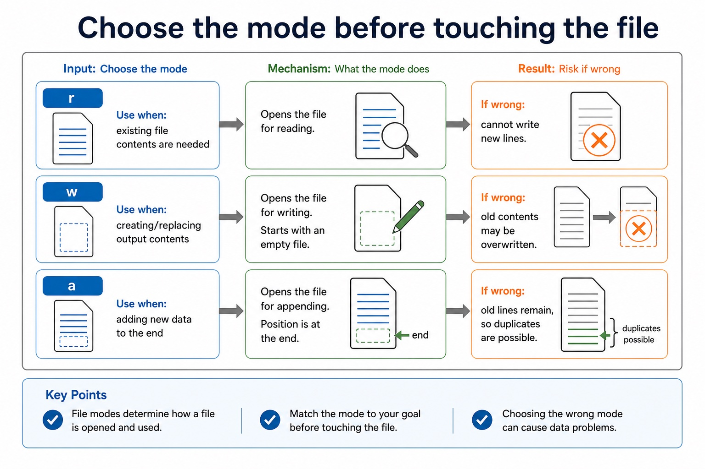

Text transcript

- File modes
- Use when
- Risk if wrong
- existing file contents are needed
- cannot write new lines
- creating/replacing output contents
- old contents may be overwritten
- adding new data to the end

#### Why two ends create FIFO

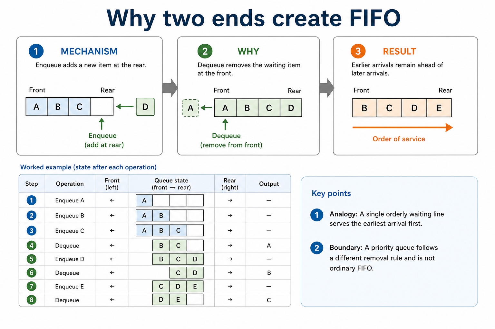

Text transcript

- Enqueue adds a new item at the rear.
- Dequeue removes the waiting item at the front.
- Earlier arrivals remain ahead of later arrivals.

#### Use EOF so the loop stops at the end of the file

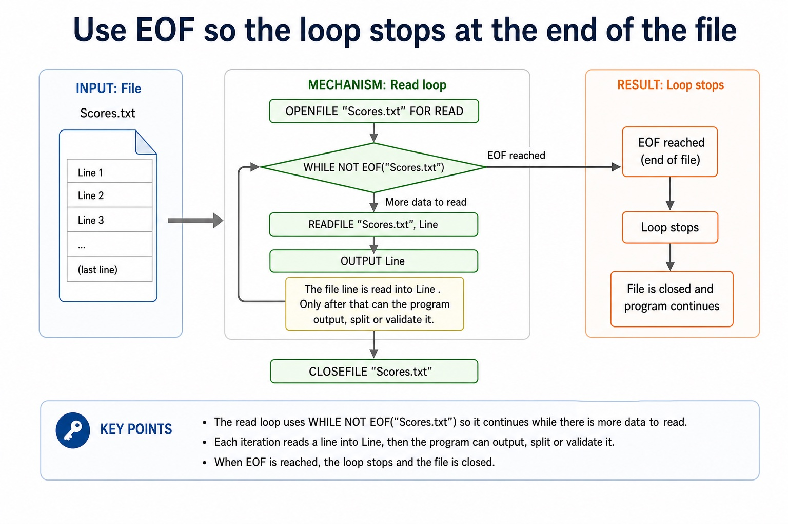

Text transcript

- Read loop
- OPENFILE "Scores.txt" FOR READ
- WHILE NOT EOF("Scores.txt")
- READFILE "Scores.txt", Line
- OUTPUT Line
- ENDWHILE
- CLOSEFILE "Scores.txt"
- The file line is read into Line . Only after that can the program output, split or validate it.

#### Step through a WHILE NOT EOF loop

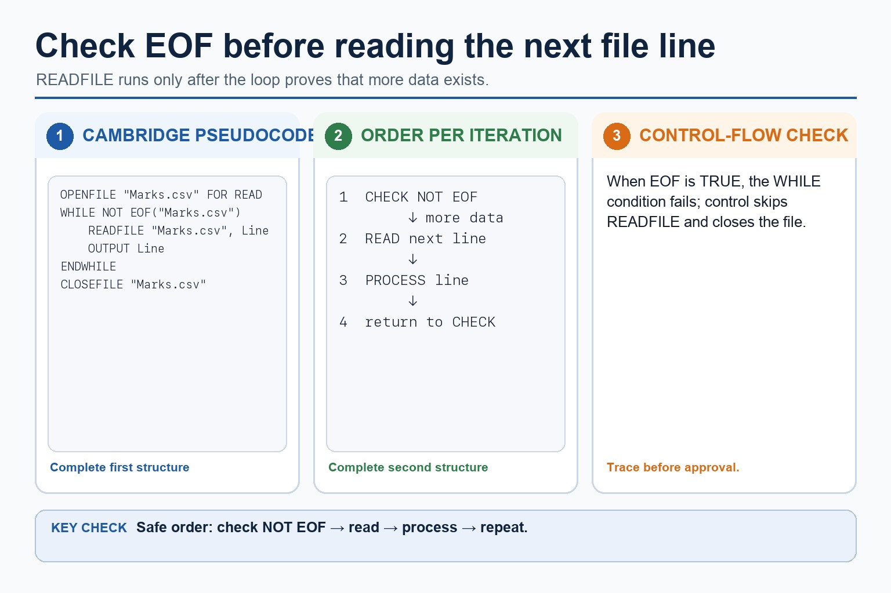

Text transcript

- Open the file for reading before entering the loop.
- Check NOT EOF before attempting READFILE.
- When more data exists, read and process the next line.
- When EOF is true, skip READFILE, leave the loop and close the file.

#### A text line often represents one record

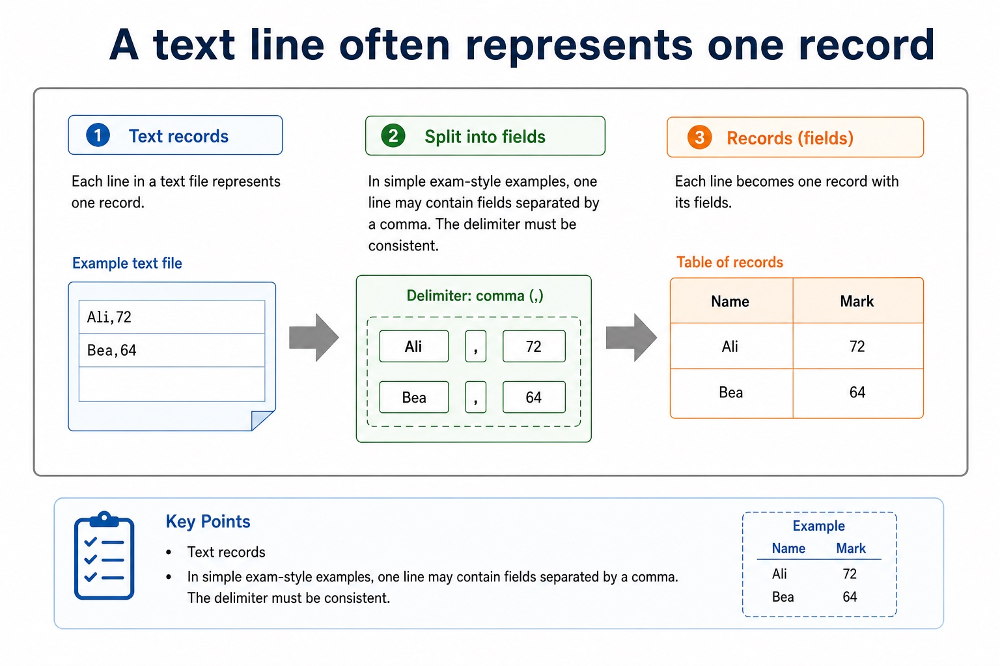

Text transcript

- Text records
- In simple exam-style examples, one line may contain fields separated by a comma. The delimiter must be consistent.
- Name = Ali
- Mark = 72
- Name = Bea
- Mark = 64

#### Why one open end creates LIFO

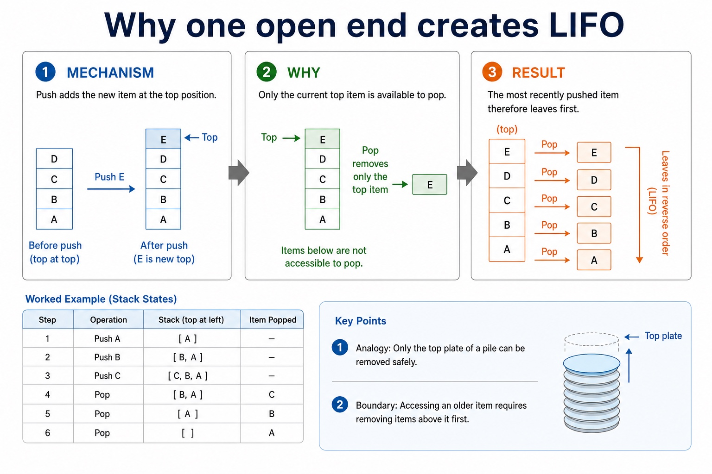

Text transcript

- Push adds the new item at the top position.
- Only the current top item is available to pop.
- The most recently pushed item therefore leaves first.

#### Write creates a new result; append adds to the existing story

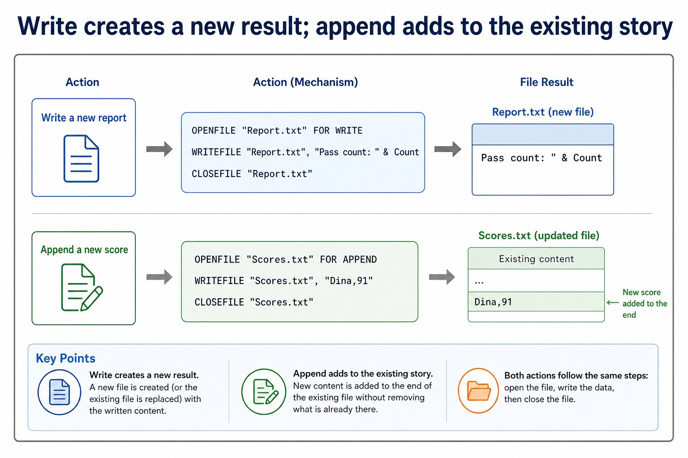

Text transcript

- Write and append
- Write a new report
- OPENFILE "Report.txt" FOR WRITE
- WRITEFILE "Report.txt", "Pass count: " & Count
- CLOSEFILE "Report.txt"
- Append a new score
- OPENFILE "Scores.txt" FOR APPEND
- WRITEFILE "Scores.txt", "Dina,91"

#### CSV-style means separated fields in a fixed order

Text transcript

- one complete line of data
- S001,Ali,72
- one item inside the record
- Delimiter
- character that separates fields
- Fixed order
- each position has agreed meaning
- ID, Name, Mark

#### Design the format before writing code

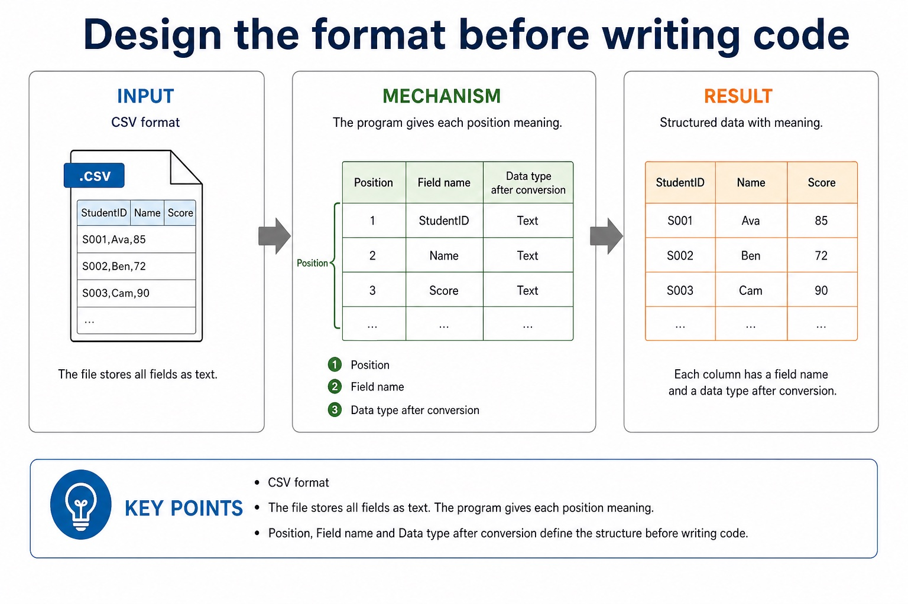

Text transcript

- CSV format
- Position
- Field name
- Data type after conversion
- StudentID
- The file stores all fields as text. The program gives each position meaning.

#### Use question-supplied CSV functions exactly

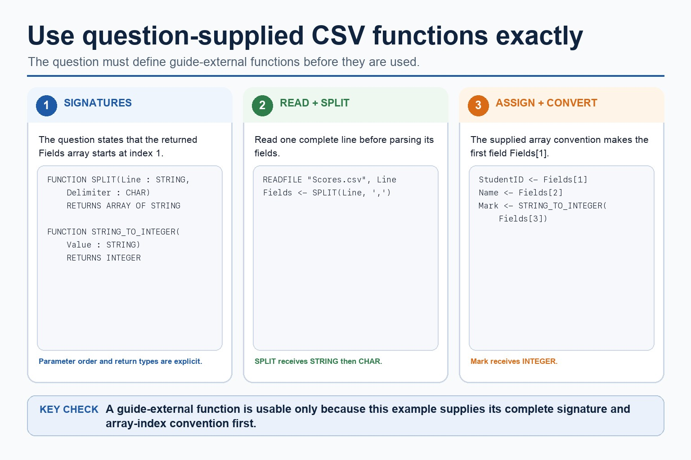

Text transcript

- The question supplies FUNCTION SPLIT(Line : STRING, Delimiter : CHAR) RETURNS ARRAY OF STRING.
- The supplied SPLIT result uses indexes starting at 1; for three fields, use Fields[1], Fields[2] and Fields[3].
- The question also supplies FUNCTION STRINGTOINTEGER(Value : STRING) RETURNS INTEGER.
- Read the line first, then call the supplied functions using their stated parameter order and return types.

#### Split a line into fields

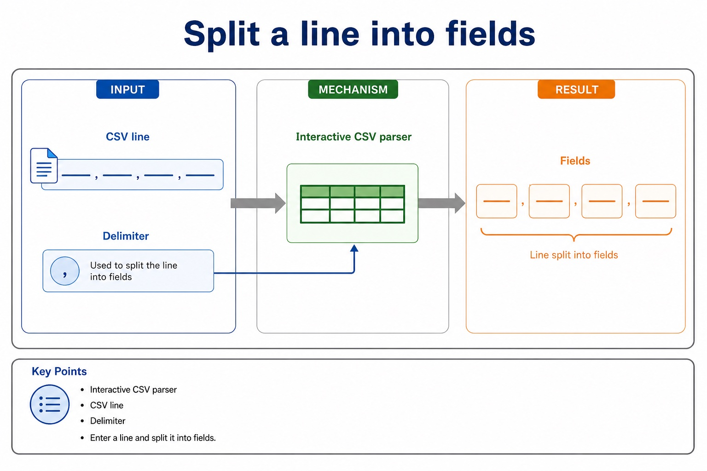

Text transcript

- Interactive CSV parser
- CSV line
- Delimiter
- Enter a line and split it into fields.

#### Question-supplied functions versus Java methods

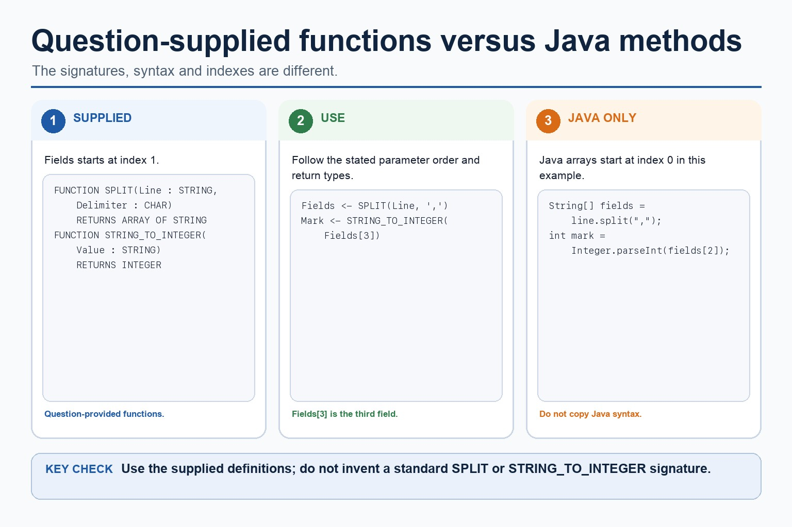

Text transcript

- SPLIT and STRINGTOINTEGER are not standard functions in the Cambridge pseudocode guide; this example uses signatures supplied by the question.
- FUNCTION SPLIT(Line : STRING, Delimiter : CHAR) RETURNS ARRAY OF STRING; its first returned element is at index 1.
- FUNCTION STRINGTOINTEGER(Value : STRING) RETURNS INTEGER.
- Java split and parseInt are support examples only and use different syntax and zero-based array indexes.

#### Convert CSV text before numeric comparison

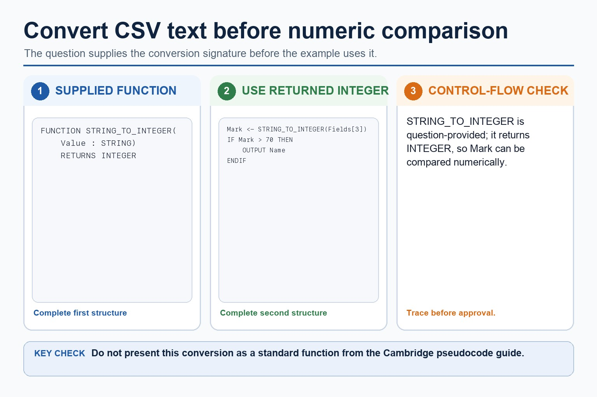

Text transcript

- CSV fields arrive as text; the question supplies FUNCTION STRINGTOINTEGER(Value : STRING) RETURNS INTEGER.
- Use the returned INTEGER for a numeric comparison and close every IF example with ENDIF.
- Do not present STRINGTOINTEGER as a standard Cambridge pseudocode-guide function.
- Structural closure and type conversion solve different problems.

#### A structured file can still contain bad lines

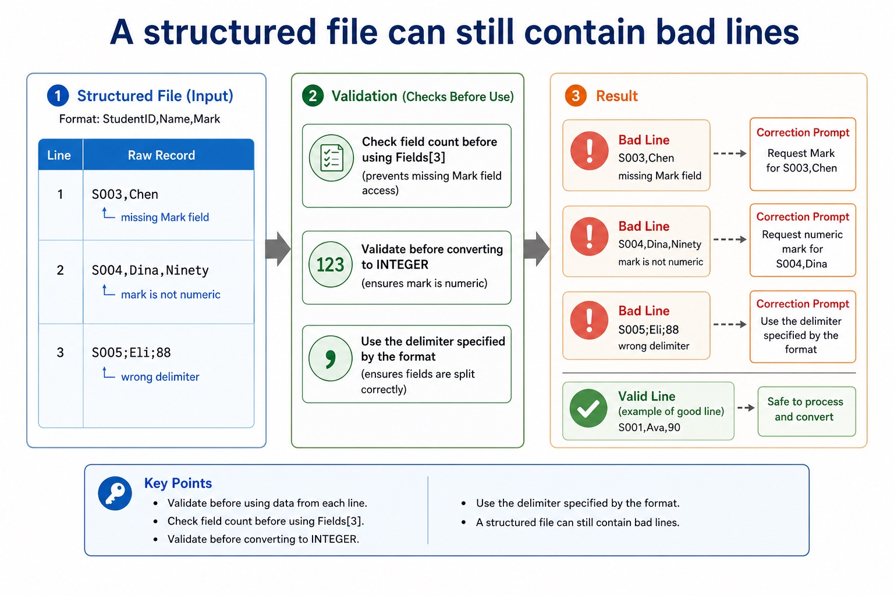

Text transcript

- Validation
- Correction prompt
- S003,Chen
- missing Mark field
- check field count before using Fields[3]
- S004,Dina,Ninety
- mark is not numeric
- validate before converting to INTEGER

#### Check field count and mark type

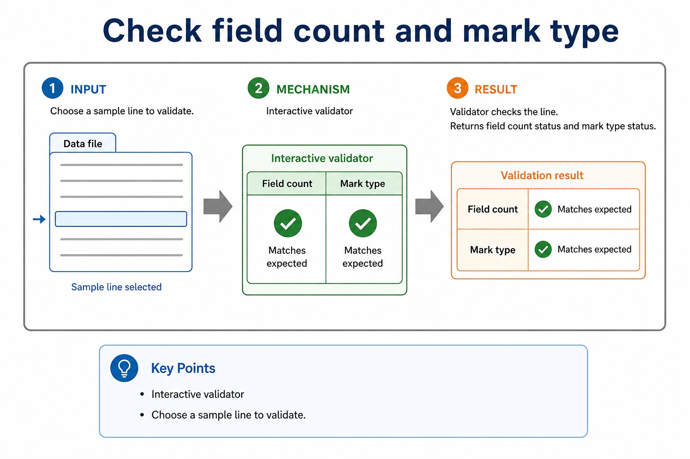

Text transcript

- Interactive validator
- Choose a sample line to validate.

#### Use ADTs when the removal rule matters

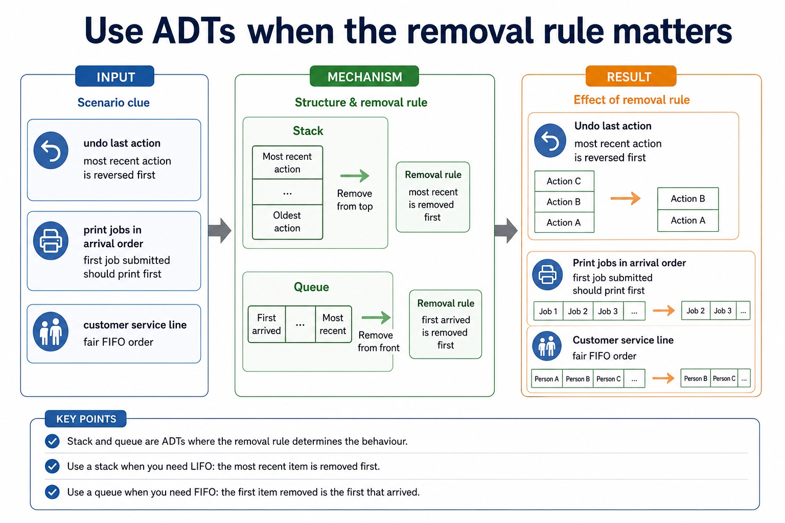

Text transcript

- Stack and queue
- Scenario clue
- Structure
- undo last action
- most recent action is reversed first
- print jobs in arrival order
- first job submitted should print first
- customer service line

#### Use arrays for many similar values accessed by index

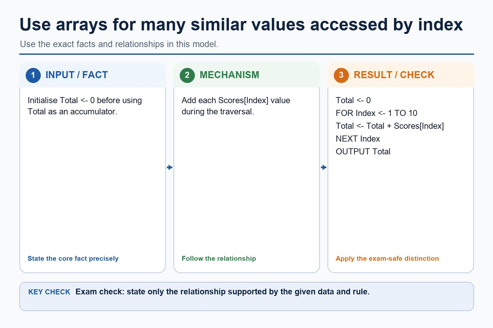

Text transcript

- Initialise Total <- 0 before using Total as an accumulator.
- Add each Scores[Index] value during the traversal.
- Total <- 0

#### Start with the data and operations, not the keyword

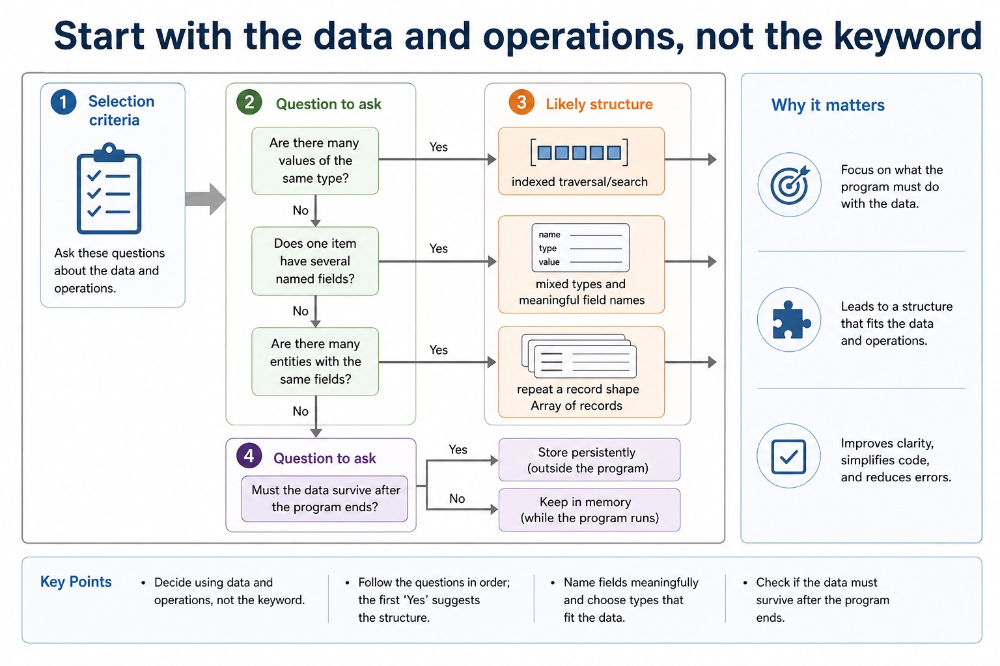

Text transcript

- Selection criteria
- Question to ask
- Why it matters
- Likely structure
- Are there many values of the same type?
- indexed traversal/search
- Does one item have several named fields?
- mixed types and meaningful field names

#### Use files when data must persist or be exchanged

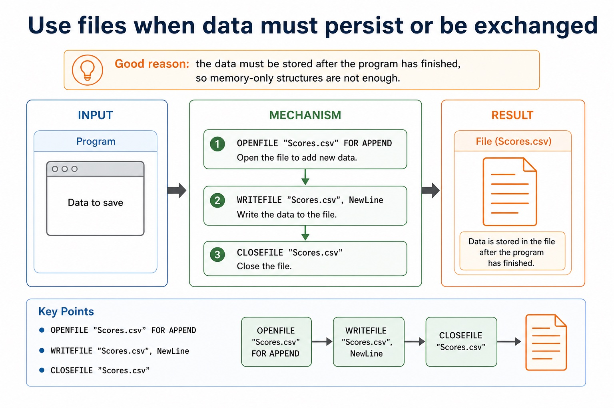

Text transcript

- OPENFILE "Scores.csv" FOR APPEND
- WRITEFILE "Scores.csv", NewLine
- CLOSEFILE "Scores.csv"
- Good reason: the data must be stored after the program has finished, so memory-only structures are not enough.

#### Spot the answer that would earn marks

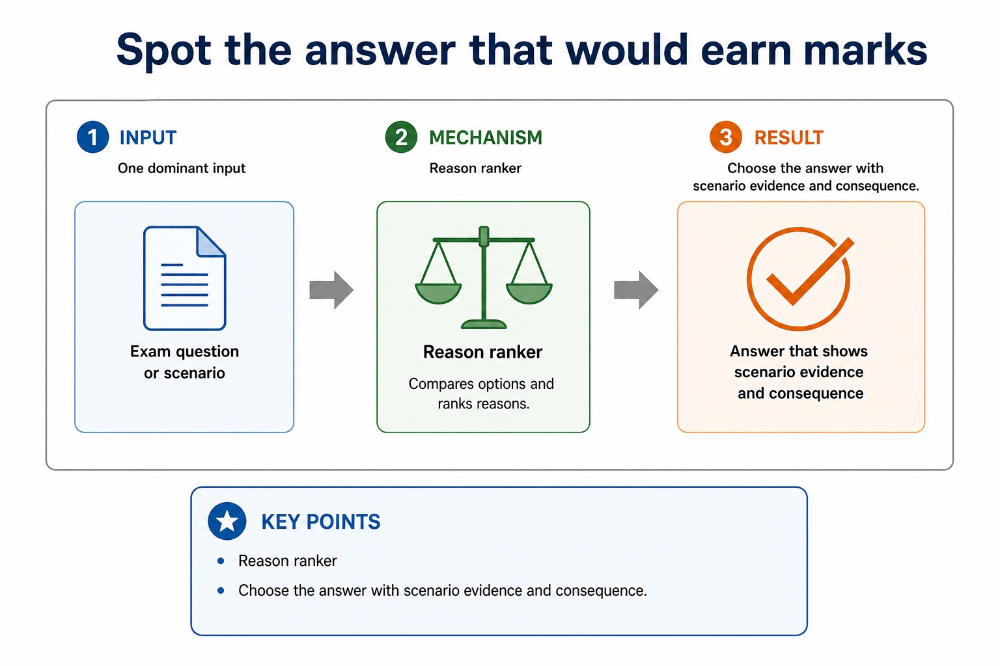

Text transcript

- Reason ranker
- Choose the answer with scenario evidence and consequence.

#### Use records when named fields belong to one entity

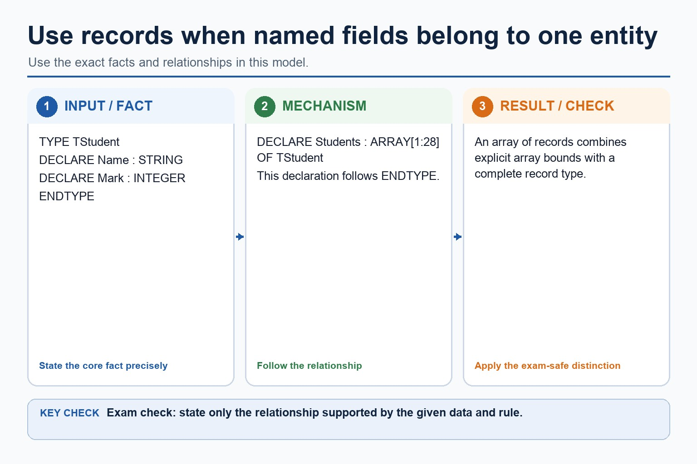

Text transcript

- TYPE TStudent
- DECLARE Students : ARRAY[1:28] OF TStudent
- An array of records combines explicit array bounds with a complete record type.

Open precise terminology and exam facts

- Select a suitable one-dimensional (1D) or two-dimensional (2D) array for a given task. One index suits a linear collection; two indexes suit data with a genuine row-column or equivalent two-coordinate relationship.
- Stack, queue and linked list are examples of ADTs. Describe their key features and justify which structure suits a given situation using LIFO, FIFO or link-based traversal/insertion/deletion evidence.
- An array is a collection of elements stored under one identifier. An index selects one element. The lower bound is the first valid index and the upper bound is the last valid index; both bounds are inclusive in a Cambridge declaration such as ARRAY[1:20] OF INTEGER.
- Choose a one-dimensional array when each element needs one position, such as twenty marks or a list of names. Choose a two-dimensional array when each value naturally needs a row and a column, such as marks for several students across several tests. Do not choose 2D merely because there are many values.
- One-dimensional array pseudocode must declare explicit bounds and an element type, access elements with one index and use loop bounds that match the declared lower and upper bounds. The number of elements is upper bound - lower bound + 1.
- A two-dimensional array uses two indexes, normally interpreted as row and column. In DECLARE Marks : ARRAY[1:30, 1:4] OF INTEGER, the first range gives 30 valid row indexes and the second gives 4 valid column indexes, for 120 cells.
- Select 2D when the scenario has two independent position dimensions, such as Student and Test, Row and Column, or Day and Period. A simple list, sequence or one category of positions remains 1D even when it contains many elements.
- Two-dimensional pseudocode declares both ranges, accesses one cell as Marks[Student, Test] and normally uses nested loops: one loop traverses rows and the inner loop traverses every column for the current row.
- An abstract data type (ADT) is a collection of data and a set of operations on those data. The permitted operations and their effects define the ADT; its internal storage can change without changing that behaviour. Stack, queue and linked list are examples of ADTs.
- A stack is LIFO: add with push and delete with pop at the top. A queue is FIFO: add with enqueue at the rear and delete with dequeue at the front. A linked list stores data plus a next pointer/index in each node; start identifies the first node and null ends the chain.
- All three can be implemented using arrays and state variables or indexes. Stack uses an array with a top/stack pointer; queue uses an array with front and rear; linked list uses Data and Next arrays (or an array of node records), start and a free list. Candidates must be able to add, edit and delete data conceptually, but the syllabus does not require pseudocode for these ADT operations.
- Editing changes the stored data without breaking the access rule or links. Deleting from a linked list reconnects the predecessor to the removed node's successor and returns the freed array slot to the free list; physical array positions need not follow logical list order.

### Worked example

1. Undo history uses a stack because the most recent action is undone first.
2. Print jobs use a queue because the earliest accepted job prints first.
3. A changing ordered playlist can use a linked list for link-based insertion/deletion.

Beyond syllabus / 延伸知识（不要求背诵）: programming libraries often provide tested ADT implementations, but the exam expects you to understand their behaviour and selection.
## 3. Practice by question type

### Question 1 - foundation - apply - 2 marks

What is wrong with Marks[Row] for a 2D array?

**Answer:** It supplies only one index and therefore does not identify a column or one complete cell.

**Marking guidance:** Award one mark for each distinct, technically accurate point or method step.

**Common error:** For the command word apply, perform that exact action; do not replace it with an unrelated fact.

### Question 2 - application - state - 2 marks

State two precise facts about choosing and combining data structures.

**Answer:** Select a suitable one-dimensional (1D) or two-dimensional (2D) array for a given task. One index suits a linear collection; two indexes suit data with a genuine row-column or equivalent two-coordinate relationship. Stack, queue and linked list are examples of ADTs. Describe their key features and justify which structure suits a given situation using LIFO, FIFO or link-based traversal/insertion/deletion evidence.

**Marking guidance:** Award one mark for each distinct fact; do not credit a repeated point.

**Common error:** Do not repeat the same point in different words; each mark needs a separate idea or method step.

### Question 3 - transfer - explain - 3 marks

Explain how choosing and combining data structures would be applied in a suitable computing context.

**Answer:** Stack, queue and linked list are examples of ADTs. Describe their key features and justify which structure suits a given situation using LIFO, FIFO or link-based traversal/insertion/deletion evidence. An array is a collection of elements stored under one identifier. An index selects one element. The lower bound is the first valid index and the upper bound is the last valid index; both bounds are inclusive in a Cambridge declaration such as ARRAY[1:20] OF INTEGER. Choose a one-dimensional array when each element needs one position, such as twenty marks or a list of names. Choose a two-dimensional array when each value naturally needs a row and a column, such as marks for several students across several tests. Do not choose 2D merely because there are many values.

**Marking guidance:** Each mark needs a relevant point linked to the stated context.

**Common error:** Do not copy the worked example unchanged; transfer the method and check it against the new context.

### Related past-paper indexes

| Reference | Marks | Command word | Question type |
|---|---:|---|---|
| 9618/23/S/25 Q5(b) | 3 | describe | explain |
| 9618/23/S/25 Q5(c) | 2 | describe | explain |
| 9618/23/S/25 Q5(ii) | 1 | state | recall |
| 9618/22/W/23 Q4(b) | 4 | complete | recall |

These are indexes only. Cambridge question and mark-scheme wording is not reproduced.

## 4. Summary and exam reminders

### Summary

- Define choosing and combining data structures with the exact technical vocabulary expected by the syllabus.
- Use the lesson method on a fresh context and show the intermediate decision, representation or calculation.
- Match the shape of the answer to the command word and the available marks.
- Check the final answer against the scenario instead of repeating a memorised sentence.

### Common error to correct

Students often confuse the identifier of the whole structure with one element. Correction: access requires an index or field name.

### Exam technique

- Follow the command word: state gives a fact; explain links a cause to a consequence; compare covers both sides.
- Match the number of independent points or method steps to the available marks.
- For choosing and combining data structures, use the exact technical term before applying it to the scenario.
