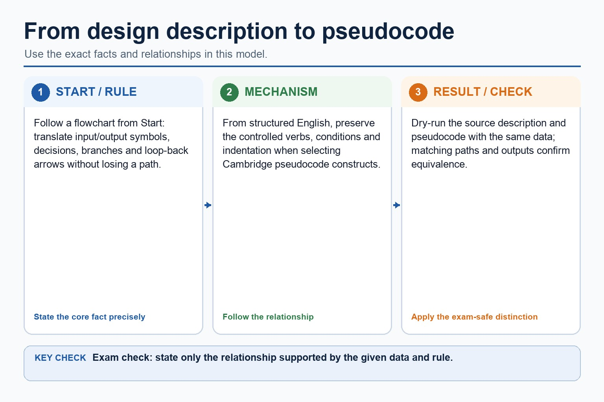

# Lesson 069: Translating descriptions into Cambridge pseudocode

**Course:** Cambridge International AS Level Computer Science 9618, syllabus for examination in 2027-2029 
**Paper:** Paper 2 
**Syllabus:** Section 11: Programming 
**Syllabus requirements:** S11.01 
**Pacing:** Flexible. Select a quick, full or deep route for the learners in front of you.

## Teaching-depth menu

- **Quick route:** Use the diagnostic, learning objectives, first worked example and foundation question. Stop once the learner can explain the central distinction accurately.
- **Full route:** Teach every knowledge-point material set, the worked method and all lesson questions.
- **Deep route:** Add the prerequisite refresher, ask learners to connect the concept checklist, discuss the labelled extension and complete a transfer question without a model answer.

## 1. Prerequisite knowledge and quick diagnostic

Recall S9.07 before starting this lesson.

Ask the learner to give one accurate definition or method step before continuing. If they cannot, briefly revisit the named prerequisite rather than repeating the whole previous lesson.

### Optional prerequisite refresher

- Document an algorithm using structured English, a flowchart or pseudocode; write pseudocode from structured English or a flowchart, and draw a flowchart from structured English or pseudocode while preserving the same algorithm.
- Use structured English, flowcharts and pseudocode; convert between representations.

## 2. Knowledge explanation

### 1. Pseudocode from a flowchart or structured-English description: Translating descriptions into Cambridge pseudocode (S11.01)

**Concept relationships**

- **structured English:** Pseudocode from a flowchart or structured-English description.
- **flowchart:** Implement and write pseudocode from a given design…
- **pseudocode:** From structured English, preserve the controlled verbs, conditions…
- **design:** For translating descriptions into cambridge pseudocode, identify the…
- **preserve logic:** To translate structured English, identify its controlled verbs…

**Mechanism**

1. **Translate the stated design** — Pseudocode from a flowchart or structured-English description.
2. **Apply one complete operation** — Implement and write pseudocode from a given design presented as either a flowchart or structured English.
3. **Trace state and boundaries** — From structured English, preserve the controlled verbs, conditions and indentation when selecting Cambridge pseudocode constructs.

**Translate a flowchart or structured English into pseudocode:** Follow a flowchart from Start: translate input/output symbols, decisions, branches and loop-back arrows without losing a path. From structured English, preserve the controlled verbs, conditions and indentation when selecting Cambridge pseudocode constructs.

#### Translate a flowchart or structured English into pseudocode

Text transcript

- Follow a flowchart from Start: translate input/output symbols, decisions, branches and loop-back arrows without losing a path.
- From structured English, preserve the controlled verbs, conditions and indentation when selecting Cambridge pseudocode constructs.
- Dry-run the source description and pseudocode with the same data; matching paths and outputs confirm equivalence.

Precise syllabus wording

Write pseudocode from a flowchart or structured-English description.

Implement and write pseudocode from a given design presented as either a flowchart or structured English.

Open precise terminology and exam facts

- Implement and write pseudocode from a given design presented as either a flowchart or structured English.
- To translate a flowchart, follow arrows from Start, convert input/output symbols directly, convert diamonds into IF/CASE or loop conditions, and preserve every branch and reconnection. To translate structured English, identify its controlled verbs and indentation before selecting Cambridge constructs.
- The answer must be Cambridge pseudocode, not Java: use assignment arrow, THEN/ENDIF, FOR...NEXT, WHILE...ENDWHILE or REPEAT...UNTIL as appropriate. Trace both versions with the same data to confirm equivalence.
- For translating descriptions into cambridge pseudocode, identify the required concept before describing its mechanism or consequence.

### Worked method

1. Flowchart sum loop
2. A flowchart sets Total to 0 and repeats input/add until Value = -1.
3. Pseudocode uses Total <- 0; REPEAT; INPUT Value; IF Value < -1 THEN Total <- Total + Value; ENDIF; UNTIL Value = -1; OUTPUT Total.

Beyond syllabus / 延伸知识（不要求背诵）: consistent style, modularity and automated tests reduce maintenance errors in larger programs.
## 3. Practice by question type

### Question 1 - foundation - design - 4 marks

Translate this structured-English design into Cambridge pseudocode: input five temperatures; count those below zero; output the count.

**Answer:** initialises count to 0; uses a five-iteration count-controlled loop with INPUT; tests Temperature < 0 and increments count; outputs count after the loop with coherent Cambridge syntax

**Marking guidance:** Do not accept Java syntax such as int, braces or System.out as Cambridge pseudocode.

**Common error:** For the command word design, perform that exact action; do not replace it with an unrelated fact.

### Question 2 - application - explain - 2 marks

How is a flowchart decision normally translated?

**Answer:** As a selection or loop condition, depending on where arrows reconnect.

**Marking guidance:** Award one mark for each distinct, technically accurate point or method step.

**Common error:** Do not repeat the same point in different words; each mark needs a separate idea or method step.

### Question 3 - transfer - state - 2 marks

State two precise facts about translating descriptions into cambridge pseudocode.

**Answer:** Implement and write pseudocode from a given design presented as either a flowchart or structured English. To translate a flowchart, follow arrows from Start, convert input/output symbols directly, convert diamonds into IF/CASE or loop conditions, and preserve every branch and reconnection. To translate structured English, identify its controlled verbs and indentation before selecting Cambridge constructs.

**Marking guidance:** Award one mark for each distinct fact; do not credit a repeated point.

**Common error:** Do not copy the worked example unchanged; transfer the method and check it against the new context.

### Related past-paper indexes

| Reference | Marks | Command word | Question type |
|---|---:|---|---|
| 9618/22/S/25 Q10(a) | 8 | complete | trace |
| 9618/21/S/25 Q7(a) | 6 | write | write |
| 9618/23/S/25 Q7(a)(i) | 5 | write | write |
| 9618/21/S/25 Q1(c) | 3 | complete | recall |

These are indexes only. Cambridge question and mark-scheme wording is not reproduced.

## 4. Summary and exam reminders

### Summary

- Define translating descriptions into cambridge pseudocode with the exact technical vocabulary expected by the syllabus.
- Use the lesson method on a fresh context and show the intermediate decision, representation or calculation.
- Match the shape of the answer to the command word and the available marks.
- Check the final answer against the scenario instead of repeating a memorised sentence.

### Common error to correct

Students often think working Java automatically means good pseudocode. Correction: Paper 2 rewards clear Cambridge-style algorithm expression.

### Exam technique

- Follow the command word: state gives a fact; explain links a cause to a consequence; compare covers both sides.
- Match the number of independent points or method steps to the available marks.
- For translating descriptions into cambridge pseudocode, use the exact technical term before applying it to the scenario.
