# Lesson 069: Translating descriptions into Cambridge pseudocode

**Course:** Cambridge International AS Level Computer Science 9618, 2027-2029 Version 2 
**Paper:** Paper 2 
**Syllabus:** Section 11: Programming 
**Syllabus requirements:** S11.01 
**Pacing:** Flexible. Select the material set and practice depth needed by the learner.

## Teaching-depth menu

- **Quick route:** Use the diagnostic, learning objectives, first worked example and foundation question. Stop once the learner can explain the central distinction accurately.
- **Full route:** Use every knowledge-point material set, the worked method, the terminology check and all questions.
- **Deep route:** Add the prerequisite refresher, ask learners to connect the concept checklist, discuss the labelled extension and complete a transfer question without a model answer.

## 1. Prerequisite knowledge and quick diagnostic

Recall S9.07 before starting this lesson.

Ask the learner to give one accurate definition or method step before continuing. If they cannot, briefly revisit the named prerequisite rather than repeating the whole previous lesson.

### Optional prerequisite refresher

- Document an algorithm using structured English, a flowchart or pseudocode; write pseudocode from structured English or a flowchart, and draw a flowchart from structured English or pseudocode while preserving the same algorithm.
- Use structured English, flowcharts and pseudocode; convert between representations.

## 2. Knowledge explanation

### 1. Pseudocode · Flowchart · Structured-English · Description (S11.01)

**Concept map:** pseudocode → flowchart → structured-English → description

**Three-part explanation:**

1. Implement and write pseudocode from a given design presented as either a flowchart or structured English
2. For translating descriptions into cambridge pseudocode, identify the required concept before describing its mechanism or consequence
3. To translate structured English, identify its controlled verbs and indentation before selecting Cambridge constructs

**Concrete cue:** Implement and write pseudocode from a given design presented as either a flowchart or structured English.

#### Translate a flowchart or structured English into pseudocode

Text transcript

- Follow a flowchart from Start: translate input/output symbols, decisions, branches and loop-back arrows without losing a path.
- From structured English, preserve the controlled verbs, conditions and indentation when selecting Cambridge pseudocode constructs.
- Dry-run the source description and pseudocode with the same data; matching paths and outputs confirm equivalence.

#### Java file handling helps understanding, but does not replace pseudocode

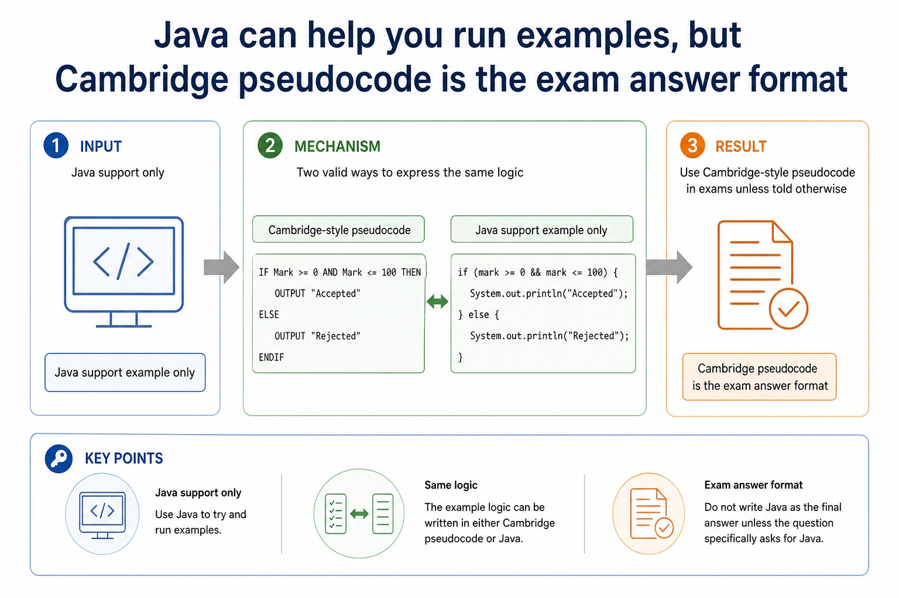

Text transcript

- Java support only
- Cambridge-style pseudocode
- OPENFILE "Scores.txt" FOR READ
- WHILE NOT EOF("Scores.txt")
- READFILE "Scores.txt", Line
- OUTPUT Line
- ENDWHILE
- CLOSEFILE "Scores.txt"

#### Java can help you run examples, but Cambridge pseudocode is the exam answer format

Text transcript

- Java support only
- Cambridge-style pseudocode
- IF Mark = 0 AND Mark <= 100 THEN
- OUTPUT "Accepted"
- ELSE
- OUTPUT "Rejected"
- ENDIF
- Java support example only

#### Java debugging tools help practice, but Cambridge pseudocode remains the exam format

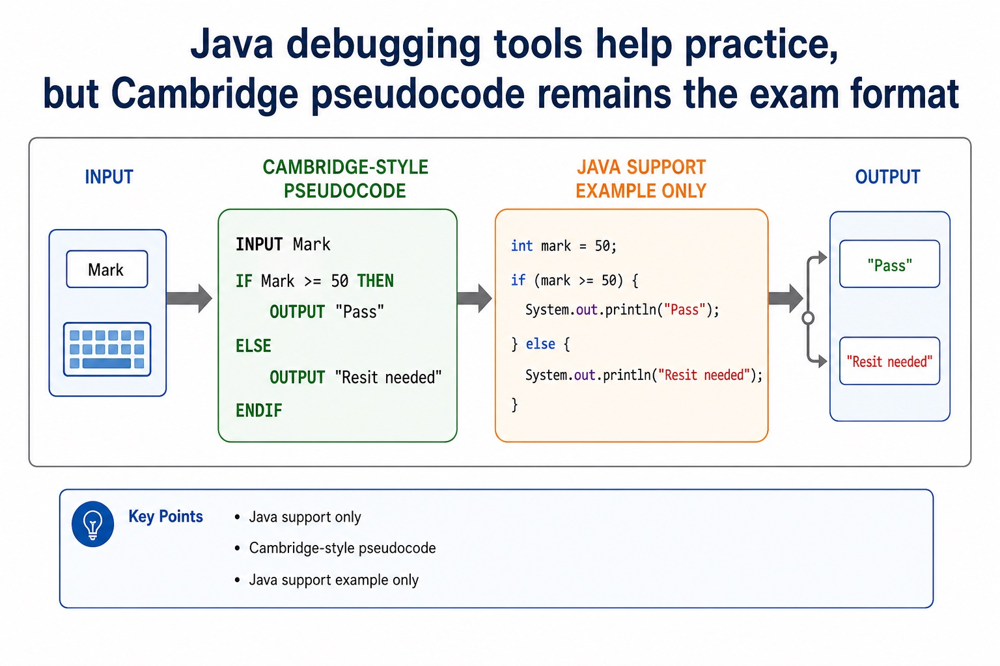

Text transcript

- Java support only
- Cambridge-style pseudocode
- INPUT Mark
- IF Mark = 50 THEN
- OUTPUT "Pass"
- OUTPUT "Resit needed"
- Java support example only
- int mark = 50;

Precise syllabus wording

Write pseudocode from a flowchart or structured-English description.

Implement and write pseudocode from a given design presented as either a flowchart or structured English.

### Supporting diagram library

#### Flowcharts use symbols to show control flow

Text transcript

- A terminator marks START or END; a parallelogram marks INPUT or OUTPUT.
- A rectangle marks a calculation or assignment; a diamond marks a yes/no decision.
- Flow lines show the next step and decision branches must be labelled.
- A loop must contain a route that can change its condition.

#### Three control-flow ideas

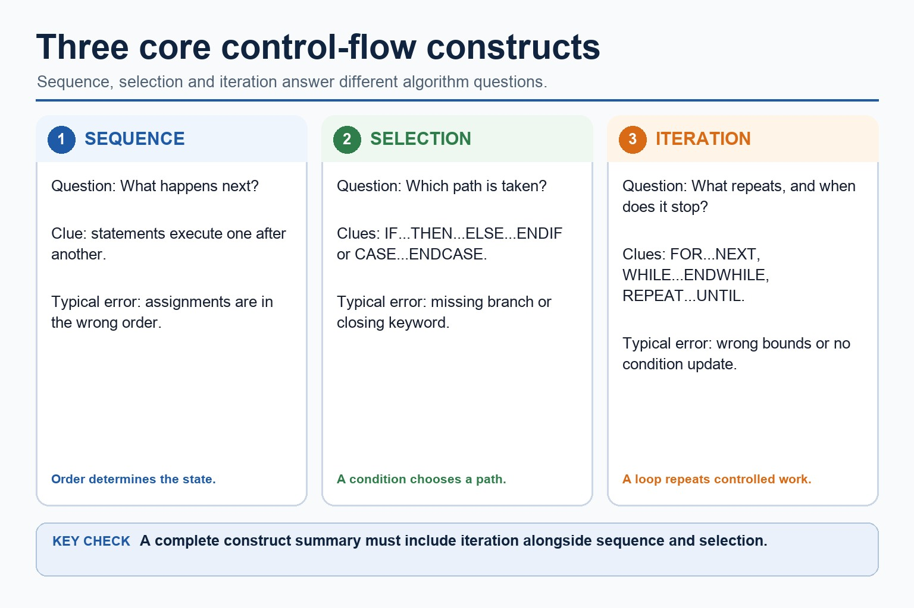

Text transcript

- Sequence answers what happens next and depends on statement order.
- Selection answers which path is taken and uses IF or CASE structures.
- Iteration answers what repeats and when repetition stops.
- FOR, WHILE and REPEAT are iteration forms with different controls.

#### Loops repeat with control

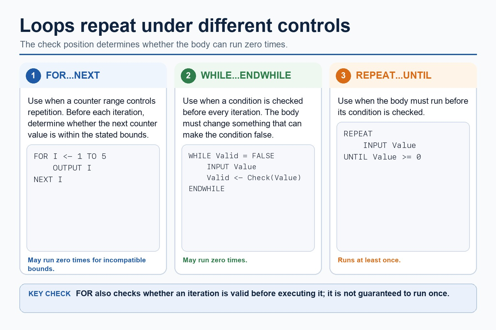

Text transcript

- A FOR loop uses a counter range and checks whether the next iteration is within its bounds.
- A FOR loop may execute zero times when its bounds are incompatible.
- A WHILE loop checks its condition before each iteration and may execute zero times.
- A REPEAT loop checks after the body and therefore runs at least once.

#### Same logic, different exam language

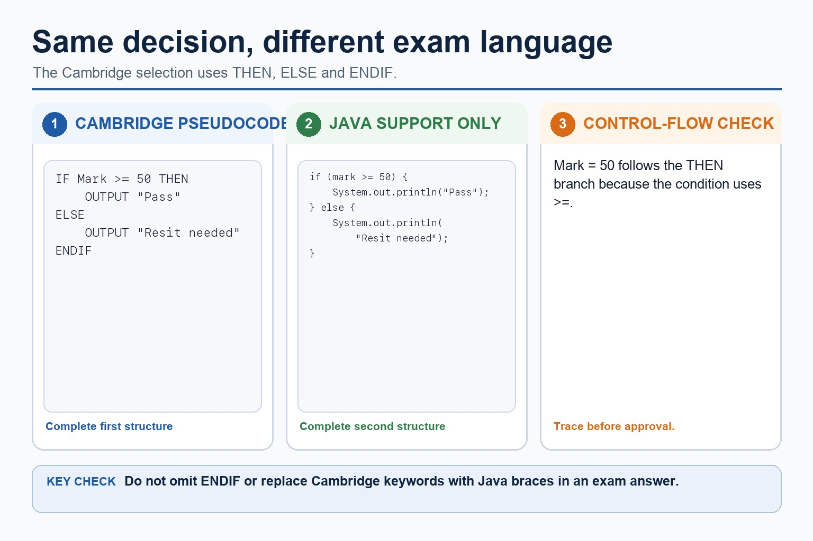

Text transcript

- Cambridge pseudocode uses IF, THEN, ELSE and ENDIF for a two-way selection.
- Mark 50 follows the pass branch when the condition uses greater than or equal to 50.
- Java braces may support understanding but are not Cambridge pseudocode.

#### Conditions decide the path

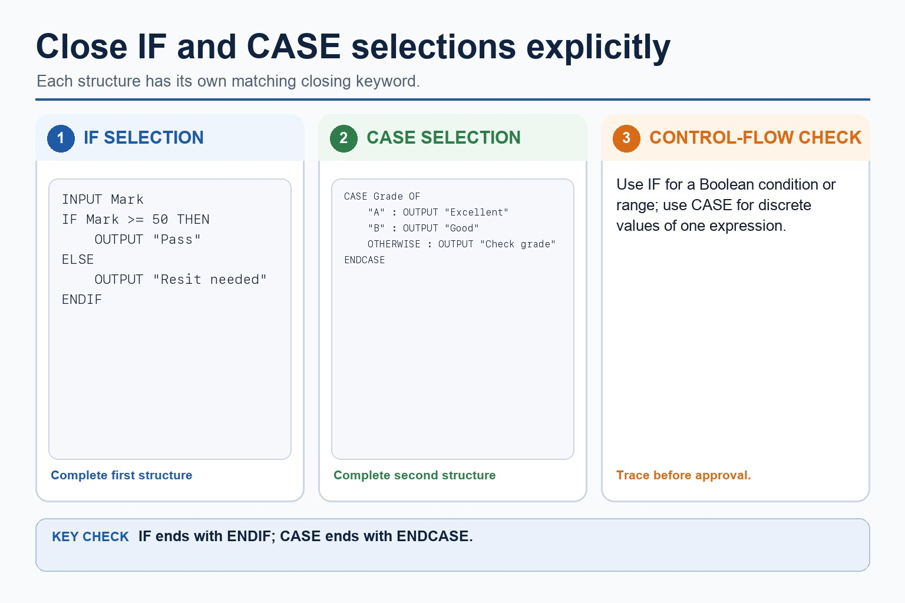

Text transcript

- Use IF for a Boolean condition or range and close it with ENDIF.
- Use CASE for several discrete values of one expression and close it with ENDCASE.
- Test marks 49, 50 and 51 to verify the pass boundary.

#### Order changes meaning

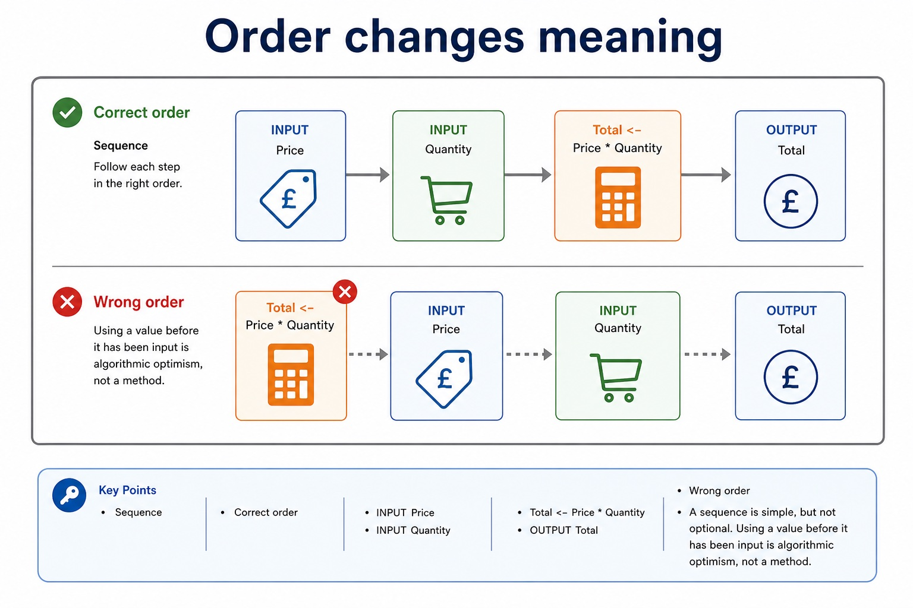

Text transcript

- Sequence
- Correct order
- INPUT Price
- INPUT Quantity
- Total <- Price Quantity
- OUTPUT Total
- Wrong order
- A sequence is simple, but not optional. Using a value before it has been input is algorithmic optimism, not a method.

#### Run a small loop by hand

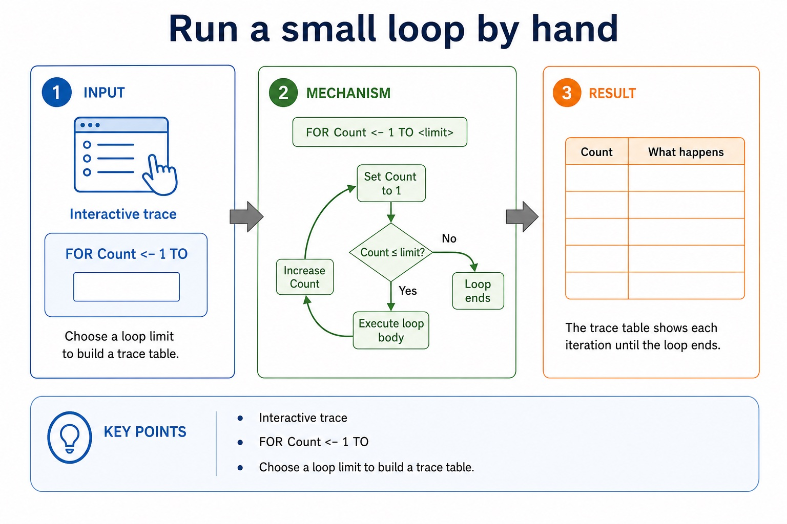

Text transcript

- Interactive trace
- FOR Count <- 1 TO
- Choose a loop limit to build a trace table.

#### FOR APPEND adds new data to the end

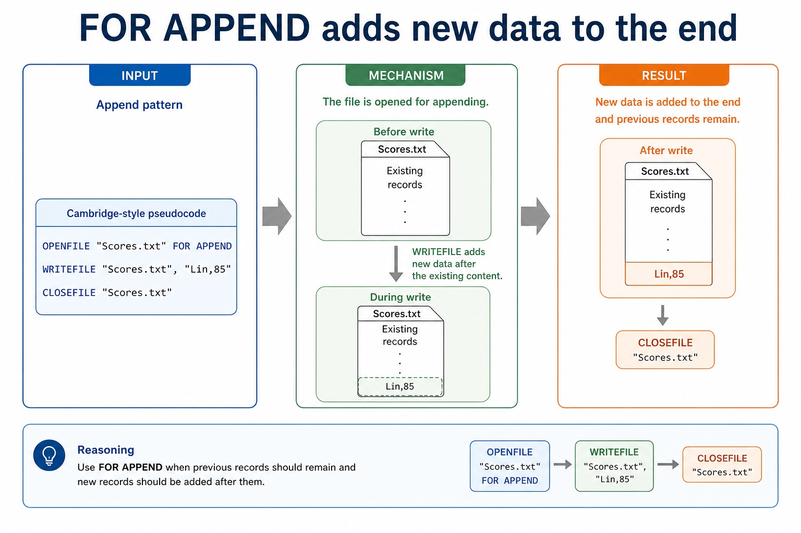

Text transcript

- Append pattern
- Cambridge-style pseudocode
- OPENFILE "Scores.txt" FOR APPEND
- WRITEFILE "Scores.txt", "Lin,85"
- CLOSEFILE "Scores.txt"
- Reasoning
- Use FOR APPEND when previous records should remain and new records should be added after them.

#### CLOSEFILE completes the pattern

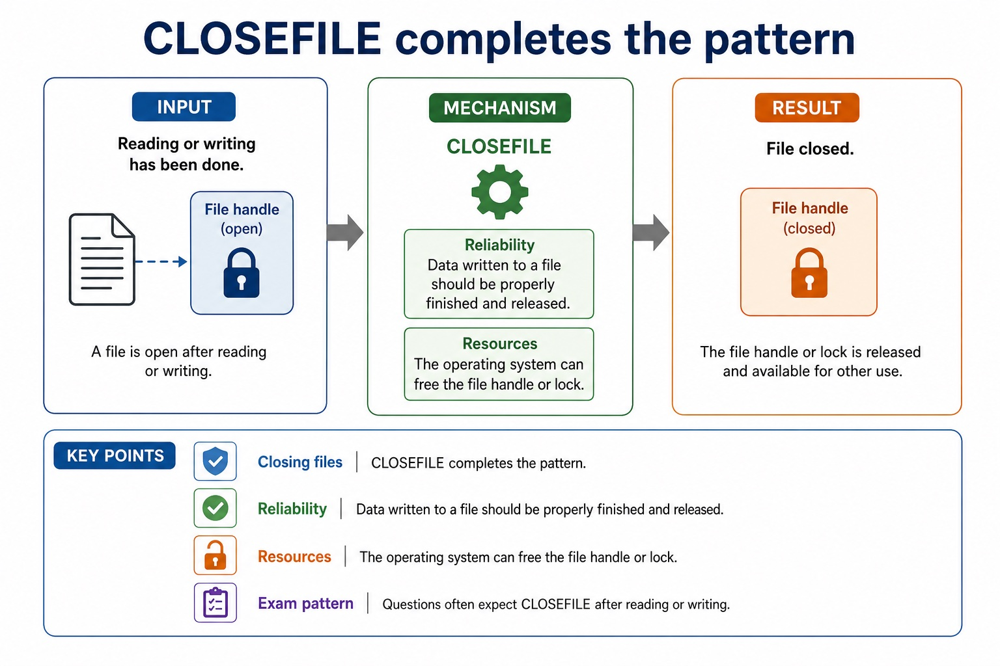

Text transcript

- Closing files
- Reliability Data written to a file should be properly finished and released.
- Resources The operating system can free the file handle or lock.
- Exam pattern Questions often expect CLOSEFILE after reading or writing.

#### EOF prevents reading past the end of the file

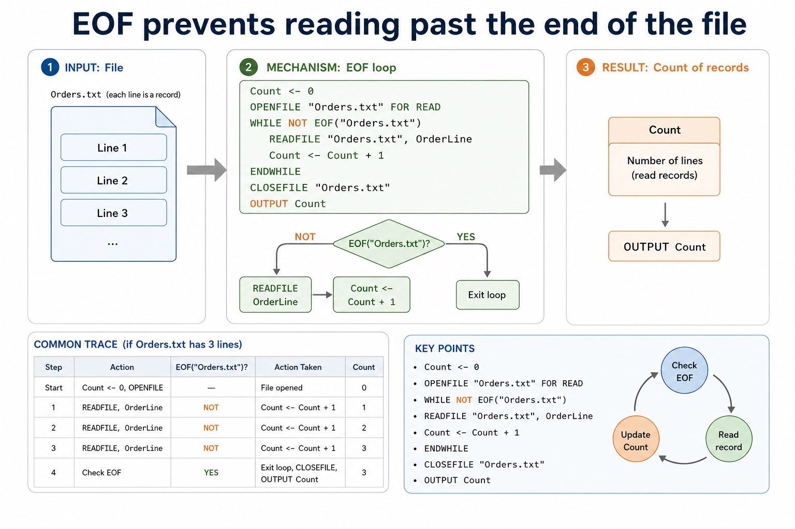

Text transcript

- EOF loop
- Count records
- Count <- 0
- OPENFILE "Orders.txt" FOR READ
- WHILE NOT EOF("Orders.txt")
- READFILE "Orders.txt", OrderLine
- Count <- Count + 1
- ENDWHILE

#### The mode controls what the program intends to do with the file

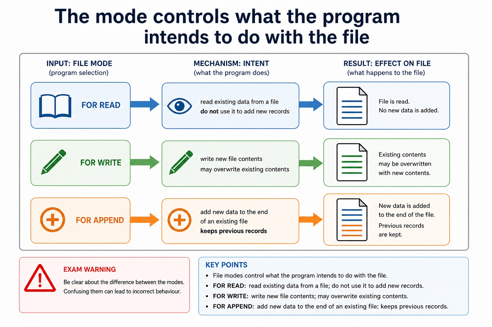

Text transcript

- File modes
- Exam warning
- FOR READ
- read existing data from a file
- do not use it to add new records
- FOR WRITE
- write new file contents
- may overwrite existing contents

#### Files store data outside the running program

Text transcript

- Volatile variable
- A variable value is lost when the program ends unless it is saved elsewhere.
- Persistent file
- A file such as Scores.txt can keep records for the next time the program runs.

#### Read every line using WHILE NOT EOF

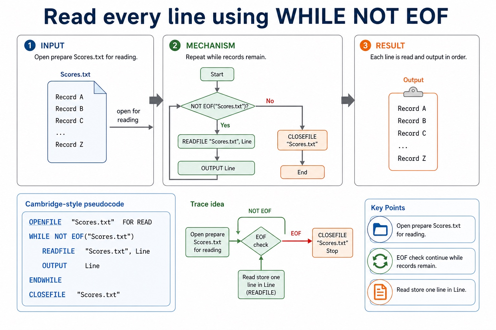

Text transcript

- Read pattern
- Cambridge-style pseudocode
- OPENFILE "Scores.txt" FOR READ
- WHILE NOT EOF("Scores.txt")
- READFILE "Scores.txt", Line
- OUTPUT Line
- ENDWHILE
- CLOSEFILE "Scores.txt"

#### FOR WRITE writes new contents

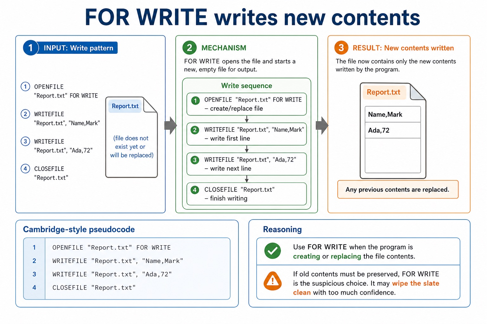

Text transcript

- Write pattern
- Cambridge-style pseudocode
- OPENFILE "Report.txt" FOR WRITE
- WRITEFILE "Report.txt", "Name,Mark"
- WRITEFILE "Report.txt", "Ada,72"
- CLOSEFILE "Report.txt"
- Reasoning
- Use FOR WRITE when the program is creating or replacing the file contents.

#### Abnormal data is invalid data that should be rejected

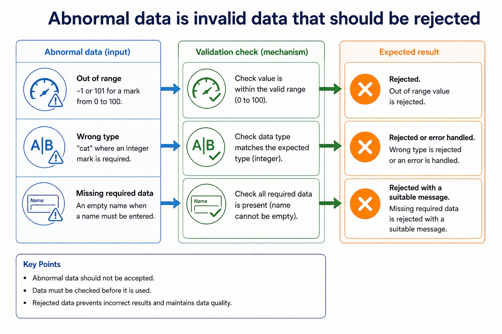

Text transcript

- Abnormal data is invalid data that should be rejected or handled.
- For a mark from 0 to 100, -1 and 101 are out-of-range abnormal data.
- The string "cat" is wrong-type abnormal data when an integer mark is required.

#### Normal data is valid, typical data inside the allowed range

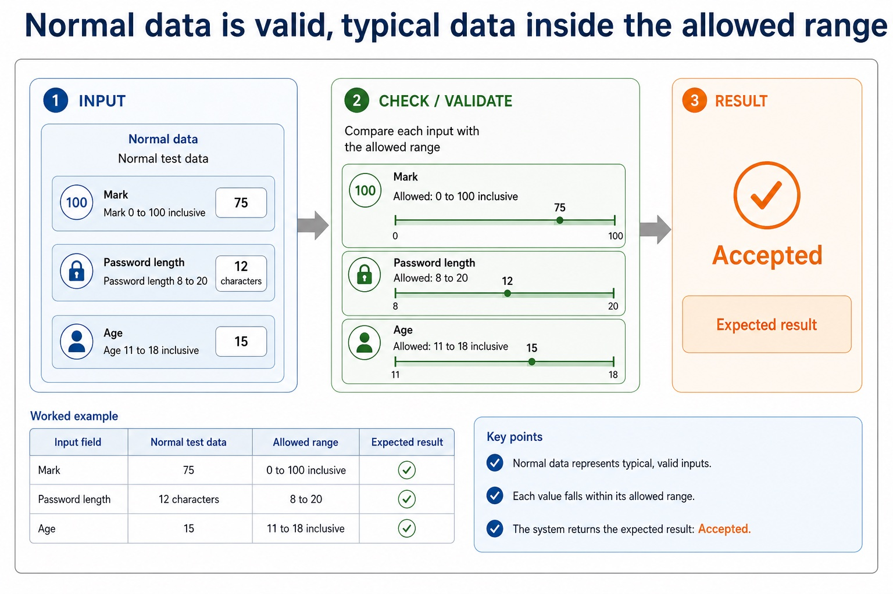

Text transcript

- Normal data
- Normal test data
- Expected result
- Mark 0 to 100 inclusive
- Accepted
- Password length 8 to 20
- 12 characters
- Age 11 to 18 inclusive

#### Testing compares actual results with expected results

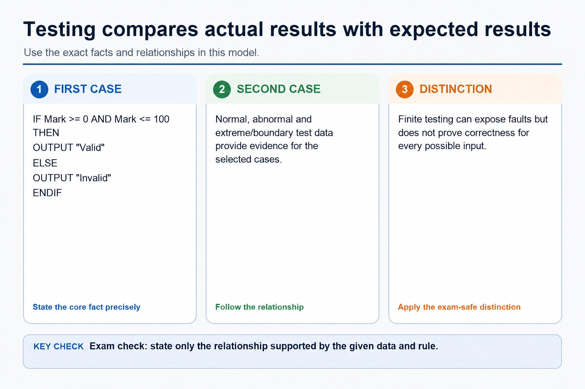

Text transcript

- IF Mark = 0 AND Mark <= 100 THEN
- Normal, abnormal and extreme/boundary test data provide evidence for the selected cases.
- Finite testing can expose faults but does not prove correctness for every possible input.

#### A clear test table turns thinking into marks

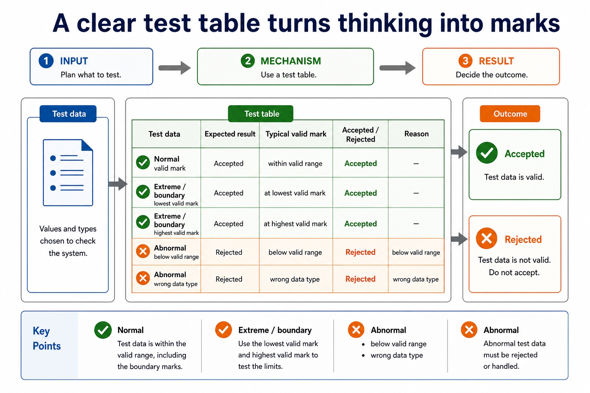

Text transcript

- A test table records test data, its category and the expected result.
- Use 50 as normal accepted data and 0 or 100 as valid extreme/boundary accepted data.
- Use -1, 101 or a wrong-type input as abnormal data with a rejected or handled expected result.

#### Testing checks validation against expected results

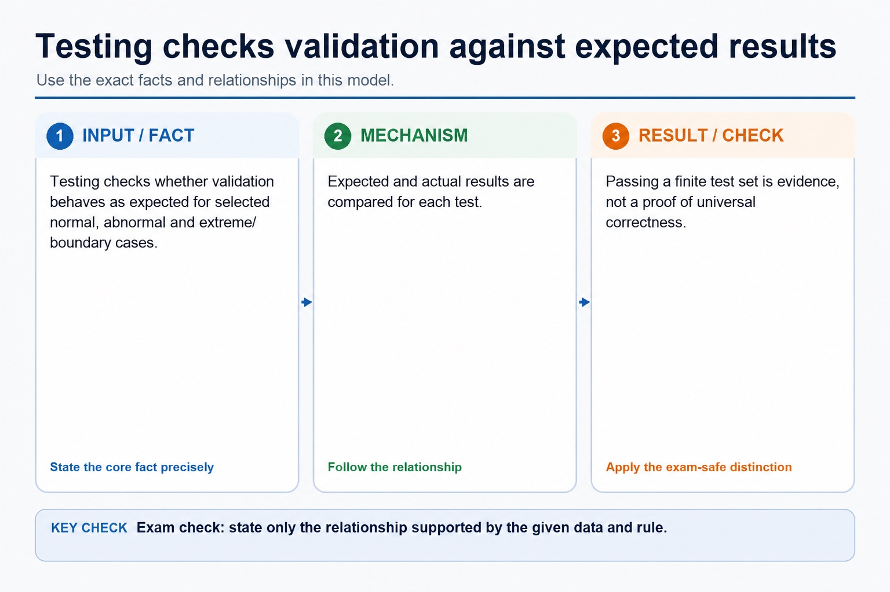

Text transcript

- Testing checks whether validation behaves as expected for selected normal, abnormal and extreme/boundary cases.
- Expected and actual results are compared for each test.
- Passing a finite test set is evidence, not a proof of universal correctness.

#### A breakpoint pauses execution at a chosen line

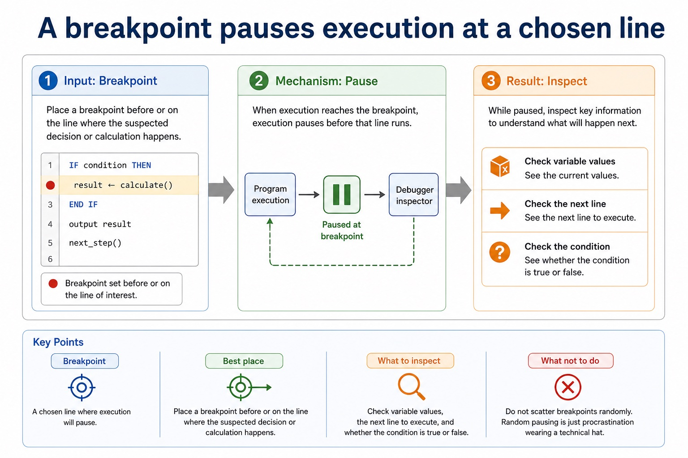

Text transcript

- Breakpoint
- Best place
- Place a breakpoint before or on the line where the suspected decision or calculation happens.
- What to inspect
- Check variable values, the next line to execute, and whether the condition is true or false.
- What not to do
- Do not scatter breakpoints randomly. Random pausing is just procrastination wearing a technical hat.

#### Debugging locates and corrects faults

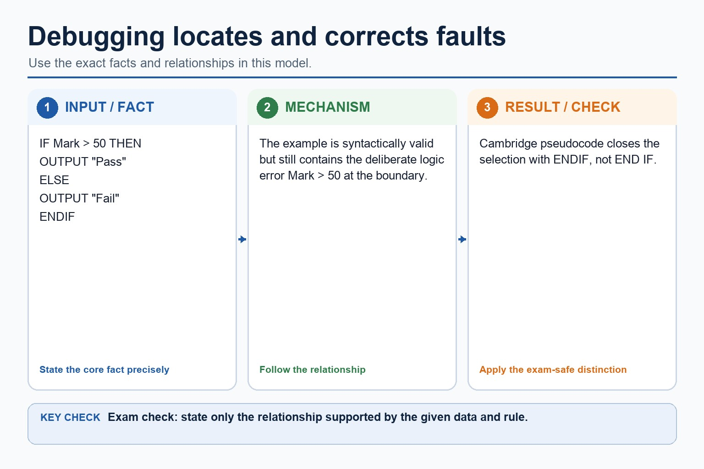

Text transcript

- IF Mark 50 THEN
- The example is syntactically valid but still contains the deliberate logic error Mark 50 at the boundary.
- Cambridge pseudocode closes the selection with ENDIF, not END IF.

#### Step through code one instruction at a time

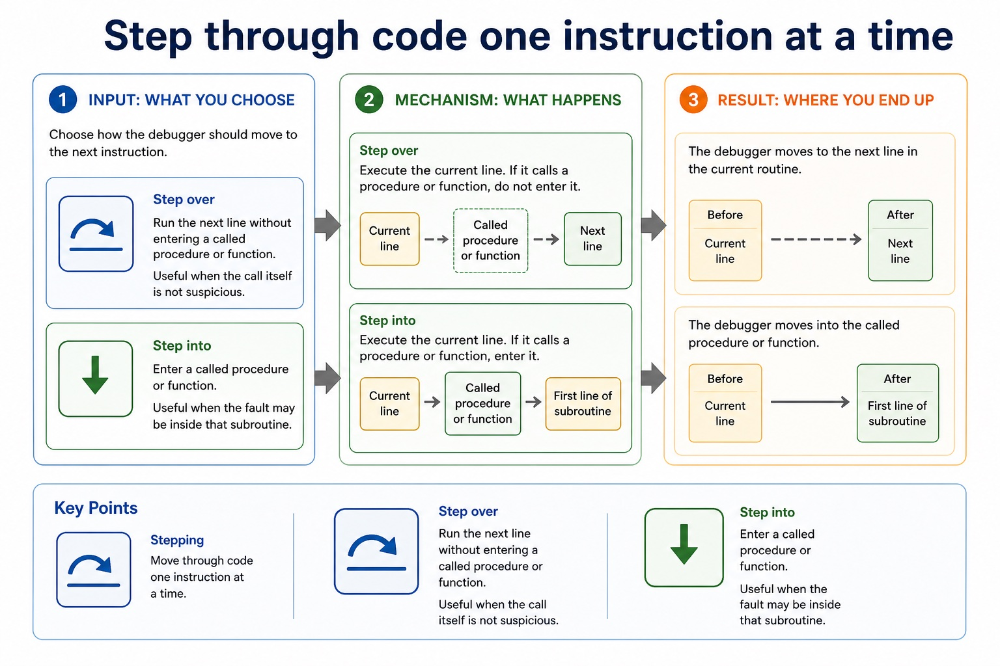

Text transcript

- Stepping
- Step over
- Run the next line without entering a called procedure or function. Useful when the call itself is not suspicious.
- Step into
- Enter a called procedure or function. Useful when the fault may be inside that subroutine.

#### Watching variables shows state changes while stepping

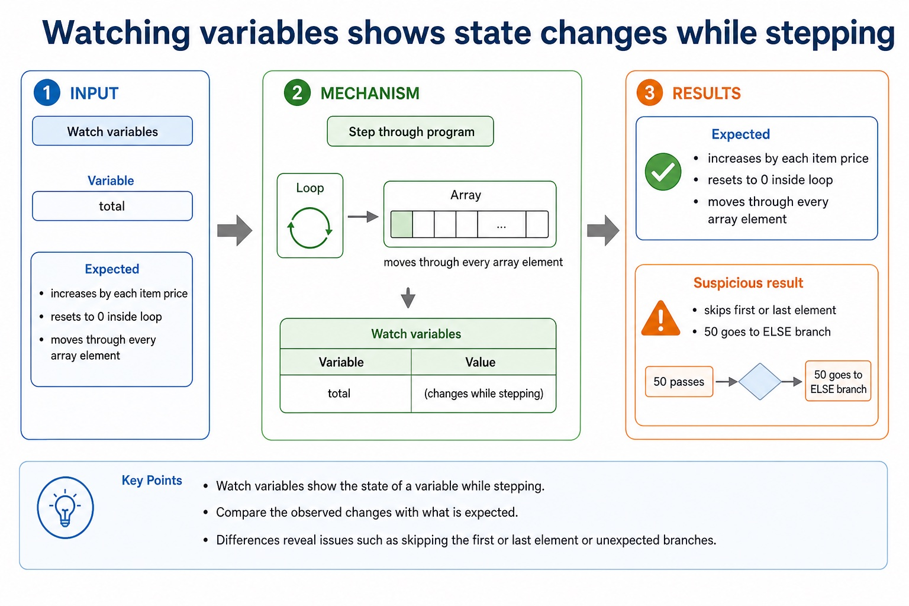

Text transcript

- Watch variables
- Variable
- Expected
- Suspicious result
- increases by each item price
- resets to 0 inside loop
- moves through every array element
- skips first or last element

#### Use Cambridge array notation consistently

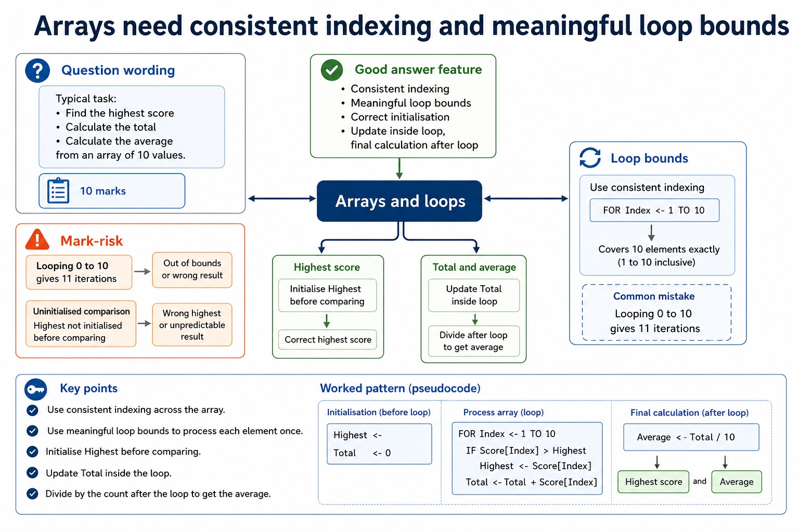

Text transcript

- Java support example only
- scores[0] = 72;
- System.out.println(scores[0]);
- Cambridge-style pseudocode
- Scores[1] <- 72
- OUTPUT Scores[1]
- Cambridge examples often use 1-based indexing unless a question defines otherwise. Follow the question's stated indexing.

#### Use the assignment arrow for storing a value

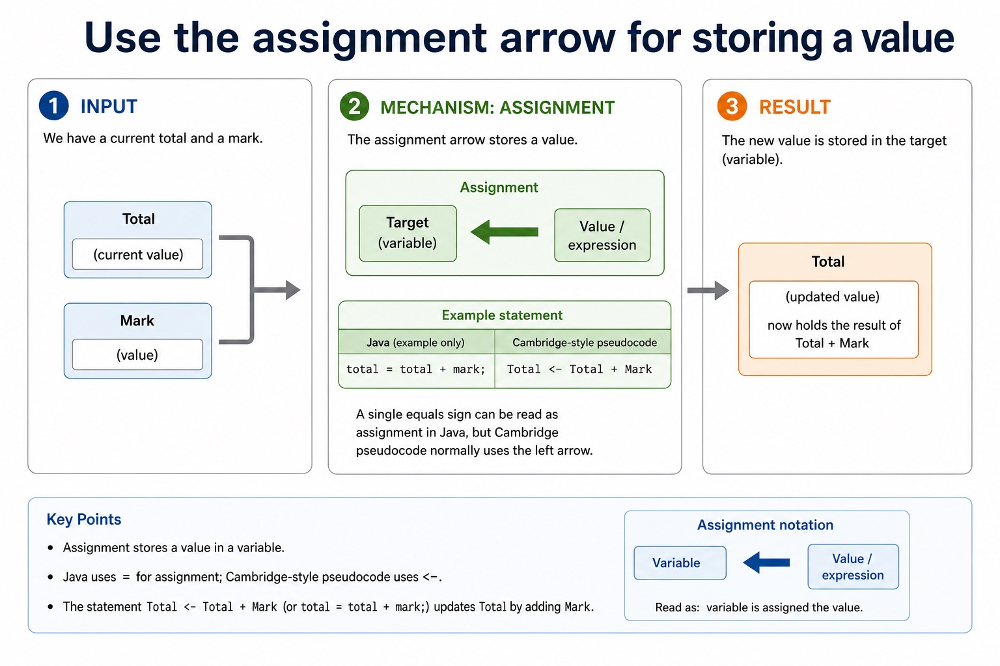

Text transcript

- Assignment
- Java support example only
- total = total + mark;
- Cambridge-style pseudocode
- Total <- Total + Mark
- A single equals sign can be read as assignment in Java, but Cambridge pseudocode normally uses the left arrow.

#### 5-minute quiz focus

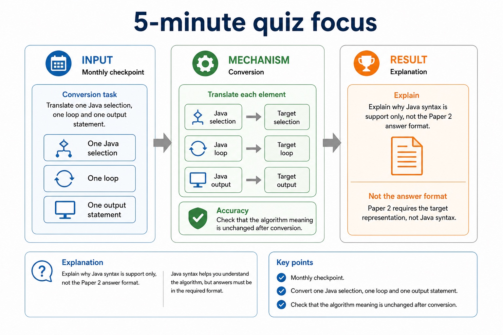

Text transcript

- Monthly checkpoint
- Conversion
- Translate one Java selection, one loop and one output statement.
- Explanation
- Explain why Java syntax is support only, not the Paper 2 answer format.
- Accuracy
- Check that the algorithm meaning is unchanged after conversion.

#### Replace library calls with algorithm keywords

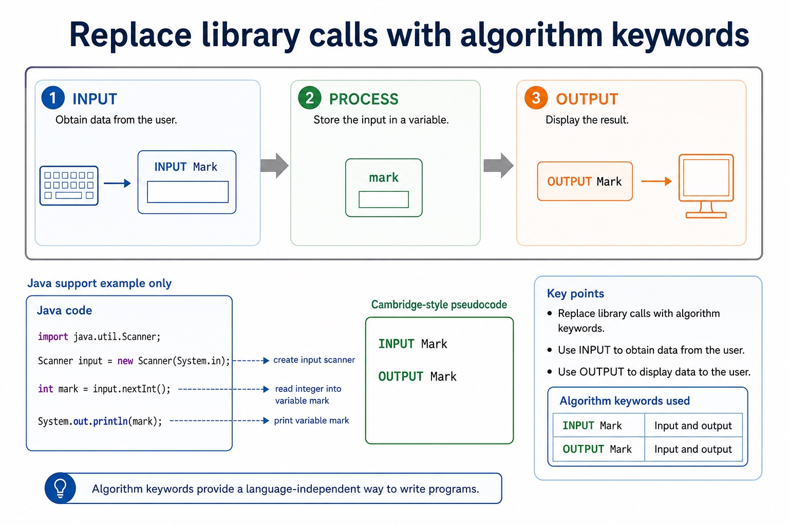

Text transcript

- Input and output
- Java support example only
- Scanner input = new Scanner(System.in);
- mark = input.nextInt();
- System.out.println(mark);
- Cambridge-style pseudocode
- INPUT Mark
- OUTPUT Mark

#### Choose the loop keyword that matches the logic

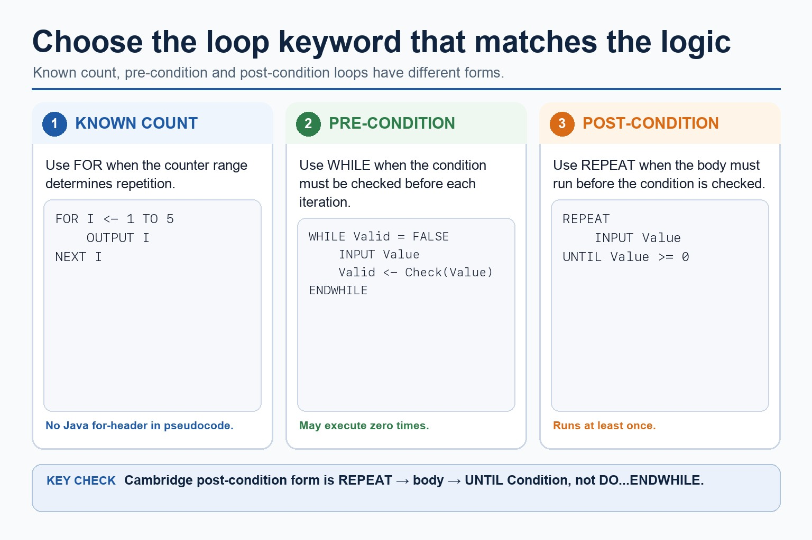

Text transcript

- Use FOR when a counter range determines the number of iterations.
- Use WHILE when the condition is checked before each iteration.
- Use REPEAT, then the body, then UNTIL Condition for a post-condition loop.
- Do not use DO...ENDWHILE as the Cambridge post-condition form.

#### Use IF , THEN , ELSE , ENDIF

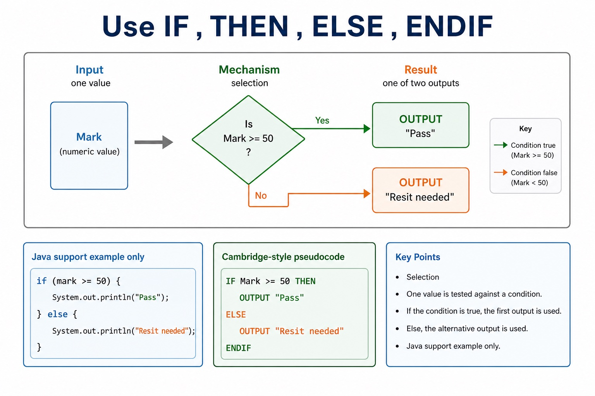

Text transcript

- Selection
- Java support example only
- if (mark = 50) {
- System.out.println("Pass");
- } else {
- System.out.println("Resit needed");
- Cambridge-style pseudocode
- IF Mark = 50 THEN

#### Spot the Java-only syntax in an exam answer

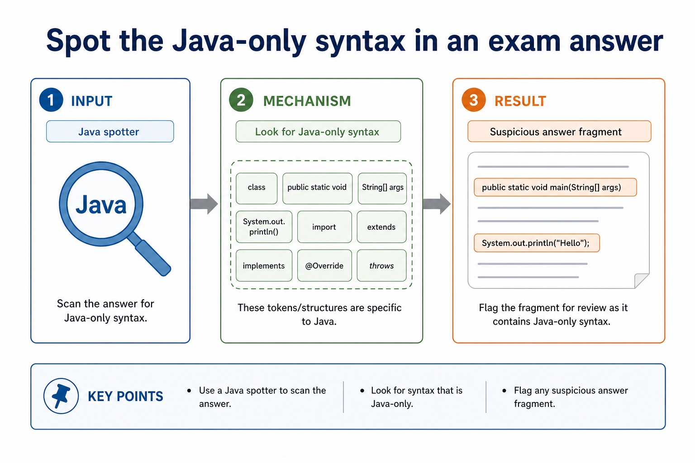

Text transcript

- Java spotter
- Suspicious answer fragment

#### Use PROCEDURE and FUNCTION instead of Java method wrappers

Text transcript

- Subroutines
- Java support example only
- static boolean isValidMark(int mark) {
- return mark = 0 && mark <= 100;
- Cambridge-style pseudocode
- FUNCTION IsValidMark(Mark : INTEGER) RETURNS BOOLEAN
- RETURN Mark = 0 AND Mark <= 100
- ENDFUNCTION

Open precise terminology and exam facts

- Implement and write pseudocode from a given design presented as either a flowchart or structured English.
- To translate a flowchart, follow arrows from Start, convert input/output symbols directly, convert diamonds into IF/CASE or loop conditions, and preserve every branch and reconnection. To translate structured English, identify its controlled verbs and indentation before selecting Cambridge constructs.
- The answer must be Cambridge pseudocode, not Java: use assignment arrow, THEN/ENDIF, FOR...NEXT, WHILE...ENDWHILE or REPEAT...UNTIL as appropriate. Trace both versions with the same data to confirm equivalence.
- For translating descriptions into cambridge pseudocode, identify the required concept before describing its mechanism or consequence.

### Worked example

1. Flowchart sum loop
2. A flowchart sets Total to 0 and repeats input/add until Value = -1.
3. Pseudocode uses Total <- 0; REPEAT; INPUT Value; IF Value < -1 THEN Total <- Total + Value; ENDIF; UNTIL Value = -1; OUTPUT Total.

Beyond syllabus / 延伸知识（不要求背诵）: consistent style, modularity and automated tests reduce maintenance errors in larger programs.
## 3. Practice by question type

### Question 1 - foundation - design - 4 marks

Translate this structured-English design into Cambridge pseudocode: input five temperatures; count those below zero; output the count.

**Answer:** initialises count to 0; uses a five-iteration count-controlled loop with INPUT; tests Temperature < 0 and increments count; outputs count after the loop with coherent Cambridge syntax

**Marking guidance:** Do not accept Java syntax such as int, braces or System.out as Cambridge pseudocode.

**Common error:** For the command word design, perform that exact action; do not replace it with an unrelated fact.

### Question 2 - application - explain - 2 marks

How is a flowchart decision normally translated?

**Answer:** As a selection or loop condition, depending on where arrows reconnect.

**Marking guidance:** Award one mark for each distinct, technically accurate point or method step.

**Common error:** Do not repeat the same point in different words; each mark needs a separate idea or method step.

### Question 3 - transfer - state - 2 marks

State two precise facts about translating descriptions into cambridge pseudocode.

**Answer:** Implement and write pseudocode from a given design presented as either a flowchart or structured English. To translate a flowchart, follow arrows from Start, convert input/output symbols directly, convert diamonds into IF/CASE or loop conditions, and preserve every branch and reconnection. To translate structured English, identify its controlled verbs and indentation before selecting Cambridge constructs.

**Marking guidance:** Award one mark for each distinct fact; do not credit a repeated point.

**Common error:** Do not copy the worked example unchanged; transfer the method and check it against the new context.

### Related past-paper indexes

| Reference | Marks | Command word | Question type |
|---|---:|---|---|
| 9618/22/S/25 Q10(a) | 8 | complete | trace |
| 9618/21/S/25 Q7(a) | 6 | write | write |
| 9618/23/S/25 Q7(a)(i) | 5 | write | write |
| 9618/21/S/25 Q1(c) | 3 | complete | recall |

These are indexes only. Cambridge question and mark-scheme wording is not reproduced.

## 4. Summary and exam reminders

### Summary

- Define translating descriptions into cambridge pseudocode with the exact technical vocabulary expected by the syllabus.
- Use the lesson method on a fresh context and show the intermediate decision, representation or calculation.
- Match the shape of the answer to the command word and the available marks.
- Check the final answer against the scenario instead of repeating a memorised sentence.

### Common error to correct

Students often think working Java automatically means good pseudocode. Correction: Paper 2 rewards clear Cambridge-style algorithm expression.

### Exam technique

- Follow the command word: state gives a fact; explain links a cause to a consequence; compare covers both sides.
- Match the number of independent points or method steps to the available marks.
- For translating descriptions into cambridge pseudocode, use the exact technical term before applying it to the scenario.
