# Lesson 070: Declarations, assignment and input/output

**Course:** Cambridge International AS Level Computer Science 9618, 2027-2029 Version 2 
**Paper:** Paper 2 
**Syllabus:** Section 11: Programming 
**Syllabus requirements:** S11.02 
**Pacing:** Flexible. Select the material set and practice depth needed by the learner.

## Teaching-depth menu

- **Quick route:** Use the diagnostic, learning objectives, first worked example and foundation question. Stop once the learner can explain the central distinction accurately.
- **Full route:** Use every knowledge-point material set, the worked method, the terminology check and all questions.
- **Deep route:** Add the prerequisite refresher, ask learners to connect the concept checklist, discuss the labelled extension and complete a transfer question without a model answer.

## 1. Prerequisite knowledge and quick diagnostic

Recall S10.01, S9.06 before starting this lesson.

Ask the learner to give one accurate definition or method step before continuing. If they cannot, briefly revisit the named prerequisite rather than repeating the whole previous lesson.

### Optional prerequisite refresher

- Select and use appropriate types for a problem solution. The Version 2 Notes name integer, real, char, string, Boolean and date, and require the Cambridge pseudocode type names INTEGER, REAL, CHAR, STRING, BOOLEAN, DATE, ARRAY and FILE.
- Understand integer, real, char, string, Boolean and date types and Cambridge pseudocode type names.
- The three basic algorithm constructs are sequence, selection and iteration (repetition); students must recognise and use each construct, including combinations of constructs.
- Understand and use sequence, selection and iteration.

## 2. Knowledge explanation

### 1. Declaration · Constants · Variables · Assignment (S11.02)

**Concept map:** declaration → constants → variables → assignment → arithmetic → logical → input → output

**Three-part explanation:**

1. Write pseudocode for declaration and initialisation of constants
2. expressions using arithmetic or logical operators
3. Arithmetic expressions use operators such as +, -, , /, DIV and MOD

**Concrete cue:** Write pseudocode for declaration and initialisation of constants; declaration of variables; assignment of values; expressions using arithmetic or logical operators; input from the keyboard; and output to the console.

#### Java I/O syntax is not Cambridge pseudocode

Text transcript

- Java support only
- Cambridge-style pseudocode
- OUTPUT "Enter mark"
- INPUT Mark
- OUTPUT "Mark: " & Mark
- Java support example only
- Scanner input = new Scanner(System.in);
- System.out.print("Enter mark: ");

#### Operators combine values to calculate a result

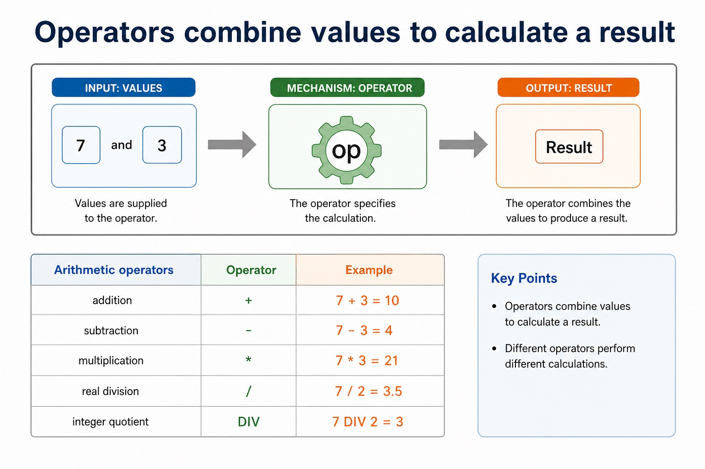

Text transcript

- Arithmetic operators
- Operator
- addition
- 7 + 3 = 10
- subtraction
- 7 - 3 = 4
- multiplication
- 7 3 = 21

#### OUTPUT displays text, values or expressions

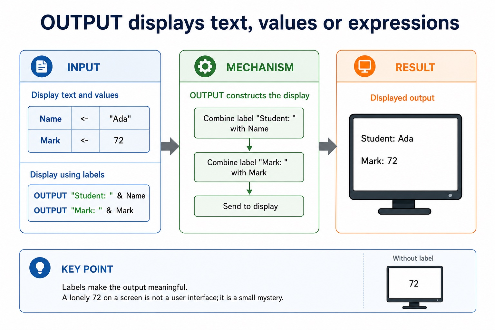

Text transcript

- Display text and values
- Name <- "Ada"
- Mark <- 72
- OUTPUT "Student: " & Name
- OUTPUT "Mark: " & Mark
- Displayed output
- Student: Ada
- Mark: 72

#### Local variables are declared inside a subroutine or block

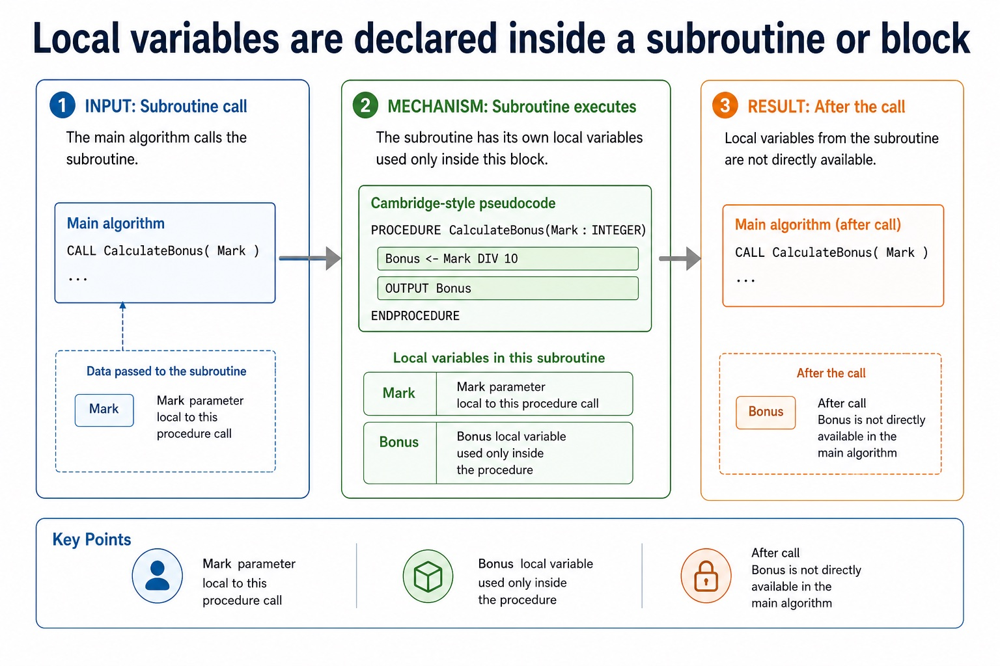

Text transcript

- Local variables
- Cambridge-style pseudocode
- PROCEDURE CalculateBonus(Mark : INTEGER)
- Bonus <- Mark DIV 10
- OUTPUT Bonus
- ENDPROCEDURE
- Reasoning
- Mark parameter local to this procedure call

#### A string is a sequence of characters

Text transcript

- Cambridge-style assignment
- Name <- "Ada"
- Message <- "Hello, " & Name
- OUTPUT Message
- Reasoning
- "Ada" is a string of three characters. & is used here for concatenation.
- If a question uses a different concatenation operator, follow the question. The mark is for clear string construction.

Precise syllabus wording

Use declarations, constants, variables, assignment, arithmetic/logical operations and input/output.

Write pseudocode for declaration and initialisation of constants; declaration of variables; assignment of values; expressions using arithmetic or logical operators; input from the keyboard; and output to the console.

### Supporting diagram library

#### Start with the shape of the decision

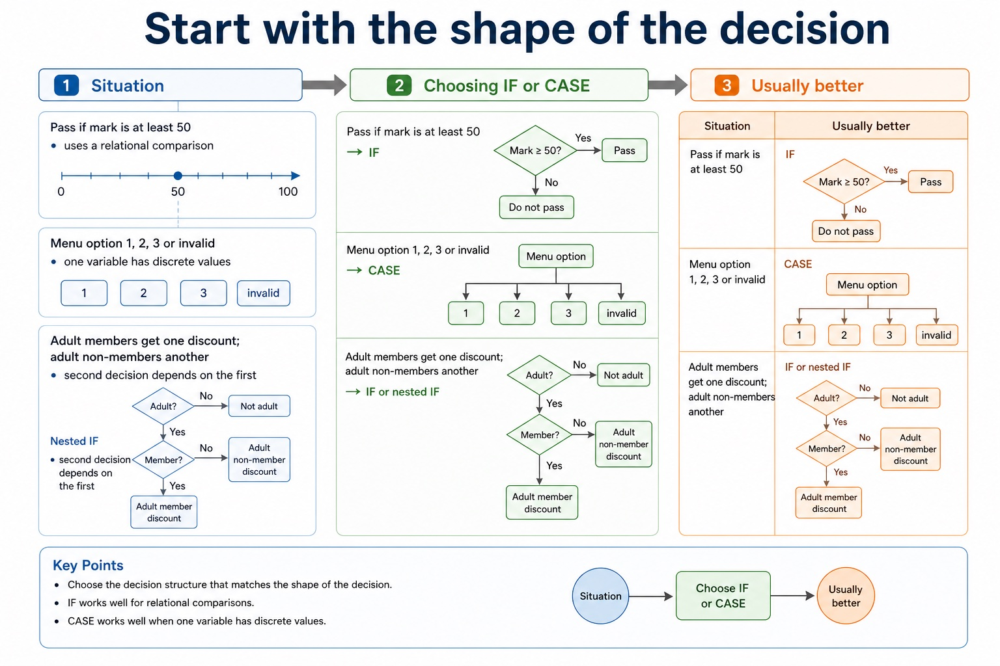

Text transcript

- Choosing IF or CASE
- Situation
- Usually better
- Pass if mark is at least 50
- uses a relational comparison
- Menu option 1, 2, 3 or invalid
- one variable has discrete values
- Adult members get one discount; adult non-members another

#### Use IF when a Boolean condition decides the route

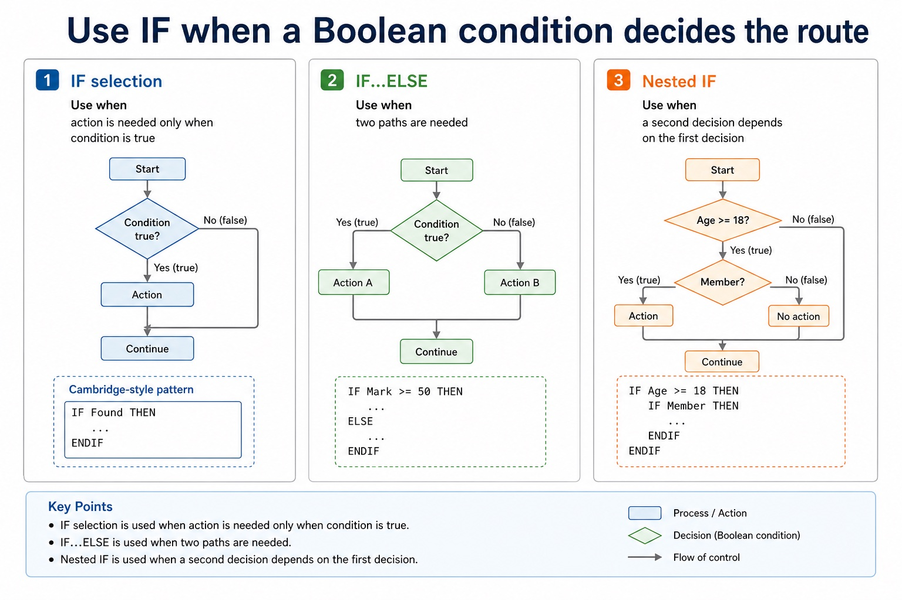

Text transcript

- IF selection
- Use when
- Cambridge-style pattern
- action is needed only when condition is true
- IF Found THEN ... ENDIF
- IF...ELSE
- two paths are needed
- IF Mark = 50 THEN ... ELSE ... ENDIF

#### Same idea, different syntax

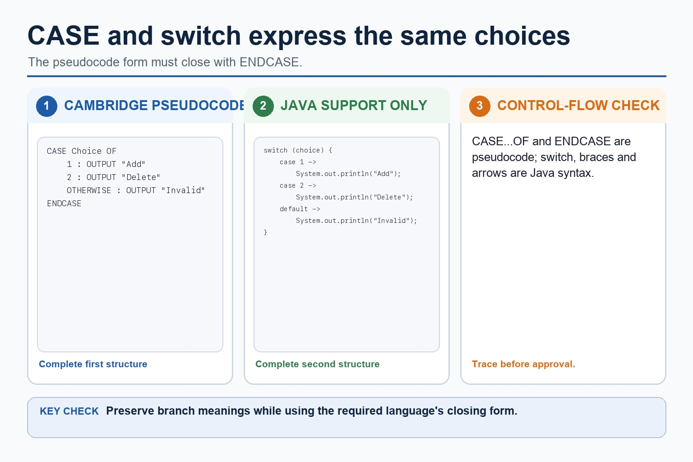

Text transcript

- Cambridge pseudocode uses CASE...OF, OTHERWISE and ENDCASE.
- Java switch syntax may support understanding but is not Cambridge pseudocode.
- Both forms must preserve the same branch meanings.

#### A decision inside another decision

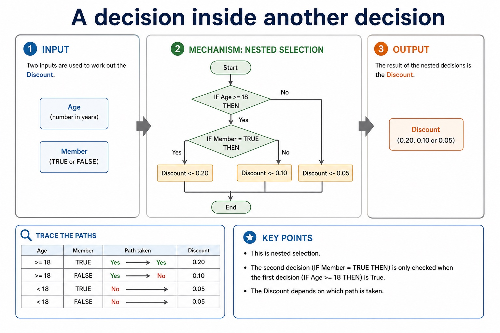

Text transcript

- Nested selection
- Discount example
- IF Age = 18 THEN
- IF Member = TRUE THEN
- Discount <- 0.20
- Discount <- 0.10
- Discount <- 0.05
- Trace the paths

#### Trace a nested IF

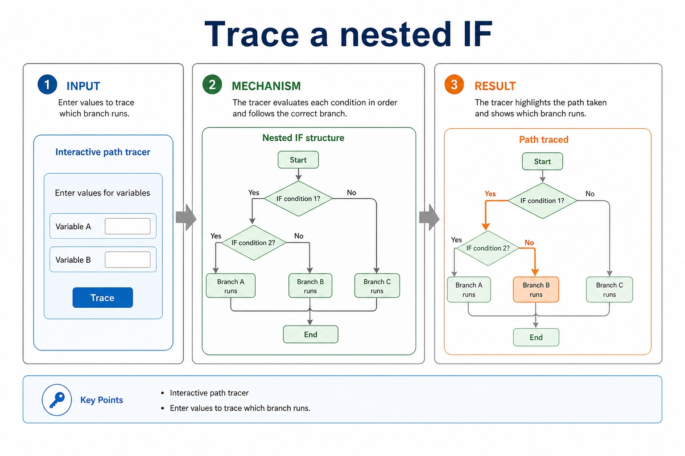

Text transcript

- Interactive path tracer
- Enter values to trace which branch runs.

#### The symbol changes, the update idea does not

Text transcript

- Pseudocode vs Java
- Cambridge-style pseudocode
- CONSTANT PassMark = 50
- DECLARE Mark : INTEGER
- DECLARE Passed : BOOLEAN
- INPUT Mark
- Passed <- Mark = PassMark
- Java support only

#### Local and global variables differ by accessibility and lifetime

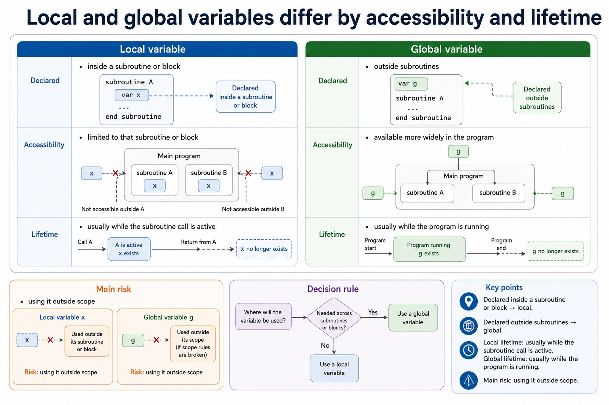

Text transcript

- Local variable
- Global variable
- Declared
- inside a subroutine or block
- outside subroutines
- limited to that subroutine or block
- available more widely in the program
- Lifetime

#### Global variables are declared outside subroutines and can be accessed widely

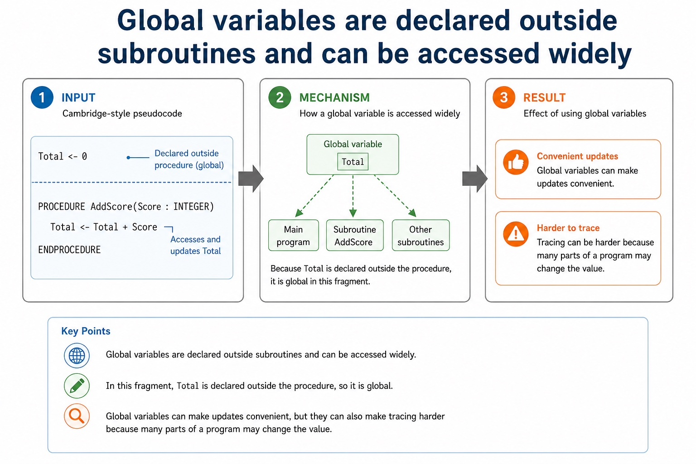

Text transcript

- Global variables
- Cambridge-style pseudocode
- Total <- 0
- PROCEDURE AddScore(Score : INTEGER)
- Total <- Total + Score
- ENDPROCEDURE
- Reasoning
- Total is declared outside the procedure, so it is global in this fragment.

#### Java helps illustrate scope, but Cambridge pseudocode remains the answer format

Text transcript

- Java support only
- Cambridge-style pseudocode
- PROCEDURE PrintLocal()
- Value <- 7
- OUTPUT Value
- ENDPROCEDURE
- Java support example only
- static void printLocal() {

#### Lifetime means how long a variable exists during execution

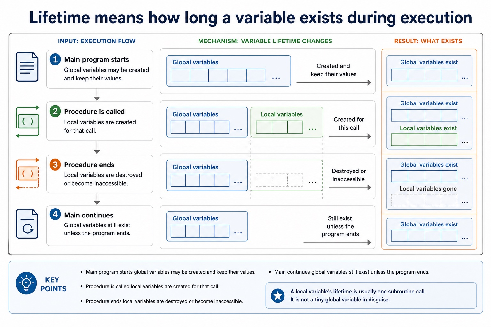

Text transcript

- Lifetime
- Main program starts global variables may be created and keep their values
- Procedure is called local variables are created for that call
- Procedure ends local variables are destroyed or become inaccessible
- Main continues global variables still exist unless the program ends
- A local variable's lifetime is usually one subroutine call. It is not a tiny global variable in disguise.

#### Scope means where a variable or identifier can be accessed

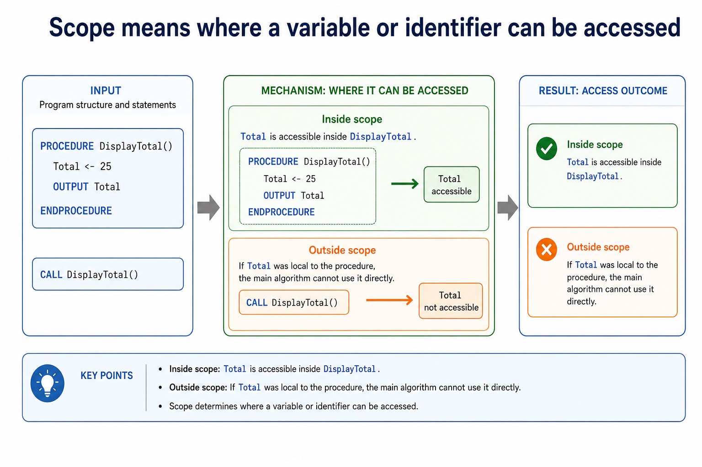

Text transcript

- Inside scope
- PROCEDURE DisplayTotal()
- Total <- 25
- OUTPUT Total
- ENDPROCEDURE
- Total is accessible inside DisplayTotal .
- Outside scope
- CALL DisplayTotal()

#### A local variable can hide a global variable with the same name

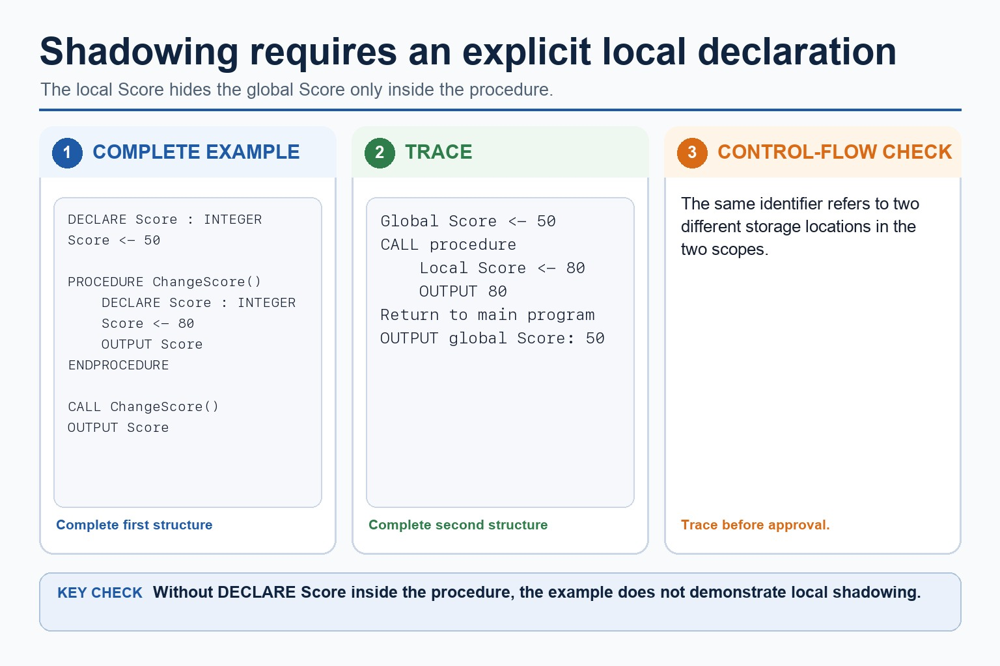

Text transcript

- Declare a global Score and set it to 50.
- Inside ChangeScore, explicitly declare a separate local Score and set it to 80.
- The local Score hides the global Score only inside the procedure.
- The procedure outputs 80, while the main program later outputs the unchanged global 50.

#### Compare / , DIV and MOD

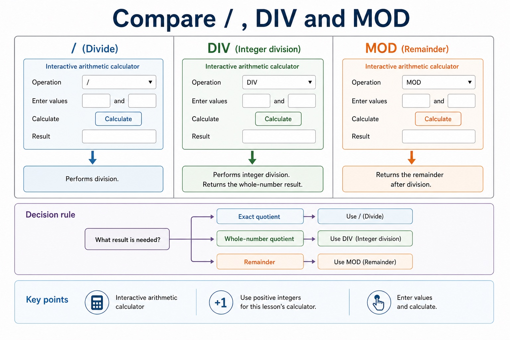

Text transcript

- Interactive arithmetic calculator
- Use positive integers for this lesson's calculator.
- Operation
- Enter values and calculate.

#### DIV returns the whole-number quotient

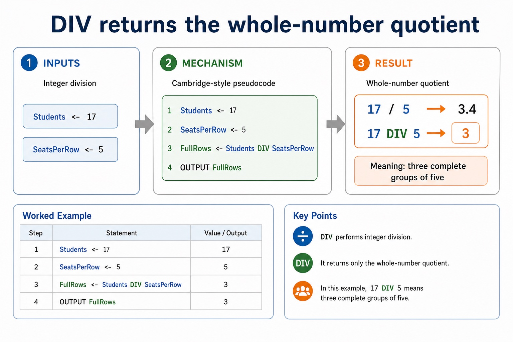

Text transcript

- Integer division
- Cambridge-style pseudocode
- Students <- 17
- SeatsPerRow <- 5
- FullRows <- Students DIV SeatsPerRow
- OUTPUT FullRows
- 17 / 5 3.4
- 17 DIV 5 3

#### Java can support the idea, but Cambridge pseudocode remains the answer format

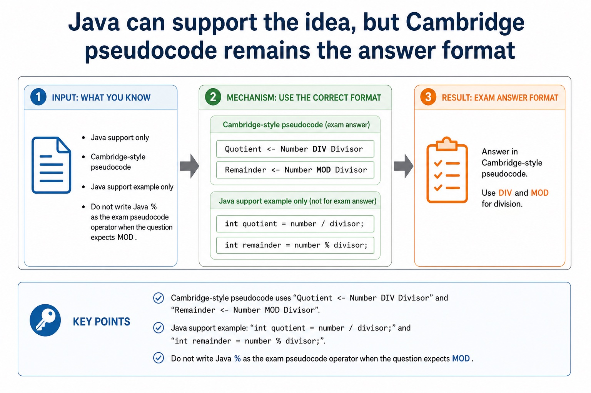

Text transcript

- Java support only
- Cambridge-style pseudocode
- Quotient <- Number DIV Divisor
- Remainder <- Number MOD Divisor
- Java support example only
- int quotient = number / divisor;
- int remainder = number % divisor;
- Do not write Java % as the exam pseudocode operator when the question expects MOD .

#### MOD returns the remainder

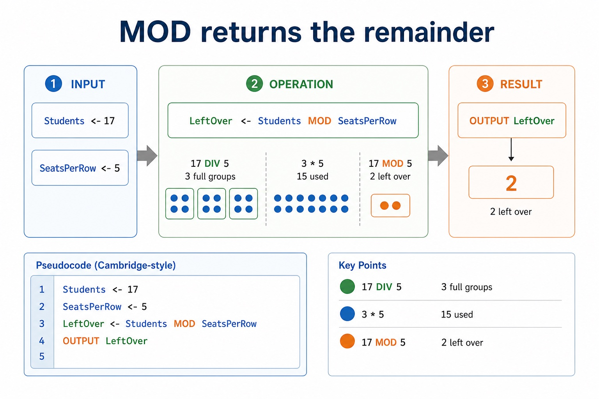

Text transcript

- Cambridge-style pseudocode
- Students <- 17
- SeatsPerRow <- 5
- LeftOver <- Students MOD SeatsPerRow
- OUTPUT LeftOver
- 17 DIV 5 3 full groups
- 3 5 15 used
- 17 MOD 5 2 left over

#### DIV and MOD often appear in practical algorithm tasks

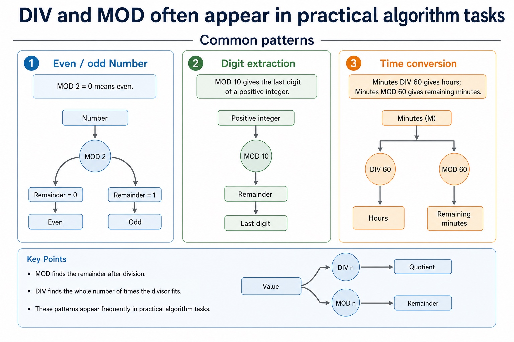

Text transcript

- Common patterns
- Even / odd Number MOD 2 = 0 means even.
- Digit extraction Number MOD 10 gives the last digit of a positive integer.
- Time conversion Minutes DIV 60 gives hours; Minutes MOD 60 gives remaining minutes.

#### Use brackets when the intended order matters

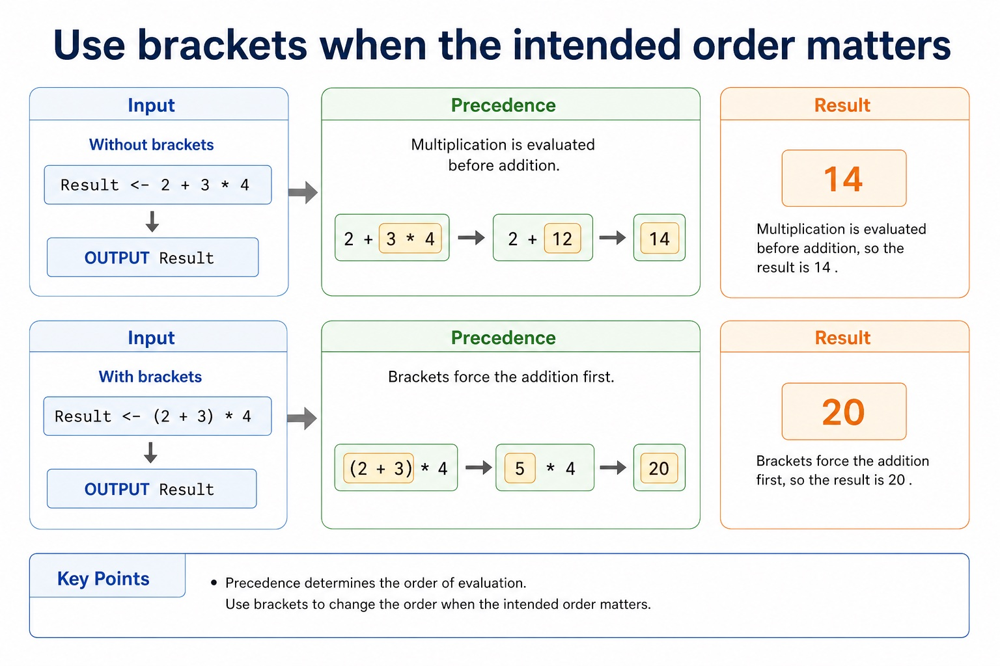

Text transcript

- Precedence
- Without brackets
- Result <- 2 + 3 4
- OUTPUT Result
- Multiplication is evaluated before addition, so the result is 14 .
- With brackets
- Result <- (2 + 3) 4
- Brackets force the addition first, so the result is 20 .

#### Use the identity to check your answer

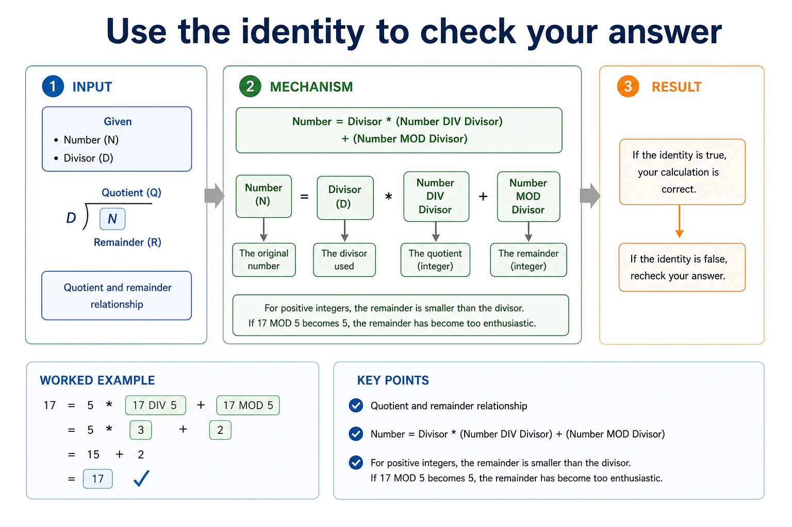

Text transcript

- Quotient and remainder relationship
- Number = Divisor (Number DIV Divisor) + (Number MOD Divisor)
- Example: 17 = 5 (17 DIV 5) + (17 MOD 5) = 5 3 + 2
- For positive integers, the remainder is smaller than the divisor. If 17 MOD 5 becomes 5 , the remainder has become too enthusiastic.

#### Build a readable result line

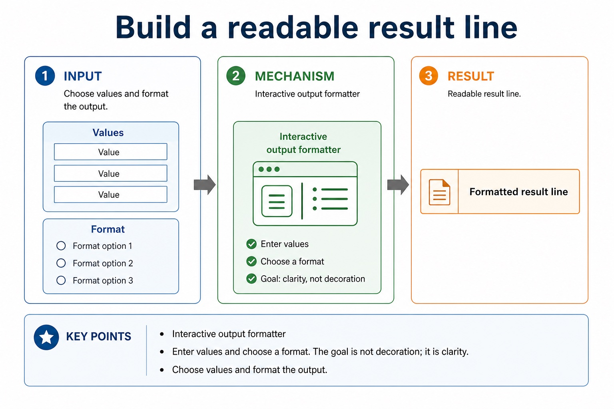

Text transcript

- Interactive output formatter
- Enter values and choose a format. The goal is not decoration; it is clarity.
- Choose values and format the output.

#### Formatting means controlling how values are shown

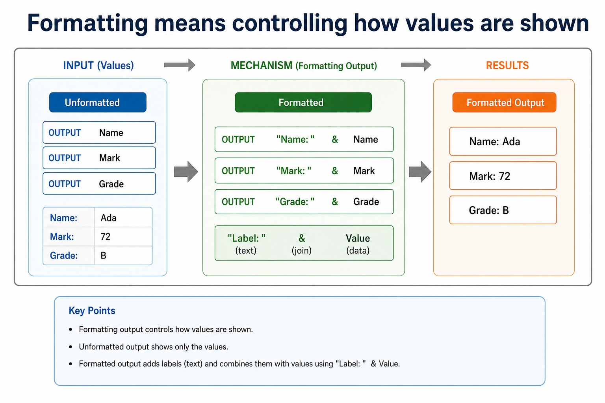

Text transcript

- Formatting output
- Unformatted
- OUTPUT Name
- OUTPUT Mark
- OUTPUT Grade
- Formatted
- OUTPUT "Name: " & Name
- OUTPUT "Mark: " & Mark

#### INPUT reads data and stores it in a variable

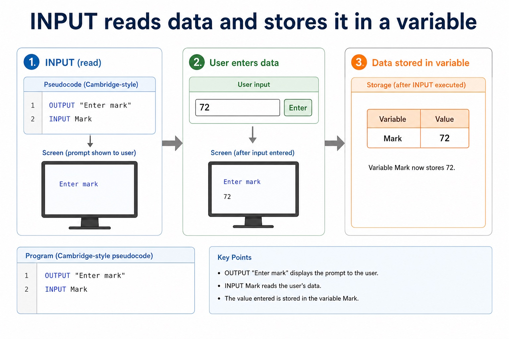

Text transcript

- Cambridge-style pseudocode
- OUTPUT "Enter mark"
- INPUT Mark
- Prompt screen shows Enter mark
- Input user enters a value such as 72
- Storage Mark now stores 72

#### A good prompt tells the user what to enter and the expected format

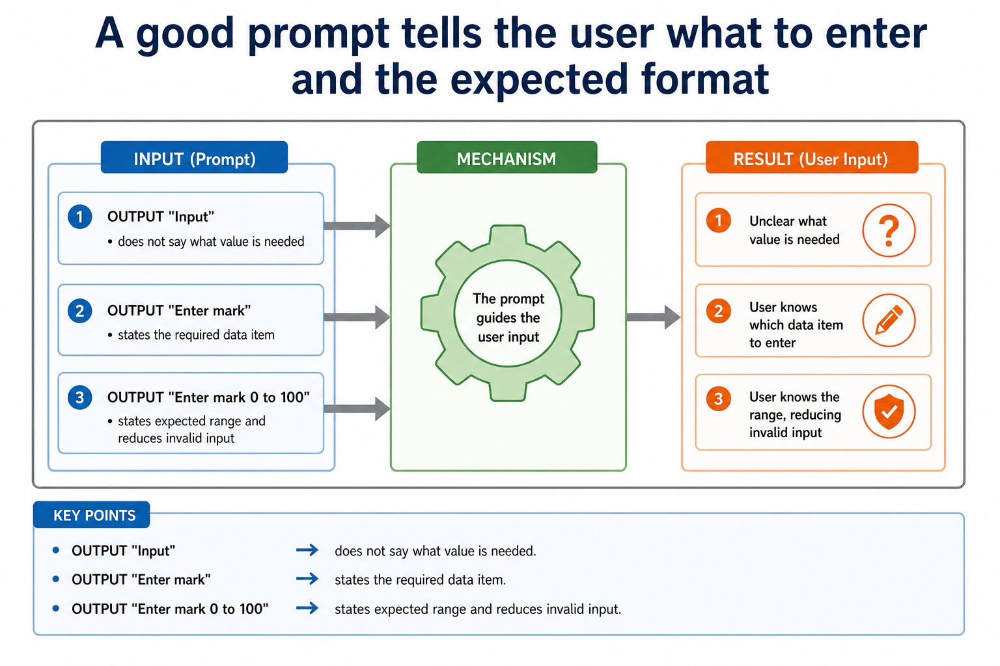

Text transcript

- OUTPUT "Input"
- does not say what value is needed
- OUTPUT "Enter mark"
- states the required data item
- OUTPUT "Enter mark 0 to 100"
- states expected range and reduces invalid input

#### Formatted output can make repeated records readable

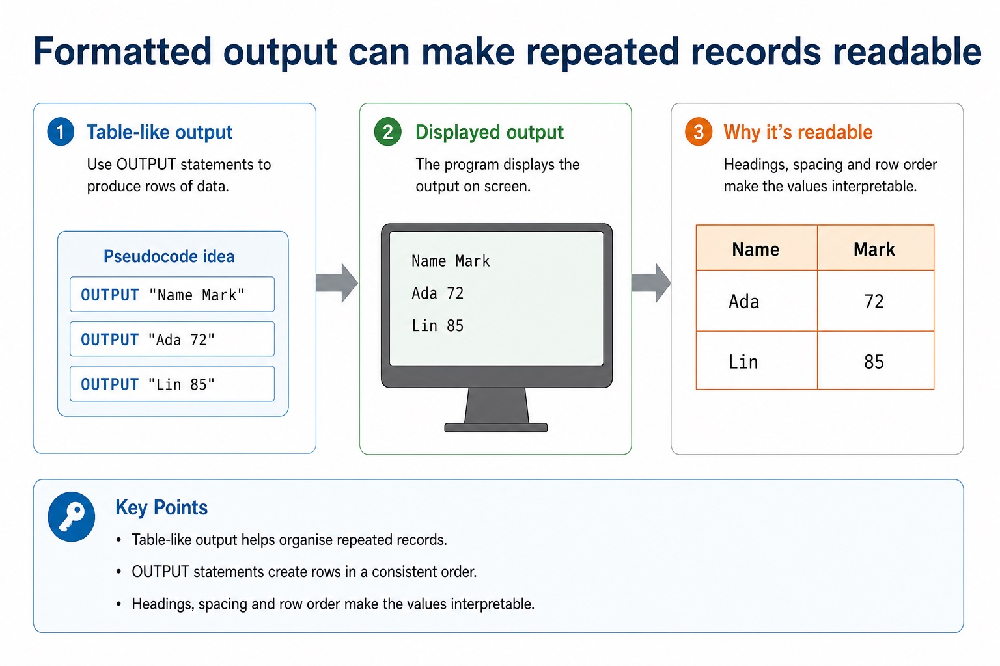

Text transcript

- Table-like output
- Pseudocode idea
- OUTPUT "Name Mark"
- OUTPUT "Ada 72"
- OUTPUT "Lin 85"
- Displayed output
- Name Mark
- Headings, spacing and row order make the values interpretable.

#### Input data must be used with the correct data type

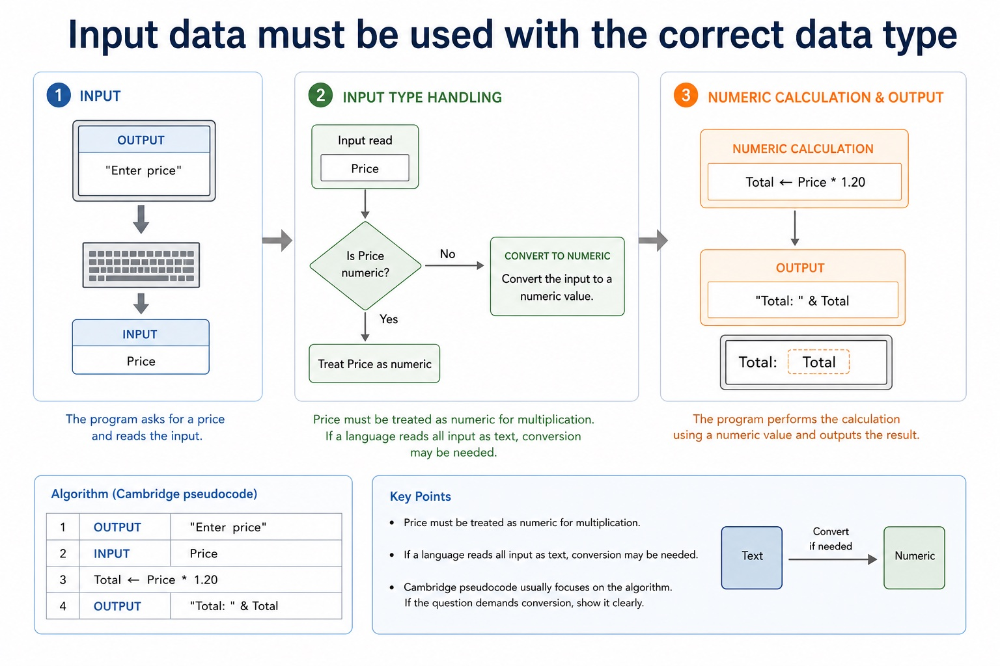

Text transcript

- Input type handling
- Numeric calculation
- OUTPUT "Enter price"
- INPUT Price
- Total <- Price 1.20
- OUTPUT "Total: " & Total
- Reasoning
- Price must be treated as numeric for multiplication. If a language reads all input as text, conversion may be needed.

Open precise terminology and exam facts

- Write pseudocode for declaration and initialisation of constants; declaration of variables; assignment of values; expressions using arithmetic or logical operators; input from the keyboard; and output to the console.
- CONSTANT defines and initialises a fixed named value. DECLARE gives a variable a name and data type. Assignment evaluates the expression on the right of <- and stores the result in the variable on the left. INPUT obtains a value from the keyboard; OUTPUT sends a value to the console.
- Arithmetic expressions use operators such as +, -, , /, DIV and MOD. Logical expressions combine comparisons with AND, OR or NOT and produce BOOLEAN results. Use = for comparison and <- for assignment.
- For declarations, assignment and input/output, identify the required concept before describing its mechanism or consequence.

### Worked example

1. Declare, input, calculate and output
2. CONSTANT PassMark = 50 defines and initialises a constant.
3. INTEGER and DECLARE Passed
4. BOOLEAN declare variables.
5. INPUT Mark obtains keyboard input; Passed <- Mark = PassMark assigns the result of a logical expression; OUTPUT Mark 2 and OUTPUT Passed send arithmetic and Boolean results to the console.

Beyond syllabus / 延伸知识（不要求背诵）: consistent style, modularity and automated tests reduce maintenance errors in larger programs.
## 3. Practice by question type

### Question 1 - foundation - write - 5 marks

Write Cambridge pseudocode that defines and initialises constant TaxRate as 0.20, declares Price and Tax as REAL, inputs Price, assigns Price TaxRate to Tax, and outputs Tax.

**Answer:** CONSTANT TaxRate = 0.20; declares Price and Tax as REAL; INPUT Price before the calculation; Tax <- Price TaxRate; OUTPUT Tax after assignment

**Marking guidance:** Do not use = for assignment, omit the constant initial value, or replace INPUT/OUTPUT with Java library calls.

**Common error:** For the command word write, perform that exact action; do not replace it with an unrelated fact.

### Question 2 - application - apply - 2 marks

Which statement obtains keyboard input?

**Answer:** INPUT followed by the target variable.

**Marking guidance:** Award one mark for each distinct, technically accurate point or method step.

**Common error:** Do not repeat the same point in different words; each mark needs a separate idea or method step.

### Question 3 - transfer - explain - 3 marks

Explain how declarations, assignment and input/output would be applied in a suitable computing context.

**Answer:** CONSTANT defines and initialises a fixed named value. DECLARE gives a variable a name and data type. Assignment evaluates the expression on the right of <- and stores the result in the variable on the left. INPUT obtains a value from the keyboard; OUTPUT sends a value to the console. Arithmetic expressions use operators such as +, -, , /, DIV and MOD. Logical expressions combine comparisons with AND, OR or NOT and produce BOOLEAN results. Use = for comparison and <- for assignment. For declarations, assignment and input/output, identify the required concept before describing its mechanism or consequence.

**Marking guidance:** Each mark needs a relevant point linked to the stated context.

**Common error:** Do not copy the worked example unchanged; transfer the method and check it against the new context.

### Related past-paper indexes

| Reference | Marks | Command word | Question type |
|---|---:|---|---|
| 9618/22/S/25 Q3 | 8 | write | write |
| 9618/22/S/25 Q4 | 6 | complete | recall |
| 9618/21/S/25 Q1(b) | 5 | complete | calculate |
| 9618/23/S/25 Q1(i) | 2 | state | recall |

These are indexes only. Cambridge question and mark-scheme wording is not reproduced.

## 4. Summary and exam reminders

### Summary

- Define declarations, assignment and input/output with the exact technical vocabulary expected by the syllabus.
- Use the lesson method on a fresh context and show the intermediate decision, representation or calculation.
- Match the shape of the answer to the command word and the available marks.
- Check the final answer against the scenario instead of repeating a memorised sentence.

### Common error to correct

Students often think working Java automatically means good pseudocode. Correction: Paper 2 rewards clear Cambridge-style algorithm expression.

### Exam technique

- Follow the command word: state gives a fact; explain links a cause to a consequence; compare covers both sides.
- Match the number of independent points or method steps to the available marks.
- For declarations, assignment and input/output, use the exact technical term before applying it to the scenario.
