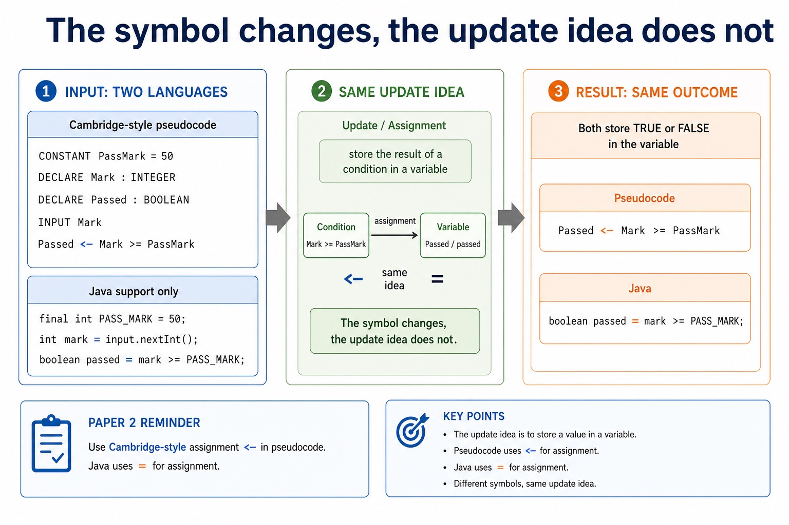

# Lesson 070: Declarations, assignment and input/output

**Course:** Cambridge International AS Level Computer Science 9618, 2027-2029 Version 2 
**Paper:** Paper 2 
**Syllabus:** Section 11: Programming 
**Syllabus requirements:** S11.02 
**Pacing:** Flexible. This lesson is deliberately over-complete; select a quick, full or deep route for the learners in front of you.

## Teaching-depth menu

- **Quick route:** Use the diagnostic, learning objectives, first worked example and foundation question. Stop once the learner can explain the central distinction accurately.
- **Full route:** Teach every core explanation point, the worked example and all lesson questions. Use the visual only when it adds a different representation.
- **Deep route:** Add the prerequisite refresher, ask learners to connect the concept checklist, discuss the labelled extension and complete a transfer question without a model answer.

## 1. Prerequisite knowledge and quick diagnostic

Recall S10.01, S9.06 before starting this lesson.

Ask the learner to give one accurate definition or method step before continuing. If they cannot, briefly revisit the named prerequisite rather than repeating the whole previous lesson.

### Optional prerequisite refresher

- Select and use appropriate types for a problem solution. The Version 2 Notes name integer, real, char, string, Boolean and date, and require the Cambridge pseudocode type names INTEGER, REAL, CHAR, STRING, BOOLEAN, DATE, ARRAY and FILE.
- Understand integer, real, char, string, Boolean and date types and Cambridge pseudocode type names.
- The three basic algorithm constructs are sequence, selection and iteration (repetition); students must recognise and use each construct, including combinations of constructs.
- Understand and use sequence, selection and iteration.

## 2. Knowledge explanation

### Learning objectives

- Use declarations, constants, variables, assignment, arithmetic/logical operations and input/output.

### Concept checklist for teacher choice

- declaration / declarations
- constants
- variables
- assignment
- arithmetic
- logical
- input
- output

### Detailed explanation

- Write pseudocode for declaration and initialisation of constants; declaration of variables; assignment of values; expressions using arithmetic or logical operators; input from the keyboard; and output to the console.
- CONSTANT defines and initialises a fixed named value. DECLARE gives a variable a name and data type. Assignment evaluates the expression on the right of <- and stores the result in the variable on the left. INPUT obtains a value from the keyboard; OUTPUT sends a value to the console.
- Arithmetic expressions use operators such as +, -, , /, DIV and MOD. Logical expressions combine comparisons with AND, OR or NOT and produce BOOLEAN results. Use = for comparison and <- for assignment.
- For declarations, assignment and input/output, identify the required concept before describing its mechanism or consequence.

### Worked example

Declare, input, calculate and output: CONSTANT PassMark = 50 defines and initialises a constant. DECLARE Mark : INTEGER and DECLARE Passed : BOOLEAN declare variables. INPUT Mark obtains keyboard input; Passed <- Mark = PassMark assigns the result of a logical expression; OUTPUT Mark 2 and OUTPUT Passed send arithmetic and Boolean results to the console.

Beyond syllabus / 延伸知识（不要求背诵）: consistent style, modularity and automated tests reduce maintenance errors in larger programs.

### Retained visual explanation

_The symbol changes, the update idea does not. The image and mobile text alternative come from one maintained fact source._

## 3. Practice by question type

### Question 1 - foundation - write - 5 marks

Write Cambridge pseudocode that defines and initialises constant TaxRate as 0.20, declares Price and Tax as REAL, inputs Price, assigns Price TaxRate to Tax, and outputs Tax.

**Answer:** CONSTANT TaxRate = 0.20; declares Price and Tax as REAL; INPUT Price before the calculation; Tax <- Price TaxRate; OUTPUT Tax after assignment

**Marking guidance:** Do not use = for assignment, omit the constant initial value, or replace INPUT/OUTPUT with Java library calls.

**Common error:** For the command word write, perform that exact action; do not replace it with an unrelated fact.

### Question 2 - application - apply - 2 marks

Which statement obtains keyboard input?

**Answer:** INPUT followed by the target variable.

**Marking guidance:** Award one mark for each distinct, technically accurate point or method step.

**Common error:** Do not repeat the same point in different words; each mark needs a separate idea or method step.

### Question 3 - transfer - explain - 3 marks

Explain how declarations, assignment and input/output would be applied in a suitable computing context.

**Answer:** CONSTANT defines and initialises a fixed named value. DECLARE gives a variable a name and data type. Assignment evaluates the expression on the right of <- and stores the result in the variable on the left. INPUT obtains a value from the keyboard; OUTPUT sends a value to the console. Arithmetic expressions use operators such as +, -, , /, DIV and MOD. Logical expressions combine comparisons with AND, OR or NOT and produce BOOLEAN results. Use = for comparison and <- for assignment. For declarations, assignment and input/output, identify the required concept before describing its mechanism or consequence.

**Marking guidance:** Each mark needs a relevant point linked to the stated context.

**Common error:** Do not copy the worked example unchanged; transfer the method and check it against the new context.

### Related past-paper indexes

| Reference | Marks | Command word | Question type |
|---|---:|---|---|
| 9618/22/S/25 Q3 | 8 | write | write |
| 9618/22/S/25 Q4 | 6 | complete | recall |
| 9618/21/S/25 Q1(b) | 5 | complete | calculate |
| 9618/23/S/25 Q1(i) | 2 | state | recall |

These are indexes only. Cambridge question and mark-scheme wording is not reproduced.

## 4. Summary and exam reminders

### Summary

- Define declarations, assignment and input/output with the exact technical vocabulary expected by the syllabus.
- Use the lesson method on a fresh context and show the intermediate decision, representation or calculation.
- Match the shape of the answer to the command word and the available marks.
- Check the final answer against the scenario instead of repeating a memorised sentence.

### Common error to correct

Students often think working Java automatically means good pseudocode. Correction: Paper 2 rewards clear Cambridge-style algorithm expression.

### Exam technique

- Follow the command word: state gives a fact; explain links a cause to a consequence; compare covers both sides.
- Match the number of independent points or method steps to the available marks.
- For declarations, assignment and input/output, use the exact technical term before applying it to the scenario.
