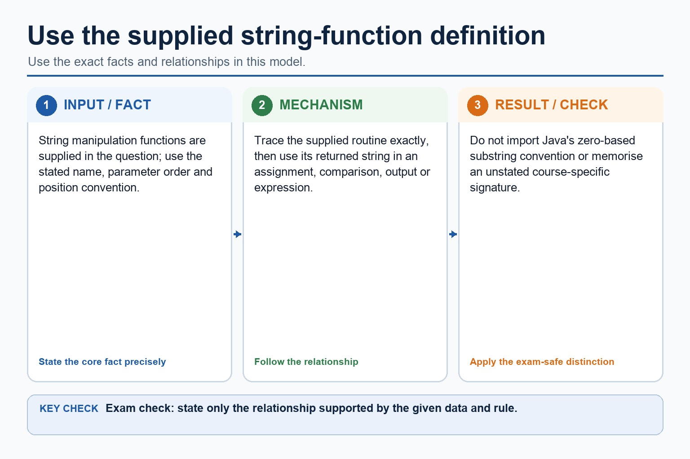

# Lesson 072: Built-in routines and string functions

**Course:** Cambridge International AS Level Computer Science 9618, 2027-2029 Version 2 
**Paper:** Paper 2 
**Syllabus:** Section 11: Programming 
**Syllabus requirements:** S11.03 
**Pacing:** Flexible. This lesson is deliberately over-complete; select a quick, full or deep route for the learners in front of you.

## Teaching-depth menu

- **Quick route:** Use the diagnostic, learning objectives, first worked example and foundation question. Stop once the learner can explain the central distinction accurately.
- **Full route:** Teach every core explanation point, the worked example and all lesson questions. Use the visual only when it adds a different representation.
- **Deep route:** Add the prerequisite refresher, ask learners to connect the concept checklist, discuss the labelled extension and complete a transfer question without a model answer.

## 1. Prerequisite knowledge and quick diagnostic

Recall the main conclusion from Lesson 071: Arithmetic and logical expressions.

Ask the learner to give one accurate definition or method step before continuing. If they cannot, briefly revisit the named prerequisite rather than repeating the whole previous lesson.

## 2. Knowledge explanation

### Learning objectives

- Use built-in/library and string functions.

### Concept checklist for teacher choice

- built-in / library
- string
- functions

### Detailed explanation

- Use built-in functions and library routines. Any function not given in the pseudocode guide will be provided; string manipulation functions will always be given in the question.
- Read the supplied function name, parameter order, position convention and returned type before using it. LENGTH is a familiar built-in example; LEFT, RIGHT, MID or SUBSTRING examples in this course illustrate a mechanism only when their definition and indexing convention are stated.
- A function call returns a value, so it can be assigned, compared, output or combined in an expression. Do not import Java's zero-based substring convention unless the question explicitly specifies it.
- For built-in routines and string functions, identify the required concept before describing its mechanism or consequence.

### Worked example

Apply a supplied string routine: A question supplies FUNCTION EXTRACT(Text : STRING, Start : INTEGER, Count : INTEGER) RETURNS STRING and states that positions start at 1. LENGTH("NETWORK") returns 7; EXTRACT("NETWORK", 4, 2) returns "WO". Code <- EXTRACT(Name, 1, 3) uses the supplied routine in an assignment without importing Java indexing.

Beyond syllabus / 延伸知识（不要求背诵）: consistent style, modularity and automated tests reduce maintenance errors in larger programs.

### Retained visual explanation

_Use the string-function definition supplied in the question. The image and mobile text alternative come from one maintained fact source._

## 3. Practice by question type

### Question 1 - foundation - apply - 2 marks

Will an unfamiliar string manipulation function be supplied?

**Answer:** Yes. The syllabus says string manipulation functions will always be given.

**Marking guidance:** Award one mark for each distinct, technically accurate point or method step.

**Common error:** For the command word apply, perform that exact action; do not replace it with an unrelated fact.

### Question 2 - application - state - 4 marks

A question supplies FUNCTION TAKE(Text : STRING, Start : INTEGER, Count : INTEGER) RETURNS STRING and FUNCTION TOUPPER(Text : STRING) RETURNS STRING, with positions starting at 1. State LENGTH("ALGORITHM"), state TAKE("ALGORITHM", 3, 4), and write an assignment that converts the extracted STRING to upper case.

**Answer:** LENGTH result is 9; TAKE result is GORI; uses the supplied Start/Count convention rather than Java indexing; assigns TOUPPER(TAKE("ALGORITHM", 3, 4)) or equivalent to a variable

**Marking guidance:** Do not use CHAR-only UCASE on a STRING, require memorisation of an unstated substring signature or import Java's zero-based indexes.

**Common error:** Do not repeat the same point in different words; each mark needs a separate idea or method step.

### Question 3 - transfer - apply - 2 marks

May a returned string be assigned to a variable?

**Answer:** Yes; a function return can be used wherever a compatible value is needed.

**Marking guidance:** Award one mark for each distinct, technically accurate point or method step.

**Common error:** Do not copy the worked example unchanged; transfer the method and check it against the new context.

### Related past-paper indexes

| Reference | Marks | Command word | Question type |
|---|---:|---|---|
| 9618/23/W/25 Q4 | 6 | complete | calculate |
| 9618/21/S/25 Q7(ii) | 4 | explain | explain |
| 9618/23/W/25 Q1(a) | 3 | design | recall |
| 9618/23/S/25 Q1(iii) | 2 | state | recall |

These are indexes only. Cambridge question and mark-scheme wording is not reproduced.

## 4. Summary and exam reminders

### Summary

- Define built-in routines and string functions with the exact technical vocabulary expected by the syllabus.
- Use the lesson method on a fresh context and show the intermediate decision, representation or calculation.
- Match the shape of the answer to the command word and the available marks.
- Check the final answer against the scenario instead of repeating a memorised sentence.

### Common error to correct

Students often think working Java automatically means good pseudocode. Correction: Paper 2 rewards clear Cambridge-style algorithm expression.

### Exam technique

- Follow the command word: state gives a fact; explain links a cause to a consequence; compare covers both sides.
- Match the number of independent points or method steps to the available marks.
- For built-in routines and string functions, use the exact technical term before applying it to the scenario.
