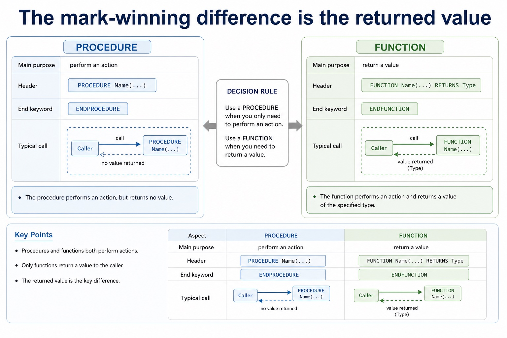

# Lesson 076: Selecting and justifying a loop structure

**Course:** Cambridge International AS Level Computer Science 9618, syllabus for examination in 2027-2029 
**Paper:** Paper 2 
**Syllabus:** Section 11: Programming 
**Syllabus requirements:** S11.05 
**Pacing:** Flexible. Select a quick, full or deep route for the learners in front of you.

## Teaching-depth menu

- **Quick route:** Use the diagnostic, learning objectives, first worked example and foundation question. Stop once the learner can explain the central distinction accurately.
- **Full route:** Teach every knowledge-point material set, the worked method and all lesson questions.
- **Deep route:** Add the prerequisite refresher, ask learners to connect the concept checklist, discuss the labelled extension and complete a transfer question without a model answer.

## 1. Prerequisite knowledge and quick diagnostic

Recall S11.04 before starting this lesson.

Ask the learner to give one accurate definition or method step before continuing. If they cannot, briefly revisit the named prerequisite rather than repeating the whole previous lesson.

### Optional prerequisite refresher

- Use IF statements, including the ELSE clause and nested IF statements; CASE statements; count-controlled loops; post-condition loops; and pre-condition loops.

## 2. Knowledge explanation

### 1. A suitable loop structure (S11.05)

**Concept relationships**

- **FOR:** Known repetition count
- **WHILE:** Test before the body
- **REPEAT:** Test after the body
- **Justification:** Connect loop behaviour to problem
- **loop:** Justify why one loop structure may be better…
- **structure:** A suitable loop structure.

**Mechanism**

1. **Translate the stated design** — Justify why one loop structure may be better suited to a problem than another.
2. **Apply one complete operation** — A suitable loop structure.
3. **Trace state and boundaries** — The loop structure from the problem

**The difference is when the condition is tested:** WHILE vs REPEAT REPEAT...UNTIL

#### The difference is when the condition is tested

Text transcript

- WHILE vs REPEAT
- REPEAT...UNTIL
- Condition checked
- before the loop body
- after the loop body
- Minimum iterations
- Continues when
- condition is TRUE
- UNTIL condition becomes TRUE
- Typical use
- read while not EOF, repeat while invalid
- input validation where input must be requested once

Precise syllabus wording

Select and justify a suitable loop structure.

Justify why one loop structure may be better suited to a problem than another.

Open precise terminology and exam facts

- Justify why one loop structure may be better suited to a problem than another.
- A count-controlled loop uses FOR...TO...NEXT when the repetition count or inclusive counter range is known before the loop starts. The counter, start value and end value define the iterations; NEXT closes the loop.
- Match the loop bounds to the declared data. Initialise accumulators before the loop, update them inside it and output a final result after the loop unless intermediate output is explicitly required.
- Justify FOR from the problem: it is well suited when the count or bounds are known, but a pre-condition or post-condition loop is better when the number of repetitions depends on input or a stopping condition.
- A WHILE...ENDWHILE loop is a pre-condition loop: it tests before the body and may run zero times. A REPEAT...UNTIL loop is a post-condition loop: it executes the body before testing and therefore runs at least once. A FOR...NEXT loop is count-controlled.
- Select and justify the loop structure from the problem: use FOR when the count is known, WHILE when execution may be unnecessary and continuation is tested first, and REPEAT when the body must run once before a stopping condition can be tested. The justification must use the scenario, not only say that one loop is easier.

### Worked method

1. Nested IF and CASE
2. Total a fixed array
3. Choose the loop from the stopping rule
4. For a grade, an outer IF tests Mark = 80; its ELSE contains an inner IF testing Mark = 50; each IF closes with ENDIF.
5. For a menu, CASE Choice OF maps 1, 2 and 3 to actions and OTHERWISE handles every unlisted value before ENDCASE.

Beyond syllabus / 延伸知识（不要求背诵）: consistent style, modularity and automated tests reduce maintenance errors in larger programs.
## 3. Practice by question type

### Question 1 - foundation - apply - 2 marks

What handles an unlisted CASE value?

**Answer:** OTHERWISE, followed by ENDCASE for the complete structure.

**Marking guidance:** Award one mark for each distinct, technically accurate point or method step.

**Common error:** For the command word apply, perform that exact action; do not replace it with an unrelated fact.

### Question 2 - application - explain - 2 marks

Why is FOR suitable for Marks[1:30]?

**Answer:** The 30 iterations and valid index bounds are known before the loop starts.

**Marking guidance:** Award one mark for each distinct, technically accurate point or method step.

**Common error:** Do not repeat the same point in different words; each mark needs a separate idea or method step.

### Question 3 - transfer - write - 8 marks

Write Cambridge pseudocode that inputs Age and Member, outputs Adult member when Age is at least 18 and Member is TRUE, Adult non-member for other adults, and Child otherwise. Then state why nested IF is appropriate. Write Cambridge pseudocode to input and total exactly 12 monthly values, then output the total. Explain why the selected loop is count-controlled. Suggest and justify FOR, WHILE or REPEAT...UNTIL for (a) processing 50 array elements, (b) reading while a file is not at EOF, and (c) requesting a password at least once until correct.

**Answer:** inputs/uses both Age and Member; outer IF tests Age = 18; inner IF tests Member only on the adult path; three outputs are attached to the correct branches; closes both IF statements coherently; justifies nested selection because the membership decision depends on the age decision; initialises Total before repetition; uses FOR Month <- 1 TO 12 or an equivalent twelve-iteration range; inputs a value and adds it inside the loop; closes with NEXT and outputs Total after the loop; justifies FOR because the repetition count is known in advance; FOR for 50 known elements; justifies fixed count/bounds; WHILE for the pre-tested EOF condition and possible empty file; REPEAT...UNTIL for password input that must occur once; distinguishes pre-condition, post-condition and count-controlled structures

**Marking guidance:** Do not use CASE for overlapping ranges without a complete mapping or close two IF statements with only one ENDIF. Do not use an eleven- or thirteen-iteration bound or reset the accumulator inside the loop. Do not select a loop only by its spelling or claim that WHILE always executes once.

**Common error:** Do not copy the worked example unchanged; transfer the method and check it against the new context.

### Related past-paper indexes

| Reference | Marks | Command word | Question type |
|---|---:|---|---|
| 9618/22/W/23 Q2(b) | 2 | draw | diagram |

These are indexes only. Cambridge question and mark-scheme wording is not reproduced.

## 4. Summary and exam reminders

### Summary

- Define selecting and justifying a loop structure with the exact technical vocabulary expected by the syllabus.
- Use the lesson method on a fresh context and show the intermediate decision, representation or calculation.
- Match the shape of the answer to the command word and the available marks.
- Check the final answer against the scenario instead of repeating a memorised sentence.

### Common error to correct

Students often think working Java automatically means good pseudocode. Correction: Paper 2 rewards clear Cambridge-style algorithm expression.

### Exam technique

- Follow the command word: state gives a fact; explain links a cause to a consequence; compare covers both sides.
- Match the number of independent points or method steps to the available marks.
- For selecting and justifying a loop structure, use the exact technical term before applying it to the scenario.
