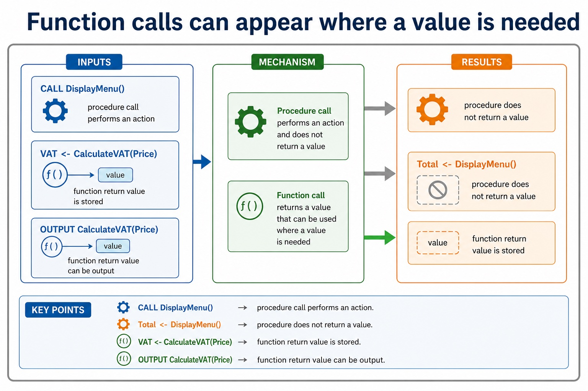
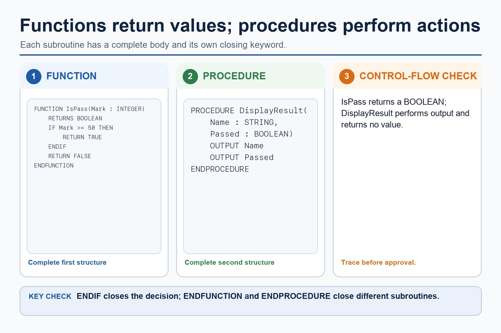
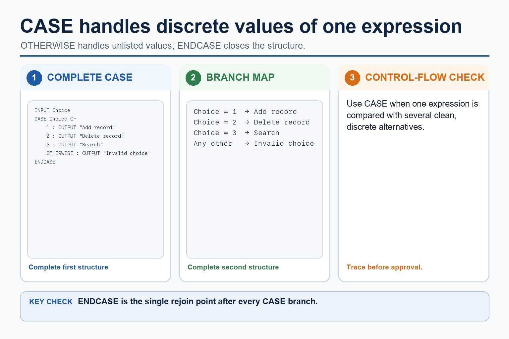
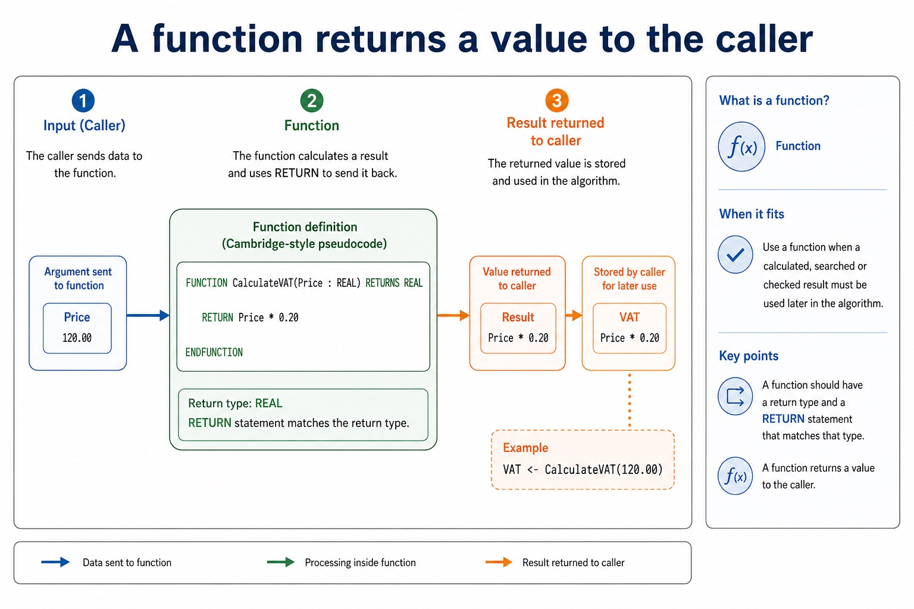
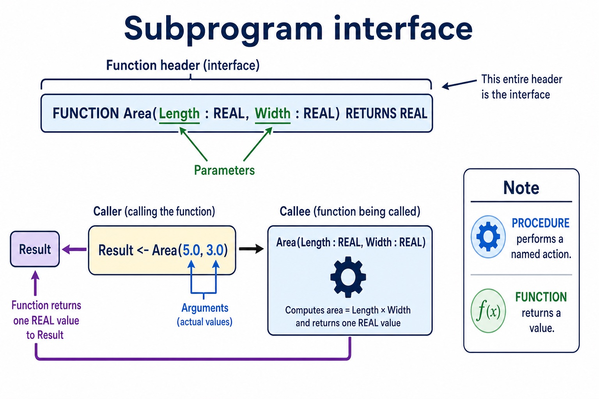
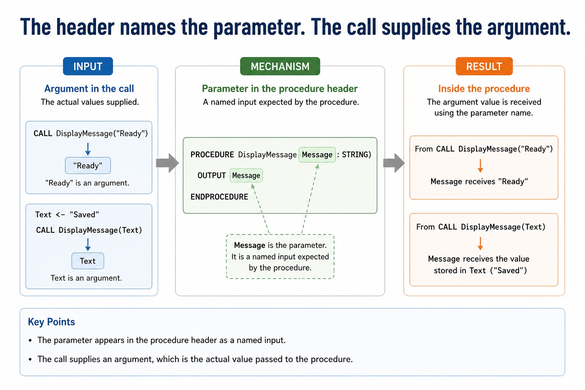
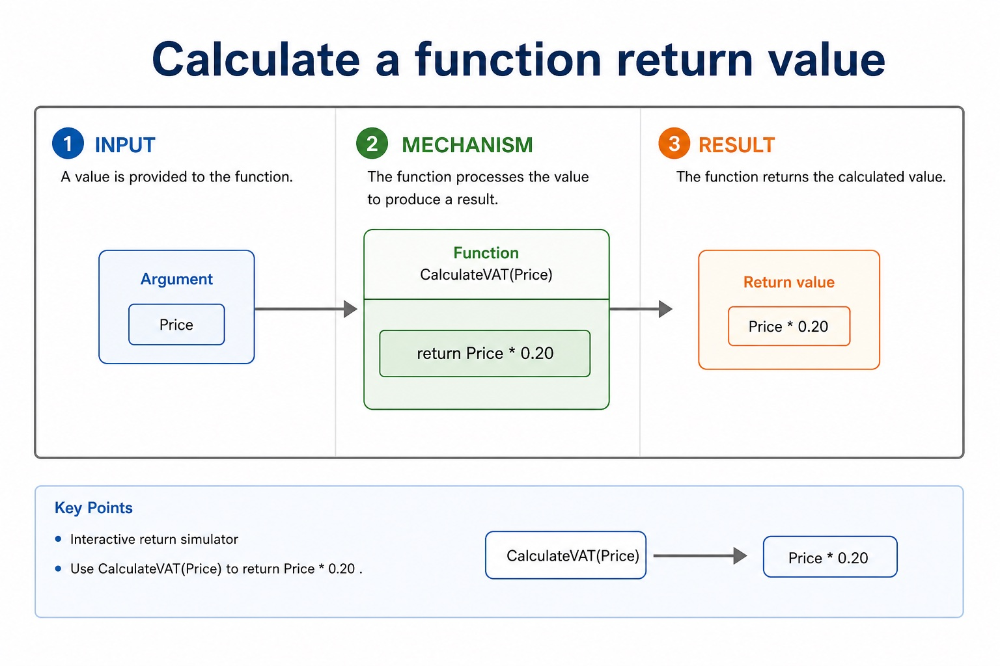
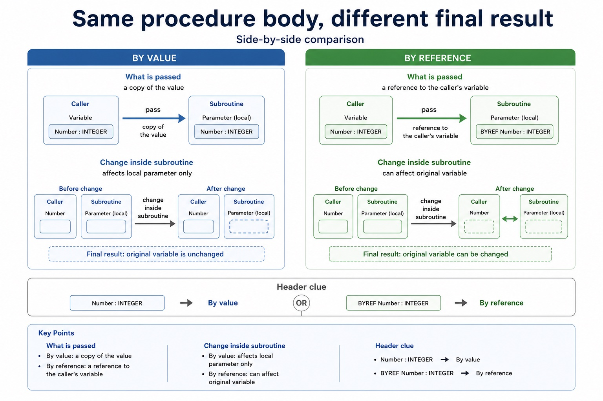
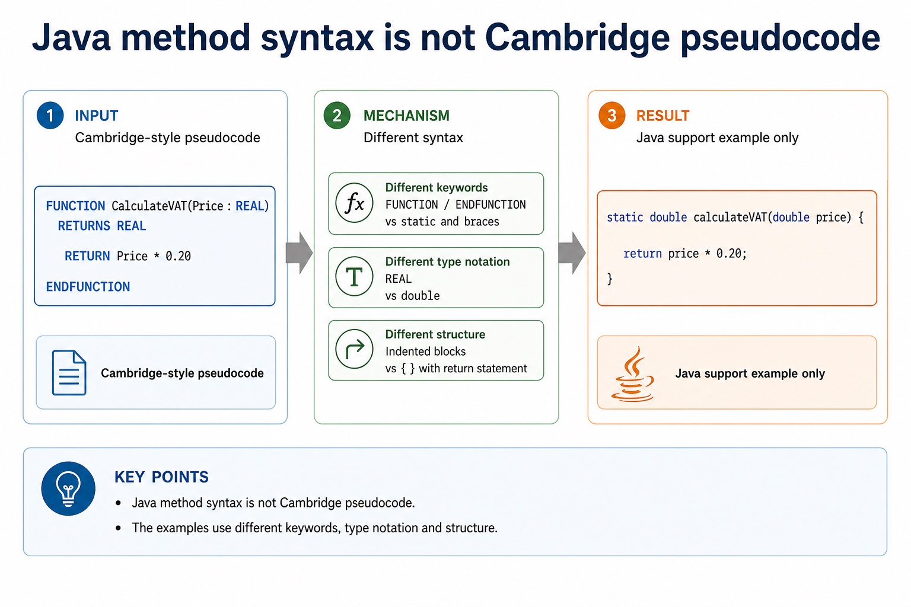
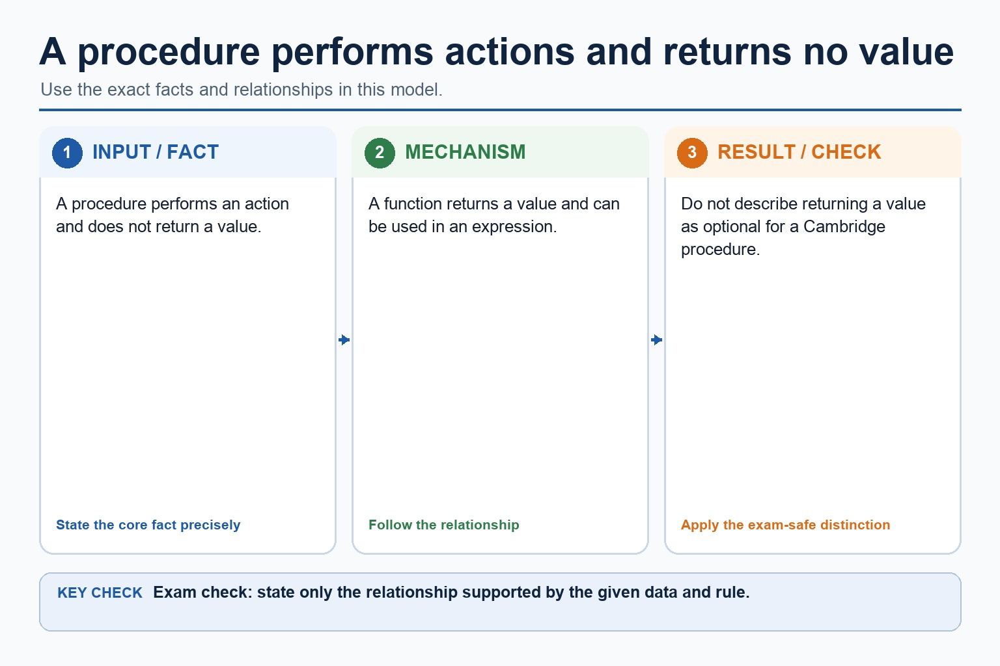

# Lesson 078: Functions, interfaces and return values

**Course:** Cambridge International AS Level Computer Science 9618, 2027-2029 Version 2 
**Paper:** Paper 2 
**Syllabus:** Section 11: Programming 
**Syllabus requirements:** S11.07, S11.08 
**Pacing:** Flexible. Select the material set and practice depth needed by the learner.

## Teaching-depth menu

- **Quick route:** Use the diagnostic, learning objectives, first worked example and foundation question. Stop once the learner can explain the central distinction accurately.
- **Full route:** Use every knowledge-point material set, the worked method, the terminology check and all questions.
- **Deep route:** Add the prerequisite refresher, ask learners to connect the concept checklist, discuss the labelled extension and complete a transfer question without a model answer.

## 1. Prerequisite knowledge and quick diagnostic

Recall S11.02, S11.06, S11.07 before starting this lesson.

Ask the learner to give one accurate definition or method step before continuing. If they cannot, briefly revisit the named prerequisite rather than repeating the whole previous lesson.

### Optional prerequisite refresher

- Write pseudocode for declaration and initialisation of constants; declaration of variables; assignment of values; expressions using arithmetic or logical operators; input from the keyboard; and output to the console.
- Use declarations, constants, variables, assignment, arithmetic/logical operations and input/output.
- Define and use a procedure; explain when the use of a procedure is appropriate; use parameters with none, one or more values passed by reference or by value.
- Understand and use procedures with parameters passed by reference and by value.
- Define and use a function; explain when the use of a function is appropriate. A function is used in an expression and its return value replaces the function call.
- Understand and use functions, including return values in expressions.

## 2. Knowledge explanation

### 1. Functions · Return · Values · Expression (S11.07)

**Concept map:** functions → return → values → expression

**Three-part explanation:**

1. A function is used in an expression and its return value replaces the function call
2. Define and use a function when the caller needs one returned value
3. RETURN sends a function value back to the caller

**Concrete cue:** Define and use a function; explain when the use of a function is appropriate. A function is used in an expression and its return value replaces the function call.

#### Function calls can appear where a value is needed

Text transcript

- Calls and returned values
- CALL DisplayMenu()
- procedure call performs an action
- VAT <- CalculateVAT(Price)
- function return value is stored
- Total <- DisplayMenu()
- procedure does not return a value
- OUTPUT CalculateVAT(Price)

#### Use functions for returned values and procedures for actions

Text transcript

- A function returns a value; a procedure performs an action.
- IsPass returns a BOOLEAN based on whether Mark is at least 50.
- Close the function's IF with ENDIF before ENDFUNCTION.
- DisplayResult outputs its parameters and returns no value.

#### Use CASE for clear values of one expression

Text transcript

- CASE compares one expression with several discrete values.
- Each listed value has its own action and OTHERWISE handles unlisted values.
- Close the complete multi-way selection with ENDCASE.

#### A function returns a value to the caller

Text transcript

- Function
- Cambridge-style pseudocode
- FUNCTION CalculateVAT(Price : REAL) RETURNS REAL
- RETURN Price 0.20
- ENDFUNCTION
- VAT <- CalculateVAT(120.00)
- When it fits
- Use a function when a calculated, searched or checked result must be used later in the algorithm.

Precise syllabus wording

Understand and use functions, including return values in expressions.

Define and use a function; explain when the use of a function is appropriate. A function is used in an expression and its return value replaces the function call.

### 2. Procedure header · Function header · Interface · Parameter (S11.08)

**Concept map:** procedure header → function header → interface → parameter → argument → return value

**Three-part explanation:**

1. Use the terminology procedure/function interface, header, parameter, argument and return value, and explain the relationship between these terms
2. A procedure header or function header names the subprogram and declares its parameters
3. The procedure/function interface is the information a caller needs to use the subprogram

**Concrete cue:** Use the terminology procedure/function interface, header, parameter, argument and return value, and explain the relationship between these terms.

#### A subprogram interface connects caller and header

Text transcript

- A subprogram interface gives the caller the name, parameter list and types, and any return value/type.
- A procedure header or function header declares that interface; a function header also declares its return type.
- A parameter is named in the header; an argument is the actual value or variable supplied at a call.
- RETURN sends a function value to the caller; displayed output is an effect, not a return value.

#### The header names the parameter. The call supplies the argument.

Text transcript

- Parameter and argument
- Parameter in the procedure header
- PROCEDURE DisplayMessage(Message : STRING)
- OUTPUT Message
- ENDPROCEDURE
- Message is the parameter. It is a named input expected by the procedure.
- Argument in the call
- CALL DisplayMessage("Ready")

#### Calculate a function return value

Text transcript

- Interactive return simulator
- Use CalculateVAT(Price) to return Price 0.20 .

#### Function calls can appear where a value is needed

Text transcript

- Calls and returned values
- CALL DisplayMenu()
- procedure call performs an action
- VAT <- CalculateVAT(Price)
- function return value is stored
- Total <- DisplayMenu()
- procedure does not return a value
- OUTPUT CalculateVAT(Price)

Precise syllabus wording

Use precise terminology: procedure/function header, interface, parameter, argument and return value.

Use the terminology procedure/function interface, header, parameter, argument and return value, and explain the relationship between these terms.

### Supporting diagram library

#### Same procedure body, different final result

Text transcript

- Side-by-side comparison
- By value
- By reference
- Header clue
- Number : INTEGER
- BYREF Number : INTEGER
- What is passed
- a copy of the value

#### The mark-winning difference is the returned value

Text transcript

- Procedure vs function
- Procedure
- Function
- Main purpose
- perform an action
- return a value
- PROCEDURE Name(...)
- FUNCTION Name(...) RETURNS Type

#### Java method syntax is not Cambridge pseudocode

Text transcript

- Java support only
- Cambridge-style pseudocode
- FUNCTION CalculateVAT(Price : REAL) RETURNS REAL
- RETURN Price 0.20
- ENDFUNCTION
- Java support example only
- static double calculateVAT(double price) {
- return price 0.20;

#### A procedure performs actions and returns no value

Text transcript

- A procedure performs an action and does not return a value.
- A function returns a value and can be used in an expression.
- Do not describe returning a value as optional for a Cambridge procedure.

Open precise terminology and exam facts

- Define and use a function; explain when the use of a function is appropriate. A function is used in an expression and its return value replaces the function call.
- Use the terminology procedure/function interface, header, parameter, argument and return value, and explain the relationship between these terms.
- Define and use a procedure when an algorithm needs a named action. A procedure may have no parameters, one parameter or several parameters. BYVAL passes a value that the procedure can use without changing the caller's variable; BYREF gives access to the caller's variable so an assignment can persist after the call.
- Define and use a function when the caller needs one returned value. A function has a return type and RETURN statement; the call can appear in an expression, for example Total <- Price + CalculateVAT(Price). Use procedures for actions and functions for calculated, searched or checked values.
- A procedure header or function header names the subprogram and declares its parameters; a function header also declares its return type. The procedure/function interface is the information a caller needs to use the subprogram: its name, parameter list and types, and any returned value/type.
- A parameter is the named variable in the header, while an argument is the actual value or variable supplied at a call. RETURN sends a function value back to the caller; output displayed by a procedure is an effect, not a return value.

### Worked example

1. Use a procedure and a function
2. PROCEDURE Increase(BYREF Number
3. INTEGER, BYVAL Amount
4. INTEGER) changes the caller's Number by Amount.
5. REAL) RETURNS REAL returns Price 0.20, so Total <- Price + CalculateVAT(Price) uses the returned value in an expression.
6. In Increase(Score, 5), Number and Amount are parameters while Score and 5 are arguments.

Beyond syllabus / 延伸知识（不要求背诵）: consistent style, modularity and automated tests reduce maintenance errors in larger programs.
## 3. Practice by question type

### Question 1 - foundation - apply - 2 marks

What is included in a subprogram interface?

**Answer:** Its name, parameters/types and any return value/type needed by a caller.

**Marking guidance:** Award one mark for each distinct, technically accurate point or method step.

**Common error:** For the command word apply, perform that exact action; do not replace it with an unrelated fact.

### Question 2 - application - apply - 2 marks

When is a procedure appropriate?

**Answer:** When the algorithm needs a named action rather than a returned value used in an expression.

**Marking guidance:** Award one mark for each distinct, technically accurate point or method step.

**Common error:** Do not repeat the same point in different words; each mark needs a separate idea or method step.

### Question 3 - transfer - explain - 3 marks

Explain how functions, interfaces and return values would be applied in a suitable computing context.

**Answer:** Use the terminology procedure/function interface, header, parameter, argument and return value, and explain the relationship between these terms. Define and use a procedure when an algorithm needs a named action. A procedure may have no parameters, one parameter or several parameters. BYVAL passes a value that the procedure can use without changing the caller's variable; BYREF gives access to the caller's variable so an assignment can persist after the call. Define and use a function when the caller needs one returned value. A function has a return type and RETURN statement; the call can appear in an expression, for example Total <- Price + CalculateVAT(Price). Use procedures for actions and functions for calculated, searched or checked values.

**Marking guidance:** Each mark needs a relevant point linked to the stated context.

**Common error:** Do not copy the worked example unchanged; transfer the method and check it against the new context.

### Related past-paper indexes

| Reference | Marks | Command word | Question type |
|---|---:|---|---|
| 9618/21/W/25 Q6(b) | 7 | calculate | calculate |
| 9618/23/W/25 Q6(b) | 7 | calculate | calculate |
| 9618/23/S/25 Q1(b) | 5 | complete | recall |
| 9618/21/S/25 Q2(c) | 4 | calculate | calculate |

These are indexes only. Cambridge question and mark-scheme wording is not reproduced.

## 4. Summary and exam reminders

### Summary

- Define functions, interfaces and return values with the exact technical vocabulary expected by the syllabus.
- Use the lesson method on a fresh context and show the intermediate decision, representation or calculation.
- Match the shape of the answer to the command word and the available marks.
- Check the final answer against the scenario instead of repeating a memorised sentence.

### Common error to correct

Students often think working Java automatically means good pseudocode. Correction: Paper 2 rewards clear Cambridge-style algorithm expression.

### Exam technique

- Follow the command word: state gives a fact; explain links a cause to a consequence; compare covers both sides.
- Match the number of independent points or method steps to the available marks.
- For functions, interfaces and return values, use the exact technical term before applying it to the scenario.
