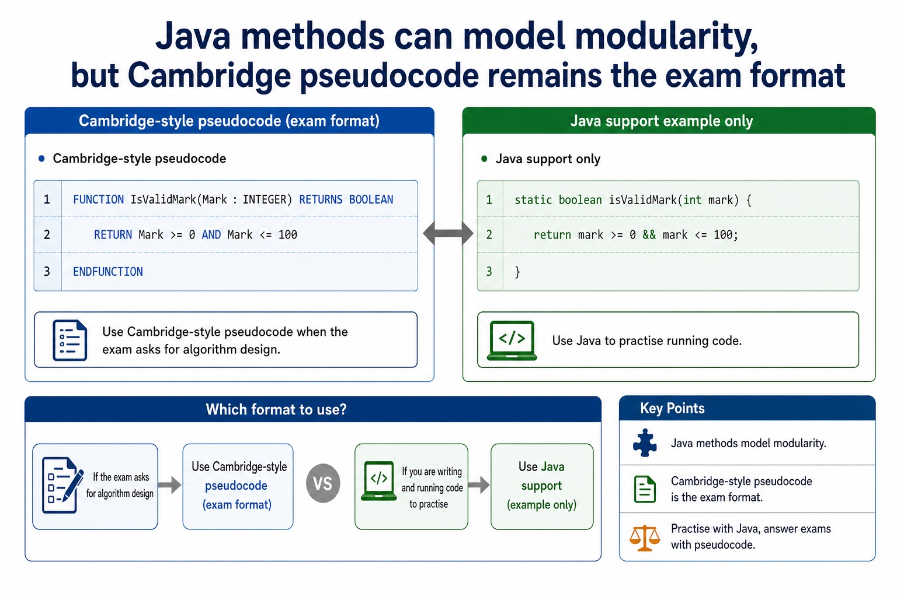
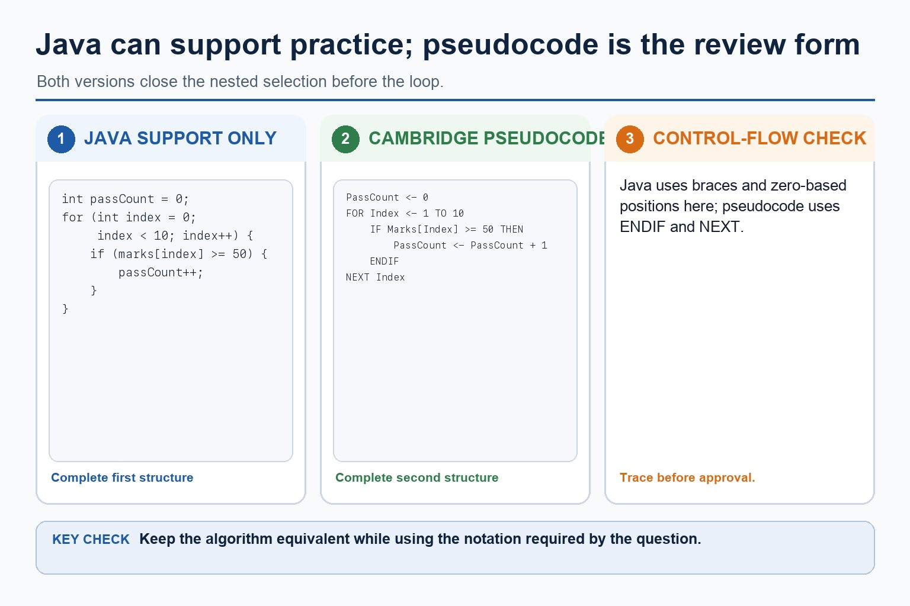
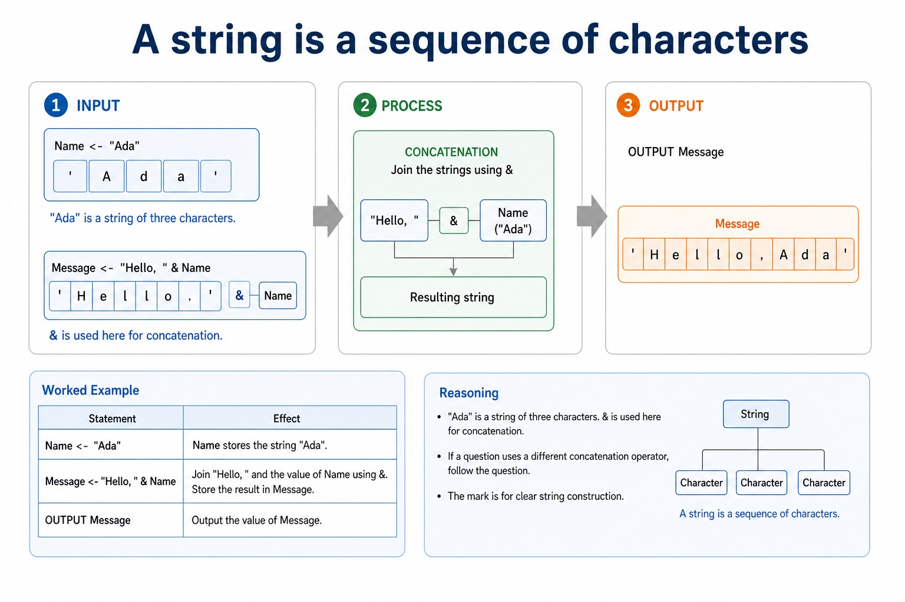
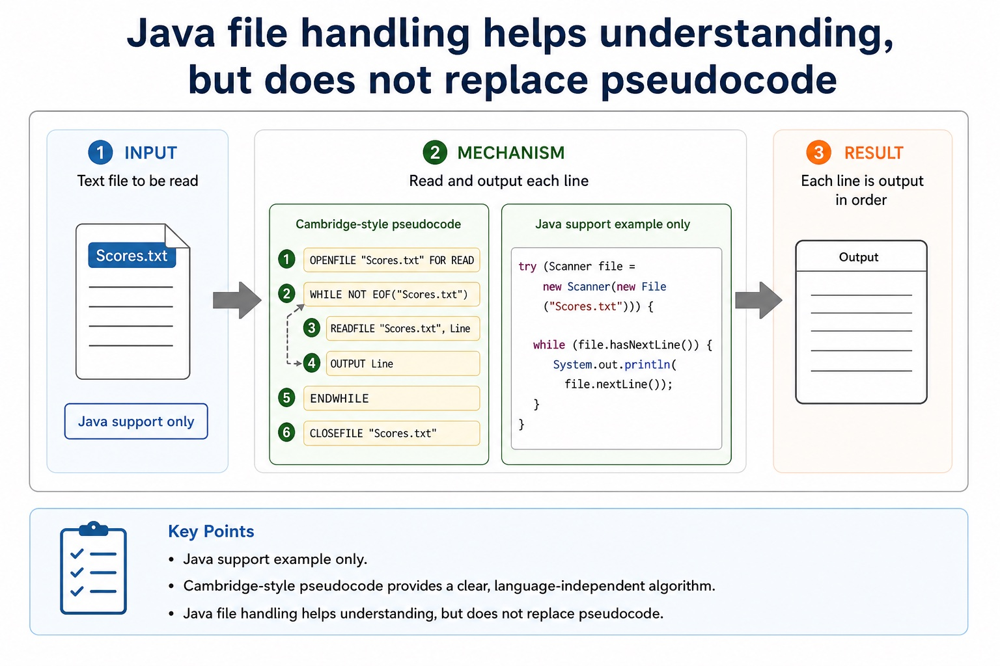
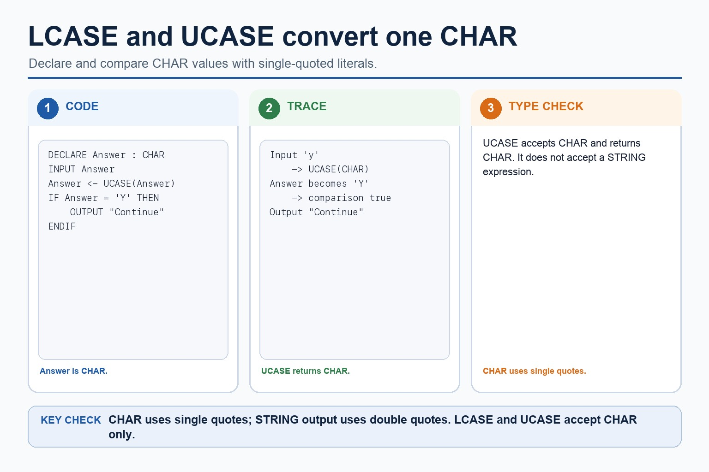
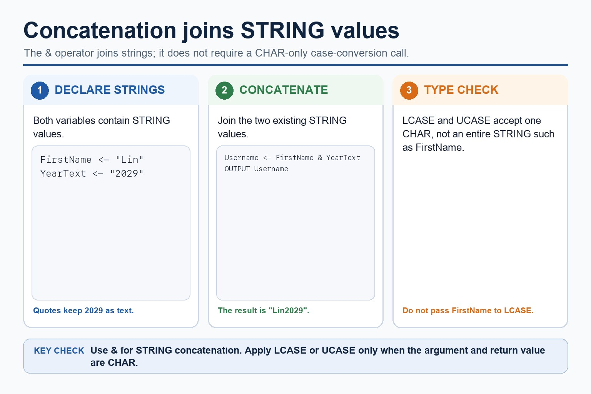
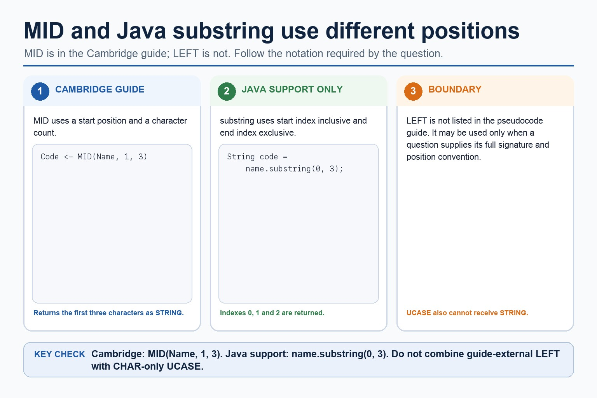
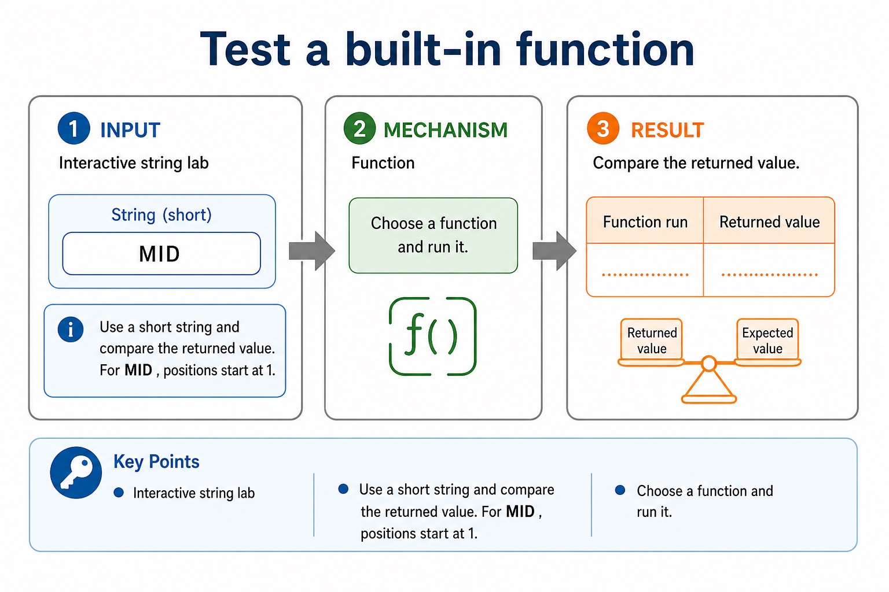
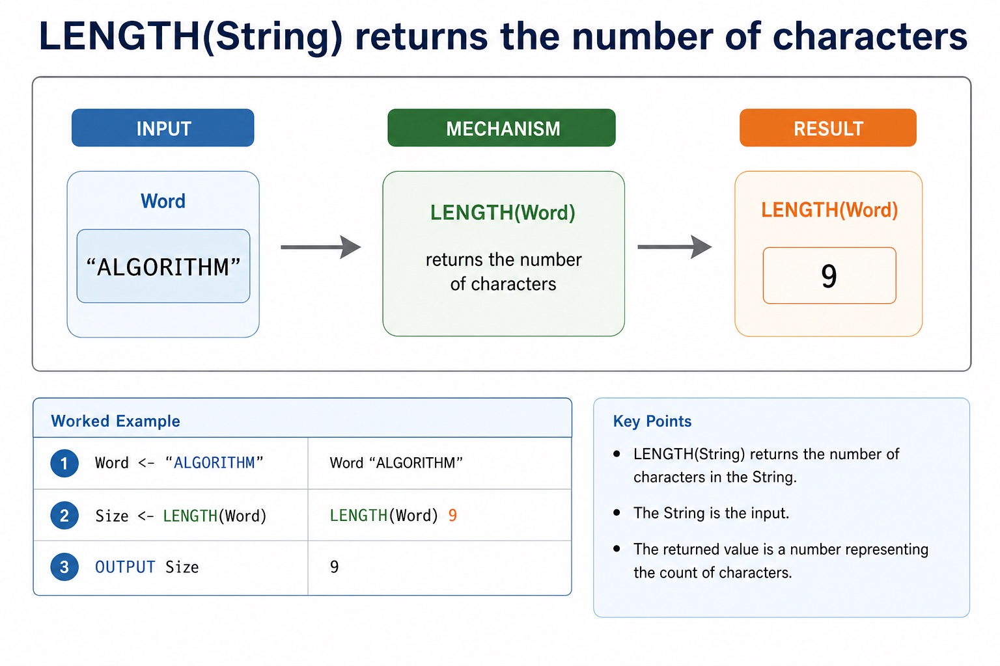
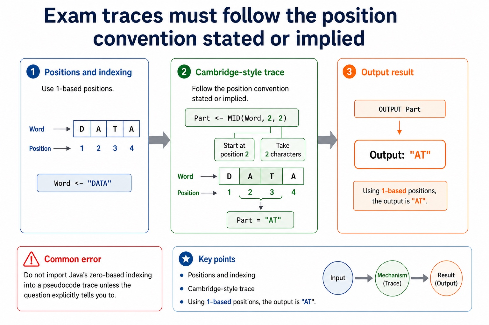

# Lesson 079: Clear and efficient Cambridge pseudocode

**Course:** Cambridge International AS Level Computer Science 9618, 2027-2029 Version 2 
**Paper:** Paper 2 
**Syllabus:** Section 11: Programming 
**Syllabus requirements:** S11.09 
**Pacing:** Flexible. Select the material set and practice depth needed by the learner.

## Teaching-depth menu

- **Quick route:** Use the diagnostic, learning objectives, first worked example and foundation question. Stop once the learner can explain the central distinction accurately.
- **Full route:** Use every knowledge-point material set, the worked method, the terminology check and all questions.
- **Deep route:** Add the prerequisite refresher, ask learners to connect the concept checklist, discuss the labelled extension and complete a transfer question without a model answer.

## 1. Prerequisite knowledge and quick diagnostic

Recall the main conclusion from Lesson 078: Functions, interfaces and return values.

Ask the learner to give one accurate definition or method step before continuing. If they cannot, briefly revisit the named prerequisite rather than repeating the whole previous lesson.

## 2. Knowledge explanation

### 1. Clear · Efficient · Cambridge · Pseudocode (S11.09)

**Concept map:** clear → efficient → Cambridge → pseudocode

**Three-part explanation:**

1. The Cambridge pseudocode remains clear because initialisation, loop bounds, selection and outputs are explicit
2. Clear Cambridge pseudocode uses meaningful identifiers, consistent indentation, complete Cambridge constructs and a traceable control path
3. Efficient pseudocode avoids unnecessary repeated work while preserving correctness

**Concrete cue:** Clear Cambridge pseudocode uses meaningful identifiers, consistent indentation, complete Cambridge constructs and a traceable control path. Efficient pseudocode avoids unnecessary repeated work while preserving correctness.

#### Java methods can model modularity, but Cambridge pseudocode remains the exam format

Text transcript

- Java support only
- Cambridge-style pseudocode
- FUNCTION IsValidMark(Mark : INTEGER) RETURNS BOOLEAN
- RETURN Mark = 0 AND Mark <= 100
- ENDFUNCTION
- Java support example only
- static boolean isValidMark(int mark) {
- return mark = 0 && mark <= 100;

#### Java can support practice; the review answer should be Cambridge pseudocode

Text transcript

- Java may support practice but the review answer uses Cambridge pseudocode.
- Increment PassCount only when the current mark is at least 50.
- Close the pseudocode selection with ENDIF before NEXT Index.
- Keep Java and pseudocode indexing conventions explicit.

#### A string is a sequence of characters

Text transcript

- Cambridge-style assignment
- Name <- "Ada"
- Message <- "Hello, " & Name
- OUTPUT Message
- Reasoning
- "Ada" is a string of three characters. & is used here for concatenation.
- If a question uses a different concatenation operator, follow the question. The mark is for clear string construction.

#### Java I/O syntax is not Cambridge pseudocode

Text transcript

- Java support only
- Cambridge-style pseudocode
- OUTPUT "Enter mark"
- INPUT Mark
- OUTPUT "Mark: " & Mark
- Java support example only
- Scanner input = new Scanner(System.in);
- System.out.print("Enter mark: ");

Precise syllabus wording

Write clear and efficient Cambridge pseudocode.

Write efficient pseudocode.

### Supporting diagram library

#### LCASE and UCASE convert one CHAR

Text transcript

- Declare Answer as CHAR, input one character and normalise it with UCASE before comparison.
- UCASE(Answer) returns CHAR, so compare the result with the CHAR literal 'Y'.
- Close the selection with ENDIF.
- LCASE and UCASE accept CHAR, not STRING; case conversion does not remove spaces or correct spelling.

#### Concatenation joins STRING values

Text transcript

- Concatenation joins STRING values with the & operator.
- FirstName is "Lin" and YearText is "2029"; Username <- FirstName & YearText returns "Lin2029".
- Do not pass the STRING FirstName to LCASE; that function accepts CHAR.

#### MID and Java substring use different positions

Text transcript

- Cambridge guide example: MID(Name, 1, 3) returns the first three characters as a STRING.
- Java support example: name.substring(0, 3) uses start index 0 inclusive and end index 3 exclusive.
- LEFT is not listed in the Cambridge pseudocode guide; a question may use it only when the signature and position convention are supplied.
- Do not add UCASE around a STRING expression because UCASE accepts CHAR.

#### Test a built-in function

Text transcript

- Interactive string lab
- Use a short string and compare the returned value. For MID , positions start at 1.
- Function
- Choose a function and run it.

#### LENGTH(String) returns the number of characters

Text transcript

- Word <- "ALGORITHM"
- Size <- LENGTH(Word)
- OUTPUT Size
- Word "ALGORITHM"
- LENGTH(Word) 9

#### Exam traces must follow the position convention stated or implied

Text transcript

- Positions and indexing
- Cambridge-style trace
- Word <- "DATA"
- Part <- MID(Word, 2, 2)
- OUTPUT Part
- Using 1-based positions, the output is "AT" .
- Common error
- Do not import Java's zero-based indexing into a pseudocode trace unless the question explicitly tells you to.

Open precise terminology and exam facts

- Write efficient pseudocode.
- Efficient pseudocode avoids unnecessary repeated work and selects a structure suited to the data and stopping rule. For example, total and count can be updated during one traversal instead of scanning the same array twice when both results are needed.
- Efficiency does not justify incorrect bounds, hidden assumptions or compressed code that cannot be traced. A strong answer remains clear: initialise once, access only valid data, avoid redundant calculations and use meaningful identifiers and coherent constructs.
- At AS Level, justify an improvement from the actual algorithm, such as fewer repeated passes or stopping a search once the target is found. Do not claim that shorter text alone proves a more efficient algorithm.
- Clear Cambridge pseudocode uses meaningful identifiers, consistent indentation, complete Cambridge constructs and a traceable control path. Efficient pseudocode avoids unnecessary repeated work while preserving correctness.

### Worked example

1. Count passes and total in one traversal
2. Combine two traversals
3. Set Total and PassCount to 0 before one FOR loop through Marks[1:30].
4. Add each mark to Total and increment PassCount only when the mark is at least 50.
5. Output both values after NEXT Index.
6. This preserves clear control flow while avoiding a second full traversal.

Beyond syllabus / 延伸知识（不要求背诵）: consistent style, modularity and automated tests reduce maintenance errors in larger programs.
## 3. Practice by question type

### Question 1 - foundation - write - 8 marks

Write an algorithm that first totals Marks[1:30] and then makes a second pass to count passes, using one clear traversal. Explain the efficiency improvement. Write two full traversals as one clear and efficient Cambridge pseudocode traversal and justify the change.

**Answer:** initialises Total and PassCount once before the loop; uses one loop over valid indexes 1 to 30; updates Total and conditionally updates PassCount inside that loop; outputs both results after the loop; explains that the rewrite removes a redundant second traversal without changing the result; clear Cambridge pseudocode; one correct traversal; avoids repeated work; valid efficiency justification

**Marking guidance:** Do not award an efficiency claim based only on fewer written lines; the revised pseudocode must perform less repeated work and remain correct. Do not credit an efficiency claim based only on line count.

**Common error:** For the command word write, perform that exact action; do not replace it with an unrelated fact.

### Question 2 - application - explain - 2 marks

Why is one combined traversal more efficient than two separate full traversals here?

**Answer:** The same 30 elements are read once while both required results are updated, avoiding a redundant second pass.

**Marking guidance:** Award one mark for each distinct, technically accurate point or method step.

**Common error:** Do not repeat the same point in different words; each mark needs a separate idea or method step.

### Question 3 - transfer - apply - 2 marks

Does shorter code always mean more efficient code?

**Answer:** No; the amount of work and correctness matter.

**Marking guidance:** Award one mark for each distinct, technically accurate point or method step.

**Common error:** Do not copy the worked example unchanged; transfer the method and check it against the new context.

## 4. Summary and exam reminders

### Summary

- Define clear and efficient cambridge pseudocode with the exact technical vocabulary expected by the syllabus.
- Use the lesson method on a fresh context and show the intermediate decision, representation or calculation.
- Match the shape of the answer to the command word and the available marks.
- Check the final answer against the scenario instead of repeating a memorised sentence.

### Common error to correct

Students often think working Java automatically means good pseudocode. Correction: Paper 2 rewards clear Cambridge-style algorithm expression.

### Exam technique

- Follow the command word: state gives a fact; explain links a cause to a consequence; compare covers both sides.
- Match the number of independent points or method steps to the available marks.
- For clear and efficient cambridge pseudocode, use the exact technical term before applying it to the scenario.
