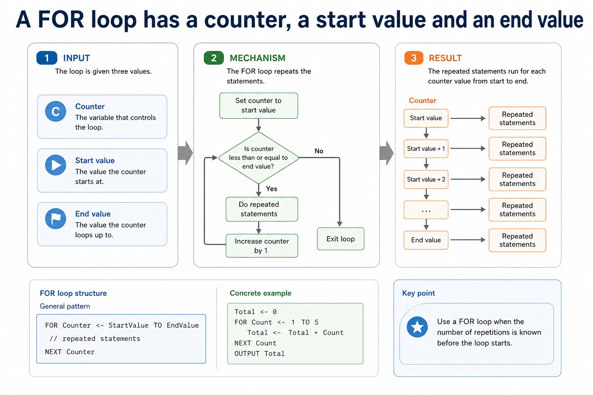

# Lesson 080: Writing complete program fragments

**Course:** Cambridge International AS Level Computer Science 9618, syllabus for examination in 2027-2029<br>
**Paper:** Paper 2<br>
**Syllabus:** Section 11: Programming<br>
**Syllabus requirements:** S11.01, S11.04, S11.06, S11.07<br>
**Pacing:** Flexible. Select a quick, full or deep route for the learners in front of you.

## Teaching-depth menu

- **Quick route:** Use the diagnostic, learning objectives, first worked example and foundation question. Stop once the learner can explain the central distinction accurately.
- **Full route:** Teach every knowledge-point material set, the worked method and all lesson questions.
- **Deep route:** Add the prerequisite refresher, ask learners to connect the concept checklist, discuss the labelled extension and complete a transfer question without a model answer.

## 1. Prerequisite knowledge and quick diagnostic

Recall S9.07, S9.06, S11.02 before starting this lesson.

Ask the learner to give one accurate definition or method step before continuing. If they cannot, briefly revisit the named prerequisite rather than repeating the whole previous lesson.

### Optional prerequisite refresher

- Document an algorithm using structured English, a flowchart or pseudocode; write pseudocode from structured English or a flowchart, and draw a flowchart from structured English or pseudocode while preserving the same algorithm.
- Use structured English, flowcharts and pseudocode; convert between representations.
- The three basic algorithm constructs are sequence, selection and iteration (repetition); students must recognise and use each construct, including combinations of constructs.
- Understand and use sequence, selection and iteration.
- Write pseudocode for declaration and initialisation of constants; declaration of variables; assignment of values; expressions using arithmetic or logical operators; input from the keyboard; and output to the console.
- Use declarations, constants, variables, assignment, arithmetic/logical operations and input/output.


## 2. Knowledge explanation

### 1. Pseudocode from a flowchart or structured-English description: Writing complete program fragments (S11.01)

**Atomic learning targets**

- **S11.01.A01:** pseudocode
- **S11.01.A02:** flowchart
- **S11.01.A03:** structured-English / structured English
- **S11.01.A04:** description / descriptions / design

**Core explanation**

- Pseudocode from a flowchart or structured-English description.
- To translate a flowchart, follow arrows from Start, convert input/output symbols directly, convert diamonds into IF/CASE or loop conditions, and preserve every branch and reconnection. To translate structured English, identify its controlled verbs and indentation before selecting Cambridge constructs.
- To translate structured English, identify its controlled verbs and indentation before selecting Cambridge constructs.

**Mechanism or method**

1. **Set up the required data and conditions** — Pseudocode from a flowchart or structured-English description.
2. **Carry out the complete method** — To translate a flowchart, follow arrows from Start, convert input/output symbols directly, convert diamonds into IF/CASE or loop conditions, and preserve every branch and reconnection.
3. **Trace or test the result** — To translate structured English, identify its controlled verbs and indentation before selecting Cambridge constructs.

#### Worked example: Pseudocode from a flowchart or structured-English description: Writing complete program fragments: complete worked route

1. **Set up the required data and conditions**

Pseudocode from a flowchart or structured-English description.

2. **Carry out the complete method**

To translate a flowchart, follow arrows from Start, convert input/output symbols directly, convert diamonds into IF/CASE or loop conditions, and preserve every branch and reconnection.

3. **Trace or test the result**

To translate structured English, identify its controlled verbs and indentation before selecting Cambridge constructs.

4. **Complete example**

Use a procedure and a function: PROCEDURE Increase(BYREF Number : INTEGER, BYVAL Amount : INTEGER) changes the caller's Number by Amount. FUNCTION CalculateVAT(Price : REAL) RETURNS REAL returns Price 0.20, so Total <- Price + CalculateVAT(Price) uses the returned value in an expression. In Increase(Score, 5), Number and Amount are parameters while Score and 5 are arguments.

**Misconceptions to correct**

- Students often think working Java automatically means good pseudocode. Correction: Paper 2 rewards clear Cambridge-style algorithm expression.

#### Mastery check (MC-L080-S11.01)

Complete a fresh example that demonstrates every target: pseudocode; flowchart; structured-English / structured English; description / descriptions / design. Show all intermediate steps and check the result.

<details><summary>Answer criteria</summary>

- Pseudocode from a flowchart or structured-English description.
- To translate a flowchart, follow arrows from Start, convert input/output symbols directly, convert diamonds into IF/CASE or loop conditions, and preserve every branch and reconnection. To translate structured English, identify its controlled verbs and indentation before selecting Cambridge constructs.
- To translate structured English, identify its controlled verbs and indentation before selecting Cambridge constructs.

</details>

**Supplementary concept map**

- **structured-English:** Pseudocode from a flowchart or structured-English description.
- **design:** Implement and write pseudocode from a given design…
- **pseudocode:** The answer must be Cambridge pseudocode, not Java
- **test:** FOR when the count is known, WHILE when…
- **flowchart:** To translate a flowchart, follow arrows from Start,…
- **complete fragment:** To translate structured English, identify its controlled verbs…

**Supplementary three-step recap**

1. **Translate the stated design** — Pseudocode from a flowchart or structured-English description.
2. **Apply one complete operation** — Implement and write pseudocode from a given design presented as either a flowchart or structured English.
3. **Trace state and boundaries** — To translate structured English, identify its controlled verbs and indentation before selecting Cambridge constructs.

**Concrete case: structured-English:** Pseudocode from a flowchart or structured-English description.


<details><summary>Precise syllabus wording</summary>

Write pseudocode from a flowchart or structured-English description.

Implement and write pseudocode from a given design presented as either a flowchart or structured English.

</details>

### 2. IF/ELSE/nested selection, CASE, count-controlled loops, post-condition and pre-condition loops: Writing complete program fragments (S11.04)

**Atomic learning targets**

- **S11.04.A01:** IF
- **S11.04.A02:** ELSE
- **S11.04.A03:** nested
- **S11.04.A04:** selection
- **S11.04.A05:** CASE
- **S11.04.A06:** count-controlled
- **S11.04.A07:** loop / loops
- **S11.04.A08:** post-condition
- **S11.04.A09:** pre-condition

**Core explanation**

- Select and justify the loop structure from the problem: use FOR when the count is known, WHILE when execution may be unnecessary and continuation is tested first, and REPEAT when the body must run once before a stopping condition can be tested. The justification must use the scenario, not only say that one loop is easier.
- IF/ELSE/nested selection, CASE, count-controlled loops, post-condition and pre-condition loops.
- To translate a flowchart, follow arrows from Start, convert input/output symbols directly, convert diamonds into IF/CASE or loop conditions, and preserve every branch and reconnection. To translate structured English, identify its controlled verbs and indentation before selecting Cambridge constructs.
- Justify FOR from the problem: it is well suited when the count or bounds are known, but a pre-condition or post-condition loop is better when the number of repetitions depends on input or a stopping condition.
- CASE compares one expression with several discrete values. Each listed value has its own action and OTHERWISE handles unlisted values.

**Mechanism or method**

1. **Set up the required data and conditions** — Select and justify the loop structure from the problem: use FOR when the count is known, WHILE when execution may be unnecessary and continuation is tested first, and REPEAT when the body must run once before a stopping condition can be tested.
2. **Carry out the complete method** — The justification must use the scenario, not only say that one loop is easier.
3. **Trace or test the result** — IF/ELSE/nested selection, CASE, count-controlled loops, post-condition and pre-condition loops.

#### Worked example: IF/ELSE/nested selection, CASE, count-controlled loops, post-condition and pre-condition loops: Writing complete program fragments: complete worked route

1. **Set up the required data and conditions**

Select and justify the loop structure from the problem: use FOR when the count is known, WHILE when execution may be unnecessary and continuation is tested first, and REPEAT when the body must run once before a stopping condition can be tested.

2. **Carry out the complete method**

The justification must use the scenario, not only say that one loop is easier.

3. **Trace or test the result**

IF/ELSE/nested selection, CASE, count-controlled loops, post-condition and pre-condition loops.

4. **Complete example**

Use a procedure and a function: PROCEDURE Increase(BYREF Number : INTEGER, BYVAL Amount : INTEGER) changes the caller's Number by Amount. FUNCTION CalculateVAT(Price : REAL) RETURNS REAL returns Price 0.20, so Total <- Price + CalculateVAT(Price) uses the returned value in an expression. In Increase(Score, 5), Number and Amount are parameters while Score and 5 are arguments.

**Misconceptions to correct**

- Students often think working Java automatically means good pseudocode. Correction: Paper 2 rewards clear Cambridge-style algorithm expression.

#### Mastery check (MC-L080-S11.04)

Complete a fresh example that demonstrates every target: IF; ELSE; nested; selection; CASE; count-controlled; loop / loops; post-condition; pre-condition. Show all intermediate steps and check the result.

<details><summary>Answer criteria</summary>

- Select and justify the loop structure from the problem: use FOR when the count is known, WHILE when execution may be unnecessary and continuation is tested first, and REPEAT when the body must run once before a stopping condition can be tested. The justification must use the scenario, not only say that one loop is easier.
- IF/ELSE/nested selection, CASE, count-controlled loops, post-condition and pre-condition loops.
- To translate a flowchart, follow arrows from Start, convert input/output symbols directly, convert diamonds into IF/CASE or loop conditions, and preserve every branch and reconnection. To translate structured English, identify its controlled verbs and indentation before selecting Cambridge constructs.
- Justify FOR from the problem: it is well suited when the count or bounds are known, but a pre-condition or post-condition loop is better when the number of repetitions depends on input or a stopping condition.
- CASE compares one expression with several discrete values. Each listed value has its own action and OTHERWISE handles unlisted values.

</details>

**Supplementary concept map**

- **count-controlled:** IF/ELSE/nested selection, CASE, count-controlled loops, post-condition and pre-condition…
- **post-condition:** It is well suited when the count or…
- **pre-condition:** And pre-condition loops.
- **loop:** A WHILE...ENDWHILE loop is a pre-condition loop
- **selection:** Close the complete multi-way selection with ENDCASE.
- **iteration:** The counter, start value and end value define…

**Supplementary three-step recap**

1. **Translate the stated design** — IF/ELSE/nested selection, CASE, count-controlled loops, post-condition and pre-condition loops.
2. **Apply one complete operation** — It is well suited when the count or bounds are known, but a pre-condition or post-condition loop is…
3. **Trace state and boundaries** — And pre-condition loops.

**Use CASE for clear values of one expression:** CASE compares one expression with several discrete values. Each listed value has its own action and OTHERWISE handles unlisted values.

#### Use CASE for clear values of one expression


<details><summary>Text transcript</summary>

- CASE compares one expression with several discrete values.
- Each listed value has its own action and OTHERWISE handles unlisted values.
- Close the complete multi-way selection with ENDCASE.

</details>

#### A FOR loop has a counter, a start value and an end value



<details><summary>Text transcript</summary>

- FOR loop structure
- General pattern
- FOR Counter <- StartValue TO EndValue
- // repeated statements
- NEXT Counter
- Concrete example
- Total <- 0
- FOR Count <- 1 TO 5
- Total <- Total + Count
- NEXT Count
- OUTPUT Total
- Use a FOR loop when the number of repetitions is known before the loop starts.

</details>

<details><summary>Precise syllabus wording</summary>

Use IF/ELSE/nested selection, CASE, count-controlled loops, post-condition and pre-condition loops.

Use IF statements, including the ELSE clause and nested IF statements; CASE statements; count-controlled loops; post-condition loops; and pre-condition loops.

</details>

### 3. And use procedures with parameters passed by reference and by value: Writing complete program fragments (S11.06)

**Atomic learning targets**

- **S11.06.A01:** procedure / procedures
- **S11.06.A02:** parameters
- **S11.06.A03:** passed / passes / pass
- **S11.06.A04:** reference / BYREF
- **S11.06.A05:** value / BYVAL

**Core explanation**

- And use procedures with parameters passed by reference and by value.
- Define and use a function; explain when the use of a function is appropriate. A function is used in an expression and its return value replaces the function call.
- Parameters with none, one or more values passed by reference or by value.
- Define and use a procedure

**Mechanism or method**

1. **Identify the relevant condition or input** — And use procedures with parameters passed by reference and by value.
2. **Trace how the process works** — explain when the use of a function is appropriate.
3. **Connect the mechanism to its result** — A function is used in an expression and its return value replaces the function call.

#### Worked example: And use procedures with parameters passed by reference and by value: Writing complete program fragments: complete worked route

1. **Identify the relevant condition or input**

And use procedures with parameters passed by reference and by value.

2. **Trace how the process works**

explain when the use of a function is appropriate.

3. **Connect the mechanism to its result**

A function is used in an expression and its return value replaces the function call.

4. **Complete example**

Use a procedure and a function: PROCEDURE Increase(BYREF Number : INTEGER, BYVAL Amount : INTEGER) changes the caller's Number by Amount. FUNCTION CalculateVAT(Price : REAL) RETURNS REAL returns Price 0.20, so Total <- Price + CalculateVAT(Price) uses the returned value in an expression. In Increase(Score, 5), Number and Amount are parameters while Score and 5 are arguments.

**Misconceptions to correct**

- Students often think working Java automatically means good pseudocode. Correction: Paper 2 rewards clear Cambridge-style algorithm expression.

#### Mastery check (MC-L080-S11.06)

Explain the following targets in one connected answer, using a concrete example for each: procedure / procedures; parameters; passed / passes / pass; reference / BYREF; value / BYVAL.

<details><summary>Answer criteria</summary>

- And use procedures with parameters passed by reference and by value.
- Define and use a function; explain when the use of a function is appropriate. A function is used in an expression and its return value replaces the function call.
- Parameters with none, one or more values passed by reference or by value.
- Define and use a procedure

</details>

**Supplementary concept map**

- **procedure call:** And use procedures with parameters passed by reference…
- **procedure:** Define and use a procedure
- **pass:** Parameters with none, one or more values passed…
- **argument:** When the use of a procedure is appropriate
- **interface:** A function is used in an expression and…
- **parameters:** The counter, start value and end value define…

**Supplementary three-step recap**

1. **Translate the stated design** — And use procedures with parameters passed by reference and by value.
2. **Apply one complete operation** — Parameters with none, one or more values passed by reference or by value.
3. **Trace state and boundaries** — Define and use a procedure

**Concrete case: procedure call:** And use procedures with parameters passed by reference and by value.


<details><summary>Precise syllabus wording</summary>

Understand and use procedures with parameters passed by reference and by value.

Define and use a procedure; explain when the use of a procedure is appropriate; use parameters with none, one or more values passed by reference or by value.

</details>

### 4. And use functions, including return values in expressions: Writing complete program fragments (S11.07)

**Atomic learning targets**

- **S11.07.A01:** functions
- **S11.07.A02:** return
- **S11.07.A03:** values
- **S11.07.A04:** expression / expressions

**Core explanation**

- Functions are named subroutines that each return one value of a declared type. A function is appropriate when an algorithm needs a reusable calculation whose result will be used by another statement.
- Parameters receive the supplied argument values. The RETURN statement supplies the function result to the caller; it is not the same as printing the value.
- A function call can appear inside an expression. The returned value replaces the call before the surrounding arithmetic, comparison or assignment is completed.
- A procedure performs a named task and need not return a single value. Choose a function for a value-producing calculation and a procedure for an action or coordinated sequence of operations.

**Mechanism or method**

1. **Declare parameters and return type** — Give the function a meaningful name, typed parameters and the type of value it returns.
2. **Calculate and return one value** — Use RETURN with the calculated result on every valid execution path.
3. **Place the call in an expression** — Supply arguments and evaluate the returned value where the function call appears.

#### Worked example: Use a returned value in an expression

1. **Definition**

```text
FUNCTION CalculateVAT(Price : REAL) RETURNS REAL
RETURN Price * 0.20
ENDFUNCTION
```

2. **Call**

Total <- Price + CalculateVAT(Price)

3. **Evaluate**

If Price is 50.00, CalculateVAT(50.00) returns 10.00. The call is replaced by 10.00, so Total becomes 60.00.

4. **Decision**

A function is suitable because the VAT calculation produces one value that is required inside a larger expression.

**Misconceptions to correct**

- OUTPUT inside a procedure does not make it a function. A function must return a value to its caller.

#### Mastery check (MC-L080-S11.07)

Explain the following targets in one connected answer, using a concrete example for each: functions; return; values; expression / expressions.

<details><summary>Answer criteria</summary>

- Functions are named subroutines that each return one value of a declared type. A function is appropriate when an algorithm needs a reusable calculation whose result will be used by another statement.
- Parameters receive the supplied argument values. The RETURN statement supplies the function result to the caller; it is not the same as printing the value.
- A function call can appear inside an expression. The returned value replaces the call before the surrounding arithmetic, comparison or assignment is completed.
- A procedure performs a named task and need not return a single value. Choose a function for a value-producing calculation and a procedure for an action or coordinated sequence of operations.

</details>

**Supplementary concept map**

- **Function:** returns one typed value
- **Parameters:** receive argument values
- **RETURN:** sends result to caller
- **Call:** invokes the calculation
- **Expression:** uses returned value
- **Procedure:** performs a named task

**Supplementary three-step recap**

1. **Declare parameters and return type** — Give the function a meaningful name, typed parameters and the type of value it returns.
2. **Calculate and return one value** — Use RETURN with the calculated result on every valid execution path.
3. **Place the call in an expression** — Supply arguments and evaluate the returned value where the function call appears.

**The call becomes its result:** CalculateVAT(50.00) is replaced by 10.00 before the surrounding Total expression is evaluated.


<details><summary>Precise syllabus wording</summary>

Understand and use functions, including return values in expressions.

Define and use a function; explain when the use of a function is appropriate. A function is used in an expression and its return value replaces the function call.

</details>

### Lesson technical reference

- Implement and write pseudocode from a given design presented as either a flowchart or structured English.
- Use IF statements, including the ELSE clause and nested IF statements; CASE statements; count-controlled loops; post-condition loops; and pre-condition loops.
- Define and use a procedure; explain when the use of a procedure is appropriate; use parameters with none, one or more values passed by reference or by value.
- Define and use a function; explain when the use of a function is appropriate. A function is used in an expression and its return value replaces the function call.
- To translate a flowchart, follow arrows from Start, convert input/output symbols directly, convert diamonds into IF/CASE or loop conditions, and preserve every branch and reconnection. To translate structured English, identify its controlled verbs and indentation before selecting Cambridge constructs.
- The answer must be Cambridge pseudocode, not Java: use assignment arrow, THEN/ENDIF, FOR...NEXT, WHILE...ENDWHILE or REPEAT...UNTIL as appropriate. Trace both versions with the same data to confirm equivalence.
- Use IF...THEN...ELSE...ENDIF when a Boolean condition selects between paths. An ELSE clause supplies the false path. In nested IF statements, every inner and outer IF must be closed and the indentation must show which ELSE belongs to which IF.
- Use CASE...OF...OTHERWISE...ENDCASE when one expression is compared with several discrete values. CASE is not a replacement for range or compound-condition decisions unless the stated values cover the requirement correctly.
- A count-controlled loop uses FOR...TO...NEXT when the repetition count or inclusive counter range is known before the loop starts. The counter, start value and end value define the iterations; NEXT closes the loop.
- Justify FOR from the problem: it is well suited when the count or bounds are known, but a pre-condition or post-condition loop is better when the number of repetitions depends on input or a stopping condition.
- A WHILE...ENDWHILE loop is a pre-condition loop: it tests before the body and may run zero times. A REPEAT...UNTIL loop is a post-condition loop: it executes the body before testing and therefore runs at least once. A FOR...NEXT loop is count-controlled.
- Select and justify the loop structure from the problem: use FOR when the count is known, WHILE when execution may be unnecessary and continuation is tested first, and REPEAT when the body must run once before a stopping condition can be tested. The justification must use the scenario, not only say that one loop is easier.

Beyond syllabus / 延伸知识（不要求背诵）: consistent style, modularity and automated tests reduce maintenance errors in larger programs.
## 3. Practice by question type

### Question 1 - foundation - apply - 2 marks

What is the difference between BYVAL and BYREF?

**Answer:** BYVAL supplies a value/copy; BYREF aliases the caller variable so changes can persist.

**Marking guidance:** Award one mark for each distinct, technically accurate point or method step.

**Common error:** For the command word apply, perform that exact action; do not replace it with an unrelated fact.

### Question 2 - application - apply - 2 marks

Should Java braces appear in a Cambridge pseudocode answer?

**Answer:** No; use Cambridge keywords and terminators.

**Marking guidance:** Award one mark for each distinct, technically accurate point or method step.

**Common error:** Do not repeat the same point in different words; each mark needs a separate idea or method step.

### Question 3 - transfer - write - 7 marks

Write a function CalculateVAT(Price : REAL) that returns 20% of Price. Then write one assignment that uses its return value inside an expression to calculate Total, and explain why a function is appropriate.

**Answer:** FUNCTION CalculateVAT(Price : REAL) RETURNS REAL; RETURN Price * 0.20; ENDFUNCTION; Total <- Price + CalculateVAT(Price); function is appropriate because it produces one reusable value needed in an expression

**Marking guidance:** Require a declared return type, RETURN statement, call in an expression and an appropriate justification.

**Common error:** Printing the VAT inside a procedure does not return a value to the expression.

### Related past-paper indexes

| Reference | Marks | Command word | Question type |
|---|---:|---|---|
| 9618/22/S/25 Q10(a) | 8 | complete | trace |
| 9618/22/S/25 Q10(b) | 7 | complete | trace |
| 9618/21/S/25 Q7(a) | 6 | write | write |
| 9618/23/S/25 Q1(b) | 5 | complete | recall |

These are indexes only. Cambridge question and mark-scheme wording is not reproduced.

## 4. Summary and exam reminders

### Summary

- S11.01: explain pseudocode, flowchart, structured-English / structured English, description / descriptions / design.
- S11.01 method: Set up the required data and conditions → Carry out the complete method → Trace or test the result.
- S11.04: explain IF, ELSE, nested, selection, CASE, count-controlled, loop / loops, post-condition, pre-condition.
- S11.04 method: Set up the required data and conditions → Carry out the complete method → Trace or test the result.
- S11.06: explain procedure / procedures, parameters, passed / passes / pass, reference / BYREF, value / BYVAL.

### Common error to correct

Students often think working Java automatically means good pseudocode. Correction: Paper 2 rewards clear Cambridge-style algorithm expression.

### Exam technique

- Follow the command word: state gives a fact; explain links a cause to a consequence; compare covers both sides.
- Match the number of independent points or method steps to the available marks.
- For writing complete program fragments, use the exact technical term before applying it to the scenario.
