# Lesson 080: Writing complete program fragments

**Course:** Cambridge International AS Level Computer Science 9618, 2027-2029 Version 2 
**Paper:** Paper 2 
**Syllabus:** Section 11: Programming 
**Syllabus requirements:** S11.01, S11.04, S11.06, S11.07 
**Pacing:** Flexible. Select the material set and practice depth needed by the learner.

## Teaching-depth menu

- **Quick route:** Use the diagnostic, learning objectives, first worked example and foundation question. Stop once the learner can explain the central distinction accurately.
- **Full route:** Use every knowledge-point material set, the worked method, the terminology check and all questions.
- **Deep route:** Add the prerequisite refresher, ask learners to connect the concept checklist, discuss the labelled extension and complete a transfer question without a model answer.

## 1. Prerequisite knowledge and quick diagnostic

Recall S9.07, S9.06, S11.02 before starting this lesson.

Ask the learner to give one accurate definition or method step before continuing. If they cannot, briefly revisit the named prerequisite rather than repeating the whole previous lesson.

### Optional prerequisite refresher

- Document an algorithm using structured English, a flowchart or pseudocode; write pseudocode from structured English or a flowchart, and draw a flowchart from structured English or pseudocode while preserving the same algorithm.
- Use structured English, flowcharts and pseudocode; convert between representations.
- The three basic algorithm constructs are sequence, selection and iteration (repetition); students must recognise and use each construct, including combinations of constructs.
- Understand and use sequence, selection and iteration.
- Write pseudocode for declaration and initialisation of constants; declaration of variables; assignment of values; expressions using arithmetic or logical operators; input from the keyboard; and output to the console.
- Use declarations, constants, variables, assignment, arithmetic/logical operations and input/output.

## 2. Knowledge explanation

### 1. Pseudocode · Flowchart · Structured-English · Description (S11.01)

**Concept map:** pseudocode → flowchart → structured-English → description

**Three-part explanation:**

1. Implement and write pseudocode from a given design presented as either a flowchart or structured English
2. To translate structured English, identify its controlled verbs and indentation before selecting Cambridge constructs
3. The answer must be Cambridge pseudocode, not Java

**Concrete cue:** Implement and write pseudocode from a given design presented as either a flowchart or structured English.

#### Translate a flowchart or structured English into pseudocode

Text transcript

- Follow a flowchart from Start: translate input/output symbols, decisions, branches and loop-back arrows without losing a path.
- From structured English, preserve the controlled verbs, conditions and indentation when selecting Cambridge pseudocode constructs.
- Dry-run the source description and pseudocode with the same data; matching paths and outputs confirm equivalence.

#### Java can support practice; the review answer should be Cambridge pseudocode

Text transcript

- Java may support practice but the review answer uses Cambridge pseudocode.
- Increment PassCount only when the current mark is at least 50.
- Close the pseudocode selection with ENDIF before NEXT Index.
- Keep Java and pseudocode indexing conventions explicit.

#### Java method syntax is not Cambridge pseudocode

Text transcript

- Java support only
- Cambridge-style pseudocode
- FUNCTION CalculateVAT(Price : REAL) RETURNS REAL
- RETURN Price 0.20
- ENDFUNCTION
- Java support example only
- static double calculateVAT(double price) {
- return price 0.20;

#### Java syntax is support, not Cambridge pseudocode

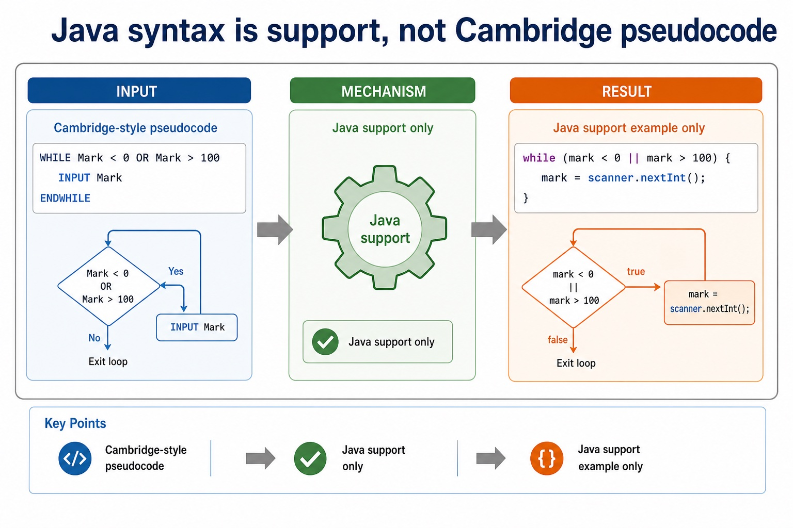

Text transcript

- Java support only
- Cambridge-style pseudocode
- WHILE Mark < 0 OR Mark 100
- INPUT Mark
- ENDWHILE
- Java support example only
- while (mark < 0 \|\| mark 100) {
- mark = scanner.nextInt();

Precise syllabus wording

Write pseudocode from a flowchart or structured-English description.

Implement and write pseudocode from a given design presented as either a flowchart or structured English.

### 2. IF · ELSE · Nested · Selection (S11.04)

**Concept map:** IF → ELSE → nested → selection → CASE → count-controlled → loop → post-condition → pre-condition

**Three-part explanation:**

1. it is well suited when the count or bounds are known, but a pre-condition or post-condition loop is better when the number of repetitions depends on…
2. Use IF statements, including the ELSE clause and nested IF statements
3. A FOR...NEXT loop is count-controlled

**Concrete cue:** Use IF statements, including the ELSE clause and nested IF statements; CASE statements; count-controlled loops; post-condition loops; and pre-condition loops.

#### Use IF when a Boolean condition decides the route

Text transcript

- IF selection
- Use when
- Cambridge-style pattern
- action is needed only when condition is true
- IF Found THEN ... ENDIF
- IF...ELSE
- two paths are needed
- IF Mark = 50 THEN ... ELSE ... ENDIF

#### Pre-condition loop: check before running

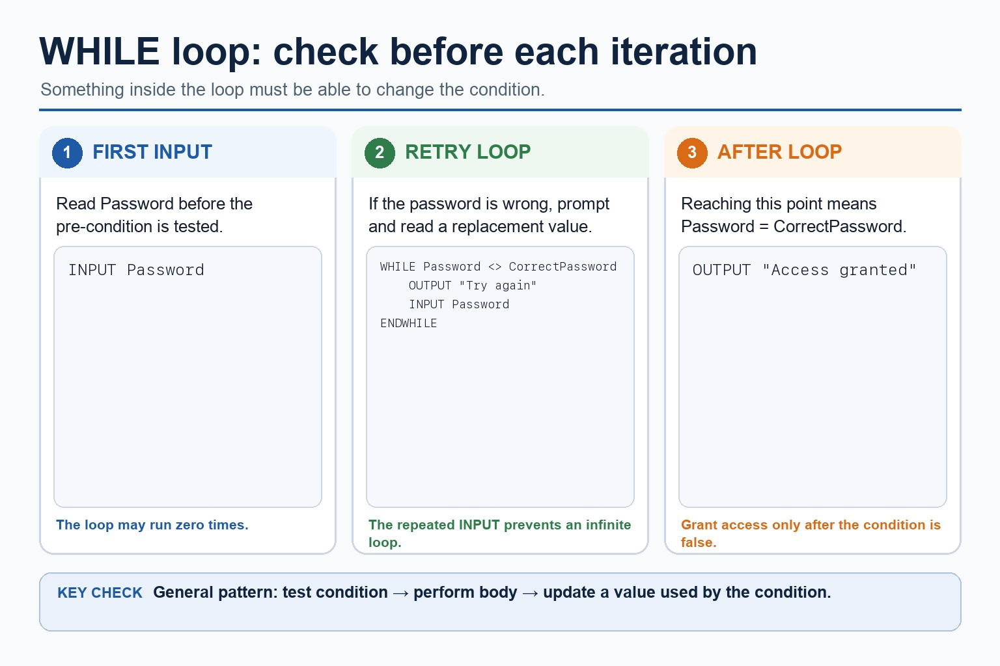

Text transcript

- A WHILE loop checks its condition before each iteration and may run zero times.
- Input Password before testing whether it differs from CorrectPassword.
- Inside the loop, output the retry message and input a replacement Password.
- Output Access granted only after the WHILE condition becomes false.

#### Post-condition loop: run once, then check

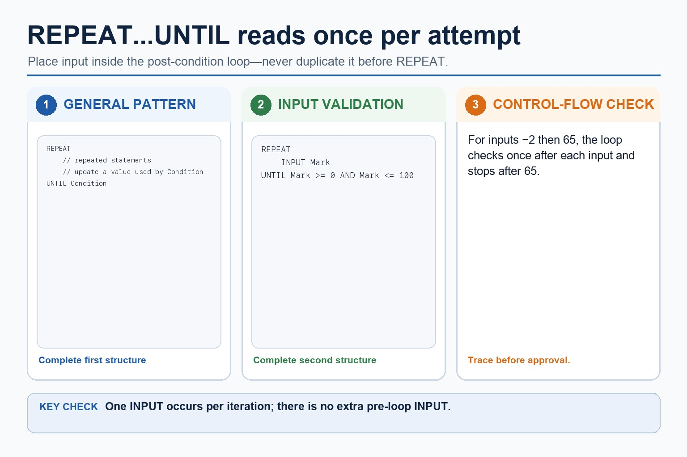

Text transcript

- A REPEAT...UNTIL loop checks its condition after executing the body.
- Place INPUT Mark once inside REPEAT so each attempt obtains one value.
- Do not add a duplicate INPUT before the loop.
- Stop when Mark is between 0 and 100 inclusive.

#### Conditions decide the path

Text transcript

- Use IF for a Boolean condition or range and close it with ENDIF.
- Use CASE for several discrete values of one expression and close it with ENDCASE.
- Test marks 49, 50 and 51 to verify the pass boundary.

#### Three control-flow ideas

Text transcript

- Sequence answers what happens next and depends on statement order.
- Selection answers which path is taken and uses IF or CASE structures.
- Iteration answers what repeats and when repetition stops.
- FOR, WHILE and REPEAT are iteration forms with different controls.

Precise syllabus wording

Use IF/ELSE/nested selection, CASE, count-controlled loops, post-condition and pre-condition loops.

Use IF statements, including the ELSE clause and nested IF statements; CASE statements; count-controlled loops; post-condition loops; and pre-condition loops.

### 3. Procedure · Parameters · Passed · Reference (S11.06)

**Concept map:** procedure → parameters → passed → reference → value

**Three-part explanation:**

1. use parameters with none, one or more values passed by reference or by value
2. explain when the use of a procedure is appropriate
3. Define and use a procedure

**Concrete cue:** Define and use a procedure; explain when the use of a procedure is appropriate; use parameters with none, one or more values passed by reference or by value.

#### Same procedure body, different final result

Text transcript

- Side-by-side comparison
- By value
- By reference
- Header clue
- Number : INTEGER
- BYREF Number : INTEGER
- What is passed
- a copy of the value

#### Use functions for returned values and procedures for actions

Text transcript

- A function returns a value; a procedure performs an action.
- IsPass returns a BOOLEAN based on whether Mark is at least 50.
- Close the function's IF with ENDIF before ENDFUNCTION.
- DisplayResult outputs its parameters and returns no value.

#### Pass data into a module and return only what is needed

Text transcript

- GetValidMark inputs and validates a mark, then returns a valid INTEGER.
- CalculateGrade receives Mark and returns a grade character.
- DisplayResult is a procedure that performs OUTPUT and returns no value.
- Return values and screen-output effects must not be conflated.

#### A procedure performs actions and returns no value

Text transcript

- A procedure performs an action and does not return a value.
- A function returns a value and can be used in an expression.
- Do not describe returning a value as optional for a Cambridge procedure.

Precise syllabus wording

Understand and use procedures with parameters passed by reference and by value.

Define and use a procedure; explain when the use of a procedure is appropriate; use parameters with none, one or more values passed by reference or by value.

### 4. Functions · Return · Values · Expression (S11.07)

**Concept map:** functions → return → values → expression

**Three-part explanation:**

1. A function is used in an expression and its return value replaces the function call
2. explain when the use of a function is appropriate
3. REAL) RETURNS REAL returns Price 0.20, so Total <- Price + CalculateVAT(Price) uses the returned value in an expression

**Concrete cue:** Define and use a function; explain when the use of a function is appropriate. A function is used in an expression and its return value replaces the function call.

#### Function calls can appear where a value is needed

Text transcript

- Calls and returned values
- CALL DisplayMenu()
- procedure call performs an action
- VAT <- CalculateVAT(Price)
- function return value is stored
- Total <- DisplayMenu()
- procedure does not return a value
- OUTPUT CalculateVAT(Price)

#### Use CASE for clear values of one expression

Text transcript

- CASE compares one expression with several discrete values.
- Each listed value has its own action and OTHERWISE handles unlisted values.
- Close the complete multi-way selection with ENDCASE.

#### Use functions for returned values and procedures for actions

Text transcript

- A function returns a value; a procedure performs an action.
- IsPass returns a BOOLEAN based on whether Mark is at least 50.
- Close the function's IF with ENDIF before ENDFUNCTION.
- DisplayResult outputs its parameters and returns no value.

#### A function returns a value to the caller

Text transcript

- Function
- Cambridge-style pseudocode
- FUNCTION CalculateVAT(Price : REAL) RETURNS REAL
- RETURN Price 0.20
- ENDFUNCTION
- VAT <- CalculateVAT(120.00)
- When it fits
- Use a function when a calculated, searched or checked result must be used later in the algorithm.

Precise syllabus wording

Understand and use functions, including return values in expressions.

Define and use a function; explain when the use of a function is appropriate. A function is used in an expression and its return value replaces the function call.

### Supporting diagram library

#### Loops repeat with control

Text transcript

- A FOR loop uses a counter range and checks whether the next iteration is within its bounds.
- A FOR loop may execute zero times when its bounds are incompatible.
- A WHILE loop checks its condition before each iteration and may execute zero times.
- A REPEAT loop checks after the body and therefore runs at least once.

#### Same logic, different exam language

Text transcript

- Cambridge pseudocode uses IF, THEN, ELSE and ENDIF for a two-way selection.
- Mark 50 follows the pass branch when the condition uses greater than or equal to 50.
- Java braces may support understanding but are not Cambridge pseudocode.

#### Order changes meaning

Text transcript

- Sequence
- Correct order
- INPUT Price
- INPUT Quantity
- Total <- Price Quantity
- OUTPUT Total
- Wrong order
- A sequence is simple, but not optional. Using a value before it has been input is algorithmic optimism, not a method.

#### Run a small loop by hand

Text transcript

- Interactive trace
- FOR Count <- 1 TO
- Choose a loop limit to build a trace table.

#### The difference is when the condition is tested

Text transcript

- WHILE vs REPEAT
- REPEAT...UNTIL
- Condition checked
- before the loop body
- after the loop body
- Minimum iterations
- Continues when
- condition is TRUE

#### A FOR loop has a counter, a start value and an end value

Text transcript

- FOR loop structure
- General pattern
- FOR Counter <- StartValue TO EndValue
- // repeated statements
- NEXT Counter
- Concrete example
- Total <- 0
- FOR Count <- 1 TO 5

#### A special value can stop the loop

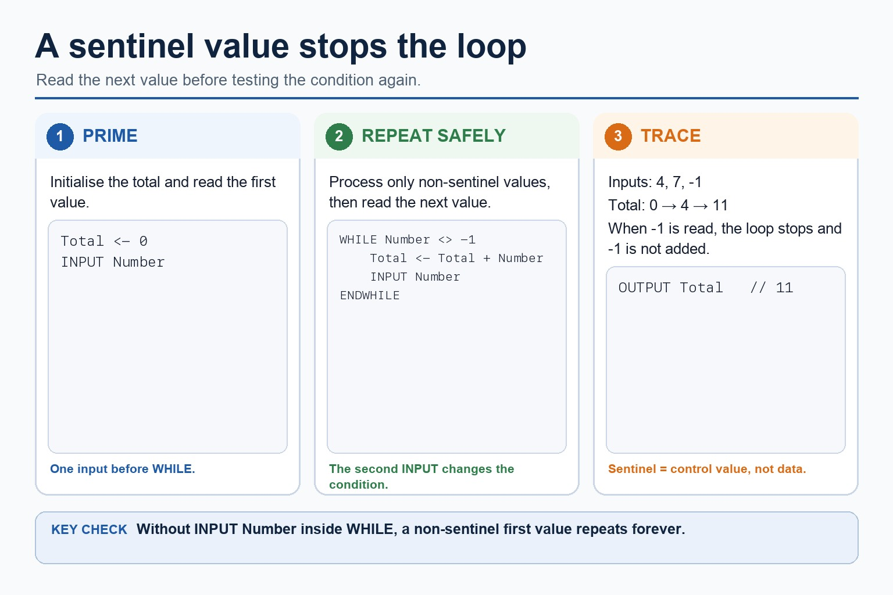

Text transcript

- Initialise Total and input the first Number before WHILE.
- While Number is not -1, add Number to Total and input the next Number.
- The repeated input changes the condition and allows the loop to terminate.
- The sentinel -1 stops the loop and is not included in Total.

#### Keep asking until the input is valid

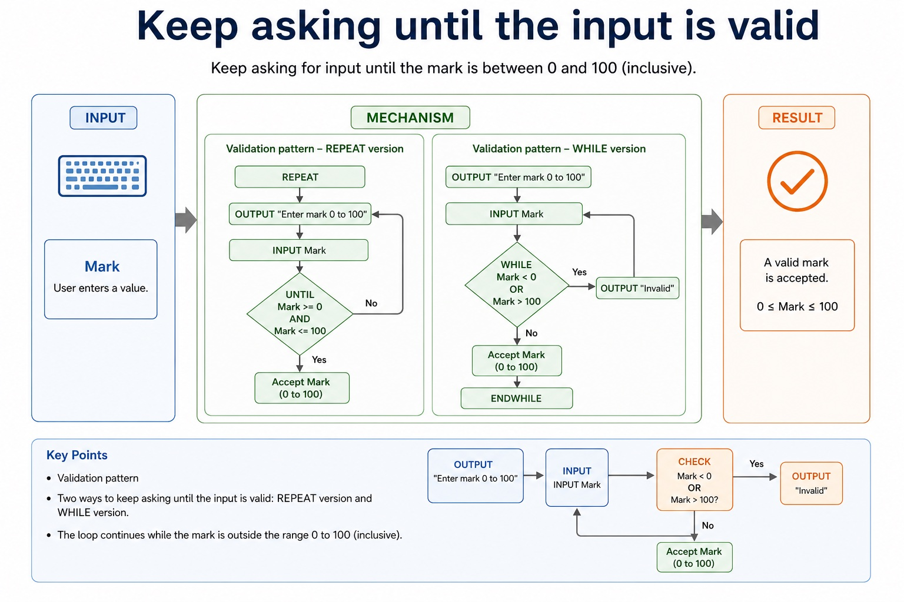

Text transcript

- Validation pattern
- REPEAT version
- OUTPUT "Enter mark 0 to 100"
- INPUT Mark
- UNTIL Mark = 0 AND Mark <= 100
- WHILE version
- WHILE Mark < 0 OR Mark 100
- OUTPUT "Invalid"

#### The mark-winning difference is the returned value

Text transcript

- Procedure vs function
- Procedure
- Function
- Main purpose
- perform an action
- return a value
- PROCEDURE Name(...)
- FUNCTION Name(...) RETURNS Type

#### A subprogram interface connects caller and header

Text transcript

- A subprogram interface gives the caller the name, parameter list and types, and any return value/type.
- A procedure header or function header declares that interface; a function header also declares its return type.
- A parameter is named in the header; an argument is the actual value or variable supplied at a call.
- RETURN sends a function value to the caller; displayed output is an effect, not a return value.

#### Calculate a function return value

Text transcript

- Interactive return simulator
- Use CalculateVAT(Price) to return Price 0.20 .

#### Pick the check that matches the rule

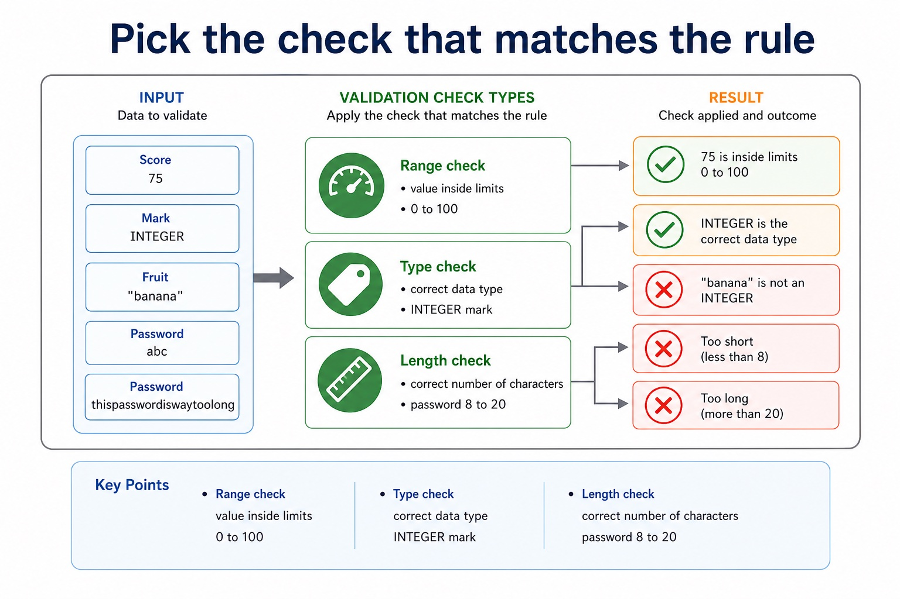

Text transcript

- Validation check types
- Range check
- value inside limits
- 0 to 100
- Type check
- correct data type
- INTEGER mark
- "banana"

#### Validation and modularity support each other

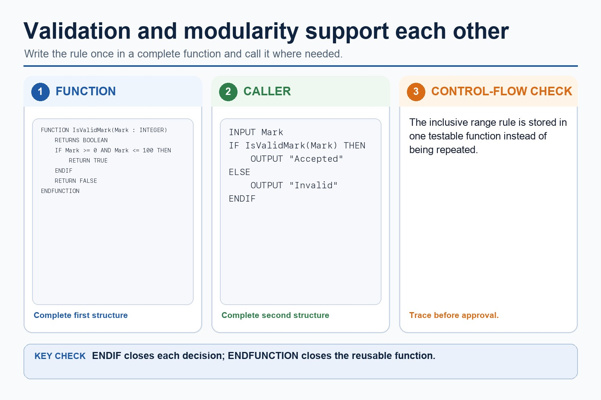

Text transcript

- IsValidMark returns TRUE only for marks from 0 to 100 inclusive.
- Close the valid branch with ENDIF before the false return.
- Close the reusable function with ENDFUNCTION.
- Call the function instead of repeating the validation condition.

#### Modular design splits a solution into smaller named parts

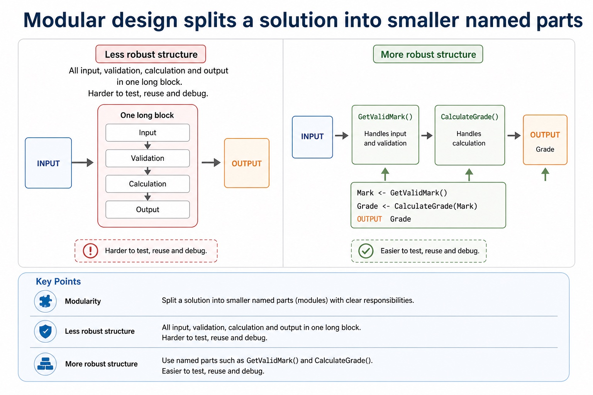

Text transcript

- Modularity
- Less robust structure
- All input, validation, calculation and output in one long block. Harder to test, reuse and debug.
- More robust structure
- Mark <- GetValidMark()
- Grade <- CalculateGrade(Mark)
- OUTPUT Grade

#### Choose a module for each responsibility

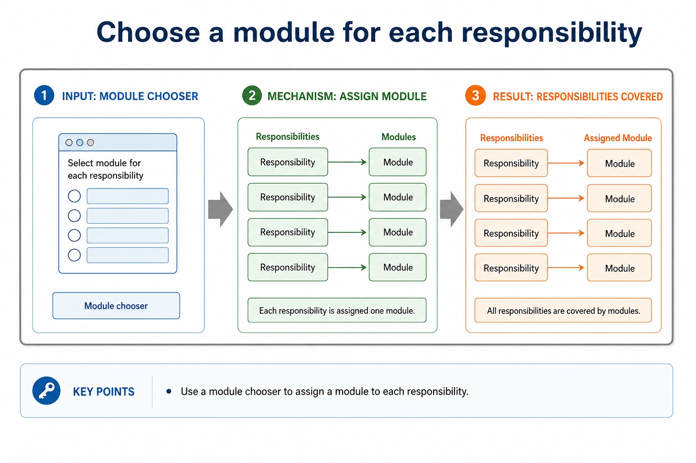

Text transcript

- Module chooser
- Responsibility

#### A robust program handles expected misuse without collapsing

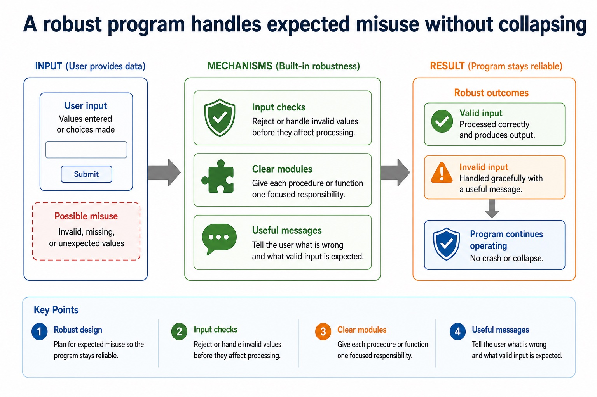

Text transcript

- Robust design
- Input checks
- Reject or handle invalid values before they affect processing.
- Clear modules
- Give each procedure or function one focused responsibility.
- Useful messages
- Tell the user what is wrong and what valid input is expected.

#### Validation checks whether data is acceptable for the program

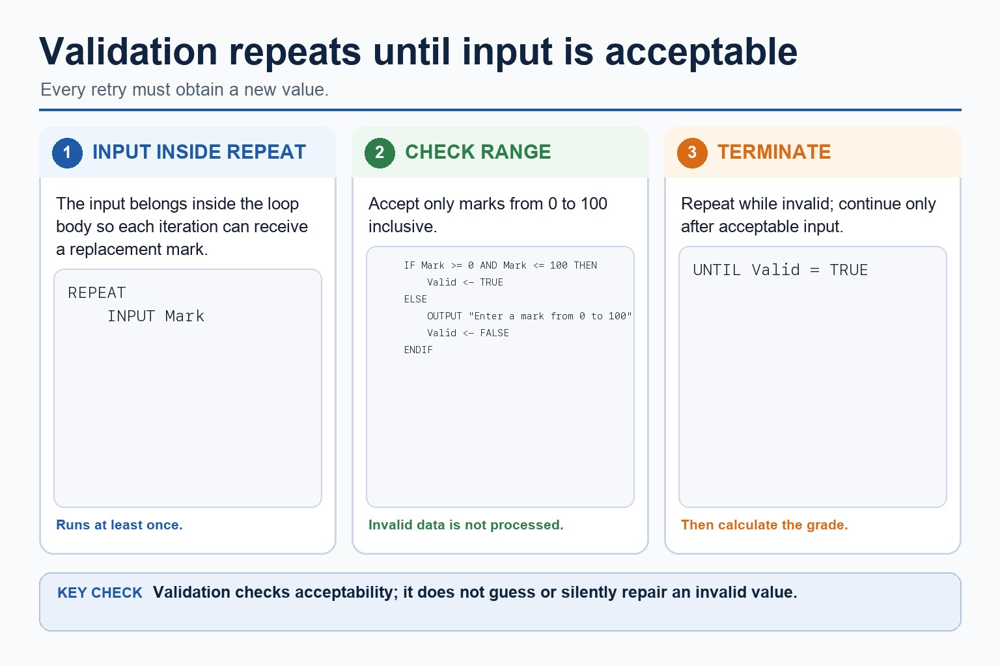

Text transcript

- Place INPUT Mark inside REPEAT so every retry reads a new value.
- Set Valid to TRUE only when Mark is between 0 and 100 inclusive.
- Otherwise output the valid range, set Valid to FALSE and repeat.
- Close the selection with ENDIF and terminate with UNTIL Valid = TRUE.

#### Check whether a mark input is robustly acceptable

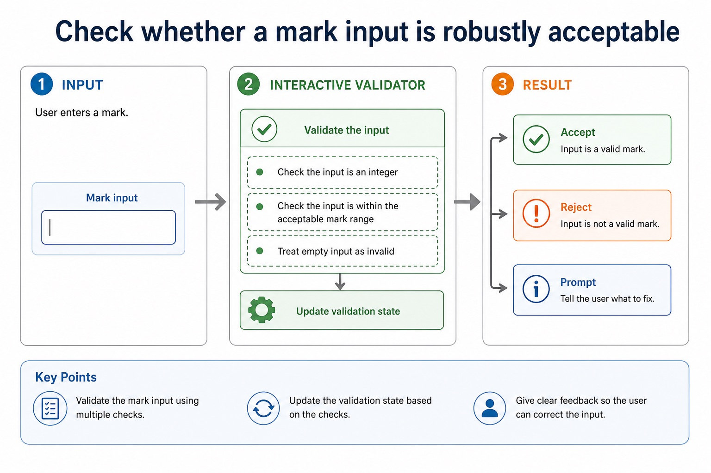

Text transcript

- Interactive validator

#### Arrays need consistent indexing and meaningful loop bounds

Text transcript

- Arrays and loops
- Question wording
- Good answer feature
- Mark-risk
- 10 marks
- FOR Index <- 1 TO 10
- looping 0 to 10 gives 11 iterations
- highest score

#### Use a checklist before calling a fragment finished

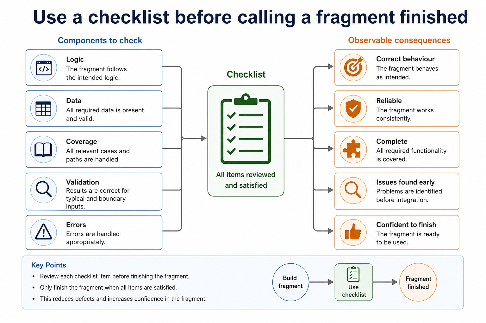

Text transcript

- Mark checklist

#### Review answers should be traceable

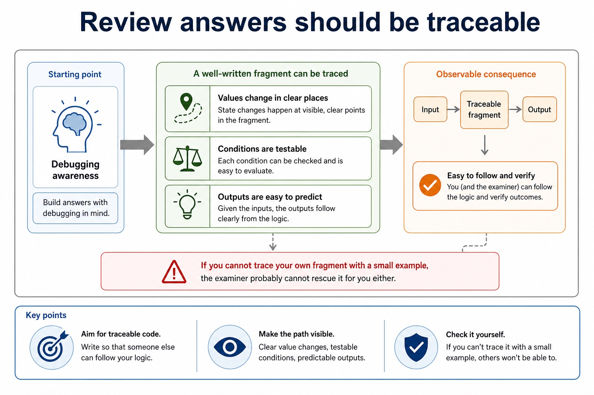

Text transcript

- Debugging awareness
- A well-written fragment can be traced: values change in clear places, conditions are testable, and outputs are easy to predict.
- If you cannot trace your own fragment with a small example, the examiner probably cannot rescue it for you either.

#### File fragments need open, process and close

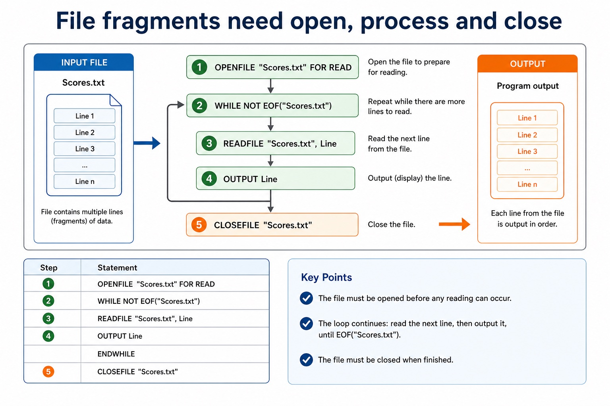

Text transcript

- OPENFILE "Scores.txt" FOR READ
- WHILE NOT EOF("Scores.txt")
- READFILE "Scores.txt", Line
- OUTPUT Line
- ENDWHILE
- CLOSEFILE "Scores.txt"

#### A complete fragment has setup, logic and result

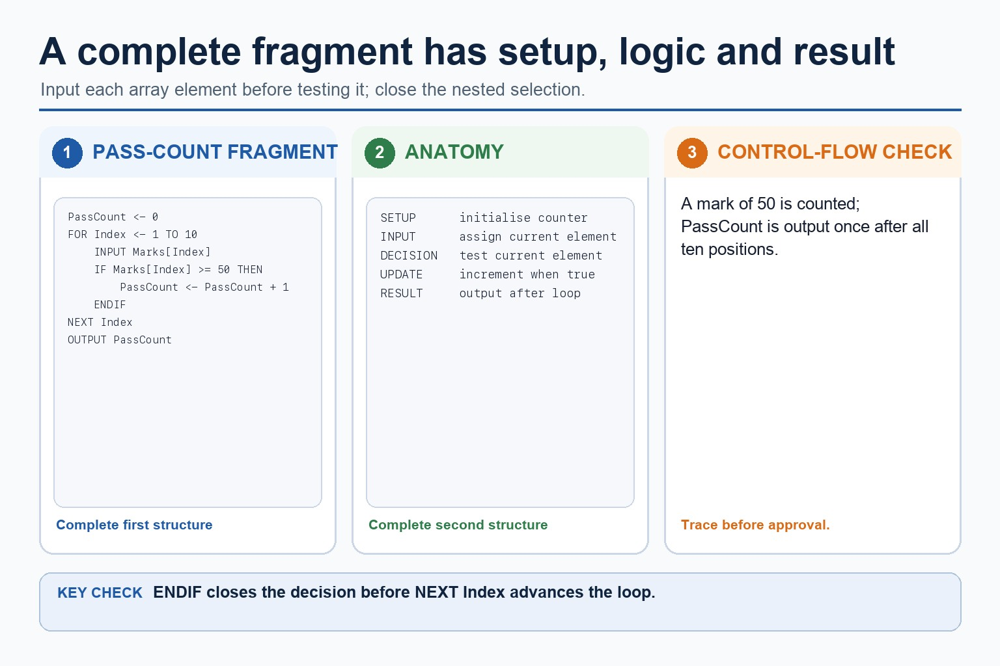

Text transcript

- Initialise PassCount before processing ten array positions.
- Input the current element before testing it.
- Close the passing-mark selection with ENDIF before NEXT Index.
- Output PassCount once after the loop.

#### Section 11 tools become stronger when combined

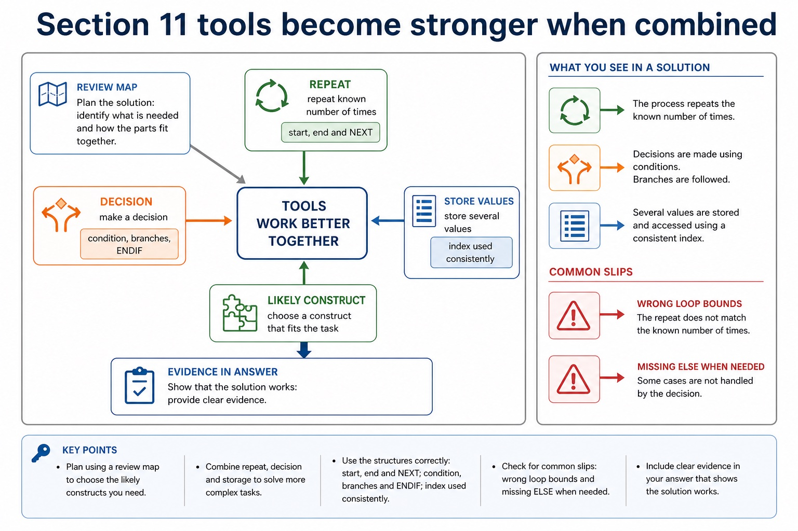

Text transcript

- Review map
- Likely construct
- Evidence in answer
- Common slip
- repeat known number of times
- start, end and NEXT
- wrong loop bounds
- make a decision

#### Review fragments often need input checks

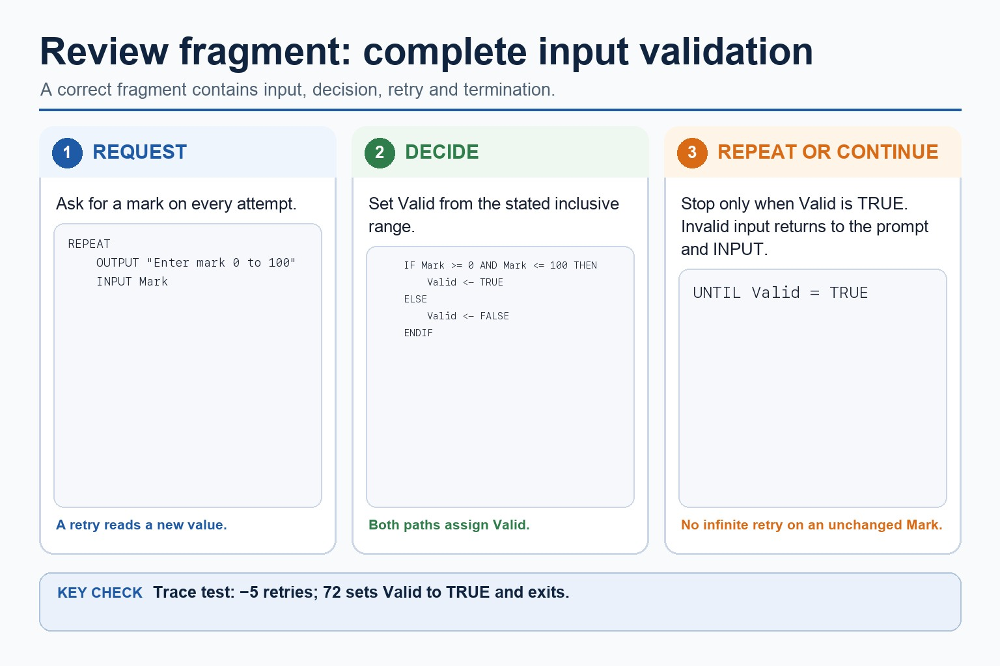

Text transcript

- A complete validation fragment prompts for and inputs Mark inside REPEAT.
- Set Valid to TRUE when Mark is between 0 and 100 inclusive; otherwise set it to FALSE.
- Close the selection with ENDIF and repeat until Valid is TRUE.
- Every invalid retry must read a replacement Mark.

Open precise terminology and exam facts

- Implement and write pseudocode from a given design presented as either a flowchart or structured English.
- Use IF statements, including the ELSE clause and nested IF statements; CASE statements; count-controlled loops; post-condition loops; and pre-condition loops.
- Define and use a procedure; explain when the use of a procedure is appropriate; use parameters with none, one or more values passed by reference or by value.
- Define and use a function; explain when the use of a function is appropriate. A function is used in an expression and its return value replaces the function call.
- To translate a flowchart, follow arrows from Start, convert input/output symbols directly, convert diamonds into IF/CASE or loop conditions, and preserve every branch and reconnection. To translate structured English, identify its controlled verbs and indentation before selecting Cambridge constructs.
- The answer must be Cambridge pseudocode, not Java: use assignment arrow, THEN/ENDIF, FOR...NEXT, WHILE...ENDWHILE or REPEAT...UNTIL as appropriate. Trace both versions with the same data to confirm equivalence.
- Use IF...THEN...ELSE...ENDIF when a Boolean condition selects between paths. An ELSE clause supplies the false path. In nested IF statements, every inner and outer IF must be closed and the indentation must show which ELSE belongs to which IF.
- Use CASE...OF...OTHERWISE...ENDCASE when one expression is compared with several discrete values. CASE is not a replacement for range or compound-condition decisions unless the stated values cover the requirement correctly.
- A count-controlled loop uses FOR...TO...NEXT when the repetition count or inclusive counter range is known before the loop starts. The counter, start value and end value define the iterations; NEXT closes the loop.
- Justify FOR from the problem: it is well suited when the count or bounds are known, but a pre-condition or post-condition loop is better when the number of repetitions depends on input or a stopping condition.
- A WHILE...ENDWHILE loop is a pre-condition loop: it tests before the body and may run zero times. A REPEAT...UNTIL loop is a post-condition loop: it executes the body before testing and therefore runs at least once. A FOR...NEXT loop is count-controlled.
- Select and justify the loop structure from the problem: use FOR when the count is known, WHILE when execution may be unnecessary and continuation is tested first, and REPEAT when the body must run once before a stopping condition can be tested. The justification must use the scenario, not only say that one loop is easier.

### Worked example

1. Use a procedure and a function
2. PROCEDURE Increase(BYREF Number
3. INTEGER, BYVAL Amount
4. INTEGER) changes the caller's Number by Amount.
5. REAL) RETURNS REAL returns Price 0.20, so Total <- Price + CalculateVAT(Price) uses the returned value in an expression.
6. In Increase(Score, 5), Number and Amount are parameters while Score and 5 are arguments.

Beyond syllabus / 延伸知识（不要求背诵）: consistent style, modularity and automated tests reduce maintenance errors in larger programs.
## 3. Practice by question type

### Question 1 - foundation - apply - 2 marks

What is the difference between BYVAL and BYREF?

**Answer:** BYVAL supplies a value/copy; BYREF aliases the caller variable so changes can persist.

**Marking guidance:** Award one mark for each distinct, technically accurate point or method step.

**Common error:** For the command word apply, perform that exact action; do not replace it with an unrelated fact.

### Question 2 - application - apply - 2 marks

Should Java braces appear in a Cambridge pseudocode answer?

**Answer:** No; use Cambridge keywords and terminators.

**Marking guidance:** Award one mark for each distinct, technically accurate point or method step.

**Common error:** Do not repeat the same point in different words; each mark needs a separate idea or method step.

### Question 3 - transfer - state - 2 marks

State two precise facts about writing complete program fragments.

**Answer:** Implement and write pseudocode from a given design presented as either a flowchart or structured English. Use IF statements, including the ELSE clause and nested IF statements; CASE statements; count-controlled loops; post-condition loops; and pre-condition loops.

**Marking guidance:** Award one mark for each distinct fact; do not credit a repeated point.

**Common error:** Do not copy the worked example unchanged; transfer the method and check it against the new context.

### Related past-paper indexes

| Reference | Marks | Command word | Question type |
|---|---:|---|---|
| 9618/22/S/25 Q10(a) | 8 | complete | trace |
| 9618/22/S/25 Q10(b) | 7 | complete | trace |
| 9618/21/S/25 Q7(a) | 6 | write | write |
| 9618/23/S/25 Q1(b) | 5 | complete | recall |

These are indexes only. Cambridge question and mark-scheme wording is not reproduced.

## 4. Summary and exam reminders

### Summary

- Define writing complete program fragments with the exact technical vocabulary expected by the syllabus.
- Use the lesson method on a fresh context and show the intermediate decision, representation or calculation.
- Match the shape of the answer to the command word and the available marks.
- Check the final answer against the scenario instead of repeating a memorised sentence.

### Common error to correct

Students often think working Java automatically means good pseudocode. Correction: Paper 2 rewards clear Cambridge-style algorithm expression.

### Exam technique

- Follow the command word: state gives a fact; explain links a cause to a consequence; compare covers both sides.
- Match the number of independent points or method steps to the available marks.
- For writing complete program fragments, use the exact technical term before applying it to the scenario.
